# Раздел «Мои курсы» — руководство пользователя

Этот раздел сайта позволяет создавать собственные шахматные курсы и
проходить курсы других людей. Курс собирается из уроков, а урок — из
шагов трёх типов: теория, задача и эндшпиль против движка.

Документ объясняет шаг за шагом: что вы видите на главной, как создать
свой курс, как пройти чужой, что начисляется за прохождение и какие
ограничения есть сейчас.

## Содержание

1. [Что такое раздел «Мои курсы»](#1-что-такое-раздел-мои-курсы)
2. [Главная страница «Уроки»](#2-главная-страница-уроки)
3. [Как создать свой курс](#3-как-создать-свой-курс)
4. [Как пройти курс](#4-как-пройти-курс)
5. [Что видит автор: статистика по курсу](#5-что-видит-автор-статистика-по-курсу)
6. [Очки и рейтинг](#6-очки-и-рейтинг)
7. [Известные ограничения](#7-известные-ограничения)

---

## 1. Что такое раздел «Мои курсы»

«Мои курсы» — это пользовательские курсы. Любой авторизованный
пользователь может собрать собственный курс и поделиться им по ссылке.
В отличие от системных курсов уровня (Beginner / Intermediate / Advanced),
которые наполняет команда сайта, пользовательские курсы создают сами
пользователи.

Курс состоит из уроков. Урок — из шагов. Поддерживается три типа шагов:

- **Теория** — текст с разметкой, картинками и шахматными диаграммами.
- **Задача** — набор шахматных задач из базы. Чтобы пройти шаг, нужно
  решить заданное число задач.
- **Эндшпиль** — позиция, в которой нужно сыграть против движка
  Stockfish и достичь нужного результата (поставить мат, выиграть
  материал).

Курс можно сделать **публичным** (тогда любой человек, у которого есть
ссылка, сможет его пройти) или **приватным** (видим только вам, как
автору).

---

## 2. Главная страница «Уроки»

Раздел открывается по адресу `/lessons`. Что вы там увидите — зависит
от того, авторизованы ли вы и есть ли у вас свои курсы или начатые
чужие.

### Если у вас ещё нет своих курсов и вы ничего не проходите

Страница показывает блок **«Мои курсы»** с предложением создать первый
курс и системные курсы уровня ниже.

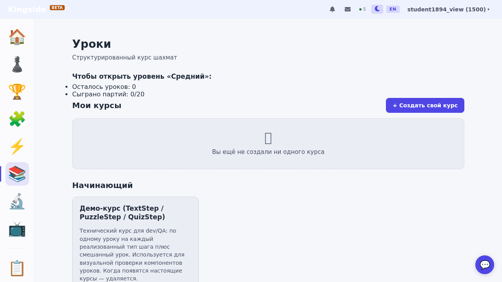

Чтобы создать курс — нажмите кнопку **«+ Создать свой курс»**. Подробнее —
в разделе «[Как создать свой курс](#3-как-создать-свой-курс)».

### Если у вас есть свои курсы

Появляются карточки ваших курсов с пометкой «Публичный» или «Приватный»
и числом уроков. На карточке курса, который вы уже сами прошли,
появляется зелёная отметка **«✓ ПРОЙДЕН»**.

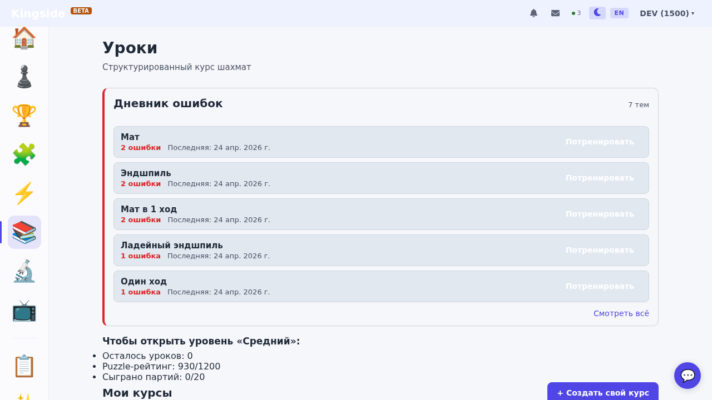

Под карточкой публичного курса видна короткая статистика «N записано · M
прошли» — это число людей, которые открывали ваш курс и успешно его
завершили (см. раздел «[Что видит автор](#5-что-видит-автор-статистика-по-курсу)»).

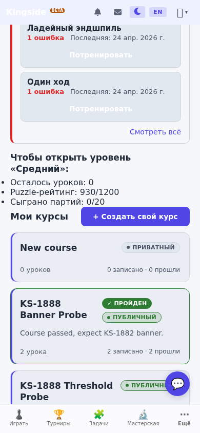

### Если вы проходите чужие курсы

Появляется отдельный блок **«Курсы, которые я прохожу»** — туда
попадают чужие публичные курсы, в которых у вас есть прогресс. Курс
добавится в этот блок автоматически после того, как вы откроете его по
ссылке и сделаете в нём хотя бы один шаг.

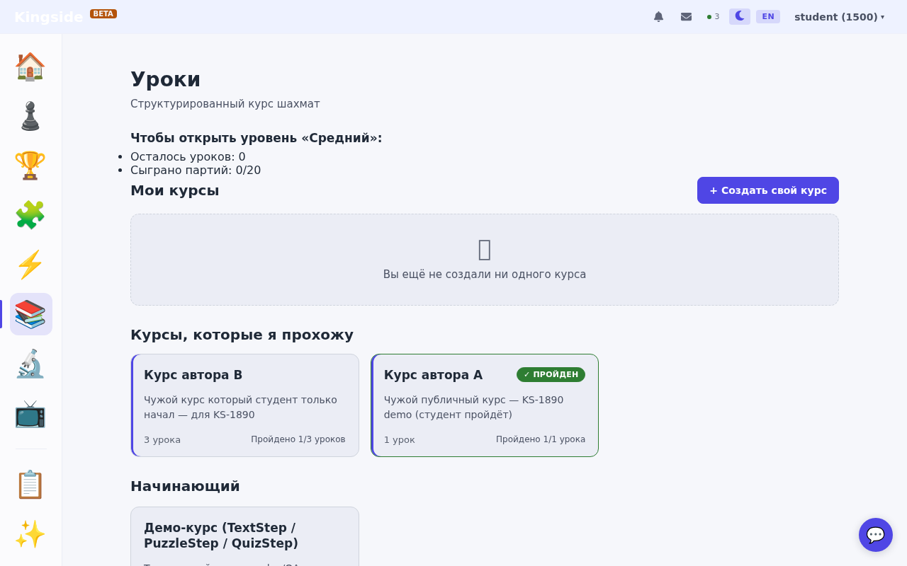

На мобильном устройстве этот же блок выглядит так:

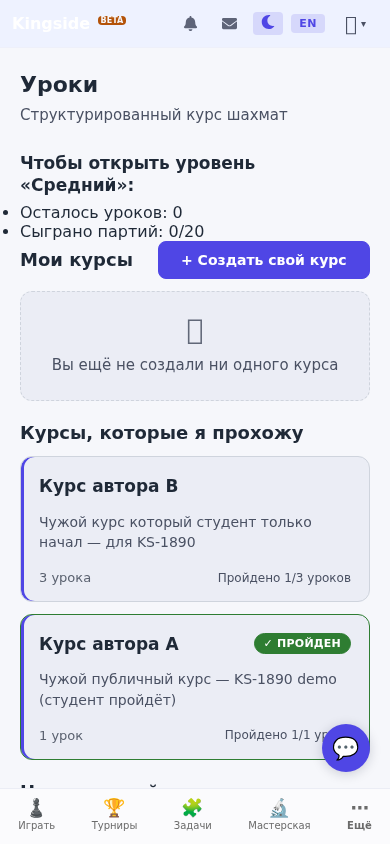

### Полный вид страницы у автора

У автора с несколькими курсами и активным прогрессом по чужим страница
сочетает оба блока:

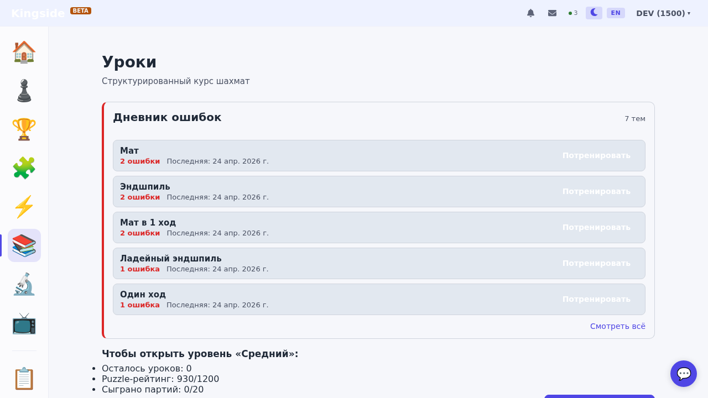

На мобильном:

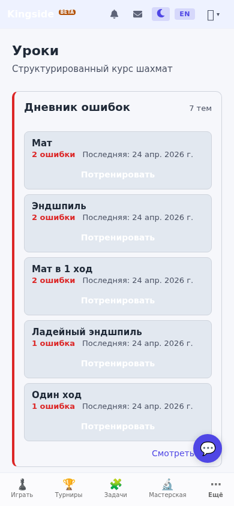

---

## 3. Как создать свой курс

### Шаг 1. Нажмите «+ Создать свой курс»

Кнопка находится в блоке «Мои курсы» на странице `/lessons`. После
клика автоматически создастся черновик курса с пустым названием, и вы
сразу попадёте в редактор.

### Шаг 2. Редактор курса

Слева — список уроков курса (пока пустой), справа — редактор выбранного
урока. Сверху — название курса (его можно поменять прямо здесь),
переключатель «Публичный/Приватный» и меню действий.

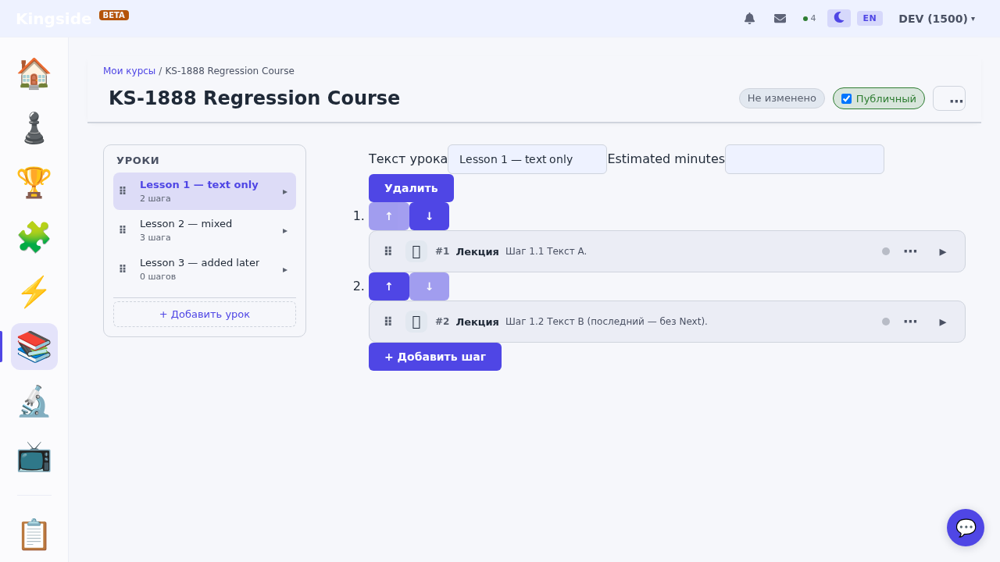

### Шаг 3. Название и описание

Кликните по названию вверху страницы — появится поле редактирования.
Напишите осмысленное название (от 1 до 120 символов) и при желании
короткое описание под ним. Изменения сохраняются автоматически после
паузы в наборе.

### Шаг 4. Публичный или приватный

Переключатель в верхней части редактора:

- **Приватный** (по умолчанию). Курс видите только вы. Никто другой,
  даже зная ссылку, не сможет его открыть.
- **Публичный**. Любой авторизованный пользователь, у которого есть
  ссылка, сможет открыть курс и пройти его.

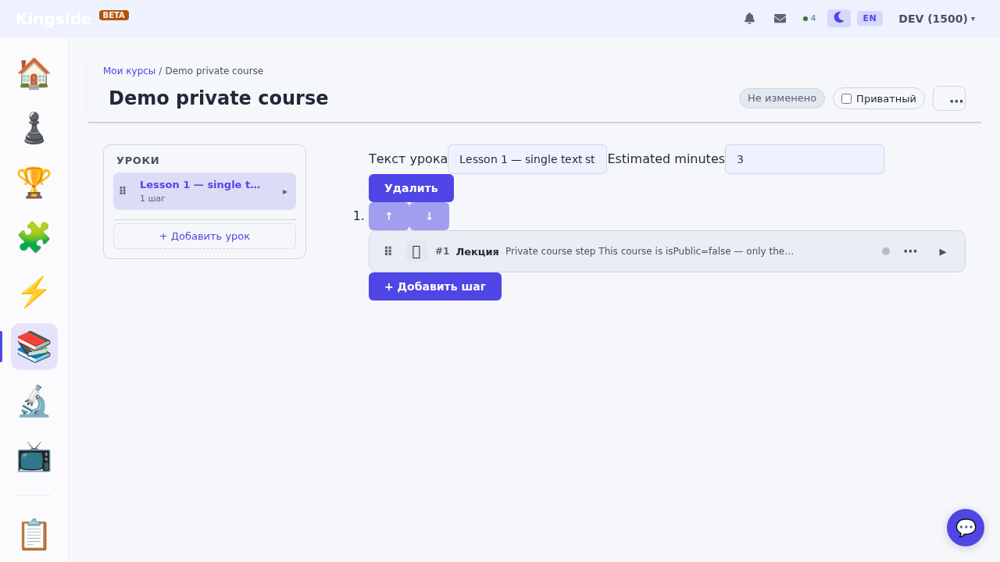

> Сейчас на сайте нет каталога публичных курсов. Это значит: даже
> если вы переключите курс в публичный, посторонние сами его не найдут.
> Чтобы кто-то прошёл ваш курс — отправьте ссылку лично (см. раздел
> «[Известные ограничения](#7-известные-ограничения)»).

### Шаг 5. Добавьте первый урок

Кнопка «+ Добавить урок» в левой колонке создаёт пустой урок. После
создания он появляется в списке и открывается для редактирования
справа. У урока есть своё название и опциональное поле «Примерное
время прохождения» (в минутах).

### Шаг 6. Добавьте шаги в урок

Внутри урока — кнопка «+ Добавить шаг». При нажатии откроется выбор
типа:

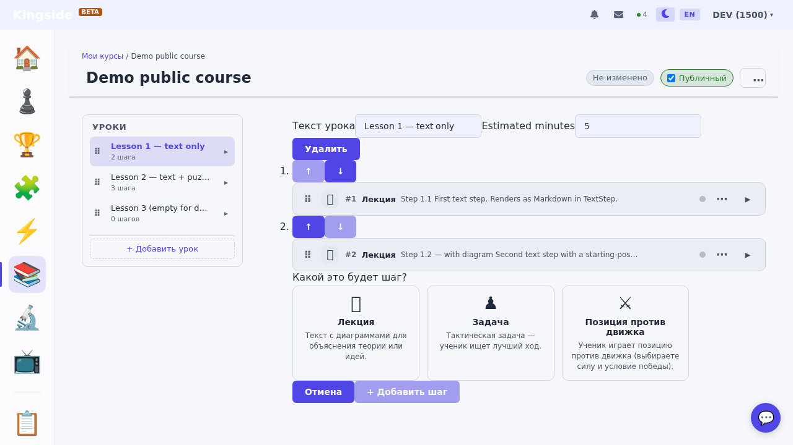

Три типа на выбор:

#### 6a. Теория

Текстовый шаг с поддержкой markdown-разметки. Над полем редактирования
есть панель форматирования: заголовки, жирный текст, списки, ссылки,
вставка диаграммы.

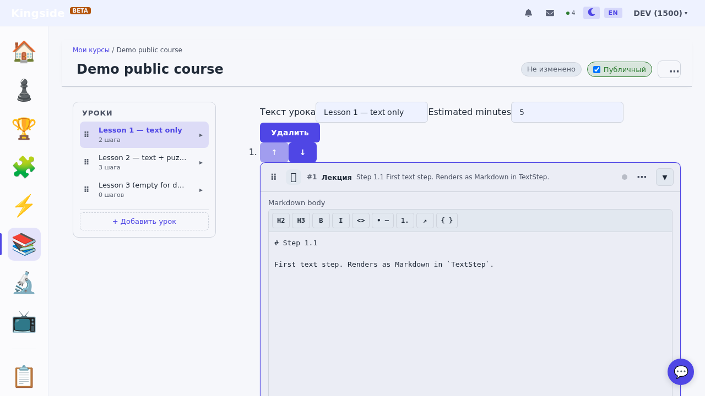

Чтобы вставить шахматную диаграмму, нажмите кнопку с фигурой на
панели или впишите плейсхолдер `{{diagram:0}}` и заполните данные
диаграммы (FEN-позиция, ориентация доски — белые/чёрные снизу,
подпись).

Для диаграммы можно либо ввести FEN вручную, либо собрать позицию
визуально через **редактор доски**. Откройте окно «Set Position» и
выберите вкладку «Board Editor»:

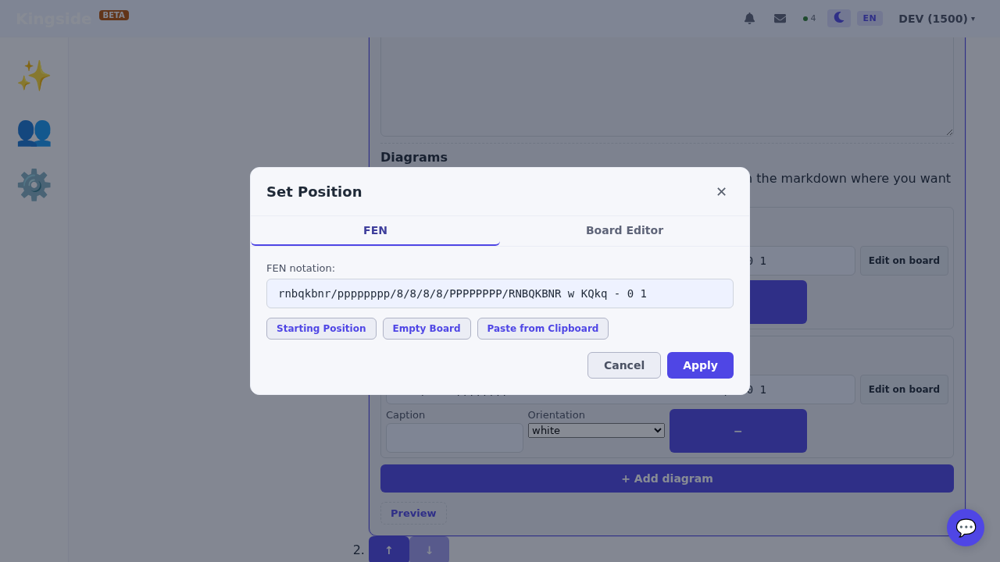

В одном текстовом шаге можно использовать до 20 диаграмм. Сам текст —
до 10 000 символов.

#### 6b. Задача

Шаг с набором шахматных задач. Можно задать набор двумя способами:

- **По фильтру** — указать темы (например, «mateIn1», «pin»,
  «middlegame»), диапазон рейтинга и максимальное число задач (1–20). Сайт
  сам подберёт задачи под эти условия из общей базы.

  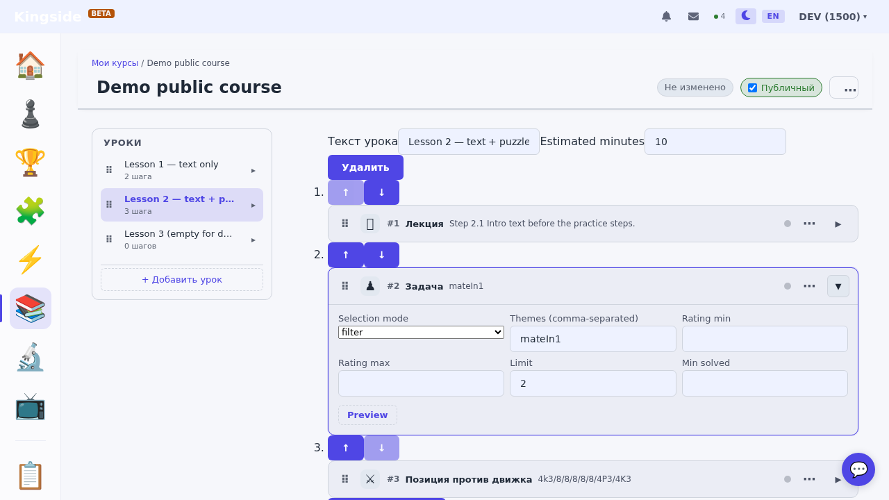

- **По списку** — указать конкретные ID задач из базы (используется
  редко, в основном для специальных учебных подборок).

#### 6c. Эндшпиль

Шаг, в котором ученик играет позицию против движка Stockfish. В
редакторе задаются:

- **FEN** — позиция, с которой начинается игра.
- **Сторона ученика** — белые или чёрные.
- **Уровень движка** — от 0 до 20 (0 — самый слабый, 20 — максимально
  сильный).
- **Условие победы** — мат, выигрыш материала или преимущество по
  оценке.
- **Лимит ходов** и наличие подсказок.

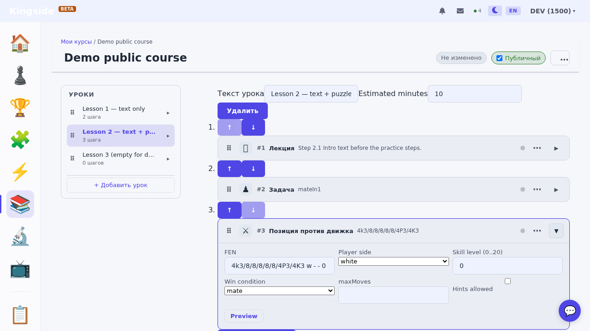

### Шаг 7. Меняйте порядок и удаляйте

- Уроки можно переставлять перетаскиванием в левой колонке.
- Шаги внутри урока — перетаскиванием в правой колонке.
- Удалить урок или шаг — кнопкой в его меню.

Лимиты: до 30 уроков в курсе, до 50 шагов в одном уроке.

### Шаг 8. Опубликуйте

Когда курс готов — переведите переключатель «Публичный/Приватный» в
положение «Публичный». После этого скопируйте ссылку на курс из
адресной строки браузера (она имеет вид `…/lessons/my/<идентификатор>`)
и поделитесь ею.

### Если хотите удалить курс целиком

В меню действий курса выберите «Удалить курс». Откроется окно
подтверждения — введите слово `DELETE` в поле, чтобы подтвердить:

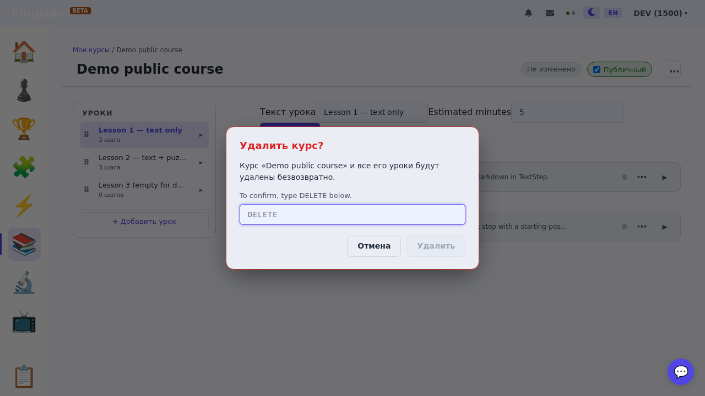

Удаление окончательное. Восстановить курс или прогресс учеников по
нему нельзя.

> **Если у курса уже есть студенты, и вы добавляете в него новый урок:**
> отметка «Курс пройден» у студентов автоматически снимается. Они снова
> увидят свой прогресс как «не завершено», пока не пройдут добавленный
> урок. Это сделано специально — мы не хотим показывать «Курс пройден»
> человеку, который не видел всего курса.

---

## 4. Как пройти курс

### Где взять ссылку

Сейчас единственный способ попасть на чужой курс — **прямая ссылка от
автора**. На сайте нет каталога публичных курсов, поиска по чужим
курсам и ленты «новые курсы». Автор должен сам прислать вам ссылку (в
мессенджере, в почте, где угодно).

Когда вы пройдёте по ссылке впервые, страница курса покажет название,
описание и список уроков, без отметок прохождения:

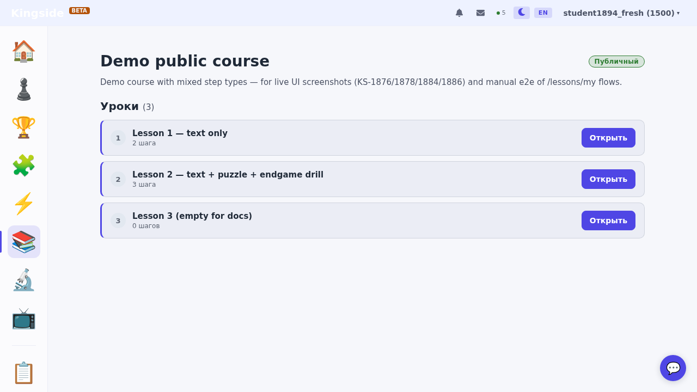

### Откройте урок

Кликните на название первого урока. Откроется страница урока с
прогрессом «0/N (0%)» и списком шагов. У каждого шага слева — серый
кружок «не сделано». Шаги можно проходить по порядку или прыгать в
любой.

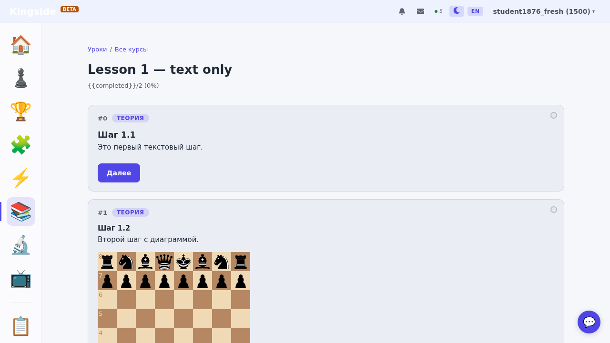

### Что значат значки шагов

- **Серый кружок** — шаг ещё не пройден.
- **Зелёный кружок и зелёная рамка слева** — шаг пройден.
- **Подпись «Пройдено ✓»** — отображается на пройденном шаге вместо
  кнопки «Далее».

### Как засчитывается прохождение шага

#### Теория

Текстовый шаг автоматически отмечается пройденным через 1,5 секунды
после того, как он появился на экране (вы успели его увидеть).
Дополнительно подтверждать ничего не нужно. Кнопка «Далее» под шагом
просто пролистывает к следующему.

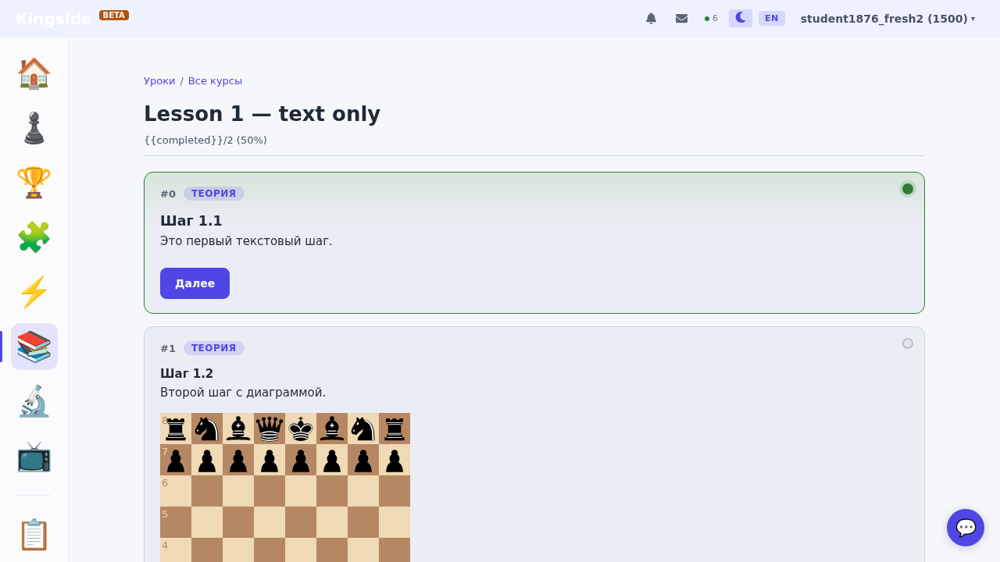

В уроке из нескольких теоретических шагов последний шаг отмечается
пройденным автоматически — для него отдельной кнопки «Далее» нет, но
после короткой паузы все шаги становятся зелёными:

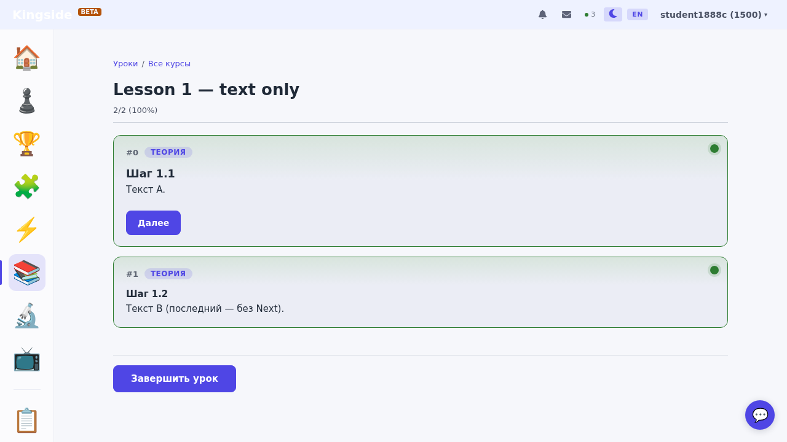

#### Задача

Откроется шахматная доска с позицией задачи. Сделайте правильный ход
(или серию ходов до конца варианта) — задача засчитается. Если
ошиблись — позиция отметится «неверно», и вам предложат следующую
задачу набора. Шаг засчитывается, когда вы решите нужное число задач
из набора (по умолчанию — все).

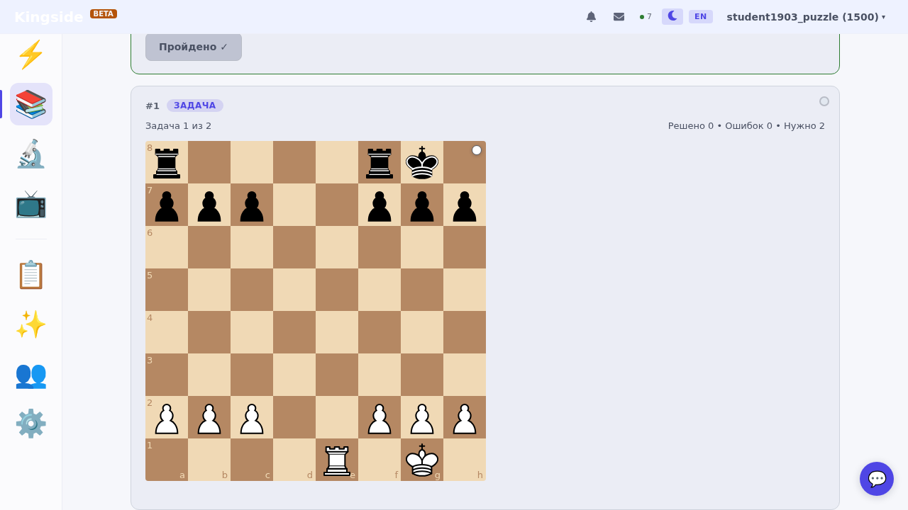

#### Эндшпиль

Откроется доска против Stockfish. Сделайте ход — движок ответит. Цель
— выполнить условие победы, заданное автором (поставить мат, выиграть
материал и т. д.). Когда условие выполнено, шаг автоматически
отмечается пройденным. Если хотите попробовать заново — есть кнопка
«Сдаться» в боковой панели.

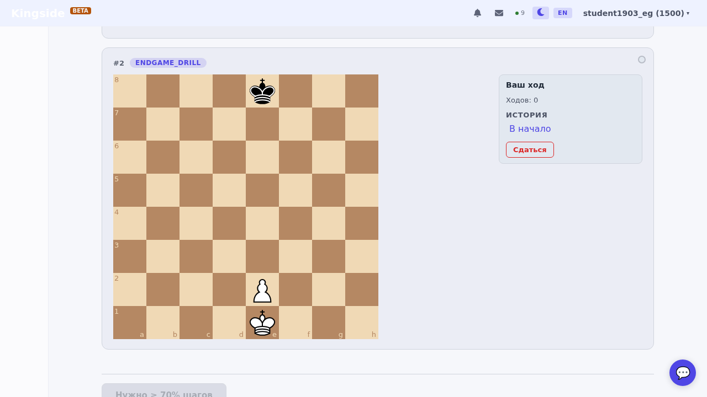

### Когда становится активна кнопка «Завершить урок»

Кнопка под уроком становится активной, когда вы пройдёте **не менее
70%** шагов. То есть в уроке из 3 шагов — после 3 шагов (≈100%); из 4
шагов — после 3 (75%). Можно завершить урок и не дожидаясь 100%, если
один или два шага оказались сложными.

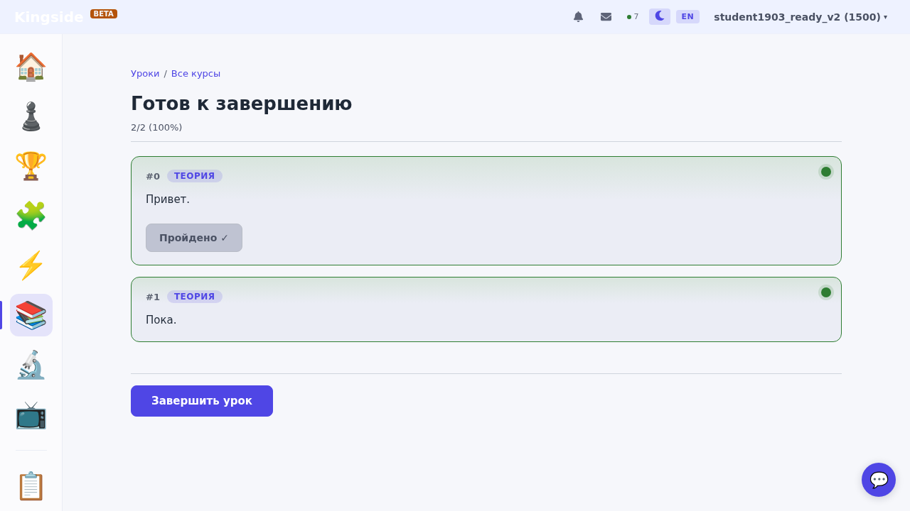

После клика урок отмечается пройденным. Прогресс шагов сохраняется на
сервере — если вы вернётесь на этот урок позже (закроете вкладку,
зайдёте с другого устройства), вы увидите все ранее пройденные шаги
зелёными:

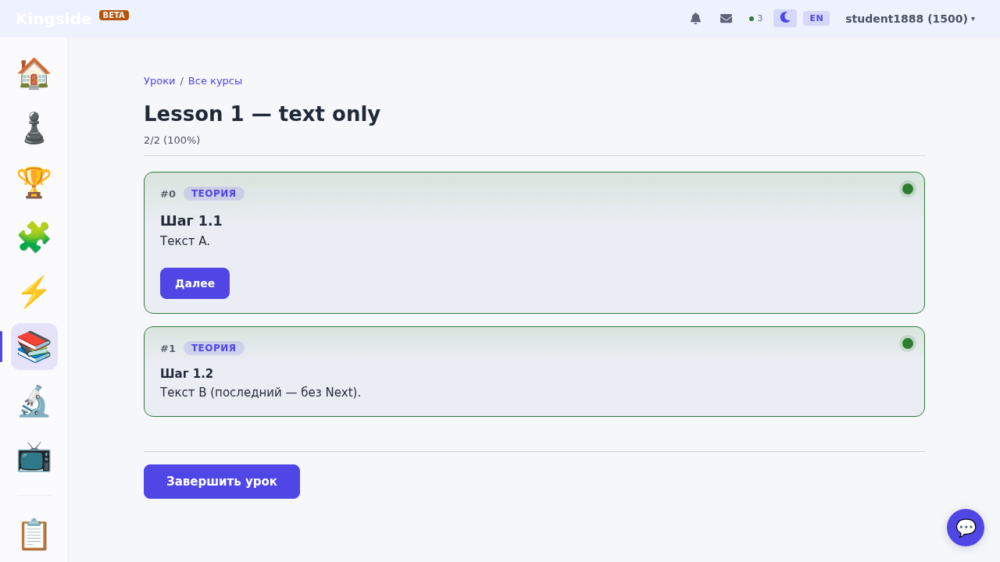

### Что происходит после прохождения курса

Когда вы пройдёте все уроки курса, на странице курса появится баннер
**«✓ Курс пройден _<дата>_»**:

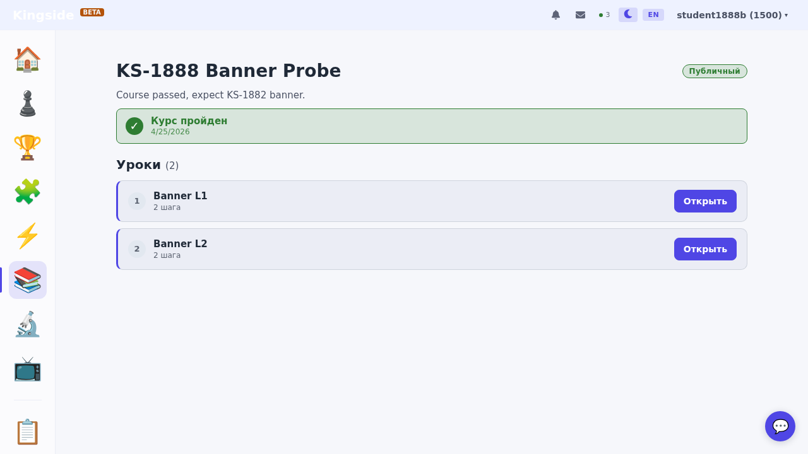

Если автор после этого добавит в курс новый урок, баннер исчезнет —
для вас курс снова станет «не завершён», пока вы не пройдёте новый
урок:

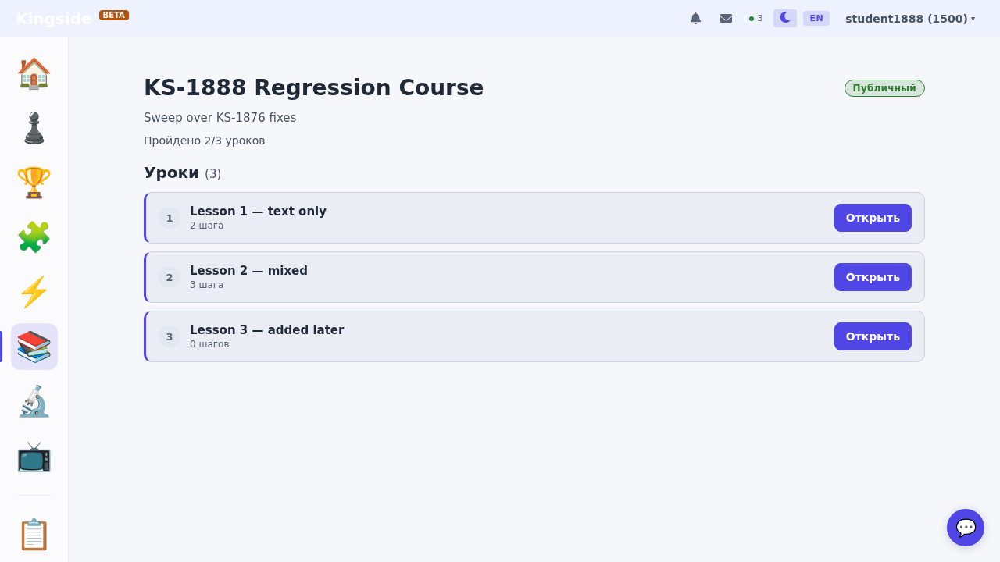

### Урок без шагов

Иногда автор может создать урок, но не успеть его наполнить. В таком
уроке вместо списка шагов вы увидите сообщение, что урок ещё пустой:

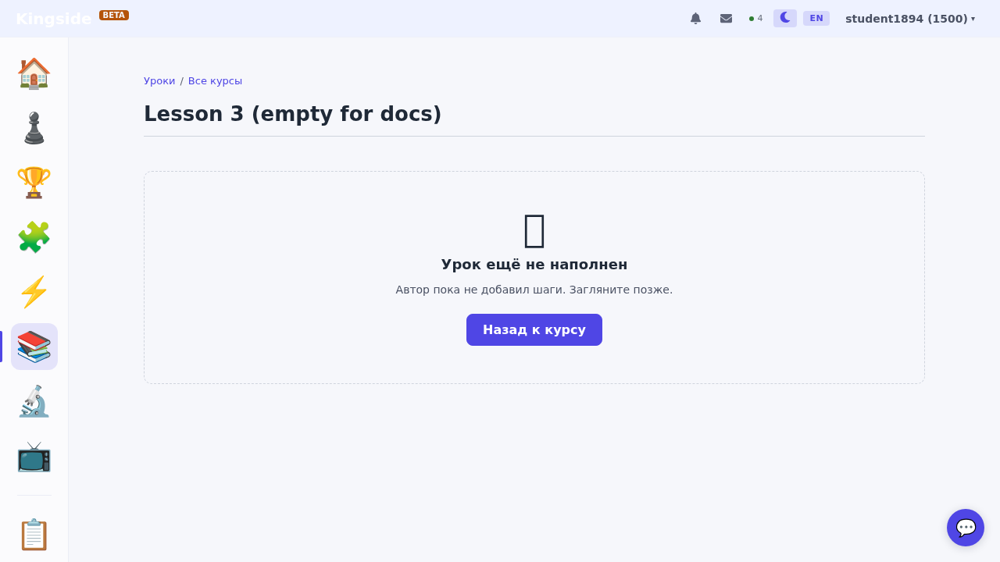

Дождитесь, пока автор добавит содержимое, или просто перейдите к
следующему уроку.

---

## 5. Что видит автор: статистика по курсу

Когда вы заходите на свой собственный публичный курс, на странице
курса появляется блок **«Статистика»** с тремя цифрами:

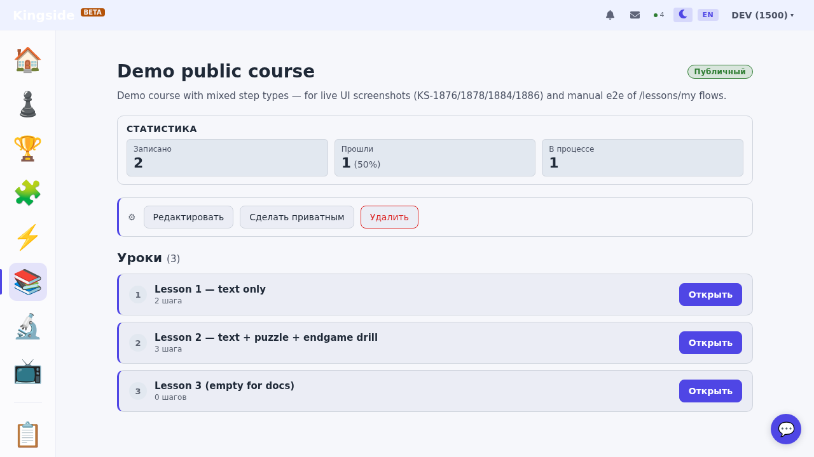

- **Записано** — сколько разных пользователей хотя бы один раз сделали
  шаг в вашем курсе.
- **Прошли** — сколько из них дошли до конца.
- **В процессе** — сколько начали, но ещё не закончили.

Эта статистика видна **только вам, как автору** курса. Студенты, открыв
ваш курс, её не увидят. Имена и профили учеников не показываются — мы
показываем только агрегированные числа.

Та же статистика в компактном виде есть на карточке курса в блоке
«Мои курсы» на странице `/lessons` — строкой «N записано · M прошли»
(см. скриншот в разделе 2).

---

## 6. Очки и рейтинг

Что начисляется за прохождение пользовательского курса:

- **Если в уроке есть шаги-задачи**, попытки решения этих задач идут в
  ваш общий шахматный рейтинг по тактике (тот же puzzle-рейтинг, что
  меняется на странице `/puzzle`). Решили правильно с первой попытки —
  рейтинг растёт; не решили — снижается. Это работает ровно так же,
  как при обычном решении задач вне курса.

Что **не** начисляется:

- За прохождение всего курса как такового **отдельные баллы не
  начисляются**. «Прохождение» отмечается зелёной галочкой в вашем
  списке курсов и баннером «Курс пройден» на странице курса — больше
  ничего.
- Шаги типа «теория» и «эндшпиль» **не влияют** ни на один рейтинг.
  Шахматные партии в эндшпильных шагах идут против движка локально,
  они не считаются как обычные партии и не меняют ваши рейтинги
  (Bullet / Blitz / Rapid / Classical).
- **Прохождение пользовательских курсов не открывает** доступ к
  следующему уровню системных курсов (Beginner / Intermediate /
  Advanced). Эти уровни открываются только прохождением системных
  курсов — это две отдельные системы.

Если коротко: **меняется только тактический рейтинг — и только через
шаги-задачи, как при обычном решении задач**.

---

## 7. Известные ограничения

### Каталога публичных курсов нет

Самое заметное ограничение. На сайте сейчас нет страницы со списком
всех публичных пользовательских курсов, поиска по чужим курсам, ленты
«новые курсы». Раздел «Мои курсы» на главной показывает **только ваши
собственные** курсы; раздел «Курсы, которые я прохожу» — **только те
чужие**, в которых у вас уже есть прогресс.

Это значит:

- Если хотите пройти чужой курс — попросите автора прислать ссылку.
- Если сами сделали курс публичным и хотите, чтобы его прошли другие —
  отправьте ссылку лично (мессенджер, соцсеть, почта). Само по себе
  переключение курса в «публичный» не делает его доступным для
  поиска.

После того как вы откроете чужой курс по ссылке и сделаете в нём хотя
бы один шаг — он появится в блоке «Курсы, которые я прохожу» на
главной, и заходить заново по ссылке не придётся.

### Только 3 типа шагов

В пользовательских курсах поддерживаются только три типа шагов:
теория, задача, эндшпиль. Видеоуроки, разборы партий, дебютные
тренажёры в пользовательских курсах создавать пока нельзя — это есть
только в системных курсах сайта.

### Курсы не переводятся

Название и текст пользовательского курса хранятся в том языке, на
котором его написал автор. Автоматического перевода на другие языки
сайт не делает. Если вы пишете курс на русском, англоязычный
пользователь увидит русский текст как есть.

### Нельзя сделать копию чужого курса

Сейчас нельзя «форкнуть» чужой публичный курс, чтобы сделать его
собственную версию. Можно только пройти его как студент.

---

## Приложение: что показано на скриншотах документа

Скриншоты сделаны на демо-курсах сайта:

- **Demo public course** — публичный курс с двумя уроками (один —
  только теория, второй — теория + задача + эндшпиль).
- **Demo private course** — приватный курс с одним уроком.

Все скриншоты в папке `screenshots/user-courses/` рядом с этим
документом.
