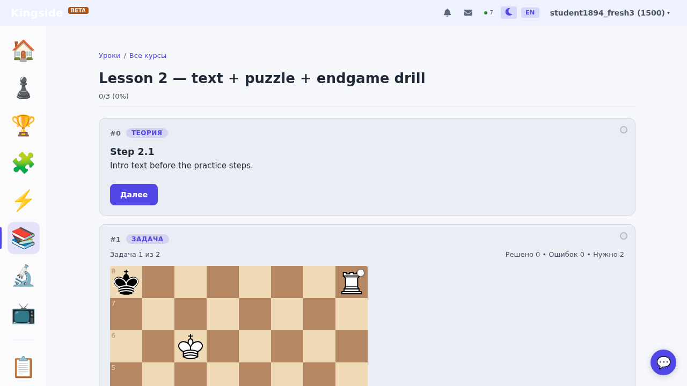
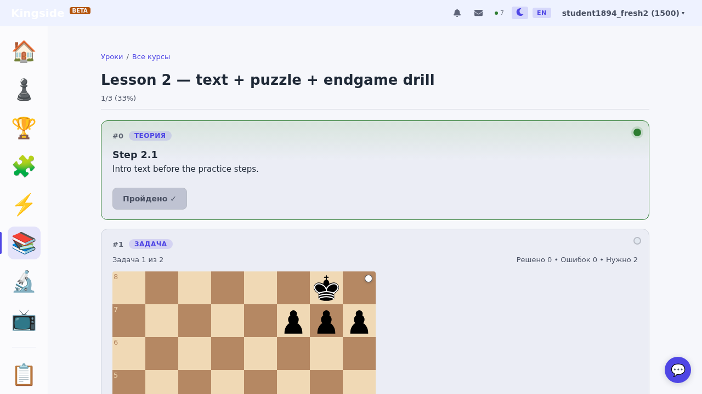

# Раздел «Мои курсы» (user-courses) — пользовательская документация

**Автор:** architect (KS-1894)
**Дата:** 2026-04-25
**Архитектура:** [ADR-026](../adr/026-user-courses.md)
**Связанные пакеты:** KS-1827 (план), KS-1876 (диагностика), KS-1888 (регрессия), KS-1874/1875/1877–1887, KS-1889–1892

Документ описывает фичу «Мои курсы» (user-courses) с точки зрения пользователя:
кто что видит, как создавать и проходить, как считается прогресс, что начисляется
за прохождение, известные ограничения. Скриншоты сделаны на dev-стенде с seed'ом
из KS-1887 (`demo-public-course` / `demo-private-course`).

---

## Оглавление

1. [Обзор раздела](#1-обзор-раздела)
2. [Роли и видимость](#2-роли-и-видимость)
3. [Создание и редактирование курса (автор)](#3-создание-и-редактирование-курса-автор)
4. [Прохождение курса (студент)](#4-прохождение-курса-студент)
5. [Метрики автора](#5-метрики-автора)
6. [Очки и рейтинг — что начисляется](#6-очки-и-рейтинг--что-начисляется)
7. [Известные ограничения и баги](#7-известные-ограничения-и-баги)
8. [Setup для воспроизведения](#8-setup-для-воспроизведения)

---

## 1. Обзор раздела

«Мои курсы» — это **пользовательские курсы**: любой авторизованный пользователь
может собрать собственный курс из набора шагов трёх типов и поделиться им
по прямой ссылке.

В отличие от **системных «уроков уровня»** (`/lessons` → блоки Beginner /
Intermediate / Advanced, наполняются seed'ом backend-агента, проходят через
i18n) пользовательские курсы:

- **Без i18n** — `title`, `description`, `bodyMarkdown` хранятся как plain-text
  в языке автора (ADR-026 §2.7).
- **Без SM-2** — пройденные пользовательские уроки **не попадают** в блок «К
  повторению сегодня» (ADR-026 §2.1, §7).
- **Без участия в level-gate** — прохождение пользовательских курсов **не
  засчитывается** в условие «курс beginner/intermediate завершён» (см.
  раздел 6).
- **Параллельные таблицы** в БД: `UserCourse`, `UserLesson`, `UserLessonStep`,
  `UserCoursePlayProgress`, `UserLessonPlayProgress` — не пересекаются с
  системными `Course`/`Lesson`/`LessonStep`.

Поддерживаемые типы шагов (whitelist MVP, `UserStepType`):
- **`text`** — лекция: markdown с WYSIWYG-toolbar и FEN-диаграммами
  (read-only) через плейсхолдеры `{{diagram:N}}`.
- **`puzzle`** — практика: набор задач из базы Lichess (фильтр по темам и
  рейтингу или явный список ID).
- **`endgame_drill`** — позиция против Stockfish WASM (FEN, выбранная сторона,
  `skillLevel` 0..20, условие победы).

Лимиты на одного пользователя (ADR-026 §2.2): 20 курсов, 30 уроков на курс,
50 шагов на урок.

---

## 2. Роли и видимость

### 2.1 Три роли

| Роль | Кто это | Что видит на `/lessons` |
|---|---|---|
| **Не-залогиненный** | Гость без JWT | Только системные курсы. Блок «Мои курсы» не рендерится (см. `MyCoursesBlock` — early return при отсутствии `user`). Блок «Курсы, которые я прохожу» — тоже не рендерится. |
| **Студент** | Авторизованный, без своих курсов и/или с прогрессом по чужим публичным | Системные курсы + блок «Мои курсы» (CTA «+ Создать свой курс», пустое состояние с объяснением). Если есть прогресс по чужим публичным — блок «Курсы, которые я прохожу» (KS-1890). |
| **Автор** | Авторизованный, у которого есть свои `UserCourse` | Системные курсы + блок «Мои курсы» с собственными карточками (бейдж «Публичный»/«Приватный», бейдж «✓ Пройден» если автор сам прошёл, компактный счётчик stats — KS-1886) + блок «Курсы, которые я прохожу» если он проходит чужие публичные. |

Один и тот же пользователь может быть одновременно автором одних курсов и
студентом других — UI показывает оба блока. Роль определяется по контексту,
не отдельным флагом.

### 2.2 `isPublic`: что меняется

`UserCourse.isPublic` — единственный флаг видимости. Других уровней нет
(нет «friends only», «followers», «password-protected»).

| `isPublic` | Кто может зайти на `/lessons/my/<slug>` | Кто может пройти | Кто видит в `/lessons` |
|---|---|---|---|
| `true` (публичный) | Любой авторизованный с прямой ссылкой | Любой авторизованный — попытки идут в его `UserLessonPlayProgress` | Только владелец (в блоке «Мои курсы»); студенты с прогрессом — в блоке «Курсы, которые я прохожу» |
| `false` (приватный) | Только владелец. Чужому — 404 (не 403, единый код от enumeration — ADR-026 §2.5) | Только владелец | Только владелец |

> **Важно:** «публичный» — не означает «опубликованный в каталоге». Каталога
> нет, см. [раздел 7](#7-известные-ограничения-и-баги). Студент попадает на
> публичный курс **только по прямой ссылке от автора**.

### 2.3 Скриншоты — что видят разные роли на `/lessons`

#### Автор (DEV) с тремя курсами и прогрессом


Видны: блок «Мои курсы» с тремя карточками (бейдж публичный/приватный, для
пройденных — `✓ ПРОЙДЕН`), компактные stats `2 записано · 2 прошли` под
карточкой публичного курса. Системные курсы ниже.

#### Свежий студент без прогресса по пользовательским курсам


Блок «Мои курсы» — пустое состояние с CTA «+ Создать свой курс».
**EnrolledCoursesBlock не отображается**, потому что у пользователя нет
`UserCoursePlayProgress` ни по одному чужому публичному курсу. Это
иллюстрирует known gap: каталога публичных курсов нет, попасть на чужой
публичный курс можно только по прямой ссылке.

#### Студент, проходящий чужие публичные курсы — блок «Курсы, которые я прохожу»


Появляется только после первого `step done`/`complete` на чужом публичном
курсе (KS-1889/1890). Скрыт, если список пуст.

---

## 3. Создание и редактирование курса (автор)

### 3.1 Создание пустого курса

Точка входа — кнопка «**+ Создать свой курс**» в блоке «Мои курсы» на
`/lessons`. По клику фронт делает `POST /api/lessons/user-courses` с
`{ title: 'Новый курс' }` и редиректит на `/lessons/my/<slug>/edit`.

Сервер (см. `UserCoursesService.create` в
`apps/api/src/lessons/user-courses/user-courses.service.ts`):
1. Проверяет лимит — не более 20 курсов на пользователя (409 при
   превышении; ADR-026 §2.2).
2. Генерирует `slug` вида `<short-id>-<slug-from-title>` (например,
   `a4f2e1-novyj-kurs`) — `slug.service.ts`. Можно передать кастомный slug
   в запросе.
3. По умолчанию `isPublic = false`.
4. Применяет rate-limit 10 req/min на пользователя.

### 3.2 Редактор курса

Маршрут `/lessons/my/:slug/edit`, страница `UserCoursePage` в
edit-режиме (компонент `UserCourseEditor` в
`apps/web/src/components/lessons/editor/user/UserCourseEditor.tsx`).

Структура (десктоп):
- **Header** — `title` (inline edit), переключатель `isPublic`, меню
  owner-actions, индикатор сохранения (`SaveStatusPill`).
- **Левая колонка** — список уроков, drag-handle для reorder, «+ Добавить
  урок».
- **Правая колонка** — редактор выбранного урока: `title`, `estMinutes`,
  список шагов (DnD reorder), «+ Добавить шаг».


WYSIWYG-toolbar (KS-1874): `H2 H3 B I <code> • — 1. ↗ { }` — добавляет
markdown-разметку в `bodyMarkdown` курсором. Плейсхолдеры `{{diagram:N}}`
ссылаются на FEN-диаграмму из массива `payload.diagrams[N]`.

### 3.3 Заголовок, описание, флаг публичности

- `title` — 1..120 символов, обязательное.
- `description` — 0..1000 символов.
- `isPublic` — переключатель в header'е. Изменения сохраняются через
  `PATCH /api/lessons/user-courses/:id` (debounced auto-save).


### 3.4 Добавление и удаление уроков

`POST /api/lessons/user-courses/:id/lessons` создаёт пустой урок (`title`,
опционально `estMinutes`). Лимит — 30 уроков на курс.

**Caveat — atomic invalidation (KS-1881):** если автор добавляет новый урок
к курсу, который у студентов уже отмечен как пройденный
(`UserCoursePlayProgress.completedAt != null`) — сервер **сбрасывает
`completedAt = null`** у всех записей прогресса этого курса. Счётчик
`completedLessonsCount` НЕ обнуляется (это исторический факт «прошёл столько
уроков»), сбрасывается только маркер «весь курс пройден». UI студента
теряет баннер «Курс пройден» до момента, когда он пройдёт новый урок и снова
достигнет 100%.

Реализация: `UserCoursesService.addLesson` ставит `completedAt = null` в
одной транзакции с созданием урока.

Удаление уроков (`DELETE /api/lessons/user-lessons/:id`) и шагов
(`DELETE /api/lessons/user-lesson-steps/:id`) — каскадное (`onDelete:
Cascade`), сносит связанные `UserLessonPlayProgress` / `stepsState`.

Reorder уроков: `POST /api/lessons/user-courses/:id/lessons/reorder` с
полным списком id (KS-1862, см. `ReorderUserLessonsRequest`).

### 3.5 Добавление шагов трёх типов

При клике «+ Добавить шаг» открывается **StepTypePicker**:


#### `text` — Лекция

Markdown-редактор с toolbar (KS-1874), поддержка FEN-диаграмм через
`{{diagram:N}}` и `payload.diagrams[]`. Каждой диаграмме — FEN, ориентация
(`white` / `black`), caption.

Board Editor (KS-1875): рядом с полем FEN — кнопка «Edit on board»,
открывает модалку с табами FEN / Board Editor для сборки позиции через UI.


Лимиты (ADR-026 §2.2): `bodyMarkdown` ≤ 10 000 символов, до 20 диаграмм.

#### `puzzle` — Задача

Filter-mode (темы из набора Lichess + диапазон рейтинга + лимит) или
ids-mode (явный список `puzzleIds`).


Лимит `filter.limit` — 1..20 (для пользовательских; в системных до 100).
Резолвится через `POST /api/lessons/puzzle-step/resolve` (тот же endpoint, что и
у системных шагов; `PuzzleResolverService`).

#### `endgame_drill` — Позиция против движка

Поля: `fen`, `playerSide` (`white`/`black`), `skillLevel` 0..20, `winCondition`
(объект `{ kind: 'mate' | 'material_gain' | 'eval_advantage' | 'checkmate' }`,
KS-1877), `maxMoves`, `hintsAllowed`.


> **Историческое замечание:** UI-label «Позиция против движка», но в БД и
> shared-типах — `endgame_drill` (ADR-026 §2.3). Не переименовываем для
> совместимости с системными курсами.

### 3.6 Reorder шагов внутри урока

DnD по списку шагов в правой колонке editor'а; на сервер уходит
`POST /api/lessons/user-lessons/:id/steps/reorder` с массивом id в новом
порядке (атомарная транзакция).

### 3.7 Публикация / приватность

Toggle `isPublic` в header'е editor'а. После переключения в `true` курс
становится доступен по прямой ссылке любому авторизованному. Каталога нет
(см. раздел 7) — ссылку придётся раздать самостоятельно.

### 3.8 Удаление курса

Owner-action «Удалить курс» в меню header'а. Открывается
`DeleteCourseDialog` с защитой: для подтверждения нужно ввести `DELETE` в
поле:


`DELETE /api/lessons/user-courses/:id` каскадно сносит уроки, шаги, прогресс
всех учеников. Восстановление невозможно.

---

## 4. Прохождение курса (студент)

### 4.1 Как попасть на курс

**Только по прямой ссылке** — `/lessons/my/<slug>` или
`/lessons/my/<slug>/<lessonId>`. Каталога публичных курсов нет (см.
[раздел 7](#7-известные-ограничения-и-баги)). Если курс приватный, чужому —
404.


Студенту видны: title/description курса, список уроков (без owner-actions),
бейдж «Публичный». **Stats не видны** — KS-1885 enforce'ит, что
`course.stats` возвращается только владельцу.

### 4.2 Открытие урока, индикаторы шагов

Маршрут `/lessons/my/:slug/:lessonId` — `UserLessonPage`. В шапке —
прогресс `<done>/<total> (<percent>%)`, кнопка «Завершить урок» (disabled,
пока не достигнут порог 70%, см. 4.4). Каждый шаг отрисовывается через
общий `StepRenderer` с `data-step-state="pending|done"` (визуально: серый /
зелёный кружок и зелёная рамка слева у `done`).



После взаимодействия:



### 4.3 Прохождение шагов по типам

#### `text`

- Auto-done через 1.5 секунды после mount (KS-1878). Шаги, которые не
  успели проскроллиться/срендериться, остаются `pending`, но как только
  пользователь до них доходит — они авто-помечаются.
- Кнопка «Далее» — для перехода/прокрутки между шагами (последний шаг —
  без кнопки «Далее», см. KS-1878 для решения проблемы тупика из KS-1876).
- Уже пройденный шаг показывает «**Пройдено ✓**» вместо кнопки «Далее»
  (KS-1891).


#### `puzzle`

Решение задачи в `PuzzleStep` (`apps/web/src/components/lessons/steps/PuzzleStep.tsx`):
- Резолв набора задач через `POST /api/lessons/puzzle-step/resolve`.
- На каждый ход — попытка пишется в **общую таблицу `PuzzleAttempt`**
  через `puzzleApi.submitAttempt(...)`. Это значит, что попытки в
  пользовательских курсах **влияют на общий puzzle-rating** (см. раздел 6).
- Шаг считается done, когда `solved >= payload.minSolved` (по умолчанию —
  все задачи набора). Тогда вызывается `onStepDone()` → `POST
  /api/lessons/user-progress/lessons/:id/step` со state `done`.

#### `endgame_drill`

`EndgameDrillStep` (`apps/web/src/components/lessons/steps/EndgameDrillStep.tsx`):
- Игра против Stockfish WASM (`useStockfish`), полностью на клиенте.
- Никаких записей в БД партии — нет ни `Game`, ни `PuzzleAttempt`.
- Шаг done, когда выполнено `winCondition` (мат / материальное
  преимущество / eval-преимущество), вызывается `onStepDone()`.

### 4.4 Прогресс шага: stepsState и идемпотентность (KS-1879/1880)

`UserLessonPlayProgress.stepsState` — JSON-объект `{ [stepId]:
'done'|'failed'|'skipped' }`. Сервер пересчитывает `completedStepsCount`
как `count('done')` из `stepsState` (а не отдельным инкрементом). Свойства:

- **Идемпотентность по `stepId`:** двойной `POST step done` с тем же
  `stepId` → счётчик не растёт (KS-1879).
- **Восстановление при повторном открытии (KS-1880):** при возврате на
  ранее пройденный урок сервер отдаёт `stepsState`, фронт гидрирует хук
  `useUserLessonProgress` — все сделанные шаги сразу зелёные:


- **Снижение состояния:** допустимо переслать `failed`/`skipped` для шага,
  ранее помеченного `done` — счётчик пересчитается соответственно.

### 4.5 Threshold 70% и завершение урока (KS-1883)

Кнопка «Завершить урок» активируется на клиенте при
`count('done') / totalSteps >= 0.7`. Константа:
`USER_LESSON_COMPLETION_THRESHOLD = 0.7` в
`packages/shared/src/constants.ts`.

Клик отправляет `POST /api/lessons/user-progress/lessons/:id/complete`.
Сервер enforce'ит то же значение (KS-1883):
- **Поле `score` в payload игнорируется** (`_score` параметр в
  `UserProgressService.completeLesson`) — обход через curl или скрипт
  невозможен.
- Серверный `serverScore` считается по реально сохранённому `stepsState`:
  `count('done') / totalSteps`. Если меньше 0.7 — `400 Lesson not
  completable: server score X% (n/m) is below threshold 70%`.
- Для урока без шагов (`totalSteps = 0`) гейт не применяется (degenerate-
  кейс — нечего блокировать), `complete` проходит сразу. Это используется
  при пустых уроках (см. 4.7) и не считается багом — заблокировать пустой
  урок «прохождением шагов» по построению нельзя.

При успешном `complete`:
- `UserLessonPlayProgress.completedAt = now()`.
- `stepsState` дозаполняется до финального snapshot'а: pending-шаги
  становятся `done`, пользовательские `failed`/`skipped` сохраняются.
- `UserCoursePlayProgress.lastActivityAt = now()`,
  `completedLessonsCount += 1` (только если урок не был завершён ранее —
  идемпотентность по флагу `wasAlreadyCompleted`).

### 4.6 Завершение курса и баннер (KS-1881/1882)

Когда после `completeLesson` выполняется
`completedLessonsCount >= totalLessonsInCourse` (`totalLessonsInCourse` —
актуальный `userLesson.count` для курса, не кешированный), сервер
впервые ставит `UserCoursePlayProgress.completedAt = now()` (KS-1881
`touchUserCourseProgress`).

Студент видит баннер «**✓ Курс пройден** _<дата>_»:


В блоке `/lessons` → «Мои курсы» (для автора, прошедшего собственный
курс) — у карточки появляется бейдж «✓ ПРОЙДЕН» и компактные stats:


**Carve-out (KS-1881):** если автор после завершения курса добавляет
новый урок — `addLesson` транзакционно сбрасывает `completedAt = null`
для всех записей прогресса. Баннер у студентов исчезает; вернётся, когда
они пройдут новый урок:


### 4.7 Empty-state урока без шагов (KS-1892)

Если автор создал урок, но не добавил ни одного шага, студент видит
empty-state вместо ошибки 500/пустой страницы:


Это состояние корректно поддерживается на сервере (`UserLessonPlayProgress`
не создаётся до первого `step`/`complete`, `getLessonProgress` отдаёт `null`)
и на фронте (`AddStepEmptyState` / `AddLessonEmptyState`).

---

## 5. Метрики автора (KS-1885 / KS-1886)

### 5.1 Что считается

`UserCourseStatsDto` (`packages/shared/src/types/user-courses.ts`):
- `enrolledCount` — `COUNT(UserCoursePlayProgress)` по `userCourseId`.
- `completedCount` — `COUNT(...) WHERE completedAt IS NOT NULL`.
- `inProgressCount` — `enrolledCount - completedCount`.

Свежесть — на момент запроса. Кеша на FE нет; refresh через re-fetch.

### 5.2 Где видно

#### Блок Statistics на странице курса


Блок виден **только владельцу** (KS-1885 — сервер не вкладывает поле
`stats` в DTO для не-владельцев). У не-владельца поле `course.stats`
отсутствует (`undefined`).

#### Компактный счётчик в карточке `/lessons` (KS-1886)


Под title карточки своего курса — строка «N записано · M прошли».

### 5.3 Чего НЕТ в метриках

- Список конкретных учеников (имена, профили) — не отдаётся, нет UI.
- Средний балл, время прохождения, поэтапные конверсии — не считаются.
- Ratings, scoring учеников — не отдаются (см. раздел 6 — никакого
  «балла за прохождение» не существует).

---

## 6. Очки и рейтинг — что начисляется

> **Это ключевой раздел задачи.** Разобрался по коду. Краткий ответ:
> **за прохождение пользовательского курса как такового — НИЧЕГО не
> начисляется. Косвенно влияет только puzzle-rating (через попытки в
> puzzle-шагах) — на тех же условиях, что и обычный `/puzzle`.**

### 6.1 puzzle-rating — ДА, начисляется через puzzle-шаги

`PuzzleStep` (`apps/web/src/components/lessons/steps/PuzzleStep.tsx`,
строки 180–185) при каждом ходе ученика вызывает
`puzzleApi.submitAttempt(puzzleId, { result, timeMs, userMoves })`.

Бэкенд (`apps/api/src/puzzle/puzzle.service.ts`, строки 320–358):
- Создаёт запись `PuzzleAttempt`.
- Если задача решается **впервые** (`!isRetry`) — вызывает
  `PuzzleRatingService.applyRatingChange(userId, puzzleId, solved)`,
  который применяет Glicko-2 update к `User.ratingPuzzle` и
  `User.ratingPuzzleDev` (`puzzle-rating.service.ts`, строки 33–60).
- Re-try той же задачи (по `userId, puzzleId, solved=true` уже
  существует) — без изменения рейтинга.

Контракт у пользовательских курсов **тот же, что у системных** и `/puzzle`:
puzzle-step в user-курсе = puzzle-attempt = potential rating change.
Никаких уникальных правил «множитель за курс автора», «бонус за
прохождение» — нет.

**Потенциальное последствие:** студент, проходящий пользовательский курс с
puzzle-шагами, повышает (или роняет) свой `ratingPuzzle` ровно так же, как
если бы решал эти задачи на `/puzzle`. Это, в свою очередь, влияет на
level-gate (см. 6.3).

### 6.2 endgame_drill — НЕТ, никакого рейтинга

`EndgameDrillStep` (`apps/web/src/components/lessons/steps/EndgameDrillStep.tsx`):
- Stockfish WASM на клиенте.
- Нет вызовов в API партии (`/games/*`), нет `PuzzleAttempt`.
- Только `onStepDone()` → `POST /lessons/user-progress/lessons/:id/step`
  с `state='done'`.
- Никаких изменений в `User.ratingRapid`/`ratingBlitz`/etc.
- Никаких начислений в `User.ratingPuzzle` (это не puzzle).

### 6.3 level-gate — НЕТ, прохождение user-курсов не учитывается

`LevelGateService.courseCompletionBlocker` (`apps/api/src/lessons/level-gate.service.ts`,
строки 221–247) проверяет завершение **исключительно системных** курсов:

```ts
const course = await this.prisma.course.findUnique({  // <-- системная Course
  where: { slug },
});
const completed = await this.prisma.userLessonProgress.count({  // <-- системный UserLessonProgress
  where: {
    userId,
    completedAt: { not: null },
    lesson: { courseId: course.id, isPublished: true },
  },
});
```

Таблицы `UserCourse`/`UserLesson`/`UserCoursePlayProgress`/`UserLessonPlayProgress`
**не упоминаются** в `LevelGateService` ни одной строкой кода. Прохождение
любого числа пользовательских курсов **никак не двигает** показатель «Осталось
уроков: N» в шапке `/lessons` и не открывает переход beginner → intermediate
или intermediate → advanced.

Косвенный эффект (через 6.1): если в user-курсе много puzzle-шагов и студент
их решает — растёт `ratingPuzzle` и счётчик `PuzzleAttempt.solved`. Эти
показатели сами по себе участвуют в level-gate:
- **Beginner → Intermediate:** требуется `ratingPuzzle >= 1200`.
- **Intermediate → Advanced:** `ratingPuzzle >= 1700`, решено ≥ 500
  задач (`PuzzleAttempt.solved=true`).

Но это влияние **через общий пул задач**, не через факт прохождения курса.

### 6.4 score у пользовательского урока — игнорируется

В DTO `CompleteUserLessonRequest` есть поле `score: number` (0..1) — но
сервер его явно не использует:

```ts
async completeLesson(
  userId: string,
  userLessonId: string,
  _score: number,  // <-- подчёркивание = игнорируется
): Promise<UserLessonPlayProgressDto> {
  // ...
  // serverScore считается по count('done') в stepsState, не из payload
}
```

`UserLessonPlayProgress` в БД **не имеет колонки `score`** (см.
`packages/db/prisma/schema.prisma` — поля `completedStepsCount`,
`totalSteps`, `stepsState`, `completedAt`, но не `score`). Никакого
«балла за урок» в системе не сохраняется и UI его не показывает.

### 6.5 SM-2 (повторения) — НЕТ

Пользовательские уроки **не подключены к SM-2** (ADR-026 §2.1, §7).
Прохождение пользовательского урока:
- НЕ создаёт `LessonReview`-запись.
- НЕ влияет на `dueAt` ни одного существующего ревью.
- НЕ показывается в блоке «К повторению сегодня» на `/lessons`
  (`ReviewsDueBlock` смотрит только в `LessonReview`, не в
  `UserLessonPlayProgress`).

### 6.6 Нагрузочная сводка по очкам

| Сущность | Что начисляется при прохождении user-курса | Источник |
|---|---|---|
| `User.ratingPuzzle` / `ratingPuzzleDev` | **Да**, только через puzzle-шаги (Glicko-2) | `PuzzleStep.submitAttempt → PuzzleService → PuzzleRatingService` |
| `User.ratingRapid` / `ratingBlitz` / `ratingBullet` / `ratingClassical` | Нет | endgame_drill — не игра в партию |
| `User.gamesPlayed*` | Нет | то же |
| `PuzzleAttempt.solved` count | **Да**, через puzzle-шаги (на тех же условиях, что `/puzzle`) | `PuzzleService.submitAttempt` |
| `LessonReview` (SM-2) | Нет | ADR-026 §2.1 — не подключено |
| `UserLessonProgress` (системный) | Нет | другая таблица; user-courses пишут в `UserLessonPlayProgress` |
| Level-gate progress (`Осталось уроков: N`) | **Нет напрямую**, только через `ratingPuzzle` и `PuzzleAttempt.solved` (косвенно) | `LevelGateService.courseCompletionBlocker` смотрит только на системную `Course` |
| «Балл за курс/урок» (`score`, `points`) | Нет такой сущности | `_score` параметр в `completeLesson` игнорируется; колонки нет в БД |
| Бейдж «Пройден» в UI | Да, на основе `UserCoursePlayProgress.completedAt != null` | KS-1881/1882, локально на UI |

### 6.7 Ответ для пользователя одной фразой

> **За прохождение пользовательского курса начисляются только изменения
> puzzle-rating'а от попыток в puzzle-шагах — то же самое, что при
> решении этих задач на `/puzzle`. Никаких баллов за курс, очков, влияния
> на level-gate или системные lessons-progress — не начисляется.
> «Прохождение» фиксируется только бейджем `✓ Пройден` в UI и записью
> `UserCoursePlayProgress.completedAt` в БД.**

---

## 7. Известные ограничения и баги

### 7.1 Каталога публичных курсов нет (главный gap)

**Это самое существенное ограничение фичи.** В `/lessons` блок «Мои курсы»
показывает **только свои** курсы пользователя; блок «Курсы, которые я
прохожу» — только те чужие, по которым у пользователя **уже есть**
`UserCoursePlayProgress`. Открытой страницы «Каталог публичных курсов»,
поиска по чужим курсам, leaderboard'а авторов или ленты «новые публичные»
не существует — ни как маршрута фронта, ни как REST-эндпоинта.

Это решение продуктовое, зафиксировано в ADR-026 §2.6:
> «В MVP публичные курсы доступны только по прямой ссылке. … Это защищает
> от необходимости вводить модерацию, репорты, фильтр по рейтингу автора.»

**Практическое последствие:** автор, сделавший курс публичным, должен
сам распространить ссылку (мессенджер, соцсеть, email). Студент попадает
в курс **только** перейдя по этой ссылке. После первого `step`/`complete`
курс начнёт показываться у него в `EnrolledCoursesBlock` — повторно искать
ссылку не нужно.

GET-эндпоинт «список публичных курсов» технически существует
(`GET /api/lessons/user-courses?mine=0`), но блок «Мои курсы» его не
использует — он считается заготовкой под будущий каталог.

### 7.2 Прочие ограничения и наблюдения

| # | Что | Источник | Сценарий |
|---|---|---|---|
| 1 | **Кнопка «Далее» под пройденным шагом остаётся активной (визуальный минор).** На скрине revisit (4.4) у уже сделанного шага видна синяя кликабельная «Далее». Клик идемпотентен (KS-1879), но визуально неоднозначно. | KS-1888 §4.2 | Минор UX, не баг |
| 2 | **Пустой урок (totalSteps=0) можно «пройти» с любым progress.** При `complete` урока без шагов serverScore=0/0, threshold не применяется (degenerate-кейс), сервер ставит `completedAt`. Если автор добавил урок и забыл наполнить — кнопка «Завершить урок» в UI или прямой POST просто закрывают этот урок. На stats владельца это влияет (см. 5.1). | `user-progress.service.ts:199` | Edge-case, в QA-прогоне KS-1894 использовалось для ускорения сценария «complete» |
| 3 | **forks системных или чужих публичных курсов не реализованы.** | ADR-026 §2.8 | Запланировано пост-MVP |
| 4 | **`game_review`, `quiz`, `video`, `position`, `opening_drill` — не разрешены в user-курсах.** Whitelist `UserStepType = 'text' \| 'puzzle' \| 'endgame_drill'`. Попытка создать шаг другого типа через REST → 400 Bad Request. | ADR-026 §2.4 | По дизайну MVP |
| 5 | **Кликабельные просмотровые диаграммы в text-шаге не поддерживаются.** Только read-only FEN. | ADR-026 §2.3 | Запланировано пост-MVP |
| 6 | **Модерация публичных курсов отсутствует.** Любой авторизованный может создать курс с любым контентом; модерации, жалоб, фильтрации нет. | ADR-026 §2.6 | Запланировано вместе с каталогом |
| 7 | **Переименовать `endgame_drill` → `position_vs_engine` мы НЕ будем.** В UI label «Позиция против движка», в БД остаётся `endgame_drill`. | ADR-026 §2.3 | Исторический долг |
| 8 | **`score` поле в payload `complete` бессмысленно.** Игнорируется на сервере, не сохраняется в БД, не показывается в UI. Можно слать любое значение или 0. | `UserProgressService.completeLesson:166` | Контракт DTO унаследован от системного, но к user-courses неприменим |
| 9 | **i18n названия/описания пользовательского курса не переводятся.** Если автор написал на русском — англоязычный студент увидит русский заголовок (ADR-026 §2.7). | ADR-026 §2.7 | По дизайну (без авто-перевода) |

---

## 8. Setup для воспроизведения

### 8.1 Seed демо-курсов (KS-1887)

```bash
npm run seed:user-courses --workspace=@kingside/api
```

Создаёт от имени DEV-юзера:
- `demo-public-course` (slug=`demo-public-course`, `isPublic=true`):
  - Lesson 1 — 2 text-шага.
  - Lesson 2 — text + puzzle (filter mateIn1, limit 2) + endgame_drill (KP_KK FEN, mate).
- `demo-private-course` (slug=`demo-private-course`, `isPublic=false`):
  - Lesson 1 — 1 text-шаг.

Идемпотентно: каждый запуск перезаписывает уроки и шаги
(`prisma.userLesson.deleteMany` → re-create). Каскад сносит чужие
прогрессы по этим курсам — на dev-БД это норма, на prod скрипт **не
запускать**.

### 8.2 Создание второго юзера через dev-bypass

```bash
curl -sX POST http://localhost:3001/auth/dev-bypass \
  -H 'Content-Type: application/json' \
  -d '{"secret":"kingside-dev-bypass-2026","user":"student1894"}'
```

Возвращает `{ accessToken, user: { id, username: 'student1894', ... } }`.
Фиксированный юзер-id привязан к username — повторный bypass тем же
именем возвращает того же пользователя. Для DEV-юзера (автора demo-курсов)
вызывать без поля `user` — он привязан к фиксированному
`DEV_USER_ID = '00000000-0000-4000-a000-000000000002'`.

Полные сценарии в `/tmp/KS-1888/run.mjs`, `/tmp/KS-1888/run-banner.mjs`,
`/tmp/KS-1894/setup.mjs` — рабочие шаблоны e2e-прогонов.

### 8.3 Скриншоты документа

Все 31 скрин в `docs/features/screenshots/user-courses/`. Источники:
- `/tmp/KS-1876/*` — диагностика (баги, исправлены): `student-course-fresh.png`,
  `student-lesson-initial.png`, `student-lesson-step-done.png`,
  `student-course-after-completion-OLD.png`, `owner-course-view.png`.
- `/tmp/KS-1888/*` — регрессия после фиксов (свежие на 2026-04-25):
  `lessons-list-author.png`, `lessons-list-my-courses-section.png`,
  `lessons-list-mobile.png`, `lessons-list-stats-and-passed.png`,
  `lessons-list-with-passed-badge.png`,
  `student-course-passed-banner.png`,
  `student-course-after-addlesson.png`, `student-lesson-revisit.png`,
  `student-lesson-auto-mark.png`, `editor-overview.png`,
  `editor-textstep-diagram.png`, `editor-board-modal.png`.
- `/tmp/KS-1890/*` — enrolled block: `enrolled-block-desktop.png`,
  `enrolled-block-mobile.png`.
- `/tmp/KS-1894/*` — снято QA для этой документации:
  `owner-course-stats.png`, `editor-text-step-toolbar.png`,
  `editor-puzzle-step.png`, `editor-endgame-drill-step.png`,
  `editor-step-type-picker.png`, `editor-delete-course-dialog.png`,
  `editor-private-publish-toggle.png`, `student-empty-lesson.png`,
  `student-lessons-no-enrollment.png`, `student-fresh-course-view.png`,
  `student-mixed-lesson-progress.png`,
  `student-mixed-lesson-pending.png`.

---

## Приложение A. Карта endpoint'ов

| Метод | URL | Кто | Что делает |
|---|---|---|---|
| GET  | `/api/lessons/user-courses?mine=1` | auth | Свои курсы (default) |
| GET  | `/api/lessons/user-courses?mine=0` | auth | Все публичные (заготовка под каталог; UI не использует) |
| GET  | `/api/lessons/user-courses/enrolled` | auth | Чужие курсы, по которым есть прогресс (KS-1889/1890) |
| GET  | `/api/lessons/user-courses/:slug` | owner ИЛИ public | Курс + список уроков + свой `progress` |
| POST | `/api/lessons/user-courses` | auth | Создать (rate-limit 10/min, лимит 20 курсов) |
| PATCH | `/api/lessons/user-courses/:id` | owner | Обновить title/description/isPublic |
| DELETE | `/api/lessons/user-courses/:id` | owner | Удалить курс (каскад) |
| POST | `/api/lessons/user-courses/:id/lessons` | owner | Добавить урок (сбрасывает `completedAt` у студентов — KS-1881) |
| POST | `/api/lessons/user-courses/:id/lessons/reorder` | owner | Полная перестановка уроков (KS-1862) |
| GET  | `/api/lessons/user-lessons/:id` | owner ИЛИ public | Урок + шаги + свой `progress` |
| PATCH | `/api/lessons/user-lessons/:id` | owner | Обновить title/estMinutes/order |
| DELETE | `/api/lessons/user-lessons/:id` | owner | Удалить урок |
| POST | `/api/lessons/user-lessons/:id/steps` | owner | Добавить шаг (whitelist типов, лимит 50) |
| POST | `/api/lessons/user-lessons/:id/steps/reorder` | owner | Полная перестановка шагов |
| PATCH | `/api/lessons/user-lesson-steps/:id` | owner | Обновить payload/order |
| DELETE | `/api/lessons/user-lesson-steps/:id` | owner | Удалить шаг |
| GET  | `/api/lessons/user-progress/courses/:userCourseId` | auth (для accessible курса) | Свой `UserCoursePlayProgress` или null |
| GET  | `/api/lessons/user-progress/lessons/:userLessonId` | auth (для accessible урока) | Свой `UserLessonPlayProgress` или null |
| POST | `/api/lessons/user-progress/lessons/:userLessonId/step` | auth | Отметить шаг (`state: done\|failed\|skipped`) |
| POST | `/api/lessons/user-progress/lessons/:userLessonId/complete` | auth | Завершить урок (server enforce'ит threshold 70%) |

## Приложение B. Карта таблиц БД

См. ADR-026 §4 (ER-диаграмма). Сводно:

```
UserCourse
  ├── UserLesson
  │     └── UserLessonStep   (payload: jsonb StepPayload union)
  ├── UserCoursePlayProgress (user × course; completedAt, completedLessonsCount)
UserLesson
  └── UserLessonPlayProgress (user × lesson; stepsState jsonb, completedStepsCount, completedAt)
```

Таблицы пользовательских курсов **не пересекаются** с системными
(`Course`/`Lesson`/`LessonStep`/`UserLessonProgress`/`LessonReview`).

---

**Вопросы / правки** — комментарием к KS-1894 или координатору.
