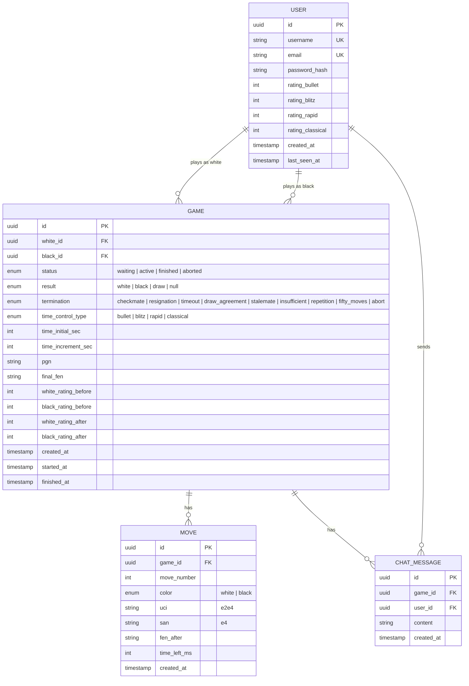

# ADR-003: Схема базы данных

**Статус:** Принято
**Дата:** 2026-03-07
**Контекст задачи:** KS-6

## Контекст

Необходимо спроектировать схему БД для хранения пользователей, партий, ходов, рейтингов и чата.

## Решение

### ER-диаграмма

### Индексы

- `GAME`: индексы на `white_id`, `black_id`, `status`, `created_at`
- `MOVE`: составной индекс на `(game_id, move_number)`
- `CHAT_MESSAGE`: индекс на `game_id`
- `USER`: уникальные индексы на `username`, `email`

### Redis (оперативные данные)

| Ключ | Тип | Назначение |
|------|-----|------------|
| `game:{id}:state` | Hash | Текущее состояние партии (FEN, ходы, таймеры) |
| `game:{id}:clocks` | Hash | white_ms, black_ms, last_tick |
| `matchmaking:{time_control}` | Sorted Set | Очередь матчмейкинга (score = rating) |
| `user:{id}:session` | String | ID сокета для reconnection |

## Решения по проектированию

1. **Ходы хранятся отдельно от партии** — позволяет запрашивать ходы по одному (для анализа, реплея), PGN в таблице `GAME` — кэш для быстрой выдачи
2. **Рейтинг в таблице USER, а не отдельно** — упрощение, достаточно для одного разработчика. При необходимости история рейтинга восстанавливается из `GAME.white_rating_before/after`
3. **Состояние активной партии в Redis** — PostgreSQL не подходит для обновлений на каждый ход (latency). После завершения партии данные персистятся в PostgreSQL

## Последствия

- Дуальное хранение (Redis + PostgreSQL) добавляет сложность синхронизации
- Нужен механизм персистенции из Redis в PostgreSQL при завершении партии и при рестарте сервера
- PGN дублирует данные из таблицы MOVE — компромисс между нормализацией и скоростью
