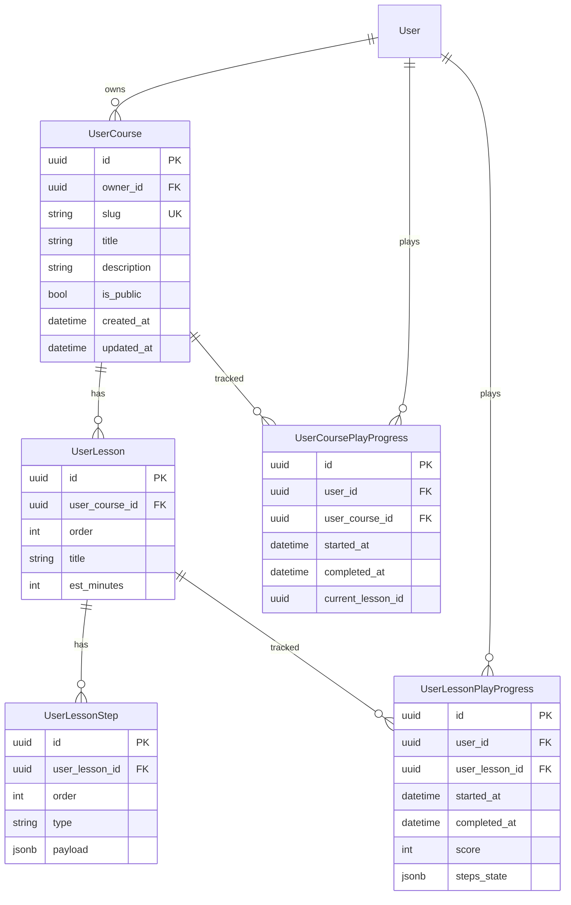

# ADR-026: Пользовательские курсы — архитектура «Свой курс»

**Дата:** 2026-04-24
**Статус:** Предложено
**Задача:** KS-1827
**Связанные документы:**
- [ADR-024 Lessons module](./024-lessons-module.md) — системные курсы, `Course`/`Lesson`/`LessonStep`
- [ADR-025 Lessons SM-2](./025-lessons-sm2.md) — алгоритм повторений (в MVP user-course НЕ участвует)
- `docs/architecture/lessons-module.md` — общее видение уроков
- Step-компоненты: `apps/web/src/components/lessons/steps/*`
- Seed-редактор (отдельный инструмент): `apps/web/src/pages/LessonEditorPage.tsx`

---

## 1. Контекст

Сейчас `/lessons` показывает только **системные** курсы, которые наполняются
backend-агентом через seed-fixtures (`apps/api/src/lessons/seed/courses/`).
Модели `Course` / `Lesson` / `LessonStep` предполагают i18n-ключи (`titleKey`,
`summaryKey`, `descriptionKey`) — то есть редактировать их через UI без
перевода нельзя.

`LessonEditorPage` (`/lessons/editor`, доступ по email-whitelist) — это
**админский редактор fixture**: он не пишет в БД, а экспортирует
TypeScript-модуль для вставки в seed-папку. К «своему курсу» пользователя
отношения не имеет.

Продуктовый запрос: пользователь должен сам собирать курс из набора
компонентов. MVP — **3 типа шагов**: лекция (текст + диаграммы), паззл,
разыгрывание позиции против Stockfish WASM. Остальные типы (`quiz`,
`video`, `game_review`, `opening_drill`, `position`) — в MVP не включаем,
но архитектурно оставляем точку расширения.

## 2. Решение

### 2.1 Параллельное дерево моделей

Не переиспользуем `Course` / `Lesson` / `LessonStep` по трём причинам:

1. **i18n-несовместимость**: в системных курсах `titleKey` / `summaryKey` —
   обязательные i18n-ключи, у пользовательских — plain-text без переводов.
   Смешивать в одной колонке `titleKey` «иногда ключ, иногда строка» —
   плохой контракт: сломает существующий фронтовый `t(course.titleI18nKey)`.
2. **Разные правила публикации**: у `Course.isPublished` — глобальный флаг,
   админ управляет. У пользовательского — `isPublic` (шеринг по ссылке),
   авторизация по `ownerId`.
3. **Изоляция рисков**: массовая пользовательская генерация (миллионы
   записей, мусор, модерация) не должна влиять на индексы и план запросов
   системных курсов.

Новые модели — `UserCourse`, `UserLesson`, `UserLessonStep`,
`UserLessonProgress2` (имя см. §2.3). Семантически они параллельны
системным, но физически не пересекаются по таблицам.

```prisma
model UserCourse {
  id           String   @id @default(uuid()) @db.Uuid
  ownerId      String   @map("owner_id") @db.Uuid
  slug         String   @unique                              // "<short-id>-<slug-from-title>"
  title        String                                        // plain text, без i18n
  description  String?
  isPublic     Boolean  @default(false) @map("is_public")
  createdAt    DateTime @default(now()) @map("created_at")
  updatedAt    DateTime @updatedAt      @map("updated_at")

  owner     User                    @relation(fields: [ownerId], references: [id], onDelete: Cascade)
  lessons   UserLesson[]
  progress  UserCoursePlayProgress[]

  @@index([ownerId, updatedAt])
  @@index([isPublic, updatedAt])
  @@map("user_courses")
}

model UserLesson {
  id           String   @id @default(uuid()) @db.Uuid
  userCourseId String   @map("user_course_id") @db.Uuid
  order        Int      @default(0)
  title        String
  estMinutes   Int?     @map("est_minutes")
  createdAt    DateTime @default(now()) @map("created_at")
  updatedAt    DateTime @updatedAt      @map("updated_at")

  course   UserCourse               @relation(fields: [userCourseId], references: [id], onDelete: Cascade)
  steps    UserLessonStep[]
  progress UserLessonPlayProgress[]

  @@index([userCourseId, order])
  @@map("user_lessons")
}

model UserLessonStep {
  id           String   @id @default(uuid()) @db.Uuid
  userLessonId String   @map("user_lesson_id") @db.Uuid
  order        Int      @default(0)
  type         String   // "text" | "puzzle" | "endgame_drill" (MVP); extensible
  payload      Json     // JSONB; shape — дискриминированный union StepPayload (shared)
  createdAt    DateTime @default(now()) @map("created_at")

  lesson UserLesson @relation(fields: [userLessonId], references: [id], onDelete: Cascade)

  @@index([userLessonId, order])
  @@map("user_lesson_steps")
}

model UserCoursePlayProgress {
  id              String    @id @default(uuid()) @db.Uuid
  userId          String    @map("user_id") @db.Uuid
  userCourseId    String    @map("user_course_id") @db.Uuid
  startedAt       DateTime  @default(now()) @map("started_at")
  completedAt     DateTime? @map("completed_at")
  currentLessonId String?   @map("current_lesson_id") @db.Uuid

  user   User       @relation(fields: [userId], references: [id], onDelete: Cascade)
  course UserCourse @relation(fields: [userCourseId], references: [id], onDelete: Cascade)

  @@unique([userId, userCourseId])
  @@index([userId])
  @@map("user_course_play_progress")
}

model UserLessonPlayProgress {
  id            String    @id @default(uuid()) @db.Uuid
  userId        String    @map("user_id") @db.Uuid
  userLessonId  String    @map("user_lesson_id") @db.Uuid
  startedAt     DateTime  @default(now()) @map("started_at")
  completedAt   DateTime? @map("completed_at")
  score         Int       @default(0)
  stepsState    Json      @map("steps_state") // { [stepId]: "done" | "failed" | "skipped" }

  user   User       @relation(fields: [userId], references: [id], onDelete: Cascade)
  lesson UserLesson @relation(fields: [userLessonId], references: [id], onDelete: Cascade)

  @@unique([userId, userLessonId])
  @@index([userId])
  @@index([userId, completedAt])
  @@map("user_lesson_play_progress")
}
```

Почему именно такой набор:

- `UserCourse.slug` — `<short-id>-<slug-of-title>` (например,
  `a4f2e1-queens-gambit-for-beginners`). Глобально уникальный, без
  коллизий между владельцами; человекочитаемый. Владелец по ссылке
  открывает `/lessons/my/a4f2e1-…` — тот же URL, что и публикуется.
- `UserLesson` — без `blockKey` (в системных курсах это способ группы;
  в пользовательских блоков нет, чтобы не усложнять редактор).
- `UserLessonStep.payload` — тот же shape, что у системного `LessonStep`
  (shared-тип `StepPayload` в `@kingside/shared`). Мы не вводим новый
  тип; API запрещает типы вне whitelist'а MVP (см. §2.4).
- **Отдельные** таблицы прогресса (`UserCoursePlayProgress`,
  `UserLessonPlayProgress`) — не расширяем существующие
  `UserCourseProgress` / `UserLessonProgress` union'ом
  `lessonId | userLessonId`. Это было бы соблазнительно (меньше таблиц),
  но:
  - ломает существующие FK-constraint'ы (`lessonId → Lesson.id NOT NULL`);
  - требует дописать во все `include` / `where` запросы сервиса
    системных уроков проверки «у нас системный прогресс, не чужой»;
  - SM-2 (`LessonReview`) полагается на `FK lessonId → Lesson` — для
    пользовательских уроков SM-2 в MVP **не нужен**, и чтобы он туда
    случайно не просочился, параллельная таблица физически изолирует.
- В MVP **SM-2 не подключаем** к пользовательским курсам. Причина: SM-2
  имеет смысл только на качественных обучающих материалах (см. ADR-025
  §2.5). Выдавать «к повторению» курс, собранный самим пользователем, —
  это замусорит `/lessons → ReviewsDueBlock` для автора. Если позже
  решим включить — заводим `UserLessonReview` параллельно `LessonReview`.

### 2.2 Anti-abuse, soft-limits

На уровне БД / сервиса:

| Лимит | Значение | Место |
|---|---|---|
| Курсов на одного пользователя | 20 | Проверка в `UserCoursesService.create`, 409 при превышении |
| Уроков в одном курсе | 30 | Проверка в `UserCoursesService.addLesson` |
| Шагов в одном уроке | 50 | Проверка в `UserCoursesService.addStep` |
| Длина `title` курса/урока | 1–120 символов | class-validator |
| Длина `description` | 0–1000 символов | class-validator |
| Длина `bodyMarkdown` в text-шаге | 0–10 000 символов | class-validator на DTO payload'а |
| Количество diagram'ов в text-шаге | 0–20 | class-validator |
| `filter.limit` в puzzle-шаге | 1–20 (в системных — до 100) | новый DTO `UserPuzzleStepPayloadDto` |

На уровне rate-limit (через существующий throttler):
- `POST /lessons/user-courses` — 10 req/min per user.
- `POST /lessons/user-lessons/:id/steps` — 60 req/min per user.

Оценка ёмкости при максимальных лимитах: один пользователь
20 × 30 × 50 = 30 000 шагов, payload шага ~2–10 КБ → ~60–300 МБ на
«максимально плотного» автора. Практически среднее ожидаемое ≤ 5 курсов,
≤ 10 уроков, ≤ 8 шагов. Индексов достаточно: `(ownerId, updatedAt)`,
`(isPublic, updatedAt)`, `(userLessonId, order)`.

### 2.3 Переиспользование существующих step-компонентов

MVP — 3 типа, все **без изменений** в существующих компонентах:

| MVP-тип | Компонент | Payload-тип (shared) | Что используем |
|---|---|---|---|
| Лекция | `TextStep` (`apps/web/src/components/lessons/steps/TextStep.tsx`) | `TextStepPayload` | markdown + ````fen ``` ``` inline-блоки + `{{diagram:N}}` reference-плейсхолдеры. FEN-диаграммы read-only, уже умеет ориентацию (`white`/`black`) и caption. |
| Практика (паззл) | `PuzzleStep` (`steps/PuzzleStep.tsx`) | `PuzzleStepPayload` | `selection.mode='filter'` (тема + рейтинг) или `'ids'` (конкретные lichess-puzzle). Попытки идут в существующий `PuzzleAttempt` — изменения не нужны. |
| Позиция vs Stockfish | `EndgameDrillStep` (`steps/EndgameDrillStep.tsx`) | `EndgameDrillStepPayload` | FEN, `playerSide`, `skillLevel` 0..20, `winCondition` (`mate` / `material_gain` / `eval_advantage`), `maxMoves`, `hintsAllowed`. |

**Решение по «интерактивным доскам в лекции»**: использовать уже
существующий read-only рендер FEN через `TextStep`. Кликабельные
просмотровые диаграммы (прокликать PGN) — вне MVP. Причина: уже есть
отдельный шаг `game_review` для этого сценария; тащить его
функциональность в `text` — дублирование. Если после запуска MVP будет
явный продуктовый запрос на кликабельные диаграммы в лекции — возможны
варианты:
- **A)** ввести новый тип `text+diagram_interactive` — один шаг, но с
  переменной частью «интерактивная диаграмма»;
- **B)** разрешить `game_review` как 4-й тип в пользовательских курсах
  (тогда «диаграмма в середине лекции» делается так: text-step →
  game-review-step → text-step).

В MVP эти опции **не выбираем**, фиксируем как открытый вопрос.

**Решение по переименованию `EndgameDrillStep` → `PositionVsEngineStep`**:
не переименовываем. Компонент уже принимает произвольный FEN (не
обязательно эндшпиль), его имя — исторический артефакт первой задачи
(KS-1800), но публичный контракт payload'а (`type: 'endgame_drill'`)
уже пропечатан в БД, в seed'ах, в shared-типах, в i18n-ключах.
Переименование сейчас = миграция всей существующей базы системных курсов
+ fixture-линтер. Ради «имя лучше звучит» — это не оправдано. В UI
пользовательского редактора пишем label «Позиция против движка» — внутри
остаётся `endgame_drill`.

### 2.4 Контракт payload'а — whitelist MVP

`shared`-тип `StepPayload` — это дискриминированный union из 8 вариантов
(`text`, `puzzle`, `quiz`, `position`, `game_review`, `video`,
`endgame_drill`, `opening_drill`). Мы **не урезаем** shared-тип — он
общий для системных и пользовательских курсов.

Ограничение идёт на уровне **API-валидации** при создании/обновлении
`UserLessonStep`:

```ts
// apps/api/src/lessons/user-courses/dto/user-step-payload.dto.ts
const ALLOWED_USER_STEP_TYPES = ['text', 'puzzle', 'endgame_drill'] as const;

// переиспользуем существующие DTO (Text/Puzzle/EndgameDrill StepPayloadDto)
// из apps/api/src/lessons/dto/step-payload.dto.ts, но в discriminator
// регистрируем ТОЛЬКО три подтипа. Остальные — 400 Bad Request
// с сообщением "Step type 'quiz' not allowed in user courses".
```

Ограничение на `PuzzleSelectionFilterDto.limit`: для системных курсов —
до 100, для пользовательских — до 20 (§2.2). Вводим отдельный DTO
`UserPuzzleStepPayloadDto`, который расширяет существующий и переопределяет
только верхнюю границу.

**Точка расширения**: добавить 4-й тип (например, `quiz`) = добавить
его в `ALLOWED_USER_STEP_TYPES`, гарантировать что `StepEditor` в
редакторе показывает его форму, ничего больше в БД/API менять не нужно.

### 2.5 API-контракт

Все эндпоинты под префиксом `/api/lessons/user-courses`, все требуют JWT
(`JwtAuthGuard`). Guard владельца — самописный `UserCourseOwnerGuard`,
читает `:id` / `:slug` / `:lessonId` / `:stepId`, резолвит до `ownerId`,
сравнивает с `req.user.id`.

#### Запрос / ответ

| Метод | URL | Доступ | Тело / ответ |
|---|---|---|---|
| GET | `/api/lessons/user-courses` | owner (`?mine=1`), или публичные (`?mine=0`) | `{ data: UserCourseSummary[] }` |
| GET | `/api/lessons/user-courses/:slug` | owner ИЛИ `isPublic=true` | `UserCourseWithLessonsResponse` (аналог `CourseWithLessonsResponse`) |
| POST | `/api/lessons/user-courses` | auth | `{ title, description?, isPublic? }` → `{ id, slug, ... }` |
| PATCH | `/api/lessons/user-courses/:id` | owner | `{ title?, description?, isPublic? }` |
| DELETE | `/api/lessons/user-courses/:id` | owner | 204 |
| POST | `/api/lessons/user-courses/:id/lessons` | owner | `{ title, estMinutes? }` → `UserLessonDto` |
| PATCH | `/api/lessons/user-lessons/:id` | owner (через cascade) | `{ title?, estMinutes?, order? }` |
| DELETE | `/api/lessons/user-lessons/:id` | owner | 204 |
| POST | `/api/lessons/user-lessons/:id/steps` | owner | `{ type, payload }` → `UserLessonStepDto` |
| PATCH | `/api/lessons/user-lesson-steps/:id` | owner | `{ payload?, order? }` |
| DELETE | `/api/lessons/user-lesson-steps/:id` | owner | 204 |
| POST | `/api/lessons/user-lessons/:id/steps/reorder` | owner | `{ ids: string[] }` — массовый `order` в одной транзакции |
| GET | `/api/lessons/user-lessons/:id` | owner ИЛИ lesson.course.isPublic | `UserLessonWithStepsResponse` (аналог `LessonWithStepsResponse`) |
| POST | `/api/lessons/user-progress/step` | auth | `{ userLessonId, stepId, state }` — `LessonStepState` |
| POST | `/api/lessons/user-progress/lesson/complete` | auth | `{ userLessonId, score }` (0..1), без `quality` — SM-2 отключён |

Shared-типы в `packages/shared/src/types/user-courses.ts`:

```ts
export interface UserCourseDto {
  id: string;
  ownerId: string;
  slug: string;
  title: string;
  description: string | null;
  isPublic: boolean;
  createdAt: string;
  updatedAt: string;
  lessonCount: number;
}

export interface UserLessonDto {
  id: string;
  userCourseId: string;
  order: number;
  title: string;
  estMinutes: number | null;
  stepCount: number;
}

export interface UserLessonStepDto {
  id: string;
  userLessonId: string;
  order: number;
  type: UserStepType;           // 'text' | 'puzzle' | 'endgame_drill'
  payload: StepPayload;         // дискриминирован по type
}
```

#### Guard и код ошибок

- 401 — нет JWT.
- 403 — чужой курс / не публичный.
- 404 — курс/урок/шаг не найден или к `ownerId`'у `req.user.id` не относится (
  единый код, чтобы не давать enumeration).
- 409 — лимит превышен (курсов / уроков / шагов).
- 400 — тип шага не в whitelist MVP, payload не валиден, лимиты полей.

### 2.6 UI / UX

#### Точки входа

1. На `/lessons` — между `LevelGateBanner` и списком системных курсов
   добавить блок **«Мои курсы»**:
   - Кнопка «+ Создать свой курс» (только для авторизованных; при клике
     POST /user-courses с title='Новый курс' → редирект на
     `/lessons/my/<slug>/edit`).
   - Карточки своих курсов (сетка как у системных), с индикатором
     `isPublic` и временем обновления.
   - Если своих курсов нет — пустое состояние с объяснением «Собери курс из
     лекций, задач и позиций против Stockfish».

2. На `/lessons/my` — отдельная страница «Мои курсы» (список + пагинация
   в будущем). В MVP достаточно блока на главной, отдельную страницу
   оставляем как точку расширения.

#### Конструктор курса

Маршрут `/lessons/my/:slug/edit` — новая страница `UserCourseEditorPage`,
**отдельная** от `LessonEditorPage` (административного). Не путать.

Структура:
- Header: `title` (inline edit), `isPublic` toggle, кнопки «Сохранить»,
  «Удалить», «Просмотр» (→ `/lessons/my/:slug`).
- Левая колонка: список уроков курса, «+ Добавить урок».
- Правая колонка: редактор выбранного урока.
  - `title`, `estMinutes`, кнопка удалить.
  - Список шагов (drag'n'drop для order).
  - «+ Добавить шаг» → выбор типа: «Лекция», «Задача», «Позиция против движка».
  - Форма шага зависит от типа. Переиспользуем `StepEditor` из
    `apps/web/src/components/lessons/editor/StepEditor.tsx`, **но**
    передаём `restrictToTypes={['text', 'puzzle', 'endgame_drill']}` —
    скрываем в `<select>` типы, которых нет в whitelist. Это
    минимальное изменение `StepEditor` — новый prop, backward
    compatible (default = все типы, как в админском редакторе).
  - Предпросмотр шага — тот же `StepRenderer`, что и для системных
    (с колбэком onStepDone).

#### Прохождение курса

Маршрут `/lessons/my/:slug` — `UserCoursePage` (аналог `CoursePage`):
- Owner видит — с кнопками «Редактировать», «Удалить».
- Гость с ссылкой видит — если `isPublic=true`; иначе 404.
- Список уроков (сортировка по `order`), для залогиненного — статус
  прохождения.

Маршрут `/lessons/my/:slug/:lessonSlug` — `UserLessonPage` (аналог
`LessonPage`): использует тот же `StepRenderer` и тот же
`useLessonProgress`, но привязан к `UserLessonPlayProgress` через
отдельные эндпоинты `/api/lessons/user-progress/*`. Логика завершения
урока (threshold score ≥ 70) — копия существующего
`ProgressService.completeLesson`, но без SM-2 веток (§2.1).

#### Мобильная адаптация конструктора

Выделяется отдельной задачей (`@layout`). На десктопе — две колонки. На
мобильном — табы «Уроки» / «Редактор шага». Drag'n'drop списка шагов на
мобильном — через кнопки ↑/↓ (как в админском редакторе), без
touch-DnD.

#### Публичный каталог чужих курсов — НЕ в MVP

Решение продуктовое. В MVP публичные курсы доступны только **по прямой
ссылке**. В `/lessons` блок «Мои курсы» показывает только свои. Это
защищает от необходимости вводить модерацию, репорты, фильтр по рейтингу
автора. Отдельная задача: каталог `/lessons/community` с модерацией —
после запуска MVP и измерения реального потока.

### 2.7 i18n

Пользовательские курсы — **без i18n**. Поля `title`, `description`, а
также `TextStepPayload.bodyMarkdown` хранятся как plain-text в языке
автора. Фронт НЕ прогоняет их через `t()`.

Метки UI самой страницы (кнопки, пустые состояния) — прежняя
`i18next`-инфраструктура, ключи `lessons.my.*` в словарях `en` / `ru`.

Семантическая подсказка на форме создания курса: «Название и описание
будут видны всем, кто откроет ссылку». Язык автора виден как есть, без
авто-перевода.

### 2.8 Переиспользование контента

- **Lichess-паззлы через фильтр**: разрешено. Уже работает через
  существующий `PuzzleResolverService` (`POST /lessons/puzzle-step/resolve`).
  Никаких прав на использование lichess-паззлов нам не нужно — они open,
  и мы уже их раздаём в системных курсах.
- **Конкретные `puzzleIds`**: разрешено, но без white-label «кто решил».
  Попытки всё так же пишутся в `PuzzleAttempt` и учитываются в рейтинге
  ученика.
- **Позиция из чужой партии (FEN)**: разрешено. FEN — это позиция, не
  partия. Автор пользовательского курса может взять любой FEN.
- **PGN чужой партии как `game_review`**: вне MVP (`game_review` не
  в whitelist). Когда будем включать — отдельный ADR по лицензии /
  атрибуции.
- **Форк системного курса** (или чужого публичного): вне MVP. Техническая
  возможность будет позже через `POST /user-courses/fork/:sourceSlug`
  с глубоким копированием lessons+steps.

### 2.9 Stockfish WASM — ресурс клиента

`EndgameDrillStep` уже использует `useStockfish` (WASM). В пользовательских
курсах нагрузка будет выше, чем в puzzle (один шаг = десятки ходов
движка с `skillLevel` до 20). Риски и митигация:

- **Холодная загрузка WASM**: при первом входе в `endgame_drill` шаг
  ≈ 1–2 сек. загрузки. Решение: при открытии `UserLessonPage` с шагом
  `endgame_drill` — префетч модуля Stockfish (`useStockfish({ prefetch:
  true })`). **Нужна доработка хука** — сейчас он лениво загружает при
  первом `evaluate`. Добавление флага `prefetch` — задача backend
  фронта, S.
- **Мобильные устройства**: WASM на слабых телефонах может тормозить.
  Митигация: в `StepEditor` для `endgame_drill` показать warning «Этот
  шаг требует Stockfish WASM; на слабых устройствах ответ движка может
  занимать 1–2 секунды».
- **Повторная загрузка**: у хука `useStockfish` есть singleton-кеш,
  между шагами одной страницы переиспользуется.

## 3. UI-диаграмма flow

```mermaid
flowchart TD
    A[/lessons] -->|клик «+ Создать свой курс»| B[POST /user-courses]
    B -->|redirect| C[/lessons/my/:slug/edit]
    C -->|добавить урок| D[POST /user-courses/:id/lessons]
    C -->|добавить шаг| E[POST /user-lessons/:id/steps]
    C -->|toggle isPublic| F[PATCH /user-courses/:id]
    C -->|клик «Просмотр»| G[/lessons/my/:slug]
    G -->|клик урок| H[/lessons/my/:slug/:lessonSlug]
    H -->|StepRenderer → onStepDone| I[POST /user-progress/step]
    H -->|последний шаг| J[POST /user-progress/lesson/complete]

    subgraph Гость по ссылке
      K[/lessons/my/:slug<br/>isPublic=true] -->|клик урок| H
    end
```

## 4. Модель данных — ER-диаграмма



## 5. Риски и митигация

| Риск | Вероятность | Влияние | Митигация |
|---|---|---|---|
| Массовое создание мусорных курсов | H | M | Лимит 20 курсов/user, rate-limit POST (§2.2) |
| Утечка приватного курса (неверный guard) | M | H | `UserCourseOwnerGuard` + unit-тесты на все API-эндпоинты с негативными кейсами «чужой owner», «isPublic=false + гость» |
| Массовые пользовательские шаги в БД (размер) | M | M | Ограничение `bodyMarkdown` ≤ 10 КБ, лимит 30×50=1500 шагов/курс, индекс `(user_lesson_id, order)` достаточен |
| Нарушение контрактов shared-типа при расширении whitelist | L | M | Тип `UserStepType = 'text' \| 'puzzle' \| 'endgame_drill'` в shared экспортируется отдельно от `LessonStepType`, но payload'ы — те же |
| Stockfish WASM — медленная загрузка при первом шаге | M | L | Префетч при монтировании `UserLessonPage` (§2.9) |
| Абьюз паззлов: автор накручивает рейтинг через свой курс | L | L | Попытки уже идут в `PuzzleAttempt` на общих условиях — не даём `puzzle.ratingMin > 3000` в user-filter (уже есть clamp в `PuzzleResolverService`) |
| Модерация публичных курсов | M | M | В MVP — только по ссылке, каталога нет. Эскалация — отдельная задача, после запуска |
| Миграция БД на prod | L | M | Отдельная prisma-миграция, только `CREATE TABLE` + `CREATE INDEX`, без `ALTER` существующих таблиц — rollback простой |
| Коллизия `slug` при параллельном создании | L | L | `UserCourse.slug` включает shortId (первые 6 символов uuid) — вероятность коллизии ~10⁻⁸ |

## 6. План поэтапной реализации

### Этап 1. Backend MVP (sprint 1)

- **BE-1** [M]: prisma-миграция, 5 новых моделей (§2.1). Добавить relation'ы
  в `User` (`userCourses`, `userCoursePlayProgress`, `userLessonPlayProgress`).
  Prisma generate. Unit-тесты на каскад delete.
- **BE-2** [M]: `UserCoursesModule` с `UserCoursesService`,
  `UserCoursesController`, `UserLessonsController`,
  `UserLessonStepsController`, `UserCourseOwnerGuard`. Shared-типы в
  `packages/shared/src/types/user-courses.ts`.
- **BE-3** [M]: DTO-валидация с whitelist типов, лимиты (§2.2, §2.4).
  Reuse `TextStepPayloadDto`/`PuzzleStepPayloadDto`/`EndgameDrillStepPayloadDto`,
  но в discriminator'е — только три. `UserPuzzleStepPayloadDto` с
  `limit: 1..20`.
- **BE-4** [S]: `UserProgressController` + `UserProgressService` (копия
  `ProgressService` без SM-2). Новая таблица `UserLessonPlayProgress`,
  отдельный `touchUserCourseProgress`.
- **BE-5** [S]: slug-генератор `<shortId>-<slugFromTitle>`, unit-тесты
  на коллизии и нормализацию (`"Мой курс"` → `"moi-kurs"` транслитом
  или просто slugify с latin1).
- **BE-6** [S]: rate-limit (через `@Throttle()` NestJS) на create-endpoints.
- **BE-7** [S]: e2e-тесты на сервисы (создать → добавить урок → шаг →
  пройти → отметить прогресс), включая негативные: чужой owner, не-whitelist
  type, превышение лимита.

### Этап 2. Frontend MVP (sprint 1–2, параллельно с BE-5..BE-7)

- **FE-1** [S]: API-клиент `userCoursesApi` в
  `apps/web/src/api/userCoursesApi.ts` — все эндпоинты §2.5.
- **FE-2** [S]: расширение `StepEditor` — prop `restrictToTypes?:
  LessonStepType[]`, фильтр в `<select>` типа шага. Backward
  compatible (default — все 8 типов).
- **FE-3** [M]: `UserCourseEditorPage` (`/lessons/my/:slug/edit`) —
  форма курса + список уроков + встраивание `StepEditor`
  для каждого шага. Авто-сохранение через debounced PATCH.
- **FE-4** [M]: `UserCoursePage` (`/lessons/my/:slug`) — просмотр курса,
  список уроков, кнопка «Пройти». Owner-actions.
- **FE-5** [M]: `UserLessonPage` (`/lessons/my/:slug/:lessonSlug`) —
  прохождение. Переиспользует `StepRenderer`, `useLessonProgress`
  (адаптация для `/user-progress/*` endpoint'ов — новый хук
  `useUserLessonProgress`).
- **FE-6** [S]: блок «Мои курсы» на `/lessons`, между `LevelGateBanner`
  и списком системных курсов. Кнопка «+ Создать свой курс».
- **FE-7** [S]: i18n-ключи `lessons.my.*` (en/ru) — надписи UI без
  перевода пользовательского контента.
- **FE-8** [S]: префетч Stockfish WASM при монтировании
  `UserLessonPage` если в уроке есть `endgame_drill` шаг (§2.9).
- **FE-9** [M]: тесты — vitest на все новые компоненты,
  тесты guard'ов (404/403 при чужом owner, 200 при публичном), happy
  path прохождения.

### Этап 3. Layout / адаптивность (sprint 2)

- **L-1** [M]: мобильная адаптация `UserCourseEditorPage` —
  табы «Уроки» / «Редактор», стек одной колонкой. Перенос кнопок вверх.
- **L-2** [S]: стили блока «Мои курсы» на `/lessons` — сетка карточек,
  бейдж `isPublic`, пустое состояние.
- **L-3** [S]: стили `UserCoursePage` / `UserLessonPage` —
  переиспользование существующих `lessons-course-card`, но с
  `--user` модификатором для визуального отличия (опционально цвет рамки).

### Этап 4. Пост-MVP (отдельные ADR / задачи)

- Каталог публичных курсов + модерация.
- Форк системных или чужих публичных курсов (deep copy).
- SM-2 повторения на пользовательских курсах (`UserLessonReview`).
- Расширение whitelist на `quiz` (следующий по простоте тип).
- Кликабельные просмотровые диаграммы в лекции (решение A/B §2.3).
- Комментарии / лайки / рейтинг публичного курса.

## 7. Что точно НЕ меняем

- `Course` / `Lesson` / `LessonStep` — shape не трогаем. Все существующие
  контроллеры системных уроков (`CoursesController`, `LessonsController`,
  `ProgressController`) — без правок.
- `LessonEditorPage` (`/lessons/editor`) — админский редактор fixture, ни
  строчкой не меняем. Он и `UserCourseEditorPage` — разные страницы с
  разной целью.
- `@kingside/shared/src/types/lessons.ts` — `StepPayload` union не урезаем,
  `LessonStepType` остаётся как есть. `UserStepType` — новый отдельный тип.
- SM-2 (`LessonReview`, `Sm2Service`) — не подключаем к пользовательским
  курсам в MVP.
- `PuzzleAttempt`, `PuzzleResolverService` — без правок, пользовательский
  `PuzzleStep` ходит в тот же endpoint.

---

## Приложение A: таблица изменений shared-типов

| Файл | Изменение | Совместимость |
|---|---|---|
| `packages/shared/src/types/user-courses.ts` (новый) | Добавить `UserCourseDto`, `UserLessonDto`, `UserLessonStepDto`, `UserStepType`, `UserCourseWithLessonsResponse`, `UserLessonWithStepsResponse`, `UserLessonPlayProgressDto`, `CreateUserCourseRequest`, `CreateUserLessonRequest`, `CreateUserLessonStepRequest`, `UpdateUserLessonStepRequest`, `ReorderUserStepsRequest` | Новый файл, добавка, ничего не ломает |
| `packages/shared/src/types/lessons.ts` | Без изменений | ✓ |
| `packages/shared/src/index.ts` | Реэкспорт нового модуля | Добавка |

## Приложение B: таблица зависимостей задач

```
BE-1 ──┬── BE-2 ──┬── BE-3 ──┬── BE-4 ──┬── BE-7
       │          │          │          │
       │          └── BE-5 ──┘          │
       │                                │
       └── BE-6 (паралл.)               │
                                        │
FE-1 (ждёт shared из BE-2) ──┬── FE-2 ──┼── FE-3 ──┬── FE-9
                             │          │          │
                             │          └── FE-4 ──┤
                             │                     │
                             └── FE-5 (ждёт BE-4) ─┤
                                                   │
                             FE-6 ────────────────┤
                             FE-7 (паралл.)       │
                             FE-8 ────────────────┘

L-1 ── ждёт FE-3
L-2 ── ждёт FE-6
L-3 ── ждёт FE-4, FE-5
```

## Приложение C: оценка трудоёмкости

| Категория | S | M | L | Итого |
|---|---|---|---|---|
| Backend | 4 | 3 | 0 | 7 задач |
| Frontend | 5 | 4 | 0 | 9 задач |
| Layout | 2 | 1 | 0 | 3 задачи |
| **Всего** | **11** | **8** | **0** | **19 задач** |

Одному разработчику MVP — оценочно 2–3 sprint'а при средней нагрузке.
Критический путь: `BE-1 → BE-2 → BE-3/BE-5 → FE-1 → FE-3 → FE-5 → FE-9`.
