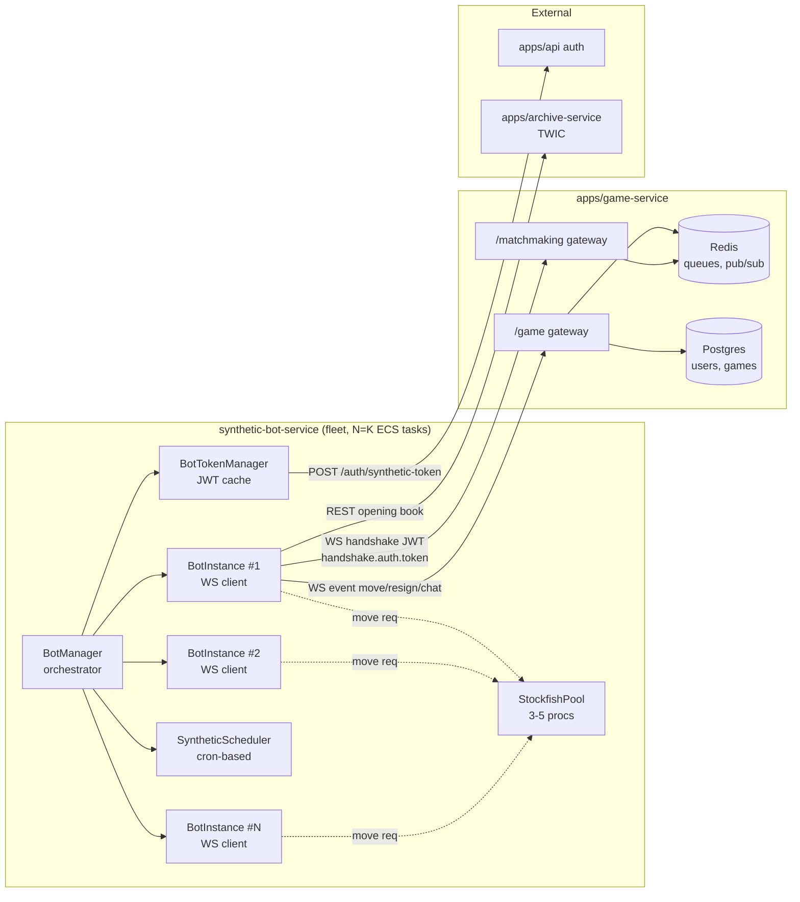

# ADR-034-v2: Synthetic-bot-service — отдельный сервис, WS-клиенты к game-service

**Дата:** 2026-04-30
**Статус:** Предложено
**Задача:** KS-2159 (v2-итерация)
**Заменяет:** [ADR-034](./034-emulated-users-cold-start.md) (Superseded)
**Связанные:**
- [ADR-012](./012-api-game-service-split.md) — выделение `game-service` (тот же приём — выносим bot-нагрузку отдельным сервисом)
- [ADR-018](./018-archive-service-extraction.md) — паттерн выделения сервисов
- [ADR-013](./013-game-archive-and-tree.md), [ADR-033](./033-archive-database-interface.md) — TWIC и archive-service для opening book

---

## Контекст

Решение из ADR-034 (модуль `BotRunnerModule` внутри `apps/game-service`, Stockfish-child-process'ы в том же контейнере) признано неверным:

- **Нагрузка от движков смешивается с игровой.** Игровой сервис обслуживает live-WS, тики таймеров, broadcasts матчей; CPU-всплеск от 30 параллельных Stockfish'ей в том же контейнере влияет на latency живых партий.
- **Невозможно независимо скейлить bot-нагрузку.** Поднять CPU game-service нельзя — это горячая точка платформы; снижать число ботов при росте live тоже не выход (ради ботов резервировать ресурс игрового сервиса).
- **Боты `BotGameRunner`-инстансами «обходят» обычный flow** (`getPosition()`, `makeMove()` как in-process API), а не идут через WS-event `move` — это создаёт особый код-путь, который надо отдельно тестировать. Стандартная mock-стратегия «бот = клиент» не работает.

Цель v2: synthetic — это **внешний клиент**, такой же как живой пользователь. Внутри game-service для бота нет ничего особого: handshake JWT, WS-events `move`/`resign`/`drawOffer`/`message`. Изоляция ресурсов, скейлинг и lifecycle — обязанность нового сервиса `synthetic-bot-service`.

Поля БД (`User.isSynthetic`, `Game.isSyntheticOpponent`), seed-история, профили, политика рейтинга — переиспользуются из v1; миграции не откатываются.

---

## 1. Архитектура

### 1.1 Компоненты



**Боты — обычные WS-клиенты `/matchmaking` и `/game`.** Никаких privileged endpoints в game-service для ботов; никаких in-process API. Game-service не знает, что часть подключений — синтеты, кроме того, что у этих `User.isSynthetic = true` в БД (это используется только в matchmaking-приоритете и метриках, см. §5.4).

### 1.2 Сервис `apps/synthetic-bot-service`

Минимальный Nest-приложение с одним долгоживущим процессом-orchestrator:

```
apps/synthetic-bot-service/
├── src/
│   ├── main.ts                       # bootstrap, graceful shutdown
│   ├── app.module.ts
│   ├── manager/
│   │   ├── bot-manager.service.ts    # spawn/despawn BotInstance, owners[]
│   │   └── bot-instance.ts           # один экземпляр = один WS-клиент
│   ├── auth/
│   │   ├── bot-token.service.ts      # получение/обновление JWT
│   │   └── token-cache.service.ts    # Redis-кэш bot-id → JWT
│   ├── engine/
│   │   ├── stockfish-pool.service.ts # 3-5 child_process, общий для task'а
│   │   ├── move-engine.service.ts    # гибрид TWIC + Stockfish + noise
│   │   └── opening-book.client.ts    # HTTP к archive-service
│   ├── schedule/
│   │   └── scheduler.service.ts      # кривая часов/dow + адаптация
│   ├── chat/
│   │   └── chat.service.ts           # триггер-фразы (post-MVP, заглушка)
│   ├── timing/
│   │   └── think-budget.service.ts   # §6 v1 без изменений
│   ├── bootstrap/
│   │   └── pair-finder.service.ts    # synthetic-vs-synthetic discovery
│   └── health.controller.ts          # liveness/readiness для ECS
├── package.json
└── Dockerfile
```

`BotInstance` — единица абстракции. Один экземпляр = один WS-клиент = один synthetic-аккаунт = один поток событий. Если synthetic в lobby — `BotInstance` подключён к `/matchmaking` и шлёт `JOIN`. Когда matched — открывает второй сокет к `/game` и ведёт партию. После окончания партии второй сокет закрывает. Через ENV-конфигурируемый «idle-cooldown» (5–30 минут) — отключает `/matchmaking` и снова коннектится через scheduler.

### 1.3 Развёртывание

- **Один ECS task** = один процесс `synthetic-bot-service` = один `StockfishPool` (3 stockfish-инстанса) = до 30 одновременно активных `BotInstance`'ов (см. §4).
- **Fleet** = N task'ов (1 для MVP, далее scale-out по метрикам). ECS Service `synthetic-bot-service` с desired-count в Auto Scaling Group (не нужен ALB — задача исходящая, не принимающая соединения).
- Каждый task имеет уникальный `TASK_ID` (ECS task metadata). `BotManager` использует `TASK_ID` для **детерминированного шардирования** synthetic-аккаунтов: `bot.assigned_task = hash(bot.id) % task_count`. Это гарантирует, что один synthetic не активируется на двух task'ах одновременно (см. §5.2).
- Никакого ALB / Service Discovery: bot-service ИДЁТ исходящими соединениями к game-service. Health-checks ECS — простой TCP/HTTP к встроенному `/health` (нужен для liveness, не для входящих).

---

## 2. Authentication

### 2.1 JWT для бота

Бот аутентифицируется в game-service **тем же механизмом, что живой**: handshake `auth.token`, секрет `JWT_SECRET`. Никаких bot-only guards или доп-флагов в JWT — в payload `{ sub: <user.id>, username: <bot.username> }`. Game-service видит обычного пользователя.

Это критично: любой bot-only signal в токене (например, `payload.isSynthetic = true`) проникает в логи, может утечь и используется live-юзерами для детекции (через MitM/devtools на своей стороне).

### 2.2 Источник токенов

**Решение: внутренний endpoint `POST /api/internal/auth/synthetic-token` в `apps/api`.**

```
POST /api/internal/auth/synthetic-token
Headers:
  X-Internal-Auth: <SYNTHETIC_BOT_INTERNAL_KEY>   # shared secret, env
Body:
  { botUserId: "00000000-0000-4000-b000-..." }
Response:
  { accessToken: "<jwt>", expiresIn: 900 }        # 15 мин — стандартный TTL
```

- **Гард** — кастомный `InternalKeyGuard`: сравнивает заголовок с `process.env.SYNTHETIC_BOT_INTERNAL_KEY`. Заголовок передаётся только из VPC (security group ECS bot-task → API task разрешает порт; внешний трафик не может ходить на `/internal/*` через ALB — добавляем правило в `apps/api`-ALB blocking `/internal/*` extern).
- **Проверка `User.isSynthetic`** перед выдачей: иначе токены через эту дыру можно нагенерить для любого user.id.
- TTL по умолчанию — 15 минут (как у живых). Refresh — НЕ через `/auth/refresh` (там cookie-flow для браузера), а через повторный вызов `synthetic-token`. Bot-service кэширует токен в Redis под ключом `synth:tok:<userId>` с TTL 13 минут (запас 2 мин до expiry); читает из кэша, при miss/expire — POST'ит новый.

**Альтернатива (отвергнута):** AWS Secrets Manager + долгоживущие refresh-токены в Secrets. Контра: требует rotation, логирование доступа Secrets Manager, лишний AWS-сервис. При 200 ботах × 1 токен = 200 секретов = $80/мес только за storage. JWT-flow дешевле и проще.

### 2.3 Безопасность

- `SYNTHETIC_BOT_INTERNAL_KEY` — длинная строка (32 байта random), хранится в SSM Parameter Store SecureString, инжектится в bot-service и api-task через ECS task definition.
- `apps/api/internal/*` — отдельный controller с публичным `Allow` только в private subnet. Health-check ALB не маршрутизирует `/internal/*` наружу (правило listener'а).
- Логирование выдачи токенов — в `instance-logger` без значения токена (только `userId`, `requesterIp`, `tokenHash`).

---

## 3. Discovery (synthetic-vs-synthetic для bootstrap)

При cold-start (нет живых вообще) очередь сама по себе пустая. Чтобы lobby выглядело живым, нужны synthetic-vs-synthetic-партии — они же дают «активность» на сервере (последняя партия 5 минут назад в профиле). Эту функцию в v1 выполнял `SyntheticBootstrapService` — пары собирались внутри game-service. В v2 — на стороне bot-service.

### 3.1 Подход

**Решение: боты находят друг друга через обычный matchmaking, никаких отдельных endpoints.**

Bot-service запускает 2 `BotInstance`'а с близким рейтингом, оба коннектятся к `/matchmaking`, оба шлют `JOIN` для одной категории (bullet/blitz/...). Стандартный matchmaker их паррит как обычную пару. После `FOUND` оба переходят в `/game`-партию, играют до конца.

**Почему не через Redis pub/sub или отдельный endpoint:**
- Не плодим отдельный API только для ботов — это и есть то, чего избегаем.
- Стандартный matchmaker уже умеет паррить по rating-range — переиспользуем.
- Если в этот момент в очередь зайдёт живой — он окажется в очереди втроём с двумя ботами, matchmaker выберет ему ближайшего бота, второй останется. Это правильный исход (живой важнее, см. §5.4 v1).

### 3.2 Контроль из bot-service

`PairFinderService` в bot-service:

1. По расписанию (см. §6 v1, кривая часов) добавляет в bullet/blitz/rapid синтетов парами `(A, B)`, рейтинги `A.rating ≈ B.rating ± 80`.
2. Ставит обоих в очередь с разницей 0.5–3 секунды (рандом — так выглядит как два независимых клиента, не одновременный bulk).
3. Обоим выставляет `ratingFilter = { ratingDelta: 100 }` — узкий фильтр, чтобы matchmaker предпочёл их друг другу при наличии разрозненных живых рядом.
4. Если в течение `2 × FALLBACK_SEC` пара не сошлась (живой перехватил одного) — оставшийся бот покидает очередь, scheduler переплитёт его позже с другим партнёром.

### 3.3 Анти-collision

Чтобы один и тот же synthetic не был добавлен в очередь дважды (если scheduler ошибся или ECS подняли второй task с дублирующимся owners-списком):

- `BotManager.canStart(botId)` проверяет Redis-lock `synth:active:<botId>` (TTL 30 сек, обновляется каждые 10 сек). Старт = SETNX; если ключ занят — task знает, что бот уже на другом task'е.
- При shutdown task'а — DEL ключа, чтобы другой task мог взять.
- При краше task'а (ключ не удалён) — TTL 30 сек, через 30 сек бот свободен.

---

## 4. Resource budget

> **TL;DR §4 (после пересчёта под bullet/blitz, 2026-04-30):**
> - Реальная нагрузка — bullet/blitz, не среднее по категориям. Бюджет на ход 50–150 мс (а не 1.5 сек), 30 партий bullet могут давать пик 15–25 запросов/сек.
> - 3 движка пика не держат — пересчёт даёт минимум **5 stockfish-процессов** на task, лимит ботов снижается с 30 до **20**.
> - Размер task **остаётся 2 vCPU / 2 GB** — увеличивать не выгодно (4 vCPU/4 GB даёт ту же ёмкость в пересчёте на $).
> - Целевые 75 одновременно активных синтетов = **4 task'а** вместо 3, cost увеличивается с $80 до ~$130/мес average.
> - Изменяются default'ы `STOCKFISH_POOL_SIZE` (3→5) и `BOT_INSTANCE_LIMIT_PER_TASK` (30→20). Затрагивает KS-2190 (default в коде), KS-2195 (task-def + AutoScaling target), KS-2196 (нагрузочный тест на 20 bullet-партий).

### 4.1 Профиль нагрузки (bullet/blitz приоритет)

Базовое допущение пересмотрено: **аудитория Kingside преимущественно bullet (1+0, 2+1) и blitz (3+0, 3+2, 5+0)**. Rapid/classical — редкие. Ниже все расчёты для худшего случая (fleet = 100% bullet).

#### Время на ход и сила движка

Stockfish 18 на одном ядре современного x86_64 (Fargate Graviton/Intel сопоставимы). Замеры — порядковые ориентиры из публичных бенчмарков и testtable; в QA замерим уточнённые значения на ECS-инстансах (см. KS-2196).

| Режим (UCI) | Реальное время/ход | Глубина (mid-game) | Сила (Elo, грубо) | Throughput на 1 процесс |
| ----------- | ------------------ | ------------------ | ----------------- | ----------------------- |
| `UCI_LimitStrength=true UCI_Elo=1320` + `movetime=20` | 5–20 мс | 5–8 | ~1320 | 50–100 ходов/сек |
| `UCI_LimitStrength=true UCI_Elo=1600` + `movetime=40` | 10–40 мс | 6–9 | ~1600 | 30–60 ходов/сек |
| `UCI_LimitStrength=true UCI_Elo=1900` + `movetime=80` | 30–80 мс | 8–11 | ~1900 | 15–30 ходов/сек |
| `UCI_LimitStrength=true UCI_Elo=2200` + `movetime=120` | 60–120 мс | 10–13 | ~2200 | 8–15 ходов/сек |
| `movetime=200` (без UCI_Elo limit) | 150–200 мс | 13–16 | ~2700 | 5–7 ходов/сек |
| `movetime=500` | 400–500 мс | 16–19 | ~2900+ | 2–2.5 ходов/сек |

> Ключевое наблюдение: **для слабого синтета (Elo 1200–2000) Stockfish ОЧЕНЬ дёшев** — `UCI_LimitStrength` режет depth и `movetime` по достижении заданной силы. Один процесс на ядре переваривает 30–100 ходов/сек. Дорогой режим — только синтеты выше 2200 без UCI_Elo limit.

Synthetic-fleet Kingside по дизайну (см. ADR-034 v1 §3) — рейтинги в основном 1200–2200, с малой долей > 2200. Профиль: 80% дешёвых запросов, 20% средних.

#### Move-rate на 30 одновременных bullet-партий

Bullet 1+0 = ~60 ходов/партия, ≤ 60 секунд clock-time на сторону, в среднем 0.5–1 сек реального времени между ходами одной стороны.

- 30 партий × 1 ход/0.5–1 сек = **30–60 ходов/сек суммарно** (теоретический максимум, обе стороны в bullet).
- **Но** synthetic ведёт ровно одну сторону партии, вторая — живой/другой synthetic. Доля ходов synthetic'а — 50%.
- Также: think-budget из §6 v1 (jitter 200–700 мс) намеренно растягивает реакцию бота сверх Stockfish-time. Реальная частота вызовов move-engine — **15–25 ходов/сек устойчиво**, peak до **30 ходов/сек** на 30 ботов в bullet (когда несколько партий синхронно).

В blitz/rapid число запросов в 3–10× ниже.

### 4.2 Pool sizing

Целевая ёмкость одного task'а: **20 одновременно активных bullet-ботов**, peak до **25 ходов/сек**.

#### Расчёт `STOCKFISH_POOL_SIZE`

Profile mix внутри одного task: 80% запросов «дешёвые» (avg 40 мс), 20% «средние» (avg 100 мс) → средний ход = ~52 мс.

- Throughput одного процесса при 100% busy: ~19 ходов/сек.
- Для 25 ходов/сек peak с запасом ×1.5 (jitter, GC-паузы Node, IO в child_process pipe) → нужно **≥ 2.0 эффективных ядра** под Stockfish.
- Запас на одновременные «дорогие» запросы (выше 2200 Elo, без LimitStrength): один такой ход = 200 мс блокирует процесс полностью.
- Параллелизм через `STOCKFISH_POOL_SIZE = 5`: при peak один процесс может «застрять» в 200 мс ответе, остаётся 4 быстрых, очередь не растёт.

**Default: `STOCKFISH_POOL_SIZE = 5`.** Жёстким лимитом — 8 (выше CPU-голодание Node loop'а на 2 vCPU).

#### Расчёт `BOT_INSTANCE_LIMIT_PER_TASK`

Прежняя оценка 30 ботов опиралась на 1.5 сек/ход; в bullet с peak 30 ходов/сек 5 движков (с throughput ~95 ходов/сек агрегированно при 100% busy на 5 ядер, но фактически у нас всего 2 vCPU) — узким горлышком становится **CPU**, а не пул.

- 5 stockfish × ~50% CPU при peak (быстрые `movetime=40-80`) ≈ 2.5 vCPU агрегированно.
- 2 vCPU физически на task — значит movetime size выдерживается ≈ 80% от номинального; throughput пула эффективно режется до ~12–15 ходов/сек.
- На 30 bullet-ботов (peak до 30 ходов/сек) — недостаточно; на 20 ботов (peak до 20 ходов/сек) — запас остаётся.

**Default: `BOT_INSTANCE_LIMIT_PER_TASK = 20`.** Soft-limit; жёсткий потолок — 25 (после которого `BotManager` отказывается принимать новые spawn'ы).

#### CPU/RAM итог

| Параметр | Значение | Обоснование |
| -------- | -------- | ----------- |
| Stockfish процессов в `StockfishPool` | **5** (был 3) | Покрывает peak 25 ходов/сек на bullet-fleet с запасом, оставляет 2–3 процесса свободными при «дорогих» >200мс ходах. |
| Активных `BotInstance` | **20** (был 30) | Жёсткий потолок по CPU 2 vCPU. Подъём до 25 — мягкий, при равной нагрузке. |
| Активных партий одновременно | до 20 | Один `BotInstance` = одна партия. |
| RAM | ~1.6 GB | Stockfish 18 (NNUE): ~250 MB × 5 = 1.25 GB + Node + buffers + opening-book cache. ECS: **2 GB**. |
| CPU | 1.7–1.9 vCPU peak | 5 процессов × ~35% при peak + Node loop ~10%. ECS: **2 vCPU**. |

#### Почему не 4 vCPU / 4 GB task

Альтернатива — больший task: 4 vCPU / 4 GB, 8 stockfish, 40 ботов.

- Стоимость: ~$140/мес 24/7 (2× больше).
- Ёмкость: ровно 2× больше (40 ботов).
- **Stockfish — embarrassingly parallel**, scaling линейный до ~16 процессов.
- Преимуществ нет, но **выше blast-radius** (краш task'а — 40 ботов одновременно дисконнектятся, у game-service grace-period 30 сек на каждого).
- **Решение: остаёмся 2 vCPU / 2 GB.** Меньше единиц, чаще, выше resilience.

### 4.3 Безопасные пороги и поведение при peak

- **20 ботов на task** — soft limit, до 25 при equal-load (контроль через p99 stockfish-time < 250 мс sustained).
- **5 stockfish-процессов** — default; up to 8 через ENV для bullet-heavy task'ов (если QA покажет нехватку).
- **Длина очереди в `StockfishPool`**: при p99 queue-wait > 100 мс sustained 60 сек → CloudWatch alert «pool overload», `BotManager` начинает отказывать новым spawn'ам, AutoScaling добавляет task.
- **Защита от runaway dispatch**: один `BotInstance` не отдаёт следующий ход, пока не получил предыдущий — нет фан-аут амплификации внутри одной партии.

#### Что произойдёт, если все 20 ботов синхронно потребуют ход

- Очередь в `StockfishPool` = 20 запросов, 5 worker'ов.
- Средний ход 52 мс → пик-задержка для последнего в очереди = 20/5 × 52 = ~210 мс ожидания + 52 мс computation = **~260 мс**.
- В bullet 1+0 это терпимо (cap budget на ход через think-budget 200–700 мс — задержка попадает в jitter-okno).
- Если задержка вырастает > 500 мс — это уже видно по `synth_move_compute_time_ms` p99, alert триггерит, fleet расширяется.

### 4.4 Скейлинг fleet'а

- Метрика: `synth:tasks:total_active = SUM(synth:task:*:active)`.
- ECS Auto Scaling правило: `target_tasks = ceil(total_desired_synthetic / 18)`. 18 — целевая нагрузка на task с запасом 2 (от soft-limit 20).
- Auto Scaling cooldown: **3 минуты** (укорочено с 5: bullet-нагрузка пиковая, реакция должна быть быстрее).
- Минимум — 1 task. Максимум для MVP — **4 task'а** (≈75 одновременно активных синтетов при cap 20 на task; обоснование как в v2 §4: 200 в пуле в БД, активных ≤75 при peak-аудитории).
- Cap пересмотреть при росте `daily_unique_live_users` или появлении rapid/classical-доли в нагрузке.

#### Сигналы эскалации (в каком порядке добавлять ресурсы)

| Сигнал (CloudWatch) | Действие |
| ------------------- | -------- |
| `synth_move_compute_time_ms p99 > 250 ms` sustained 5 min | Поднять `STOCKFISH_POOL_SIZE` на task (5→6→7→8) через ECS task-def update. Эффективнее нового task'а, если CPU не насыщен. |
| `cpu_utilization > 75%` sustained 5 min И pool_size уже 8 | Снизить `BOT_INSTANCE_LIMIT_PER_TASK` до 15 на этом task'е, добавить task в fleet (ScaleOut). |
| `synth_pool_queue_wait_ms p99 > 100 ms` sustained 60 sec | Pool overload — добавить task (быстрее, чем через CPU-метрику). |
| `synth_tasks:total_active / sum(BOT_INSTANCE_LIMIT_PER_TASK) > 0.85` | Превентивный ScaleOut. |
| `synth_active_bots в task < 5` И task не последний | ScaleIn (3-минутный cooldown). |

### 4.5 Cost-модель (пересчёт)

Прежний расчёт: 3 task'а × $50 = $150/мес peak, average $80 на 75 синтетов.
Новый расчёт под пониженный лимит:

| Сценарий | Tasks | $/мес 24/7 (Fargate Spot off, on-demand) | Effective ceiling |
| -------- | ----- | ---------------------------------------- | ----------------- |
| MVP стартовый (5 ботов) | 1 | $50 | 5 синтетов |
| MVP операционный 24/7 | 1 | $50 | 20 синтетов |
| Peak вечер аудитории (75 синтетов) | 4 | $200 | 75 синтетов |
| Average по сутки (scale-out по графику) | 2.6 | **$130/мес** | weighted |
| Phase 2 (multi-AZ, 100+ синтетов) | 6 | $300 | 120 синтетов |

Возможные оптимизации (не для MVP):
- **Fargate Spot** для bot-task: до −70% стоимости (interrupt-tolerant — bot-instance умеет реконнектится, partial loss партий приемлем). Снижение до ~$40/мес для average. Открытый вопрос Phase 2.
- **EC2-on-ECS вместо Fargate** при стабильно ≥3 task'ах круглосуточно — экономия на vCPU billing ~30%, но overhead на patching/AMI. ROI положителен только при cap > 5 task'ов 24/7 — для MVP оверкилл.

Internal endpoint cost (не меняется):
- `/auth/synthetic-token`: 1 запрос/13 мин/бота × 75 ботов × 24 ч = ~8300 запросов/сутки. Бесплатно (на api task'е trivial CPU).
- archive-service `/api/archive/games/by-position`: kept Redis-cache, десятки в час — копейки.

### 4.6 Default ENV-конфиг (рекомендация для KS-2190 / KS-2195)

| Переменная | Старый default | Новый default | Где задаётся |
| ---------- | -------------- | ------------- | ------------ |
| `STOCKFISH_POOL_SIZE` | 3 | **5** | code default + ECS task-def env |
| `BOT_INSTANCE_LIMIT_PER_TASK` | 30 | **20** | ECS task-def env |
| `STOCKFISH_HARD_MAX_POOL_SIZE` | — | **8** | новый ENV, защита от misconfig |
| `BOT_INSTANCE_HARD_MAX` | — | **25** | новый ENV, soft→hard диапазон |
| AutoScaling target ratio | `total / 25` | `total / 18` | terraform/cdk |
| AutoScaling cooldown | 5 мин | **3 мин** | terraform/cdk |
| ECS task CPU/RAM | 2 vCPU / 2 GB | **2 vCPU / 2 GB** (без изменений) | task-def |
| ECS Service desired (start) | 1 | **1** (без изменений) | task-def |
| ECS Service desired (cap MVP) | 3 | **4** | task-def |

#### Per-move Stockfish-config рекомендации (для move-engine, KS-2190)

Текущий v1 `synthetic-move-engine.service.ts` уже умеет читать `UCI_Elo` из профиля бота. Что добавить/проверить при переносе:

- Жёсткий cap `movetime` = 250 мс на ход, даже если think-budget разрешает больше (защита от случайной депривации pool'а).
- При `bot.rating ≤ 2000`: `UCI_LimitStrength=true`, `UCI_Elo=bot.rating`, `movetime=max(20, bot.rating/40)` (1200→30 мс, 2000→50 мс).
- При `bot.rating > 2000`: `UCI_LimitStrength=false`, `movetime=80–150 мс` для bullet, `150–300 мс` для blitz/rapid.
- TC-aware budget: bullet `movetime ≤ 150`, blitz `movetime ≤ 250`, rapid `movetime ≤ 400`. Мoveтime передавать в move-engine из `BotInstance` через TC-context.

---

## 5. Lifecycle

### 5.1 Запуск task'а

1. ECS поднимает task. Health-check `/health`.
2. `BotManager.onModuleInit`:
   - Получает `TASK_ID` из ECS metadata (env `ECS_CONTAINER_METADATA_URI_V4`).
   - Подключается к Redis.
   - Загружает список synthetic-юзеров из БД через `apps/api` `/api/internal/synthetic-users` (read-only, тот же internal-guard).
   - Шардирует: `myBots = bots.filter(b => hash(b.id) % task_count == taskShard)`.
   - Регистрирует `synth:task:<taskId>:active=0` в Redis с TTL 30 сек, тикает.
3. `Scheduler` стартует cron'ом `*/1 * * * *`. На каждом тике вычисляет `desired_active(hour, dow, category)` и вызывает `BotManager.adjust()`.

### 5.2 Жизненный цикл одного `BotInstance`

```
[idle (offline)]
       │  scheduler.spawn(bot, category, tc)
       ▼
[connecting] ── handshake JWT ──> /matchmaking
       │
       ▼
[in_queue] ─── matchmaker FOUND ──> ws to /game opens
       │
       ▼
[in_game] ── moves loop (WS event move/state) ──
       │      every move: stockfish-pool.computeMove + thinkBudget
       │      send via socket.emit('move', { uci, gameId })
       │
       ▼
[finished] ── close /game socket, return to idle ──
       │
       ▼
[idle]
```

State хранится in-memory `BotManager.instances: Map<userId, BotInstance>`. При краше task'а — теряется, инстанс пересобирается на новом task'е (см. §5.4).

### 5.3 Реконнект при сетевых ошибках

- WS `connect_error` / `disconnect` без code `io client disconnect` (сами не закрывали) → exponential backoff `1s, 2s, 4s, 8s, max 30s`, 5 попыток.
- При успешном reconnect:
  - Если был `in_queue` — снова шлёт `JOIN`.
  - Если был `in_game` — НЕ шлёт `JOIN`. Активная партия в game-service всё ещё активна (player disconnect grace period 30s — `BOT_DISCONNECT_GRACE_MS` в `game.gateway.ts`). Бот переподключается, шлёт `GAME_JOIN` на свой `gameId`, продолжает.
- 5 неуспешных попыток подряд → инстанс маркируется как `failed`, удаляется из активных, scheduler возьмёт другого синтета вместо него.

### 5.4 Graceful shutdown task'а с активной партией

ECS отправляет `SIGTERM` за 30 секунд до `SIGKILL` (`stopTimeout` в task definition повышаем до 120 сек). Сценарий:

1. `SIGTERM` → `BotManager.onModuleDestroy`.
2. Manager помечает task как `draining` (флаг в Redis `synth:task:<taskId>:state=draining`).
3. Для каждого `BotInstance` в `in_queue` — немедленно `LEAVE`, отключение, удаление из Map.
4. Для каждого `BotInstance` в `in_game`:
   - **Вариант A (выбрано):** доиграть текущую партию. Лимит ожидания — 90 секунд (помещается в `stopTimeout=120`). Если партия не закончилась за 90 сек — бот делает `RESIGN` (для bullet/blitz это редко; для rapid/classical — допустимо как «человек ушёл с компьютера»).
   - **Вариант B (отвергнут):** дисконнект, надежда на reconnect другого task'а. Контра: bot-instance state не переживает рестарт (move-history в памяти, opening-book stage), при подъёме на новом task'е будет «свежий старт» с непредсказуемым поведением. Reuse `User` → переиспользует профиль, но переход через дисконнект для активной партии ≠ человекоподобно (живой не «пересоединится в чужом теле»).
5. После завершения всех партий или `RESIGN` — DEL `synth:active:<botId>` для всех своих ботов, DEL `synth:task:<taskId>:*`, exit.

### 5.5 Краш task'а (без graceful)

- TTL ключей `synth:active:<botId>` (30 сек) и `synth:task:<taskId>:active` (30 сек) сами истекут.
- Активные партии у этих ботов — таймер game-service отсчитает 30s grace period дисконнекта, потом zone `BOT_DISCONNECT_GRACE_MS`. После — game-service отыгрывает партию по своему стандартному disconnect-flow (auto-resign / win on time, как при живом disconnect'е).
- Через 30 сек шарды перераспределяются на оставшиеся task'и (или поднимется новый), синтеты пойдут в idle-pool, scheduler переактивирует.

### 5.6 Идемпотентность

- `JOIN` дважды с одного `BotInstance` без `LEAVE` — game-service возвращает `ALREADY_IN_QUEUE` (см. matchmaking.gateway.ts:128). Bot обрабатывает: молча игнорирует, считает себя уже в очереди.
- `MOVE` после `FINISHED` — game-service возвращает error, bot считает партию законченной, переходит в idle.

---

## 6. Migration plan

Существующая v1-реализация частично закодирована в `apps/game-service/src/matchmaking/synthetic/`. План отката и переиспользования:

### 6.1 Переиспользуем (переносим)

| Из v1 | Куда | Изменения |
| ----- | ---- | --------- |
| `synthetic-move-engine.service.ts` (TWIC opening + Stockfish + multipv noise + sanity-check мата + блантер-инжектор) | `apps/synthetic-bot-service/src/engine/move-engine.service.ts` | DI-зависимости меняются: вместо `PrismaService` — `OpeningBookClient` (HTTP к archive-service); алгоритм без изменений |
| `synthetic-move-engine.helpers.ts` | `apps/synthetic-bot-service/src/engine/move-engine.helpers.ts` | Чистые функции, переносятся как есть |
| `stockfish-pool.service.ts` | `apps/synthetic-bot-service/src/engine/stockfish-pool.service.ts` | Без изменений (child_process по абсолютному пути `/usr/games/stockfish`) |
| `twic-opening-book-provider.ts` | `apps/synthetic-bot-service/src/engine/opening-book.client.ts` | Меняется источник: вместо прямого Prisma-запроса в archive_db — HTTP в `apps/archive-service`. Контракт ответа сохраняется. |
| `bot-game-runner.service.ts` (state-машина, тайминги, due-at в Redis) | `apps/synthetic-bot-service/src/manager/bot-instance.ts` | Существенно меняется: `RunnerGameApi` (in-process `getPosition/makeMove`) заменяется на WS-клиент к game-service. Логика тайминг-бюджета и state-машины переиспользуется. |
| `synthetic-presence.service.ts` (last_seen_at) | `apps/synthetic-bot-service/src/manager/presence.service.ts` | Без изменений по логике; пишет напрямую в БД через `apps/api` `/api/internal/synthetic-presence` (батч) |
| `synthetic-scheduler.service.ts` (кривая часов/dow + адаптация) | `apps/synthetic-bot-service/src/schedule/scheduler.service.ts` | Переиспользуется логика; `joinQueue/leaveQueue` идут не в `MatchmakingService` напрямую, а через `BotManager.spawn(botId)` → `BotInstance` → WS |
| `live-queue-stats.ts` | `apps/synthetic-bot-service/src/schedule/live-queue-stats.ts` | Без изменений; читает Redis-метрики `live_count_in_queue` |
| `synthetic-chat.service.ts` (триггер-фразы glhf/gg) | `apps/synthetic-bot-service/src/chat/chat.service.ts` | Меняется отправка: вместо in-process `ChatService` — WS event `MESSAGE` через тот же `/game`-сокет |
| `bootstrap-helpers.ts`, `synthetic-bootstrap.service.ts`, `bootstrap-game-launcher.service.ts` | `apps/synthetic-bot-service/src/bootstrap/pair-finder.service.ts` | Логика подбора пары переиспользуется; запуск партии — НЕ через `MatchmakingService.createMatchedGame` напрямую (привилегированный код-путь), а через **обычный matchmaker**: оба бота шлют `JOIN`, matchmaker сам спарит. См. §3. |
| Тесты (`*.spec.ts` — unit-тесты помощников) | соответствующие пути в bot-service | Без изменений по сути; правки imports |

### 6.2 Удаляем из game-service

| Файл/код | Причина |
| -------- | ------- |
| `apps/game-service/src/matchmaking/synthetic/` (вся папка) | После переноса — мёртвый код в game-service |
| Регистрация `SyntheticSchedulerService`, `SyntheticBootstrapService` etc. в `MatchmakingModule` | Не нужны game-service'у |
| `MatchmakingService.createBotGame(...)` (текущий 30s fallback на hardcoded `MATCHMAKING_BOTS`) | Заменён на «бот в очереди как обычный игрок» |
| `BotGameService.pickBotForRating(...)` использования из matchmaking.service.ts | Остаётся `BotGameService.isBotPlayer()` для других мест (apps/api профили, чарты — `WHERE NOT isBot`) |
| Хардкод 12 ботов в `packages/shared/src/constants.ts:MATCHMAKING_BOTS` | Удаляется. Боты теперь в БД (`User.isSynthetic = true`), генерируются seeder'ом (200 штук, как в ADR-034 v1 §2.2). |
| `Game.botClientSide` — поле и логика | Сохраняется ТОЛЬКО для режима «Play vs Bot» (где живой явно играет с локальным Stockfish-WASM). Synthetic-партии не используют `botClientSide=true`, т.к. ходы идут с serverside через WS. |

### 6.3 Пишется заново (новое)

| Компонент | Где |
| --------- | --- |
| `BotManager` — orchestrator task'а, шардирование, lifecycle | `apps/synthetic-bot-service/src/manager/bot-manager.service.ts` |
| `BotInstance` — обёртка над двумя WS-клиентами `/matchmaking` + `/game`, обработка events, реконнект | `apps/synthetic-bot-service/src/manager/bot-instance.ts` |
| `BotTokenService` + `TokenCacheService` — JWT-flow к `apps/api/internal/auth/synthetic-token` | `apps/synthetic-bot-service/src/auth/` |
| `apps/api/internal/auth/synthetic-token` endpoint | `apps/api/src/auth/internal-auth.controller.ts` (новый) |
| `apps/api/internal/synthetic-users` endpoint (read list of bot users) | `apps/api/src/users/internal-users.controller.ts` |
| `apps/api/internal/synthetic-presence` endpoint (batch update lastSeenAt) | там же |
| `InternalKeyGuard` | `apps/api/src/auth/internal-key.guard.ts` |
| Health controller bot-service | `apps/synthetic-bot-service/src/health.controller.ts` |
| Dockerfile с системным Stockfish | `apps/synthetic-bot-service/Dockerfile` (база как у game-service) |
| ECS task definition + service | terraform/cdk (devops отдельно, см. §10) |

### 6.4 Сохраняется в БД (миграции НЕ откатываются)

- `User.isSynthetic Boolean` — используется fleet'ом для discovery своих юзеров и game-service'ом для приоритезации live-vs-live в matchmaker'e (см. v1 §7) и фильтрации публичных чартов.
- `Game.isSyntheticOpponent Boolean` — пишется обычным `MatchmakingService.createMatchedGame` если хотя бы один из игроков `isSynthetic=true`. Логика «выставить флаг при создании» добавляется в `createMatchedGame` (был не в обычной паре, а в `createBotGame`).
- `Game.opponentNameSynthetic` — для seed-истории. Работа сидера не меняется.
- `User.country`, `lastSeenAt` обновляемое — без изменений.

### 6.5 ToS и frontend

- ToS soft-disclosure (§8.1.B из v1) — оставляется в текущем виде. **Не меняется.**
- `User.isSynthetic` бейдж в UI — остаётся отключённым (вариант 8.1.B).
- Frontend изменения, привязанные к v1 (если были) — никакие, т.к. v1 не успел задеплоиться на фронт. Если были — сверяться отдельно.

### 6.6 Порядок rollout

1. **Заморозка v1.** PR с откатом кода `apps/game-service/src/matchmaking/synthetic/` + восстановление прежнего fallback'а `MatchmakingService.createBotGame` (если ещё не помержен в main — просто выкинуть новые файлы; если уже помержен — revert PR). FALLBACK_ENABLED=false временно, чтобы не было плохого UX.
2. **B0–B5 v2** (см. §10). Bot-service создаётся, gates `apps/api/internal/*`, JWT-flow.
3. **B6 v2.** Перенос move-engine, stockfish-pool, scheduler из v1-кода (git checkout — файлы уже написаны, переименовать пути). Тесты переносим вместе.
4. **B7 v2.** `BotInstance` (новое — WS-клиент). Покрывается интеграционными тестами против локально поднятого game-service'а (Docker Compose).
5. **B8 v2.** PairFinder + bootstrap.
6. **DevOps:** Dockerfile, ECS task definition, secrets, deploy скрипт.
7. **Канареечный запуск:** 1 task, 5 ботов, наблюдение 24 часа.
8. **Рост:** до 30 ботов на task'е, далее scale-out.

---

## 7. Risks

### 7.1 Сетевая нагрузка на game-service от N WS-соединений ботов

При 75 одновременно активных синтетов = 75 (или до 150, если каждый держит и `/matchmaking`, и `/game`) WS-соединений. Game-service сейчас обслуживает условно сотни-тысячи живых.

**Оценка:** 150 соединений с pingInterval 300000 (см. matchmaking.gateway.ts:33) = trivial. WS keepalive — копейки трафика. Переживание: bot-instance'ы шлют `move`-events с rate ≤1/сек на партию = 30 events/сек суммарно — игровой gateway переваривает.

**Защиты:**
- `redis-rate-limit.guard.ts` уже есть в game-service. Применяется per-user, syntethic'и разные user.id — не триггерят rate-limit.
- Если case'ы покажут проблему — добавим server-side `synthetic-bot-source` IP-allowlist'у с повышенным rate-limit, но в MVP не нужно.

### 7.2 Latency бота > timing-budget

WS round-trip bot-service → game-service внутри VPC ≈ 5–20 мс. Reaction-jitter в timing-модели (§6 v1) — 200–700 мс. Сетевая задержка теряется в этом jitter'е.

**Риск:** при cross-AZ или cross-region на больших ECS-кластерах latency может вырасти до 50–100 мс — заметно в bullet (бюджет 1–2 сек). Защита:
- Bot-service деплоится в **одну AZ** с game-service на MVP. Документируется в task definition.
- При scale-out на multi-AZ — latency мониторится, alert при p99 > 50 мс.

### 7.3 Anti-detection (новый сервис должен mimic'ать живого)

Что бот должен повторять, чтобы выглядеть как обычный WS-клиент:

| Аспект | Защита |
| ------ | ------ |
| Один UA-string на всех ботов | Ротация UA-pool: 5–10 строк (Chrome, Firefox, Safari mac/win/linux) per `BotInstance`, выбирается при коннекте. socket.io-client поддерживает custom headers через `extraHeaders`. |
| Все коннекты с одного IP | Боты с одного task'а — да, с одного IP. Это маркер! Защита: при росте fleet'а синтеты разводятся по AZ/Subnet (разные NAT-IP). На MVP с одним IP — это «внутренний риск» (от обывателя не виден; от серьёзного investigator'а виден, но соцсети + ToS soft-disclosure покрывают этику). Если появится reverse-proxy с NAT-pool'ом — переключим. Открытый вопрос. |
| Идентичные интервалы между WS-events | timing-jitter уже в move-budget; добавляется такой же jitter в `JOIN` (после connect не сразу `JOIN`, а 800–3000 мс). |
| Полное отсутствие back-button/page-refresh | Не имитируется в MVP. Живой иногда дисконнектится «сам» (refresh, mobile-throttle); бот — никогда. Защита: с вероятностью 2% на партию `BotInstance` симулирует «refresh» — disconnect + reconnect через 1–3 сек. Это попадает в `BOT_DISCONNECT_GRACE_MS=30s` game-service, не ломает партию. Включается флагом `SYNTHETIC_SIMULATE_REFRESHES=true`, post-MVP. |
| Опасно: один и тот же device fingerprint | Не отправляется WS-клиентом сейчас. Если фронт когда-то начнёт класть fingerprint в handshake — bot-service нужно будет рандомизировать. |

### 7.4 Bot-instance в зависшем состоянии (memory-leak)

`BotInstance` хранит state партии. При багах — может не очиститься. Защита:
- `BotInstance` имеет `created_at`, hard-timeout 4 часа — после — force destroy.
- Health-check task'а: если `BotManager.instances.size > THRESHOLD` (например 60 при лимите 30) — alert, k task унавоживается.

### 7.5 Race condition между двумя task'ами на одного бота

Защита через `synth:active:<botId>` Redis-lock с SETNX и TTL — описано в §3.3. Достаточно для MVP. Если нагрузка вырастет и race станет частым — переходим на ZooKeeper / etcd-lease, но при 1–3 task'ах не нужно.

### 7.6 Game-service downtime → fleet «застрял»

Если game-service недоступен — bot-service не может коннектиться. `BotInstance` цикл реконнектов уйдёт в backoff, через 5 попыток инстансы становятся `failed`. Scheduler видит, что активных нет, пытается spawn'ить — снова fail.

Защита:
- Health-check bot-service'а смотрит на `game-service /health`. Если оба недоступны >60 сек — bot-service переходит в idle-mode (не пытается spawn'ить).
- При восстановлении game-service — scheduler возобновляется через 30 сек.

### 7.7 Затраты движка при разрушении task'а посреди партии

Если task крашнулся в момент `MOVE`-вычисления — Stockfish-инстанс убивается с ним. Это OK: stockfish-pool в новом task'е перезапустится. Партия попадает в стандартный disconnect-flow game-service.

---

## 8. ENV / config

### 8.1 synthetic-bot-service

| Переменная | Дефолт | Описание |
| ---------- | ------ | -------- |
| `GAME_SERVICE_WS_URL` | `ws://game-service:3002` | WS endpoint для коннектов |
| `API_INTERNAL_URL` | `http://api:3001` | для `/internal/auth/synthetic-token`, `/internal/synthetic-users` |
| `SYNTHETIC_BOT_INTERNAL_KEY` | — | shared secret SSM, обязательно |
| `REDIS_HOST`, `REDIS_PORT` | shared | для locks и presence |
| `STOCKFISH_PATH` | `/usr/games/stockfish` | системный bin |
| `STOCKFISH_POOL_SIZE` | `3` | per task |
| `BOT_INSTANCE_LIMIT_PER_TASK` | `30` | мягкий лимит |
| `SYNTHETIC_SCHEDULER_ENABLED` | `true` | kill-switch |
| `SYNTHETIC_SIMULATE_REFRESHES` | `false` | post-MVP anti-detection |
| `TASK_SHARD_COUNT` | через ECS (autoscaling) | для `hash(botId) % count` |

### 8.2 apps/api

| Переменная | Дефолт | Описание |
| ---------- | ------ | -------- |
| `SYNTHETIC_BOT_INTERNAL_KEY` | — | тот же ключ, для validation в `InternalKeyGuard` |

---

## 9. Метрики и мониторинг

Добавляются в Grafana дашборд:

- `synth_active_bots` (по task'ам) — gauge, число `BotInstance` в `in_queue` + `in_game`
- `synth_games_active` — gauge
- `synth_move_compute_time_ms` (histogram, p50/p95/p99) — время на ход (включая Stockfish)
- `synth_ws_reconnects_total` (counter, by reason) — реконнекты WS
- `synth_token_fetches_total` (counter) — выдача JWT через internal endpoint
- `synth_pair_bootstrap_success_ratio` — % bootstrap-пар, дошедших до партии
- `synth_orphan_locks_total` — `synth:active:*` ключи без активного `BotInstance`-владельца (TTL>0, но в `BotManager.instances` нет)

Алерты:
- `p99(move_compute_time_ms) > 8000` для bullet/blitz — Stockfish-pool overload
- `ws_reconnects_total rate > 1/s sustained 5min` — game-service нездоров
- `orphan_locks_total > 0` sustained 60s — bug в shutdown-flow

---

## 10. Декомпозиция и план

### 10.1 Backend (apps/api)

| ID | Задача |
| -- | ------ |
| **Av1** | `InternalKeyGuard` + `apps/api/internal/auth/synthetic-token` POST endpoint + ALB rule blocking `/internal/*` external |
| **Av2** | `apps/api/internal/synthetic-users` GET (list), `synthetic-presence` POST (batch update last_seen) |
| **Av3** | Тесты для internal endpoints (unit + e2e) |

### 10.2 Backend (apps/synthetic-bot-service — новый сервис)

| ID | Задача | Зависит от |
| -- | ------ | ---------- |
| **B0v2** | Скелет Nest-приложения, package.json, Dockerfile (с системным Stockfish), main.ts с graceful shutdown | — |
| **B1v2** | `BotTokenService` + `TokenCacheService` (Redis), DI, тесты | Av1, B0v2 |
| **B2v2** | `BotManager`: TASK_ID, шардирование, Redis-locks `synth:active:*`, `synth:task:*`, lifecycle inject | B1v2, Av2 |
| **B3v2** | `BotInstance`: WS-клиенты `/matchmaking` + `/game`, event-handlers, reconnect-flow, integration-тесты против поднятого Compose | B2v2 |
| **B4v2** | Перенос `StockfishPool`, `MoveEngine`, `MoveEngine.helpers`, `OpeningBookClient` (HTTP к archive-service) из v1 | B0v2 (без B2/B3) |
| **B5v2** | Перенос `Scheduler`, `LiveQueueStats`, integration в `BotManager.adjust()` | B2v2, B4v2 |
| **B6v2** | `PairFinder` (bootstrap synthetic-vs-synthetic через обычный matchmaker), Redis-lock анти-collision | B5v2 |
| **B7v2** | Перенос `Presence` (lastSeenAt batch update) и `Chat` (triggers, post-MVP) | B5v2 |
| **B8v2** | Health controller, ECS metadata reader, готовность к ECS-deploy | все B*v2 |

### 10.3 Backend (apps/game-service — откат + правки)

| ID | Задача |
| -- | ------ |
| **Gv1** | Удалить `apps/game-service/src/matchmaking/synthetic/` (вся папка), убрать регистрации в `MatchmakingModule` |
| **Gv2** | Откатить изменения `MatchmakingService` к виду до v1 (без синтет-приоритета); добавить `Game.isSyntheticOpponent` set при создании пары если `whiteId.isSynthetic OR blackId.isSynthetic` |
| **Gv3** | Удалить `BotGameService.pickBotForRating` использования из matchmaking; `MATCHMAKING_BOTS` константа из `packages/shared` удаляется (предварительно убедиться, что нигде в `apps/web` и тестах не используется) |
| **Gv4** | Восстановить fallback (если он был отключён в v1) до варианта «без бота» — при пустой очереди показывать «still searching...» 60 сек, потом soft-таймаут «no opponents online, try later». Это временное состояние до запуска bot-service'а в проде. |

### 10.4 Frontend (apps/web)

| ID | Задача |
| -- | ------ |
| **Fv1** | Убрать обработку `botClientSide=true` для matchmaking-flow (если она была активирована v1); локальный Stockfish-bot оставить только в режиме «Play vs Bot» |
| **Fv2** | Текст «still searching...» / «no opponents online» для случая Gv4 (i18n ru+en) |

### 10.5 DevOps

| ID | Задача |
| -- | ------ |
| **Dv1** | Dockerfile `apps/synthetic-bot-service` (база — node:22-bookworm, apt install stockfish 18) |
| **Dv2** | ECS Task Definition: 2 vCPU / 2 GB, env vars, SSM secret reference для `SYNTHETIC_BOT_INTERNAL_KEY` |
| **Dv3** | ECS Service: desired=1 на старте, AutoScaling target по `synth:tasks:total_active` через CloudWatch custom metric |
| **Dv4** | Security group: bot-task → game-service (port 3002), bot-task → api (port 3001), bot-task → redis, bot-task → archive-service. Никаких inbound на bot-task. |
| **Dv5** | Скрипт деплоя `scripts/deploy-synthetic-bot.sh` (или интеграция с существующим deploy pipeline) |
| **Dv6** | Grafana дашборд `synthetic-bot-fleet` (метрики §9) |
| **Dv7** | ALB rule на `apps/api`: deny external `/internal/*` (path-based listener rule) |

### 10.6 QA

| ID | Задача |
| -- | ------ |
| **Qv1** | Integration-тест: bot-service в Docker Compose, поднимает 2 бота, они находят друг друга через matchmaker, играют партию до конца |
| **Qv2** | Integration-тест: бот матчится с «живым» (test-клиент с обычным JWT), партия идёт нормально, после окончания записи в БД корректные |
| **Qv3** | Chaos-тест: убиваем bot-service посреди партии, проверяем что game-service отрабатывает disconnect-flow, не висит |
| **Qv4** | Калибровка силы: 50 партий synthetic-vs-test-человек, замеры соответствия rating |
| **Qv5** | Anti-detection: 10 партий «вслепую», тестировщик пытается определить синтета |

### 10.7 Точки синхронизации

- `packages/shared/src/types/internal-auth.ts` — типы `SyntheticTokenRequest`/`Response`, `SyntheticUserListItem`. Av1/Av2 + B1v2 общий контракт.
- `apps/api`: `InternalKeyGuard` + endpoint'ы — один PR (Av1+Av2).
- `apps/synthetic-bot-service` — новое приложение, npm workspace, Dockerfile, ECS — отдельная серия PR'ов.
- `MatchmakingModule` — Gv1+Gv2 одним PR (откат и приведение к нейтральному состоянию).

### 10.8 MVP vs Full

**MVP (для запуска рекламы):**
- Av1, Av2, Av3 (apps/api internal)
- B0v2, B1v2, B2v2, B3v2, B4v2, B5v2, B6v2, B8v2 (без B7v2 chat — chat отключён в MVP, presence — да)
- Gv1, Gv2, Gv3, Gv4 (откат v1 + временный no-bot fallback)
- Fv1, Fv2
- Dv1, Dv2, Dv3, Dv4, Dv5, Dv7
- Qv1, Qv2, Qv3
- Срок: **4–5 недель** одного backend-разработчика + ~3 дня devops.

**Full (post-launch):**
- B7v2 chat triggers
- `SYNTHETIC_SIMULATE_REFRESHES` post-MVP
- Multi-AZ deploy + IP-rotation для bot-fleet
- Dv6 Grafana дашборд (можно и в MVP, но дешевле дождаться реальных данных)
- Qv4, Qv5
- Срок: **2–3 недели**.

---

## 11. Открытые вопросы

1. **Internal endpoint в apps/api или вынести в отдельный сервис?** Я предложил `apps/api/internal/*` — переиспользует `JwtService`, гард, БД. Альтернатива: отдельный `apps/auth-internal-service` (микросервис только для bot-tokens). Контра: оверкилл при единственном клиенте — bot-service. Согласовать.
2. **JWT TTL для бота — те же 15 минут или дольше (1 час)?** Дольше = меньше нагрузки на internal endpoint, но больше окно компрометации. На MVP 15 минут как у живых, единообразно. Подтвердить.
3. **Шардирование детерминированное (`hash % count`) или централизованное (Redis-claim)?** Я выбрал детерминированное — проще, нет single-point-of-failure в claim'е. При scale-out (count меняется) — кратковременная переразметка (1–2 минуты transient). Альтернатива: Redis-claim с lease. Согласовать.
4. **Бот при graceful shutdown task'а — доигрывает (вариант A) или дисконнектится (вариант B)?** Я выбрал A с лимитом 90 сек. Bullet/blitz уложатся, rapid/classical — дорезигн. Альтернатива: всегда B, понадеемся на reconnect. Согласовать.
5. **Anti-detection IP-rotation — в MVP или Phase 2?** Я отнёс в Phase 2, MVP без rotation. Один IP fleet'а — заметный маркер для технически грамотных пользователей. Готов вынести в MVP, если приоритет.
6. **Chat triggers (glhf/gg) — MVP или Phase 2?** Я отнёс в Phase 2 (молчание не выдаёт). Если хотим живее — в MVP. Согласовать.
7. **Откат v1: revert PR или мягкое удаление?** Часть тестов из v1 (`*.spec.ts` в `synthetic/*`) полезна и переносится в bot-service. Делаем revert с последующим cherry-pick тестов в новый сервис, или копируем файлы напрямую? Согласовать.
8. **`BOT_DISCONNECT_GRACE_MS` в game-service сейчас 30 сек.** Достаточен для bot-reconnect-flow? При chaos-тестах посмотрим. Если задеть `30s` мало — нужно поднять, но это влияет и на живые партии. Открытый вопрос.
9. **Откат `MATCHMAKING_BOTS` константы и hardcoded 12 ботов:** часть кода `apps/web` могла на них завязаться (например, профильные тесты или карточки в lobby). Перед удалением — поиск использований. Архитекторски — флаг для этой задачи в чек-листе откат. (Закроется в реализации Gv3.)
10. **Resource budget — стартуем с 1 task'а?** В MVP закладываем 1 task с 5 ботами на канарейку, через сутки расширяем до 30. Подтвердить.

---

## TL;DR

**Архитектура:** новый сервис `apps/synthetic-bot-service` — fleet ECS-task'ов. Каждый task: один процесс с `BotManager`, шардирующим synthetic-аккаунты по `hash(botId) % task_count`; до 30 `BotInstance` параллельно; пул из 3 stockfish-процессов. Каждый `BotInstance` — обычный WS-клиент к `/matchmaking` и `/game` с handshake JWT, никаких privileged endpoints в game-service.

**Auth:** `apps/api/internal/auth/synthetic-token` — выдаёт JWT по shared-secret-заголовку (`SYNTHETIC_BOT_INTERNAL_KEY`), доступно только из VPC. Bot-service кэширует токены в Redis с TTL 13 мин.

**Discovery (synthetic-vs-synthetic):** через обычный matchmaker — два бота шлют `JOIN` в одну категорию с близким рейтингом и узким `ratingFilter`, matchmaker сам спарит. Анти-collision на одного бота — Redis-lock `synth:active:<botId>` с TTL 30 сек.

**Resource budget:** 1 task = 2 vCPU / 2 GB / 3 stockfish / до 30 ботов / ~$50/мес 24/7. Fleet 1–3 task'а на MVP. Auto Scaling по `synth:tasks:total_active`.

**Lifecycle:** граceful shutdown — доиграть текущие партии (лимит 90 сек, потом RESIGN); reconnect WS с exponential backoff 5 попыток; краш — Redis TTL чистит locks за 30 сек, шарды перераспределяются на оставшиеся task'и.

**Migration:** v1-код `move-engine`, `stockfish-pool`, `scheduler`, `presence`, `chat`, `bootstrap` (≈80% v1) переносится в новый сервис почти без изменений; меняется только entry-point (in-process API → WS-клиент). Откатывается `apps/game-service/src/matchmaking/synthetic/*`, `MatchmakingService.createBotGame`, hardcoded `MATCHMAKING_BOTS` константа. Миграции БД (`isSynthetic`, `isSyntheticOpponent`, профильные seed-партии) — НЕ откатываются.

**Risks:** WS-нагрузка на game-service незначительна (150 соединений, 30 events/сек); latency внутри VPC trivial; единственный риск anti-detection в MVP — общий IP fleet'а (Phase 2 IP-rotation). Прочее (orphan locks, hung instances, game-service downtime) — закрыто TTL'ами и health-checks.

**MVP-scope:** Av1-3 + B0v2-B6v2, B8v2 + Gv1-4 + Fv1-2 + Dv1-5, Dv7 + Qv1-3 = **4–5 недель** + 3 дня devops. Перед стартом — 10 вопросов в §11 (главные: TTL JWT, шардирование, graceful, IP-rotation, IP МVP-Phase2 баланс).
