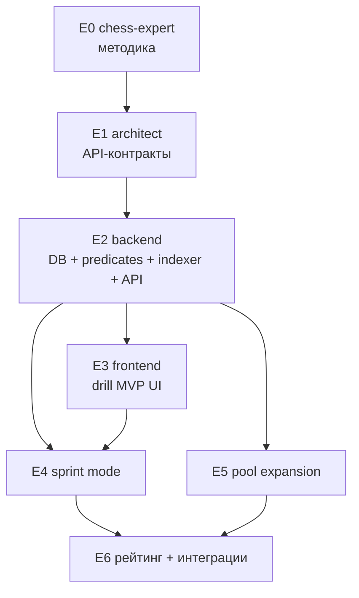

# ADR-035: Тактические микро-упражнения (Chessmaster-style pattern drills)

**Дата:** 2026-05-03
**Статус:** Предложено
**Задача:** KS-2221
**Связанные:**
- [ADR-024 Lessons module](./024-lessons-module.md) — основной learning-flow, drill'ы с ним пересекаются по UX (короткий цикл «вопрос → клик → фидбек»)
- [ADR-029 user-course custom puzzles](./029-user-course-custom-puzzles.md) — паттерн «генерация задач из FEN-источника»
- [ADR-013 game archive and tree](./013-game-archive-and-tree.md), [ADR-033 archive-database-interface](./033-archive-database-interface.md) — `ArchiveGame` как потенциальный источник позиций
- KS-364 (Puzzles рейтинг, Glicko) — источник кода `PuzzleRatingService`, который **не** наследуем напрямую (см. §3.4)
- KS-1135 / Puzzle Rush — переиспользуем компоненты доски, таймер, прогресс-бар

---

## 1. Контекст

### 1.1 Что есть сейчас
Тактика на платформе закрыта тремя точками:

| Точка | Файлы | Что делает |
|---|---|---|
| `/puzzles` (PuzzlePage) | `apps/api/src/puzzle/puzzle.service.ts`, `apps/web/src/pages/PuzzlePage.tsx` | Lichess-задача (FEN + UCI-цепочка). Пользователь играет ход за ходом, рейтинг Glicko |
| `/puzzles/rush` (PuzzleRushPage) | `apps/api/src/puzzle-rush/puzzle-rush.service.ts` | 3/5 минут на максимум решённых задач, 3 жизни |
| Mistakes diary | `apps/api/src/puzzle/mistakes.{controller,service}.ts` | Тренировка тем, в которых юзер чаще ошибается |

Все три режима — **«сыграй правильный ход»**. Это тренирует расчёт, но не тренирует **распознавание паттерна за 1–2 секунды без расчёта** (Chessmaster Vision Drill, chess.com Vision/Threat Move).

### 1.2 Чего не хватает
Тактическое зрение — отдельный навык, который сильнее всего проседает у любителей 1200–1800. Не «найди форсированный мат», а «увидь, что эта фигура уязвима / есть шах / связь стоит». Drill — короткое упражнение (5–15 секунд), один паттерн, один-несколько кликов.

Drill ≠ puzzle:
- puzzle: цепочка ходов, нужен расчёт варианта
- drill: распознать паттерн в статической позиции, ход не делается

### 1.3 Scope ADR
Только дизайн. Никаких миграций / кода / компонентов. Список тикетов на этапы — в §8.

---

## 2. Каталог типов упражнений

Семь типов в v1 (исходно было восемь — `find-mate-in-one-square` удалён в KS-2392, см. §2.2.1 (e)). Все опираются на `chess.js` (валидатор / генератор ходов) и собственные предикаты на основе `Chess.attackers()` / `Chess.moves({ verbose: true })`.

В таблице ниже:
- **Pattern** — формальное определение
- **Algo** — как находим эталонный ответ (и проверяем уникальность)
- **Answer-shape** — что кликает пользователь: `square` (одна клетка), `squares[]` (множество), `move` (фигура → клетка)
- **Side-to-move** — чья сторона на ходу, имеет ли значение

### 2.1 Семь типов

| # | id | Pattern | Algo | Answer-shape | Side-to-move |
|---|---|---|---|---|---|
| 1 | `find-hanging-piece` | Незащищённая фигура соперника, на которую можно безнаказанно напасть (или есть атакующий с нулевой защитой) | Для каждой `enemy piece` на `sq` (**король исключён из кандидатов-целей**): `attackers(sq, ourColor)` ≥ 1 **и** `attackers(sq, enemyColor)` = 0 (либо SEE > 0). **Король противника считается защитником** через `chess.attackers()` — фигура рядом с королём не считается hanging (см. §2.2.1 KS-2313) | `square` (одна правильная клетка; в задаче должна быть **ровно одна**, иначе drop) | важна |
| 2 | `find-all-checks` | Все ходы, дающие шах, для стороны на ходу | `Chess.moves({verbose:true}).filter(m => m.san.includes('+'))` → массив пар `{from, to}`. **Инварианты (KS-2313 + KS-2324):** `2 ≤ |moves| ≤ 7` — позиции с одиночным шахом или > 7 шахов отбрасываются. Drop позиций где: (a) ~~есть мат-в-1 (уходили в `find-mate-in-one-square`)~~ — после удаления типа в KS-2392 проверка избыточна, см. §2.2.1 (c); (b) среди шахов есть promotion-check (упрощение). Battery (две разные фигуры дают шах через одну `to`-клетку) — **две отдельные пары**, оба хода нужно сделать | **`moves` (массив `{from, to}`)** — пересмотрено в KS-2324 (бывшее `squares[]` отменено по фидбеку пользователя: «делать ходы», не отмечать клетки). UX: multi-step с auto-undo после каждого хода, scoring IoU 0.7 по парам (см. methodology §11) | важна |
| 3 | `find-pin` | Связанная фигура (любого цвета). По умолчанию — связки на короля (абсолютные). В v2 добавим относительные. В MVP onboarding-объяснение даёт определение: «связанная фигура — та, которую нельзя сдвинуть, потому что за ней под боем король» (KS-2223 §2.2) | Для каждой фигуры P цвета C на `sq`: убрать P → если `kingSq(C)` теперь под боем фигуры дальнобойного типа, лежащей на той же линии «attacker → P → king», и эта фигура атакует через `sq` — связка | `square` (P) | не важна (можно показывать с обеих сторон) |
| 4 | `find-fork` | **Вилка**: один ход (или существующая позиция) атакует ≥2 ценных фигур противника одновременно. Версия MVP — найти **готовую** вилку (фигура уже атакует двух). Термин «двойной удар» (double attack) шире вилки и зарезервирован под расширение в v2 | Для каждой фигуры `F` стороны на ходу: `attacks_from(F)` ∩ `enemy pieces of value ≥ minor` ≥ 2. Король всегда «ценен» | `square` (фигура, делающая вилку) | важна |
| 5 | `find-loose-piece` (отдельно от `hanging`) | Фигура противника, у которой число защитников = 0 (даже если нападающих нет). Тренирует «обзор» доски, а не расчёт обмена | Для каждой фигуры противника **кроме короля** (king не loose-кандидат): `attackers(sq, enemyColor)` = 0. **Пешки противника — полноценные кандидаты** (без исключения по типу). **Король противника считается защитником** при наличии у соседних фигур (`chess.attackers()` его учитывает). Ровно одна loose-фигура в позиции, иначе drop | `square` | не важна |
| 6 | `count-attackers` | Сколько фигур атакует данную клетку (показана подсветкой)? | `attackers(sq, color).length` | `number` (1–4 кнопки) | не применимо |
| 7 | `find-undefended-attack` | Ход, **создающий новую висящую фигуру** у соперника. «Висящая» = под боем нашей фигуры **И** без защитников (см. §2.2.1 (g) терминология). Существующие висящие в исходной позиции — **не** засчитываются: нужна именно новая угроза, появившаяся после хода | Snapshot `threatsBefore` = множество enemy-клеток с `attackers(sq, our) ≥ 1` И `attackers(sq, enemy) = 0` (король исключён). Для каждого легального `m`: apply `m` → собрать `threatsAfter` тем же правилом → undo. Кандидат, если `threatsAfter \ threatsBefore ≠ ∅` (появилась новая клетка). Strict-uniqueness: ровно 1 такой ход, иначе drop. KS-2372 — добавлен snapshot before/after; до этого predicate путал «уже висящую» с «созданной». На практике slider-фигуры почти всегда multivalent → composed drill редкий, но воспроизводимый | `move` (from + to). Promotion в v1 отбрасывается | важна |

#### 2.2 Различия и пересечения
- `find-hanging-piece` ⊃ `find-loose-piece` логически: если защитников 0, фигура «висит» с любым атакующим. Разделяем потому, что `loose` тренирует обзор без задачи «найти бьющую фигуру», а `hanging` — связку «вижу слабость → знаю, чем брать».
- `find-pin` и `find-fork` могут пересекаться (одна фигура связана **и** делает вилку). Генератор отбрасывает позиции с несколькими паттернами одного drill-набора, чтобы не путать UI.
- *(исторически)* пересечение `find-mate-in-one-square` с `find-all-checks` (мат — частный случай шаха) стало неактуальным после удаления `find-mate-in-one-square` в KS-2392. Связанная логика drop'а позиций «с матом-в-один» в predicate `find-all-checks` теперь избыточна — её допустимо снять (отдельный backend-тикет, см. KS-2393).

#### 2.2.1 Канонические инварианты предикатов (KS-2313)

Уточнения, обнаруженные при пилоте KS-2246 / KS-2312, синхронизирующие текст ADR с фактической имплементацией в `apps/api/src/tactic-drill/predicates/` (KS-2227).

**(a) Король как защитник** *(применимо к: `find-hanging-piece`, `find-loose-piece`, `find-undefended-attack`)*.
Защитники считаются через `chess.attackers(sq, sameColor)`, который **включает короля** в множество атакующих, если king атакует данную клетку. То есть фигура противника рядом с собственным королём (диагональ или соседняя клетка) — **не loose и не hanging**, потому что король «защищает» её. Это согласуется с шахматной логикой: взять фигуру под защитой короля невозможно (либо король отомстит, либо ход приводит к шаху себе).

Король сам **не входит** в кандидаты-цели (`if (p.type === 'k') continue` во всех трёх предикатах), даже если у него «нет защитников». Король атакуется отдельным понятием «шах», не drill'ом.

**(b) Пешки в loose-кандидатах** *(применимо к: `find-loose-piece`)*.
Пешки противника **являются полноценными loose-кандидатами**. Никакого исключения по типу фигуры в предикате нет — фильтр только `p.type !== 'k'`. Если пешка противника без защитников → она кандидат. Методически это корректно: незащищённая пешка тренирует тот же навык «обзор без расчёта обмена», что и незащищённый конь.

**(c) Минимальный порог `find-all-checks`**.
`MIN_CHECKS = 2`, `MAX_CHECKS = 7`. Меньше 2 — позиция не drill-задача (одиночный шах = тривиально). Больше 7 — превышает контракт `AnswerSquares` (UI 7-кнопок). Исторически дополнительно дроппались позиции с мат-в-один среди шахов (как пересечение с `find-mate-in-one-square`); после удаления типа в KS-2392 эта проверка избыточна — мат-в-1 теперь допустимо включать в множество шахов, отдельным drill-типом он больше не выделяется.

**(d) Canonical answer rule — strict-uniqueness drop**.
Для всех 7 предикатов (independenly от answer-shape): **позиция с > 1 валидными ответами отбрасывается**. Никакого «выбора лучшего» / «лексикографически первого» / «случайного» эталона среди многих не делается.

Это by design: однозначность задачи + отсутствие неопределённости при сравнении `userAnswer` против эталона. Цена — большой пул кандидатов отсеивается. На практике: для `find-undefended-attack` slider-фигуры (B/R/Q) почти всегда multivalent (длинная диагональ → много `to`-клеток создают undefended-attack) → composed drill редкий, но воспроизводимый.

Уровень сравнения зависит от answer-shape: `square` — по клетке, `move` — по полной паре `(from, to)`, `squares` — по множеству клеток (для shape='squares' дополнительно действует threshold IoU 0.7, см. methodology §6), `number` — по значению. Для shape='move' (`find-undefended-attack`) ужесточение: позиция с одной `to`-клеткой, но разными `from`-фигурами — тоже drop.

Если в v2 появится backend-тикет «выбирать canonical среди многих» — потребуется отдельное обсуждение tie-breaking rule (lexicographic / SEE-best / piece-value-max). В v1 — strict-uniqueness drop, без расширений.

Эти инварианты — **источник истины — код предикатов**. Если код в будущем меняется — ADR §2.1 / §2.2.1 обновляются синхронно.

**(e) `find-mate-in-one-square` — removed (KS-2392)**.
Тип удалён из системы: страйкт-uniqueness predicate'а (по паре `(from, to)`, KS-2320/2321) на корпусе TWIC даёт ~6 валидных позиций в БД — пул исчерпывается за минуту использования и не имеет смысла как самостоятельный drill. Альтернативные источники (Lichess puzzles с темой `mateIn1`) рассматривались в KS-2391 и отклонены пользователем в пользу полного удаления типа.

Литера (e) сохранена под исторической нумерацией; полное содержимое прежней answer-shape revision (KS-2320) — в git history файла до коммита KS-2392. Связанные тикеты на удаление: KS-2393 (backend — predicate, типы, БД), KS-2394 (frontend — UI/i18n/route).

**(f) `find-all-checks` — answer-shape revision (KS-2324)**.
Изначальное `shape: 'squares'` (отметить все клетки, куда можно дать шах) — **отменено** по фидбеку пользователя. UX-аргумент: пользователь ожидает «делать ходы», не «отмечать клетки» — drill должен быть в той же модальности, что и обычные шахматные пазлы.

Новое решение:
- **answer-shape: `moves`** (**новый, пятый shape**): `{shape: 'moves', moves: Array<{from, to}>}`. Эталон — массив пар.
- **Strict-uniqueness translation:** единица сравнения — пара `(from, to)`, не `to`-клетка. Battery-ходы (Q+R на одной линии, оба дают шах через одну клетку) — **две отдельные пары**, обе нужно сделать. Это **расширяет** банк по сравнению с прежним `squares` (где battery давал одну `to`-клетку → одна позиция pool'а).
- **MIN/MAX:** `2 ≤ |moves| ≤ 7` (как и раньше, но единица — пара). Promotion-check позиции drop'аются (упрощение по аналогии с `find-undefended-attack`).
- **Scoring:** IoU 0.7 (methodology §6.2) переходит с set-of-squares на set-of-(from,to)-pairs. Формула та же, единица другая.
- **UX:** multi-step с live feedback и auto-reset позиции после каждого хода. Прогресс «найдено N/M». Auto-submit при `found.size === expected.length`, либо явная кнопка «Готово», либо timeout. Полный flow — methodology §11.

Frontend handler shape='moves' — **новый**, отличается от shape='move' одиночного (KS-2318): multi-state, undo после каждого правильного хода, прогресс-бар, three feedback states (correct / already-found / not-a-check).

Backend predicate `find-all-checks.ts` — изменение: `Set<string>` → `Array<{from, to}>`, MIN/MAX по длине массива, добавить promotion-check drop. JSONB-эталон: `{shape:'moves', moves: [...]}` вместо `{shape:'squares', squares: [...]}`.

Downstream-импакт фиксируется в отдельных тикетах (см. KS-2324 acceptance comment).

**(g) Терминология: висящая / незащищённая / под боем (KS-2387)**.

В drill-домене три близких, но **не совпадающих** понятия. Источник истины — этот пункт; формулировки i18n (§2.3) и onboarding-объяснения подчиняются ему.

| Термин (RU) | Термин (EN) | Формальное определение | Дрилл, тренирующий понятие |
|---|---|---|---|
| **Под боем** (атакована) | **Attacked** | `attackers(sq, enemyColor) ≥ 1`. Защитники не учитываются. Фигура может быть под боем И защищена — это размен, не висящая. | — (вспомогательное понятие) |
| **Незащищённая** | **Loose** / **undefended** | `attackers(sq, sameColor) = 0`. Атакующих не учитываем — фигура может стоять на доске без всяких угроз и быть «незащищённой». | `find-loose-piece` (тип 5) |
| **Висящая** | **Hanging** | Под боем И незащищённая одновременно: `attackers(sq, enemyColor) ≥ 1` И `attackers(sq, sameColor) = 0`. Можно взять без размена. | `find-hanging-piece` (тип 1) — взять; `find-undefended-attack` (тип 7) — создать |

Ключевое: «незащищённая» — **не** синоним «висящей». Незащищённая может быть не атакована (стоит спокойно). Висящая — обязательно атакована. Эти термины **раньше употреблялись синонимично** в RU-локализации `find-undefended-attack` («останется на одну незащищённую больше», KS-2386), что было семантически неточно: predicate ищет именно появление новой **висящей** (attacked + undefended), а не любой undefended.

Дополнительно (KS-2313 (a)): король **считается защитником** (`chess.attackers` включает его), но **не считается целью** (исключён из кандидатов во всех трёх предикатах). Атака на короля — это шах, обрабатывается отдельно.

**Различие трёх связанных типов:**
- `find-loose-piece` (статика, ответ — клетка): фигура без защитников, на которую может никто и не нападать. «Обзор доски без расчёта обмена».
- `find-hanging-piece` (статика + действие, ответ — ход-взятие): висящая уже стоит, нужно её взять одним ходом без размена. «Распознать слабость и наказать».
- `find-undefended-attack` (динамика, ответ — наш атакующий ход): висящих в позиции **может не быть** (или они уже учтены через `threatsBefore`), нужно ходом создать **новую**. Способы создания: прямой удар (двинуть атакующего на клетку, бьющую цель), discovered (уйти с линии, открыв атаку sliding-фигуры), interference (перекрытие защитника), отвлечение/устранение защитника (взятие или нападение, заставляющее защитника уйти).

#### 2.3 Локализация (UX-инструкция)

| id | RU | EN |
|---|---|---|
| find-hanging-piece | «Какая фигура висит?» | «Which piece is hanging?» |
| find-all-checks | «Найдите все клетки, куда можно дать шах» | «Find every check» |
| find-pin | «Найдите связанную фигуру» | «Find the pinned piece» |
| find-fork | «Какая фигура делает вилку?» | «Which piece forks?» |
| find-loose-piece | «Какая фигура без защиты?» | «Which piece is undefended?» |
| count-attackers | «Сколько фигур атакуют выделенную клетку?» | «How many pieces attack the highlighted square?» |
| find-undefended-attack | «Какой ход создаёт у соперника новую висящую фигуру?» | «Which move creates a new hanging piece for the opponent?» |

Полный набор i18n-ключей `find-undefended-attack` (RU + EN, KS-2387) — фиксируется здесь как окончательный для v1 и подлежит переносу в `apps/web/src/i18n/locales/{ru,en}/translation.json`:

| ключ | RU | EN |
|---|---|---|
| `drills.types.findUndefendedAttack` | «Создать висящую фигуру» | «Create a hanging piece» |
| `drills.instructions.findUndefendedAttack` | «Какой ход создаёт у соперника новую висящую фигуру (под боем и без защиты)?» | «Which move creates a new hanging piece (attacked and undefended) for the opponent?» |
| `drills.instructions.findUndefendedAttackWhite` | «Какой ход белых создаёт у чёрных новую висящую фигуру?» | «Which White move creates a new hanging piece for Black?» |
| `drills.instructions.findUndefendedAttackBlack` | «Какой ход чёрных создаёт у белых новую висящую фигуру?» | «Which Black move creates a new hanging piece for White?» |
| `drills.typeDescriptions.findUndefendedAttack` | «Найдите ход, после которого у соперника появится фигура, атакованная вашей и без защитников. Такая фигура называется висящей.» | «Find a move after which the opponent has a piece that is attacked by your piece and has no defenders. Such a piece is called hanging.» |

Обоснование терминологии — §2.2.1 (g). Замена прежних формулировок («незащищённая» как синоним «висящей», KS-2386) на термин **висящая** устраняет семантическую неоднозначность: ключевое условие predicate — **attacked AND undefended**, что в шахматной терминологии называется именно «висящая» (RU) / «hanging» (EN).

Остальные семь типов — формулировки в таблице выше; правила онбординга и финальные тексты для них могут уточняться chess-expert (см. KS-DRILL-METHOD ниже).

---

## 3. Источник позиций

### 3.1 Три варианта

| Вариант | Объём | Качество | Стоимость | Решение |
|---|---|---|---|---|
| **A. Генерация на лету** (chess.js + случайные ходы из стартовой) | бесконечно | низкое: позиции «пластиковые», часто очевидные | 0 | **MVP-only**, не основной |
| **B. Индексация архива** (`archive_games`, TWIC) | 330k+ партий × ~40 ply ≈ 13M позиций. После фильтра — десятки тысяч на drill-тип | высокое: реальные позиции из мастерских партий | один batch-проход (часы) + перезапуск при пополнении TWIC | **основной для v1.x** |
| **C. Курируемые наборы FEN** (lichess studies, ChessTempo, ручной отбор chess-expert'а) | сотни | очень высокое (отобранные «учебные» позиции) | дорого по времени экспертов | **доп. для v2** (старт-набор «обучающих» на 50 шт) |

Решение: Variant A для **первого** UI-прототипа, чтобы не блокировать frontend на pipeline. Затем Variant B становится primary, Variant A фолбэк.

### 3.2 Объём по типам

| drill-type | Минимум позиций v1 | Целевой объём v2 |
|---|---|---|
| find-hanging-piece | 2 000 | 20 000 |
| find-all-checks | 2 000 | 20 000 |
| find-pin | 1 000 | 10 000 |
| find-fork | 1 500 | 15 000 |
| find-loose-piece | 2 000 | 20 000 |
| count-attackers | 500 (хватит — мало вариаций) | 2 000 |
| find-undefended-attack | 1 500 | 15 000 |

«Не повторять часто»:
- per-user cooldown на 30 дней (`tactic_drill_attempt`),
- LRU-выбор: «сначала те, что юзер не видел; затем те, что давно не видел»,
- внутри drill-mode сессии — никогда не повторять.

### 3.3 Сложность
Шкала 1–5. Финальная формула с факторами (`pieceCount`, `attackerDensity`, `distractorCount` per-type, `materialBalance`, `mobilityRatio`, `typeSpecific`), per-drill-type веса, нормализации и bucket-cuts (0.20 / 0.35 / 0.55 / 0.75 → 1..5) — зафиксированы в [`tactical-drills-methodology.md`](../architecture/tactical-drills-methodology.md) §9 (KS-2225, согласовано chess-expert).

Cold-start: минимальная версия v1 (`pieceCount + attackerDensity + typeSpecific_v1`, веса 0.30/0.30/0.40), полная формула как target-state после калибровки на 5000 решений per drill-type. Калибровка двигает bucket-cuts, не веса.

Кандидат «ply из исходной партии» — отброшен (см. methodology §9.9: ply ничего не говорит о сложности drill).

### 3.4 Рейтинг

**v1:** не считаем. Храним raw-метрики (`solved`, `time_ms`, `precision`, `recall`).

**v2 (E6, design в KS-2248):** Glicko-1 (как у Puzzle) с расширением outcome из binary в continuous (IoU как score для shape='squares'). Drill rating фиксирован по bucket'у: 1→1000, 2→1300, 3→1500, 4→1700, 5→2000. Sprint mode НЕ влияет на user-rating (отдельный leaderboard через `tactic_drill_sprint_scores`). Anti-farming: cooldown 30 дней + daily cap +50 + burst-detection >30 attempts/час. Финальный design — [`tactical-drills-methodology.md`](../architecture/tactical-drills-methodology.md) §10. Реализация — отдельный backend-тикет KS-DRILL-RATING.

---

## 4. Схема данных

### 4.1 Новые таблицы (Prisma, основная БД `packages/db`)

```prisma
model TacticDrill {
  id            String   @id @default(uuid()) @db.Uuid
  // тип паттерна — индексируемый enum-как-string
  drillType     String   @map("drill_type")     // 'find-hanging-piece' и т.д.
  fen           String                          // позиция БЕЗ предварительного хода (в отличие от Puzzle.fen)
  // правильный ответ — JSON: для squares[] это ["e4","f6"], для move это {"from":"d1","to":"h5"}, для number это 3
  answer        Json
  // human-friendly side-to-move ('w'|'b'|null если не важен)
  sideToMove    String?  @map("side_to_move") @db.Char(1)
  difficulty    Int      @default(3)            // 1..5
  // источник
  source        String   @default("archive")    // 'archive'|'generated'|'curated'
  sourceGameId  String?  @map("source_game_id") @db.Uuid  // FK на ArchiveGame (cross-DB, не enforced)
  sourcePly     Int?     @map("source_ply") @db.SmallInt
  // теги для фильтра ('opening'|'middlegame'|'endgame', 'queen-on-board' и т.п.)
  tags          String   @default("")
  // сколько раз показан / решён (для популярности и адаптации)
  shownCount    Int      @default(0) @map("shown_count")
  solvedCount   Int      @default(0) @map("solved_count")
  createdAt     DateTime @default(now()) @map("created_at")

  attempts      TacticDrillAttempt[]

  @@index([drillType, difficulty])
  @@index([drillType, source])
  @@index([sourceGameId])
  @@map("tactic_drills")
}

model TacticDrillAttempt {
  id           String   @id @default(uuid()) @db.Uuid
  drillId      String   @map("drill_id") @db.Uuid
  userId       String   @map("user_id") @db.Uuid
  drillType    String   @map("drill_type")     // дублируем для индекса агрегатов
  solved       Boolean
  timeMs       Int      @map("time_ms")
  // что юзер кликнул (тот же json-shape, что answer)
  userAnswer   Json     @map("user_answer")
  // для squares[] метрики качества: TP/FP/FN
  truePositive  Int? @map("true_positive")
  falsePositive Int? @map("false_positive")
  falseNegative Int? @map("false_negative")
  // в каком режиме решено: 'drill'|'sprint'|'lessons-embed'
  mode         String   @default("drill")
  // для sprint — связь с сессией (см. 4.2)
  sessionId    String?  @map("session_id") @db.Uuid
  createdAt    DateTime @default(now()) @map("created_at")

  drill TacticDrill @relation(fields: [drillId], references: [id])
  user  User        @relation(fields: [userId], references: [id])

  @@index([userId, createdAt])
  @@index([userId, drillType])
  @@index([drillId])
  @@map("tactic_drill_attempts")
}
```

### 4.2 Sprint-сессии — Redis, не БД
Аналогично Puzzle Rush (см. `puzzle-rush.service.ts:42` — `sessionKey`). В Postgres попадает только итог: суммарный score / accuracy после finish. Это чтобы избежать write-storm на каждый клик.

```ts
// Redis: tactic_drill_sprint:<userId>:session — TTL 10 мин
interface TacticDrillSprintSession {
  userId: string;
  drillTypes: string[];   // выбранный микс
  startedAt: number;
  durationMs: number;     // 3*60*1000 / 5*60*1000
  current: { drillId: string; drillType: string; answer: Json; shownAt: number };
  score: number;
  attempts: { drillId: string; solved: boolean; timeMs: number }[];
}

model TacticDrillSprintScore {
  id         String   @id @default(uuid()) @db.Uuid
  userId     String   @map("user_id") @db.Uuid
  mode       String                 // '3min-mixed' | '5min-mixed' | '3min-checks-only' | ...
  score      Int                    // правильных задач
  precision  Int                    // среднее в %, для типов с squares[]
  durationMs Int      @map("duration_ms")
  createdAt  DateTime @default(now()) @map("created_at")

  user User @relation(fields: [userId], references: [id])

  @@index([mode, score(sort: Desc)])
  @@index([userId, mode])
  @@map("tactic_drill_sprint_scores")
}
```

### 4.3 Почему отдельно от `Puzzle`, а не `puzzle.kind = 'drill'`
- `Puzzle.moves` — UCI-цепочка. `TacticDrill.answer` — произвольный JSON. Натянуть второе на первое = нарушить контракт.
- `Puzzle` индексируется по `rating` (Glicko), drill — нет.
- Каскадные FK на `Puzzle` уже есть из `DailyPuzzle`, `PuzzleAttempt`, `UserMistake`, `LessonStep`. Добавлять в эту цепочку «не-puzzle puzzle» — путаница.

### 4.4 На какую БД
Основная (`packages/db`). Не на archive-db: archive — read-only для importer'а, добавлять туда write-tables нельзя (см. ADR-027 / ADR-028).

---

## 5. UX и режимы

### 5.1 Drill mode (focused practice)
```
/drills/:drillType
- выбираешь тип на /drills (lobby)
- сессия фиксированной длины: 10 задач (по умолчанию) или 60 секунд (toggle)
- каждая задача:
    - инструкция (одна строка, локализована, см. §2.3)
    - доска без подсказок, side-to-move индикатор
    - таймер за-задачу: 15 сек (мягкий — после истекает идёт фидбек «не успел»)
    - клик: одна / несколько клеток / число / from→to
    - мгновенный фидбек: правильные клетки зелёные, ошибки красные
    - 1.2 сек пауза → следующая
- summary: accuracy, avg time, breakdown по сложностям
```

### 5.2 Mixed sprint (по образцу Puzzle Rush)
```
/drills/sprint?mode=3min-mixed
- 3 или 5 минут
- pool из всех 7 типов (или подмножества — ?types=checks,pins,forks)
- максимум правильных задач за время
- на ошибку — НЕ жизнь как в Puzzle Rush, а просто −0 (но накапливаем precision/recall)
- лидерборд по mode (`tactic_drill_sprint_scores`)
```

### 5.3 UX-элементы

```
┌──────────────────────────────┐
│ ⚡ 04:32  ●●●●○○○○ 4/10    │  ← timer + progress
├──────────────────────────────┤
│ Какая фигура висит?          │  ← инструкция (1 строка)
├──────────────────────────────┤
│                              │
│  [chessboard]   ⓦ to move    │  ← board + side-to-move
│                              │
├──────────────────────────────┤
│ [skip]                  [hint]│  (hint только в drill, не в sprint;
└──────────────────────────────┘    штраф −1 секунда таймера задачи)
```

### 5.4 Mobile (portrait, mobile-first)
**Главное ограничение** — клик по клетке без zoom. На 360px ширины клетка ~ 40px. Это работает для одиночного клика. Проблемы:
- `find-all-checks` — нужно 2–4 клетки. Клик-toggle (повторный клик снимает выделение).
- `find-undefended-attack` — нужно `from + to`. Двух-кликом: клик1 — фигура (подсветка), клик2 — клетка назначения. **Никакого drag-only**.
- `find-fork` — клик по фигуре. ОК.
- `count-attackers` — четыре крупные кнопки 1/2/3/4 под доской (44px touch target).

Дизайн-проверка mobile — отдельный тикет на layout.

### 5.5 Поведение «answer shape»

| shape | Принимаем | Score |
|---|---|---|
| `square` | первый клик | 1 / 0 |
| `squares[]` | пользователь жмёт N клеток + кнопка `Done` (или autosubmit когда выбрано столько же сколько в answer). Время фиксируется на `Done` | TP/(TP+FP+FN) ∈ [0,1], округление: ≥0.6 = solved |
| `number` | 4 кнопки 1/2/3/4 | 1 / 0 |
| `move` | 2-клик from→to | 1 / 0 |

---

## 6. Архитектура backend

### 6.1 Новый модуль `apps/api/src/tactic-drill/`
Идёт в `apps/api`, не в `apps/game-service` (drill — read-heavy, не WS).

```
apps/api/src/tactic-drill/
├── tactic-drill.module.ts
├── tactic-drill.controller.ts          # REST
├── tactic-drill.service.ts             # выдача задач, запись попыток
├── tactic-drill-sprint.service.ts      # Redis sessions для sprint mode
├── tactic-drill-validator.service.ts   # проверка ответа против drill.answer (shape-aware)
├── dto/
│   ├── start-sprint.dto.ts
│   ├── submit-attempt.dto.ts
│   └── drill.dto.ts
└── *.spec.ts
```

### 6.2 Endpoints

| Метод | Путь | Что делает |
|---|---|---|
| `GET` | `/api/tactic-drill/types` | Список drill-типов (id, локализованное имя, доступность) |
| `GET` | `/api/tactic-drill/next?type=<id>&difficulty=<n>` | Одна задача (без ответа в payload — только `id` + `fen` + `instructions` + `sideToMove` + `answerShape` + `meta`) |
| `POST` | `/api/tactic-drill/attempt` | Тело: `{drillId, userAnswer, timeMs, mode, sessionId?}`. Возврат: `{solved, correctAnswer, metrics}` |
| `POST` | `/api/tactic-drill/sprint/start` | Тело: `{durationMs, types[]}`. Создаёт Redis-сессию. Возврат: первая задача |
| `POST` | `/api/tactic-drill/sprint/submit` | Тело: `{sessionId, userAnswer, timeMs}`. Записывает попытку, возвращает следующую задачу или `finished:true` |
| `GET` | `/api/tactic-drill/sprint/leaderboard?mode=...` | Топ-100 |
| `GET` | `/api/tactic-drill/stats/me` | Свой break-down: accuracy и avg time по drill-type, total attempts |

`next` **никогда не возвращает `answer`** в payload — иначе клиент читает devtools. Проверка ответа исключительно на бэке.

### 6.3 Pipeline индексации позиций
Отдельный CLI-скрипт `apps/api/scripts/index-tactic-drills.ts`:
1. Читать `archive_games` пачками (`played_at DESC`, лимит 1000 партий за прогон).
2. Восстановить SAN-историю → `Chess` instance.
3. На каждом ply (`>= 6`, чтобы пропустить дебюты) — прогнать 7 предикатов из §2.1.
4. Если предикат сработал **и** в позиции **ровно один** валидный ответ (для типов где это требование) — вставить `tactic_drills` (uniqueness по `(drillType, fen)`).
5. Считать `difficulty` (см. §3.3).

Запуск:
- one-shot backfill при первом релизе,
- инкрементально после каждого TWIC import (как archive-importer триггерит broadcast — см. ADR-022 / ADR-019). Конкретный механизм триггера — задача backend'а на этапе E2.

Интеграция со Stockfish:
- **в v1 не используем**. Поднимать SF под each candidate position — дорого.
- В v2: SF для отбраковки тренировочно-плохих позиций (например `find-hanging-piece` где «висящая» фигура на самом деле под прикрытием комбинации в 3 хода).

### 6.4 Ownership
- Модуль и БД — backend.
- Скрипт индексации — backend (cron / on-demand).
- Storage позиций — `packages/db` (см. §4.4), ничего в archive-db.

---

## 7. Архитектура frontend

### 7.1 Маршруты
- `/drills` — лобби: 8 карточек по типам + кнопка «Sprint» (стиль как `LobbyPage.tsx`).
- `/drills/:drillType` — одиночный режим.
- `/drills/sprint` — sprint setup (выбор времени + типов).
- `/drills/sprint/play` — играем.
- `/drills/sprint/results/:scoreId` — итог + share.
- `/drills/leaderboard` — топ.

### 7.2 Feature flag
Под `feature_flags.key='drillsEnabled'` (по образцу `puzzlesEnabled` — см. `apps/web/src/context/FeatureFlagsContext.tsx`). Sidebar / MobileBottomBar показывают пункт «Drills» только если флаг `true`. Включаем флаг только после QA.

### 7.3 Sidebar / MobileBottomBar
Новый пункт **«Drills»** между «Puzzles» и «Lessons». Иконка — другая (предложение: `Crosshair` из lucide-react). Финальное место и иконка — на координатора + chess-expert.

### 7.4 Переиспользуем
| Компонент | Откуда | Зачем |
|---|---|---|
| `Chessboard` (react-chessboard) | `apps/web/src/components/Chessboard*` | доска без anim |
| `useTimer` хук | `apps/web/src/hooks/useTimer.ts` (если есть, иначе из `PuzzleRushPage`) | sprint timer |
| Progress bar / score header | `apps/web/src/pages/PuzzleRushPage.tsx` | sprint UI |
| `BoardSettingsContext` | global | цвета/тема доски |
| Toast feedback | существующий | «правильно/неправильно» |

### 7.5 Не переиспользуем
- `usePuzzleSolution` (играет ходы) — не подходит, drill не делает ходов.
- Glicko-rating UI — не показываем.

### 7.6 Новые компоненты
```
apps/web/src/pages/
├── DrillsLobbyPage.tsx
├── DrillPage.tsx                      # /drills/:drillType
├── DrillSprintSetupPage.tsx
├── DrillSprintPlayPage.tsx
├── DrillSprintResultsPage.tsx
└── DrillLeaderboardPage.tsx

apps/web/src/components/drills/
├── DrillBoard.tsx                     # обёртка Chessboard + click handler по answer-shape
├── DrillInstructions.tsx              # верхняя плашка + side-to-move
├── DrillFeedbackOverlay.tsx           # зелёная/красная подсветка
├── DrillTypeCard.tsx                  # карточка в лобби
└── DrillCountAttackersButtons.tsx     # 1/2/3/4 для type=count-attackers
```

### 7.7 Состояние
Локальное (`useState` в `DrillPage`). React Query для данных (`/types`, `/next`, `/stats/me`, `/leaderboard`). Глобального стейта drill'ы не требуют.

---

## 8. Заимствования и сравнения

| Платформа | Что есть | Что берём | Что **не** берём |
|---|---|---|---|
| **Chess.com Vision** | Зрение клеток / coordinates / find-the-piece | концепцию «таймер на упражнение», 4 типа | у нас не coordinates — у нас тактика |
| **Chess.com Threat Move** | Угрозы → лучший защитный ход | концепцию «оценка угрозы за 5 сек» | у нас не «как защищаться», а «что вижу» |
| **ChessTempo Standard / Theory** | Огромный pool tactical-puzzle | формат тегов | механика «сыграй ход» — это уже наш `/puzzles` |
| **Chessable Move Trainer** | spaced repetition позиций | концепцию SR (применима в v3 для пропустивших) | у нас не дебютный repertoire |
| **Chessmaster Vision Drill** | Микро-тесты «что это за паттерн» | **базовая идея целиком** (это вдохновитель ADR) | старая графика |
| **Lichess** | Прямого аналога нет (только puzzle storm/streak) | визуальный язык inline-фидбека | — |

**Уникальное у нас**:
- mixed sprint — у Chessmaster такого формата не было,
- интеграция с TWIC archive (не lichess) → в drill'ах живые мастерские позиции,
- mobile-first portrait — большинство конкурентов desktop-first,
- встраивание drill-step в системные курсы (`LessonStep.kind = 'drill'`) — отдельный design в v3.

---

## 9. План внедрения и тикеты

Этапы. Внутри каждого — explicit-список тикетов с типом исполнителя. Координатор создаёт их по этому списку.

### Этап E0. Методика (chess-expert)
**До любого кода.** Цель: финальный список drill-типов и формулировок.

- **KS-DRILL-METHOD** *(chess-expert)* — финальные 6–8 drill-типов: формулировки RU/EN, рекомендуемая сложность, какой паттерн **не** включать, методика «в каком порядке тренировать». Доставка: документ `docs/architecture/KS-XXXX-tactical-drills-methodology.md`.

### Этап E1. Детальный design (architect)
- **KS-DRILL-DESIGN** *(architect)* — детальный API-контракт (`packages/shared/types/tactic-drill.ts` — proposal), JSON-shape `answer` для каждого drill-type, спецификация валидатора. Доставка: дополнение в `docs/architecture/`.
- **KS-DRILL-DIFFICULTY** *(architect + chess-expert)* — формула сложности 1–5 (см. §3.3) и thresholds. Доставка: дополнение в methodology-doc.

### Этап E2. MVP backend (без UI)
- **KS-DRILL-DB** *(backend)* — миграция Prisma: `tactic_drills`, `tactic_drill_attempts`, `tactic_drill_sprint_scores`. Update `packages/db/prisma/schema.prisma`. БЕЗ frontend.
- **KS-DRILL-PREDICATES** *(backend)* — реализация 7 предикатов на chess.js + unit-тесты. В `apps/api/src/tactic-drill/predicates/`. Покрытие тестами — задача №1 (паттерны легко юнит-тестятся на конкретных FEN'ах).
- **KS-DRILL-INDEXER** *(backend)* — CLI-скрипт `apps/api/scripts/index-tactic-drills.ts`. Pipeline по §6.3. Запуск one-shot, генерирует ≥ MVP-объёмы из §3.2.
- **KS-DRILL-API** *(backend)* — модуль `tactic-drill/`, endpoints из §6.2 (без `/sprint/*` — sprint в E4). Включая stats/me.
- **KS-DRILL-FF** *(backend)* — feature-flag `drillsEnabled` в `feature_flags`. Default `false`.

### Этап E3. MVP frontend (drill mode only)
- **KS-DRILL-LOBBY** *(frontend)* — `DrillsLobbyPage`, реакция на feature-flag.
- **KS-DRILL-PAGE** *(frontend)* — `DrillPage` с переиспользованием `Chessboard`. Поддержка четырёх answer-shape'ов (`square`, `squares[]`, `number`, `move`).
- **KS-DRILL-COMPONENTS** *(frontend)* — `DrillBoard`, `DrillInstructions`, `DrillFeedbackOverlay`, `DrillCountAttackersButtons`, `DrillTypeCard`.
- **KS-DRILL-NAV** *(frontend)* — пункт в `Sidebar.tsx` и `MobileBottomBar.tsx` под флагом.
- **KS-DRILL-STATS** *(frontend)* — `DrillStatsPanel` в профиле (использует `/stats/me`).
- **KS-DRILL-CSS** *(layout)* — стили карточек лобби, фидбек-оверлей (зелёная/красная подсветка клеток), mobile-portrait адаптация (см. §5.4).
- **KS-DRILL-I18N** *(frontend)* — переводы RU/EN из §2.3.
- **KS-DRILL-QA-MVP** *(qa)* — тест-кейсы для Drill mode: 7 типов × happy-path, mobile portrait, фидбек-флоу, feature-flag off/on. Cypress / Playwright.

### Этап E4. Sprint mode + leaderboard
- **KS-DRILL-SPRINT-API** *(backend)* — `tactic-drill-sprint.service.ts`, Redis-сессии, endpoints `/sprint/*`. Лидерборд.
- **KS-DRILL-SPRINT-PAGE** *(frontend)* — `DrillSprintSetupPage`, `DrillSprintPlayPage`, `DrillSprintResultsPage`.
- **KS-DRILL-SPRINT-LB** *(frontend)* — `DrillLeaderboardPage` (по образцу `PuzzleRushLeaderboardPage`).
- **KS-DRILL-SPRINT-CSS** *(layout)*.
- **KS-DRILL-SPRINT-QA** *(qa)* — sprint flow, leaderboard ranking.

### Этап E5. Расширение pool позиций
- **KS-DRILL-INDEXER-INC** *(backend)* — инкрементальная индексация: после каждого TWIC import добавлять новые позиции (см. §6.3). Не one-shot.
- **KS-DRILL-CURATED** *(chess-expert + content)* — 50 курируемых FEN'ов на drill-type (Variant C из §3.1). Заливка через seed.
- **KS-DRILL-SF-VALIDATE** *(backend)* — Stockfish-валидация `find-hanging-piece` для отбраковки сомнительных позиций (висящая фигура на самом деле под прикрытием комбинации в 3 хода).

### Этап E6. Рейтинг и интеграции (v2)
- **KS-DRILL-RATING** *(architect → backend)* — design рейтинговой формулы (Glicko-light? Elo на пары «юзер vs средняя сложность»?). Затем реализация.
- **KS-DRILL-LESSON-STEP** *(backend + frontend + chess-expert)* — `LessonStep.kind = 'drill'` для встраивания drill в курсы (см. ADR-024).
- **KS-DRILL-TG** *(marketing + backend)* — daily drill в Telegram-боте (по образцу daily puzzle).
- **KS-DRILL-SHARE** *(frontend + marketing)* — share-image для sprint result.

### Зависимости



---

## 10. Риски и открытые вопросы

| # | Риск / вопрос | Кто решает | Митигация |
|---|---|---|---|
| R1 | Сколько типов из 7 действительно полезны? Не «6-7 чтобы было», а с реальной педагогической ценностью | chess-expert (E0) | Если методичка скажет «хватит 4» — урезаем без кода. KS-2392 — пример урезания (`find-mate-in-one-square` снят) |
| R2 | Pipeline индексации на 13M позиций × 7 предикатов = долго. На production-БД нагрузит archive-replica | backend (E2) | Не run на prod-replica; копируем партии батчами в worker, считаем offline, вставляем результат |
| R3 | Mobile portrait: клик по клетке 40px без zoom. Особенно проблема для `find-all-checks` где надо 4 клика | layout + qa (E3) | A/B на early-access юзерах. Fallback: zoom on long-press с фиксацией pointer-events |
| R4 | `find-fork` / `find-pin` могут давать неоднозначные ответы (несколько вилок в позиции) | backend (E2) | Предикат отбрасывает позиции с >1 валидным ответом для shape=`square` |
| R5 | Stockfish в воркере как узкое место (если в E5 решим валидировать SF'ом) | backend (E5) | Один воркер один SF-instance, лимит 1 позиция/сек, фоновая очередь |
| R6 | Локализация инструкций — chess-expert + chess.js notation. Решено: **Unicode-символы primary** + SVG-spritеfallback + a11y aria-label (см. [`tactical-drills-methodology.md`](../architecture/tactical-drills-methodology.md) §7) | chess-expert (закрыто KS-2223) | В promptах основных 7 типов фигуры почти не упоминаются — Unicode нужен в onboarding/разборах; локализованные буквы только в SAN/PGN |
| R7 | Нужен ли рейтинг вообще или summary «accuracy + avg time» достаточно мотивирует | architect + UX (E6) | **Закрыто KS-2248**: рейтинг есть в v2 (Glicko-1 с continuous outcome), design в [`tactical-drills-methodology.md`](../architecture/tactical-drills-methodology.md) §10. Drill-rating + sprint-score — два независимых leaderboard'а |
| R8 | Что считать «решено» для shape=`squares[]`? **Threshold 0.7 IoU** (зафиксировано в [`tactical-drills-methodology.md`](../architecture/tactical-drills-methodology.md) §6, KS-2223) | chess-expert (закрыто KS-2223) | Метрить на первых 1000 сессиях; правила пересмотра — methodology-doc §6.4 |
| R9 | Cooldown 30 дней — что делать power-user'у который пройдёт пул за неделю | backend (E5) | Variant A (генерация на лету) включается как фолбэк когда пул для юзера исчерпан |
| R10 | Конфликт навигации: Sidebar уже плотный (Lobby/Play/Puzzles/Lessons/Tournaments...). Куда «Drills»? | координатор + frontend (E3) | Под «Puzzles» как подпункт `/puzzles/drills`, либо отдельный пункт под feature-flag — решение в KS-DRILL-NAV |

---

## Приложение A. Сводная таблица тикетов

| Этап | Ticket | Исполнитель | Зависит от |
|---|---|---|---|
| E0 | KS-DRILL-METHOD | chess-expert | — |
| E1 | KS-DRILL-DESIGN | architect | E0 |
| E1 | KS-DRILL-DIFFICULTY | architect + chess-expert | E0 |
| E2 | KS-DRILL-DB | backend | E1 |
| E2 | KS-DRILL-PREDICATES | backend | E1 |
| E2 | KS-DRILL-INDEXER | backend | KS-DRILL-DB, KS-DRILL-PREDICATES |
| E2 | KS-DRILL-API | backend | KS-DRILL-DB |
| E2 | KS-DRILL-FF | backend | — |
| E3 | KS-DRILL-LOBBY | frontend | KS-DRILL-API, KS-DRILL-FF |
| E3 | KS-DRILL-PAGE | frontend | KS-DRILL-API |
| E3 | KS-DRILL-COMPONENTS | frontend | — |
| E3 | KS-DRILL-NAV | frontend | KS-DRILL-FF |
| E3 | KS-DRILL-STATS | frontend | KS-DRILL-API |
| E3 | KS-DRILL-CSS | layout | KS-DRILL-COMPONENTS |
| E3 | KS-DRILL-I18N | frontend | KS-DRILL-METHOD |
| E3 | KS-DRILL-QA-MVP | qa | E3 целиком |
| E4 | KS-DRILL-SPRINT-API | backend | E2 |
| E4 | KS-DRILL-SPRINT-PAGE | frontend | KS-DRILL-SPRINT-API |
| E4 | KS-DRILL-SPRINT-LB | frontend | KS-DRILL-SPRINT-API |
| E4 | KS-DRILL-SPRINT-CSS | layout | KS-DRILL-SPRINT-PAGE |
| E4 | KS-DRILL-SPRINT-QA | qa | E4 целиком |
| E5 | KS-DRILL-INDEXER-INC | backend | KS-DRILL-INDEXER |
| E5 | KS-DRILL-CURATED | chess-expert + content | KS-DRILL-DB |
| E5 | KS-DRILL-SF-VALIDATE | backend | KS-DRILL-INDEXER |
| E6 | KS-DRILL-RATING | architect → backend | E4 |
| E6 | KS-DRILL-LESSON-STEP | backend + frontend + chess-expert | E3, ADR-024 |
| E6 | KS-DRILL-TG | marketing + backend | E3 |
| E6 | KS-DRILL-SHARE | frontend + marketing | E4 |

Итого: **27 тикетов** (1 chess-expert E0 + 2 architect E1 + 5 backend E2 + 8 E3 (frontend/layout/qa) + 5 E4 + 3 E5 + 4 E6).

---

## Приложение B. Что **не** входит в этот ADR
- Точная формула рейтинга (отложено на E6 / KS-DRILL-RATING).
- Drill-step как часть `LessonStep` (E6 / KS-DRILL-LESSON-STEP, требует совместного design'а с ADR-024).
- Социальные фичи (1v1 race, friends-leaderboard) — после v2.
- Редактор drill'ов для админа (использовать seed-скрипты пока что).
- Покрытие drill'ами эндшпиля (`is-the-king-in-the-square`, оппозиция и т.п.) — отдельный набор паттернов, требует chess-expert input в v3.
