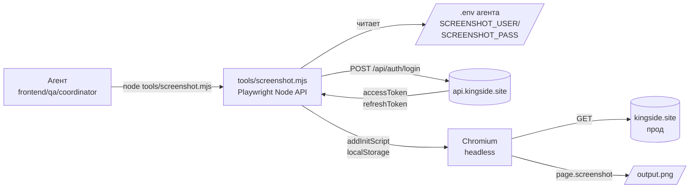
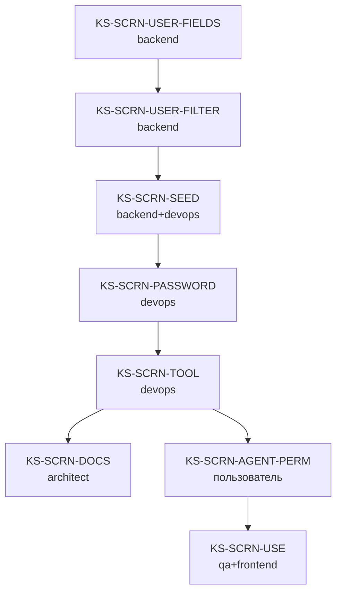

# ADR-036: Tooling для авторизованных скриншотов прода для агентов

**Дата:** 2026-05-03
**Статус:** Superseded by [ADR-039](./039-agent-screenshot-tooling-rev.md) §1, §3.2, §3.3, §10 R4
**Задача:** KS-2253
**Связанные:**
- [ADR-039](./039-agent-screenshot-tooling-rev.md) — ревизия (zero-touch для пользователя, выдача JWT через open internal endpoint вместо env-credentials)
- [ADR-006 Agent coordination](./006-agent-coordination.md) — общая модель агентов и их инструментов
- [ADR-007 Anti-duplication enforcement](./007-anti-duplication-enforcement.md) — ограничения agent-окружения
- KS-2228 / KS-2252 — багфиксы, заблокированные отсутствием tooling'а
- `apps/e2e/fixtures/auth.fixture.ts` — готовый паттерн API-логина и `addInitScript` для inject'а localStorage

> **Примечание (KS-2309).** Статус документа изменён на Superseded по ADR-039. Содержимое ADR-036 ниже сохранено без правок как исторический контекст. Что именно отменено: §3.2 (env-credentials в контейнере агента), §3.3 (доступ к credentials через `process.env`), §10 R4 (90-дневная ротация пароля под screenshot-flow). Test-аккаунт, фильтрация публичных endpoints (§3.1, §3.4), CLI-API скрипта (§5), список ролей (§7) — остаются в силе. См. ADR-039 §5 «Diff с ADR-036» для построчного сравнения.

---

## 1. Контекст

### 1.1 Что есть сейчас
Агенты делают скриншоты прода через CLI:

```bash
/project/node_modules/.bin/playwright screenshot https://kingside.site/lobby /tmp/lobby.png
```

(`CLAUDE.md`, `apps/web/Playwright config note`).

CLI-форма работает только **анонимно**. Невозможно:
- инжектить токен в localStorage до загрузки страницы,
- параметризовать viewport (mobile portrait),
- ждать сверх минимального `domcontentloaded`,
- скриншотить отдельный селектор.

### 1.2 Цена ограничения
Свежий пример — KS-2252: пользователь сообщает «у залогиненного остаётся бейджик ассистента после `assistantEnabled=false`». Frontend-агент **не может проверить сам** — нужен прод-аккаунт. Без tooling'а:
- агент гадает по коду,
- либо просит скрин у пользователя (ломает loop «агент решает сам»),
- либо рассчитывает на dev_bypass и пропускает прод-специфичные баги (CF-кэш, реальные whitelist'ы API).

KS-2228, KS-2222 — аналогично. Это блокер для целого класса задач: ChatWidget, бейджи в header, mobile bottom-bar, баннеры, статистика профиля, notifications.

### 1.3 Что уже работает в коде
- `POST /api/auth/login {username, password}` → `{accessToken, refreshToken}` (AuthController).
- Frontend хранит токены в `localStorage.token` и `localStorage.refreshToken` (AuthContext).
- В e2e-тестах паттерн уже отработан: `apps/e2e/fixtures/auth.fixture.ts`:

  ```ts
  const tokens = await page.request.post(`${API_URL}/api/auth/login`, { data: {...} });
  await page.addInitScript((t) => {
    localStorage.setItem('token', t.accessToken);
    localStorage.setItem('refreshToken', t.refreshToken);
  }, await tokens.json());
  ```

Tooling — это «вытащить этот паттерн в standalone CLI на Node + Playwright API».

### 1.4 Существующий `dev-bypass` как backdoor

`/api/auth/dev-bypass` сейчас включён на проде (`auth.service.ts:242`: `NODE_ENV=production check temporarily disabled for bot testing`). Технически агенты **могут** ходить через него, если знают секрет. Но это:
- **не security-by-design**: один секрет → любой DEV-юзер платформы → backdoor для всех,
- путает CF-кэш / nginx-config: dev_bypass юзер ≠ обычный flow,
- противоречит самой задаче KS-2253: «скриншоты на dev_bypass не отражают реальное прод-поведение».

В этом ADR `dev-bypass` **не используется** для скриншотов. Параллельно — рекомендация в §10 R5 закрыть его на проде.

---

## 2. Решение: вариант A (test-account + Playwright Node API)

Из трёх предложенных:

| Вариант | Решение | Почему |
|---|---|---|
| **A. Test-account + Playwright API** | **Принято** | минимум новой инфраструктуры; реальный прод; паттерн готов в e2e-фикстуре; secrets ограничены одним пользователем без прав |
| B. Stage с dev_bypass | Отвергнуто | не отражает прод (не проверяет CF-кэш, реальные whitelist'ы API). Сама задача указывает stage как **проблему**, а не решение. Поднять stage = ~80 ч. devops |
| C. Backend-side screenshot service | Отложено в v2 | нагрузка ~10–50 скринов/день не оправдывает выделенный сервис с Chromium (200+ MB RAM, отдельный ECS-task). Возвращаемся к C, если нагрузка вырастет на порядок (см. §9) |

**Гибрид**: сейчас — только A. C — как fallback в roadmap при росте.

### 2.1 Архитектура



---

## 3. Безопасность

### 3.1 Тестовый аккаунт
Заводим **один** аккаунт на проде:

| Поле | Значение |
|---|---|
| `username` | `__screenshot_agent` (с двумя подчёркиваниями — соглашение «системный, не человек») |
| `email` | `screenshot-agent@kingside.local` |
| `role` | обычный user, **без admin** |
| `User.isTestAccount` | `true` (новое поле, см. §3.4) |
| `User.isHidden` | `true` (новое поле — скрыт в /users поиске, leaderboard'ах, лобби, friends) |

**Что аккаунт НЕ должен делать:**
- играть в публичных турнирах (фильтр `User.isHidden` в `tournament.service.ts`),
- появляться в Puzzle Rush leaderboard, в archive-search «найти игрока», в matchmaking pool,
- делать платежи / иметь подписки,
- получать админ-права под любым предлогом.

**Что должен:**
- иметь минимальный «реалистичный» состояние UI: 2 партии в архиве, 5 решённых пазлов, 1 unread notification, 1 friend (тоже test-аккаунт `__screenshot_friend` если потребуется в v2). Это чтобы скриншот «Profile» не показывал пустую страницу — иначе теряется смысл прод-проверки UI.

### 3.2 Где хранятся credentials
**В env-файле агентского контейнера**, не в репозитории:

```
# Вне репо — в /home/agent/.env (или K8s/ECS secret в проде агентов)
SCREENSHOT_AGENT_USERNAME=__screenshot_agent
SCREENSHOT_AGENT_PASSWORD=<random 32 chars>
SCREENSHOT_AGENT_API_URL=https://api.kingside.site
SCREENSHOT_AGENT_WEB_URL=https://kingside.site
```

**Никогда не**:
- коммитить в `.env.example` (нечего показывать),
- логировать токен в stdout / stderr (script маскирует первые/последние 4 символа),
- передавать через CLI-аргументы (видно в `ps aux`),
- помещать в `apps/web/.env` (попадёт в Vite bundle).

**Ротация**: пароль ротируется devops'ом раз в 90 дней через `/api/auth/change-password` (нужно проверить что endpoint есть; иначе через прямой UPDATE в БД с bcrypt). Скрипт сам не ротирует.

### 3.3 Кто имеет доступ к credentials
- Пользователь (владелец платформы, ставит env через `1Password → docker-compose.yml` или K8s secret).
- Агенты в контейнере читают через `process.env`.
- НЕ имеют доступа: репозиторий, CI, любые внешние сервисы, MCP-инструменты других проектов.

### 3.4 Backend-флаги изоляции

Новые поля в `User`:

```prisma
model User {
  // ...
  isTestAccount Boolean @default(false) @map("is_test_account")
  isHidden      Boolean @default(false) @map("is_hidden")
  // ...
}
```

Где **обязательно** добавить фильтры (детальный список в §6 — задача backend'а):
- `tournament.service.ts` — `where: { isHidden: false }` в `findOpenTournaments()`,
- `puzzle-rush.service.ts` — leaderboard `where: { user: { isHidden: false } }`,
- `users.service.ts findByUsername()` — для public профиля 404 если `isHidden`,
- `friend.service.ts findFriendsOfFriends()` — exclude,
- archive-search «по имени игрока» — exclude (это в archive-service, отдельная фильтрация по nickname blacklist).

### 3.5 Threat-model

| Угроза | Severity | Митигация |
|---|---|---|
| Утечка credentials → чужой логин в test-аккаунт | Low | Аккаунт без прав, без денег, в blacklist. Ротация раз в 90 дней. Audit-log на login |
| Скриншот-скрипт делает побочные действия (POST'ит куда-то) | Low | Скрипт делает только `auth/login` + `page.goto` + `page.screenshot`. Нет других endpoints. Code-review |
| CF / nginx видят паттерн «много скриншотов с одного IP/UA» — bans | Medium | Скрипт ходит через тот же IP, что и агенты. Если CF забанит — добавить агентский IP-range в whitelist. UA — `Playwright/headless Chrome`, можно настроить custom UA с подписью `Kingside-AgentScreenshot/1.0` |
| `localStorage.token` остаётся в `~/.cache/ms-playwright` после краша | Low | `--user-data-dir=/tmp/agent-screenshot-<uuid>` каждый запуск, удаляется в `finally` |

---

## 4. Где живёт скрипт

**Решение: `/tools/screenshot.mjs`**.

Обоснование:
- `/tools/` уже содержит `mcp-agent.mjs` — агентский tooling, не продуктовый код.
- `/scripts/` — обычно зона devops, в текущем scope-конфиге архитектора недоступна.
- Отдельный пакет (`packages/agent-tools`) — overkill для одного `.mjs`-файла.
- В `apps/e2e/` — это для тестов, не для tooling. Смешивание усложнит понимание.

**Запуск** — с использованием уже установленного Playwright из `/project/node_modules` (по соглашению `CLAUDE.md`):

```bash
/project/node_modules/.bin/node tools/screenshot.mjs <args>
# или
node tools/screenshot.mjs <args>
```

(Node версия из контейнера агента — Node 20 LTS.)

---

## 5. CLI-API

### 5.1 Базовая форма

```
node tools/screenshot.mjs <url> <output.png> [options]
```

| Опция | По умолчанию | Описание |
|---|---|---|
| `--auth=<mode>` | `none` | `none` — анонимно; `test` — лог-ин под `__screenshot_agent` |
| `--viewport=<preset>` | `desktop` | `desktop` (1280×800), `mobile` (390×844, iPhone 13), `mobile-small` (360×640), `tablet` (768×1024) |
| `--wait-ms=<n>` | `0` | дополнительная задержка после `networkidle` |
| `--wait-for=<sel>` | — | CSS-селектор; ждём появления элемента (timeout 15s) |
| `--selector=<sel>` | — | если задан — скриншот только этого элемента |
| `--full-page` | `false` | full-page-скриншот |
| `--theme=<dark/light>` | — | если задан — `prefers-color-scheme` |
| `--locale=<ru/en>` | — | если задан — `Accept-Language` header |
| `--debug` | `false` | сохранить HAR + console.log в `<output>.debug/` |

### 5.2 Примеры

**Анонимная страница:**
```bash
node tools/screenshot.mjs https://kingside.site/lobby /tmp/anon-lobby.png
```

**Авторизованная страница:**
```bash
node tools/screenshot.mjs https://kingside.site/profile /tmp/profile-auth.png --auth=test
```

**Mobile-portrait, с авторизацией:**
```bash
node tools/screenshot.mjs https://kingside.site/play /tmp/mobile-play.png \
  --auth=test --viewport=mobile
```

**Только конкретный компонент (KS-2252 кейс):**
```bash
node tools/screenshot.mjs https://kingside.site/lobby /tmp/header.png \
  --auth=test --selector="header" --wait-for="[data-testid=user-menu]"
```

**С дебагом:**
```bash
node tools/screenshot.mjs https://kingside.site/analysis /tmp/analysis.png \
  --auth=test --debug
# создаёт также /tmp/analysis.png.debug/{network.har,console.log}
```

### 5.3 Exit codes

| Code | Значение |
|---|---|
| `0` | OK |
| `1` | network error / timeout |
| `2` | auth failed (login 401) |
| `3` | env vars не заданы (`--auth=test` без `SCREENSHOT_AGENT_*`) |
| `4` | selector не найден |

### 5.4 stdout
Скрипт печатает **только** путь к финальному файлу:
```
/tmp/profile-auth.png
```

Всё прочее — в stderr. Это позволяет агенту использовать stdout как input для следующей команды без парсинга.

### 5.5 Параметризация mobile (детально)

```ts
// внутри tools/screenshot.mjs
import { devices } from '@playwright/test';

const VIEWPORTS = {
  desktop:      { ...devices['Desktop Chrome'], viewport: { width: 1280, height: 800 } },
  mobile:       { ...devices['iPhone 13'] },                    // 390×844, hasTouch, isMobile, scale 3
  'mobile-small': { ...devices['Galaxy S5'] },                  // 360×640
  tablet:       { ...devices['iPad (gen 7)'] },                 // 768×1024
};
```

Это даёт корректные `userAgent`, `deviceScaleFactor`, `hasTouch` — иначе CSS @media `(hover: none)` не сработает и mobile-портретные стили не активируются.

### 5.6 Авто-обновление токена
JWT access-token ~15 минут (надо проверить, типичная конфигурация). Скрипт:
1. Логинится перед каждым запуском (proxy не кэширует токен между запусками).
2. Если на странице токен протух → 401 на API → frontend ремонтирует через `/auth/refresh`. Скрипт inject'ит **оба** токена (access + refresh), refresh-flow работает сам.

---

## 6. План внедрения

### E1. Backend подготовка
- **KS-SCRN-USER-FIELDS** *(backend)* — новое поле `User.isTestAccount: Boolean` и `User.isHidden: Boolean` + миграция Prisma.
- **KS-SCRN-USER-FILTER** *(backend)* — добавить фильтрацию `where: { isHidden: false }` в:
  - `puzzle-rush.service.ts` (leaderboard),
  - `tournament.service.ts` (открытые турниры, entries),
  - `users.controller.ts` (public profile 404 для hidden),
  - `friend.service.ts` (FoF/recommendations),
  - `matchmaking` (pool),
  - `archive-service` поиск по имени игрока (если test-аккаунт играл в архив-партиях — он не должен туда попадать; на старте partial: создаём аккаунт после, в архиве его нет → норма).
  Тесты на каждый фильтр.

### E2. Создание test-аккаунта
- **KS-SCRN-SEED** *(backend + devops)* — seed-скрипт `apps/api/scripts/seed-screenshot-account.ts`:
  - upsert юзера `__screenshot_agent` с `isTestAccount=true, isHidden=true`,
  - bcrypt-хэш пароля из env (`SCREENSHOT_AGENT_PASSWORD_INIT`),
  - 2 sample-партии в архиве, 5 решённых пазлов, 1 unread notification.
  - Запускается одноразово devops'ом на проде, далее автоматически в каждой prod-миграции (idempotent).
- **KS-SCRN-PASSWORD** *(devops)* — генерация пароля, инжект в production env агентов и в один Vault-запись (1Password / AWS Secrets Manager).

### E3. CLI-скрипт
- **KS-SCRN-TOOL** *(devops или backend)* — `scripts/screenshot.mjs`:
  - всё из §5,
  - юнит-тест на arg-parsing,
  - одна e2e-проверка против локального dev (`npm run dev` + screenshot на `/lobby` без auth и с auth).
- **KS-SCRN-DOCS** *(architect)* — обновить `CLAUDE.md`:
  - заменить «Playwright: `… playwright screenshot …`» на «`node scripts/screenshot.mjs <url> <out> [--auth=test]`»,
  - добавить раздел «Скриншоты прода под авторизацией».

### E4. Включение для агентов
- **KS-SCRN-AGENT-PERM** *(пользователь / devops)* — добавить в `.claude/settings.json` (or settings.local.json) разрешение на:
  - `Bash(node scripts/screenshot.mjs *)`,
  - убедиться что env `SCREENSHOT_AGENT_*` пробрасываются в контейнер.
  *(Этот тикет на пользователя — настройки агентов в нашем стандарте меняет только он.)*
- **KS-SCRN-USE** *(qa + frontend)* — обкатать на свежей задаче (например, повторить KS-2252 проверку): сделать скрин до/после фикса под `--auth=test`.

### E5. Опциональное (v2, по росту нагрузки)
- **KS-SCRN-SERVICE** *(architect → backend + devops)* — backend-side screenshot service (вариант C): только если число скринов в день вырастет на порядок (>50/день, см. §9 R3) или если CF начнёт банить агентский IP. Сейчас не делаем.

### Зависимости



---

## 7. Кому из агентов это нужно

| Роль | Нужно? | Зачем |
|---|---|---|
| frontend | да | проверка UI после изменений (главный потребитель) |
| qa | да | приёмка задач |
| coordinator | да | финальный review «выглядит ли это как просил пользователь» |
| layout | да | mobile portrait, фиксы CSS |
| marketing | иногда | проверка SEO/баннеров под залогиненными |
| backend | редко | в основном анонимные эндпоинты, но иногда «как выглядит ответ API в UI» |
| architect | редко | для ADR-иллюстраций |
| devops | редко | проверка деплоев |
| chess-expert / content | нет | работают со статичным контентом |

Скрипт не имеет ограничений по роли (это технический инструмент). Allowlist в `.claude/settings.json` — пермит на `Bash(node tools/screenshot.mjs *)` для всех агентов.

---

## 8. Связь с CLAUDE.md / agent docs

После E3:
1. В `CLAUDE.md` строку про playwright заменить на:

   ```
   - Скриншоты прода: `node tools/screenshot.mjs <url> <out.png> [--auth=test|none] [--viewport=mobile|desktop]`.
     Подробнее: docs/adr/036-agent-screenshot-tooling.md.
   ```

2. В `.claude/agents/{frontend,qa,layout,coordinator}.md` (через пользователя — агенты не правят `.claude/agents/*`) — упоминание о новом инструменте.

   *Это делает пользователь после KS-SCRN-DOCS.*

---

## 9. Риски и открытые вопросы

| # | Риск / вопрос | Кто | Митигация |
|---|---|---|---|
| R1 | Test-аккаунт всё-таки попадёт в leaderboard / поиск из-за пропущенного фильтра | backend (E1) | Системный тест: «test-юзер в БД → ни один публичный endpoint его не возвращает». Фейлящий тест блокирует мердж |
| R2 | Прод-CF банит агентский IP за headless-Chrome паттерн | devops (E4) | UA выставить `Kingside-AgentScreenshot/1.0`, добавить в CF whitelist, rate-limit ≤10 req/min |
| R3 | Нагрузка вырастет на порядок (десятки агентов × сотни скринов) | architect | Триггер для E5 (variant C). Сейчас expected ~10–50/день |
| R4 | Пароль ротируется раз в 90 дней — кто это инициирует, как не забыть | devops | Cron-напоминание в Slack/Telegram + календарное событие у владельца |
| R5 | `dev-bypass` на проде остаётся открытым (см. §1.4) — отдельная уязвимость | backend (отдельный тикет) | **KS-SCRN-DEVBYPASS** *(backend)*: вернуть `NODE_ENV=production` check в `auth.service.ts:242`. Это **не часть** screenshot-tooling, но обнаружено при работе над ADR — стоит закрыть параллельно |
| R6 | Mobile-viewport — `iPhone 13` 390×844, но реальные пользователи на 360×640 (Android). Скрин может скрыть баги ниже 390px | qa (E3) | Дать оба пресета: `mobile` (390) и `mobile-small` (360). Решение какой использовать — на агенте по контексту задачи |
| R7 | Скриншот делается в момент когда страница успела рендернуться, но WebSocket-данные ещё не пришли (например, статус друзей) → ложно «пустой» UI | qa (E3) | Опция `--wait-for=<sel>` под селектор «данные точно пришли». Конкретные селекторы — задача frontend на этапе E4 |
| R8 | Test-аккаунт игнорирует CF-кэш (cookie hash другой) → может прятать прод-баг кэша. Реверс — баг видим, но не репродуцируется у обычного юзера | qa | Документировать, agent в комментарии задачи отмечает «снимок под __screenshot_agent» |
| R9 | Audit: cron-задача проверяет что test-аккаунт логинится только из агентских IP, иначе alert | devops (после E4) | Не критично для v1. Открываем тикет если будет инцидент |
| R10 | Что если агент случайно `git commit`-нёт `.env` с паролем | пользователь / devops | `.env` уже в `.gitignore` (must verify). Pre-commit hook на secret-scanning (gitleaks). Ротация пароля при инциденте |

---

## 10. Сводная таблица тикетов

| Этап | Ticket | Исполнитель | Зависит от |
|---|---|---|---|
| E1 | KS-SCRN-USER-FIELDS | backend | — |
| E1 | KS-SCRN-USER-FILTER | backend | KS-SCRN-USER-FIELDS |
| E2 | KS-SCRN-SEED | backend + devops | KS-SCRN-USER-FILTER |
| E2 | KS-SCRN-PASSWORD | devops | KS-SCRN-SEED |
| E3 | KS-SCRN-TOOL | devops | KS-SCRN-PASSWORD |
| E3 | KS-SCRN-DOCS | architect | KS-SCRN-TOOL |
| E4 | KS-SCRN-AGENT-PERM | пользователь | KS-SCRN-TOOL |
| E4 | KS-SCRN-USE | qa + frontend | KS-SCRN-AGENT-PERM |
| E5 | KS-SCRN-SERVICE | architect → backend + devops | (отложено) |
| доп | KS-SCRN-DEVBYPASS | backend | — (параллельно) |

Итого: **9 тикетов** (8 в основной цепочке + 1 опциональный + 1 параллельный security).

---

## 11. Что **не** входит в этот ADR
- Видео-запись прод-сессии (record_gif). Уже есть MCP-тул `record_gif`, к нему применима та же логика auth — отдельным тикетом, не сейчас.
- Visual regression tests (Percy / Chromatic) на проде. Это другой класс задач.
- Self-service web UI «дай скрин любой страницы за меня» для нон-агентов (overkill).
- Несколько тестовых аккаунтов с разными ролями (admin, premium-user). Открываем когда понадобится — `__screenshot_admin`, `__screenshot_premium` по тому же шаблону.
- Cross-browser скрины (Firefox, Safari). Сейчас Chromium достаточно — основные баги в нём.
