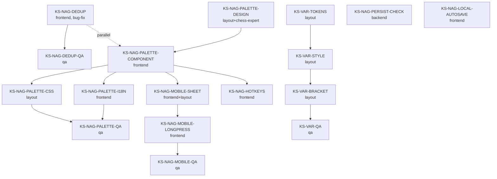

# ADR-037: Палитра NAG-аннотаций и подсветка вариантов в окне анализа

**Дата:** 2026-05-03
**Статус:** Предложено
**Задача:** KS-2264
**Связанные:**
- [ADR-008 game analysis persistence](./008-game-analysis-persistence.md) — где живут review-состояние и PGN
- KS-2005 — текущая context-menu для NAG (`!`, `?`, `!!`, `??`, `!?`, `?!`)
- KS-2152 — `annotationsByIndex` (CSL/CAL стрелки) — отдельная подсистема, **не путать** с NAG'ами
- KS-1810 — стилизация current-move с inline NAG/clock/eval

---

## 1. Анализ текущего состояния

### 1.1 Где живёт логика правого клика

Полная цепочка вызовов:

```
ReviewMoveList.tsx (handleMoveContextMenu / handleTouchStart)
  → showContextMenu()
  → render <div class="review-context-menu"> с NAG_BUTTONS
  → handleNagToggle(nag)
  → onSetNag(globalIndex, newNags)            // prop
  → useReviewState.setNag()
  → dispatch({ type: 'SET_NAG', payload: { globalIndex, nags } })
  → reducer обновляет move.nags
  → reserialize → PgnSerializer ставит $N токены
```

**Файлы:**
- `apps/web/src/review/components/ReviewMoveList.tsx:32-39, 196-205, 251-267, 411-434` — context-menu, кнопки, toggle, рендер символов.
- `apps/web/src/review/components/ReviewMoveList.css:270-355` — стили кнопок и inline-символов.
- `apps/web/src/review/useReviewState.ts:239-248, 410-411` — reducer SET_NAG, `setNag()`.
- `apps/web/src/review/utils/nagUtils.ts` — мапа NAG ↔ symbol (16 записей: 1-7, 10, 13-19).
- `apps/web/src/review/utils/PgnSerializer.ts:48-52` — выводит каждый NAG как отдельный `$N` токен.
- `apps/web/src/review/utils/PgnDeserializer.ts` — парсит `$N` и символьные `!/?/!!/??/!?/?!` (см. `PgnNagComments.spec.ts`).
- `apps/web/src/review/types.ts:47` — `nags?: number[]` в `ChessMove`.

### 1.2 Как хранятся аннотации

В **двух местах** одновременно (это технический долг, но не предмет ADR):
- `move.nags: number[]` — список NAG-номеров на узле дерева ходов.
- При re-serialize PGN каждый NAG идёт отдельным токеном `$N` в той же позиции после SAN.

Аннотации **не имеют отдельного store** в reducer (в отличие от `annotationsByIndex` для CSL/CAL стрелок, KS-2152). Они мутируются прямо на узле `ChessMove`. Это корректно для NAG, потому что NAG — часть PGN-узла по стандарту, а стрелки — расширение.

### 1.3 Корень bug'а

В `ReviewMoveList.tsx:201-204`:

```ts
const newNags = hasNag
  ? currentNags.filter((n) => n !== nag)
  : [...currentNags, nag];   // ← здесь
```

Логика toggle сама по себе корректна (повторный клик удаляет). **Проблема не в этой строке**, а в том, что:

1. **Нет дедупликации внутри категории.** `[1, 3]` (`!` + `!!`) — оба NAG категории «качество хода». В ChessBase / CSL стандарте на ход может стоять **не более одного** NAG из этой категории. Сейчас можно нащёлкать `!`, `!!`, `?` подряд — и получить `[1, 3, 2]`, что в PGN сериализуется как `e4 $1 $3 $2` и читается как «хороший, блестящий, плохой» одновременно.
2. **`renderNagSymbols` (строка 254)** делает `.filter((n) => n >= 1 && n <= 6)` и рендерит **все** оставшиеся NAG'и. Если их три — рендерится три символа подряд: `e4!!!?` — эту мешанину видит пользователь.

PGN-стандарт **формально** разрешает несколько NAG на ход (`1. e4 $1 $14`) — но **в разных категориях**: `$1` — качество хода, `$14` — оценка позиции (`⩲`). См. `PgnNagComments.spec.ts:30`. Дедупликация должна быть **внутри категории**, не глобально.

### 1.4 Текущая палитра — 6 кнопок (только move-quality)

```
NAG_BUTTONS = [
  { nag: 1, label: '!' },     // good
  { nag: 3, label: '!!' },    // brilliant
  { nag: 2, label: '?' },     // mistake
  { nag: 4, label: '??' },    // blunder
  { nag: 5, label: '!?' },    // interesting
  { nag: 6, label: '?!' },    // dubious
]
```

Position-evaluation NAG (10 = `=`, 13 = `∞`, 14-17 = `±/⩲/⩱/∓`, 18-19 = `+−/−+`) **не выведены в UI**, хотя `nagUtils.ts` их знает и парсер PGN их понимает. То есть пользователь, открывший партию с `$14` в PGN, увидит символ `⩲` рядом с ходом, но добавить его не сможет.

### 1.5 Текущая подсветка вариантов

`ChessMoveProcessing.ts:179-196`: применяется CSS-класс `variation-level-{1..4}` по уровню вложенности.

CSS (`ReviewMoveList.css:200-203`):
```css
.variation-level-1 { color: var(--c-90caf9); }   /* light blue */
.variation-level-2 { color: var(--c-a5d6a7); }   /* light green */
.variation-level-3 { color: var(--c-ffe082); }   /* amber */
.variation-level-4 { color: var(--c-ef9a9a); }   /* light red */
```

То есть **подсветка sub-line уже существует**, но:
- цвета подобраны произвольно (не семантически),
- light theme не учитывалась — токены `--c-90caf9` и т.п. это «hex constants», не theme-aware,
- скобки `(` / `)` той же подсветки не имеют (`.variation-bracket { color: var(--c-888); }`),
- main line не отделена — у текущего хода `.move-item.current` свой синий фон, но обычный (не текущий) main-line ход выглядит как `.move-item` без отличия от backgrounds,
- переход main → sub-line визуально маркируется только цветом текста и скобками. Этого недостаточно для пользователя, привыкшего к ChessBase.

### 1.6 Что bug-fix не должен сломать
- Tests: `useReviewState.spec.ts:18-95` (8 кейсов на SET_NAG), `PgnNagComments.spec.ts:5-34` (8 кейсов на NAG parse/serialize).
- Существующие PGN с `$1 $14` парсятся в `[1, 14]` — это валидный кейс (одна качественная + одна позиционная), его сохраняем.
- KS-1810 — стилизация inline NAG на current-move работает через `.review-nag` selector, не привязана к конкретным NAG-номерам.

---

## 2. Каталог NAG-аннотаций для палитры

### 2.1 Категории (по PGN-стандарту 8.2.4)

| Категория | NAG-диапазон | Назначение |
|---|---|---|
| Move quality | 1–6 | Оценка хода |
| Position evaluation | 10–19 | Оценка позиции после хода |
| Time / pressure | 22–25 | Не включаем (см. §2.4) |
| Space / development | 32–35, 130-135 | Не включаем |
| Attack / king safety | 138–141 | Не включаем |

В палитру v1 берём **только** категории «Move quality» и «Position evaluation» — это покрывает 95% реальных аннотаций в учебных партиях ChessBase.

### 2.2 Палитра v1 — 12 NAG (требование задачи)

| Группа | NAG | Symbol | Label EN | Label RU |
|---|---|---|---|---|
| **Move quality** | 1 | `!` | good move | хороший ход |
| | 3 | `!!` | brilliant | отличный ход |
| | 5 | `!?` | interesting | интересный |
| | 6 | `?!` | dubious | сомнительный |
| | 2 | `?` | mistake | ошибка |
| | 4 | `??` | blunder | зевок |
| **Position eval** | 18 | `+−` | white winning | у белых выиграно |
| | 16 | `±` | white better | у белых лучше |
| | 14 | `⩲` | white slightly better | у белых чуть лучше |
| | 10 | `=` | equal | равно |
| | 13 | `∞` | unclear | неясно |
| | 15 | `⩱` | black slightly better | у чёрных чуть лучше |
| | 17 | `∓` | black better | у чёрных лучше |
| | 19 | `−+` | black winning | у чёрных выиграно |

13 NAG в position-eval — **на одну больше**, чем в задаче (там пропустили `±` 16 / `∓` 17). Включаем все 8 от `+−` до `−+`, чтобы получилась симметричная шкала. Итого **14 NAG**.

### 2.3 Юникод-символы (важно для рендера)

| NAG | Display | Codepoint | Note |
|---|---|---|---|
| 1 | `!` | U+0021 | ASCII |
| 2 | `?` | U+003F | ASCII |
| 3 | `!!` | две `!` | глифы соединять не нужно |
| 4 | `??` | две `?` | |
| 5 | `!?` | `!`+`?` | |
| 6 | `?!` | `?`+`!` | |
| 10 | `=` | U+003D | ASCII |
| 13 | `∞` | U+221E | infinity |
| 14 | `⩲` | U+2A72 | plus over equals |
| 15 | `⩱` | U+2A71 | equals over plus |
| 16 | `±` | U+00B1 | |
| 17 | `∓` | U+2213 | |
| 18 | `+−` | `+` + U+2212 | minus sign, **не** дефис |
| 19 | `−+` | U+2212 + `+` | |

`nagUtils.ts` уже использует U+2212 (см. `'+−'` в строке 15). Сохраняем.

### 2.4 Что **не** включаем в v1 и почему

| NAG | Symbol | Причина |
|---|---|---|
| 7 (`□` only move) | сейчас в `nagUtils.ts:8`, но не в палитре | Используется при автоматической оценке Stockfish (KS-313). Не часть ручной палитры |
| 22-25 (zugzwang, time-pressure) | `⊕`, `⊙` | редко в любительских партиях, перегружает UI |
| 32-35 (`⟳`, `→`, etc.) | development | пиктограммы плохо распознаются без подписи |
| 138-140 (king safety) | `↑`, `↓` | отдельный профессиональный класс, нужен chess-expert input |
| 11, 12 (`=`-вариации) | дубли $10 | избыточно |

В v2 (KS-NAG-EXTEND) chess-expert может расширить палитру под отдельной кнопкой «больше…».

### 2.5 Группировка в UI
Две строки кнопок:

```
Quality:  [!]  [!!]  [!?]  [?!]  [?]  [??]            (6 кнопок)
Position: [+−] [±] [⩲] [=] [∞] [⩱] [∓] [−+]        (8 кнопок)
```

Между группами разделитель `divider`. Внутри группы — toggle с **взаимным исключением** (см. §6.1).

---

## 3. UX

### 3.1 Открытие палитры

| Платформа | Способ |
|---|---|
| Desktop (есть mouse / правый клик) | Right-click на ход → context-menu (как сейчас, но с расширенной палитрой). Hotkey **`A`** на текущем ходу — открыть palette в режиме «toggle» |
| Mobile (touch) | Long-press 500мс на ход (как сейчас) → bottom-sheet с палитрой |
| Desktop touch (iPad) | Long-press 500мс работает + right-click работает |

Hotkey `A` — новый. Раскладка: фокус notation panel должен быть в `<div tabIndex={0}>`, иначе hotkey не сработает в текущем коде (notation panel не focusable).

### 3.2 Поведение клика по кнопке

Принцип: **toggle within group, replace within group**.

- Нет NAG в категории «качество хода» → клик на `!` ставит `[1]`.
- Стоит `[1]` → клик на `!!` **заменяет** на `[3]` (не добавляет).
- Стоит `[1]` → повторный клик на `!` **удаляет** `[1]`.
- Стоит `[1, 14]` → клик на `?` ставит `[2, 14]` (заменён quality, position сохранилась).
- Стоит `[1, 14]` → клик на `=` ставит `[1, 10]` (заменена position, quality сохранилась).
- Стоит `[1]` → клик на `=` ставит `[1, 10]` (добавлена position).

Это поведение **совпадает с ChessBase** (см. §5).

### 3.3 Удаление аннотации

- Повторный клик на активную кнопку (toggle off).
- Кнопка-крестик **«None»** в начале каждой группы — сбрасывает только эту группу.
- В контекстном меню добавить пункт **«Clear annotations»** под палитрой — убирает все NAG разом.

### 3.4 Mobile-портрет

- Bottom-sheet (`position: fixed; bottom: 0; left: 0; right: 0;`), а не popup рядом с ходом — на mobile позиционирование popup около `clientX/Y` ломается при клавиатуре / scroll.
- Высота 200–240px, две строки кнопок 44×44px touch-target.
- Drag-handle сверху (linkers с `pointerdown` для swipe-to-dismiss). Тап вне sheet — закрытие.
- Не дублировать desktop popup на mobile — отдельный компонент `<NagPaletteSheet>`.

### 3.5 Layout палитры (desktop)

```
┌─ Annotate ─────────────────────────┐
│ Quality                            │
│ [!]  [!!]  [!?]  [?!]  [?]  [??]   │
│ Position                           │
│ [+−] [±] [⩲] [=] [∞] [⩱] [∓] [−+]  │
│ ─────────────────────────────       │
│ Clear annotations                   │
│ + Add comment                       │
│ ↑ Promote   ] Truncate   ✕ Delete   │
└─────────────────────────────────────┘
```

Активная кнопка — заполненный фон (как сейчас в `.review-nag-btn--active`), цвет фона зависит от группы:
- quality «good» (1, 3): зелёный (как сейчас, `--ov-success-20-emerald`),
- quality «interesting» (5, 6): оранжевый (`--ov-warning-20-amber`),
- quality «bad» (2, 4): красный (`--ov-danger-20-r600`),
- position-eval: нейтрально-синий (`--ov-info-20`), без перегрузки красно-зелёным.

### 3.6 Inline-рендер символов после хода

Как сейчас (`.review-nag` рядом с SAN), но:
- **порядок фиксирован**: сначала quality (1 шт максимум), потом position (1 шт максимум). Не array-order, а categorical-order.
- максимум 2 inline-символа после хода (один из каждой группы).

---

## 4. Подсветка вариантов

### 4.1 Что меняем относительно текущего

Сейчас `variation-level-{1..4}` использует «hex constants» (`--c-90caf9`, `--c-a5d6a7`...) — не theme-aware. Дополнительно: main line не отличается от sub-line по «весу» (только current-ход выделен).

### 4.2 Новые CSS-токены (добавляем в `apps/web/src/index.css` или соответствующий tokens-файл)

```css
:root {
  /* Main line — нейтральный текст, базовый */
  --c-mainline: var(--c-e0e0e0);
  --c-mainline-hover: var(--ov-white-10);

  /* Sub-line — приглушённый акцент, фоновая полоса */
  --c-subline-1: var(--c-90caf9);   /* level 1 — основной accent (синий) */
  --c-subline-2: var(--c-a5d6a7);   /* level 2 — secondary (зелёный) */
  --c-subline-3: var(--c-ffe082);   /* level 3 — tertiary (янтарь) */
  --c-subline-4: var(--c-ef9a9a);   /* level 4 — quaternary (красный) */
  --c-subline-bg: var(--ov-white-04);  /* фон под всю sub-line группу */
  --c-subline-border-left: 2px solid var(--c-subline-1);
}

/* Light theme override (если есть) */
html[data-theme="light"] {
  --c-mainline: var(--c-1e293b);
  --c-subline-1: var(--c-2563eb);
  --c-subline-2: var(--c-16a34a);
  --c-subline-3: var(--c-d97706);
  --c-subline-4: var(--c-dc2626);
  --c-subline-bg: var(--ov-black-04);
}
```

### 4.3 Стилизация sub-line (block-level)

Принципиальное изменение: sub-line — **не просто цвет текста**, а визуально отдельная полоса:

```css
.variation-level-1,
.variation-level-2,
.variation-level-3,
.variation-level-4 {
  font-weight: 400;
  font-size: 0.92em;
  /* Цвет текста по уровню */
}
.variation-level-1 { color: var(--c-subline-1); }
.variation-level-2 { color: var(--c-subline-2); }
.variation-level-3 { color: var(--c-subline-3); }
.variation-level-4 { color: var(--c-subline-4); }

/* Скобки (`(` `)`) тоже подкрашиваются по уровню */
.variation-bracket.variation-level-1 { color: var(--c-subline-1); }
/* ... */

/* Группировка sub-line: фон + левая полоса (как git diff hunk).
   Требует доп. wrapping в renderMovesList — см. §6.3. */
.variation-block {
  display: inline-block;
  background: var(--c-subline-bg);
  border-left: var(--c-subline-border-left);
  padding: 0 6px 0 8px;
  margin: 2px 0;
  border-radius: 2px;
}
```

### 4.4 Вложенность

В §4.2 определены 4 уровня. Этого достаточно: на 5-м и глубже (что редкость) применяется max-cap (`Math.min(level, 4)` уже в `getMoveClasses`).

Border-left **не** перекрашиваем по уровню — только цвет текста и скобок, чтобы не превратить notation в радугу. Border-left всегда `--c-subline-1` (основной accent).

### 4.5 Light theme

Используем `html[data-theme="light"]` selector в `index.css` (там уже есть подобный блок для других компонентов — проверка `ThemeContext`). Цветовая палитра в светлой теме — насыщеннее и с большим контрастом (Material `blue-600`, `green-600`, `amber-700`, `red-600`).

### 4.6 Вариант с фоном — опционально

Решение «sub-line как полоса с фоном» (`.variation-block`) — нужно подтвердить от UX. Альтернатива — оставить inline (как сейчас), но улучшить только цвета и font-weight. Решение делегируется этапу E2 (KS-NAG-PALETTE-DESIGN) — layout-агент в коде сделает A/B и зафиксирует.

---

## 5. ChessBase-аналог

### 5.1 Что есть в ChessBase 17 (актуальная версия 2024)

| Аспект | ChessBase | Что копируем | Где отступаем |
|---|---|---|---|
| **Quality NAG** | 6 кнопок: `!!`, `!`, `!?`, `?!`, `?`, `??` (один ряд) | список 1-в-1 | в нашем UI ставим quality-row сверху |
| **Position NAG** | 8 кнопок: `+−`, `±`, `⩲`, `=`, `∞`, `⩱`, `∓`, `−+` | 1-в-1 | — |
| **Hotkey** | Ctrl+Alt+1..6 для quality, Ctrl+Alt+7..14 для position | hotkey `A` открывает палитру; внутри — числовые `1..9` | их Ctrl+Alt комбо неудобны на mobile; только `A` для desktop |
| **Replace within group** | да: новый NAG из той же группы заменяет старый | да | — |
| **Удаление** | повторный клик / Ctrl+0 | повторный клик + кнопка «Clear» | — |
| **Variant color** | main-line чёрный, variant 1 — синий, variant 2 — зелёный, deeper — серые тона | да: 4 уровня цветов | у нас тёмная тема по умолчанию → инверсия (main=светло-серый, variants=цветные) |
| **Variant indent** | каждая sub-line на новой строке с отступом + `│` слева | **не копируем** в v1: notation у нас inline и компактный (важно на mobile). Возможно в v2 опционально |
| **Comments** | в фигурных скобках, ниже / справа от хода | inline, как сейчас | — |
| **Pre-defined templates** | вкладка «Symbols», 50+ символов | не копируем — overkill | — |
| **Auto-annotation** | Engine fills NAG'ами на основе centipawn-loss | у нас есть KS-313 Stockfish review, ставит `?`/`?!`/`??` автоматически | сохраняем, не дублируем |

### 5.2 Точки расхождения

- Mobile-first: bottom-sheet вместо popup. ChessBase — desktop-only.
- Indent variants by line — не делаем в v1 из-за горизонтального notation. Это компромисс ради mobile.
- Hotkey `A` (single-key) вместо `Ctrl+Alt+N`.

---

## 6. Архитектура

### 6.1 State-модель (изменения)

`move.nags: number[]` остаётся. Меняется **логика записи**:

```ts
// utils/nagCategories.ts (новый файл)
export const NAG_CATEGORY_QUALITY = [1, 2, 3, 4, 5, 6] as const;
export const NAG_CATEGORY_POSITION = [10, 13, 14, 15, 16, 17, 18, 19] as const;

export function categoryOf(nag: number): 'quality' | 'position' | 'other' {
  if ((NAG_CATEGORY_QUALITY as readonly number[]).includes(nag)) return 'quality';
  if ((NAG_CATEGORY_POSITION as readonly number[]).includes(nag)) return 'position';
  return 'other';
}

export function setNagInCategory(currentNags: number[], nag: number): number[] {
  const cat = categoryOf(nag);
  if (cat === 'other') {
    // shouldn't happen — palette only allows known categories
    return currentNags;
  }
  // 1) Если nag уже стоит — toggle off
  if (currentNags.includes(nag)) {
    return currentNags.filter((n) => n !== nag);
  }
  // 2) Иначе — заменяем все NAG'и из той же категории
  const filtered = currentNags.filter((n) => categoryOf(n) !== cat);
  return [...filtered, nag].sort((a, b) => a - b);
}
```

**Bug-fix v1.0** = заменить тело `handleNagToggle` в `ReviewMoveList.tsx:196-205` на вызов `setNagInCategory`. Это маленький независимый PR — см. этап E1.

### 6.2 Reducer (без изменений)

`SET_NAG` уже принимает массив целиком. Логика категоризации — на client-side в `ReviewMoveList`. Reducer остаётся как есть.

### 6.3 Render

`renderNagSymbols` (строка 251-267) меняется:

```ts
const renderNagSymbols = (move: ChessMove) => {
  if (!move.nags || move.nags.length === 0) return null;
  // Извлекаем по одному NAG'у из каждой категории, в фиксированном порядке
  const quality = move.nags.find(n => categoryOf(n) === 'quality');
  const position = move.nags.find(n => categoryOf(n) === 'position');
  return [
    quality && <span key="q" className={`review-nag review-nag--${qualityColorClass(quality)}`}>{nagToSymbol(quality)}</span>,
    position && <span key="p" className="review-nag review-nag--position">{nagToSymbol(position)}</span>,
  ].filter(Boolean);
};
```

### 6.4 PGN serialize/deserialize

**Без изменений.** Сериализация уже корректна (один NAG = один `$N` token, см. `PgnSerializer.ts:48-52`). Deserializer тоже (см. `PgnNagComments.spec.ts:30`).

Edge case: **legacy PGN** с `$1 $3` (две quality на одном ходу) — после ручного редактирования в новой UI станут заменены на одну. Чтение → `[1, 3]` сохранится, отрендерим только первую (по фиксированному порядку — `[1]`). На write → если пользователь нажмёт любую кнопку quality, дедуплицирует. Это OK.

### 6.5 Backend persistence

Анализ существующих режимов:

| Режим | PGN сохраняется? | NAG-аннотации сохраняются? |
|---|---|---|
| `/analysis?fen=...` ad-hoc | localStorage только | ✓ (через PGN) |
| Game review (после партии) | в `game_analysis.pgn` (KS-402) | ✓ |
| `LessonStep.kind = 'pgn'` (lessons) | в `lesson_steps.payload.pgn` | ✓ |
| Archive partly | в `archive_games.pgn` (read-only) | partly, но archive write-only через importer |

**Persistence уже работает** через PGN-сериализацию. Никаких backend-миграций под NAG не нужно. Достаточно проверить, что `PgnSerializer.serializeToAnnotatedPgn` вызывается перед записью в БД (для game-review это `useAnalysisPersistence.ts`, для lessons — на save в admin UI).

**Что добавить:** автосохранение состояния анализа в localStorage с включением NAG'ов (если ещё не делается). Это отдельный не-блокирующий тикет.

### 6.6 i18n

Добавить ключи в `apps/web/src/locales/ru/translation.json` и `en/translation.json`:

```
review.annotate.quality: "Quality" / "Качество"
review.annotate.position: "Position" / "Позиция"
review.annotate.clear: "Clear annotations" / "Очистить аннотации"
review.annotate.tooltips.1: "Good move" / "Хороший ход"
review.annotate.tooltips.3: "Brilliant move" / "Отличный ход"
... (все 14 NAG)
```

Tooltip'ы — `title=""` атрибут на каждой кнопке, не часть UI текста.

---

## 7. Тесты

### 7.1 Unit-тесты (vitest)

- `utils/nagCategories.spec.ts` (новый):
  - `categoryOf(1) === 'quality'`, `categoryOf(14) === 'position'`, `categoryOf(7) === 'other'`.
  - `setNagInCategory([], 1) === [1]` (добавление в пустой).
  - `setNagInCategory([1], 3) === [3]` (replace within quality).
  - `setNagInCategory([1, 14], 3) === [3, 14]` (replace quality, keep position).
  - `setNagInCategory([1], 14) === [1, 14]` (add position to existing quality).
  - `setNagInCategory([1], 1) === []` (toggle off).
- `useReviewState.spec.ts`: уже покрывает SET_NAG. Добавить кейс «после bug-fix не появляется массив с двумя quality» — но это **не reducer-уровень** (он принимает что дали), а UI-уровень.
- `ReviewMoveList.test.tsx` (если нет — создать, иначе расширить):
  - клик `!`, потом `!!` — итог `[3]` (передан в onSetNag).
  - клик `!`, потом `=` — итог `[1, 10]`.
  - render: для `[1, 14]` показывает 2 символа `!⩲` в правильном порядке.
  - render: для `[1, 3]` (legacy) показывает только первый из категории.
- `PgnSerializer.spec.ts`: `serializeToAnnotatedPgn` для `[1, 14]` → `1. e4 $1 $14`. Уже частично покрыто.

### 7.2 E2E (Playwright, `apps/e2e/tests/`)

- `analysis-nag-palette.spec.ts` (новый, `apps/e2e/tests/`):
  - открыть `/analysis`, ввести 5 ходов,
  - right-click → `!` → проверить inline-символ,
  - right-click → `!!` → символ заменился на `!!` (не появился второй),
  - right-click → `=` → теперь два символа `!! =`,
  - снова `!!` → удалилось.
- `analysis-nag-palette-mobile.spec.ts`:
  - mobile viewport,
  - long-press → bottom-sheet появился,
  - tap on `??` → символ установлен,
  - tap outside → sheet закрылся.

### 7.3 Visual / regression
Скриншоты до/после на проде через KS-2253 tooling (`tools/screenshot.mjs --auth=test`):
- desktop notation panel с main + 2 уровнями вариантов,
- mobile portrait то же.

---

## 8. План внедрения

### E1. Bug-fix (отдельно, можно параллельно остальному)
- **KS-NAG-DEDUP** *(frontend)* — `utils/nagCategories.ts` + замена `handleNagToggle` на `setNagInCategory`. Замена `renderNagSymbols` на категорийный рендер. Unit-тесты.
- **KS-NAG-DEDUP-QA** *(qa)* — verify на проде (после E5/E6 тулинга — пока через dev-bypass).

E1 разблокирует задачу пользователя «не ставится 2 одинаковых» уже в этой итерации.

### E2. Полная палитра (UX + frontend)
- **KS-NAG-PALETTE-DESIGN** *(layout + chess-expert)* — финальный визуальный дизайн палитры (desktop + mobile bottom-sheet), tooltip-тексты RU/EN, hotkey раскладка. Доставка: design-doc в `docs/architecture/`.
- **KS-NAG-PALETTE-COMPONENT** *(frontend)* — новый компонент `<NagPalette>` (desktop popup) + `<NagPaletteSheet>` (mobile bottom-sheet). Обёртка над `setNagInCategory`. Hotkey `A`.
- **KS-NAG-PALETTE-CSS** *(layout)* — стили палитры, активные состояния по группе, light/dark.
- **KS-NAG-PALETTE-I18N** *(frontend)* — 14 NAG-tooltip'ов RU/EN + label'ы групп.
- **KS-NAG-PALETTE-QA** *(qa)* — e2e тесты `analysis-nag-palette.spec.ts`.

### E3. Подсветка вариантов
- **KS-VAR-TOKENS** *(layout)* — CSS-токены `--c-mainline`, `--c-subline-{1..4}`, `--c-subline-bg` в `index.css` для dark + light.
- **KS-VAR-STYLE** *(layout)* — обновление `ReviewMoveList.css` `.variation-level-N` под новые токены. Решение по `.variation-block` (фон + border-left) — A/B на коде, фиксация результата.
- **KS-VAR-BRACKET** *(layout)* — окраска скобок по уровню (текущий код этого не делает).
- **KS-VAR-QA** *(qa)* — visual regression скрины notation desktop+mobile, light+dark.

### E4. Mobile UX
- **KS-NAG-MOBILE-SHEET** *(frontend + layout)* — `<NagPaletteSheet>` как полноценный bottom-sheet с swipe-to-dismiss. Не popup-портация.
- **KS-NAG-MOBILE-LONGPRESS** *(frontend)* — текущий long-press 500мс корректно открывает sheet, не popup.
- **KS-NAG-MOBILE-QA** *(qa)* — `analysis-nag-palette-mobile.spec.ts`.

### E5. Persistence (если потребуется)
- **KS-NAG-PERSIST-CHECK** *(backend)* — verify что `PgnSerializer` вызывается во всех путях записи (game-review save, lesson save, ad-hoc analysis save). Если где-то нет — добавить вызов. **Без новых таблиц.**
- **KS-NAG-LOCAL-AUTOSAVE** *(frontend)* — для ad-hoc `/analysis?fen=` сохранять `serializeToAnnotatedPgn(history, ...)` в localStorage с throttle. Восстанавливать на mount.

### E6. Hotkeys и shortcuts (опционально)
- **KS-NAG-HOTKEYS** *(frontend)* — `A` открывает палитру для текущего хода; внутри палитры `1`..`9` маппятся на NAG. ESC закрывает. Документация — обновление `docs/architecture/` или help-tooltip.

### Зависимости



---

## 9. Риски и открытые вопросы

| # | Риск / вопрос | Кто | Митигация |
|---|---|---|---|
| R1 | Существующие PGN с `$1 $3` (legacy ошибочные данные) показывают только первую quality — пользователь подумает «потерялась аннотация» | qa | Логировать в console: «inconsistent NAGs `[1,3]` rendered as `[1]`». При первом edit'е автоматически «нормализовать». Этап E1 |
| R2 | Hotkey `A` конфликтует с другими hotkey'ями (например, board navigation) | frontend (E6) | Audit: проверить `useKeyboardShortcuts.ts` (если есть). При конфликте — `Shift+A` |
| R3 | Mobile bottom-sheet перекрывает доску → пользователь не видит ход, который аннотирует | layout (E4) | Сворачиваемая sheet (handle сверху). Если высота viewport < 700px — sheet половинной высоты + scrollable |
| R4 | UI с 14 кнопками + текстовыми группами + comments + delete-buttons станет тесным на узких desktop (1280px) | layout (E2) | Адаптив: ≤1024px → горизонтальный scroll внутри palette; >1024px — две полные строки. Подтверждение через скриншоты |
| R5 | `.variation-block` (фон + border-left, §4.3) ломает inline-flow notation: bracket `(` оказывается отдельно от первого хода | layout (E3) | A/B-тест на коде, по итогу либо оставляем block-style, либо отказываемся в пользу inline-цвета. Решение в KS-VAR-STYLE |
| R6 | `PgnSerializer` пишет NAG-symbol до comment; deserializer должен парсить **в любом порядке**. Тестов на reverse-order может не хватать | backend / frontend (E5) | Расширить `PgnNagComments.spec.ts` кейсами `1. e4 {good!} $1` и `1. e4 $1 {good!}`. Если parser падает — fix в E5 |
| R7 | Light theme сейчас существует частично (`ThemeContext` есть, но не все компоненты адаптированы). Подсветка вариантов в light может выглядеть выжженно | layout (E3) | E3 включает явный test `data-theme="light"` скриншот. Если общий project state не позволяет — sub-line всё равно работает (как сейчас, цвет текста), block-фон делаем только в dark |
| R8 | Hotkey `1..9` внутри палитры конфликтует с move navigation (если есть номера ходов) | frontend (E6) | Внутри открытой палитры hotkey-context переключается на NAG. ESC возвращает |
| R9 | E5/E6 могут не понадобиться вовсе — пользователь хочет только bug-fix + палитру | координатор | E5/E6 помечаем как deferred. Создавать тикеты только если пользователь подтвердит после E2-E4 |
| R10 | На read-only представлениях (`InlinePgnViewer` для уроков, KS-2005) палитра не должна открываться. Текущий код это уже делает (см. `editable` flag). Ничего не должно сломаться | qa (E2) | `<NagPalette>` принимает `readOnly: boolean` prop, в read-only вообще не render'ится. Тест на `InlinePgnViewer` + NAG render |

---

## 10. Сводная таблица тикетов (Приложение A)

| Этап | Ticket | Исполнитель | Зависит от |
|---|---|---|---|
| E1 | KS-NAG-DEDUP | frontend | — |
| E1 | KS-NAG-DEDUP-QA | qa | KS-NAG-DEDUP |
| E2 | KS-NAG-PALETTE-DESIGN | layout + chess-expert | — |
| E2 | KS-NAG-PALETTE-COMPONENT | frontend | KS-NAG-PALETTE-DESIGN, KS-NAG-DEDUP |
| E2 | KS-NAG-PALETTE-CSS | layout | KS-NAG-PALETTE-COMPONENT |
| E2 | KS-NAG-PALETTE-I18N | frontend | KS-NAG-PALETTE-DESIGN |
| E2 | KS-NAG-PALETTE-QA | qa | KS-NAG-PALETTE-CSS, KS-NAG-PALETTE-I18N |
| E3 | KS-VAR-TOKENS | layout | — |
| E3 | KS-VAR-STYLE | layout | KS-VAR-TOKENS |
| E3 | KS-VAR-BRACKET | layout | KS-VAR-STYLE |
| E3 | KS-VAR-QA | qa | KS-VAR-BRACKET |
| E4 | KS-NAG-MOBILE-SHEET | frontend + layout | KS-NAG-PALETTE-COMPONENT |
| E4 | KS-NAG-MOBILE-LONGPRESS | frontend | KS-NAG-MOBILE-SHEET |
| E4 | KS-NAG-MOBILE-QA | qa | KS-NAG-MOBILE-LONGPRESS |
| E5 | KS-NAG-PERSIST-CHECK | backend | — (отложено до подтверждения) |
| E5 | KS-NAG-LOCAL-AUTOSAVE | frontend | — (отложено) |
| E6 | KS-NAG-HOTKEYS | frontend | KS-NAG-PALETTE-COMPONENT (отложено) |

Итого: **17 тикетов** — 2 в E1 (bug-fix, можно делать сразу), 5 в E2 (палитра), 4 в E3 (sub-line styling), 3 в E4 (mobile), 2 в E5 (persistence — deferred), 1 в E6 (hotkeys — deferred).

Минимально для закрытия исходных требований пользователя: **E1 + E2 + E3 + E4** = 14 тикетов.

---

## 11. Что **не** входит в этот ADR

- Auto-annotation на основе Stockfish review (KS-313 / KS-314) — отдельная подсистема, NAG'и кладутся ею напрямую в `move.nags`. Конфликт с ручной аннотацией решается приоритетом ручной (если пользователь поставил `!`, engine не должен перетереть).
- Stickers / графические аннотации (как в lichess studies) — требуют отдельной модели данных и UX, не предмет ADR.
- Voice / video commentary поверх ходов — out of scope.
- Совместное редактирование аннотаций (multi-user) — out of scope.
- Вкладка «Symbols» с расширенным набором (zugzwang, time-pressure NAG 22-25) — отдельный тикет KS-NAG-EXTEND после E2.
- Visual customization sub-line (выбор цветов пользователем) — отдельная фича в `BoardSettingsContext`, v3.
