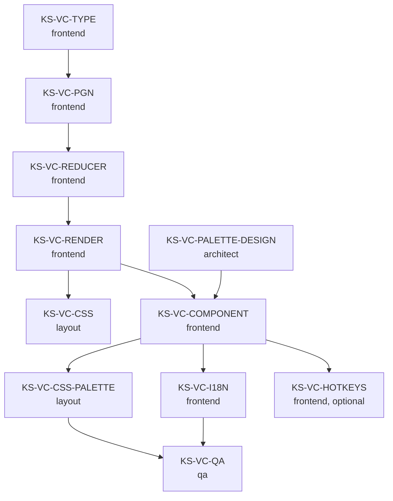

# ADR-038: Пользовательские цвета вариантов в нотации

**Дата:** 2026-05-03
**Статус:** Предложено
**Задача:** KS-2284
**Связанные:**
- [ADR-037](./037-move-annotations-and-variant-styling.md) §4 — реализованная *автоматическая* раскраска по уровню вложенности (KS-2273/74/75)
- KS-2152 — `[%csl]` / `[%cal]` PGN-макросы для CSL/CAL аннотаций (стрелки и подсветка клеток) — модель, которую расширяем
- KS-2269 — компонент `<NagPalette>` (E2 NAG-палитры), куда встраивается новая секция

---

## 1. Контекст и переинтерпретация требования

### 1.1 Что было реализовано (KS-2273/74/75 / ADR-037 §4)

Текущая раскраска вариантов — **автоматическая по уровню вложенности**:
- variation depth 1 → `--c-subline-1`
- depth 2 → `--c-subline-2`
- depth 3 → `--c-subline-3`
- depth 4 → `--c-subline-4`

Реализация: `ChessMoveProcessing.ts:179-196` (`getMoveClasses` добавляет `.variation-level-N`), `ReviewMoveList.css:225+` (CSS-токены), скобки тоже окрашены по уровню (KS-2275). Inline-цвет, не block (см. KS-2274 комментарий в CSS — block-style ломает inline-flow).

### 1.2 Что хотел пользователь

Цитата из KS-2284:
> «нужно чтобы пользователь сам мог выделять цвет варианта»

То есть **ручная** маркировка, как в ChessBase: правый клик на ход варианта → меню «цвет варианта» → выбор из палитры. Цвет применяется ко всему варианту от `(` до `)`.

Авторазметка по уровню — **не то**. Это визуальная подсказка «это вариант, а не main», но **не управляемая пользователем семантическая метка**.

### 1.3 Решение по совместимости

**Оставить автоматику как fallback, добавить override.**

Рассматривал две альтернативы:
1. **Удалить автоматику, оставить только user-colors.** Минус: неотмеченные варианты сольются с main-line, теряется визуальное различие. Регресс для пользователей, которые не хотят вручную помечать.
2. **Layered: user-color overrides level-color.** Если у варианта явно задан `variationColor` — используется он, иначе — автоматика. Минус: нет, никаких. Плюс: текущая работа KS-2273/74/75 не выбрасывается, UX-регресса нет.

**Принято: вариант 2.** Автоматику не удаляем (она остаётся как «дефолт по уровню»), сверху добавляем явный user-override.

В v2 рассмотрим toggle-настройку `BoardSettingsContext.useOnlyExplicitVariationColors` («показывать только мои цвета»). В v1 — fallback always-on.

---

## 2. UX

### 2.1 Где открывается выбор цвета

**Расширение существующего context-menu / palette** (созданного в KS-2269 для NAG'ов). Никакого отдельного popup'а.

В палитре после секций «Quality» и «Position» — новая секция **«Variation color»**, которая видна **только если ход является вариантом** (`processedMove.isVariation === true`):

```
┌─ Annotate ─────────────────────────────────┐
│ Quality                                    │
│ [!] [!!] [!?] [?!] [?] [??]                │
│ Position                                   │
│ [+−] [±] [⩲] [=] [∞] [⩱] [∓] [−+]         │
│ ── только если ход внутри варианта ──      │
│ Variation color                            │
│ [●G] [●B] [●Y] [●R]   [⟲ Clear]            │
│ ────────────────────────────────────────   │
│ + Add comment   ↑ Promote   ] Truncate     │
│ ✕ Delete                                   │
└────────────────────────────────────────────┘
```

Кнопка — круглый swatch 28×28 (color-fill) с тонким border `var(--c-444)`. Active-state — border 2px того же цвета. Mobile — 48×48.

**Hotkey** (опционально для KS-VC-HOTKEYS / E4): `V` открывает палитру + фокус на секции Variation color (если ход — variant). Внутри — `1..4` маппится на G/B/Y/R, `0` — clear.

### 2.2 К чему применяется цвет

**Ко всему варианту**, не к одному ходу.

«Вариант» = непрерывный отрезок ходов между открывающим `(` и закрывающим `)` на текущем уровне вложенности. Подварианты внутри — **не** наследуют цвет родителя; они либо имеют свой явный цвет, либо рендерятся по automatic-fallback.

Технически в state цвет хранится **на первом ходе варианта** (тот, что идёт сразу после `(`). Ровно как chess.com / lichess хранят `[%cal]` на узле дерева — атрибут «отрезка» представляется атрибутом первого узла отрезка.

Right-click на **любой** ход внутри варианта открывает палитру с правильно подсвеченным текущим цветом этого варианта. Изменение цвета через эту палитру переписывает атрибут на корневом ходе варианта.

### 2.3 Удаление цвета

- Кнопка **«⟲ Clear»** в секции Variation color — снимает цвет с текущего варианта, возвращает к automatic fallback (по уровню).
- Повторный клик на активный swatch — toggle off (то же самое, что Clear).

### 2.4 Mobile UX

Тот же bottom-sheet, что для NAG (KS-2278), с дополнительной секцией «Variation color». Появляется по long-press 500мс на ход варианта.

Если ход — main-line (не variant), секция Variation color **не отображается** (как и в desktop popup). Это даёт чистый UI: пользователь видит секцию только в релевантном контексте.

### 2.5 Скобки `(` и `)`

Скобки варианта окрашиваются в **тот же цвет**, что и тело варианта:
- если есть user-color — в user-color;
- иначе — в `--c-subline-N` по уровню (как сейчас, KS-2275).

Это требует расширения `getBracketClasses` в `ChessMoveProcessing.ts` — детали в §6.4.

---

## 3. Палитра

### 3.1 Четыре цвета + clear

Не пять-шесть, как изначально предлагалось в задаче. Обоснование:

- Существующая модель `AnnotationColor = 'red' | 'green' | 'blue' | 'yellow'` (из KS-2152) уже устоялась для CSL/CAL стрелок и подсветок. Однобуквенные коды R/G/B/Y, парсер, токены — всё готово.
- 5+ цветов размывают семантику и усложняют выбор. Пользователю не очевидно «синий или серый».
- Если пользователь хочет «нейтральный» вариант — он просто не ставит цвет (automatic fallback по уровню).

| Letter | Color | Suggested meaning | Tooltip RU | Tooltip EN |
|---|---|---|---|---|
| G | green | хорошая / перспективная | Хороший вариант | Good line |
| B | blue | главная альтернатива | Главная альтернатива | Main alternative |
| Y | yellow | критический / интересный | Критический вариант | Critical line |
| R | red | плохой / опровергнутый | Плохой вариант | Bad line |
| — | (none) | clear (вернуть к автоматике) | Сбросить цвет | Clear color |

Семантика — **suggested**, не enforced. Пользователь свободен использовать как удобно. tooltip даёт guidance, не constraint.

### 3.2 CSS-токены

В `apps/web/src/index.css` — добавить:

```css
:root {
  --c-vc-green:  #16a34a;   /* совпадает с annotation green */
  --c-vc-blue:   #2563eb;
  --c-vc-yellow: #eab308;
  --c-vc-red:    #dc2626;
}

html[data-theme="light"] {
  --c-vc-green:  #15803d;
  --c-vc-blue:   #1d4ed8;
  --c-vc-yellow: #ca8a04;
  --c-vc-red:    #b91c1c;
}
```

Используем те же hex'ы, что для CSL/CAL (см. KS-2152), для визуальной консистентности «вариант помечен синим — стрелка синяя — клетка синяя — все три значат одно».

### 3.3 Light/dark theme

Полная поддержка через `html[data-theme="light"]` override. Контрастность:
- dark theme: насыщенные цвета (Tailwind 600),
- light theme: чуть тёмнее (Tailwind 700) для контраста на светлом фоне.

Те же отношения, что в существующих токенах CSL/CAL — frontend знает паттерн.

### 3.4 Доступность

Контрастность text-on-bg для каждого цвета должна проходить WCAG AA (4.5:1) на стандартном фоне notation-panel:
- `--c-vc-green` `#16a34a` на `var(--c-1a1a2e)` (тёмный фон): contrast ≈ 4.6:1 ✓
- `--c-vc-yellow` `#eab308` на `var(--c-1a1a2e)`: ≈ 7.5:1 ✓
- `--c-vc-blue` `#2563eb` на `var(--c-1a1a2e)`: ≈ 4.7:1 ✓
- `--c-vc-red` `#dc2626` на `var(--c-1a1a2e)`: ≈ 4.5:1 ✓ (на грани — layout проверить)

Для пользователей с дальтонизмом — цвета различаются по hue (G/B/Y/R), но всё равно стоит протестировать. В v2 — symbol prefix перед первым ходом варианта (например `▲` для green), но это уже не цвет.

---

## 4. Хранение

### 4.1 Решение: PGN-расширение `[%cvc <letter>]`

По аналогии с `[%csl]` / `[%cal]` (см. KS-2152, `commentMacros.ts`).

- `cvc` = **c**olor of **v**ariation **c**hain
- Хранится в comment **первого хода варианта**.
- Однобуквенный код того же словаря, что CSL/CAL: `G`/`B`/`Y`/`R`.
- Пример PGN:
  ```
  1. e4 e5 (1... c5 {[%cvc B] Sicilian — main alternative} 2. Nf3) 2. Nf3
  ```
  Здесь вариант `1... c5 ... 2. Nf3` помечен синим, на ходе `c5` стоит макрос `[%cvc B]`.

### 4.2 Почему именно так

Альтернативы:

| Подход | Плюсы | Минусы | Решение |
|---|---|---|---|
| **PGN-comment macro `[%cvc X]`** | симметрично с CSL/CAL; парсер существует; не ломает совместимость со сторонними viewer'ами; миграции БД не нужны | мне нужно расширить commentMacros.ts | **Принято** |
| Отдельная NAG-маркировка (NAG `$240+colorIdx` или подобное) | стандартный механизм PGN; парсится автоматически | NAG'и за пределами стандартного диапазона часто игнорируются viewer'ами; конфликт с диапазонами других расширений; семантика NAG ≠ цвет | Отвергнуто |
| Custom JSON-поле в Game.notation / game_analysis.metadata | свобода формата | требуются миграции БД; не работает в lessons / archive PGN; теряется при экспорте | Отвергнуто |
| Атрибут на ChessMove только в state, без сериализации | minimum changes | теряется при reload, в БД не попадает — фактически бесполезно для persistence | Отвергнуто |

ChessBase в собственном бинарном формате хранит цвет в structure-flags варианта. При экспорте в PGN — теряется (это известная проблема ChessBase ↔ third-party). Мы не пытаемся поддерживать ChessBase native — мы делаем **свой собственный** macro, симметричный с lichess/chess.com макросами.

### 4.3 Совместимость с другими PGN-viewer'ами

`[%cvc R]` для нечитающего этот макрос viewer'а — просто часть текста комментария. Безопасно.

Для нашего парсера в `commentMacros.ts:parseCommentMacros()` — добавляем регулярку аналогично `cslMatch`/`calMatch`. См. §6.

### 4.4 Что хранить в state

Новое поле на `ChessMove`:

```ts
// apps/web/src/types.ts
export type VariationColor = AnnotationColor;  // переиспользуем 4 цвета

// apps/web/src/review/types.ts
export interface ChessMove {
  // ...existing fields...
  /** KS-2284: цвет варианта (только на первом ходе варианта). */
  variationColor?: VariationColor;
}
```

Поле **только** на первом ходе варианта (там, где после `(`). На других ходах варианта — undefined. Render использует look-up «найти первый ход своего варианта и взять у него variationColor» (§6.3).

### 4.5 Backend persistence

**Изменений в БД не требуется.**

Ввиду того, что variationColor сериализуется в PGN comment, persistence работает автоматически через существующие пути:
- `/analysis?fen=...` → localStorage,
- game-review save → `game_analysis.pgn` (KS-402),
- lessons step save → `lesson_steps.payload.pgn`,
- archive — read-only, чужие PGN не нужно дополнять.

Никаких миграций. Никаких новых таблиц. Никакой `variation_colors` separate table — это перебор для атрибута, который PGN сам несёт.

### 4.6 Migration существующих партий

**Ничего не делаем.** Существующие PGN не имеют `[%cvc]` — после загрузки в state получают `variationColor === undefined`, рендерятся через automatic-fallback по уровню. Полная backwards-compatibility.

---

## 5. ChessBase / community сравнение

| Аспект | ChessBase 17 | chess.com | lichess | Решение |
|---|---|---|---|---|
| **Где меню** | Правый клик на вариант → «Variation» → «Color» (подменю) | Не реализовано (только NAG/eval) | Не реализовано (только NAG, study annotations) | Right-click + расширение нашей NagPalette |
| **Палитра** | 4-6 цветов (зависит от версии) | — | — | 4 цвета (G/B/Y/R), переиспользуем CSL/CAL |
| **Применение** | Ко всему варианту (от `(` до `)`) | — | — | Так же — ко всему варианту |
| **Хранение** | Бинарный формат `.cbh`/`.cbv`; в PGN export — теряется | — | — | PGN comment macro `[%cvc X]`, не пропадает на reload |
| **Mobile UX** | ChessBase desktop-only | — | — | Bottom-sheet, расширение KS-2278 |
| **Семантика** | Нет hard meaning, цвет = visual marker | — | — | Suggested meaning в tooltip, без enforcement |

Что копируем 1-в-1: **applies to whole variation**, **right-click triggers menu**.
Где отступаем: **mobile bottom-sheet** (ChessBase нет mobile), **PGN-persistent storage** (ChessBase теряет при export), **только 4 цвета** (вместо ChessBase 6 — упрощаем чтобы не размывать семантику).

---

## 6. Архитектура

### 6.1 State-модель

**Новое поле:**
```ts
ChessMove.variationColor?: VariationColor;  // на первом ходе варианта
```

**Новый action в reducer (`useReviewState.ts`):**
```ts
type Action =
  | ...existing...
  | { type: 'SET_VARIATION_COLOR'; payload: { globalIndex: number; color: VariationColor | null } }
```

`globalIndex` — индекс **корня варианта** (первого хода после `(`). Frontend, перед dispatch'ем, должен find this — см. §6.5.

`color: null` — clear (toggle off).

**Reducer-логика:**
```ts
case 'SET_VARIATION_COLOR': {
  const move = searchInHistory(state.history, action.payload.globalIndex);
  if (!move) return state;
  move.variationColor = action.payload.color ?? undefined;
  return { ...state, history: [...state.history] };
}
```

Сериализация PGN — без изменений в reducer; всё через `serializeCommentWithMacros` (§6.2).

### 6.2 PGN serialize/deserialize

`commentMacros.ts` — добавить:

**Парсинг (`parseCommentMacros`):**
```ts
// Match [%cvc R] — variation color. Letter R/G/B/Y, same dictionary as CSL/CAL.
let variationColor: VariationColor | undefined;
const cvcMatch = text.match(/\[%cvc\s+([RGBY])\s*\]/);
if (cvcMatch) {
  variationColor = COLOR_LETTER_TO_NAME[cvcMatch[1].toUpperCase()];
  text = text.replace(/\[%cvc\s+[^\]]+\]/g, '');
}
return { eval, clock, comment, annotations, variationColor };
```

**Сериализация (`serializeCommentWithMacros`):**
- Принимает дополнительный параметр `variationColor?: VariationColor`.
- Если задан — добавляет `[%cvc ${letter}]` в comment **перед** [%csl]/[%cal] (порядок: eval → text → clk → cvc → csl → cal).
- Порядок зафиксирован тестами — не менять без обновления.

**`PgnSerializer.ts`** — `serializeMoves` передаёт `move.variationColor` в `serializeCommentWithMacros` ровно для первого хода варианта (он рендерится сразу после `(`). На остальных ходах — undefined. Это **единственное место**, которое отличает «первый ход варианта» от «обычный ход в варианте» — определяется по `i === 0` в рекурсивном вызове `serializeMoves(variation, ...)`.

**`PgnDeserializer.ts`** — после `parseCommentMacros` получает `variationColor` и кладёт его в `move.variationColor`. Без проверки «первый ли ход в варианте» — если PGN корректен, макрос стоит только на первом, и наш сериализатор его так и кладёт. Чужой PGN (например с `[%cvc]` посреди варианта) — спокойно принимаем (положим колоранс на тот ход, где он стоит). Семантически это бессмысленно, но форматно валидно.

### 6.3 Render (lookup color)

В `ChessMoveProcessing.processMoveHierarchy` (или в `getMoveClasses`) — для каждого `processedMove.isVariation === true`:

```ts
function findVariationRootColor(move: ChessMove, history: ChessMove[]):
  VariationColor | undefined {
  // Найти первый ход варианта, к которому принадлежит этот ход.
  // В существующей модели variations — массив variations: ChessMove[][] на родителе.
  // Логика существующего processMoveHierarchy уже знает level и parent, переиспользуем.
  // Возвращаем variationColor первого хода в той variation-цепочке.
}
```

Это требует доработки `ChessMoveProcessing.ts`: при обходе history, когда мы входим в variation array — запомнить `variationColor` первого хода и проставить его всем последующим (включая bracket'ы).

`getMoveClasses` дополняется:
```ts
if (processedMove.variationColor) {
  classes.push(`variation-color-${processedMove.variationColor}`);
} else if (processedMove.level > 0) {
  classes.push(`variation-level-${Math.min(processedMove.level, 4)}`);
}
```

То есть **explicit color overrides level-fallback**. CSS:
```css
.variation-color-green  { color: var(--c-vc-green); }
.variation-color-blue   { color: var(--c-vc-blue); }
.variation-color-yellow { color: var(--c-vc-yellow); }
.variation-color-red    { color: var(--c-vc-red); }
```

### 6.4 Скобки

`getBracketClasses` (`ChessMoveProcessing.ts:201-208`) — расширяется аналогично:
- если у первого хода варианта есть `variationColor` — добавляем класс `variation-color-{color}` к `.variation-bracket`,
- иначе — текущий `variation-level-N` (KS-2275).

Логика lookup та же — `processMoveHierarchy` уже знает variation для каждого bracket-item.

### 6.5 Frontend компонент

**Расширение `<NagPalette>` (KS-2269)**, не отдельный компонент.

Добавляется:
- условный рендер секции «Variation color» (показывается только если `move.isVariation`),
- 4 swatch-кнопки + Clear,
- callback `onSetVariationColor(rootGlobalIndex: number, color: VariationColor | null)`.

`rootGlobalIndex` находится так: подняться от `move` к first-move-of-variation. В существующем коде у `ChessMove` есть `previous?: ChessMove` и `variation?: any[]` (как у chess.js Verbose Move); комбинация даёт способ найти variation-root. Frontend в KS-VC-COMPONENT (§7) определит точный helper.

### 6.6 Backend

**Без изменений.**

NestJS-эндпоинты, через которые проходит PGN (`game-analysis.controller`, `lessons.controller` save), уже принимают/отдают строку `pgn`. Поскольку `[%cvc]` — часть comment текста, никакой специальной валидации не нужно. Сторонние парсеры (`chess.js` для валидации legality) комменты игнорируют.

### 6.7 Совместимость с автоматикой по уровню

Уже описано в §1.3 — fallback остаётся, override заменяет. Никаких изменений в `--c-subline-{1..4}` токенах из KS-2273.

---

## 7. План внедрения

### E1. Тип данных и PGN-расширение
- **KS-VC-TYPE** *(frontend)* — `VariationColor` тип, поле `ChessMove.variationColor`, документация в `types.ts`.
- **KS-VC-PGN** *(frontend)* — расширить `commentMacros.ts` парсингом и сериализацией `[%cvc X]`. Тесты в `PgnNagComments.spec.ts` или новом `PgnVariationColor.spec.ts` — round-trip parse → serialize.
- **KS-VC-REDUCER** *(frontend)* — action `SET_VARIATION_COLOR` в `useReviewState.ts`. Юнит-тест.

### E2. Render
- **KS-VC-RENDER** *(frontend)* — `processMoveHierarchy` пробрасывает `variationColor` каждому ProcessedMove; `getMoveClasses` / `getBracketClasses` накладывают override-класс `.variation-color-{color}`.
- **KS-VC-CSS** *(layout)* — токены `--c-vc-{green,blue,yellow,red}` в `index.css` (dark + light); классы `.variation-color-N` в `ReviewMoveList.css`.

### E3. Palette UI
- **KS-VC-PALETTE-DESIGN** *(architect)* — design-doc «секция Variation color в NagPalette»: финальные swatch-размеры, layout, hotkey-spec. По образцу `nag-palette-design.md`. Доставка: дополнение в `docs/architecture/nag-palette-design.md` или новый файл.
- **KS-VC-COMPONENT** *(frontend)* — расширение `<NagPalette>`/`<NagPaletteSheet>` секцией «Variation color». Helper для поиска variation-root. Условный рендер по `isVariation`.
- **KS-VC-CSS-PALETTE** *(layout)* — стили swatch-кнопок (28×28 desktop, 48×48 mobile), active-state, hover.
- **KS-VC-I18N** *(frontend)* — i18n-ключи `review.palette.variationColor.*` (4 цвета + clear + section title).
- **KS-VC-QA** *(qa)* — e2e: open palette на main move → секция не видна; на variant move → видна; пометка → reload page → цвет сохранён в PGN.

### E4. Hotkeys (опционально)
- **KS-VC-HOTKEYS** *(frontend)* — `V` + `1..4` маппинг. Только если KS-NAG-HOTKEYS уже в работе/готов.

### Зависимости



### Никаких backend-тикетов

Сознательно. PGN — единственный source of truth, persistence работает «бесплатно» через существующие save-paths.

---

## 8. Риски и открытые вопросы

| # | Риск / вопрос | Кто | Митигация |
|---|---|---|---|
| R1 | Помеченные пользователем варианты теряются если PGN-viewer / экспорт игнорирует `[%cvc]` | frontend (E1) | Документировать в commentMacros.ts; в UI добавить тонкое сообщение «Цвета сохраняются только в наших PGN» (опционально, v2) |
| R2 | Конфликт «explicit color overrides level» — пользователь не понимает почему его red-вариант стал зелёным после reset | UX (E3) | Tooltip на Clear: «Сбросить цвет — вернуть автоматическую раскраску по уровню» |
| R3 | Поиск variation-root от любого хода в варианте — нетривиальная задача навигации по дереву | frontend (E3 / KS-VC-COMPONENT) | Helper `findVariationRoot(move): ChessMove`; покрыть юнит-тестами на 3 уровнях вложенности |
| R4 | Скобки `(` и `)` — где их `getBracketClasses` берёт `variationColor`? | frontend (E2 / KS-VC-RENDER) | `processMoveHierarchy` уже строит BracketItem с привязкой к variation; пробросить туда же variationColor — единый source |
| R5 | Палитра 4 цвета может оказаться мало для опытных тренеров (хотят 6-8) | chess-expert (после v1 feedback) | Расширение в v2 — добавить gray, orange. Пока зафиксировано на 4 (см. §3.1) |
| R6 | Light theme контраст red `#dc2626` на светлом фоне — на грани WCAG | layout (E2 / KS-VC-CSS) | В light theme использовать `#b91c1c` (Tailwind 700); проверить тестом контраста |
| R7 | Nested variations: подвариант наследует цвет родителя или нет? | frontend (E2) | **Не наследует.** Каждый variation-уровень имеет свой `variationColor` или fallback. Документировано в §2.2 |
| R8 | Dialog «delete variation» не очищает variationColor → orphan entry в PGN | frontend (E1 / KS-VC-REDUCER) | Reducer `DELETE_VARIATION` уже удаляет variation целиком — ходы исчезают, поле удаляется вместе с ними. Проверить тестом |
| R9 | Mobile bottom-sheet становится переполнен (Quality + Position + Variation color + Comment + Promote/Truncate/Delete) | layout (E3 / KS-VC-CSS-PALETTE) | Sheet max-height 60vh, scroll внутри. Альтернатива — хранить sections в expandable accordion, но это перебор для v1 |
| R10 | Variation colors в lessons-step PGN читаются ReviewMoveList в read-only режиме — не должны быть редактируемы | frontend / qa (E3) | `<NagPalette>` уже принимает `readOnly` prop, секция Variation color не рендерится. Тест на lessons step |

---

## 9. Сводная таблица тикетов (Приложение A)

| Этап | Ticket | Исполнитель | Зависит от |
|---|---|---|---|
| E1 | KS-VC-TYPE | frontend | — |
| E1 | KS-VC-PGN | frontend | KS-VC-TYPE |
| E1 | KS-VC-REDUCER | frontend | KS-VC-TYPE |
| E2 | KS-VC-RENDER | frontend | KS-VC-REDUCER |
| E2 | KS-VC-CSS | layout | KS-VC-RENDER |
| E3 | KS-VC-PALETTE-DESIGN | architect | — |
| E3 | KS-VC-COMPONENT | frontend | KS-VC-PALETTE-DESIGN, KS-VC-RENDER |
| E3 | KS-VC-CSS-PALETTE | layout | KS-VC-COMPONENT |
| E3 | KS-VC-I18N | frontend | KS-VC-COMPONENT |
| E3 | KS-VC-QA | qa | KS-VC-CSS-PALETTE, KS-VC-I18N |
| E4 | KS-VC-HOTKEYS | frontend | KS-VC-COMPONENT (отложено) |

Итого: **11 тикетов** — 3 в E1 (тип + PGN + reducer), 2 в E2 (render + CSS), 5 в E3 (design + component + CSS + i18n + QA), 1 в E4 (hotkeys, опционально).

Минимум для исходного требования пользователя: **E1 + E2 + E3** = 10 тикетов.

---

## 10. Что **не** входит в этот ADR

- Цветовые presets / themes (например «дальтоник-режим») — отдельная фича в `BoardSettingsContext`, v3.
- Toggle «использовать только мои цвета» (отключить fallback по уровню) — отложено в v2 (см. §1.3).
- Сложные паттерны: «main → green = выигрывает; red = проигрывает» — это уже LessonStep-логика, не drill-режим notation.
- Совместная разметка вариантов несколькими пользователями (collab editing) — out of scope.
- Импорт цветов из ChessBase `.cbv` — невозможно технически (бинарный формат теряется при PGN-export).
- Group-marking «отметить три варианта одним цветом за раз» — overkill для v1.
