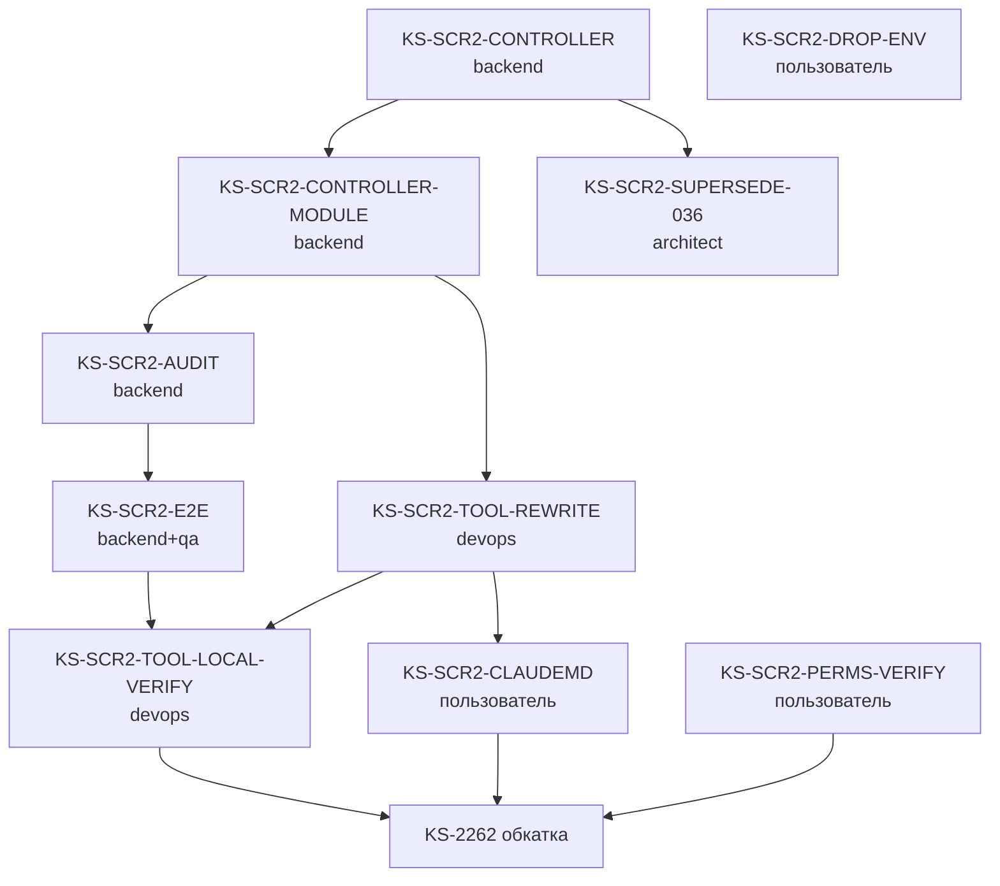

# ADR-039: Screenshot tooling — ревизия (zero-touch для пользователя)

**Дата:** 2026-05-03
**Статус:** Предложено (ревизия [ADR-036](./036-agent-screenshot-tooling.md))
**Задача:** KS-2299
**Заменяет (частично):** ADR-036 §3.2 (env-credentials), §3.3 (доступ к credentials), §10 R4 (ротация). Остальное из ADR-036 — в силе.
**Связанные:**
- KS-2253 (исходный ADR-036), KS-2255 (User.isTestAccount/isHidden), KS-2256 (фильтрация в публичных endpoints), KS-2257 (seed-аккаунт), KS-2258 (создание test-аккаунта на проде), KS-2259 (`scripts/screenshot.mjs` в env-варианте — будет переделан)
- ADR-034-v2 §2.2 — уже работающий паттерн **internal token-issuance endpoint** для synthetic-ботов (`InternalAuthController`)
- `apps/api/src/common/redis-rate-limit.guard.ts` — готовый `@RateLimit(N, sec)` декоратор + Redis-backed rate-limit

---

## 1. Зачем ревизия

ADR-036 предложил pipeline:

```
agent container ENV(SCRN_AGENT_PASSWORD)
  → scripts/screenshot.mjs читает env
  → POST /api/auth/login {username, password}
  → JWT → addInitScript(localStorage)
  → playwright.screenshot()
```

Пользователь поставил жёсткий констрейнт (KS-2299 description):

> Агенты должны иметь возможность делать скриншоты прода под авторизованным пользователем БЕЗ:
> - env-переменных в агентском контейнере,
> - AWS-credentials в агентском контейнере,
> - файлов с секретами в /tmp или где-либо у агента,
> - правок `webhook-server.py` / `Dockerfile.agent` / `.claude/settings.json` / `CLAUDE.md`,
> - ввода пароля от пользователя в чат.

ADR-036 нарушает первый и пятый пункт (нужны env + правка settings.json). Ревизия требует переноса ответственности за authentication с **агента** на **backend**.

Ключевое наблюдение, делающее ревизию реалистичной:

- `__screenshot_agent` уже **safe-by-design** (KS-2255/2256/2257): `isTestAccount=true`, `isHidden=true`, blacklisted в leaderboard / tournaments / matchmaking / public profile / friends / archive-search.
- У JWT под этим юзером **нет ценного содержания**: профиль публично пустой, никаких privileged endpoints, никакой эскалации.
- Значит open-endpoint, выдающий JWT именно этому юзеру (и только ему), не создаёт security-риска сверх того, который уже принят в KS-2255/2256.

---

## 2. Анализ вариантов

Каждый вариант рассматривается по 4 критериям: zero-touch для пользователя, security risk, реализационная сложность, эксплуатация.

### 2.1 Вариант A — Open endpoint `/api/internal/screenshot-token` + rate-limit

**Поток:**
```
agent (любой) → POST /api/internal/screenshot-token (без auth)
backend → @RateLimit(10, 60) → выдать JWT(__screenshot_agent, 15min TTL)
agent → addInitScript(localStorage) → playwright.screenshot()
```

| Критерий | Оценка |
|---|---|
| Zero-touch | ✅ Полный. Никаких env, secrets, settings.json |
| Security risk | Низкий — см. §3 threat-model. JWT даёт доступ только к hidden test-аккаунту, у которого нет ничего ценного |
| Сложность | Низкая. Паттерн уже есть в `InternalAuthController` (synthetic-token), переиспользуем `RedisRateLimitGuard` |
| Эксплуатация | Audit-log на каждый вызов, ротация ключа JWT_SECRET — стандартная (общий с обычным auth). Test-аккаунт остаётся в SSM (KS-2258) для admin-операций |

**Решение: ✅ Принят.**

### 2.2 Вариант B — Shared-secret в `scripts/screenshot.mjs`

**Поток:**
```
agent → POST /api/internal/screenshot-token + header X-Screenshot-Secret: <hardcoded in scripts/screenshot.mjs>
backend проверяет header → выдать JWT
```

| Критерий | Оценка |
|---|---|
| Zero-touch | ✅ Secret в репо — агент имеет доступ к репо «бесплатно» |
| Security risk | **Зависит от приватности репо.** Если репо публичное → secret немедленно доступен любому → бесполезен (эквивалент Варианта A, но с иллюзией защиты, что хуже). Если репо приватное → secret защищён через access-control репо → но тогда полностью эквивалентно Варианту A с дополнительным шагом ротации |
| Сложность | Средняя. Добавляется маршрут ротации secret через PR в репо |
| Эксплуатация | Каждая ротация — PR в репо с обновлением кода и одновременным деплоем backend. Plus complexity без gain |

**Отвергнуто:** не даёт security gain поверх Варианта A, увеличивает сложность ротации, создаёт false sense of security.

### 2.3 Вариант C — IP whitelist (AWS WAF / nginx / ingress-level)

**Поток:**
```
agent → POST /api/internal/screenshot-token (без auth, без header)
edge proxy (CloudFront/nginx) проверяет client IP против whitelist
проходит → backend → JWT
не проходит → 403
```

| Критерий | Оценка |
|---|---|
| Zero-touch | ✅ Если whitelist настраивается DevOps один раз при деплое (не пользователь). ⚠️ Но если агенты могут запускаться на машинах пользователя/разработчиков — IP плавающие → периодические правки whitelist → нарушение констрейнта |
| Security risk | Низкий, если whitelist стабилен. Высокий, если NAT shared (например, корпоративный gateway) — кто-то с того же IP получает доступ |
| Сложность | Высокая для текущей инфры — нужен AWS WAF или CloudFront rule, отдельный конфиг ingress. Backend остаётся простым |
| Эксплуатация | Whitelist — отдельный point of maintenance. Уход агентов из inventory → mass update WAF |

**Отвергнуто как primary, рассмотрено как **дополнительный layer** в §4.4.** Усиление, не замена. Если в будущем агенты осядут на стабильной инфре (один cluster, один NAT-gateway) — добавить ingress-фильтр поверх Варианта A. Но это не блокирует и не предусматривает *постоянных* правок от пользователя.

### 2.4 Вариант D — Cookie на основе internal-only network

**Поток:**
```
agent (внутри VPC) → GET /api/internal/screenshot-cookie
backend проверяет request.ip ∈ private CIDR
backend → Set-Cookie с server-side session
agent → playwright использует cookie
```

| Критерий | Оценка |
|---|---|
| Zero-touch | Условный. Работает, если агенты гарантированно в одной сети с backend |
| Security risk | Эквивалент C, плюс cookie-based session требует server-side store (Redis) — переусложнение |
| Сложность | Высокая. У нас сейчас JWT-only, переход на cookie для одного flow — лишняя сущность |
| Эксплуатация | Так же зависит от network topology |

**Отвергнуто.** Не выгодно по сравнению с C, и так же зависимо от network topology.

### 2.5 Вариант E — статус-кво (env)

ADR-036 §3.2. Уже отвергнут пользователем.

### 2.6 Сводка

| Вариант | Zero-touch | Security | Сложность | Решение |
|---|---|---|---|---|
| A. Open endpoint + rate-limit + safe-by-design account | ✅ | Низкий риск | Низкая | **Принято** |
| B. Shared secret в репо | ✅ (но fake security) | Зависит от приватности репо | Средняя | Отвергнуто |
| C. IP whitelist на edge | ⚠️ если стабильная сеть | Низкий риск | Высокая (новая инфра) | Опциональный layer (§4.4) |
| D. Cookie + internal-only network | Условно | Эквивалент C | Высокая | Отвергнуто |
| E. Env (ADR-036) | ❌ | Низкий | — | Отвергнуто |

---

## 3. Threat-model для Варианта A

Атакующий узнал URL `/api/internal/screenshot-token`. Что он может сделать?

### 3.1 Что атакующий получает

JWT с `sub = __screenshot_agent.id`, TTL 15 мин, payload идентичен обычным юзерским токенам. Это эквивалентно «лог-ин под тестовым аккаунтом, который виден на сайте только этому самому аккаунту».

### 3.2 Что атакующий может сделать

| Действие | Эффект | Допустимость |
|---|---|---|
| Открыть `/profile/__screenshot_agent` | Видит пустой профиль (KS-2257 setup: 2 партии, 5 пазлов) | OK — это «лог-ин на свой собственный аккаунт» |
| Решить пазл, увеличить rating | Меняет статистику test-аккаунта | OK — изолировано |
| Сыграть в matchmaking | Не попадает в pool (`isHidden=true`, KS-2256) | Заблокировано |
| Зарегистрироваться в турнире | Не попадает в публичный список турниров | Заблокировано |
| Получить друзей | Никто не видит этого юзера в FoF / search | Заблокировано |
| Получить чужие данные через `/api/users/:id` | Стандартный auth — у `__screenshot_agent` нет admin-прав, доступ к чужим данным = тот же, что у обычного юзера | OK — нет эскалации |
| Перевыпустить JWT для другого юзера | Endpoint не принимает userId, только выдаёт фиксированный | Невозможно |
| Поднять rate-limit и спамить | 10 req/min/IP блокирует | Митигировано |

### 3.3 Ключевые свойства, делающие endpoint безопасным

1. **Endpoint не принимает userId** — всегда выдаёт JWT для одного и того же hidden-аккаунта.
2. **Test-аккаунт изолирован** в backend (KS-2256): фильтры в leaderboard, tournament, matchmaking, public profile, friends, archive-search.
3. **Нет admin-прав** у test-аккаунта — JWT не открывает privileged endpoints.
4. **TTL 15 мин** — украденный токен живёт мало.
5. **Rate-limit 10/мин/IP** через `RedisRateLimitGuard` — DDoS / token-farming не работает.
6. **Audit-log** на каждый вызов с `ip`, `userAgent`, `tokenHash`.

### 3.4 Что **не** митигируется и принимается осознанно

- Атакующий может использовать endpoint для проверки «жив ли prod-API» — это не баг, prod-API и так публичный.
- Атакующий может через много IP накопить пул JWT для test-аккаунта — но даже 1000 одновременных JWT не дают эскалации, только парциальное забивание `Notification`/`PuzzleAttempt`-таблиц записями от test-юзера. Митигация: алерт на «> N attempts/час под `__screenshot_agent`» (отдельный мониторинг тикет, не блокирующий).
- Атакующий может получить публичный профиль `__screenshot_agent` — но он publicly hidden, profile-страница даёт 404 для всех, кроме самого юзера. Митигация уже в KS-2256.

### 3.5 Сравнение с baseline до KS-2253

До screenshot-tooling: `/api/auth/login` — открытый, принимает любого юзера, выдаёт JWT по паролю. Brute-force защищён только через ограничение неудачных попыток (если оно есть, надо проверить).

ADR-039 endpoint **строго ýже**: одного юзера, без password, с rate-limit. Это меньший surface area, чем существующий `/api/auth/login`. Принципиально новой угрозы не вводится.

---

## 4. Архитектура

### 4.1 Новый endpoint

```
POST /api/internal/screenshot-token
Content-Type: application/json
Body: пустой (или {} для совместимости)

Response 200:
{
  "accessToken": "<JWT>",
  "refreshToken": "<JWT>",
  "expiresIn": 900
}

Response 503 (если test-аккаунт не существует):
{ "error": "screenshot agent not provisioned" }

Response 429 (rate-limit):
{ "error": "Too Many Requests" }
```

Расположение:
- В `apps/api/src/auth/` — новый файл `screenshot-token.controller.ts`,
- НЕ за `InternalKeyGuard` (этот guard для synthetic-bot endpoint),
- За `RedisRateLimitGuard` с `@RateLimit(10, 60)`,
- Никакого Body-параметра — endpoint всегда выдаёт JWT для `__screenshot_agent`.

Псевдокод:

```ts
@Controller('internal')
export class ScreenshotTokenController {
  constructor(
    private readonly prisma: PrismaService,
    private readonly jwt: JwtService,
    private readonly config: ConfigService,
  ) {}

  @Post('screenshot-token')
  @UseGuards(RedisRateLimitGuard)
  @RateLimit(10, 60)
  async issue(@Req() req: Request): Promise<ScreenshotTokenResponse> {
    const user = await this.prisma.user.findFirst({
      where: { username: '__screenshot_agent', isTestAccount: true, isHidden: true },
      select: { id: true, username: true },
    });
    if (!user) {
      this.logger.error('__screenshot_agent not provisioned');
      throw new ServiceUnavailableException('screenshot agent not provisioned');
    }

    const expiresIn = parseExpiresInSeconds(this.config.get('JWT_EXPIRES_IN', '15m'));
    const accessToken = this.jwt.sign(
      { sub: user.id, username: user.username },
      { expiresIn },
    );
    const refreshToken = this.jwt.sign(
      { sub: user.id, username: user.username },
      { expiresIn: expiresIn * 4 }, // refresh живёт x4 access
    );

    this.logger.log(
      `screenshot-token: issued userId=${user.id} ip=${readClientIp(req)} ` +
      `tokenHash=${sha256(accessToken)} ua=${req.headers['user-agent']}`
    );

    return { accessToken, refreshToken, expiresIn };
  }
}
```

`parseExpiresInSeconds` / `readClientIp` / `sha256` — переиспользуем из `internal-auth.controller.ts` (вынести в shared util в `apps/api/src/auth/utils.ts`).

### 4.2 Изменения в `scripts/screenshot.mjs`

Текущий flow (KS-2259, env-вариант):
```js
const password = process.env.SCRN_AGENT_PASSWORD;
const { accessToken, refreshToken } = await fetch('/api/auth/login', { body: { username: '__screenshot_agent', password } });
```

Новый flow:
```js
const { accessToken, refreshToken } = await fetch('https://api.kingside.site/api/internal/screenshot-token', { method: 'POST' });
```

Удаляются:
- чтение `process.env.SCRN_AGENT_PASSWORD`,
- exit code 3 («env vars не заданы»),
- любые упоминания env в README / inline-комментариях.

Все остальные опции (`--auth=test|none`, `--viewport=...`, etc.) — без изменений. Семантика `--auth=test` теперь = «получить JWT через internal-endpoint» вместо «логиниться username/password из env».

URL backend'а — хардкод в скрипте (`API_URL` константа, default `https://api.kingside.site`). Override через `--api-url=...` для dev/staging.

### 4.3 Что **не** меняется относительно ADR-036

- `User.isTestAccount` / `User.isHidden` поля — остаются (KS-2255).
- Фильтрация во всех публичных endpoints — остаётся (KS-2256).
- Test-аккаунт `__screenshot_agent` остаётся (KS-2257/2258), пароль в SSM сохраняется как admin-точка для ручных операций (например, ручной visual debug на проде), но **scripts/screenshot.mjs его не использует**.
- CLI-API скрипта — без изменений (см. ADR-036 §5).
- Список endpoints для фильтрации (ADR-036 §3.4) — без изменений.

### 4.4 Опциональный layer защиты (deferred)

Если в будущем агенты осядут в стабильной сети (Kubernetes cluster или единый NAT-gateway), можно добавить **ingress-level IP allow-list** на путь `/api/internal/screenshot-token`:

- AWS WAF rule: allow only from `<NAT-CIDR>`,
- или nginx `location /api/internal/screenshot-token { allow <CIDR>; deny all; }`,
- backend остаётся как есть (rate-limit + safe account).

Это **усиление**, а не замена. Defence in depth. Рассмотреть, когда:
- атаки на endpoint появятся в реальности (audit-log будет показывать abuse),
- инфраструктура агентов стабилизируется.

В текущей версии ADR — **не делаем**, чтобы не нарушить zero-touch (whitelist-правки требуют DevOps-внимания при добавлении агентов).

### 4.5 Логирование и мониторинг

Каждый вызов endpoint'а пишет в structured log:
- `userId` (всегда `__screenshot_agent.id`),
- `ip` (клиентский, через X-Forwarded-For),
- `userAgent`,
- `tokenHash` (sha256 первых 16 символов JWT — для корреляции, не plaintext),
- `timestamp`.

Алерт (в отдельном monitoring-тикете, не блокирующий ADR): «> 100 вызовов / час с одного IP» — потенциальный abuse, требует human review.

---

## 5. Diff с ADR-036

### 5.1 Что отменяется

| ADR-036 | Статус |
|---|---|
| §3.2 «env-credentials в контейнере агента» | **Отменено**. Никаких `SCREENSHOT_AGENT_USERNAME`, `SCREENSHOT_AGENT_PASSWORD` в env агента |
| §3.3 «Кто имеет доступ к credentials → агенты в контейнере читают через `process.env`» | **Отменено**. Агент не имеет credentials |
| §10 R4 «Пароль ротируется раз в 90 дней — кто это инициирует» | **Снято**. Ротация пароля больше не привязана к screenshot-flow. SSM-пароль остаётся для admin-debugging, ротация по обычному security-расписанию |
| §10 R5 «`dev-bypass` остаётся открытым» | **Сохраняется** — это отдельная security-задача (KS-SCRN-DEVBYPASS), не предмет этого ADR |

### 5.2 Что остаётся

Всё остальное в ADR-036 в силе. Особенно:
- §3.1 Test-аккаунт (имя, флаги),
- §3.4 Backend-флаги изоляции,
- §4 Расположение скрипта,
- §5 CLI-API,
- §7 Список ролей агентов.

### 5.3 Что отменяется в плане ADR-036 (тикеты)

| Тикет | Статус |
|---|---|
| **KS-2261** «KS-SCRN-AGENT-PERM» (`.claude/settings.json` правки) | **Отменён**. `scripts/*` уже разрешён в текущих правах агентов (или будет разрешён общим паттерном `node scripts/*` без указания конкретного скрипта). Требует подтверждения от пользователя — см. §6 KS-SCR2-PERMS-VERIFY |
| **KS-2260** «обновление CLAUDE.md» | **Уже передан пользователю напрямую** (см. сообщение от architect в KS-2260). Текст обновления не меняется |
| Часть KS-2259 (env-вариант скрипта) | **Будет переделан** — задача KS-SCR2-TOOL-REWRITE ниже |

---

## 6. План тикетов

### E1. Backend endpoint
- **KS-SCR2-CONTROLLER** *(backend)* — новый `apps/api/src/auth/screenshot-token.controller.ts`. Endpoint `POST /api/internal/screenshot-token` без auth, за `RedisRateLimitGuard` `@RateLimit(10, 60)`. Логирование. Юнит-тест на rate-limit, на отсутствующий test-аккаунт (503), на успешную выдачу JWT (200).
- **KS-SCR2-CONTROLLER-MODULE** *(backend)* — подключить controller к `AuthModule`. Помнить: `RedisRateLimitGuard` зависит от Redis (он уже в DI), `Reflector` — стандартный.
- **KS-SCR2-AUDIT** *(backend)* — расширить логирование: добавить `userAgent` в structured log, opt-in metric `screenshot_token_issued_total{ip}` для Prometheus (если он у нас есть).
- **KS-SCR2-E2E** *(backend / qa)* — e2e-тест против локального dev: `POST /api/internal/screenshot-token` → 200, JWT валиден, в нём `sub === __screenshot_agent.id`. После 11-го запроса → 429.

### E2. Скрипт
- **KS-SCR2-TOOL-REWRITE** *(devops)* — переделать `scripts/screenshot.mjs`:
  - убрать чтение `SCRN_AGENT_PASSWORD` env,
  - заменить `POST /api/auth/login` на `POST /api/internal/screenshot-token`,
  - убрать exit code 3 (env not set),
  - обновить inline-документацию и `scripts/README.md` (если есть).
- **KS-SCR2-TOOL-LOCAL-VERIFY** *(devops)* — ручная проверка против локального API: скрин anon + auth, mobile + desktop. Без env.

### E3. Документация и cleanup
- **KS-SCR2-CLAUDEMD** *(пользователь)* — заменить строку про playwright в `CLAUDE.md` на `node scripts/screenshot.mjs ...` (текст уже передан в KS-2260, актуализировать ссылку на ADR-039 вместо ADR-036). Architect не правит CLAUDE.md.
- **KS-SCR2-PERMS-VERIFY** *(пользователь)* — подтвердить, что `Bash(node scripts/screenshot.mjs *)` уже разрешён существующими паттернами в `.claude/settings.json` (либо аналог `Bash(node scripts/*)`). Если нет — пользователь добавит сам. Architect / agents не правят settings.
- **KS-SCR2-SUPERSEDE-036** *(architect)* — обновить статус ADR-036 на «Superseded by ADR-039 §1, §3.2, §3.3, §10 R4». Само содержимое ADR-036 не редактировать (только header).

### E4. Удаление env-варианта (cleanup инфры)
- **KS-SCR2-DROP-ENV** *(пользователь)* — если `SCRN_AGENT_PASSWORD` уже был помещён в env агентского контейнера (по ADR-036 KS-SCRN-PASSWORD), удалить его. Не критично с точки зрения security (пароль остаётся в SSM, env просто бесполезен), но следует вычистить для гигиены.

### Зависимости



KS-2262 (обкатка end-to-end на проде) — не открывается до завершения E1 + E2.

### Сводная таблица

| Этап | Ticket | Исполнитель | Зависит от |
|---|---|---|---|
| E1 | KS-SCR2-CONTROLLER | backend | — |
| E1 | KS-SCR2-CONTROLLER-MODULE | backend | KS-SCR2-CONTROLLER |
| E1 | KS-SCR2-AUDIT | backend | KS-SCR2-CONTROLLER-MODULE |
| E1 | KS-SCR2-E2E | backend + qa | KS-SCR2-CONTROLLER-MODULE |
| E2 | KS-SCR2-TOOL-REWRITE | devops | KS-SCR2-CONTROLLER-MODULE |
| E2 | KS-SCR2-TOOL-LOCAL-VERIFY | devops | KS-SCR2-TOOL-REWRITE, KS-SCR2-E2E |
| E3 | KS-SCR2-CLAUDEMD | пользователь | KS-SCR2-TOOL-REWRITE |
| E3 | KS-SCR2-PERMS-VERIFY | пользователь | — |
| E3 | KS-SCR2-SUPERSEDE-036 | architect | KS-SCR2-CONTROLLER (или после E1 целиком) |
| E4 | KS-SCR2-DROP-ENV | пользователь | KS-SCR2-TOOL-LOCAL-VERIFY |

Итого: **10 тикетов** — 4 на backend, 2 на devops, 3 на пользователя, 1 на architect.

---

## 7. Acceptance

Из задачи:

> Scenario: ADR готов
>   Given нужен screenshot tooling без ручных действий пользователя
>   When архитектор анализирует варианты с этим констрейнтом
>   Then в `docs/adr/` появляется ADR-rev (или новый ADR) с решением и планом тикетов

✅ ADR-039 в `docs/adr/`, варианты A-E проанализированы, выбран A с обоснованием, план — §6.

И главный acceptance:

> agent может выполнить `node scripts/screenshot.mjs --auth=test ...` без любых правок пользователя

После реализации E1 + E2: да. Никаких env, никаких правок настроек, никаких credentials у агента.

---

## 8. Открытые вопросы (на пользователя / координатора)

1. **Существующий `Bash(node scripts/...)` в `.claude/settings.json`** — есть ли уже разрешение на запуск скриптов из `scripts/`, или нужно явно добавить под `Bash(node scripts/screenshot.mjs *)`. KS-SCR2-PERMS-VERIFY.
2. **`JWT_EXPIRES_IN` для screenshot-token**: оставить общий 15 мин (как для всех access-токенов) или сделать отдельный shorter (5 мин)? Рекомендация: общий — упрощает конфиг. Если потом окажется мало — увеличить через config, не код.
3. **Нужен ли refresh-token в response?** Скрипт делает один скрин и завершается — refresh-flow ему не нужен. Можно отдавать только access. Но frontend обнаруживает повторно → требует refresh (ADR-036 §5.6) → проще отдать оба, чем городить логику. Рекомендация: оба, как сейчас в `/api/auth/login`.
4. **Метрика abuse**: делать ли алерт «> N вызовов в час»? Если у нас Prometheus + Grafana активны — да. Если нет — отложить до KS-SCR2-AUDIT-V2. Не блокирующее.

---

## 9. Что **не** входит в этот ADR

- Видео-запись прод-сессии (`record_gif` MCP) — отдельная задача, та же модель применима.
- Self-service web UI «получи скрин любой страницы» — out of scope.
- Поддержка нескольких test-аккаунтов с разными ролями (`__screenshot_admin`, `__screenshot_premium`) — открываем когда потребуется. Та же endpoint-модель, добавляется параметр `?role=...` с whitelist допустимых.
- Cross-browser скрины (Firefox, Safari) — Chromium достаточно.
- `dev-bypass` security-issue (см. ADR-036 §10 R5) — отдельный тикет KS-SCRN-DEVBYPASS, не блокирующий и не зависящий от этого ADR.
