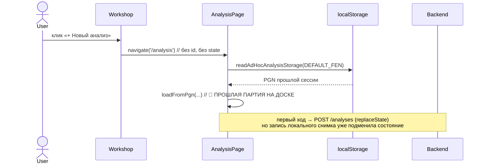
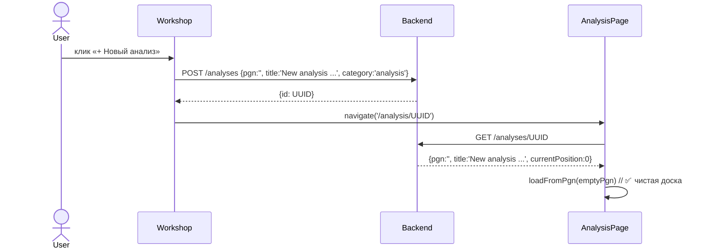

# ADR-051 — Доставка шахматного контента в клиент: единый источник правды и удаление ad-hoc кэша

- Статус: Proposed
- Дата: 2026-05-09
- Связанные задачи: KS-2597 (этот тикет)
- Связанные ADR: ADR-008 (Game analysis persistence), ADR-013 (Game archive and tree), ADR-018 (Archive service), ADR-021 (Broadcast service), ADR-037 (Move annotations), ADR-044 (play-vs-engine pivot), ADR-048 (precision section)
- Авторы: architect

---

## 1. Контекст

### 1.1 Симптом (KS-2597)

Заходишь в Мастерскую → «+ Новый анализ» → открывается Глубокий анализ. На доске **прошлая партия** (например `Queen's Gambit Declined: 1.d4 d5 2.c4 e6 3.Nc3 a6 4.cxd5 exd5 5.Bf4 c6`), список ходов от прошлой сессии. Чистого состояния нет.

Сценарий повторяемый: воспроизводится на любом устройстве, где раньше уже работали в `/analysis`.

### 1.2 Где сейчас живёт «кэш» — три параллельных источника

Поверх REST-эндпоинтов `/analyses` (Backend, ADR-008) на клиенте за последние недели наросли **три независимых слоя**, дублирующих хранение PGN:

#### 1.2.1 `localStorage['analysis:adhoc:<base64(initialFen)>']`

Файл: `apps/web/src/hooks/useAdHocAnalysisAutosave.ts` (KS-2281). Хук:

- На **каждое изменение** `history`/`annotations` при `enabled=true` сериализует PGN и пишет в localStorage (throttle 1500мс).
- На **mount** при `enabled=true` читает запись по `initialFen` и вызывает `onRestore(pgn)` → `loadFromPgn(...)` — то есть восстанавливает доску из localStorage до того, как пользователь вообще что-то делает.
- `enabled = !gameId && !analysisId && !stateHasPgn && !puzzleFen && !puzzlePgn` (`AnalysisPage.tsx:438-455`).

Ключ хранения — base64 от **стартового FEN**, а не от id записи. Все ad-hoc сессии с одной и той же стартовой позиции (а это в 99% случаев `DEFAULT_FEN`) пишутся **в одну ячейку** и затирают друг друга.

#### 1.2.2 Auto-create через `POST /analyses` на mount + `replaceState`

Файл: `apps/web/src/pages/AnalysisPage.tsx:506-546` (KS-2152, KS-2502, серия фиксов KS-2486 reopen 1..3). При первом изменении `history` (debounce 600мс) на пустом `/analysis` без id:

```
if (!localIdRef.current) {
  const entry = await createAnalysis(pgn, title, category);
  localIdRef.current = entry.id;
  window.history.replaceState(null, '', '/analysis/' + entry.id);
}
```

`replaceState` **не оповещает React Router**: `useParams().id` остаётся `undefined`, обёртка `<AnalysisPageInner key={id ?? '__none__'}>` (KS-2403) тот же `'__none__'` → компонент не пересоздаётся, `localIdRef.current` живёт между навигациями в эту же сессию.

#### 1.2.3 `localIdRef.current` (in-memory)

Файл: `apps/web/src/pages/AnalysisPage.tsx:152-164`. Ref переживает rerender, но не unmount. При навигации через `replaceState` (см. 1.2.2) unmount'а нет — `localIdRef` сохраняет id первой записи. Каждое следующее открытие `/analysis` без явного id пишется autosave'ом в **первую** запись (видно в комментариях: «все партии в Workshop становятся одинаковыми»).

### 1.3 Где контент летит через URL / Router state

Помимо `localStorage`, тело контента (FEN/PGN/ходы) проникает на страницу анализа ещё через два канала:

**Query string** (`AnalysisPage.tsx:173-177`):
- `?fen=<FEN>` — стартовая позиция
- `?pgn=<URL-encoded PGN>` — полный PGN
- `?moves=<UCI list>` — список UCI-ходов
- `?side=white|black` — ориентация доски

**`history.state`** (через `navigate('/analysis', { state: ... })`):
- `state.pgn`, `state.title`, `state.localId`
- `state.puzzleFen`, `state.puzzlePgn`
- `state.breadcrumb*` (≈8 полей: root/section/back/file/back-state)

Точки входа, которые **передают контент** по этим каналам:

| Источник | Файл | Канал | Корректно? |
|----------|------|-------|------------|
| Workshop «+ Новый анализ» | `WorkshopAnalysisList.tsx:404` | пустой `/analysis` без id и state | **нет** — триггер бага KS-2597 |
| Workshop «открыть запись» | `WorkshopAnalysisList.tsx:225-232` | `/analysis/<id>` + breadcrumb state | да (есть id) |
| Workshop PGN-файл → партия | `WorkshopPgnList.tsx:242-254` | `/analysis` + `state.pgn` + breadcrumb | нет (PGN в state) |
| LobbyPage загрузка PGN | `LobbyPage.tsx:94` | `/analysis` + `state.pgn` | нет |
| LobbyPage кнопка «Свободная партия» | `LobbyPage.tsx:460` | пустой `/analysis` | нет (см. 1.2) |
| PuzzlePage «Анализ» | `PuzzlePage.tsx:604` | `/analysis` + `state.pgn` (FEN+SAN, синтезирован клиентом) | нет |
| ArchiveGamesPage клик на партию | `ArchiveGamesPage.tsx:541-583` | `POST /analyses` → `/analysis/<id>` через `openAnalysisFromPgn` | да |
| BroadcastGamePage launcher | `BroadcastGamePage.tsx:65-77` | `openAnalysisFromPgn` | да |
| BroadcastRoundPage клик | `BroadcastRoundPage.tsx:163` | `openAnalysisFromPgn` | да (для завершённых) |
| BroadcastLiveGamePage кнопка | `BroadcastLiveGamePage.tsx:193` | `openAnalysisFromPgn` | да |

Заметно: **есть рабочий паттерн** (`openAnalysisFromPgn` — `apps/web/src/utils/openAnalysisFromPgn.ts`), который создаёт запись через POST до navigate и переходит на `/analysis/<id>`. Но он применён только в архиве и трансляциях. Workshop, Puzzle, Lobby пользуются старыми путями (state.pgn / голый /analysis), и именно они — источник класса багов KS-2502 / KS-2486 reopen 1..3 / KS-2597.

### 1.4 Почему именно сейчас всплыло

`useAdHocAnalysisAutosave` (KS-2281) — относительно свежий хук. До его появления автосейв в localStorage был только для NAG-аннотаций. Серия патчей (KS-2502 «отключить ad-hoc autosave при stateHasPgn / puzzleFen», `0cb6e5c8` revert KS-2486 reopen 1+2, `9ce8db8d` отключить ad-hoc autosave при `state.pgn`/`puzzleFen`) — попытки локально подавить симптомы, не убирая корня. Сценарий «Workshop +Новый» не покрыт ни одним из guard'ов из 1.2.1 → автосейв активен → restore прошлой партии срабатывает.

### 1.5 Сводка типов шахматного контента и эндпоинтов

| Тип | Маршрут фронта | Эндпоинт backend | Ownership ID |
|-----|----------------|-------------------|---------------|
| **analysis** (личная разборка) | `/analysis/:id` | `GET/POST/PATCH/PUT/DELETE /analyses[/:id]` (`apps/api/src/analysis/`) | backend (UUID при `POST`) |
| **game_review** (анализ онлайн-партии) | `/game/:gameId/review` | `GET /games/:id`, `GET /games/:id/moves`, `PUT /games/:id/analysis` | backend (gameId уже есть) |
| **puzzle** (lichess + generated) | `/puzzle/:id` | `GET /puzzles/...`, `POST /puzzles/batch` (для generated) | backend |
| **archive game** (импортированная) | `/archive/games/:id` | `GET /archive/games/:id` (ADR-018) | archive-service |
| **broadcast game live** | `/broadcasts/:t/:r/:g/live` | `GET /broadcasts/...` (ADR-021) | broadcast-service |
| **broadcast game ended** | `/analysis/:id` (через `openAnalysisFromPgn`) | `POST /analyses` (category=`analysis`) | backend |
| **PGN-файл из Мастерской** | `/workshop/pgn-files/:fileId` (список) → `/analysis/...` | `GET /workshop/pgn-files/:id/games` | workshop |
| **drill / lesson position** | `/drills/:type`, `/lessons/.../:lesson` | `GET /drills/...`, `GET /lessons/...` | backend |

Backend как источник правды у нас уже есть. Сломан только клиентский путь к нему: вместо «дай мне `<type>/:id`» фронт пытается **сам собрать** контент из state + query + localStorage и в этой сборке регулярно ломается.

---

## 2. Решение

### 2.1 Принцип

> **Backend владеет идентификатором и телом каждой единицы шахматного контента. Клиент знает только `<type>/:id` и читает по нему.**

Из этого следует:

- Тело контента (FEN/PGN/moves/answers/sourceMetadata) **никогда** не передаётся через URL query или Router state.
- Создание новой записи (Новый анализ, открытие партии в анализе, и т.д.) — это **синхронный POST** на backend, после которого фронт переходит на `/<type>/:id` с уже известным id.
- Локального автосейва тела контента **не существует**. Сохранение — всегда `PATCH /<type>/:id` к существующей записи.
- На клиенте кэшируются только **метаданные и презентационные настройки**: тема доски, размер, last-opened список, ориентация. Тело — никогда.

### 2.2 Текущая vs целевая схема навигации

Текущая (`Workshop +Новый`):



Целевая:



То же самое для остальных точек входа: PuzzlePage «Анализ», WorkshopPgnList «Открыть партию», LobbyPage «Загрузить PGN». Логика инкапсулируется в `openAnalysisFromPgn` (он уже есть и применён в архиве/трансляциях) — расширяем его на все источники и удаляем все альтернативные пути.

### 2.3 Контракт API для тела контента

**Решение: оставляем отдельные эндпоинты по типу.** Универсальный `GET /content/:type/:id` с дискриминированным union отклонён по причинам:

- В проекте уже **четыре сервиса** (api, archive-service, broadcast-service, tactic-worker) с разными базовыми URL (subdomain split — ADR-017). Универсальный шлюз потребовал бы либо ещё одного proxy-сервиса, либо размазывания роутинга по фронту.
- Гарантированно разные политики кэширования: `archive game` иммутабельный (CDN-кэш на сутки), `broadcast game live` — поллинг 15с, `analysis` — приватный авторский per-user, `puzzle` — публичный + per-user attempts. У `Cache-Control` для них нет общего знаменателя.
- Существующие 4-5 контроллеров уже стабильны; объединение принесло бы регрессии без улучшения DX.

Эндпоинты остаются как есть, формализуем **общие правила**:

| Правило | Описание |
|---------|----------|
| **R1.** Тело — только в response, не в request URL | `?fen=`, `?pgn=`, `?moves=` запрещены. Полезная нагрузка — в JSON-body POST/PATCH. |
| **R2.** Создание возвращает `id` синхронно | Любой `POST /<resource>` должен вернуть `{ id, ... }` до того, как фронт сможет navigate'нуть. Фронт обязан дождаться. |
| **R3.** Чтение по `id` идемпотентно | `GET /<resource>/:id` всегда возвращает текущее тело. Без подмеси из query. |
| **R4.** Обновление через `PATCH /<resource>/:id` | Только partial updates. Никаких «сохрани, что у меня в localStorage». |
| **R5.** Live-режим — отдельный путь | Для broadcast live остаётся `BroadcastLiveGamePage` с polling, переход «открыть в анализе» = снимок (`POST /analyses` с PGN на момент клика). |
| **R6.** Категория записи — серверная | `category` валидируется на backend (`'analysis' | 'game_review' | 'puzzle'`, `CreateAnalysisDto`), фронт её только передаёт. |

### 2.4 Что разрешено / запрещено в URL и Router state

**Разрешено в URL path:** только `<type>/:id` и навигационные параметры (например `?ply=12&tab=engine` — позиция в дереве и активная вкладка, **производные** от тела контента).

**Запрещено в URL query:** `?fen=`, `?pgn=`, `?moves=`, `?side=`. Полностью убираем.

**Разрешено в Router state (`navigate(path, { state })`):** только данные **навигации**, не контента:
- `breadcrumbRootTitle`, `breadcrumbRootUrl`, `breadcrumbSection`, `breadcrumbBackUrl`, `breadcrumbBackState`, `breadcrumbFileName`, `breadcrumbFileBackUrl`, `breadcrumbFileBackState` — оставить;
- `title` (имя записи) — **только** если backend ещё не успел её создать к моменту navigate; иначе title приходит из `GET /<resource>/:id`.

**Запрещено в Router state:** `pgn`, `puzzlePgn`, `puzzleFen`, `localId`, `pgn`-производные. Любая такая попытка должна срабатывать триггером ESLint-правила (см. §4 декомпозиция).

### 2.5 Что разрешено / запрещено в localStorage

**Разрешено:**
- `analysisRunning`, `engineSource`, `externalConfig`, `bridgePromoDismissed`, `analysisBoardSize` — настройки UI.
- `boardTheme`, `pieceSet`, ориентация по умолчанию, последний выбранный фильтр в Мастерской — настройки.
- `token` (auth) — текущая модель.

**Запрещено:**
- Тело контента (PGN/FEN/moves/answers/annotations) под любым ключом. Удаляем `analysis:adhoc:*` и аналоги.
- `localId` / суррогатные id, не известные backend'у.

**Аргумент против localStorage-кэша тела:** ad-hoc снимок принципиально не различает «Workshop +Новый» (нужно чистое состояние) и «случайно перезагрузил страницу анализа без id» (хочется восстановить). Нет дешёвого способа разделить эти два намерения локально. Проще — **всегда** запросить запись у backend по id (см. R2: id есть всегда после клика).

Цена: при `POST /analyses` отвалившемся (offline/auth) клик «+Новый анализ» падает с error-toast и не создаёт пустую сессию. Это правильный fallback — пустая локальная сессия без id = тот же класс багов.

### 2.6 Унификация точек входа

Все вызовы `navigate('/analysis', ...)` или `navigate('/analysis/' + id, ...)` по проекту проходят через **один helper** (расширенная версия `openAnalysisFromPgn`):

```ts
openAnalysis(navigate, opts: {
  // создание новой
  pgn?: string;            // optional — если есть готовый PGN (puzzle/file/archive)
  title?: string;
  category?: 'analysis' | 'game_review' | 'puzzle';
  // открытие существующей
  existingId?: string;     // если уже знаем id (Workshop list)
  // навигационная обёртка
  state?: { breadcrumb*: ... };
  replace?: boolean;
})
```

Логика:
1. Если есть `existingId` → `navigate('/analysis/<existingId>', { state })`. Чтение по id.
2. Иначе → `POST /analyses` (с переданным `pgn` или пустым `''`) → получили id → `navigate('/analysis/<id>', { state })`.
3. На ошибке POST — error-toast, никаких fallback'ов на голый `/analysis`.

После миграции: маршрут `/analysis` без id **удалён из роутинга**. Любая ссылка на `/analysis` без id — 404 (или редирект на `/workshop`).

### 2.7 Состояние внутри AnalysisPage

После удаления ad-hoc-кэша:

- `localIdRef` исчезает. Источник правды — `useParams().id`.
- Эффект «POST /analyses при первом ходе» (`AnalysisPage.tsx:506-546`) исчезает. Запись уже существует к моменту mount'а.
- `replaceState('/analysis/<id>')` исчезает.
- `useAdHocAnalysisAutosave` удаляется. Сохранение — единственный путь: `PATCH /analyses/:id` (debounce 600мс), как и сейчас в ветке «existing id».
- Restore при reload — единственный путь: `GET /analyses/:id` на mount.
- Парсинг `?fen=`, `?pgn=`, `?moves=`, `?side=`, `state.pgn`, `state.puzzleFen`, `state.puzzlePgn` удаляется. Эти параметры больше никто не отправляет (см. 2.6), и страница их не читает.

`useAnalysisPersistence` (для `gameId` review-mode) остаётся как есть — он уже идёт через `PUT /games/:id/analysis`, контракт правильный.

---

## 3. План миграции

### 3.1 Порядок (избегаем поломки прода)

Задачи декомпозируются так, чтобы **на каждом шаге прод оставался рабочим**:

**Этап A — backend (без изменений API, только подготовка):**
- A1. Подтвердить, что `POST /analyses` с пустым `pgn=''` корректно создаёт запись и возвращает `id`. (Проверить `analysis.service.ts`, при необходимости разрешить пустой PGN явно — DTO уже `@IsOptional()`.)
- A2. Убедиться, что `GET /analyses/:id` возвращает запись с пустым `pgn` без 500.

**Этап B — frontend, helper и точки входа (контент идёт через id):**
- B1. Расширить `openAnalysisFromPgn` → `openAnalysis` (поддержка пустого `pgn`, поддержка `existingId`, явный error-toast вместо тихого fallback на `/analysis`).
- B2. Workshop «+ Новый анализ»: заменить `navigate('/analysis')` на `openAnalysis(navigate, { pgn: '', title: getDefaultTitle(), category: 'analysis' })`.
- B3. WorkshopPgnList: заменить `navigate('/analysis', { state: { pgn, ... } })` на `openAnalysis(navigate, { pgn, title, category: 'game_review', state: { breadcrumb* } })`.
- B4. PuzzlePage «Анализ»: то же самое, `category: 'puzzle'`.
- B5. LobbyPage кнопки «Загрузить PGN», «Свободная партия»: то же самое.
- B6. Прогон тестов всех затронутых страниц.

После B прод уже починен (баг KS-2597 не воспроизводится), но в `AnalysisPage` ещё лежат старые ветки.

**Этап C — frontend, чистка AnalysisPage:**
- C1. Удалить `useAdHocAnalysisAutosave` (хук + использование в `AnalysisPage` + тесты + `clearAdHocAnalysisStorage`).
- C2. Удалить эффект auto-create через `POST /analyses` + `replaceState` (`AnalysisPage.tsx:506-546`).
- C3. Удалить `localIdRef`. Везде использовать `analysisId` из `useParams()`.
- C4. Удалить парсинг `?fen=`, `?pgn=`, `?moves=`, `?side=`, `state.pgn`, `state.puzzleFen`, `state.puzzlePgn`.
- C5. Маршрут `/analysis` без id → 404 / redirect на `/workshop`. Обновить `App.tsx`.
- C6. Очистка legacy `localStorage` ключа `analysis:adhoc:*` (одноразовый migration-effect при первом заходе после деплоя — удалить все ключи с этим префиксом).

**Этап D — guardrails:**
- D1. ESLint-правило, запрещающее `navigate('/analysis...', { state: { pgn|puzzleFen|puzzlePgn } })` и `?fen=`/`?pgn=`/`?moves=` в URLSearchParams для `/analysis`.
- D2. Тест в `AnalysisPage.test.tsx`: при заходе на `/analysis/<UUID>` с пустым PGN на доске должен быть `DEFAULT_FEN`, история пустая, никаких следов прошлой сессии.
- D3. Smoke e2e: «Workshop → +Новый → доска чистая → ход → перезагрузка → ход остался».

### 3.2 Что **не** трогаем

- `useAnalysisPersistence` (для `gameId` review-mode `/game/:id/review`) — он уже корректный.
- Архив (`ArchiveGamesPage`, `ArchiveGamePage`) — `openAnalysisFromPgn` уже работает правильно, только меняем имя/сигнатуру helper'а.
- Broadcast live (`BroadcastLiveGamePage`) — отдельный путь с polling, не связан с `/analysis` напрямую.
- `WorkshopPage` (выбор секции, breadcrumb) — структура не меняется, только обработчики переходов.
- Бэкенд-схема БД (`Analysis` модель в Prisma) — без изменений.

### 3.3 Совместимость со старыми ссылками

Внешних ссылок на `/analysis?fen=...&pgn=...` мы не отдаём (это внутренний фронт). Но если у пользователя в истории браузера остались такие URL — после деплоя они приведут на 404 (или `/workshop`). Это допустимо: нет stable shareable-формата для ad-hoc сессий.

Если нужно сохранить shareable-ссылку «открой эту позицию для анализа» (open question, см. §5) — реализуется через `POST /analyses` с пустым телом + редирект на `/analysis/<id>`, и пользователь делится этим id. Без `?fen=`.

---

## 4. Декомпозиция задач

Координатор поставит отдельные тикеты после согласования. Метки и зоны:

| # | Тикет | Зона | Что делает | Зависимости |
|---|-------|------|------------|-------------|
| **A1** | [BE] валидация `POST /analyses` с пустым pgn=`''` | backend (`analysis`) | Подтвердить либо явно разрешить пустой PGN, добавить unit-тест. | — |
| **A2** | [BE] `GET /analyses/:id` для пустой записи | backend (`analysis`) | Проверка, юнит-тест. | A1 |
| **B1** | [FE] унифицированный helper `openAnalysis` | frontend (`analysis`) | Расширение `openAnalysisFromPgn`: поддержка `pgn=''`, `existingId`, error-toast. Тесты. | A1 |
| **B2** | [FE] Workshop «+ Новый анализ» через `openAnalysis` | frontend (`analysis`) | `WorkshopAnalysisList.tsx:404`. Тест + smoke. | B1 |
| **B3** | [FE] WorkshopPgnList «Открыть партию» через `openAnalysis` | frontend (`analysis`) | `WorkshopPgnList.tsx:242-254`. Категория `game_review`. | B1 |
| **B4** | [FE] PuzzlePage «Анализ» через `openAnalysis` | frontend (`puzzle`, `analysis`) | `PuzzlePage.tsx:604`. Категория `puzzle`. | B1 |
| **B5** | [FE] LobbyPage загрузка PGN / Свободная партия через `openAnalysis` | frontend (`analysis`) | `LobbyPage.tsx:94`, `LobbyPage.tsx:460`. | B1 |
| **C1** | [FE] удалить `useAdHocAnalysisAutosave` | frontend (`analysis`) | Хук + использование в `AnalysisPage` + `DevNagPalettePage` + тесты. Migration-effect для очистки `analysis:adhoc:*` (см. C6). | B2..B5 |
| **C2** | [FE] удалить auto-create POST + `replaceState` в `AnalysisPage` | frontend (`analysis`) | `AnalysisPage.tsx:506-546` + `useEffect` в `:194-203`. | B2..B5 |
| **C3** | [FE] убрать `localIdRef`, опираться на `useParams().id` | frontend (`analysis`) | Все usage'ы по файлу. Безопасно после B-этапа. | C2 |
| **C4** | [FE] удалить чтение `?fen=`, `?pgn=`, `?moves=`, `?side=`, `state.pgn`, `state.puzzleFen`, `state.puzzlePgn` | frontend (`analysis`) | `AnalysisPage.tsx:173-270`, `:351-396`, `:430-455`. | B2..B5 |
| **C5** | [FE] убрать маршрут `/analysis` без id | frontend (`analysis`) | `App.tsx:400`. Заменить на 404 / `/workshop`. | C2..C4 |
| **C6** | [FE] one-shot migration: очистить `localStorage` ключи `analysis:adhoc:*` | frontend (`analysis`) | Утилита, выполняется один раз при mount AppRoot после деплоя. Через 2 недели можно удалить. | C1 |
| **D1** | [FE] ESLint-правило против контента в URL/state для `/analysis` | frontend (`analysis`, `tests`) | Custom rule или `no-restricted-syntax` regex по `navigate('/analysis...', { state: { pgn|puzzlePgn|puzzleFen } })`. | C5 |
| **D2** | [FE] unit-тест: чистое состояние при заходе на `/analysis/<UUID>` с пустым PGN | frontend (`analysis`, `tests`) | `AnalysisPage.test.tsx`. | C5 |
| **D3** | [QA] smoke e2e: Workshop +Новый → чистая доска → ход → reload → ход остался | qa | Сценарий KS-2597, плюс негативные (нет всплывания прошлой партии). | C5 |

Метки тикетов: основные — `analysis`, дополнительно `puzzle` (B4), `tests` (D1, D2). Все B/C тикеты — мелкие, по одному файлу, ставятся последовательно (A → B → C → D); внутри B и C можно параллелить.

---

## 5. Риски и open questions

### 5.1 Риски

- **R-1: Зависимость новой записи от backend.** Если `POST /analyses` упал (offline/timeout), пользователь не попадёт в анализ кликом «+Новый». Митигация: явный error-toast с кнопкой Retry, без тихого фолбека. Ad-hoc «работа в офлайне с локальным буфером» — нерабочий сценарий уже сейчас (autosave-кэш всё равно мёрзнется до первого online из-за PATCH).
- **R-2: Скачок числа записей в БД.** Каждый клик «+Новый» теперь создаёт строку в `Analysis`, даже если пользователь сразу закрыл страницу. Митигация: scheduled-job на бэке — удалять записи `category='analysis'` с пустым `pgn` старше 7 дней, либо TTL по `updatedAt < createdAt + 5min`. Решить отдельно после B-этапа, не блокирует фикс.
- **R-3: Потерянные ссылки `/analysis?fen=...&pgn=...`.** Если у кого-то в закладках. Митигация: redirect на `/workshop` с info-сообщением. Низкий риск (внутренние URL, не индексируются).
- **R-4: AnalysisPage остаётся большим (~1700 строк).** Эта правка его уменьшает (минус autosave + auto-create + 4 query-парсера), но не до конца. Дальнейшее рефакторинг — отдельный ADR, не в этой задаче.

### 5.2 Open questions (для координатора + пользователя)

1. **Shareable «открой эту позицию для анализа»** — нужен ли pattern «дай мне URL, по которому товарищ откроет позицию X»? Если да — реализация через `POST /analyses` с заполненным `pgn` + редирект на `/analysis/<id>` (id шерится). Без `?fen=`. Решение: оставляем на потом (пока что таких UX-сценариев в продукте нет).
2. **Чистка истории `localStorage`.** Migration-effect `C6` чистит ключи единоразово. Через 2 недели нужно его удалить — поставить отдельный календарный тикет?
3. **Связанные баги** (из тикета KS-2597): подсветка фигуры между разделами / лишнее подчёркивание у кнопки / связка d6 на диагонали b8–h2. Они **не входят** в этот ADR — отдельные тикеты после согласования декомпозиции выше. Координатор поставит их параллельно: первый и третий — фронт+бэк, второй — layout.

---

## 6. Что НЕ делается в этом ADR

- Не унифицируем эндпоинты в `GET /content/:type/:id` (см. 2.3, обоснованно отклонено).
- Не трогаем `gameId` review-режим — он работает корректно.
- Не правим broadcast live (отдельная архитектура с polling).
- Не делаем offline-режим для анализа (см. R-1; off-scope, нет такого продуктового требования).
- Не оптимизируем бандл / lazy-loading `AnalysisPage`.
