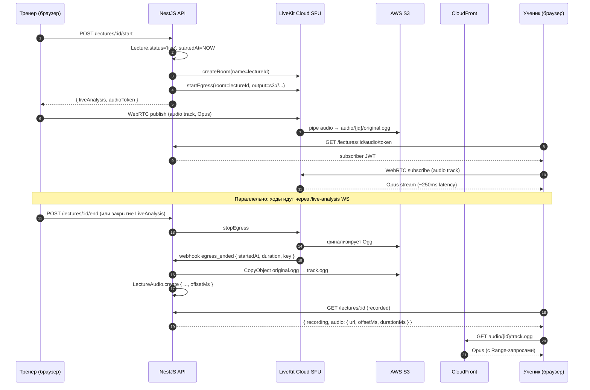

# ADR-115: Запись и live-стриминг голоса тренера на лекциях с синхронизацией с ходами

**Статус:** Предложено
**Дата:** 2026-06-07
**Задача:** KS-3818
**Связанные ADR:** [ADR-110](./110-live-analysis-broadcast.md), [ADR-111](./111-live-analysis-full-broadcast.md), [ADR-112](./112-live-analysis-per-analysis-binding.md), [ADR-113 §2.6](./113-coach-page.md)

## 1. Контекст

### 1.1 Что уже есть

- **Lecture / LectureRecording** (ADR-113, миграции KS-3783/KS-3790). Лекция — зонтичная сущность со статусами `scheduled | live | recorded | cancelled`. Запись — лента событий доски (`move`, `state-patch`, `reset`) с временной меткой `t: number` от старта лекции (мс). См. `packages/db/prisma/schema.prisma` модели `Lecture` и `LectureRecording`.
- **Зарезервированы поля** `Lecture.mediaUrl?` / `Lecture.mediaKind?` (см. schema.prisma:2210–2212) — задел под медиаконтент.
- **Live-транспорт ходов** — Socket.IO namespace `/live-analysis` (ADR-110/111). Сейчас несёт только события доски, не медиа.
- **AWS-инфра** — платформа развёрнута в AWS; S3-bucket'ы под другие сценарии уже планировались (KS-2316 — daily-tactic-drill), готовые модули `@aws-sdk/client-s3` в проекте пока **не подключены** (есть только `@aws-sdk/client-ecs`).

### 1.2 Что нужно

Тренер во время лекции комментирует ходы голосом. Требуется:
1. **Live-режим.** Ученик слышит тренера с задержкой ≤500 мс (с момента произнесения до воспроизведения на клиенте).
2. **Запись.** После закрытия трансляции аудио сохраняется и раздаётся вместе с записью ходов.
3. **Синхронизация с ходами.** Когда ученик пересматривает лекцию и тренер говорит «вот этот ход слабый» — соответствующее `state-patch`-событие в `LectureRecording.events` приходит в тот же момент.

### 1.3 Ограничения

- Один разработчик в команде. Self-hosted продакшен-медиасервера (mediasoup + кластер TURN + транскодирование) тянуть некому.
- Ожидаемый масштаб (наследуется из ADR-110): 10–50 зрителей одной лекции. Пиковая одновременная нагрузка по платформе — десятки активных лекций, не сотни.
- Платформа уже на AWS, S3 как стандартное хранилище.
- Backend: NestJS, WebSocket-шлюз `/live-analysis`. Frontend: React 19, есть `LectureReplayPage` (KS-3791).

### 1.4 Что НЕ в скоупе ADR

- Видео тренера (камера). Только аудио. Видео — отдельный ADR при наличии запроса.
- Чат зрителей во время лекции.
- Live-транскрипция / автоматические субтитры.
- DRM / платный доступ.

## 2. Решение

### 2.1 Транспорт live: SFU через LiveKit Cloud

**Решение:** для live-передачи аудио используем **LiveKit Cloud** (managed SFU). На каждую live-лекцию создаётся LiveKit-room с тем же id, что и `Lecture.id`. Тренер публикует один audio-track, зрители подписываются.

**Почему SFU, а не p2p mesh (как было намечено в ADR-113 §2.6).**

Пересмотр направления ADR-113. Mesh-WebRTC масштабируется по upstream автора: при N зрителях автор отправляет N независимых RTP-стримов. На 32 kbps Opus это терпимо до ~10 зрителей, дальше — bufferbloat на типичном домашнем upload 10 Mbps (ещё и видео-камеры тренера в будущем). Целевые 10–50 зрителей — диапазон, в котором mesh уже неприемлем. SFU обязателен.

**Почему LiveKit Cloud, а не self-hosted (mediasoup / LiveKit OSS).**

| Критерий | LiveKit Cloud | LiveKit Self-hosted (EC2) | mediasoup (Node lib) |
| --- | --- | --- | --- |
| Operational overhead | Нулевой (managed) | Поднять EC2, TURN, sertbot, мониторинг | Написать сервер с нуля, TURN, мониторинг |
| Стоимость до 100 одновременных слушателей | ≈ $0.004/мин/участника, ~$10–30/мес при ожидаемом профиле использования | $30+/мес EC2 + траффик out + TURN | то же + дни разработки |
| Time-to-MVP | 2–3 дня | 2–3 недели | 3–4 недели |
| Egress в S3 (server-side recording) | Встроенная фича LiveKit Egress | Своими руками | Своими руками |
| Vendor lock-in | LiveKit-протокол; SDK Apache-2.0, формат room/track совместим со self-hosted | — | — |

LiveKit-протокол открыт, SDK тот же что у self-hosted LiveKit. **Переезд Cloud → self-hosted** позже сводится к смене URL и API-ключа без правок прикладного кода. mediasoup отвергаем как самый тяжёлый вариант для команды из одного человека.

**Почему не LL-HLS / WHIP-через-CDN (Cloudflare Stream, Mux).** Минимальная задержка LL-HLS — 2–4 сек, у целевых WHEP-плееров через Cloudflare Stream — 0.8–1.5 сек. Цель ≤500 мс не достигается, синхронность с движущейся фигурой на доске ломается.

**Транспорт сигналинга.** LiveKit ведёт свой WebSocket-сигналинг внутри SDK; интегрироваться с нашим `/live-analysis` namespace не надо. Backend NestJS выпускает только **access token** (JWT, подписанный LiveKit API-secret) на endpoint `POST /lectures/:id/audio/token`. Токен включает room name (=lectureId), identity (=userId или anon-uuid), `canPublish=true` только для владельца лекции.

**Целевые цифры.**

- Захват: WebRTC через `getUserMedia({audio: {echoCancellation:true, noiseSuppression:true, autoGainControl:true}})`. Профиль Opus monoaural, LiveKit по умолчанию шлёт 48 kHz / mono / VBR ~32 kbps для голоса.
- E2E задержка LiveKit Cloud (publisher → SFU → subscriber) в Европе/EU-region — устойчиво 150–300 мс. С учётом jitter-buffer (50–100 мс) — укладываемся в ≤500 мс.

### 2.2 Запись: LiveKit Egress → S3

**Решение:** запись делает сам медиасервер через LiveKit Egress (server-side track composite). Egress пишет audio-track тренера в **Ogg/Opus** в наш AWS-S3 bucket. После завершения LiveKit шлёт webhook `egress_ended`, backend сохраняет `LectureAudio` запись в БД.

**Почему серверная запись, а не клиентская (MediaRecorder в браузере тренера).**

Клиентский `MediaRecorder` + загрузка финального блоба — была опция в ADR-113 §2.6.3 как «MVP-проще». Отвергаем для текущего ADR по причинам:
1. **Потеря записи при крахе вкладки тренера.** За часовую лекцию у активно жестикулирующего тренера может быть memory pressure на старом железе или iOS-фоновая выгрузка — записать локально, не загрузив, = потерять полностью.
2. **Дублирование пути.** Live-стрим уже идёт через SFU, который умеет писать на сервере «бесплатно» (Egress включён в LiveKit Cloud subscription).
3. **Синхронизация offset'а упрощается:** LiveKit пишет recording с server-side стартом, его метку времени мы получаем в webhook и сохраняем как `audioStartedAt`. Никакой trust к локальным часам тренера.

**Fallback на клиентскую запись — оставляем под флагом** (Эпик 4) на случай, если live-инфра упадёт прямо во время лекции. В рамках текущего ADR не реализуем.

**Формат файла.**

| Параметр | Значение | Обоснование |
| --- | --- | --- |
| Кодек | Opus | Лучший speech-кодек, бесплатный, нативно в WebRTC, поддержка Chrome/Firefox/Safari 17+ |
| Контейнер | Ogg | Что Egress отдаёт по умолчанию; нативно проигрывается во всех современных браузерах через `<audio src=...>` |
| Каналы | mono | Голос; сокращение размера ×2 относительно stereo |
| Sample rate | 48 kHz | дефолт WebRTC, не нужно ресемплить |
| Битрейт | VBR ~32 kbps | Speech-профиль Opus; 1 час лекции ≈ 14 МБ |

**Safari iOS <17** не играет Opus в Ogg. Доля пользователей с iOS<17 в нашей аудитории — единицы процентов (см. KS-2792 stats). На текущем этапе не транскодируем; в Эпик 4 — опциональная конверсия в AAC/MP4 при necessity.

**Хранилище: AWS S3, не MinIO.**

| Критерий | AWS S3 | MinIO (self-hosted) |
| --- | --- | --- |
| Совместимость с текущей инфрой | Платформа уже на AWS, IAM-роли есть | Нужен новый сервис, бэкап, мониторинг |
| Стоимость 100 ГБ + 1 ТБ трафика/мес | ~$2.3 хранилище + ~$85 трафик через S3 + CloudFront тариф ~$60 | EC2 + диск + поддержка |
| Operational overhead | Нулевой | Высокий для одного разработчика |
| CDN | Нативно CloudFront | Свой Nginx/Varnish |

MinIO выгоднее только если уйти с AWS целиком. Не наш случай.

**Layout S3:**

```
s3://kingside-lectures/
  audio/
    <lectureId>/
      original.ogg        # что Egress положил
      track.ogg           # symlink/copy под публичным CloudFront-URL
```

Bucket — приватный, доступ только через CloudFront-distribution с public OAI на префикс `audio/*/track.ogg`. Egress пишет на `original.ogg`, backend по webhook делает `CopyObject` в `track.ogg` (после проверки длительности/размера). Двухступенчатая схема даёт точку валидации перед публикацией.

### 2.3 Раздача записи: CloudFront, immutable-cache

**Решение:** аудио раздаётся через CloudFront-distribution с TTL `Cache-Control: public, max-age=31536000, immutable`. Запись лекции иммутабельна (id — UUID, перезаписи нет), агрессивное кеширование безопасно. Аналогично решению для `GET /lectures/:id/recording` (см. ADR-113 §4 эпик 2).

**Авторизация на скачивание.** Для `visibility='public'` — публичный read. Для `visibility='unlisted'` — Cloudfront signed URL с 24-часовым TTL, генерируется в `GET /lectures/:id/audio` после проверки доступа. Бэкенд не отдаёт прямой S3 URL никогда.

**Range-запросы.** CloudFront поддерживает HTTP Range нативно — `<audio>` HTML5-элемент пишет частичные запросы, seek без загрузки целого файла работает из коробки. Никакой дополнительной нарезки на чанки не требуется.

### 2.4 Синхронизация аудио с ходами

**Якорная точка** — `Lecture.startedAt` (server-side timestamp при `POST /lectures/:id/start`, см. `LecturesService.start` apps/api/src/lectures/lectures.service.ts:204).

**Что пишется в БД** (новые поля, см. §2.5):
- `audioStartedAt: DateTime` — серверный таймштамп начала аудио-egress'а. LiveKit Egress сообщает в webhook поле `started_at`.
- `audioOffsetMs: Int = audioStartedAt - lecture.startedAt` (мс).

`audioOffsetMs` может быть положительным (тренер включил микрофон не сразу) либо отрицательным (Egress стартанул до фактического `Lecture.start` — на практике невозможно, потому что Egress запускается из обработчика `start`).

**Replay-плеер** (KS-3791 `LectureReplayPage`) при наличии записи аудио:

```
event.t (мс от начала лекции)  =  audio.currentTime * 1000 + audioOffsetMs
```

Таймер плеера один — он же ведёт и доску, и `<audio>`. На каждый `requestAnimationFrame` плеер берёт `audio.currentTime` (источник правды), пересчитывает в `event.t`, применяет необходимые события доски. При paused/seek/×2 — все три (audio + board + timeline) идут синхронно, потому что timeline = audio.

Если `audioUrl == null` (аудио не было / Egress упал) — плеер деградирует к нынешнему режиму с собственным timer'ом (ADR-113 §2.3.6).

**Live-режим (когда зритель смотрит трансляцию).** Здесь синхронизация проще: ученик подписан на LiveKit-room (аудио) и на `/live-analysis` namespace (ходы), оба идут realtime. Расхождение порядка 100–300 мс между моментом, когда зритель слышит «двигаю слона на f4», и моментом, когда фигура реально передвинулась на доске, **остаётся**. Это by design: задержка LiveKit (200 мс) ≈ задержка Socket.IO (50–150 мс), на восприятие зрителя не влияет.

### 2.5 Влияние на схему БД

**Новая таблица `LectureAudio`** (1:1 с `Lecture`, отдельная — чтобы не раздувать `lectures` и потому что аудио может появиться позже live-лекции / не появиться вовсе):

```prisma
/// KS-3818 / ADR-115. Аудиозапись лекции (запись голоса тренера).
/// 1:1 с Lecture через UNIQUE по lectureId. Появляется при первом
/// успешном Egress-webhook от LiveKit; обновляется при последующих
/// перезаписях (теоретически возможно, на практике одна запись).
model LectureAudio {
  id              String   @id @default(uuid()) @db.Uuid
  lectureId       String   @unique @map("lecture_id") @db.Uuid
  lecture         Lecture  @relation(fields: [lectureId], references: [id], onDelete: Cascade)

  /// Ключ файла в S3 (без bucket-имени): "audio/<lectureId>/track.ogg".
  /// Bucket берётся из конфига (LECTURE_AUDIO_BUCKET).
  storageKey      String   @map("storage_key")
  /// Кодек: "opus" сейчас, в будущем "aac"/"mp3".
  codec           String   @default("opus")
  /// Контейнер: "ogg" / "mp4" / "webm".
  container       String   @default("ogg")
  /// VBR-средний битрейт в kbps. Информативно.
  bitrateKbps     Int      @map("bitrate_kbps")
  /// Каналы (1=mono, 2=stereo).
  channels        Int      @default(1)
  /// Длительность аудио в мс (из Egress webhook).
  durationMs      Int      @map("duration_ms")

  /// Серверный таймштамп начала записи. Источник — LiveKit Egress
  /// webhook field "started_at".
  audioStartedAt  DateTime @map("audio_started_at")
  /// Смещение audio относительно Lecture.startedAt в мс.
  /// audio_started_at - lecture.started_at. Используется replay-плеером
  /// для синхронизации с timeline ходов.
  offsetMs        Int      @map("offset_ms")

  /// Идентификатор Egress-задания в LiveKit (для дебага и идемпотентности
  /// при повторных webhook'ах).
  egressId        String?  @map("egress_id")
  createdAt       DateTime @default(now()) @map("created_at")

  @@index([lectureId])
  @@map("lecture_audio")
}
```

**Изменения существующих моделей.** `Lecture.mediaUrl` / `Lecture.mediaKind` (задел из ADR-113) — **оставляем как есть, не используем для аудио**. Это поля для внешних медиа (YouTube/VK), у них своя семантика и raw-ссылка. Для аудио — отдельная типизированная таблица.

**Миграция.** Добавление `LectureAudio` — single forward-migration, без правок существующих данных. Откат — DROP TABLE.

### 2.6 Поток данных (полная картина)



### 2.7 REST-контракт (черновик)

- `POST /lectures/:id/audio/token` (JwtAuthGuard). Возвращает `{ token: string, roomName: string, livekitUrl: string }`. Тренер: `canPublish=true`. Зритель: `canPublish=false`, `canSubscribe=true`.
- `POST /webhooks/livekit/egress` (без auth, **подпись через LiveKit webhook secret**). Принимает `egress_started` / `egress_ended` / `egress_failed`. На `egress_ended` — создаёт `LectureAudio`, копирует объект из original в track.
- `GET /lectures/:id` — расширяется полем `audio?: { url, durationMs, offsetMs, codec, container }`.

### 2.8 Конфигурация (env)

```
LIVEKIT_URL=wss://kingside-prod.livekit.cloud
LIVEKIT_API_KEY=...
LIVEKIT_API_SECRET=...
LIVEKIT_WEBHOOK_SECRET=...

LECTURE_AUDIO_BUCKET=kingside-lectures
LECTURE_AUDIO_CDN_BASE=https://media.kingside.site
LECTURE_AUDIO_CDN_KEY_PAIR_ID=...            # для signed URL на unlisted
LECTURE_AUDIO_CDN_PRIVATE_KEY_PATH=...
```

## 3. Последствия

### 3.1 Backend

- Новый модуль `apps/api/src/lecture-audio/`:
  - `LectureAudioController` — token-эндпоинт + webhook-приёмник + GET аудио-URL.
  - `LectureAudioService` — выпуск JWT для LiveKit, обработка webhook'ов, генерация signed URL для `unlisted`.
  - `LiveKitClient` (тонкая обёртка) — `createRoom`, `startEgress`, `stopEgress` через `livekit-server-sdk`.
- Интеграция с `LecturesService.start` (apps/api/src/lectures/lectures.service.ts:166): после установки `status='live'` инициировать `startEgress` (best-effort, ошибка LiveKit не должна валить старт лекции; пишем warning в лог).
- Интеграция с `LiveAnalysisService.closeBySlug`: на закрытии live-сессии лекции — `stopEgress`. Аналогично best-effort.
- Зависимости: `livekit-server-sdk@^2`, `@aws-sdk/client-s3@^3`, `@aws-sdk/cloudfront-signer@^3`.

### 3.2 Frontend

- Хук `useLectureAudioPublisher` для роли «тренер»: запрос микрофона, подключение к LiveKit-room с published audio-track, индикатор записи, mute/unmute, обработка `device unplugged`.
- Хук `useLectureAudioSubscriber` для роли «зритель»: подписка на LiveKit-room, прокидка audio в `<audio>`-элемент.
- `LectureReplayPage` — расширение KS-3791: если в payload пришёл `audio.url` — рендерим скрытый `<audio>` + используем его `currentTime` как источник правды timeline (см. §2.4).
- UI на стороне тренера: микрофон-кнопка в `LiveAnalysisRoom`, диалог разрешения, индикатор «запись идёт». Disclaimer ученикам: «лекция записывается» badge.
- Зависимость: `livekit-client@^2` (SDK).

### 3.3 DevOps

- Регистрация аккаунта LiveKit Cloud, создание project, получение API key/secret, настройка webhook URL → `https://api.kingside.site/webhooks/livekit/egress`.
- Создание приватного S3-bucket `kingside-lectures`, IAM-роль для LiveKit Egress на запись в `audio/*`, IAM-роль для backend на чтение + `CopyObject`.
- CloudFront distribution на bucket, OAI на read доступ к `audio/*/track.ogg`, кэш-политика `max-age=31536000`, key-group для signed URL (для unlisted).
- Доменное имя `media.kingside.site` → CloudFront.

### 3.4 Shared types

- `packages/shared/types/api-contracts.ts`:
  - `LectureAudio` (response shape).
  - `AudioTokenRequest` / `AudioTokenResponse`.
  - расширение `LectureDetail` с опциональным полем `audio?: LectureAudioInfo`.

### 3.5 Стоимость (оценка)

| Статья | Месячная стоимость при 100 часах лекций (50 зрителей среднее) |
| --- | --- |
| LiveKit Cloud (Build план: $50 base + участники) | ~$50–80 |
| S3 storage (100ч × 14 МБ = 1.4 ГБ; рост ×12/год = 17 ГБ/год) | <$1 |
| S3 egress + CloudFront (~50 ГБ трафика/мес) | ~$5–10 |
| **Итого** | **~$60–100/мес** |

При росте x10 (1000 ч/мес) — LiveKit ~$300, CloudFront ~$50. Точка пересмотра в self-hosted — около $500/мес total cost.

## 4. Альтернативы и почему отвергнуты

### 4.1 mediasoup (self-hosted SFU на Node)

Pro: open-source, full control, нет vendor lock.
Contra: 3–4 недели интеграции для одного разработчика, отдельный ECS-сервис, кластер TURN, мониторинг, апгрейды. Для масштаба <1000 одновременных слушателей — operational overhead перевешивает экономию.

### 4.2 LiveKit self-hosted (LiveKit OSS на EC2)

Pro: open-source, переезд с Cloud прозрачный.
Contra: всё ещё свой EC2 + Redis + TURN. На текущем масштабе экономия ~$30/мес против ~10 часов dev-времени в месяц на поддержку. Заявка на переезд при росте x10 — отдельный ADR.

### 4.3 Cloudflare Realtime SFU

Pro: managed, дёшево ($0.0005/мин/участник).
Contra: API моложе LiveKit, меньше документации, нет встроенного egress-в-S3 (пишет в Cloudflare Stream, требует webhook + копирование).

### 4.4 LL-HLS / WHIP через Cloudflare Stream

Pro: нативный CDN, простая раздача.
Contra: задержка 1–4 сек, не укладываемся в ≤500 мс. Подходит для one-to-million broadcasting, не для интерактивной лекции.

### 4.5 P2P WebRTC mesh (как намечал ADR-113 §2.6.2)

Pro: ноль инфры.
Contra: масштабируется только до ~10 зрителей. Для целевых 50 — невозможно без SFU.

### 4.6 Клиентская запись через MediaRecorder + загрузка в S3

Pro: не зависит от медиасервера, сразу даёт фоллбек.
Contra: потеря записи при крахе вкладки тренера; параллельно с live-стримом нагружает CPU тренера дважды (encode для WebRTC + encode для MediaRecorder). Откладываем как fallback в Эпик 4.

### 4.7 MinIO вместо AWS S3

Pro: бесплатно для хранилища.
Contra: своя инфра, не вписывается в логику «платформа на AWS». Экономия не оправдывает overhead.

### 4.8 Запись на отдельной серверной ноде (recorder в нашем коде, не Egress LiveKit)

Pro: full control, можно писать сразу в нужном формате.
Contra: нужно поднять отдельный сервис с подпиской на LiveKit-room, gstreamer/ffmpeg-pipeline, обработку failure. LiveKit Egress решает это «бесплатно» как часть подписки.

## 5. План внедрения

### Phase 0 — подготовка инфры (devops, 1 день)

1. Регистрация LiveKit Cloud, project, API key.
2. S3-bucket `kingside-lectures`, IAM-роли.
3. CloudFront distribution.
4. Все секреты → AWS Secrets Manager / env-переменные приложения.

### Phase 1 — backend без UI (3–4 дня)

1. Миграция Prisma: `LectureAudio`.
2. `LecturesAudioService` — token issue + webhook handler. Прокси к LiveKit и S3.
3. Расширение `LecturesService.start`/`closeBySlug` — стартует/останавливает Egress.
4. Unit-тесты на token issue (правильность permission claims), webhook handler (idempotency на повторный egress_ended).
5. Smoke-тест: ручной curl на token-эндпоинт, верификация JWT через `jwt.io` с правильными claims.

### Phase 2 — frontend тренера (2 дня)

1. `useLectureAudioPublisher` + UI «начать запись звука» в live-room.
2. Disclaimer для зрителей «лекция записывается».
3. Smoke: тренер → start lecture → start audio → видит индикатор записи → S3 содержит файл.

### Phase 3 — frontend зрителя live (1 день)

1. `useLectureAudioSubscriber`, подключение к LiveKit-room для роли viewer.
2. UI: «Подключиться к голосу» (mute по умолчанию, anti-autoplay browser policy).

### Phase 4 — replay (2 дня)

1. Расширение `GET /lectures/:id` с полем `audio`.
2. `LectureReplayPage`: подключение `<audio>` и переключение источника таймлайна.
3. Тестирование seek, speed=×2 (Web Audio API позволяет playbackRate без pitch-shift через `preservesPitch=false` — оставляем настройку «×2 with chipmunk effect» допустимой; правильный pitch-preserving — отдельная задача).

### Phase 5 — staging-тестирование, прод-релиз (2 дня)

1. End-to-end сценарий с двумя браузерами (тренер + ученик).
2. Тест отказа: убить вкладку тренера → проверить, что аудио сохранилось до момента отказа.
3. Тест webhook потери: задержать webhook-доставку → не дублировать запись (idempotency по `egressId`).

### Phase 6 — следующие итерации (отложено)

- Клиентская запись MediaRecorder как fallback.
- Транскод в AAC/MP4 для iOS<17.
- Видео тренера.
- Live-транскрипция (Whisper API).

## 6. Риски и подводные камни

1. **Webhook потерян / задержан.** LiveKit гарантирует at-least-once delivery с retry. Backend хранит `egressId` UNIQUE — повторный webhook идемпотентен (UPSERT). Если webhook вовсе не пришёл за 10 мин после `stopEgress` — cron-job опрашивает LiveKit API `getEgressInfo` для каждого незакрытого Egress, синхронизирует.

2. **Egress упал в середине лекции.** LiveKit пишет финализированный фрагмент до точки падения — Ogg в S3 будет валидным, но короче лекции. `LectureAudio.durationMs < lecture.durationMs`. Replay-плеер должен корректно обработать конец аудио раньше конца ходов (продолжать таймлайн без звука). Сценарий QA-обязательный.

3. **Тренер с двух устройств.** Если тренер открыл live-комнату на ноутбуке и телефоне — оба будут пытаться publish audio-track. LiveKit допускает несколько publishers в room, но Egress пишет первый. Решение: в frontend-логике publisher'а — singleton-флаг (lock через `localStorage` + heartbeat). При обнаружении второго publisher'а — показать ошибку «уже идёт запись с другого устройства».

4. **Браузер тренера не даёт микрофон (permission denied).** UI: явный modal «нужен доступ к микрофону», лекция продолжается без аудио. `LectureAudio` не создаётся. Не блокируем доску.

5. **Стоимость при «забытой» лекции.** Тренер ушёл, оставил Egress включённым — пишется тишина. Митигация: cleanup-job ADR-110 закрывает live по 30-мин неактивности (нет активности на доске), `stopEgress` вызывается там же. Дополнительно: hard cap на Egress duration — 6 часов (LiveKit-параметр).

6. **Privacy/GDPR.** Запись голоса — персональные данные. Тренер при первом включении видит consent-modal «голос будет записан и доступен слушателям». Запись хранится до удаления лекции; cascade на User-deletion (FK Cascade) подчищает.

7. **Echo при пересмотре live зрителем.** Если зритель открыл live в двух вкладках с включённым звуком — будет эхо (один LiveKit-track, два аудиоэлемента). UX-проблема, не серверная; на стороне фронта — `singleton` через broadcast-channel между вкладками.

8. **iOS Safari Opus < 17.** Замер реальной доли пользователей — в Phase 5. Если >5% — добавить транскод в AAC ad-hoc (Lambda через `ffmpeg`), `LectureAudio.container='mp4'` для них. Сейчас не делаем.

9. **Авторизация webhook'а.** LiveKit подписывает webhook HMAC-secret'ом, бэкенд верифицирует. Без верификации — открытая дыра для злоумышленника, который создаст левую `LectureAudio` запись с storageKey на чужой объект.

10. **Дрейф clock между LiveKit-сервером и нашим backend.** `audioStartedAt` идёт из LiveKit, `lecture.startedAt` — из NestJS. Расхождение между ними может быть сотни миллисекунд. `offsetMs` хранит разницу — этого достаточно для replay-синхронизации.

## 7. Follow-up tasks

### Эпик A — Backend инфра (1 эпик)

- **KS-A01 [backend]** — Prisma миграция: модель `LectureAudio` (поля §2.5). UNIQUE на `lectureId`, индексы.
- **KS-A02 [backend]** — модуль `apps/api/src/lecture-audio/`: `LectureAudioService` с методами `issueToken(lectureId, role)`, `handleEgressWebhook(payload)`, `getAudioForLecture(lectureId, requesterId?)`. Контроллер с тремя endpoint'ами (§2.7).
- **KS-A03 [backend]** — тонкий клиент `LiveKitClient` поверх `livekit-server-sdk`: `createRoom`, `startEgress`, `stopEgress`, `getEgressInfo`. Конфигурируется через `LIVEKIT_*` env.
- **KS-A04 [backend]** — интеграция в `LecturesService.start`: вызов `LiveKitClient.startEgress` (best-effort, без блокировки старта лекции).
- **KS-A05 [backend]** — интеграция в `LiveAnalysisService.closeBySlug`: вызов `stopEgress` для связанной лекции.
- **KS-A06 [backend]** — cron-reconciliation: каждые 10 мин искать активные egress'ы без webhook'а старше 5 мин → дёргать `getEgressInfo` и при `status='ENDED'` создавать `LectureAudio`.
- **KS-A07 [backend]** — расширить `GET /lectures/:id` ответом с `audio?: LectureAudioInfo`. Для `visibility='unlisted'` — генерировать signed CloudFront URL.
- **KS-A08 [backend]** — unit + e2e тесты: token claims, webhook idempotency, signed URL TTL, fallback при отсутствии Egress.

### Эпик B — DevOps инфраструктура

- **KS-B01 [devops]** — LiveKit Cloud project, ключи, webhook URL. Все секреты в Secrets Manager.
- **KS-B02 [devops]** — S3 bucket `kingside-lectures`, lifecycle policy (никакого автоудаления; лекции хранятся бессрочно), bucket policy private.
- **KS-B03 [devops]** — IAM роли: одна для LiveKit Egress (PUT в `audio/*/original.ogg`), одна для backend (Get + Copy + signed URL generation).
- **KS-B04 [devops]** — CloudFront distribution на bucket: OAI, public read для `audio/*/track.ogg`, key-group для signed URL на unlisted (приватный ключ в Secrets Manager).
- **KS-B05 [devops]** — DNS: `media.kingside.site` CNAME на CloudFront.
- **KS-B06 [devops]** — настройка webhook endpoint в LiveKit на `https://api.kingside.site/webhooks/livekit/egress` с подписанием HMAC.

### Эпик C — Frontend тренера

- **KS-C01 [frontend]** — установить `livekit-client@^2` в `apps/web`.
- **KS-C02 [frontend]** — хук `useLectureAudioPublisher(lectureId)`: запрос `/audio/token`, подключение к LiveKit-room, публикация audio-track с `getUserMedia` (echo+noise+autoGain).
- **KS-C03 [frontend]** — UI в live-комнате тренера: кнопка «Включить микрофон», индикатор записи (анимированная точка), mute/unmute, обработка `device unplugged` / `permission denied`.
- **KS-C04 [frontend]** — consent-modal при первом включении: «голос будет записан и доступен слушателям». Согласие хранится в `localStorage` (per user).
- **KS-C05 [frontend]** — singleton-lock через `localStorage` + heartbeat: запрет одновременной публикации с двух устройств.

### Эпик D — Frontend зрителя live

- **KS-D01 [frontend]** — хук `useLectureAudioSubscriber(lectureId)`: запрос viewer-token, подписка на audio-track, прокидка в `<audio>`.
- **KS-D02 [frontend]** — UI «Включить голос тренера» (mute по умолчанию из-за autoplay-policy браузеров).
- **KS-D03 [frontend]** — badge «🔴 запись» в live-room когда тренер пишет звук.

### Эпик E — Frontend replay

- **KS-E01 [frontend]** — `LectureReplayPage`: подгрузка `audio` из `GET /lectures/:id`, рендер `<audio>` с `preload="metadata"`.
- **KS-E02 [frontend]** — реализация «timeline = audio.currentTime»: при `replay-mode='audio-driven'` плеер ходов берёт `t` из аудио, применяет события доски синхронно.
- **KS-E03 [frontend]** — поддержка seek и playback rate ×1/×1.5/×2 с pitch-correction (`preservesPitch=true` дефолт; UI-тоггл).
- **KS-E04 [frontend]** — graceful degradation: если `audio == null` — таймер по-старому (как сейчас, ADR-113 §2.3.6).

### Эпик F — Shared types

- **KS-F01 [backend]** — добавить в `packages/shared/types/api-contracts.ts` типы `LectureAudio`, `LectureAudioInfo`, `AudioTokenResponse`, расширить `LectureDetail`.

### Эпик G — QA

- **KS-G01 [qa]** — e2e: тренер начал лекцию, включил микрофон, ученик подключился, услышал голос (live).
- **KS-G02 [qa]** — e2e: тренер закрыл лекцию, через ~30 сек webhook отработал, запись появилась.
- **KS-G03 [qa]** — replay: открыть лекцию, услышать аудио синхронно с ходами (визуальная проверка).
- **KS-G04 [qa]** — failure: убить вкладку тренера → запись сохранилась обрезанной, replay работает.
- **KS-G05 [qa]** — нагрузочный: 20 одновременных зрителей в одной лекции, проверка задержки и стабильности.

### Карта зависимостей

- B (DevOps) ⟶ A (Backend) — нужны ключи и bucket.
- A ⟶ C, D, E (Frontend) — нужны эндпоинты.
- F (Types) параллельно с A.
- G (QA) после C, D, E.

## 8. Связь с соседними ADR

- **ADR-110/111/112** — транспорт ходов остаётся как есть (Socket.IO `/live-analysis`). Аудио — отдельный канал через LiveKit, не пересекается.
- **ADR-113 §2.6** — направление «p2p WebRTC для MVP» **пересмотрено** в пользу LiveKit Cloud (см. §2.1). Поля `Lecture.mediaUrl/mediaKind` — не используем для аудио (см. §2.5), оставлены под внешний embed-контент.
- **ADR-113 §2.3** — `LectureRecording.events[]` остаётся источником правды для timeline ходов. ADR-115 добавляет параллельный аудио-track с явным `offsetMs` для синхронизации.
