# ADR-116: P2P WebRTC mesh + клиентская запись для голоса тренера на лекциях

**Статус:** Предложено
**Дата:** 2026-06-07
**Задача:** KS-3825
**Заменяет:** [ADR-115](./115-lecture-audio-recording.md) (LiveKit Cloud + Egress)
**Связанные ADR:** [ADR-110](./110-live-analysis-broadcast.md), [ADR-111](./111-live-analysis-full-broadcast.md), [ADR-112](./112-live-analysis-per-analysis-binding.md), [ADR-113 §2.6](./113-coach-page.md), [ADR-115](./115-lecture-audio-recording.md)

## 1. Контекст

### 1.1 Что изменилось относительно ADR-115

Решение ADR-115 (LiveKit Cloud как managed SFU + LiveKit Egress пишет аудио на сервере прямо в S3) отклонено пользователем — внешний платный сервис не подходит. Текущий ADR пересматривает **только** разделы live-транспорта и серверной записи. Остальные решения ADR-115 переносятся.

### 1.2 Что сохраняется без изменений (перенесено из ADR-115)

- **Хранилище:** AWS S3 bucket `kingside-lectures`, layout `audio/<lectureId>/track.ogg` (см. ADR-115 §2.2). Уже создан (KS-3820).
- **Раздача:** CloudFront-distribution `media.kingside.site` с `Cache-Control: public, max-age=31536000, immutable` для public-лекций, signed URL с 24-часовым TTL для `unlisted` (см. ADR-115 §2.3). Уже создан (KS-3822, KS-3823).
- **IAM-роль backend** на чтение/запись/copy в `audio/*` — уже создана (часть KS-3821).
- **Формат файла:** Opus (codec) в Ogg (container), mono, 48 kHz, VBR ~32 kbps. Не меняется.
- **Якорь синхронизации:** `Lecture.startedAt` (server-side timestamp). Не меняется.

### 1.3 Что переделывается

- **Live-транспорт.** Был SFU (LiveKit), стал P2P WebRTC mesh.
- **Сигналинг.** Был LiveKit-internal WebSocket, стал расширение существующего `/live-analysis` namespace.
- **Запись.** Была серверная (LiveKit Egress пишет напрямую в S3), стала клиентская (`MediaRecorder` в браузере тренера) с чанковой загрузкой в S3.
- **Сборка финального файла.** Раньше Egress отдавал готовый Ogg, теперь backend склеивает чанки через `ffmpeg`.
- **Схема `LectureAudio`.** Минимальная правка полей `audioStartedAt`/`egressId` (см. §3.6).

### 1.4 Ограничения

- Никаких платных managed-сервисов (LiveKit Cloud, Cloudflare Realtime, Mux исключены).
- Один разработчик, операционный overhead приоритетнее экономии CPU.
- Бюджет дополнительной инфры под звук — близко к нулю (terms: «бесплатно либо копейки»).

## 2. Решение

### 2.1 Live-транспорт: P2P WebRTC mesh

**Решение:** прямые WebRTC-соединения тренер ↔ каждый зритель. Тренер открывает N независимых `RTCPeerConnection`, по одному на зрителя, и публикует один и тот же audio-track в каждое соединение. Никакого посредника-SFU.

**Целевой масштаб — до 10 одновременных зрителей одной лекции.** При 32 kbps Opus тренер шлёт `32 × 10 = 320 kbps` upload. Это вписывается в типичный домашний upload (5–20 Mbps).

**Жёсткая граница масштаба и план выхода.**

| Количество зрителей | Поведение |
| --- | --- |
| 0–10 | Целевой режим. Все соединения P2P. |
| 11–15 | Деградация UX: качество может «плыть», тренер видит warning «нагрузка близка к пределу». Лекция работает. |
| >15 | Backend на сигналинге **отказывает** новым подключениям с кодом `lecture_capacity_exceeded`. Зритель видит «лекция заполнена». |

При устойчивом спросе на лекции с >15 зрителями — переход на SFU отдельным ADR. **Триггер пересмотра:** ≥3 жалобы за месяц на отказ подключения / устойчиво ≥10 зрителей у нескольких тренеров. До этого момента mesh — окончательное решение.

### 2.2 Сигналинг: расширение `/live-analysis` namespace

**Решение:** WebRTC-сигналинг (offer / answer / ICE candidate) идёт через существующий Socket.IO namespace `/live-analysis`. Без отдельного сервиса.

**Новые WebSocket-события** (расширение `apps/api/src/live-analysis/live-analysis.gateway.ts`):

```ts
// Клиент → сервер (тренер инициирует offer для конкретного зрителя):
'webrtc:offer'  { lectureId, toSocketId, sdp }
'webrtc:answer' { lectureId, toSocketId, sdp }
'webrtc:ice'    { lectureId, toSocketId, candidate }

// Сервер → клиент (роутинг сообщения адресату):
'webrtc:offer'  { lectureId, fromSocketId, sdp }
'webrtc:answer' { lectureId, fromSocketId, sdp }
'webrtc:ice'    { lectureId, fromSocketId, candidate }

// Управляющие события на pojo-уровне:
'webrtc:peer-joined'  { lectureId, peerSocketId, role: 'publisher'|'subscriber' }
'webrtc:peer-left'    { lectureId, peerSocketId }
'webrtc:capacity-exceeded' { lectureId, currentSubscribers: number, max: 15 }
```

**Семантика.** Gateway держит `Map<lectureId, Set<socketId>>` для активных WebRTC-пиров. При подключении зрителя:
1. Зритель шлёт `webrtc:peer-joined` с `role='subscriber'`.
2. Gateway проверяет capacity (15 max), если превышен — `webrtc:capacity-exceeded` и отказ.
3. Иначе gateway отправляет тренеру `webrtc:peer-joined` зрителя → тренер инициирует `webrtc:offer` адресно по `toSocketId`.
4. Дальше offer/answer/ICE летают через gateway по принципу «прокинул и забыл» (без хранения, без валидации SDP).

**Безопасность.** `webrtc:offer` от не-владельца лекции (определяется через JWT в handshake) — отбрасывается. `webrtc:answer` — отбрасывается, если pair `from→to` не зарегистрирован.

### 2.3 STUN / TURN: только публичный STUN, без TURN

**STUN-серверы** (бесплатные публичные, fail-over):

```js
iceServers: [
  { urls: 'stun:stun.l.google.com:19302' },
  { urls: 'stun:stun.cloudflare.com:3478' },
  { urls: 'stun:stun1.l.google.com:19302' }
]
```

**TURN: отказ на MVP.**

| Опция | Стоимость | Решение |
| --- | --- | --- |
| Self-hosted coturn на EC2 (t4g.nano) | ~$3.5/мес + время на поддержку | Отвергнут на MVP, см. ниже |
| Cloudflare TURN | До 1 ГБ/мес бесплатно, дальше платно | Отвергнут — платность тянется тем же путём, что LiveKit |
| Open Relay Project (Metered free TURN) | Бесплатно, лимит 500 МБ/мес/IP | Отвергнут — внешняя зависимость, лимиты непрозрачные |
| **Без TURN** | $0 | **Принято на MVP** |

**Обоснование.** Доля пользователей за симметричным NAT (где STUN не помогает, нужен TURN) — единицы процентов в современном вебе (CGNAT у мобильных операторов, корпоративные сети). Открытый STUN покрывает ≥95% сценариев. Self-hosted coturn — `~$3.5/мес` это «копейки», но **поддержка** (auth/secret rotation, мониторинг доступности, открытие 3478/5349 + диапазон relay-портов) — operational overhead, не пропорциональный аудитории, которой это нужно.

**UX-фоллбек при провале P2P.** Клиент детектирует `iceConnectionState === 'failed'` за 10 секунд после offer/answer. Показывает зрителю сообщение «не удалось установить голосовое соединение, проверьте сеть или попробуйте другое устройство». Лекция не блокируется — доска работает без звука. **Триггер пересмотра:** если ≥10% попыток подключения упирается в `ice failed` → поднимаем coturn отдельной задачей.

### 2.4 Запись: клиентский MediaRecorder + чанковая загрузка

**Решение:** в браузере тренера параллельно с публикацией в WebRTC работает `MediaRecorder` на ту же `MediaStreamTrack` микрофона. Запись идёт чанками по 30 секунд (`mediaRecorder.start(30000)`) → каждый чанк загружается в S3 отдельным presigned PUT-запросом. По окончании лекции backend склеивает чанки через `ffmpeg` в финальный `track.ogg`.

#### 2.4.1 Параметры MediaRecorder

```js
const recorder = new MediaRecorder(audioStream, {
  mimeType: 'audio/webm;codecs=opus',   // см. примечание ниже
  audioBitsPerSecond: 32000
});
recorder.start(30000);  // ondataavailable каждые 30 сек
```

**Примечание про контейнер.** `MediaRecorder` в Chrome/Firefox **не поддерживает** `audio/ogg;codecs=opus` напрямую — только `audio/webm;codecs=opus`. Это разные контейнеры для одного кодека. На сервере при склейке `ffmpeg` перепаковывает все чанки из WebM в Ogg одной операцией (`-c:a copy`, без re-encoding) — bitstream Opus идентичен.

**Safari < 14.5** не имеет MediaRecorder API. Доля — единицы процентов. UX: при `typeof MediaRecorder === 'undefined'` показываем тренеру предупреждение «ваш браузер не поддерживает запись, обновите Chrome/Firefox/Safari». Запись не стартует, live идёт без записи. Не блокируем.

#### 2.4.2 Поток загрузки чанков

```
Каждые 30 сек (ondataavailable):
  T   →  API: POST /lectures/:id/audio/chunk-url
              body: { seq: N, sizeBytes: ~120000 }
  API →  T  : { uploadUrl: <presigned PUT>, chunkKey: "audio/<id>/chunks/<seq>.webm" }
  T   →  S3: PUT chunk Blob
  T   →  API: POST /lectures/:id/audio/chunk-ack
              body: { seq: N, etag: <from S3 response> }
```

**Зачем `chunk-ack`.** Backend учитывает доставленные части в `LectureAudioChunk` (см. §3.6.2). Без ack — нельзя надёжно сказать, что чанк долетел.

**Идемпотентность.** Если тренер повторно шлёт `chunk-url` с тем же `seq` (например, ретрай после network blip), backend возвращает тот же `chunkKey`. PUT в S3 идемпотентен (последняя запись побеждает). `chunk-ack` UPSERT по `(lectureId, seq)`.

#### 2.4.3 Финализация

**Happy path** — тренер закрывает лекцию:

```
T   →  API: POST /lectures/:id/end
              body: { recorderStartedAtClient: <ISO>, chunkCount: N, recorderEndedAtClient: <ISO> }
API →  S3: ListObjects audio/<id>/chunks/
API →  ffmpeg: concat chunks/*.webm -c:a copy -f ogg → /tmp/track.ogg
API →  S3:  PUT audio/<id>/track.ogg
API →  S3:  DELETE audio/<id>/chunks/*
API →  PG:  INSERT INTO lecture_audio (...)
```

`ffmpeg` запускается через `child_process.spawn` в NestJS-процессе. Опционально — переезд в отдельную Lambda/SQS-очередь при росте нагрузки (см. §6 риск 3).

**Failure path** — тренер не вызвал `/end` (закрыл вкладку, упал интернет):

- Каждые 10 минут cron-job `lecture-audio-finalizer.scheduler.ts` ищет лекции с `status='recorded'` (поставлено `LiveAnalysisService.closeBySlug` cleanup-job'ом ADR-110) и без `LectureAudio` записи, но с непустым `audio/<id>/chunks/` в S3.
- Для них запускает ту же конкатенацию. `recorderStartedAtClient` берётся из `LectureAudioChunk[0].clientCreatedAt` (см. §3.6.2).

**Митигация потери записи при крахе вкладки** (требование §1 пункт 5 задачи):
- Чанки в S3 уже в момент `ondataavailable + ~1 сек` upload latency. Потеря — максимум 30 секунд недозаписанного куска (текущий чанк, который ещё не отправлен).
- Cron-finalizer гарантирует, что сохранённые чанки попадут в финальный файл даже без явного `/end` от тренера.

#### 2.4.4 Lifecycle / cleanup

- На каждую лекцию открывается S3-префикс `audio/<id>/chunks/`. После успешного `track.ogg` — удаляется.
- S3 Lifecycle Policy: объекты в `audio/*/chunks/` старше 24 часов удаляются автоматически (safety net на случай застрявших чанков без финализации).

### 2.5 Синхронизация: клиентский расчёт offsetMs с компенсацией clock-skew

**Принцип.** `Lecture.startedAt` — серверный UTC-таймштамп. `MediaRecorder` стартует на клиенте, время известно только клиенту. Прямой `Date.now() - lectureStartedAt` ошибочен на величину clock-skew клиента (может быть минуты у пользователя с неточными часами).

**Решение.** В ответе на `POST /lectures/:id/start` backend возвращает дополнительное поле `serverNow: ISO` (серверный момент формирования ответа). Клиент при получении сохраняет:

```js
const t0 = Date.now();  // immediately after fetch resolves
const clockSkew = new Date(response.serverNow).getTime() - t0;
// положительный skew → клиент отстаёт от сервера
```

При старте `MediaRecorder`:

```js
const recorderStartedAtServerTime = new Date(Date.now() + clockSkew);
const offsetMs = recorderStartedAtServerTime.getTime() - lecture.startedAt.getTime();
```

`offsetMs` передаётся в `POST /lectures/:id/end` и сохраняется в `LectureAudio.offsetMs`. Точность — порядка `RTT/2 ≈ 30–100 мс`, чего достаточно для синхронизации речи с ходами.

**Replay-поведение** — без изменений относительно ADR-115 §2.4:
```
event.t (мс)  =  audio.currentTime * 1000 + offsetMs
```

### 2.6 Поток данных

```mermaid
sequenceDiagram
    autonumber
    participant T as Тренер (браузер)
    participant API as NestJS API
    participant WS as /live-analysis WS
    participant S as Ученик (браузер)
    participant S3 as AWS S3
    participant CF as CloudFront

    T->>API: POST /lectures/:id/start
    API-->>T: { lecture: { startedAt }, serverNow }
    Note over T: clockSkew = serverNow - Date.now()

    T->>T: getUserMedia(audio)
    T->>T: MediaRecorder.start(30000)
    Note over T: recorderStartedAtServer = Date.now() + clockSkew<br/>offsetMs = recorderStartedAtServer - lecture.startedAt

    S->>WS: webrtc:peer-joined (subscriber)
    WS->>T: webrtc:peer-joined
    T->>WS: webrtc:offer { toSocketId=S, sdp }
    WS->>S: webrtc:offer
    S->>WS: webrtc:answer { toSocketId=T, sdp }
    WS->>T: webrtc:answer
    T->>WS: webrtc:ice (×N)
    WS->>S: webrtc:ice
    Note over T,S: после ICE-обмена — прямой P2P RTP
    T-->>S: Opus audio (P2P, ~200 ms latency)

    loop каждые 30 сек
        T->>API: POST /audio/chunk-url { seq }
        API-->>T: presigned PUT URL
        T->>S3: PUT chunks/{seq}.webm
        T->>API: POST /audio/chunk-ack { seq, etag }
    end

    T->>API: POST /lectures/:id/end { offsetMs, chunkCount, recorderEndedAt }
    API->>S3: ListObjects chunks/*
    API->>API: ffmpeg concat → track.ogg
    API->>S3: PUT audio/{id}/track.ogg
    API->>S3: DELETE chunks/*
    API->>API: INSERT LectureAudio
    API-->>T: { audioUrl }

    Note over S: позже, replay-сценарий
    S->>API: GET /lectures/:id (recorded)
    API-->>S: { audio: { url, offsetMs, durationMs } }
    S->>CF: GET /audio/{id}/track.ogg (с Range)
    CF-->>S: Opus
```



## 3. Альтернативы и почему отвергнуты

### 3.1 Cloudflare Realtime SFU (free tier)

Pro: managed SFU, бесплатно до 1000 минут публикации в месяц.
Contra:
1. После free-лимита — платно ($0.005/мин), та же траектория, что у LiveKit, которую пользователь явно отверг.
2. API в beta, документация неполная.
3. Vendor lock-in, отказ к управлению ICE/turn-парами.

### 3.2 Self-hosted mediasoup на EC2

Pro: open-source, full control, не упирается в free-tier.
Contra:
1. 3–4 недели на интеграцию для одного разработчика (написать сигналинг, отладить ICE, поднять TURN).
2. Отдельный сервис на EC2 = расходы $20+/мес и operational overhead.
3. Для целевого масштаба до 10–15 зрителей — overkill.
4. **Точка возврата** — если запросы пойдут выше 15 зрителей, mediasoup как раз станет оправданным шагом (отдельный ADR).

### 3.3 Self-hosted LiveKit OSS на EC2

Pro: тот же SDK, что в платном LiveKit Cloud; переезд Cloud → self-hosted прозрачный.
Contra: см. mediasoup — те же расходы и сложность. Дополнительный минус: тяжелее в эксплуатации (Go-сервер + Redis).

### 3.4 SFU на собственном NestJS-процессе (через `node-webrtc`/`werift`)

Pro: один процесс, не нужен EC2.
Contra:
1. CPU/memory профиль SFU не подходит для смешанного NestJS-инстанса (RTP relay требует low-latency event loop).
2. Падение SFU роняет основной API — недопустимая связь.
3. node-webrtc заброшен (последний релиз 2021), werift экспериментальный.

### 3.5 Запись через WebRTC `RTCDataChannel` (тренер шлёт чанки зрителям, один из них пишет в S3)

Pro: ноль server-side кода для записи.
Contra: фундаментально ненадёжно — зависит от того, что назначенный «recorder-зритель» не уйдёт.

### 3.6 Опции по записи без `MediaRecorder`

**6a. Запись на стороне зрителя.** Один из подписчиков пишет полученный поток. Отвергнуто: тот же риск ухода зрителя, плюс дубликаты звука у разных зрителей не синхронны.

**6b. Запись через Web Audio API + ручная Opus-кодеризация.** Pro: больше control. Contra: нужна Opus WASM-библиотека, ×10 сложнее, без выгоды.

## 4. Изменения схемы БД относительно ADR-115

### 4.1 Правки `LectureAudio`

```prisma
model LectureAudio {
  id              String   @id @default(uuid()) @db.Uuid
  lectureId       String   @unique @map("lecture_id") @db.Uuid
  lecture         Lecture  @relation(fields: [lectureId], references: [id], onDelete: Cascade)

  storageKey      String   @map("storage_key")
  codec           String   @default("opus")
  container       String   @default("ogg")
  bitrateKbps     Int      @map("bitrate_kbps")
  channels        Int      @default(1)
  durationMs      Int      @map("duration_ms")

  /// УБРАНО: audioStartedAt (был от LiveKit Egress webhook).
  /// УБРАНО: egressId (LiveKit-специфично).

  /// НОВОЕ: серверный таймштамп старта MediaRecorder на клиенте, вычисленный
  /// клиентом с компенсацией clock-skew (см. ADR-116 §2.5). Передаётся
  /// клиентом в POST /lectures/:id/end. Имя поля — "Client" в названии
  /// подчёркивает, что оригинальный замер сделан в браузере, а не сервером.
  recorderStartedAtClient  DateTime @map("recorder_started_at_client")

  /// БЕЗ ИЗМЕНЕНИЙ: offsetMs = recorderStartedAtClient - lecture.startedAt.
  /// Считается клиентом с учётом clock-skew; сервер просто сохраняет.
  offsetMs        Int      @map("offset_ms")

  createdAt       DateTime @default(now()) @map("created_at")

  @@index([lectureId])
  @@map("lecture_audio")
}
```

### 4.2 Новая таблица `LectureAudioChunk` (журнал чанков)

Нужна для cron-finalizer'а и для idempotency на `chunk-ack`.

```prisma
/// KS-3825 / ADR-116. Журнал загруженных аудио-чанков лекции.
/// На каждый успешно загруженный 30-секундный чанк — одна строка.
/// После финализации (склейка в track.ogg) строки удаляются вместе
/// с объектами S3.
model LectureAudioChunk {
  id              String   @id @default(uuid()) @db.Uuid
  lectureId       String   @map("lecture_id") @db.Uuid
  lecture         Lecture  @relation(fields: [lectureId], references: [id], onDelete: Cascade)

  /// Порядковый номер чанка (0-based). Уникальный в рамках лекции.
  seq             Int
  /// Ключ объекта в S3: "audio/<lectureId>/chunks/<seq>.webm".
  storageKey      String   @map("storage_key")
  /// ETag из ответа S3 PUT — для валидации целостности при склейке.
  etag            String
  /// Размер чанка в байтах (для аналитики).
  sizeBytes       Int      @map("size_bytes")
  /// Клиентский таймштамп ondataavailable (для восстановления
  /// recorderStartedAtClient в cron-finalizer'е, если тренер не вызвал /end).
  clientCreatedAt DateTime @map("client_created_at")

  createdAt       DateTime @default(now()) @map("created_at")

  @@unique([lectureId, seq])
  @@index([lectureId])
  @@map("lecture_audio_chunks")
}
```

## 5. Влияние на код

### 5.1 Backend

- **`apps/api/src/live-analysis/live-analysis.gateway.ts`** — расширение: новые `@SubscribeMessage` для `webrtc:offer/answer/ice/peer-joined/peer-left`, capacity-check (15 max), prokси-роутинг по `toSocketId`. Хранение `Map<lectureId, Set<socketId>>` peer-list'ов в gateway-instance (in-memory, без Redis — peers эфемерны).
- **`apps/api/src/lecture-audio/`** (новый модуль) — REST:
  - `POST /lectures/:id/audio/chunk-url` → presigned PUT.
  - `POST /lectures/:id/audio/chunk-ack` → INSERT/UPSERT `LectureAudioChunk`.
  - `POST /lectures/:id/end` → запуск ffmpeg concat → INSERT `LectureAudio`.
  - `GET /lectures/:id/audio/token` — **убираем** (LiveKit-специфично).
  - `POST /webhooks/livekit/egress` — **убираем**.
- **`LecturesService.start`** — расширить ответ полем `serverNow: new Date().toISOString()` (для clock-skew compensation).
- **`lecture-audio-finalizer.scheduler.ts`** (новый) — каждые 10 мин ищет `Lecture` со `status='recorded'` без `LectureAudio` но с чанками в S3 → запускает склейку.
- **ffmpeg-обвязка** — `child_process.spawn('ffmpeg', ['-f', 'concat', '-safe', '0', '-i', list.txt, '-c', 'copy', '-f', 'ogg', out.ogg])`. Бинарник ffmpeg — системный (`apt-get install ffmpeg` в Dockerfile API).
- **Зависимости:** `@aws-sdk/client-s3` (presigned URL + ListObjects + CopyObject), `@aws-sdk/s3-request-presigner`, `@aws-sdk/cloudfront-signer` (signed URL для unlisted). LiveKit-зависимости — **не подключаем**.

### 5.2 Frontend

- **`useLectureAudioPublisher`** (для тренера) — переписан:
  - `getUserMedia(audio)` → `MediaStream`.
  - `MediaRecorder.start(30000)`, обработчик `ondataavailable` → upload в S3.
  - Параллельно: для каждого peer-joined зрителя — `new RTCPeerConnection`, `addTrack(audioTrack)`, `createOffer`, отправка через WS.
  - Singleton-lock через localStorage (как в ADR-115 §3.2) — без изменений.
- **`useLectureAudioSubscriber`** (для зрителя) — переписан:
  - Подключение к `/live-analysis` WS, send `webrtc:peer-joined`.
  - На `webrtc:offer` от тренера → `new RTCPeerConnection`, `setRemoteDescription`, `createAnswer`.
  - На `ontrack` → прокидка в `<audio>`.
- **`LectureReplayPage`** — не меняется относительно ADR-115 §3.2: `<audio>` с `audio.currentTime` как timeline. `offsetMs` тот же.

### 5.3 DevOps — без новых задач

Вся новая инфра — то, что уже сделано (KS-3820–3823). LiveKit и Egress отменены.

## 6. Риски и митигации

### 6.1 Потеря записи при крахе вкладки тренера

**Митигация:** чанковая загрузка по 30 сек + cron-finalizer (§2.4.3). Потеря — максимум 30 сек последнего недозаписанного чанка.

**Остаточный риск:** интернет упал у тренера на 60+ сек, MediaRecorder продолжает работать в памяти, но чанки накапливаются без загрузки. Если в это время тренер закрыл вкладку — все накопленные чанки потеряны.

**Дополнительная митигация (Phase 2, не MVP):** буферизация чанков в IndexedDB до подтверждения загрузки. При перезагрузке вкладки — дозагрузка из локального кэша.

### 6.2 Симметричный NAT — соединение P2P не устанавливается

**Митигация:** UX-сообщение «не удалось установить голосовое соединение» (§2.3). Лекция не блокируется — доска работает без звука.

**Метрика для триггера пересмотра:** доля `iceConnectionState === 'failed'` от общего числа попыток. Логировать в `console.warn` + backend-метрику через `POST /lecture-audio/peer-failed { lectureId, reason }`. При ≥10% за неделю — поднимаем coturn отдельной задачей.

### 6.3 ffmpeg в API-процессе — CPU spike

Конкатенация 1-часовой лекции (120 чанков по ~150 КБ) — `-c copy`, без перекодирования, занимает <5 секунд на t3.medium. На пиковой нагрузке (несколько лекций заканчиваются одновременно) может накопиться очередь.

**Митигация v1:** запускать ffmpeg в `child_process` с `nice +10`, лимит параллельных задач 2. Очередь — in-memory `p-queue`.

**Митигация v2 (если v1 не справится):** вынести в Lambda по SQS-триггеру или в отдельный node-worker. Отдельный ADR.

### 6.4 Отсутствие adaptive bitrate

WebRTC сам делает adaptation на уровне RTP, но без SFU тренер шлёт один и тот же encoding всем зрителям. Зритель с плохим интернетом получит choppy audio. Это by design для голоса 32 kbps — порог проблемности ≈ 100 kbps even на 2G. Митигация не требуется.

### 6.5 Зритель открыл лекцию в двух вкладках

В обеих вкладках идут независимые P2P-соединения. Тренер видит 2 peer-joined и шлёт 2 offer'а — upload удваивается, capacity-counter тоже. UX-проблема (зритель слышит эхо).

**Митигация:** в gateway capacity считаем по `(lectureId, userId)` если userId есть в JWT, иначе по socketId. Анонимы могут открыть несколько вкладок — accepting (мала вероятность массового злоупотребления).

### 6.6 Тренер с двух устройств публикует одновременно

Singleton-lock через localStorage (унаследовано из ADR-115). Второй publisher видит «уже идёт запись» и не публикует. Без изменений.

### 6.7 Privacy / consent

Запись голоса — персональные данные. Consent-modal при первом включении (унаследовано из ADR-115 §3.2 эпик C). Без изменений.

### 6.8 ffmpeg отсутствует на инстансе

Установить в Dockerfile API: `RUN apt-get install -y ffmpeg`. Без этого finalize падает. Покрыть smoke-тестом на CI.

## 7. Follow-up tasks: разница с ADR-115

### 7.1 Что переносится без изменений из ADR-115

| ADR-115 ID | Описание | Статус |
| --- | --- | --- |
| KS-3820 / KS-B02 | S3 bucket | Уже сделано, оставляем |
| KS-3821 / KS-B03 | IAM-роль backend (без LiveKit Egress IAM) | Backend часть — оставляем |
| KS-3822 / KS-B04 | CloudFront distribution + signed URL | Уже сделано, оставляем |
| KS-3823 / KS-B05 | DNS media.kingside.site | Уже сделано, оставляем |
| F (Shared types) | Расширение `LectureDetail` полем `audio` | Без изменений, частично переносится в KS-F01' |

### 7.2 Что отменяется (из ADR-115)

| ADR-115 ID | Описание | Причина |
| --- | --- | --- |
| KS-3819 / KS-B01 | LiveKit Cloud project setup | Не используем |
| KS-3824 / KS-B06 | LiveKit Egress + webhook setup | Не используем |
| KS-A02 (часть) | Token issue для LiveKit | Не используем |
| KS-A03 | `LiveKitClient` (server SDK) | Не используем |
| KS-A04 | Интеграция `startEgress` в LecturesService | Не используем |
| KS-A05 | Интеграция `stopEgress` в LiveAnalysisService.closeBySlug | Заменяется cron-finalizer'ом (KS-A06') |
| KS-A06 (старый) | Cron reconciliation Egress webhook | Заменяется на cron-finalizer чанков |

### 7.3 Новые / переработанные задачи

#### Эпик A' — Backend инфра (P2P + чанковая запись)

- **KS-A01'** [backend] — Prisma миграция: `LectureAudio` (правки §4.1) + новая `LectureAudioChunk` (§4.2). Индексы.
- **KS-A02'** [backend] — модуль `apps/api/src/lecture-audio/`: `LectureAudioService` с методами `issueChunkUploadUrl(lectureId, seq, sizeBytes)`, `ackChunk(lectureId, seq, etag, sizeBytes)`, `finalizeRecording(lectureId, payload)`. Контроллер с тремя REST-endpoint'ами (§5.1).
- **KS-A03'** [backend] — `S3Client` обвязка: presigned PUT (5 min TTL), ListObjects по префиксу, DeleteObjects батч, signed CloudFront URL для unlisted. Используется напрямую из `@aws-sdk/*`, без отдельного класса-репозитория (один сервис).
- **KS-A04'** [backend] — ffmpeg-обвязка: `child_process.spawn`, `p-queue` лимит 2 параллельных, taymout 60 сек. Команда: `ffmpeg -f concat -safe 0 -i list.txt -c copy -f ogg out.ogg`.
- **KS-A05'** [backend] — cron `lecture-audio-finalizer.scheduler.ts` (каждые 10 мин): искать `Lecture.status='recorded'` без `LectureAudio`, но с чанками в S3 → склейка.
- **KS-A06'** [backend] — расширить `LecturesService.start` ответ полем `serverNow: ISO`.
- **KS-A07'** [backend] — расширить `GET /lectures/:id` ответом `audio?` (как в ADR-115 §3.1, идентично).
- **KS-A08'** [backend] — расширить `LiveAnalysisGateway`: новые WebRTC-сигналинг события (§2.2), capacity-check 15 max, in-memory map peer-list'ов, отбрасывание `webrtc:offer` от не-владельца.
- **KS-A09'** [backend] — endpoint `POST /lecture-audio/peer-failed` для frontend-метрики симметричного NAT (см. §6.2).
- **KS-A10'** [backend] — unit + e2e тесты: chunk-url idempotency, finalize happy + crash path, capacity-rejection в gateway.

#### Эпик B' — DevOps

- **KS-B01'** [devops] — установить `ffmpeg` в `Dockerfile` API (`apt-get install -y ffmpeg`). Smoke-test в CI: `ffmpeg -version` в стартап-скрипте.
- **KS-B02'** [devops] — S3 Lifecycle Policy: `audio/*/chunks/` старше 24ч → DELETE. (Сейчас bucket без lifecycle.)
- **KS-B03'** [devops] — обновить IAM-роль backend: добавить `s3:ListBucket` на `audio/*/chunks/`, `s3:DeleteObject` на `audio/*/chunks/*`. (Сейчас доступ только PutObject/GetObject/CopyObject.)
- Удалить из плана: задачи на LiveKit (KS-3819, KS-3824).

#### Эпик C' — Frontend тренера

- **KS-C01'** [frontend] — **не нужны** новые npm-зависимости. WebRTC и MediaRecorder — нативные. Удалить `livekit-client` из ранее запланированных.
- **KS-C02'** [frontend] — `useLectureAudioPublisher`: `getUserMedia` + `MediaRecorder.start(30000)` + ondataavailable handler → upload через `POST /audio/chunk-url` + PUT в S3 + `POST /audio/chunk-ack`.
- **KS-C03'** [frontend] — `useLectureAudioPeerConnections`: на каждый `webrtc:peer-joined` от gateway — `new RTCPeerConnection({iceServers: [STUN]})`, `addTrack`, `createOffer`, отправка через WS. На `webrtc:peer-left` — `close()`. Лимит max 15 peer-connection'ов на стороне клиента (защита от overload).
- **KS-C04'** [frontend] — UI: кнопка «Включить микрофон + запись», индикатор записи (анимированная точка), счётчик подключенных зрителей. Disclaimer «лекция записывается» как раньше.
- **KS-C05'** [frontend] — Detection капабилити: при `typeof MediaRecorder === 'undefined'` — предупреждение «обновите браузер для записи звука», live идёт без записи.
- **KS-C06'** [frontend] — Singleton-lock через localStorage (унаследовано из ADR-115).
- **KS-C07'** [frontend] — Финализация: при закрытии лекции — `POST /lectures/:id/end` с `offsetMs`, `recorderStartedAtClient`, `chunkCount`. На `beforeunload` — `navigator.sendBeacon` с тем же payload (best-effort).

#### Эпик D' — Frontend зрителя live

- **KS-D01'** [frontend] — `useLectureAudioSubscriber`: подключение к WS, send `webrtc:peer-joined`, обработка `offer`/`ice` от тренера, `setRemoteDescription`/`createAnswer`/`addIceCandidate`, прокидка `ontrack` в `<audio>`.
- **KS-D02'** [frontend] — UI «Включить голос тренера» (mute по умолчанию из-за autoplay-policy браузеров).
- **KS-D03'** [frontend] — Обработка `iceConnectionState='failed'` (10-сек таймаут): `POST /lecture-audio/peer-failed`, UI «не удалось подключить голос».
- **KS-D04'** [frontend] — Обработка `webrtc:capacity-exceeded`: UI «лекция заполнена, голос недоступен».
- **KS-D05'** [frontend] — Badge «🔴 запись» в live-room когда тренер пишет звук (получаем через broadcast WS-event от тренера; не критично если будет с задержкой 1-2 сек).

#### Эпик E' — Frontend replay (без изменений относительно ADR-115)

- **KS-E01'** — **переносится без изменений** из ADR-115 KS-E01.
- **KS-E02'** — то же.
- **KS-E03'** — то же.
- **KS-E04'** — то же.

#### Эпик F' — Shared types

- **KS-F01'** [backend] — обновить `packages/shared/types/api-contracts.ts`:
  - `LectureAudio`, `LectureAudioInfo` (без полей `audioStartedAt`, `egressId`; с `recorderStartedAtClient`).
  - `ChunkUploadRequest`/`Response`, `ChunkAckRequest`, `FinalizeRecordingRequest`.
  - WebRTC signaling event types для `/live-analysis` namespace.

#### Эпик G' — QA

- **KS-G01'** [qa] — e2e: тренер начал лекцию, включил микрофон, ученик подключился через WebRTC, услышал голос (live).
- **KS-G02'** [qa] — e2e: тренер закрыл лекцию через UI → backend склеил чанки → `GET /lectures/:id` возвращает audio → ученик слышит запись.
- **KS-G03'** [qa] — replay sync: визуально проверить, что аудио идёт синхронно с ходами на разных скоростях.
- **KS-G04'** [qa] — crash: убить вкладку тренера в середине → подождать 15 мин (cron) → запись появляется обрезанной, replay работает до точки обрыва.
- **KS-G05'** [qa] — нагрузочный: 10 одновременных зрителей в одной лекции, проверка задержки и стабильности; 16-й — получает `capacity-exceeded`.
- **KS-G06'** [qa] — симметричный NAT: смоделировать через `--force-fieldtrials="WebRTC-IPv6Default/Disabled/"` либо firewall; проверить graceful degradation (UI-сообщение, лекция не блокируется).

### 7.4 Карта зависимостей

```
B' (DevOps: ffmpeg + lifecycle + IAM)
   │
   ▼
A' (Backend: миграция, контроллер, gateway, finalize, ffmpeg)
   │
   ├──▶ F' (Shared types) — параллельно
   │
   ├──▶ C' (Frontend тренера)
   │
   └──▶ D' (Frontend зрителя)
              │
              ▼
            E' (Frontend replay)
              │
              ▼
            G' (QA)
```

## 8. Метрики успеха и точки пересмотра

| Метрика | Целевое значение | Точка пересмотра ADR |
| --- | --- | --- |
| Доля провальных WebRTC-соединений (ice failed) | <5% | ≥10% за неделю → поднять coturn |
| Среднее число зрителей одной лекции | ≤8 | устойчиво ≥10 → переход на SFU |
| Доля лекций с потерянной записью (нет `LectureAudio` при `status='recorded'`) | <2% | ≥5% → доработать IndexedDB-buffer на клиенте |
| Длительность ffmpeg-склейки лекции 1ч | <10 сек | >30 сек → вынести в Lambda |
| Доля жалоб «не слышно тренера» / общее число лекций | <3% | ≥5% → проверять качество P2P-соединений |

## 9. Связь с соседними ADR

- **ADR-115** — полностью заменяется этим ADR в части live-транспорта и записи. Сохраняется хранилище, раздача, формат файла, принцип синхронизации.
- **ADR-110/111/112** — транспорт ходов остаётся через `/live-analysis` Socket.IO. Расширяется только набор событий (WebRTC signaling). Никаких изменений в Redis state / pub-sub.
- **ADR-113 §2.6** — изначальное направление «p2p WebRTC mesh для MVP» **возвращается** (после короткого отклонения в ADR-115). С добавлением: чёткая верхняя граница 15 зрителей, без TURN, клиентская запись через MediaRecorder.
