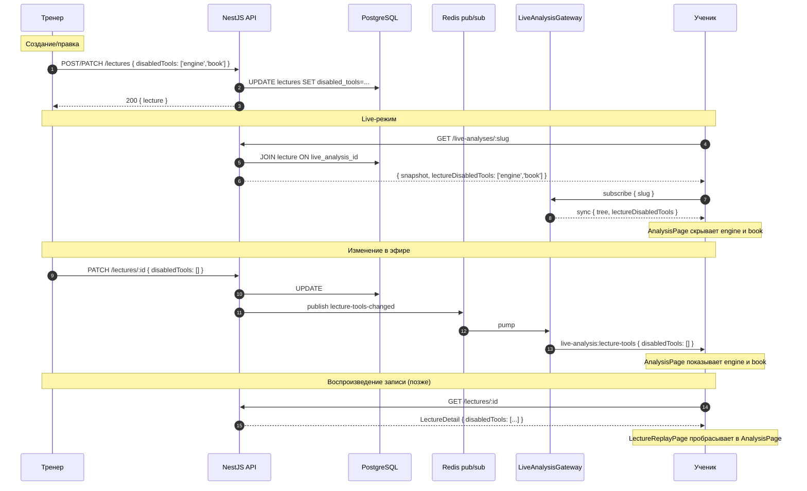

# ADR-117: Настройки доступных ученикам инструментов анализа на лекции (live + replay)

**Статус:** Принято к реализации (после ревью координатором)
**Дата:** 2026-06-08
**Задача:** KS-3895
**Связанные ADR:** [ADR-110](./110-live-analysis-broadcast.md), [ADR-111](./111-live-analysis-full-broadcast.md), [ADR-112](./112-live-analysis-per-analysis-binding.md), [ADR-113](./113-coach-page.md), [ADR-115](./115-lecture-audio-recording.md), [ADR-116](./116-lecture-audio-p2p.md)

## 1. Контекст

### 1.1 Что уже есть

- **Lecture / LectureRecording** (ADR-113, миграции KS-3783/KS-3790).
  `Lecture` — зонтичная сущность со статусами `scheduled | live | recorded | cancelled`,
  визибилити `public | unlisted` (см. `packages/db/prisma/schema.prisma` строки 2178–2227).
  `LectureRecording` — лента событий доски (`move | state-patch | reset | closed`) с временной
  меткой `t` (мс от старта). Связь 1:1 с лекцией.
- **LiveAnalysis** (ADR-110/111/112) — транспорт ходов и state-patch'ей через Socket.IO
  namespace `/live-analysis`. К лекции привязан опционально через `Lecture.liveAnalysisId`
  (partial UNIQUE `WHERE status='live'`). Snapshot `LiveAnalysisSyncSnapshot` уже несёт
  поля `tree`, `currentGlobalIndex` (KS-3780).
- **AnalysisPage** — единый компонент окна анализа (`apps/web/src/pages/AnalysisPage.tsx`),
  через который рендерится и обычная страница `/analysis/:id`, и зрительский live
  (`LiveAnalysisViewerPage`, проп `liveSession={mode:'viewer'}`), и воспроизведение
  записи (`LectureReplayPage`, проп `replay`). Owner-only UI подавляется флагом
  `publicMode` (для зрителя/replay — true).
- **AnalysisSidebar** (`apps/web/src/pages/analysis/AnalysisSidebar.tsx`) собирает 4 крупных
  collapsible-блока: engine (Stockfish + Maia), ai (AiPositionCommentPanel), book
  (ArchiveTreePanel = база партий) и moves (ReviewMoveList + MaterialBalance). Плюс
  меню `AnalysisActionsMenu` (`apps/web/src/components/analysis/AnalysisActionsMenu.tsx`)
  с действиями типа «Разобрать партию», «Создать задачу», «Найти партии с позицией».

### 1.2 Что нужно

Тренер ведёт лекцию для учеников в режиме онлайн — ученики смотрят разбор в той же
оболочке анализа, что и обычный анализ. У оболочки есть «помощники», которые в учебном
сценарии могут спойлерить вывод и мешать ученикам думать самостоятельно: движок,
база партий, AI-комментарии. Требуется:

1. **Тренер выбирает** при создании / в процессе лекции, какие из инструментов
   доступны ученикам.
2. **По умолчанию — всё доступно.** Тренер целенаправленно отключает «помощников».
3. **Ограничения переживают запись.** Ученик, открывая запись лекции через час или
   месяц, видит ту же конфигурацию инструментов.
4. **Ограничения применяются только к ученикам.** Тренер у себя видит всё — иначе
   он не сможет вести лекцию.

### 1.3 Ограничения

- Один разработчик, минимизируем кол-во движущихся частей.
- Состояние «доступности инструмента» должно быть выражено через данные, а не через
  per-устройство флаги — иначе на двух вкладках одного ученика поведение разойдётся.
- Запрет должен быть на UI-уровне (не показывать), не на backend-уровне. Технически
  ученик в браузере мог бы дёргать Stockfish сам (WASM в его же процессе), но цель не
  «защитить» доступ криптографически, а убрать соблазн.

### 1.4 Что НЕ в скоупе ADR

- Лимиты для конкретных учеников (всем — одинаково). Per-user разрешения — отдельный
  ADR при появлении ученических аккаунтов с ролями.
- Отключение чата / реакций — отдельный пласт (на момент ADR-113 чата ученикам нет).
- Защита от reverse-engineering: если ученик откроет DevTools и подменит флаг — это
  его правый клик. Не миссия настроек.

## 2. Решение

### 2.1 Модель данных: одно поле на Lecture

**Решение:** добавить в `Lecture` массив отключённых инструментов:

```prisma
model Lecture {
  // ... существующие поля
  /// KS-3895 / ADR-117. Список инструментов окна анализа, которые
  /// скрыты у учеников/зрителей лекции. Пустой массив — поведение
  /// по умолчанию (всё доступно). Тренер у себя всегда видит всё.
  /// Применяется к live-просмотру и к воспроизведению записи.
  disabledTools String[] @default([]) @map("disabled_tools")
}
```

Тип — Postgres `text[]` с прикладным enum-перечислением на стороне приложения (не
БД-enum: расширение в будущем без миграции, отсутствующие значения молча игнорируются
старыми клиентами).

**Почему `text[]`, а не bool-флаги (`engineHidden: boolean`, `bookHidden: boolean`).**
Каждое добавление нового инструмента — это миграция и расширение row width. Массив —
schemaless по составу при стабильной общей форме поля. Цена — нельзя сделать
`WHERE engineHidden = true`-индекс, но такая выборка нам не нужна (это не фильтр для
списочных эндпоинтов, а атрибут конкретной лекции, читаемый только при просмотре).

**Почему НЕ отдельная таблица `LectureToolsConfig`** (1:1 с `Lecture`). Сущность
живёт ровно столько, сколько живёт лекция, и не используется ни в каких иных контекстах.
JOIN'ы и второй коммит при создании — лишний overhead за нулевую пользу. Если в будущем
понадобятся пер-ученик override'ы или версии настроек — отдельная таблица появится
тогда же отдельным ADR.

**Почему НЕ JSON (`disabledTools: Json`)**. На текущем размере поля плоский `text[]`
проще: нет вложенной структуры, валидация — простой `IsIn`-чек каждого значения.
JSON откладываем до момента, когда понадобятся параметризованные настройки
(`{engine: {hidden: true, hideEvalOnly: false}}`).

### 2.2 Enum отключаемых инструментов

```ts
// packages/shared/src/types/api-contracts.ts (новый блок)

/**
 * KS-3895 / ADR-117. Перечисление инструментов окна анализа, которые
 * тренер может скрыть у учеников лекции. Дефолт — всё разрешено
 * (пустой массив на Lecture.disabledTools).
 */
export type LectureDisabledTool =
  | 'engine'         // Stockfish (PV-линии, eval, depth/nps). И Maia-сортировка.
  | 'book'           // ArchiveTreePanel — база партий из архива.
  | 'ai_comment'     // AiPositionCommentPanel — AI-оценка позиции словами.
  | 'analyze_game'   // Пункт меню «Разобрать партию» (batch-NAG через SF+Maia).
  | 'generate_puzzle'// Пункт меню «Создать задачу из позиции».
  | 'find_by_position'; // Пункт меню «Найти партии с этой позицией» в архиве.

export const ALL_LECTURE_DISABLED_TOOLS: readonly LectureDisabledTool[] = [
  'engine', 'book', 'ai_comment', 'analyze_game', 'generate_puzzle', 'find_by_position',
];
```

Обоснование приоритетов (как просит KS-3895):

| Инструмент | Приоритет | Почему отключаемо |
| --- | --- | --- |
| `engine` | **MUST** | Прямой спойлер: показывает лучший ход и оценку. Главный таргет ученой лекции. |
| `book` | **MUST** | Раскрывает теорию: ученик видит частоты ходов мастеров и не думает сам. |
| `ai_comment` | **SHOULD** | LLM пишет план словами — тренер сам это объясняет, дублирование портит фокус. |
| `analyze_game` | **SHOULD** | Запускает batch-NAG: ученик одним кликом получает разметку всей партии, обходит запрет на `engine`. |
| `generate_puzzle` | **SHOULD** | Создаёт задачу из текущей позиции и подсказывает «здесь есть тактика». |
| `find_by_position` | **MAY** | Перенаправляет в архив: даёт обход `book` через прямой переход. Отключать в строгих лекциях. |

**НЕ отключаемое:**
- **Moves panel** (`ReviewMoveList`) — это собственно дерево хода тренера, скрыть = убить лекцию.
- **MaterialBalance** — нейтральная справка о материале на доске, не спойлерит.
- **Навигация** (стрелки, клик по ходу) — без неё ученик не может перейти между ходами тренера.
- **Set Position / Game Info / Share / Export PGN** — owner-only пункты, гейтятся через `publicMode` (зрителю уже не видны).

`eval_graph` — оценочный график — в проекте на момент ADR отсутствует. Когда появится
(если), добавляется как новое значение enum'а без миграции.

### 2.3 Поток применения

#### 2.3.1 Тренер задаёт настройки

- **Создание лекции** (`POST /lectures`): новое опциональное поле `disabledTools: LectureDisabledTool[]`
  в `CreateLectureDto`. Дефолт — `[]`.
- **Правка** (`PATCH /lectures/:id`): добавляется поле `disabledTools` в `UpdateLectureDto`.
  Сейчас PATCH разрешён только для `scheduled`. **Расширяем:** правка `disabledTools`
  разрешена в **любом статусе** (включая `live` и `recorded`), правка остальных полей
  по-прежнему только в `scheduled`. Это даёт UX «передумал ограничения — поправь не
  пересоздавая запись». На `cancelled` правка не имеет смысла, но и не вредна — пропустим.

#### 2.3.2 Передача live-зрителям

Snapshot `LiveAnalysisResponse` (REST-mount) и `LiveAnalysisSyncSnapshot` (WS) расширяются
опциональным полем `lectureDisabledTools?: LectureDisabledTool[]`. Backend заполняет его
если у `LiveAnalysis` есть привязанная лекция (`Lecture.liveAnalysisId === this.id WHERE
status='live'`) и `lecture.disabledTools.length > 0`. Иначе поле отсутствует.

**Изменение во время лекции.** Когда тренер дёргает `PATCH /lectures/:id { disabledTools }`,
`LecturesService.update` после успешного UPDATE проверяет: у лекции есть
`liveAnalysisId` И статус `live` → публикует через Redis pub/sub событие
`lecture-tools-changed`:

```ts
type LectureToolsChangedEvent = {
  slug: string;          // LiveAnalysis.slug — комната подписки
  lectureId: string;
  disabledTools: LectureDisabledTool[];
};
```

`LiveAnalysisGateway` подписан на этот канал и рассылает в комнату `room:<slug>`
WS-событие `live-analysis:lecture-tools` (имя в `LiveAnalysisEvents`).

Клиент-зритель в `LiveAnalysisViewerPage` слушает событие через хук
`useLectureToolsPolicy(slug)` (новый), обновляет state. AnalysisPage получает обновлённое
значение через тот же `liveSession`-канал и пере-рендерит сайдбар.

**Альтернатива «нельзя менять live»** — не делаем. Цена реализации эмита события мала
(один pub/sub + один WS-payload), а UX «тренер может в моменте включить движок, когда
ученики пришли к ответу» — реальный сценарий, его в ADR описание просит явно («можно ли
менять во время лекции» — `описание задачи §5`).

#### 2.3.3 Передача при воспроизведении записи

`GET /lectures/:id` уже отдаёт `LectureDetail`. Добавляем поле `disabledTools` в
`LectureSummary`/`LectureDetail`. Контракт shared:

```ts
export interface LectureSummary {
  // ... существующие поля
  /** KS-3895 / ADR-117. Дефолт — пустой массив (всё доступно). */
  disabledTools: LectureDisabledTool[];
}
```

`LectureReplayPage` читает `lecture.disabledTools` из `GET /lectures/:id` (этот вызов
уже делается, см. `LectureReplayPage.tsx:99`) и передаёт его в `AnalysisPage`
тем же каналом, что и `liveSession`. Конкретно — расширяем существующий проп
`replay: ReplayLectureProps` полем `disabledTools: LectureDisabledTool[]`.

**Не дублируем в `LectureRecording`.** `Lecture` и `LectureRecording` связаны 1:1 через
FK Cascade, источник правды для «настройки лекции» — сама `Lecture`. Если тренер позже
решит ослабить ограничения (например, через год показывает ту же запись более опытным
ученикам и хочет включить движок) — он дёргает `PATCH` на `Lecture` и все, кто открывают
запись после этого, видят новую политику. Это **осознанный mutability-выбор:** «снимок
настроек на момент закрытия» нам сейчас не нужен и стоит лишнего поля. Если позже
прилетит требование «зафиксировать настройки на момент записи и не давать их менять» —
отдельная задача добавит snapshot в `LectureRecording` (поле `LectureRecording.disabledToolsSnapshot`).

#### 2.3.4 Диаграмма



### 2.4 UI настроек у тренера (концепт)

**Где показывается.**

1. **При создании лекции** — модалка `CreateLectureModal`
   (`apps/web/src/components/analysis/CreateLectureModal.tsx`) получает секцию
   «Доступ учеников к инструментам» с чекбоксами:

   ```
   ☑ Движок (Stockfish)            ← по умолчанию доступен
   ☑ База партий                   ← по умолчанию доступна
   ☑ AI-комментарий позиции
   ☐ Разобрать партию (меню)       ← пример скрытого
   ☐ Создать задачу (меню)
   ☐ Найти партии с позицией (меню)
   ```

   UI-семантика **«разрешено / запрещено»** (галочка = разрешено), backend получает
   инверсию (`disabledTools = ALL.filter(t => !checked.includes(t))`). Это требование
   пользователя из ADR-задания: «по умолчанию все доступно».

2. **Во время лекции и после записи** — кнопка/пункт «Настройки лекции для учеников»
   в `AnalysisActionsMenu` (видна только владельцу, не подавляется `publicMode` для
   него). Открывает ту же модалку, что и при создании, с предзаполненным состоянием.
   PATCH идёт асинхронно, успех — toast «Настройки сохранены», ошибка — оставляем
   старое значение.

**Дефолт.** При создании все чекбоксы стоят (всё разрешено), `disabledTools=[]`.

**Доступ к редактированию.**

| Статус лекции | Можно править disabledTools? |
| --- | --- |
| `scheduled` | Да |
| `live` | Да (важно: правки видны зрителям в реальном времени) |
| `recorded` | Да (правки видны при следующем открытии записи) |
| `cancelled` | Технически да (нет вреда), UI не предлагает |

### 2.5 Применение на стороне клиента (AnalysisPage)

`AnalysisPage` получает новый объединённый проп:

```ts
interface AnalysisPageProps {
  // ... существующие
  /**
   * KS-3895 / ADR-117. Политика инструментов для зрителя/ученика.
   *   - undefined → дефолт: всё доступно.
   *   - массив → перечисленные инструменты скрыты у того, кто смотрит.
   *
   * Источник зависит от mode'а:
   *   - viewer-live: lectureDisabledTools из useLectureToolsPolicy(slug)
   *     или из начального LiveAnalysisResponse.
   *   - replay: lecture.disabledTools из LectureDetail.
   *   - обычный анализ: undefined.
   *
   * Применяется ТОЛЬКО когда publicMode=true. У владельца на собственной
   * странице (publicMode=false) — игнорируется, тренер видит всё.
   */
  studentToolsPolicy?: LectureDisabledTool[];
}
```

Внутри AnalysisPage прокидывается в `AnalysisSidebar` несколько производных:

- `showEnginePanel = !studentToolsPolicy?.includes('engine') || !publicMode`
- `showAiPanel = !studentToolsPolicy?.includes('ai_comment') || !publicMode`
- `showBookPanel = !studentToolsPolicy?.includes('book') || !publicMode`

`AnalysisSidebar` принимает эти три флага. Если `false` — соответствующий
collapsible-блок и mobile-вкладка не рендерятся (и не подгружают связанные хуки —
важно: `useStockfish` и `useAiPositionComment` дёргаются на уровне `AnalysisPage`,
их нужно гейтить тем же `showEnginePanel` / `showAiPanel`-флагом, чтобы ученик не
тащил wasm-движок впустую).

Для `AnalysisActionsMenu` — добавляется фильтр в `buildAnalysisActionsItems`:

```ts
function buildAnalysisActionsItems(ctx) {
  const hidden = ctx.studentToolsPolicy ?? [];
  const items: AnalysisActionItem[] = [];
  // ... вставка пунктов как сейчас
  return items.filter(i => !shouldHideItem(i.id, hidden, ctx.publicMode));
}
```

`shouldHideItem`-маппинг:
- `analyze-game` ← `analyze_game`
- `generate-puzzle` ← `generate_puzzle`
- `find-by-position` ← `find_by_position`

### 2.6 Влияние на схему БД

Одна миграция: `ALTER TABLE lectures ADD COLUMN disabled_tools TEXT[] NOT NULL DEFAULT '{}'`.
Откат — `DROP COLUMN`. Дефолт безопасен для существующих лекций (поведение не меняется).

```prisma
model Lecture {
  // ... существующие поля без изменений
  disabledTools String[] @default([]) @map("disabled_tools")
}
```

### 2.7 REST-контракт (черновик)

- `POST /lectures` body: добавлено опциональное `disabledTools: LectureDisabledTool[]`.
  Валидация — `@IsArray() @IsIn(ALL_LECTURE_DISABLED_TOOLS, {each:true})`.
- `PATCH /lectures/:id` body: добавлено `disabledTools`. Серверная логика — см. §2.3.1
  («правка disabledTools разрешена в любом статусе»).
- `GET /lectures/:id` response: `LectureDetail.disabledTools: string[]` (всегда заполнен,
  для существующих записей до миграции дефолт `[]`).
- `GET /coaches/:username/lectures` response: `LectureSummary.disabledTools: string[]`
  (нужен ли список — спорно, на UI списка не светим; но контракт един для двух эндпоинтов
  как сейчас).
- `GET /live-analyses/:slug` response: опциональное `lectureDisabledTools?: LectureDisabledTool[]`.
  Backend заполняет только когда есть привязка к live-лекции.

### 2.8 WS-контракт

- Snapshot `LiveAnalysisSyncSnapshot` — добавлено опциональное
  `lectureDisabledTools?: LectureDisabledTool[]`.
- Новое событие `live-analysis:lecture-tools` с payload
  `{ slug, disabledTools: LectureDisabledTool[] }`. Эмит — на каждый PATCH `disabledTools`
  для live-лекции. Прав на эмит требовать не нужно (это server-side push), клиенты
  никогда не шлют это событие в обратку.

Зарегистрировать в `LiveAnalysisEvents`:

```ts
export const LiveAnalysisEvents = {
  // ... существующие
  LECTURE_TOOLS: 'live-analysis:lecture-tools',
} as const;
```

## 3. Последствия

### 3.1 Backend (NestJS, `apps/api`)

- Миграция Prisma: `lectures.disabled_tools text[] NOT NULL DEFAULT '{}'`.
- `CreateLectureDto` / `UpdateLectureDto` — добавить поле `disabledTools` с
  `IsArray`/`IsIn`-валидацией.
- `LecturesService.create` / `LecturesService.update`:
  - принять `disabledTools`, записать в БД;
  - в `update`: снять ограничение «только scheduled» **только** для случая, когда
    передан **только** `disabledTools` (или вместе с разрешёнными в любом статусе
    полями). Простейшая реализация: для каждого поля свой статусный гейт. Для
    `disabledTools` — пропускаем все статусы.
  - после успешного UPDATE при `status='live'` — публикация Redis-события
    `lecture-tools-changed`.
- `LecturesService.getById` — возвращать `disabledTools` (по умолчанию prisma уже даёт,
  правки маппинга `withLiveAnalysisBinding` тривиальны).
- `LiveAnalysisService.getBySlug` (или wherever формируется `LiveAnalysisResponse`):
  при наличии активной лекции под этой `LiveAnalysis` подмешать `lectureDisabledTools`.
- `LiveAnalysisGateway`:
  - подписаться на Redis-канал `lecture-tools-changed`;
  - на событие — `server.to('room:'+slug).emit('live-analysis:lecture-tools', {slug, disabledTools})`;
  - при `subscribe`-handshake — включить `lectureDisabledTools` в snapshot, если есть.

### 3.2 Frontend (`apps/web`)

- Маппинг `studentToolsPolicy → видимость блоков` в `AnalysisPage`:
  - `showEnginePanel`, `showAiPanel`, `showBookPanel` — производные booleans.
  - Гейт хуков `useStockfish`, `useAiPositionComment` (не загружать wasm/не дёргать LLM
    у ученика, если инструмент скрыт).
- `AnalysisSidebar` принимает три новых проп-флага; collapsible-блоки и mobile-вкладки
  условно рендерятся.
- `AnalysisActionsMenu` — фильтрация пунктов через `studentToolsPolicy`.
- `LectureReplayPage` — прокинуть `lecture.disabledTools` в `AnalysisPage` через
  `replay.disabledTools` (новое поле в `ReplayLectureProps`).
- `LiveAnalysisViewerPage` — прокинуть начальное значение `lectureDisabledTools` из
  REST-snapshot + новый хук `useLectureToolsPolicy(slug)` для слушания WS-обновлений.
- `CreateLectureModal` — UI-секция чекбоксов «Доступ учеников».
- `AnalysisActionsMenu` (owner-side) — пункт «Настройки лекции для учеников», открывает
  ту же модалку.
- Хук `useLectureToolsPolicy(slug)` — подписка на WS-событие `live-analysis:lecture-tools`,
  начальное значение из REST-snapshot, возврат текущей политики + setter (используется
  для оптимистичного обновления когда тренер сам кликнул чекбокс).

### 3.3 Shared types (`packages/shared/src/types`)

- `LectureDisabledTool` enum + `ALL_LECTURE_DISABLED_TOOLS`-константа.
- `LectureSummary.disabledTools: LectureDisabledTool[]`.
- `LectureDetail.disabledTools` (наследуется).
- `LiveAnalysisResponse.lectureDisabledTools?: LectureDisabledTool[]`.
- `LiveAnalysisSyncSnapshot.lectureDisabledTools?: LectureDisabledTool[]`.
- `LiveAnalysisEvents.LECTURE_TOOLS = 'live-analysis:lecture-tools'`.
- DTO для WS-payload `LectureToolsChangedEvent`.

### 3.4 DevOps

- Миграция Prisma — стандартная, без spec'ов.
- Никаких новых сервисов / переменных окружения.
- Redis pub/sub-канал `lecture-tools-changed` — добавляется как ещё один канал в
  существующий `RedisService`.

## 4. Альтернативы

### 4.1 Отдельная таблица `LectureToolsConfig` (1:1 с Lecture)

Pro: типизированно, расширяемо параметрами вроде `{engine: {hidden:true, hideOnlyEval:false}}`.
Contra: дополнительная сущность ради одного поля. Откладываем до момента, когда настройка
вырастет в структуру.

### 4.2 Snapshot настроек в `LectureRecording`

Pro: запись становится «архивно-immutable», тренер не может пост-фактум изменить
впечатление от ранее опубликованной лекции.
Contra: лишает гибкости (см. §2.3.3 — реальный сценарий «передумал»). Возможно введение
позже, без потери совместимости — настройки сейчас в одном месте, в БД (`Lecture.disabledTools`),
дублирование добавить — миграция без миграции данных.

### 4.3 Отдельные boolean-поля (`engineHidden`, `bookHidden`, ...)

Pro: типизировано в схеме, можно индексировать.
Contra: каждое новое значение — миграция. Прикладные плюсы (индексы) нам не нужны.

### 4.4 JSON-поле `toolsConfig: Json`

Pro: расширяемо без миграции, можно хранить параметры.
Contra: на текущем размере — over-engineering. Заменим на JSON, как только потребуется
параметризация.

### 4.5 Per-ученик настройки (для каждого зрителя свои ограничения)

Pro: продвинутый UX (одни ученики ещё думают, другим уже разрешено).
Contra: требует ученических аккаунтов с ролями, которых сейчас нет (ученик = любой
посетитель ссылки). Отдельный пласт авторизации. Откладываем.

### 4.6 «Слабая» защита: backend режет ответы движка для ученика

Сценарий: ученик в браузере дёрнул бы `/api/analysis/engine?fen=...` — backend смотрит на
лекцию и возвращает 403. Но в нашей архитектуре движок — клиентский (Stockfish WASM в
браузере). Backend в analyzed-цепи не участвует. Делать proxy ради учёного запрета —
ломать архитектуру движка. UI-level hide — достаточен (см. §1.3, цель — убрать соблазн,
а не криптографически защищать).

## 5. План внедрения

### Эпик A — Backend (KS-3895-A)

- **KS-A01 [backend]** — Prisma миграция: добавить `lectures.disabled_tools text[] NOT NULL DEFAULT '{}'`.
- **KS-A02 [backend]** — `CreateLectureDto` / `UpdateLectureDto`: поле `disabledTools`
  с `@IsArray() @IsIn(ALL_LECTURE_DISABLED_TOOLS, {each:true})`. Опционально.
- **KS-A03 [backend]** — `LecturesService.create` / `update`:
  - принять и записать `disabledTools`;
  - в `update`: разрешить правку `disabledTools` в любом статусе (статусный гейт
    остальных полей оставить).
- **KS-A04 [backend]** — `LecturesService.update` после успешного UPDATE при
  `status='live'`: publish `lecture-tools-changed` через `RedisService`.
- **KS-A05 [backend]** — `LiveAnalysisGateway`: подписка на `lecture-tools-changed`,
  ретрансляция в комнату через `live-analysis:lecture-tools`. Подключение
  `lectureDisabledTools` в начальный sync-snapshot, если есть привязанная live-лекция.
- **KS-A06 [backend]** — `LiveAnalysisService.getBySlug` (или эквивалент): подмешать
  `lectureDisabledTools` в `LiveAnalysisResponse` при наличии живой привязанной лекции.
- **KS-A07 [backend]** — unit-тесты: валидация enum'а, перевод PATCH-семантики (поле
  disabledTools правится в live/recorded; остальные — только в scheduled), pub/sub событие.

### Эпик B — Frontend владельца (KS-3895-B)

- **KS-B01 [frontend]** — UI-секция «Доступ учеников» в `CreateLectureModal`. Чекбоксы
  «разрешено/запрещено» (UI-инверсия от backend-enum'а).
- **KS-B02 [frontend]** — Пункт «Настройки лекции для учеников» в `AnalysisActionsMenu`
  (только для владельца, не подавляется `publicMode`). Открывает ту же модалку (или
  её compact-форму), PATCH `/lectures/:id`. Toast на успех/ошибку.

### Эпик C — Frontend зрителя/ученика (KS-3895-C)

- **KS-C01 [frontend]** — Хук `useLectureToolsPolicy(slug)`: REST-mount читает
  `lectureDisabledTools` из `LiveAnalysisResponse`, WS-listener обновляет на событие
  `live-analysis:lecture-tools`. Возвращает `policy: LectureDisabledTool[]`.
- **KS-C02 [frontend]** — `LiveAnalysisViewerPage` пробрасывает `policy` в `AnalysisPage`
  через `studentToolsPolicy`.
- **KS-C03 [frontend]** — `LectureReplayPage` пробрасывает `lecture.disabledTools` в
  `AnalysisPage` через `replay.disabledTools` → `studentToolsPolicy`.
- **KS-C04 [frontend]** — `AnalysisPage`: вывести производные `showEnginePanel`,
  `showAiPanel`, `showBookPanel` и гейтить хуки `useStockfish` / `useAiPositionComment`.
- **KS-C05 [frontend]** — `AnalysisSidebar`: принять три новых проп-флага, скрывать
  collapsible-блоки и mobile-вкладки. Если активная mobile-вкладка стала скрытой —
  переключить на первую видимую (`moves`).
- **KS-C06 [frontend]** — `AnalysisActionsMenu`: фильтрация пунктов через `studentToolsPolicy`
  (для `analyze-game`, `generate-puzzle`, `find-by-position`).

### Эпик D — Shared types и i18n (KS-3895-D)

- **KS-D01 [backend]** — добавить `LectureDisabledTool`, `ALL_LECTURE_DISABLED_TOOLS`,
  расширить `LectureSummary` / `LectureDetail` / `LiveAnalysisResponse` /
  `LiveAnalysisSyncSnapshot` в `packages/shared/src/types`.
- **KS-D02 [frontend]** — переводы в `apps/web/src/locales/{en,ru}.json`: названия
  инструментов в UI чекбоксов («Engine», «Database», «AI comment», ...), заголовок
  модалки, toast'ы.

### Эпик E — QA

- **KS-E01 [qa]** — Создание лекции с `disabledTools=['engine','book']`. Открыть
  её в новой вкладке как зритель — убедиться: блок «Stockfish» и «База партий» скрыты.
  Тренер на своей вкладке видит всё.
- **KS-E02 [qa]** — В эфире тренер дёргает чекбокс «Запретить AI-комментарий» —
  у зрителя в той же вкладке через ≤1с панель AI исчезает.
- **KS-E03 [qa]** — После закрытия лекции открыть recording, ученический режим: те же
  ограничения применены.
- **KS-E04 [qa]** — Тренер меняет `disabledTools` уже после `recorded`-статуса; повторное
  открытие записи показывает обновлённые ограничения.
- **KS-E05 [qa]** — Регрессия: лекция без `disabledTools` (старая запись или дефолт) —
  все инструменты доступны как раньше.

### Карта зависимостей

- D (Shared types) — стартует первым / параллельно с A.
- A (Backend) ⟶ C (Frontend зрителя): нужны REST/WS-поля.
- A ⟶ B (Frontend владельца): нужен PATCH.
- C, B параллельны после A/D.
- E (QA) — после B и C.

## 6. Риски и подводные камни

1. **Старый клиент не знает про новые WS-события.** Не критично: `live-analysis:lecture-tools`
   приходит и игнорируется (нет listener'а), снапшот при первом mount-fetch'е содержит
   `lectureDisabledTools` в REST-ответе — ученики на старом клиенте получат initial
   state корректно, но не отреагируют на in-flight изменения. Деградация — терпимая.

2. **Гейт хуков `useStockfish` / `useAiPositionComment`.** Если просто скрыть UI, но
   оставить хуки активными — у ученика впустую крутится Stockfish WASM и тратится
   LLM-квота (для `aiPositionComment` это backend-вызов). Гейтить нужно на уровне
   `AnalysisPage`-инициализации, не только в `AnalysisSidebar`. Покрыто KS-C04.

3. **`AnalysisActionsMenu` — какие пункты скрывать VS делать disabled+tooltip.**
   В нашем UX-стиле (ADR-087 §8 вариант Б) гость видит auth-only пункты `disabled+
   hint`-ом. Здесь сценарий другой: ученик не может «авторизоваться чтобы получить
   доступ», ограничение тренерское. Решение — **скрыть полностью** (без `disabled`-
   placeholder'а), чтобы UI не намекал на скрытую функциональность.

4. **Гонка PATCH `disabledTools` + закрытие лекции.** `LecturesService.update` сейчас
   разрешает правку только `scheduled`. После расширения на `live/recorded` есть гонка:
   тренер дёрнул PATCH, в это же время cleanup-job закрыл лекцию (`status: live → recorded`).
   Обе записи безопасны: настройки записываются вне зависимости от перехода статуса,
   событие `lecture-tools-changed` отправляется только если `status='live'` (после
   перехода в recorded — gateway уже не в комнате, нет получателей). Race-free.

5. **Мобильные вкладки: активная вкладка стала скрытой.** Например, ученик стоит на
   вкладке «engine», тренер скрывает движок. Если просто перестать рендерить — ученик
   видит пустую панель. Покрыто KS-C05: на изменение скрытых инструментов проверять
   `mobileTab` и переключать на первую видимую (приоритет: `moves` → `tree` → `ai` →
   `engine`).

6. **Хранилище переводов** строк инструментов. Сохранять стабильные ключи enum'а
   (`engine`, `book`, ...) — не локализованные. UI-метки берутся через i18next.
   Покрыто KS-D02.

7. **Скрыть Maia-кнопку или нет.** Maia — это не отдельный инструмент, а режим
   сортировки PV-линий внутри engine-блока. Скрываем вместе с `engine`. Если в
   будущем понадобится «engine скрыт, но Maia-вероятности всё ещё доступны» —
   расширим enum (`engine_pv` / `engine_maia`).

## 7. Связь с соседними ADR

- **ADR-110/111/112** — транспорт остаётся как есть; добавляем один event-канал
  и одно опциональное поле в `LiveAnalysisResponse` / `SyncSnapshot`. Не пересекается
  с другим WS-payload'ом.
- **ADR-113** — `Lecture` модель из этого ADR — основа; здесь только расширяем её
  одним полем.
- **ADR-115/116** — параллельный аудио-канал. Никак не конфликтует: настройки
  инструментов — про доску/сайдбар, аудио — отдельная инфраструктура.
- **ADR-087** — UI-меню пунктов; здесь применяется тот же `AnalysisActionsMenu`, но
  отключение — **полное скрытие** (а не disabled-tooltip как для гостя). Семантически
  это «инструмент не для тебя», не «зарегистрируйся и получишь».
