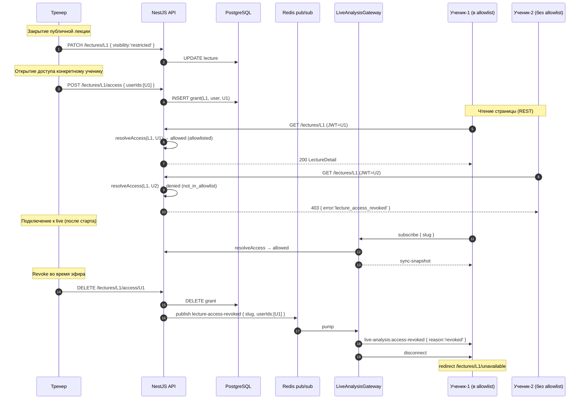

# ADR-118: Разделение доступа к лекциям — публичные / по ссылке / приватные с allowlist'ом учеников

**Статус:** Принято к реализации (после ревью координатором)
**Дата:** 2026-06-08
**Задача:** KS-3929
**Связанные ADR:** [ADR-110](./110-live-analysis-broadcast.md), [ADR-112](./112-live-analysis-per-analysis-binding.md), [ADR-113](./113-coach-page.md), [ADR-116](./116-lecture-audio-p2p.md), [ADR-117](./117-lecture-student-tools-policy.md), [ADR-119](./119-lecture-ui-coach-student.md)

## 1. Контекст

### 1.1 Что уже есть

- **Lecture** (ADR-113, `packages/db/prisma/schema.prisma:2178–2235`) — зонтичная сущность
  с полями `ownerId`, `status (scheduled|live|recorded|cancelled)` и
  `visibility (public|unlisted)`. `public` — лекция отображается в публичном списке
  тренера и индексируется на странице `/coach/:username`. `unlisted` — открыта по
  прямой ссылке, в публичных списках не светится.
- **REST** (`apps/api/src/lectures/lectures.controller.ts`):
  - `GET /lectures/:id` — публичная ручка без guard'а, отдаёт `public + unlisted`.
  - `GET /coaches/:username/lectures` — публичная, фильтрует только `public`.
  - Owner-mutations (`POST`, `PATCH`, `DELETE`, `start`, `cancel`, `force-end`)
    защищены `JwtAuthGuard` + проверкой `ownerId === req.user.id`.
- **Live-analysis** (ADR-110/112, namespace `/live-analysis`) — JWT опционален;
  любой посетитель ссылки `/live/:slug` подключается зрителем (включая анонимных).
- **WebRTC mesh** (ADR-116) — P2P-сигналинг в том же namespace, hard cap 15 зрителей.
  Аудио-чанки лежат в S3 `kingside-lectures`, доставка через CloudFront
  `media.kingside.site`. Для `public` — open URL с `Cache-Control: immutable`, для
  `unlisted` — signed URL c TTL 24 ч (выдаётся в `GET /lectures/:id` ответе).
- **ADR-117** — `Lecture.disabledTools: text[]` — настройка набора инструментов
  анализа для зрителей. Передаётся в snapshot и через WS-канал
  `live-analysis:lecture-tools`.

### 1.2 Чего нет

- **Нет связки «тренер ↔ ученик»** в БД. Нет таблиц `CoachStudent`, `StudentGroup`,
  `CourseEnrollment`. Тренер сегодня — любой пользователь, у кого есть хотя бы
  одна `public` лекция или публичный курс. Ученик — анонимный или авторизованный
  посетитель ссылки.
- **Нет ролей** в `User` (нет колонки `role: 'coach'|'student'`).
- **Нет таблицы `Course` с участниками.** Сущность `Course` упомянута в ADR-113 как
  будущая, в схеме на момент ADR-118 — только `Lecture`.

### 1.3 Что нужно

Тренер должен иметь возможность:

1. Создать лекцию, доступную только перечисленным ученикам.
2. Уже существующую публичную лекцию закрыть (сменить visibility, задать allowlist).
3. Добавить ученика в allowlist уже идущей живой лекции (без её перезапуска).
4. Удалить ученика из allowlist в любой момент — текущий просмотр должен прекращаться
   у этого ученика (для live) либо при следующем открытии (для replay).

Ученик должен видеть в своём списке только доступные ему лекции. Старая ссылка на
закрытую лекцию — дружелюбная страница «лекция больше не доступна», не 404.

### 1.4 Ограничения

- **Один разработчик, итеративная поставка.** Минимизируем сущности; пер-ученик
  ограничения добавим, групповые (курс/группа) — оставим задел в схеме без
  реализации в первой итерации.
- **Совместимость со старыми ссылками.** Существующие `public` лекции продолжают
  работать без изменений; миграция не трогает их `visibility`. Опрос пользователей
  «давайте сменим вашу лекцию на restricted» не проводится.
- **Защита — данными, не криптографией.** Backend проверяет JWT и allowlist;
  если ученик откроет DevTools и подменит JS-флаги — это его правый клик, цель —
  убрать саму возможность открыть страницу без авторизации.
- **Никаких новых сервисов.** Используем существующий `LecturesService`,
  `LiveAnalysisGateway`, `RedisService`.

### 1.5 Что НЕ в скоупе ADR-118

- Уведомления (push/e-mail) о новой доступной лекции — отдельная задача.
- Аналитика посещаемости (кто и сколько смотрел) — отдельная задача.
- Платный доступ (purchase per lecture) — отдельная задача.
- Курсы и enrollment — задел в схеме (см. §2.2), реализация — отдельным ADR.

## 2. Решение

### 2.1 Модель видимости: три уровня

Расширяем enum `LectureVisibility` до **трёх** значений:

| Значение | Что значит | Кто видит ссылку | Кто открывает страницу |
| --- | --- | --- | --- |
| `public` | Открытая лекция (как сейчас) | Все: индексируется на `/coach/:username`, в публичных подборках | Любой посетитель |
| `unlisted` | По прямой ссылке (как сейчас) | Только у кого есть URL; в публичных списках не светится | Любой посетитель |
| `restricted` | **Новое.** По ссылке + allowlist | Только владелец и allowlist-ученики (в своих списках) | Только владелец + allowlist (требует JWT) |

`public` и `unlisted` — поведение сохранено 1-в-1. Новый уровень — `restricted`.

**Почему именно три уровня, а не два (`public` + `restricted`).** `unlisted` — это
реальный сценарий: тренер хочет дать ссылку коллеге или гостю без аккаунта на
один просмотр, не индексируя лекцию у себя на странице. Удалять этот режим = ломать
существующий UX и принуждать всех «гостей» регистрироваться. Сохраняем.

**Почему не делать `restricted` подвариантом `public`.** Visibility — это
«широта обнаружения» (где видна ссылка), а allowlist — «жёсткий gate доступа».
Семантика разная: лекция может быть `restricted` (закрытая для allowlist), и тогда
вопрос «индексировать ли её на странице тренера» — нет смысла, она просто не
доступна тем, кто не в списке. Один enum-уровень — проще и читаемее.

### 2.2 Allowlist: новая таблица `LectureAccessGrant`

```prisma
model LectureAccessGrant {
  id          String                 @id @default(uuid()) @db.Uuid
  lectureId   String                 @map("lecture_id") @db.Uuid
  lecture     Lecture                @relation(fields: [lectureId], references: [id], onDelete: Cascade)

  /// Тип субъекта, которому открыт доступ.
  /// MVP: 'user'. Задел: 'course' (когда появится Course/Enrollment).
  subjectType LectureAccessSubject   @map("subject_type")

  /// ID субъекта: для 'user' — User.id, для 'course' — Course.id.
  /// Не FK (чтобы один тип хранения работал для разных таблиц), целостность
  /// поддерживается через cleanup-задачи при удалении субъекта.
  subjectId   String                 @map("subject_id") @db.Uuid

  /// Кто добавил (для аудита). Обычно = Lecture.ownerId, но допускается
  /// добавление другим админом в будущем.
  grantedById String                 @map("granted_by_id") @db.Uuid
  grantedBy   User                   @relation("LectureAccessGrants", fields: [grantedById], references: [id], onDelete: Cascade)

  grantedAt   DateTime               @default(now()) @map("granted_at")

  @@unique([lectureId, subjectType, subjectId], map: "lecture_access_unique")
  @@index([subjectType, subjectId], map: "lecture_access_subject_lookup")
  @@index([lectureId], map: "lecture_access_lecture_lookup")
  @@map("lecture_access_grants")
}

enum LectureAccessSubject {
  user
  course

  @@map("lecture_access_subject")
}
```

**Прикладные индексы:**
- `(lectureId, subjectType, subjectId)` UNIQUE — защита от дублей при добавлении.
- `(subjectType, subjectId)` — обратный лукап: «какие лекции доступны конкретному
  пользователю» (для эндпоинта `GET /my/lectures`).
- `(lectureId)` — список allowlist'а лекции (для эндпоинта `GET /lectures/:id/access`).

**Почему `subjectId String`, а не `userId String? + courseId String?`.** Два
nullable-поля с CHECK-constraint «ровно одно заполнено» — лишний шум при чтении и
индексировании. Одно поле + дискриминатор `subjectType` — стандартный паттерн
polymorphic association. Цена — FK на User мы не делаем, целостность держим
обработчиком удаления User (cascade-cleanup в `OnDelete`-hook'е User-сервиса:
`DELETE FROM lecture_access_grants WHERE subject_type='user' AND subject_id=:userId`).

**Почему MVP только `user`, не `course`.** Course/Enrollment в схеме нет. Когда
появится — добавится цепь `LectureAccessGrant.subjectType='course'`, и резолвер
доступа развернёт `course` в список её участников. Сейчас в код кладём enum со
значением `course` и при попытке создать grant этого типа — `400 Bad Request:
course access not yet supported`. Это **сохраняет инвариант схемы** при будущем
расширении без миграций.

### 2.3 Резолвер доступа

Единая функция в `LecturesAccessService` (новый сервис):

```ts
type ViewerContext = {
  userId: string | null;   // null = анонимный
  isOwner: boolean;
};

type AccessResult =
  | { allowed: true; reason: 'owner' | 'public' | 'unlisted' | 'allowlisted' }
  | { allowed: false; reason: 'auth_required' | 'not_in_allowlist' };

async resolveLectureAccess(
  lecture: Lecture,
  viewerUserId: string | null,
): Promise<AccessResult>;
```

Логика:

```
if viewer is owner            → allowed (owner)
switch lecture.visibility:
  case 'public'               → allowed (public)
  case 'unlisted'             → allowed (unlisted)
  case 'restricted':
    if viewer is anonymous    → denied (auth_required)
    if viewer in allowlist    → allowed (allowlisted)
    else                      → denied (not_in_allowlist)
```

Проверка allowlist для `subjectType='user'`:
`SELECT 1 FROM lecture_access_grants WHERE lecture_id=:id AND subject_type='user' AND subject_id=:userId`.

Для будущего `subjectType='course'` (когда появится) — расширяется через JOIN на
`CourseEnrollment`. Сегодня — игнорируется (нет записей).

### 2.4 Применение в существующих эндпоинтах

#### 2.4.1 REST

| Эндпоинт | Текущее | После ADR-118 |
| --- | --- | --- |
| `GET /lectures/:id` | публичный, отдаёт `public+unlisted` | + JWT опциональный (как в live-analysis); для `restricted` — резолвер. `denied auth_required` → `401 {error:'auth_required'}`. `denied not_in_allowlist` → `403 {error:'lecture_access_revoked'}` |
| `GET /lectures/:id/recording` | публичный | то же |
| `GET /coaches/:username/lectures` | публичный, только `public` | без изменений: `restricted` и `unlisted` в чужом публичном списке не светятся |
| `GET /my/lectures` | **не существует** | **новый.** JWT обязателен. Возвращает: лекции, где `ownerId=me` ИЛИ существует `LectureAccessGrant(subjectType='user', subjectId=me)`. Фильтры по статусу. Это «личный кабинет учеников». |
| `GET /lectures/:id/access` | **не существует** | **новый.** Owner-only. Список allowlist: `[{userId, username, displayName, avatarUrl, grantedAt}]` |
| `POST /lectures/:id/access` | **не существует** | **новый.** Owner-only. Body `{userIds: string[]}`. Идемпотентно: дубли игнорируются. Возвращает обновлённый список + `skipped: string[]` (дубли) + `notFound: string[]` (несуществующие userId) |
| `DELETE /lectures/:id/access/:userId` | **не существует** | **новый.** Owner-only. Idempotent. 204 No Content в любом случае. Триггерит revoke-событие в WS (см. §2.5) |
| `PATCH /lectures/:id` | правка только `scheduled` (кроме `disabledTools`, см. ADR-117) | + правка `visibility` разрешена в любом статусе (как и `disabledTools`). Смена `public/unlisted → restricted` — записи в allowlist при этом не создаются автоматически (см. §2.6 миграционная стратегия). Смена `restricted → public/unlisted` — allowlist **сохраняется** (на случай отката тренером) |
| `POST /lectures` | без проверки visibility-allowlist | + опциональное `initialAccessUserIds: string[]`. Если `visibility='restricted'` и список пуст — лекция создаётся, но open только для владельца до первого `POST /access` |
| `GET /users/search?q=&limit=20` | **частично существует?** Проверить наличие | если нет — **новый.** JWT обязателен. Возвращает `[{id, username, displayName, avatarUrl}]`. Поиск по username/email. Rate-limit 30 req/min. Open для любого JWT (профили уже публичные) |

**Коды ошибок для frontend** в `error` поле `400/401/403`-ответов:
- `auth_required` — лекция restricted, JWT отсутствует. UI: «Войдите, чтобы продолжить» + кнопка «Войти», `?returnTo=/lectures/:id`.
- `lecture_access_revoked` — JWT есть, но в allowlist нет (или удалён). UI: страница «Лекция больше не доступна. Обратитесь к тренеру».
- `lecture_not_found` — лекция удалена или некорректный ID. UI: 404.
- `course_access_not_supported` — попытка `POST /access` с `subjectType='course'`. UI: «Группа не поддержана».

#### 2.4.2 WebSocket (live-analysis namespace)

При `subscribe`-handshake к комнате `room:<slug>` `LiveAnalysisGateway` уже разбирает
JWT (опционально). После ADR-118 — добавляется шаг резолвера, если связанная
`Lecture.visibility='restricted'`:

```
client.emit('subscribe', { slug })
→ gateway: lookup LiveAnalysis by slug
→ gateway: lookup Lecture by liveAnalysisId
→ if lecture.visibility = 'restricted':
    → resolveLectureAccess(lecture, client.data.user?.id)
    → if denied → emit 'live-analysis:access-denied' { reason }; disconnect()
→ else → proceed (join room, send sync-snapshot)
```

**Новые WS-события**:

```ts
// сервер → клиент
'live-analysis:access-denied'  { reason: 'auth_required'|'not_in_allowlist' }
'live-analysis:access-revoked' { lectureId, reason: 'revoked'|'visibility-changed' }
```

`access-denied` — при попытке subscribe, до join room.
`access-revoked` — broadcast уже подключённому клиенту, когда тренер снял с него
доступ или сменил `visibility` на `restricted` с пустым allowlist'ом.

### 2.5 Поведение при изменении доступа

Сценарий «тренер удалил ученика из allowlist во время live» — критический. Решение:

1. **На стороне БД.** `DELETE /lectures/:id/access/:userId` → удаляет grant, плюс
   при `Lecture.status='live'` — публикует Redis-событие:

   ```ts
   type LectureAccessRevokedEvent = {
     lectureId: string;
     slug: string;             // LiveAnalysis.slug, чтобы gateway знал комнату
     revokedUserIds: string[]; // для bulk: и DELETE one user, и cascade при смене visibility
     reason: 'revoked' | 'visibility-changed';
   };
   ```

2. **На стороне gateway.** `LiveAnalysisGateway` подписан на канал
   `lecture-access-revoked` (как уже подписан на `lecture-tools-changed`, ADR-117 §2.3.2).
   На событие:
   - находит в комнате `room:<slug>` подключённые socket'ы, у которых
     `client.data.user?.id IN revokedUserIds`;
   - отправляет каждому `live-analysis:access-revoked` с reason;
   - вызывает `socket.disconnect(true)`.

3. **WebRTC peer-cleanup.** Существующий `disconnect`-handler (ADR-116) удаляет
   peer из mesh, broadcast'ит `webrtc:peer-left` остальным. Дополнительной логики
   не требуется.

4. **На стороне клиента.** `useLiveAnalysisSocket` (или эквивалент) на событии
   `access-revoked` показывает overlay «Доступ к лекции отозван» и переводит
   пользователя на страницу `/lectures/:id/unavailable` (см. ADR-119 §4).

#### 2.5.1 Сценарии revoke — таблица

| Сценарий | Что делает backend | Что видит ученик |
| --- | --- | --- |
| Тренер `DELETE /access/:userId` во время live | Удалить grant, publish revoke-event, gateway disconnect'ит сокет | overlay «доступ отозван», редирект на `/lectures/:id/unavailable` |
| Тренер `PATCH visibility: public → restricted` (allowlist пуст) | Update visibility, publish revoke-event со всеми текущими `userId != ownerId` в комнате | у каждого зрителя — overlay + redirect |
| Тренер `PATCH visibility: restricted → public/unlisted` | Update visibility. **Allowlist не сбрасывается** (см. §2.4.1) | Никаких событий — доступ только расширяется, у всех живых соединений всё работает |
| Тренер `DELETE /access/:userId` во время replay | Удалить grant. Replay-страница НЕ имеет WS-канала на «revoke recording» (см. §2.5.2). Следующий запрос ученика на `/lectures/:id` или `/recording` → 403 | Если открыто прямо сейчас — продолжит работать до перезагрузки. После F5 — overlay «недоступно» |
| Тренер удалил лекцию | Cascade DELETE LectureAccessGrant. Live-комнаты закрываются обычным flow (force-end / cancel) | overlay (тот же) |
| Аудио (signed URL, TTL 24ч) у revoked ученика | TTL продолжает действовать. После истечения CloudFront отдаёт 403 | Аудио играет до конца TTL текущей сессии, после рефреша signed URL не выдаётся (gate на `GET /lectures/:id` → 403) |

#### 2.5.2 Почему replay не имеет WS revoke

Real-time revoke для replay — это либо постоянный WS-канал per-lecture (overhead на
каждого ученика, смотрящего запись), либо periodic polling (latency и overhead).
Цена не оправдана: «ученик дочитывает страницу до конца» — не angle attack. Замена:
**revoke срабатывает на следующем запросе ресурса (страница, аудио signed URL)**.
Если в будущем понадобится мгновенный revoke replay — добавится отдельный WS-канал
`lectures:<id>` без изменения данной модели.

### 2.6 Миграционная стратегия

**Существующие лекции — не трогаем.**

1. Миграция Prisma:
   - `ALTER TYPE "LectureVisibility" ADD VALUE 'restricted'` — Postgres `ALTER
     TYPE ... ADD VALUE` без перезаписи строк, instant.
   - `CREATE TABLE lecture_access_grants (...)` — пустая.
   - `CREATE TYPE lecture_access_subject AS ENUM ('user', 'course')`.

2. **Дефолт для новых лекций — оставить `public`.** Если изменить дефолт сейчас
   (например, на `unlisted` или `restricted`), у тренеров, у которых workflow завязан
   на «нажал создать — лекция сразу в моём публичном списке», поломается ожидание.
   Изменение дефолта — отдельный UX-вопрос, не миграционный (см. ADR-119 §3.1).

3. **Никакого опроса пользователей** о «давайте сменим вашу лекцию на restricted».
   Тренеры сами поменяют, кому нужно — через UI (ADR-119 §4.2).

4. **Backfill не нужен.** `lecture_access_grants` стартует пустой; для `public`/`unlisted`
   лекций таблица не используется. Для `restricted` (которых на момент миграции 0)
   — тренер сам наполняет.

5. **Откат миграции.** `DROP TABLE lecture_access_grants` + `ALTER TYPE
   lecture_visibility DROP VALUE 'restricted'` (если ни одна запись не имеет такого
   значения; если есть — миграция отката должна сначала перевести их в `public`).
   Безопасно: при rollback'е код предыдущей версии резолвера не знает про
   `restricted`, но и в БД его не будет.

### 2.7 Диаграмма потока



### 2.8 Влияние на ADR-117

Никакого конфликта. `disabledTools` остаётся отдельным атрибутом лекции и
доставляется в snapshot/WS как было. После ADR-118 — добавляется ещё одна проверка
allowlist'а **до** доставки snapshot'а; если access denied — клиент disconnect'ится
и до `disabledTools` дело не доходит.

Один нюанс: в `LiveAnalysisResponse` поле `lectureDisabledTools` сейчас отдаётся
всегда при наличии привязки. После ADR-118 — отдаётся **только когда резолвер
выдал allowed**. Это `LiveAnalysisService.getBySlug` (или эквивалент) дополняется
вызовом резолвера. Если denied — резолвер выкидывает HTTP-исключение, до formation
ответа дело не доходит.

## 3. Последствия

### 3.1 Backend (NestJS, `apps/api`)

**Новый модуль** `apps/api/src/lectures/access/` (внутри `lectures` или соседним):

- `lectures-access.service.ts` — `resolveLectureAccess`, `listGrants`, `addGrants`,
  `removeGrant`, `publishRevokeEvent` (Redis).
- `lectures-access.controller.ts` — три новых ручки `GET/POST/DELETE /lectures/:id/access`.

**Изменения в существующих**:

- `LecturesController.getById` — добавить опциональный `JwtAuthGuard` (по аналогии
  с `live-analysis`), вызвать резолвер для `visibility='restricted'`.
- `LecturesController.getRecording` — то же.
- `LecturesService.update` — расширить allow-list полей, правимых в любом статусе:
  `[disabledTools, visibility]`. Остальные поля — как раньше (только `scheduled`).
- `LecturesService.create` — принять `initialAccessUserIds`, после INSERT записи
  лекции — bulk INSERT в `lecture_access_grants`.
- `LecturesService.delete` — Cascade FK сам подчистит `lecture_access_grants`.
- `LiveAnalysisGateway.handleSubscribe` — добавить вызов резолвера перед join room.
- `LiveAnalysisGateway.handleRedisMessage` — добавить обработчик канала
  `lecture-access-revoked`: найти в комнате нужных сокетов и disconnect.
- `LiveAnalysisService.getBySlug` (формирование `LiveAnalysisResponse`) — добавить
  резолвер; при denied — `throw new ForbiddenException({error:'lecture_access_revoked'})`.
- Новый контроллер/сервис `my-lectures` для эндпоинта `GET /my/lectures` (или
  внутри существующего `LecturesController` как маршрут с `JwtAuthGuard`).

**User-search** (`apps/api/src/users/...`):
- Если эндпоинта поиска пользователей по username нет — добавить
  `GET /users/search?q=&limit=20`. Если есть `GET /users/:username` — оставить;
  поиск (по частичному совпадению) — отдельная ручка с rate-limit `ThrottlerGuard`.

**Cleanup при удалении User**:
- В `UsersService.delete` (или эквивалентном soft-delete-обработчике) добавить:
  `DELETE FROM lecture_access_grants WHERE subject_type='user' AND subject_id=:userId`.
  `Lecture.ownerId` уже `onDelete: Cascade`, лекции тренера удалятся вместе с ним.

### 3.2 Frontend (`apps/web`)

**Новые компоненты** (детали в ADR-119):

- `LectureAccessPanel` — модалка/секция управления allowlist'ом (поиск, добавить,
  удалить).
- `LectureUnavailablePage` — `/lectures/:id/unavailable`, страница «лекция больше
  не доступна». Текст зависит от error code (auth_required / lecture_access_revoked).
- `MyLecturesPage` — `/lectures` для аутентифицированного пользователя.
  Тренер видит свои лекции, ученик — те, к которым ему дали доступ.

**Изменения в существующих**:

- `LectureReplayPage` — обрабатывает `403 lecture_access_revoked` → редирект на
  `/lectures/:id/unavailable?reason=revoked`. Обрабатывает `401 auth_required` →
  редирект на `/login?returnTo=/lectures/:id`.
- `LiveAnalysisViewerPage` — то же для REST-mount, плюс listener на WS-событие
  `live-analysis:access-revoked` → редирект.
- `CreateLectureModal` — добавить секцию «Кто видит эту лекцию» (см. ADR-119 §4.1):
  радио `public | unlisted | restricted`. При `restricted` — кнопка «добавить
  ученика» → открывает поиск (`GET /users/search`).
- Хук `useLectureAccess(lectureId)` — обёртка над `GET/POST/DELETE
  /lectures/:id/access` с оптимистическим обновлением.

### 3.3 Shared types (`packages/shared/src/types/api-contracts.ts`)

```ts
export type LectureVisibility = 'public' | 'unlisted' | 'restricted';

export type LectureAccessSubjectType = 'user' | 'course';

export interface LectureAccessGrant {
  id: string;
  lectureId: string;
  subjectType: LectureAccessSubjectType;
  subjectId: string;
  grantedById: string;
  grantedAt: string; // ISO
}

export interface LectureAccessGrantWithUser {
  // для GET /lectures/:id/access
  grant: LectureAccessGrant;
  user: { id: string; username: string; displayName: string; avatarUrl?: string };
}

export type LectureAccessErrorCode =
  | 'auth_required'
  | 'lecture_access_revoked'
  | 'lecture_not_found'
  | 'course_access_not_supported';

// WS события
export const LiveAnalysisEvents = {
  // ... существующие
  ACCESS_DENIED:  'live-analysis:access-denied',
  ACCESS_REVOKED: 'live-analysis:access-revoked',
} as const;

export interface LiveAnalysisAccessRevokedPayload {
  lectureId: string;
  reason: 'revoked' | 'visibility-changed';
}
```

В `CreateLectureDto`/`UpdateLectureDto` (shared interfaces) — поле
`initialAccessUserIds?: string[]` (для create) и `visibility` (для update).

### 3.4 DevOps

- Одна Prisma миграция:
  - `ALTER TYPE lecture_visibility ADD VALUE 'restricted'`
  - `CREATE TYPE lecture_access_subject AS ENUM ('user', 'course')`
  - `CREATE TABLE lecture_access_grants (...)` с тремя индексами
- Новый Redis-канал `lecture-access-revoked` — добавляется в существующий `RedisService`.
- Никаких новых переменных окружения, контейнеров, S3-бакетов.

## 4. Альтернативы

### 4.1 Не добавлять `restricted`, обойтись JWT-проверкой на `unlisted`

Pro: меньше миграция (один enum, без новой таблицы).
Contra: семантика теряется. `unlisted` = «по ссылке для гостей», `restricted` =
«закрытая поименная лекция» — две принципиально разные модели UX. Слияние их в
один уровень с per-lecture флагом «требовать ли auth» — то же самое решение,
размазанное по двум полям. Отвергаем.

### 4.2 Allowlist как массив userId на `Lecture.allowedUserIds: String[]`

Pro: одна колонка, без новой таблицы.
Contra:
- Невозможно эффективно ответить на «какие лекции мне доступны» (full table scan).
- При расширении до `course/group` allowlist'а — миграция в отдельную таблицу всё
  равно неизбежна.
- Аудит «кто и когда добавил» не сохранить.
- Уже на 100 учеников `text[]`-поле становится неудобно для UI.

Отвергаем.

### 4.3 Авторизация через токены-приглашения (magic link)

Pro: ученику не нужен аккаунт, он получает ссылку с токеном и заходит.
Contra:
- Усложнение модели (токены, expiration, ротация).
- Не решает «закрыть от конкретного ученика»: токен распространяется ученику, и
  отозвать его — отдельная сущность.
- Идея пригодится отдельно, как «гостевой инвайт». Не подменяет allowlist.

Отложить как follow-up при наличии запроса.

### 4.4 Хранить роли (`User.role: coach|student`) и автоматически давать ученикам тренера доступ ко всем его лекциям

Pro: тренер не указывает allowlist на каждую лекцию.
Contra: требует доделать сначала «связку coach-student в БД» (которой нет, см. §1.2)
и переписать понятие тренера. Это самостоятельный пласт. Allowlist per-lecture
покрывает текущий запрос проще; «инвайт всех моих учеников одной кнопкой» — пункт
UX в ADR-119.

### 4.5 Привязка allowlist к курсу (групповая)

Pro: тренер пометил курс — все участники получают доступ к лекциям курса.
Contra: курсов с enrollment'ом сегодня нет (см. §1.2). Когда появятся — расширяется
текущая схема без миграций (`subjectType='course'`). Сейчас — задел.

### 4.6 Backend «не отдавать» `disabledTools` / признаки лекции до резолва

Pro: чище RBAC.
Contra: ровно это и делаем (§2.8). Не альтернатива, а описание реализации.

### 4.7 Real-time revoke для replay через постоянный WS

Pro: мгновенное отключение.
Contra: цена / польза — см. §2.5.2. Отложить.

## 5. План внедрения

### Эпик A — Backend модель и резолвер (KS-3929-A)

- **KS-A01 [backend]** — Prisma миграция:
  - `ALTER TYPE lecture_visibility ADD VALUE 'restricted'`;
  - `CREATE TYPE lecture_access_subject AS ENUM ('user','course')`;
  - `CREATE TABLE lecture_access_grants` с тремя индексами.
- **KS-A02 [backend]** — `LecturesAccessService.resolveLectureAccess` + unit-тесты
  для всех веток (owner, public, unlisted, restricted + allowed/denied).
- **KS-A03 [backend]** — `LecturesController.getById/getRecording`: подключить
  опциональный JWT и резолвер; вернуть `401 auth_required` или `403
  lecture_access_revoked` при denied.
- **KS-A04 [backend]** — `LecturesService.update`: разрешить правку `visibility` в
  любом статусе; при `restricted → public/unlisted` — allowlist сохранять.
- **KS-A05 [backend]** — `LecturesService.create`: принять `initialAccessUserIds`,
  bulk INSERT.
- **KS-A06 [backend]** — `UsersService.delete`/`onDelete` hook: cleanup
  `lecture_access_grants WHERE subject_type='user' AND subject_id=:userId`.

### Эпик B — REST allowlist API (KS-3929-B)

- **KS-B01 [backend]** — `LecturesAccessController`:
  - `GET /lectures/:id/access` (owner-only, возвращает `LectureAccessGrantWithUser[]`).
  - `POST /lectures/:id/access` (owner-only, body `{userIds: string[]}`, идемпотентно,
    возвращает `{grants, skipped, notFound}`).
  - `DELETE /lectures/:id/access/:userId` (owner-only, idempotent, 204).
- **KS-B02 [backend]** — `GET /my/lectures` (JWT-required): лекции где
  `ownerId=me OR EXISTS grant(user, me)`. Фильтры по `status`, сортировка по
  `updatedAt DESC`. Пагинация (limit/offset).
- **KS-B03 [backend]** — `GET /users/search?q=&limit=20` (если ещё нет): JWT-required,
  ThrottlerGuard 30 req/min, возвращает `[{id, username, displayName, avatarUrl}]`.
- **KS-B04 [backend]** — unit-тесты на все ручки, включая idempotency.

### Эпик C — Live-analysis revoke (KS-3929-C)

- **KS-C01 [backend]** — `LiveAnalysisGateway.handleSubscribe`: вызов резолвера
  перед join room, при denied — `emit 'live-analysis:access-denied'` + disconnect.
- **KS-C02 [backend]** — `LiveAnalysisService.getBySlug`/REST snapshot: вызов
  резолвера; при denied — `ForbiddenException({error:'lecture_access_revoked'})`.
- **KS-C03 [backend]** — `LecturesAccessService.publishRevokeEvent` при
  `DELETE /access/:userId` и при `PATCH visibility:public/unlisted → restricted`.
  Redis-канал `lecture-access-revoked`.
- **KS-C04 [backend]** — `LiveAnalysisGateway.handleRedisMessage`: обработчик
  `lecture-access-revoked` — отправить `live-analysis:access-revoked` каждому
  сокету в комнате с `client.data.user?.id ∈ revokedUserIds` и `socket.disconnect(true)`.
- **KS-C05 [backend]** — unit/e2e тест: тренер дёргает DELETE access во время
  live, у allowed-зрителя ничего не меняется, у revoked — приходит событие и сокет
  закрывается. Проверить WebRTC peer-cleanup.

### Эпик D — Shared types (KS-3929-D)

- **KS-D01 [backend]** — расширить `packages/shared/src/types/api-contracts.ts`:
  `LectureVisibility`, `LectureAccessGrant*`, `LectureAccessErrorCode`,
  `LiveAnalysisAccessRevokedPayload`, обновления `CreateLectureDto`/`UpdateLectureDto`.
- **KS-D02 [backend]** — `LiveAnalysisEvents.ACCESS_DENIED` / `ACCESS_REVOKED`.

### Эпик E — Frontend (KS-3929-E, координация с ADR-119)

- **KS-E01 [frontend]** — `useLectureAccess(lectureId)` хук + типы.
- **KS-E02 [frontend]** — `LectureAccessPanel` (secured modal): радио
  `public/unlisted/restricted`, инлайн-поиск ученика, чипы allowlist'а.
- **KS-E03 [frontend]** — `LectureUnavailablePage` (`/lectures/:id/unavailable`):
  два варианта текста по reason, кнопки «Войти» / «На главную».
- **KS-E04 [frontend]** — обработка ошибок в `LectureReplayPage` и
  `LiveAnalysisViewerPage`: `401 auth_required` → `/login?returnTo=...`;
  `403 lecture_access_revoked` → `/lectures/:id/unavailable?reason=revoked`.
- **KS-E05 [frontend]** — `useLiveAnalysisSocket` listener на
  `live-analysis:access-revoked`: показать overlay, через 2с редирект.
- **KS-E06 [frontend]** — `CreateLectureModal`: секция «Кто видит эту лекцию»,
  предзаполнение allowlist'а перед POST.
- **KS-E07 [frontend]** — `MyLecturesPage` (`/lectures`): таблица с фильтрами,
  два режима (тренер / ученик); подробности — в ADR-119.

### Эпик F — QA (KS-3929-F)

- **KS-F01 [qa]** — Создание restricted-лекции с двумя allowlisted-учениками;
  третий ученик получает 403 lecture_access_revoked при GET, 401 без auth.
- **KS-F02 [qa]** — Замена visibility public → restricted сохраняет старые ссылки:
  ученики из allowlist'а продолжают видеть, не-allowlist'а — получают overlay.
- **KS-F03 [qa]** — Live: тренер удаляет ученика из allowlist во время эфира,
  у того через ≤1 сек overlay + disconnect WebRTC.
- **KS-F04 [qa]** — Replay: тренер удаляет access — текущий просмотр продолжается,
  после F5 — overlay.
- **KS-F05 [qa]** — Аудио signed URL: после revoke текущий URL играет до TTL,
  следующее открытие — 403.
- **KS-F06 [qa]** — `GET /my/lectures`: для тренера — его собственные, для ученика —
  только те, к которым allowlisted. Без JWT — 401.
- **KS-F07 [qa]** — Регрессия: существующие `public`/`unlisted` лекции работают
  как раньше для анонимных зрителей.
- **KS-F08 [qa]** — Цикл `restricted → public → restricted`: allowlist
  сохраняется, восстановления вручную не требуется.

### Карта зависимостей

```
A ─┬─→ B ─┐
   ├─→ C ─┼─→ E (frontend) ─→ F (QA)
   └─→ D ─┘
```

Эпик A — фундамент. B, C, D — параллельны после A. E ждёт B/C/D. F — после E.

## 6. Риски и подводные камни

1. **PATCH visibility во время live + параллельный subscribe нового зрителя.**
   Тренер только что переключил `public → restricted`, новый зритель в этот
   момент уже отправил `subscribe`. Race: ответ резолвера может уйти раньше
   UPDATE-коммита, и зритель попадёт в комнату. **Решение:** резолвер всегда
   читает Lecture **транзакционно после INSERT lookup** (т.е. без cache); Postgres
   serializable не нужен — обычный READ COMMITTED достаточен (если UPDATE
   закоммитился до запроса резолвера, видим новое значение; если после — попадает
   в revoke-broadcast, который пройдёт по комнате). Гарантия — eventual.

2. **Конкурентный INSERT в `lecture_access_grants` для одного userId дважды.**
   UNIQUE-индекс `(lecture_id, subject_type, subject_id)` гарантирует, что вторая
   вставка свалится с `23505 unique_violation`. Обработка: ловим, считаем как
   `skipped`. Не возвращаем 500.

3. **Бесконечный revoke-loop при ошибке** в gateway-обработчике
   (если pub/sub доставляет событие дважды). Решение — идемпотентность:
   `socket.disconnect(true)` уже на disconnected сокете — no-op. Двойная отправка
   `access-revoked` клиенту — клиент перехватывает первое, редирект, второе
   приходит в уже отмонтированный компонент.

4. **Сascade DELETE User → orphan grants?** `Lecture.ownerId onDelete: Cascade` —
   лекции тренера удалятся, и через cascade на `lectureId` — все её grants. Если
   удаляется не владелец, а subject (ученик из allowlist) — нужен explicit cleanup
   (см. §3.1, KS-A06). Если забыть — допуски останутся на удалённый userId, но
   резолвер не найдёт такого юзера в JWT и просто откажет; orphan-запись займёт
   место, не нарушит работу.

5. **Frontend SSR/preload.** Если `LectureReplayPage` или `LiveAnalysisViewerPage`
   делает initial fetch на странице с истёкшим JWT — получит 401. Стандартная
   логика refresh-token цепочки должна сработать; если refresh тоже истёк —
   редирект на `/login?returnTo=...`. Покрыто KS-E04.

6. **`unlisted` лекция с allowlist'ом — допустимо ли?** Нет: `unlisted` означает
   «по ссылке для всех», `restricted` — «с allowlist'ом». Если тренер создал
   `restricted`, потом переключил в `unlisted` — записи в `lecture_access_grants`
   остаются (для возможного отката), но **резолвер их игнорирует** (для `unlisted`
   проверка allowlist'а не делается). Это спецификация: allowlist хранится, но
   действует только при `visibility='restricted'`.

7. **Дубль резолвера в REST и WS.** Оба вызывают `resolveLectureAccess`. Если
   REST sync-snapshot отдал OK, а WS subscribe в этот момент попал на uncommitted
   visibility-апдейт — клиент видит «доступ есть» в HTML и «доступ отозван» в
   WS. UX: WS-сообщение перевешивает (overlay + redirect). Без специальной
   синхронизации — приемлемо.

8. **Performance `GET /my/lectures`.** Запрос с `OR EXISTS`-подзапросом по
   `lecture_access_grants` на больших объёмах — медленный. Индекс `(subjectType,
   subjectId)` спасает: lookup только по этому индексу + INNER JOIN на `lectures`.
   На обозримом горизонте (тысячи grants на пользователя) — OK без отдельных
   оптимизаций.

9. **Поиск ученика — privacy concern.** `GET /users/search?q=ivan` — выдаёт
   профили чужих пользователей. Это уже верно для существующих `/coach/:username`
   страниц (профили публичные). Дополнительная защита — rate-limit и (опционально)
   ограничить выдачу только теми, у кого включён флаг «принимать приглашения на
   лекции». Флаг добавлять в первой итерации не будем; если приедет приватность —
   отдельная задача.

## 7. Связь с соседними ADR

- **ADR-110/111/112** — транспорт без изменений; добавляются два WS-события
  (`access-denied`, `access-revoked`) и один шаг резолвера в handshake.
- **ADR-113** — `Lecture` модель — основа. Добавляется одно новое значение enum'а
  `visibility` и одна связанная таблица `lecture_access_grants`.
- **ADR-116** — аудио по signed URL уже учитывает `unlisted`; для `restricted`
  поведение то же (signed URL выдаётся только при allowed-резолве); revoke
  работает на следующем запросе URL (TTL текущего URL не прерывается).
- **ADR-117** — настройки инструментов остаются ортогональным атрибутом;
  доставляются только после положительного резолва доступа.
- **ADR-119** — UI всего жизненного цикла лекции, включая управление allowlist'ом
  (раздел §4 ADR-119) и страницу «недоступно».
