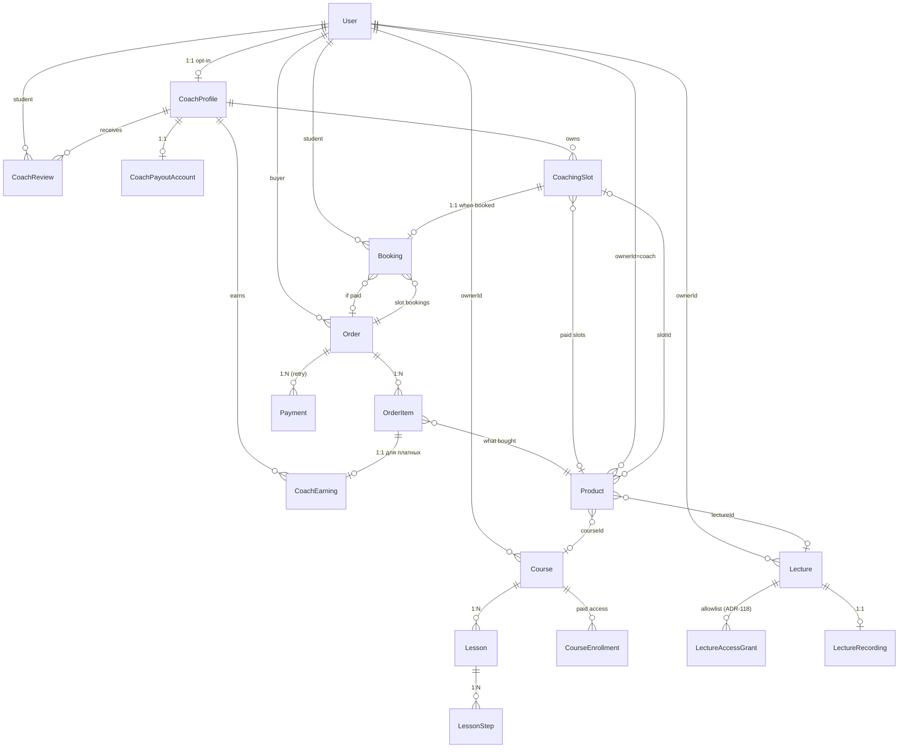

# ADR-120: Страница тренера — маршрутизация (поддомен vs путь), сущность тренера, контент, наполнение, монетизация

**Статус:** Предложено (черновик к обсуждению с пользователем; задачи разработчикам пока не создавать)
**Дата:** 2026-06-09
**Задача:** KS-4001
**Связанные ADR:** [ADR-017](./017-service-subdomains.md), [ADR-054](./054-user-courses-merge-into-system-models.md), [ADR-113](./113-coach-page.md), [ADR-117](./117-lecture-student-tools-policy.md), [ADR-118](./118-lecture-access-control.md), [ADR-119](./119-lecture-ui-coach-student.md)

## 1. Контекст

### 1.1 Что уже зафиксировано

- **ADR-113** ввёл сущность `Lecture` (live / scheduled / recorded), страницу `/coach/:username`, бейдж «Тренер» на профиле игрока, секции «Курсы», «Расписание», «В эфире», «Записи».
- **ADR-118** добавил `LectureAccessGrant` и режим `visibility='restricted'` — точечный allowlist на лекцию.
- **ADR-119** описал UI жизненного цикла лекции (создание, страница карточки, мои лекции, доступ).
- **ADR-054** разрешил пользовательские курсы (`Course.ownerId NOT NULL`, `isPublic`).
- **ADR-017** ввёл субдомены сервисов (`api.kingside.site`, `game.kingside.site`); фронт — на `kingside.site`. ACM-сертификат wildcard `*.kingside.site` (или SAN-набор).

Все эти ADR проектировались с допущением «весь контент бесплатный, тренер = пользователь с публичным курсом или лекцией».

### 1.2 Что нужно решить в этом ADR

Задача KS-4001 заново открывает пять развилок поверх уже принятых решений:

1. **Маршрутизация страницы тренера.** Поддомен `ivanov.kingside.site` vs путь `kingside.site/coach/ivanov`. ADR-113 зафиксировал путь, но без сравнения с поддоменом и без явного обоснования.
2. **Сущность «тренер».** ADR-113 не вводит признак, ADR-118 вводит `restricted`-allowlist, но связки «тренер ↔ ученик» в БД нет. Появление монетизации меняет требования: нужны контактные данные, реквизиты, профессиональное био, заявка/одобрение.
3. **Контент страницы.** Что такое «лекции» и «уроки» в формулировке задачи: маппить на существующие `Lecture`/`Lesson` или вводить новый тип. Календарь записи, отзывы, рейтинг, цены.
4. **Кто наполняет.** Self-service автора vs модерация админом. Объём UI и роли.
5. **Монетизация.** Платный доступ к курсам/лекциям, платные индивидуальные сессии, продажа пакетов, комиссия платформы; влияние на схему БД и интеграцию с платежами.

Цель ADR — дать сквозные решения по этим пяти развилкам, явно зафиксировать, что **поверх ADR-113** меняется, а что остаётся как есть.

### 1.3 Ограничения

- Один разработчик. Любое решение «всё через поддомены / роли / payments на старте» — слишком дорогое.
- РФ-аудитория преимущественная: для платежей значим YooKassa / CloudPayments; Stripe — для зарубежных тренеров отдельной фазой.
- Schema-first: новые сущности вводим с заделом на будущее, но без миграций «потом ещё раз».

### 1.4 Что НЕ в скоупе

- Конкретный выбор платёжного провайдера (YooKassa vs CloudPayments vs Stripe) — отдельный ADR на этапе монетизации.
- Bezier/Cron-механизм автоматических выплат тренеру — phase 2 монетизации.
- Налоговый учёт, отчёты для самозанятых/ИП — отдельный пласт.
- Маркетинговые промо-механики (скидки, купоны, бандлы) — phase 3 монетизации.
- Видеоконтент через CDN с DRM — за рамками страницы тренера.

## 2. Развилка 1 — поддомен vs путь

### 2.1 Сравнительная таблица

| Параметр | Путь `kingside.site/coach/ivanov` | Поддомен `ivanov.kingside.site` |
| --- | --- | --- |
| **Маршрутизация frontend** | Стандартный React Router, `:username` param. Нулевое изменение текущего SPA. | SPA должна на старте читать `window.location.host` и распарсивать первый сегмент. Все маршруты внутри (`/about`, `/lectures/:id`) должны учитывать, что хост уже «тренер-скоупленный». |
| **Маршрутизация backend / ALB** | Все запросы идут на `api.kingside.site`, REST `GET /coaches/:username/...` без изменений. | ALB listener-rule по `Host=*.kingside.site` (single rule, wildcard host pattern) → forward на SPA target group. Backend на `api.kingside.site` остаётся, но фронт должен пробрасывать ему `username` через query/path. |
| **TLS сертификат** | Текущий wildcard `*.kingside.site` покрывает `api/game/...`. **Не покрывает** `*.coach.kingside.site` (subdomain второго уровня) и тем более `ivanov.kingside.site` — wildcard работает только на один уровень. Если идти в поддомены тренеров — нужен либо второй wildcard на apex `*.kingside.site` (есть), который **покроет** `ivanov.kingside.site` (это первый уровень), либо переезд тренеров на двухуровневый `ivanov.coach.kingside.site` и второй wildcard `*.coach.kingside.site`. | Тот же wildcard `*.kingside.site` уже работает для `api/game`. Покрывает `ivanov.kingside.site` без выпуска нового сертификата. **Но**: каждое имя тренера на этом же уровне конкурирует с системными субдоменами — нужен резерв `api`, `game`, `www`, `admin`, `media`, `static`, …; нельзя позволить тренеру забрать username `api`. |
| **Cookies / auth** | Auth JWT в `Authorization: Bearer` — единый origin `kingside.site`, никаких кросс-доменных cookie. | Если в будущем переедем на refresh-token cookie с `Domain=.kingside.site`, **оба** варианта одинаковы. Сейчас разницы нет — все origin'ы внутри `*.kingside.site` и так одна семья. |
| **SEO** | Один авторитет домена; все страницы тренеров наследуют PageRank корня. Каноникал лёгкий. Sitemap — один. | Каждый поддомен — отдельный сайт для Google (исторически: считается отдельным host'ом, в современной практике Google заявляет, что обрабатывает поддомены так же, но **на практике** authority передаётся медленнее и неполно). Sitemap per-coach или мастер-sitemap с index'ом субдоменов. Для одного тренера, начинающего с нуля, поддомен значительно проигрывает по органике первых месяцев. |
| **Аналитика (GA4 / Я.Метрика)** | Один property, всё сразу видно. URL-сегментирование тривиально. | Cross-domain tracking (даже если поддомены под одной property — GA4 умеет, но настройка непростая). Я.Метрика — нужно `subdomain` в конфигурации счётчика. UTM-метки одинаковы. |
| **Шаринг ссылок** | `kingside.site/coach/ivanov` — длиннее, чуть менее «премиально». | `ivanov.kingside.site` — короче, выглядит как «личный сайт» тренера. Маркетинговое преимущество. |
| **Резервирование username** | Username уже уникален (`User.username UNIQUE`). Никаких новых ограничений. | Помимо уникальности — список зарезервированных слов (`api`, `game`, `www`, `mail`, `admin`, `support`, `static`, `media`, `cdn`, `app`, `dev`, `staging`, `blog`, `help`, `docs`, …). Регистрация username, попадающего в список, — запрещена. Существующих пользователей с конфликтующими username — мигрировать на новые или иметь запись DENY в роутере. |
| **Стоимость операционной поддержки** | Низкая. Стандартная схема. | Каждое заведение нового тренера = регистрация субдомена. DNS — без проблем (wildcard A-record), но любые CORS/конфигурация ALB по конкретному хосту усложняются. |
| **Стоимость миграции с пути на поддомен** | — | Если позже захотим перейти — 301-редирект `/coach/:username` → `https://:username.kingside.site` несложен. Возможен с любого момента. |
| **Стоимость миграции с поддомена на путь (обратно)** | — | Болезненна: тренеры уже опубликовали ссылки на свой поддомен, обратный редирект работает, но «личный сайт» исчезает. |

### 2.2 Решение

**Остаёмся на пути `kingside.site/coach/:username` (как в ADR-113). Поддомены — задел в инфраструктуре, не реализуем сейчас.**

Аргументы:

1. **SEO в первые месяцы.** Тренеры стартуют с нуля. Поддомен лишает их паразитного авторитета корневого домена. Путь — отдаёт его сразу.
2. **Сложность фронта.** Чтобы поддомен ивановки и страница тренера выглядели «как личный сайт», SPA должна по-разному рисовать nav, header, brand на тренерском хосте и на корневом. Это либо два бандла, либо runtime-фича-флаг — увеличивает риск багов.
3. **Username-резервирование.** Нужен chunk работы (список запрещённых слов, миграция конфликтующих username, проверка в форме регистрации, DENY в роутере). Не оправдано для маркетингового косметического выигрыша.
4. **Платежи / GDPR / cookie-баннер.** При платных страницах на поддоменах баннер придётся показывать на каждом тренерском поддомене (домен-родственный, но воспринимается отдельно). С путём — один баннер на kingside.site.
5. **Обратимость.** Переход путь → поддомен возможен в любое время через 301-редирект. Обратный путь — болезненный. Дешевле начать с пути.

### 2.3 Что закладываем сейчас для возможного перехода

Решения ADR-120, которые делают будущий переход на поддомены дешёвым:

- **Username UNIQUE остаётся условием.** Никаких будущих slugs «ivanov-spb-trener» — только username.
- **Reserved-words check** — добавляем validator в username creation/edit-flow с базовым списком (`api`, `game`, `www`, `mail`, `admin`, `support`, `static`, `media`, `cdn`, `app`, `dev`, `staging`, `blog`, `help`, `docs`, `coach`, `coaches`, `lectures`). Это запрещает занять «системные» username и так. Стоимость — несколько строк, value — позволяет позже включить поддомены без миграции существующих username.
- **Все ссылки на страницу тренера во фронте — через builder** `coachUrl(username)`, единая функция. При переезде меняем только её.
- **TLS-сертификат** не трогаем: wildcard `*.kingside.site` уже покрывает потенциальный `ivanov.kingside.site`.
- **Sitemap** строится по слугам тренеров, при переезде меняется хост в одном месте.

Будущий переход (если решим) — отдельный ADR; сейчас не делаем.

## 3. Развилка 2 — сущность «тренер»

### 3.1 Сравнение вариантов

| Вариант | Плюсы | Минусы |
| --- | --- | --- |
| A. Без отдельной сущности (как ADR-113): тренер = есть public Lecture или Course | Нулевая миграция. Естественно органически. | Нет места для био тренера, контактов, реквизитов, фотографии команды, специализации. Нет статуса «модерируем — пока не платный». Нет связки «тренер ↔ ученик». |
| B. Поле `User.role: enum (player, coach, admin)` | Просто в JWT, просто в guards. | Нерасширяемо: нельзя быть и тренером, и админом. Любые «coach data» (био, реквизиты) живут на `User` — раздувают таблицу. |
| C. **Отдельная таблица `CoachProfile` 1:1 c `User`, opt-in** | Чистое разделение. Не-тренеры не несут пустых полей. Само наличие записи = «зарегистрирован тренером». Можно держать статусы заявки/одобрения. | Один JOIN при отображении публичной карточки. Несложный. |
| D. Расширить ADR-113 (implicit), но **отдельную сущность только для финансовых данных** (`CoachPayoutAccount`) | Минимальная миграция. Бесплатные тренеры — без CoachProfile. | Био и описание (зачем человек на платформе как тренер) теряются — нет place для них. На MVP — приемлемо, но монетизация всё равно потребует CoachProfile. |

### 3.2 Решение

**Вариант C: отдельная таблица `CoachProfile` 1:1 с `User`. Запись создаётся опционально — при первом обращении тренера к личному кабинету тренера ИЛИ при попытке опубликовать платный контент.**

Тренер = пользователь, у которого:
- есть запись в `CoachProfile` (с `publishedAt IS NOT NULL`), ИЛИ
- (для обратной совместимости с ADR-113) есть публичный `Course` / публичная `Lecture`, даже если `CoachProfile` нет — тогда отображается «упрощённая страница тренера» без био.

```prisma
model CoachProfile {
  /// 1:1 с User.id, без отдельного surrogate PK.
  userId           String   @id @map("user_id") @db.Uuid
  user             User     @relation(fields: [userId], references: [id], onDelete: Cascade)

  /// Профессиональное био (до 4000 символов, Markdown).
  bio              String?  @db.Text
  /// Краткий слоган для шапки страницы (до 140 символов).
  tagline          String?
  /// Специализация: 'opening' | 'middlegame' | 'endgame' | 'tactics' |
  /// 'beginners' | 'kids' | 'tournament-prep' | ... (string[], свободный
  /// набор для гибкости; нормализация на фронте/админке).
  specializations  String[] @default([])
  /// Языки преподавания (ISO 639-1).
  teachingLangs    String[] @default([])
  /// FIDE-рейтинг / титул (опционально).
  fideId           String?
  fideTitle        String?  // GM, IM, FM, CM, WGM, WIM, WFM, WCM, NM, или null
  /// Контакты для записи на сессии (telegram, email). Email — отдельно от
  /// User.email (на случай если тренер хочет отдельный публичный контакт).
  contactTelegram  String?
  contactEmail     String?

  /// Дата публикации страницы (NULL = черновик, не отображается).
  publishedAt      DateTime?
  /// Модерационный статус (см. §5):
  ///   'self_published' — самопубликация без модерации (бесплатные тренеры);
  ///   'pending'        — отправлена заявка на платный статус;
  ///   'approved'       — одобрена для монетизации;
  ///   'suspended'      — заморожена админом (жалобы).
  status           CoachStatus @default(self_published)

  createdAt        DateTime @default(now()) @map("created_at")
  updatedAt        DateTime @updatedAt @map("updated_at")

  payoutAccount    CoachPayoutAccount?
  reviews          CoachReview[]
  bookingSlots     CoachingSlot[]

  @@map("coach_profiles")
}

enum CoachStatus {
  self_published
  pending
  approved
  suspended

  @@map("coach_status")
}
```

### 3.3 Бейдж и определение «является ли тренером»

API `GET /players/:username` отдаёт:

```ts
{
  isCoach: boolean;   // EXISTS CoachProfile WHERE publishedAt IS NOT NULL AND status != 'suspended'
                      //   OR EXISTS Course WHERE ownerId=user.id AND isPublic
                      //   OR EXISTS Lecture WHERE ownerId=user.id AND visibility='public'
  coachStatus: CoachStatus | null;  // null если CoachProfile нет
}
```

Логика бейджа ADR-113 §2.5 расширяется: бейдж «Тренер» отображается, если `isCoach=true` независимо от наличия `CoachProfile`. На странице `/coach/:username`:
- Если `CoachProfile.publishedAt IS NULL` И нет публичного контента → 404.
- Если `CoachProfile.publishedAt IS NULL` И есть публичный контент → упрощённая страница (как сейчас, ADR-113), без био-секции.
- Если `CoachProfile.publishedAt IS NOT NULL` → полная страница с био, специализацией, FIDE, отзывами (см. §4).

### 3.4 Связка «тренер ↔ ученик»

В ADR-118 фигурирует `LectureAccessGrant.subjectType IN ('user', 'course')`. ADR-120 **не вводит** глобальную связку coach-student (`CoachStudent` таблицы) — это отдельный пласт, нужный только для «инвайт-все-моих-учеников-одной-кнопкой» (см. ADR-118 §4.4).

Если такая связка станет нужна — её добавит отдельный ADR; ADR-120 ничего не блокирует.

### 3.5 Авторизация

Не вводим guard'ы вида `@Roles('coach')`. Все операции тренера авторизуются как:
- **«это твой собственный контент»** — `ownerId === req.user.id` (как сейчас в `Course`, `Lecture`).
- **«у тебя есть `CoachProfile.status='approved'`»** — только для монетизации (создание `Product`, payout — см. §6).

Для бесплатной публикации курса/лекции `CoachProfile` не обязателен — ADR-113 поведение сохраняется.

## 4. Развилка 3 — контент страницы

### 4.1 Что отображать (структура страницы)

```
┌─────────────────────────────────────────────────────┐
│ Шапка                                               │
│  Аватар │ Имя, FIDE-титул │ Страна, языки           │
│         │ Слоган (tagline) │ [Записаться] CTA      │
├─────────────────────────────────────────────────────┤
│ Биография (Markdown CoachProfile.bio)               │
│ Специализации (чипы), FIDE-ID/рейтинг               │
├─────────────────────────────────────────────────────┤
│ Курсы — карточки CoachProfile.user.ownedCourses     │
│        (isPublic, упорядоченные по order)           │
├─────────────────────────────────────────────────────┤
│ Лекции                                              │
│  [Сейчас в эфире] / [Расписание] / [Записи]         │
│  карточки Lecture (visibility=public)               │
├─────────────────────────────────────────────────────┤
│ Календарь индивидуальных сессий (phase 2)           │
│  Сетка слотов CoachingSlot, кнопка «Записаться»     │
├─────────────────────────────────────────────────────┤
│ Отзывы (phase 2)                                    │
│  Звёзды, текст, дата (CoachReview)                  │
└─────────────────────────────────────────────────────┘
```

### 4.2 Что такое «лекции» и «уроки» в формулировке задачи

В задаче KS-4001 фигурируют термины **«лекции» и «уроки»** — нужно явно зафиксировать маппинг на существующие сущности, чтобы не плодить новый тип материала.

| Термин в задаче | Маппинг на схему | Комментарий |
| --- | --- | --- |
| Лекции | `Lecture` (ADR-113) | Live-трансляция, запись с темпом, расписание. **Уже есть.** |
| Уроки | `Lesson` + `LessonStep` внутри `Course` (ADR-054) | Статичный обучающий материал: теория, задачи, шаги. **Уже есть.** Тренер их добавляет в свои авторские курсы. |
| Курсы | `Course` с `ownerId NOT NULL` (ADR-054) | Контейнер уроков. **Уже есть.** |
| Календарь записи | `CoachingSlot` + `Booking` | **Новое.** Phase 2 — индивидуальные сессии (см. §4.3). |
| Отзывы / рейтинг | `CoachReview` | **Новое.** Phase 2 (см. §4.4). |
| Цены | `Product` + связь с Course/Lecture/CoachingSlot | **Новое.** Phase 2 монетизации (см. §6). |

**Решение: «уроки» в задаче KS-4001 — это `Lesson` в составе авторского курса. Никакой новой сущности «отдельный урок без курса» не вводим.** На странице тренера в секции «Курсы» каждая карточка уже даёт прямой переход к читателю урока.

### 4.3 Календарь индивидуальных сессий

```prisma
/// Временной слот, открытый тренером для записи на индивидуальную сессию.
model CoachingSlot {
  id           String   @id @default(uuid()) @db.Uuid
  coachId      String   @map("coach_id") @db.Uuid
  coach        CoachProfile @relation(fields: [coachId], references: [userId], onDelete: Cascade)
  startsAt     DateTime @map("starts_at")
  durationMin  Int      @map("duration_min")  // 30, 45, 60 — выбор тренера
  /// Цена в копейках/центах в валюте, фиксируемой в Product (см. §6).
  /// NULL — бесплатный пробный слот.
  productId    String?  @map("product_id") @db.Uuid
  product      Product? @relation(fields: [productId], references: [id])
  /// 'open' (свободен) | 'booked' (занят учеником) | 'cancelled' | 'completed'
  status       CoachingSlotStatus @default(open)

  booking      Booking?
  createdAt    DateTime @default(now()) @map("created_at")
  updatedAt    DateTime @updatedAt @map("updated_at")

  @@index([coachId, startsAt])
  @@index([status, startsAt])
  @@map("coaching_slots")
}

model Booking {
  id            String   @id @default(uuid()) @db.Uuid
  slotId        String   @unique @map("slot_id") @db.Uuid
  slot          CoachingSlot @relation(fields: [slotId], references: [id], onDelete: Cascade)
  studentId     String   @map("student_id") @db.Uuid
  student       User     @relation("StudentBookings", fields: [studentId], references: [id], onDelete: Cascade)
  /// Привязка к Order (если платная). NULL = бесплатная запись.
  orderId       String?  @map("order_id") @db.Uuid
  order         Order?   @relation(fields: [orderId], references: [id])
  /// 'confirmed' (оплачено / бесплатно подтверждено)
  /// | 'cancelled_by_student' | 'cancelled_by_coach' | 'no_show'
  status        BookingStatus @default(confirmed)
  /// Текст ученика «о чём хочу сессию» (короткий).
  studentNote   String?  @map("student_note")
  /// Пост-фактум комментарий тренера для себя.
  coachNote     String?  @map("coach_note")

  createdAt     DateTime @default(now()) @map("created_at")
  updatedAt    DateTime @updatedAt @map("updated_at")

  @@map("bookings")
}

enum CoachingSlotStatus { open booked cancelled completed @@map("coaching_slot_status") }
enum BookingStatus { confirmed cancelled_by_student cancelled_by_coach no_show @@map("booking_status") }
```

**Семантика.** Тренер открывает «окна» (slots) в своём календаре. Ученик выбирает свободный слот и нажимает «Записаться»; если slot платный — открывается оплата; если бесплатный — booking confirmed сразу. После проведения — статус `completed`, появляется возможность оставить отзыв.

**MVP без онлайн-видео.** Платформа сводит ученика и тренера на конкретное время; сама сессия проходит вне Kingside (Zoom/Meet/телефон). Это критично: сразу заработает без транспорта. Интеграция онлайн-доски + аудио = отдельная фаза, опирающаяся на ADR-115/116.

### 4.4 Отзывы

```prisma
model CoachReview {
  id          String   @id @default(uuid()) @db.Uuid
  coachId     String   @map("coach_id") @db.Uuid
  coach       CoachProfile @relation(fields: [coachId], references: [userId], onDelete: Cascade)
  /// Автор отзыва. Допускается только для ученика, у которого есть
  /// завершённый Booking c этим coach (валидация в сервисе).
  studentId   String   @map("student_id") @db.Uuid
  student     User     @relation("StudentReviews", fields: [studentId], references: [id], onDelete: Cascade)
  /// Privacy-ссылка на конкретный Booking, по которому оставлен отзыв.
  /// Не FK на Booking чтобы при удалении booking отзыв сохранился.
  bookingId   String?  @map("booking_id") @db.Uuid
  /// 1..5
  rating      Int
  text        String?  @db.Text
  /// Модерация: 'visible' (по умолчанию), 'hidden' (админ скрыл).
  status      CoachReviewStatus @default(visible)

  createdAt   DateTime @default(now()) @map("created_at")
  updatedAt   DateTime @updatedAt @map("updated_at")

  @@unique([coachId, studentId, bookingId], map: "coach_review_unique_per_booking")
  @@index([coachId, status])
  @@map("coach_reviews")
}

enum CoachReviewStatus { visible hidden @@map("coach_review_status") }
```

**Условие написания отзыва:** ученик должен иметь хотя бы один завершённый `Booking` (`status='completed'`) с этим тренером. Это отсекает накрутки и спам.

**Рейтинг тренера** — производный: среднее `CoachReview.rating WHERE status='visible'`, плюс количество. Денормализованного поля в `CoachProfile` нет — считаем на лету (или с кешированием в Redis при росте).

## 5. Развилка 4 — кто наполняет

### 5.1 Решение

**Самообслуживание как основа. Модерация — реактивная (по жалобам) и проактивная — только для монетизации.**

| Действие | Кто | Модерация |
| --- | --- | --- |
| Создать `CoachProfile` (черновик) | Сам пользователь | Нет |
| Опубликовать `CoachProfile` (`publishedAt`) | Сам пользователь | Нет (status=`self_published`) |
| Публиковать `Course` / `Lecture` (visibility=public) | Сам пользователь | Нет (как сейчас) |
| Открыть слоты `CoachingSlot` (бесплатные) | Сам пользователь | Нет |
| Подать заявку на платный статус (`Product` создание) | Сам пользователь | **Да** — админ переводит `CoachStatus` `pending → approved` |
| Заполнить реквизиты `CoachPayoutAccount` | Сам пользователь после approved | Проверка реквизитов админом (одноразово) |
| Опубликовать первый платный курс/лекцию | Сам пользователь после approved | Нет (или soft-review первой публикации) |
| Заблокировать профиль | Админ | По жалобе |
| Скрыть отзыв | Админ | По жалобе |

### 5.2 Admin-UI

Что нужно админу (минимально):
- Список `CoachProfile WHERE status='pending'` — очередь заявок.
- Карточка заявки: профиль, био, реквизиты, FIDE, лицензии (если просим). Кнопки «Одобрить», «Отказать», «Запросить уточнение» (текстовое поле).
- Список жалоб (`Report`-сущность, если будет — за рамками ADR-120).
- Поиск пользователей, переключение `isHidden`/`CoachStatus`/`CoachReview.status`.

Это отдельный модуль `apps/api/src/admin/` и страница в `apps/web` под отдельным guard'ом (`isAdmin: boolean` в `User` или таблица admin-сессий — реализация в момент когда понадобится).

### 5.3 Анти-абуз

Текущие механизмы достаточны:
- `User.isHidden` — общий «скрыть отовсюду» (ADR-113 §2.1).
- `Lecture.visibility` — снижение видимости отдельной лекции.
- `Course.isPublic = false` — скрыть курс.
- `CoachReview.status='hidden'` — скрыть отзыв.

Новые:
- `CoachProfile.status='suspended'` — скрыть профиль тренера, но оставить данные.

Нет «вечного бана» — есть `User.isHidden=true` (полная очистка из публичных выдач). Удаление аккаунта — отдельный flow.

## 6. Развилка 5 — монетизация

### 6.1 Что монетизируем

Три источника дохода тренера:

| Тип | Описание | Цена за | MVP / phase |
| --- | --- | --- | --- |
| Продажа курса | Доступ к авторскому курсу `Course` навсегда | за курс | Phase 2 |
| Запись на сессию | Слот `CoachingSlot` для индивидуальной работы | за слот | Phase 2 |
| Подписка на тренера | Месячный доступ ко всем закрытым лекциям тренера | месячная | Phase 3 |

Phase 1 — бесплатно, как сейчас. Phase 2 — два первых типа. Phase 3 — подписка.

### 6.2 Абстракция платежа

Не привязываемся к конкретному провайдеру в схеме. Вводим три сущности: **Product** (что продаётся), **Order** (заказ), **Payment** (платёж).

```prisma
/// Что продаётся. Привязан к одному предмету одного типа.
model Product {
  id             String   @id @default(uuid()) @db.Uuid
  ownerId        String   @map("owner_id") @db.Uuid  // = coach userId
  owner          User     @relation("OwnedProducts", fields: [ownerId], references: [id], onDelete: Cascade)

  /// Что именно — Course, Lecture (single ticket), CoachingSlot,
  /// CoachSubscription (phase 3).
  kind           ProductKind
  /// Полиморфная ссылка. Один из них NOT NULL, валидируется на уровне сервиса.
  courseId       String?  @map("course_id") @db.Uuid
  lectureId      String?  @map("lecture_id") @db.Uuid
  slotId         String?  @map("slot_id") @db.Uuid

  /// Заголовок и описание в каталоге (могут дублировать поля Course/Lecture
  /// для удобства SEO/listing; обновляются автоматически на сохранении).
  title          String
  description    String?

  /// Цена в минимальной валютной единице (копейки/центы). Цена в RUB
  /// для self-published в RU, USD для approved international.
  priceMinor     Int      @map("price_minor")
  currency       String   @default("RUB") // ISO 4217

  /// 'draft' | 'active' | 'archived'
  status         ProductStatus @default(draft)
  publishedAt    DateTime?  @map("published_at")
  createdAt      DateTime @default(now()) @map("created_at")
  updatedAt      DateTime @updatedAt @map("updated_at")

  orderItems     OrderItem[]
  bookingSlots   CoachingSlot[]  // reverse from CoachingSlot.product

  @@index([ownerId, status])
  @@index([kind, status])
  @@map("products")
}

enum ProductKind { course lecture slot subscription @@map("product_kind") }
enum ProductStatus { draft active archived @@map("product_status") }

/// Заказ покупателя — корзина из 1+ позиций. На MVP — всегда одна позиция,
/// схема готова к корзинам.
model Order {
  id              String   @id @default(uuid()) @db.Uuid
  buyerId         String   @map("buyer_id") @db.Uuid
  buyer           User     @relation("Orders", fields: [buyerId], references: [id], onDelete: Restrict)
  /// 'pending' (создан, ждём оплаты) | 'paid' | 'failed' | 'refunded'
  status          OrderStatus @default(pending)
  /// Сумма всех позиций (price_minor * qty) в валюте `currency`.
  totalMinor      Int      @map("total_minor")
  currency        String   @default("RUB")

  /// Промокод/скидка — phase 3, поле зарезервировано.
  discountMinor   Int      @default(0) @map("discount_minor")

  items           OrderItem[]
  payments        Payment[]
  bookings        Booking[]

  createdAt       DateTime @default(now()) @map("created_at")
  updatedAt       DateTime @updatedAt @map("updated_at")

  @@index([buyerId, status])
  @@map("orders")
}

enum OrderStatus { pending paid failed refunded @@map("order_status") }

model OrderItem {
  id          String   @id @default(uuid()) @db.Uuid
  orderId     String   @map("order_id") @db.Uuid
  order       Order    @relation(fields: [orderId], references: [id], onDelete: Cascade)
  productId   String   @map("product_id") @db.Uuid
  product     Product  @relation(fields: [productId], references: [id], onDelete: Restrict)

  /// Замороженные на момент заказа поля (цена/название). При смене Product.price
  /// уже оформленные заказы не пересчитываются.
  priceMinor  Int      @map("price_minor")
  qty         Int      @default(1)
  titleSnapshot String  @map("title_snapshot")

  @@map("order_items")
}

model Payment {
  id              String   @id @default(uuid()) @db.Uuid
  orderId         String   @map("order_id") @db.Uuid
  order           Order    @relation(fields: [orderId], references: [id], onDelete: Cascade)
  /// 'yookassa' | 'cloudpayments' | 'stripe' (выбор провайдера — отдельный ADR).
  provider        String
  /// Идентификатор платежа на стороне провайдера (для webhook'ов).
  providerRef     String   @unique @map("provider_ref")
  /// 'created' | 'succeeded' | 'failed' | 'refunded'
  status          PaymentStatus
  /// Полная сумма с провайдера (включая комиссию провайдера).
  amountMinor     Int      @map("amount_minor")
  currency        String
  /// Raw webhook-payload для аудита.
  rawPayload      Json?    @map("raw_payload")

  createdAt       DateTime @default(now()) @map("created_at")
  updatedAt       DateTime @updatedAt @map("updated_at")

  @@map("payments")
}

enum PaymentStatus { created succeeded failed refunded @@map("payment_status") }

/// Реквизиты тренера для выплат. Не передаются клиенту, доступ только админу
/// и владельцу. Конкретный набор полей зависит от провайдера выплат.
model CoachPayoutAccount {
  coachId        String   @id @map("coach_id") @db.Uuid
  coach          CoachProfile @relation(fields: [coachId], references: [userId], onDelete: Cascade)
  /// 'self_employed' (самозанятый) | 'ip' (ИП) | 'individual' | 'foreign'
  legalForm      String   @map("legal_form")
  /// Полное имя получателя / название ИП.
  payeeName      String   @map("payee_name")
  /// ИНН / VAT / SSN — зависит от страны.
  taxId          String?
  /// Хеш реквизитов для отображения в админке без раскрытия полного номера.
  /// Полный набор — JSON в encrypted blob (см. §6.5).
  bankInfoMasked String?  @map("bank_info_masked")
  bankInfoBlob   String?  @map("bank_info_blob") @db.Text  // encrypted (sodium/AES-GCM)
  verifiedAt     DateTime? @map("verified_at")
  verifiedById   String?   @map("verified_by_id") @db.Uuid

  createdAt      DateTime @default(now()) @map("created_at")
  updatedAt      DateTime @updatedAt @map("updated_at")

  @@map("coach_payout_accounts")
}

/// Журнал начислений тренеру (что причитается с конкретного OrderItem,
/// за вычетом комиссии платформы). Группируется в payout-batch'и за период.
model CoachEarning {
  id             String   @id @default(uuid()) @db.Uuid
  coachId        String   @map("coach_id") @db.Uuid
  coach          CoachProfile @relation(fields: [coachId], references: [userId], onDelete: Restrict)
  orderItemId    String   @unique @map("order_item_id") @db.Uuid
  orderItem      OrderItem @relation(fields: [orderItemId], references: [id], onDelete: Restrict)
  /// Цена продажи (gross).
  grossMinor     Int      @map("gross_minor")
  /// Комиссия платформы в копейках (= gross * commission_rate).
  commissionMinor Int     @map("commission_minor")
  /// Сумма к выплате тренеру.
  netMinor       Int      @map("net_minor")
  currency       String
  /// 'accrued' (начислено, ждёт выплаты) | 'paid' (включено в payout)
  ///   | 'refunded' (заказ возвращён, аннулировано)
  status         CoachEarningStatus @default(accrued)
  payoutBatchId  String?  @map("payout_batch_id") @db.Uuid

  createdAt      DateTime @default(now()) @map("created_at")

  @@index([coachId, status, createdAt])
  @@map("coach_earnings")
}

enum CoachEarningStatus { accrued paid refunded @@map("coach_earning_status") }
```

**Зачем `OrderItem` отдельной моделью при «одна позиция на заказ»** — иначе при добавлении корзин (даже самой простой: «курс + сессия с тем же тренером скидкой») придётся переписывать сервис покупки. Сейчас стоимость — одна доп. таблица; цена будущего изменения — пол-сервиса.

### 6.3 Выдача доступа после оплаты

При webhook'е `payment.succeeded` — обработчик:

1. Order.status = 'paid'.
2. Для каждого `OrderItem` смотрим `product.kind`:
   - `course` → создать `CourseEnrollment(courseId, userId=buyerId)` ИЛИ (если не вводим эту таблицу) добавить `Course.allowedUserIds` — **предлагаем именно `CourseEnrollment`-таблицу**, симметрично `LectureAccessGrant` (ADR-118 §2.2). Резолвер доступа к курсу проверяет (`ownerId === user.id OR isPublic OR EXISTS CourseEnrollment`).
   - `lecture` → создать `LectureAccessGrant(subjectType='user', subjectId=buyerId, grantedBy=ownerId)`. Прямой переиспользование ADR-118.
   - `slot` → перевести `CoachingSlot.status='booked'` + создать `Booking(orderId=order.id, slotId=...)`.
   - `subscription` (phase 3) → создать `CoachSubscription(coachId, userId, validUntil)` с ежемесячной пролонгацией.
3. Создать `CoachEarning` для каждого OrderItem (gross = priceMinor, commission = round(gross * rate), net = gross - commission).
4. Notify buyer/coach (email/telegram).

**Идемпотентность** — `Payment.providerRef UNIQUE` + транзакционный INSERT. Дубликат webhook'а не повторит выдачу.

### 6.4 Комиссия

Введём конфигурируемое значение `commissionRate` (по умолчанию **15%**). Хранение — `CoachProfile.commissionRate Decimal(5,4)` для возможности **индивидуальных** ставок (партнёры, лояльные тренеры). NULL = глобальный default из ENV.

Логика: при создании `CoachEarning`:
```
rate = coachProfile.commissionRate ?? ENV.COMMISSION_DEFAULT_RATE
commission = floor(gross * rate)
net = gross - commission
```

Менять комиссию задним числом для существующих `CoachEarning` нельзя — поле копируется при создании.

### 6.5 Безопасность реквизитов

`CoachPayoutAccount.bankInfoBlob` — encrypted-at-rest. Симметричный шифр (AES-256-GCM) с ключом в KMS / env `PAYOUT_ENC_KEY`. Расшифровка только в админ-сервисе при выплате. Маскированная версия (`bank_info_masked` — «**** 1234») — для отображения тренеру/админу без расшифровки.

### 6.6 Возврат / отмена

| Сценарий | Действие |
| --- | --- |
| Ученик отказывается за 24+ часа до слота | Slot.status → 'cancelled', Booking.status → 'cancelled_by_student'. Order → refund (полный). CoachEarning → 'refunded'. |
| Ученик отказывается < 24 ч | Booking cancelled, **без возврата** (по правилам платформы). Coach получает payout. Конкретное окно — конфиг тренера, default 24ч. |
| Тренер отменяет | Полный refund в любой момент. |
| Возврат курса в первые N дней (по аналогии Stepik / Udemy) | Полный refund в течение 7 дней + доступ < 20% уроков. Поле `CourseEnrollment.refundEligibleUntil`. |
| Жалоба и chargeback | Через провайдера; админ-UI должен показывать и блокировать payout если есть открытый dispute. |

### 6.7 Юридическое

ADR не закрывает:
- Оферту между платформой и тренером (договор на оказание услуг или агентский договор).
- Договор-оферту с учеником на покупку.
- Учёт по налогам, чеки 54-ФЗ, фискализация (для РФ-провайдеров обязательны).
- ВЭД (выплаты за рубеж) — отдельная фаза.

Все эти вопросы — отдельный пласт, должны быть решены до запуска фазы 2 монетизации.

## 7. Схема сущностей и связей



**Новые модели по сравнению с текущей схемой (после ADR-113/118):**
- `CoachProfile`, `CoachPayoutAccount`, `CoachingSlot`, `Booking`, `CoachReview`, `CoachEarning`
- `Product`, `Order`, `OrderItem`, `Payment`
- `CourseEnrollment` (по аналогии с `LectureAccessGrant`)

Существующие модели — без breaking changes:
- `User`: добавляется опциональное обратное отношение `coachProfile`.
- `Lecture`: без изменений (allowlist через `LectureAccessGrant` уже есть из ADR-118).
- `Course`: добавляется обратное отношение `enrollments`.

## 8. План поэтапной реализации

### Phase 0 — то, что уже сделано

- ADR-113 + KS-3783-3795: страница тренера, лекции, расписание, запись.
- ADR-118 + KS-3929: restricted-доступ к лекциям.
- ADR-119 + KS-3928: UI лекций (страница карточки, мои лекции).

### Phase 1 — биография тренера и календарь записи (MVP без денег)

Цель: страница тренера выглядит как полноценный «личный кабинет», тренер может публиковать био, открывать слоты для **бесплатных** индивидуальных сессий.

Поставка:

- Миграция: `CoachProfile`, `CoachingSlot`, `Booking`, `CoachReview`.
- Backend: CRUD `CoachProfile`, `GET /coaches/:username` (расширенный — био, специализация, отзывы).
- Backend: `CoachingSlotsController` — открыть слот, отменить, забронировать (без оплаты).
- Backend: `CoachReviewsController` — оставить отзыв (с проверкой completed booking), скрыть (админ).
- Frontend: расширенная `CoachProfilePage` (секции био, календарь, отзывы).
- Frontend: личный кабинет тренера `/me/coach` — редактирование `CoachProfile`, управление слотами.
- Frontend: страница ученика `/me/bookings` — мои бронирования.
- Reserved-words check для username (см. §2.3).

Объём — 3–4 эпика разработки.

### Phase 2 — монетизация курсов и сессий

Цель: тренер может продавать курсы и сессии. Оплата через одного провайдера (YooKassa или CloudPayments).

Поставка:

- Миграция: `Product`, `Order`, `OrderItem`, `Payment`, `CoachEarning`, `CoachPayoutAccount`, `CourseEnrollment`.
- Backend: модуль `apps/api/src/billing/`:
  - `ProductsService` (CRUD продуктов тренера).
  - `OrdersService` (создание заказа, статусы).
  - `PaymentsService` + webhook-handler провайдера.
  - `EnrollmentsService` (выдача доступа после оплаты).
  - `EarningsService` (расчёт начислений).
- Backend: `CourseAccessResolver` — расширить открытие курса проверкой `CourseEnrollment`.
- Backend: `AdminController` — заявки на платный статус, верификация реквизитов, payout-batch'и (выплаты вручную в Phase 2; автоматические — Phase 3).
- Frontend: страница «Каталог тренера» — карточки `Product` с ценой и CTA.
- Frontend: flow покупки (выбор → оплата провайдер → success/fail).
- Frontend: `/me/coach/products` — управление каталогом.
- Frontend: `/me/coach/earnings` — журнал начислений.
- Frontend: `/admin/coaches` — заявки и реквизиты.
- Юридическое: оферта, чеки 54-ФЗ.

Объём — 6–8 эпиков. Перед стартом обязателен отдельный ADR «выбор платёжного провайдера и интеграция».

### Phase 3 — подписка на тренера, корзина, скидки

- Миграция: `CoachSubscription`, `Discount`/`Coupon`.
- Подписка как `Product.kind='subscription'` с ежемесячным billing (через recurring у провайдера).
- Корзина (несколько `OrderItem` в `Order`).
- Промокоды.
- Автоматические выплаты тренерам (`PayoutBatch`).

### Phase 4 — поддомены тренеров (если решим)

Триггер: тренер просит «персональный сайт», маркетинг показывает выигрыш.

Поставка:
- ALB listener-rule по `Host=*.kingside.site` → SPA target.
- Фронт: на старте читает `window.location.host`, при non-system host'е (не входит в `['kingside.site','www.kingside.site','api...','game...','media...']`) — резолвит `coachByUsername(host.split('.')[0])`.
- 301-редирект со старого пути на новый поддомен (опционально, рекомендуется).
- Аналитика — поправка cross-domain в GA4.
- Sitemap — пересборка с per-coach sitemap.

Это отдельный ADR в момент выкатки; ADR-120 фиксирует только готовность инфраструктуры (wildcard cert, reserved username list).

## 9. Альтернативы (по сводным развилкам)

### 9.1 Сразу делать поддомены

Отвергнуто (§2.2): SEO штраф первых месяцев + неоправданная сложность фронта + миграция username.

### 9.2 Не вводить `CoachProfile`, всё хранить на `User`

Отвергнуто (§3.1): «coach data» (био, реквизиты, FIDE, специализация) — это 5+ опциональных полей; в `User`-таблице раздувают модель и не нужны 99% пользователей. 1:1-таблица — стандартный паттерн.

### 9.3 «Лекции» и «уроки» как новый тип материала

Отвергнуто (§4.2): дублирует `Lecture` и `Lesson` без новой ценности. Если у тренера есть свой курс — это уже `Course→Lesson`. Если живая лекция — `Lecture`. Третий тип усложнил бы UX и схему.

### 9.4 Один платёжный провайдер захардкодить в схему (например, прямые ссылки на YooKassa entities в Order)

Отвергнуто (§6.2): провайдер сменится / появится второй. Поле `Payment.provider` + общий webhook-handler позволяет ввести второго провайдера без миграции.

### 9.5 Хранить allowlist «купивших курс» прямо на `Course.allowedUserIds: String[]`

Отвергнуто (по тем же причинам, что и ADR-118 §4.2): нет индекса для обратного лукапа, теряется аудит, не масштабируется.

### 9.6 Без `CoachEarning` — считать выплаты на лету по `OrderItem`

Отвергнуто: возвраты, частичные выплаты, индивидуальные комиссии — всё это требует материализованной записи. Расчёт на лету ломается при первом же возврате.

### 9.7 Самообслуживание без всякой модерации даже для платных

Отвергнуто: чеки 54-ФЗ, оферта, реквизиты, FIDE-верификация — это юридически значимые данные. Без хотя бы одноразовой проверки админом — высокий риск.

## 10. Риски и подводные камни

1. **Reserved-words check может конфликтовать с уже существующими username'ами.** Перед накатом — sql-скрипт `SELECT id, username FROM users WHERE username IN ('api', 'game', 'admin', ...)`. Если ненулевая выдача — миграция username с уведомлением пользователя (предложить новые варианты).

2. **`CoachProfile` для существующих авторов курсов.** Те, кто уже имеет публичные `Course`/`Lecture` (без `CoachProfile`), продолжают видеть упрощённую страницу. Не насильно создаём `CoachProfile` — только при первом входе в `/me/coach`.

3. **Race при покупке слота.** Два ученика жмут «Купить» одновременно. Решение: `CoachingSlot.status='open'` → транзакционное `UPDATE ... SET status='booked' WHERE id=? AND status='open' RETURNING *`. Второй получает 0 строк → 409 Conflict «Слот уже занят», деньги не списаны (заказ ещё в `pending`, провайдер не вызван).

4. **Webhook платежа доставляется до OrderItem-INSERT** (теоретически — если провайдер очень быстрый). Решение: транзакция `BEGIN; INSERT Order; INSERT OrderItem; commit;` **до** инициации платежа.

5. **Webhook доставляется дважды.** `Payment.providerRef UNIQUE` — дубль `INSERT` падает с 23505, обработчик ловит и отвечает 200 (для провайдера).

6. **Refund после payout.** `CoachEarning.status='paid'` → не можем просто перевести в `refunded`, деньги уже у тренера. Логика: создаём отрицательный `CoachEarning` следующего payout-batch'а («хвост долга»), либо требуем от тренера возврата (в зависимости от провайдера и юридики). На MVP phase 2 — выплаты ручные с лагом 1–2 недели, успеваем поймать большинство возвратов до payout.

7. **GDPR / ФЗ-152 для реквизитов.** Bank-info в encrypted blob, доступ только админу. Логи доступа (`audit_log` на чтение реквизитов) — phase 2.

8. **Календарь тренера и пояс времени.** Хранение `CoachingSlot.startsAt` в UTC. Тренер задаёт в своём поясе, ученик видит в своём. Поле `CoachProfile.timezone` (IANA `Europe/Moscow`).

9. **Спам отзывов.** `@@unique([coachId, studentId, bookingId])` — один отзыв на бронирование. Без бронирования — отзыв оставить нельзя.

10. **«Тренер удалил аккаунт после продажи курса».** `Course.owner onDelete: Cascade` сейчас сносит курс целиком — но у нас есть `CourseEnrollment` с оплатой! Решение **до** Phase 2: сменить `Course.owner` на `onDelete: SetNull` (как у системных курсов с `ownerId=NULL`) или ввести soft-delete `User.deletedAt`. Это меняет инвариант ADR-054 — отдельная мини-задача миграции перед Phase 2.

11. **Поиск тренеров.** Сейчас тренер находится только через прямой URL `/coach/:username`. Когда их будет больше 20 — нужен каталог `/coaches?q=...&specialization=...`. Это отдельная задача, можно после Phase 1.

## 11. Acceptance — соответствие задаче KS-4001

| Требование задачи | Где в ADR | Решение |
| --- | --- | --- |
| Развилка 1: поддомен vs путь | §2 | Путь, поддомены — задел (Phase 4). |
| Развилка 2: новая роль vs отдельная сущность | §3 | Отдельная opt-in сущность `CoachProfile` 1:1 с User; без `User.role`. |
| Развилка 3: контент — существующие или новые сущности | §4 | Лекции = `Lecture` (есть), уроки = `Lesson` внутри `Course` (есть). Новое: `CoachingSlot`/`Booking` (календарь), `CoachReview`, `Product` (цены). |
| Развилка 4: кто наполняет | §5 | Самообслуживание; модерация только для монетизации (`CoachStatus`) и жалоб (`isHidden`). |
| Развилка 5: монетизация | §6 | Phase 2: продажа курсов и сессий; абстракция `Product/Order/Payment`; комиссия 15% default; реквизиты в `CoachPayoutAccount` encrypted; провайдер — отдельным ADR. |
| ADR в `docs/` | этот файл | `docs/adr/120-coach-page-monetization-and-subdomain.md` |
| Схема сущностей и связей | §7 | Mermaid ER. |
| План поэтапной реализации | §8 | 4 фазы; Phase 0 уже сделано (ADR-113/118/119). |
| Задачи разработчикам пока НЕ создавать | — | Соблюдено: ни одной KS-задачи в плане. Координатор обсуждает с пользователем. |

## 12. Связь с соседними ADR

- **ADR-017** — задел на поддомен уже инфраструктурно подготовлен (wildcard cert), §2.3 ADR-120 фиксирует требования к reserved-username.
- **ADR-054** — пользовательские курсы остаются основой; добавляется `CourseEnrollment` для платного доступа (по аналогии с `LectureAccessGrant` из ADR-118).
- **ADR-113** — страница тренера, лекции, расписание — основа; ADR-120 надстраивает био-секцию, календарь записи 1-на-1, отзывы, продукты.
- **ADR-118** — модель доступа к лекциям; ADR-120 переиспользует `LectureAccessGrant` для платных лекций.
- **ADR-119** — UI жизненного цикла лекций; ADR-120 опирается на «карточку лекции» (`/lectures/:id`) как страницу-витрину для платного `Product.kind='lecture'`.
