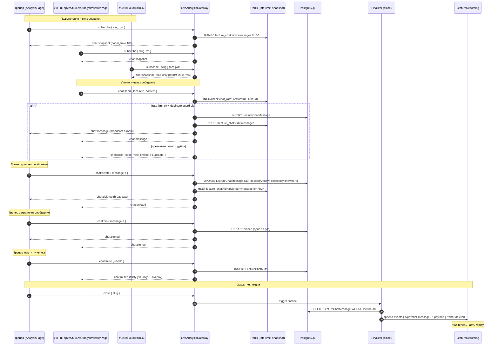
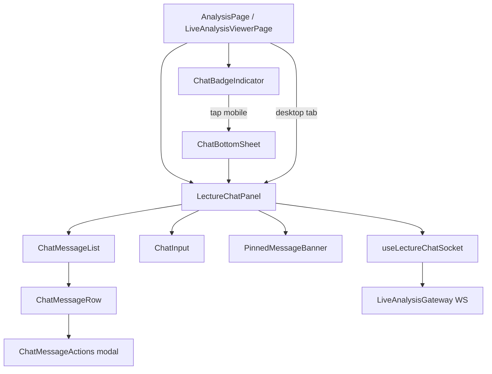

# ADR-121: UX чата лекции в окне анализа (desktop + mobile)

**Статус:** Предложено (черновик к обсуждению с пользователем; задачи разработчикам пока не создавать)
**Дата:** 2026-06-09
**Задача:** KS-4006
**Связанные ADR:** [ADR-110](./110-live-analysis-broadcast.md), [ADR-113](./113-coach-page.md), [ADR-115](./115-lecture-audio-recording.md), [ADR-117](./117-lecture-student-tools-policy.md), [ADR-118](./118-lecture-access-control.md), [ADR-119](./119-lecture-ui-coach-student.md)

## 1. Контекст

### 1.1 Где появляется чат

Лекция уже стабильно работает (KS-4002…KS-4005). Сейчас при ведении лекции тренер сидит на `/analysis/:id` (`AnalysisPage`), ученик — на `/live/:slug` (`LiveAnalysisViewerPage`). До текущего момента общения тренера с залом нет — только односторонний канал ходов + опциональный аудио из ADR-116.

Чат нужен:
- тренеру — чтобы видеть вопросы и реагировать (текстом или голосом),
- ученику — чтобы спросить и увидеть ответ.

### 1.2 Что есть в UI сейчас

**Тренер, desktop:** `AnalysisPage` (4416 строк) — широкий layout с тремя зонами: доска по центру, дерево/ходы слева, правая колонка с движком + бейджами лекции (live indicator, аудио-контроль ADR-116, publisher controls). Каждая зона уже наполнена.

**Тренер, mobile:** Bottom-sheet с 3 snap-точками (KS-3190 / ADR-073 §7 F3) и нижняя панель с табами: `moves | engine | tree | ai`. Engine-таб опционально скрыт, если `Lecture.disabledTools` запрещает движок ученикам (ADR-117). Места под пятый таб — практически нет: 4 таба и так визуально тесные на iPhone SE.

**Ученик, desktop:** `LiveAnalysisViewerPage` (388 строк) — оборачивает `AnalysisPage` в режиме `liveSession={mode:'viewer'}`. Большая правая колонка свободна, потому что движок зрителю либо доступен (своя инстанция Stockfish, ADR-117) либо отключён.

**Ученик, mobile:** Та же mobile-разметка, что у тренера, без publisher-кнопок.

### 1.3 Что есть в инфраструктуре

- **`LiveAnalysisGateway`** (`apps/api/src/live-analysis/live-analysis.gateway.ts`) — Socket.IO namespace `/live-analysis`. JWT опциональный (анонимы тоже могут смотреть, если `visibility != restricted` — ADR-118). Уже несёт события `subscribe`/`sync`/`move`/`state-patch`/`reset`/`close` + WebRTC сигналинг.
- **`ChatMessage`** в БД (schema.prisma:282) — существующая модель, **завязана на `gameId`** (для чата партии). Не покрывает лекцию, чужая семантика.
- **Lecture / LectureRecording** (ADR-113) — записывают события доски с темпом для replay. Чат в записи **сейчас не сохраняется**.

### 1.4 Что нужно решить

1. Куда в плотный desktop-UI тренера встроить ввод и видимую ленту, не отжимая движок/дерево.
2. Как организовать чат на mobile у тренера, где места буквально нет.
3. UI ученика desktop/mobile — менее жёсткие ограничения, но визуальный язык должен совпадать.
4. Модерация: мьют, бан, удаление сообщений, что показывать как «системные».
5. Anti-spam: что блокировать на клиенте, что — на сервере.
6. Хранение: жить только в памяти live-сеанса или прикладываться к записи лекции для replay.

### 1.5 Что **не** в скоупе

- Точная конструкция WS-протокола чата (имена событий, поля payload) — это код, а здесь UX.
- Поиск по истории чата вне записи лекции — задача отдельной фазы.
- Реакции (эмодзи), прикреплённые ходы/позиции в сообщении — отдельный follow-up.
- Личные сообщения «ученик ↔ тренер» вне лекции — не входит, для этого есть профиль/контакты тренера (ADR-120).
- Голосовые сообщения текстом-в-голос — отдельный пласт.

## 2. Развилка 1 — Desktop у тренера

### 2.1 Варианты размещения

| Вариант | Описание | Плюсы | Минусы |
| --- | --- | --- | --- |
| **A. Таб в правой колонке** (рядом с движком) | Над правой панелью — переключатель `Engine ⇄ Chat`, тренер выбирает что показывать. Дерево ходов остаётся слева. | Нулевое вторжение в layout, переиспользует существующее место. Знакомый паттерн (как Twitch чат vs stats). | Тренер не видит чат и движок одновременно. Во время разбора партии надо переключаться. |
| **B. Дополнительная узкая колонка справа** (третья) | Layout: доска центр, дерево слева, движок в середине-справа, чат — самая правая колонка (~280 px). | Всё видно одновременно. Чат всегда «на периферии зрения». | Минимальная ширина AnalysisPage растёт до ~1500 px. На 1366 — приходится скрывать дерево. Меняет каркас layout'а — риск регресса. |
| **C. Всплывающее окно** (overlay / detached widget) | Floating panel, тренер двигает по экрану, может свернуть. | Чат можно поставить куда удобно, в т. ч. на втором мониторе (после KS-3771 detached-window, если был). | Floating-окна перекрывают доску. Сложно поддерживать (drag, resize, z-index). Не работает на mobile вообще. |
| **D. Складывающаяся нижняя полоса** (под доской) | Узкая горизонтальная лента сообщений + поле ввода под доской. Свёрнутая высотой ~36 px, развёрнутая ~200 px. | Не отжимает правую колонку — движок остаётся в полном объёме. | Зажимает доску по высоте при разворачивании; на типичных 16:9 высота доски уже впритык к движку. Длинные сообщения — обрезаются. |
| **E. Боковая шторка слева** (поверх дерева) | Кнопка-хэндл, slide-in над деревом ходов. | Чат не делит пространство с движком. | Скрывает дерево, в которое тренер часто заглядывает; конфликт с навигацией по ходам. |

### 2.2 Решение

**Вариант A — таб в правой колонке, переключатель `Engine ⇄ Tree-comments ⇄ Chat`.** Дефолт после старта лекции — `Chat` (тренер только что нажал «начать»). Когда тренер переходит к разбору — выбирает `Engine`. Это решение симметрично mobile (см. §3.2 — там тоже один из табов выбирается из набора).

**Аргументы:**

- Нулевая ломка существующего каркаса AnalysisPage.
- Тренер сам контролирует фокус: смотрит на движок и иногда переключается на чат увидеть свежие вопросы. Если поток большой — постоянно держит `Chat`.
- Индикатор непрочитанных на табе `Chat` (число в badge) — тренер видит активность не открывая.
- Audio из ADR-116 + chat — взаимодополняют: ученик пишет, тренер озвучивает ответ.

**Что добавляется к табу:**

- Бейдж непрочитанных (число) на табе `Chat` — обнуляется при активации.
- Кнопка «Mute-all» (см. §6) — гасит чат для всех на ~N минут (тренер делает паузу).
- Шорткат `Ctrl/Cmd+/` фокусирует поле ввода чата (не блокирует Ctrl+стрелки навигации по ходам).

### 2.3 Что происходит при большом потоке

- **Виртуализированный список** (react-window или аналог) — ленивый рендер только видимых сообщений. На MVP — простой список с автоудалением старых выше N=500 из DOM (история живёт в Redis на сервере и подгружается при скролле в начало).
- **Auto-scroll lock.** Если тренер скроллит ленту вверх — автопрокрутка к новому останавливается. Появляется кнопка «↓ N новых» внизу — клик возвращает к концу.
- **Throttle render.** Если приходит больше 5 msg/сек — рендер пачкой каждые 200 мс (батчинг), чтобы не дёргался DOM.
- **Свернуть похожие.** Подряд идущие сообщения одного автора визуально объединяются в один блок (как в Slack / Telegram).

### 2.4 Что делать с «висящим» вопросом

Тренер видит интересный вопрос и хочет к нему вернуться через 10 минут.

- **Pin сообщения.** Тренер кликает на сообщение → «Закрепить». Появляется в верхней полосе чата у всех. Снять — повторный клик. Максимум 1 закреплённое сообщение (MVP). Это фича Phase 2 — не блокер MVP, но в backlog.
- **Mark «later».** Личная пометка тренера (никто не видит): «вернуться». Виден список «отложенных» в сворачиваемой секции над лентой. Phase 2.

MVP: только pin (одно закреплённое). Later — Phase 2.

## 3. Развилка 2 — Mobile у тренера

### 3.1 Варианты

Контекст: четыре таба `moves | engine | tree | ai` и нижняя bottom-sheet (KS-3190). Доска — primary content, занимает почти весь viewport.

| Вариант | Описание | Плюсы | Минусы |
| --- | --- | --- | --- |
| **M-A. Пятый таб** `chat` | Добавить пятый таб в нижнюю панель. | Симметрично остальным панелям. Одинаковый паттерн. | Tabs визуально тесные. На iPhone SE 5 табов — труднодоступные. Не работает «глянул в чат не теряя текущий таб». |
| **M-B. Bottom-sheet поверх доски, по тапу значка** | Сверху-справа (рядом с лекция-бейджем) — небольшой floating bubble с иконкой и числом непрочитанных. Тап → шторка снизу выезжает поверх доски с лентой и полем ввода. | Не отжимает табы, ничего не меняет в текущем UI. Шторку легко swipe-down. Тренер только-что-смотрел-движок видит чат без потери таба. | Шторка перекрывает доску — тренер не может одновременно следить за позицией и читать. Но он редко это делает на мобайле — обычно либо одно, либо другое. |
| **M-C. Floating chat button** (FAB) | Кнопка в правом нижнем углу, тап → full-screen чат. | Привычный паттерн, легко обнаружить. | Закрывает уголок доски + кнопку текущего таба; конфликт с focus-mode handle. |
| **M-D. Inline над bottom-sheet** | Узкая полоса (40 px) с последним сообщением и счётчиком, над панелью табов. Тап разворачивает в bottom-sheet. | Тренер всегда видит «есть ли что-то новое». | Ещё на 40 px меньше доске. Существенно для small phones. |
| **M-E. Воспользоваться существующим bottom-sheet** (KS-3190) — добавить 5-ю snap-точку «chat» | Свайп выше — поверх доски расширяется не движок, а чат. | Переиспользует механизм. | Сложно прикрутить: snap-точки сейчас управляют высотой движка, а не контентом. Перестройка |

### 3.2 Решение

**M-B — bottom-sheet по тапу значка в правом верхнем углу, рядом с live-индикатором.** Значок-капсула: иконка диалога + число непрочитанных. Если непрочитанных нет — иконка остаётся, но без бейджа.

**Аргументы:**

- Не трогает существующие 4 таба — мобильный layout полностью сохранён.
- Значок ютится в зоне служебных бейджей лекции (live-dot, audio-control), которые ADR-119 уже разместил в верхней полосе. Это «лента состояния», расширяется одной иконкой.
- Шторка с тремя snap-точками: `dismissed` (только значок) → `compact` (~40% высоты, ввод + последние 5 сообщений) → `full` (~85%, история + ввод). Свайп управляет.
- Доска временно скрыта при `full`, но тренер сознательно открыл шторку — это его выбор.
- Возврат к доске — swipe-down или тап на значок крестика.

**Что происходит при типе в поле ввода с открытой клавиатурой:**

- Клавиатура поднимается, bottom-sheet поднимается над ней. Видны последние 3–4 сообщения + поле ввода.
- При отправке — фокус остаётся в поле (тренер может писать дальше).
- При закрытии клавиатуры — sheet возвращается в snap-точку `compact`.

**Что отвергнуто M-A (пятый таб).** Это разрушает «равновесие табов»: первые четыре имеют общий смысл «разные виды анализа», чат семантически отдельный (общение, не анализ). Смешивать — плохой UX.

**Что отвергнуто M-E (5-я snap-точка).** Технически сложно: snap-точки управляют высотой движка, а не выбором контента. Меняет инвариант KS-3190.

## 4. Развилка 3 — UI ученика (desktop + mobile)

### 4.1 Desktop

У ученика нет publisher-controls, правая колонка имеет больше места. Варианты:

- **A. Та же правая колонка с табом** — симметрично тренеру.
- **B. Постоянно открытая правая колонка чата + отдельная для движка** — у зрителя места хватает, можно показать всё.

**Решение: B (две колонки одновременно).** Ученик пришёл слушать → должен видеть чат всегда. Движок (если разрешён, ADR-117) — отдельной колонкой. Если движок запрещён — только чат + дерево ходов.

Это **отличается** от тренера (один таб), но обоснованно: у ученика workflow другой — он не «нажимает кнопки», а смотрит и общается. Один visual language сохраняется (тот же компонент `LectureChatPanel`), просто у ученика он закреплён, у тренера — табируется.

### 4.2 Mobile

Аналогично §3.2 — тот же `LectureChatPanel` в bottom-sheet с значком-капсулой в верхней полосе. Ученик не имеет publisher-controls, значок одинокий справа.

### 4.3 Анонимный ученик (без JWT)

Согласно ADR-118 §2.1, `public` и `unlisted` лекции пускают анонимов. Решение:

- Анонимный ученик видит ленту в режиме read-only.
- Под полем ввода — «Войдите, чтобы писать. [Войти]» (CTA на `/login?returnTo=...`).
- Не пытается слать — иначе сервер ответит 401, лучше предотвратить на UI.

## 5. Развилка 4 — Модерация

### 5.1 Чьи права

| Действие | Тренер (owner лекции) | Админ платформы | Ученик |
| --- | --- | --- | --- |
| Отправить сообщение | Да (приоритет — см. §5.4) | Да | Да (если JWT) |
| Удалить любое сообщение | Да | Да | Только своё |
| Mute ученика на текущую лекцию | Да | Да | — |
| Mute ученика навсегда у тренера (любая будущая лекция) | Да (фича Phase 2) | Да | — |
| Бан на платформе (`User.isHidden`) | Нет | Да | — |
| Закрепить сообщение (pin) | Да | Да | — |
| Закрыть чат для всех (mute-all) | Да | Да | — |
| Slow-mode (1 сообщение в N сек на ученика) | Да (Phase 2) | Да | — |

### 5.2 Удаление сообщения

- Сообщение помечается как `deleted`, не вычёркивается из ленты у других, а заменяется на «[удалено тренером]». Это позволяет:
  - сохранить контекст диалога (ответы на удалённое не «висят в пустоте»),
  - оставить аудит для админа.
- Запись лекции (см. §7) хранит удалённые сообщения как `deleted=true` + originalContent (только для админа); зритель replay видит «[удалено]».

### 5.3 Mute ученика

- **На текущую лекцию.** Тренер кликает на ник → «Mute». Бэкенд помечает `LectureMute(lectureId, userId)`. После этого попытка отправить → 403, на клиенте — overlay «Тренер отключил ваш чат». Mute снимается тренером (Phase 2; в MVP — действует до конца лекции).
- **Не отключает просмотр.** Ученик продолжает смотреть лекцию и читать чат.

### 5.4 Визуальное отличие сообщений тренера

- Никнейм тренера — цветной (акцент темы), бейдж «Тренер» рядом с именем.
- Сообщение тренера слегка выделено фоном (полупрозрачная полоса).
- В ленте у ученика сообщения тренера автоматически прокручиваются в view — даже если auto-scroll lock включён (пользователь скроллил вверх). Это исключение: «голос автора всегда виден».

### 5.5 Системные события (вход/выход)

| Событие | Кому видно | Где |
| --- | --- | --- |
| Подключение зрителя | Только тренеру (в ленте курсивом, серым) | Опционально, по умолчанию **скрыто** |
| Отключение зрителя | Только тренеру | Скрыто |
| Тренер mute'нул X | Тренеру + X (X видит «вас отключили») | Всегда |
| Тренер удалил сообщение | Всем (заменой на «[удалено]») | Всегда |
| Тренер закрыл чат для всех | Всем (один system-msg) | Всегда |
| Тренер закрепил сообщение | Всем (через pin-полосу сверху) | Всегда |

**Решение по join/leave:** скрыто по умолчанию (шум при большой аудитории), у тренера есть переключатель «показывать подключения» (Phase 2). MVP — не показываем.

### 5.6 Жалоба ученика на сообщение

- Долгий тап на сообщение (mobile) / right-click (desktop) → меню. Пункт «Пожаловаться».
- Сообщение остаётся видимым (это не админ-удаление), но в систему `Report` (если будет) добавляется запись.
- На MVP `Report`-таблицы нет — пункт «Пожаловаться» выключен (планируется Phase 2 ADR-120 §5.1).

## 6. Развилка 5 — Anti-spam

### 6.1 Серверные ограничения (обязательны)

| Правило | Значение MVP | Где enforce |
| --- | --- | --- |
| Минимальная длина | 1 непробельный символ | Сервер (DTO validator). Клиент disable'ит «Send» если пусто. |
| Максимальная длина | 500 символов | Сервер 500, клиент textarea max=500 с counter. |
| Rate limit | 3 сообщения / 10 сек на пользователя | Sliding window в Redis. 4-е → 429 + UI «Подождите N сек». |
| Duplicate guard | Подряд 2 одинаковых от того же автора — блок | Сервер: проверка last message hash в Redis (TTL 30 сек). |
| Slow-mode (опц., Phase 2) | 1 сообщение / 15 сек, настраивается тренером | Конфиг лекции |
| Запрещённые символы | Контрольные коды, нулевой байт | DTO sanitizer. Emoji — разрешены. |
| URL в сообщениях | MVP: разрешены, но не рендерятся как ссылки (просто текст). Phase 2: автоматический preview + анти-фишинг | — |
| Markdown / форматирование | MVP: plain text. Phase 2: `*bold*`, `_italic_`, моноширинный для UCI-ходов | — |
| Шахматные ходы (e2e4, Nf3) | Plain text. Phase 2 — автолинк, тап вставляет ход в дерево анализа (только у тренера) | — |

### 6.2 Клиентские ограничения

- Кнопка «Отправить» disabled при пустом / только пробельном вводе.
- Счётчик символов появляется при > 400.
- Throttling сабмита: даже если у пользователя multi-tap — на клиенте окно 500 мс на повторную отправку.
- Дублирующее сообщение — клиент показывает локальный warning «Подождите перед повтором», не шлёт.

### 6.3 Что не пишем в чат

Системные события — отдельный тип `SystemMessage`, не идут через rate-limit. Сообщения тренера — без rate-limit (исключение для owner лекции).

### 6.4 Где живёт rate-limit состояние

Redis key `chat_rate:<lectureId>:<userId>` — sliding window. TTL = 10 сек. Это переиспользует существующий `RedisService` (нет новых сервисов).

## 7. Развилка 6 — Хранение

### 7.1 Варианты

| Вариант | Описание | Плюсы | Минусы |
| --- | --- | --- | --- |
| **S-A. Эпhemeral** | Чат только в памяти live-сеанса (Redis). После закрытия лекции — удаляется. | Минимум кода, никакой миграции. | Replay лекции — без чата, разрыв опыта. |
| **S-B. В записи лекции** (`LectureRecording.events`) | Чат-события дописываются в тот же JSONB events с `t`-таймером, как `move`/`state-patch`. | Воспроизведение «как было», включая чат, бесплатно из существующего replay-движка ADR-113. Атомарность с записью. Один формат. | Размер events растёт; чат на 100 человек × 100 сообщений = ~50 KB JSON, в пределах нормы. Если кто-то удалил сообщение после лекции — нужно ретушировать запись. |
| **S-C. Отдельная таблица `LectureChatMessage`** | Полноценная сущность с FK, индексами, soft-delete. | Гибкость: поиск, фильтры, модерация после лекции. Аудит. | Дублирует временную шкалу events (нужно синхронизировать). Дороже. |
| **S-D. S-B + S-C (комбо)** | Реалтайм пишем в `LectureChatMessage`, finalizer добавляет в `events` для replay. | Best of both. | Удвоение записи; повышенная сложность finalizer'а. |

### 7.2 Решение

**S-D — комбо.**

- **Real-time во время лекции:** сообщения летят через WS (см. §8) и параллельно пишутся в Redis-список `lecture_chat:<liveAnalysisId>:messages` (для bulk-read новым подключившимся клиентом — sync snapshot) **и** в БД `LectureChatMessage` (для persistance, search, модерации post-mortem).
- **При закрытии лекции (finalizer):** воркер ADR-113 §2.3.5 добавляет в `LectureRecording.events` записи типа `chat-message` с тем же `t`, что использует replay для других событий. Удалённые модератором сообщения в events записываются как `chat-deleted` (без content), а в `LectureChatMessage` — soft-delete.
- **Replay-страница** проигрывает чат вместе с ходами — ученик видит лекцию «как было».

### 7.3 Схема `LectureChatMessage`

```prisma
model LectureChatMessage {
  id              String   @id @default(uuid()) @db.Uuid
  lectureId       String   @map("lecture_id") @db.Uuid
  lecture         Lecture  @relation(fields: [lectureId], references: [id], onDelete: Cascade)
  /// NULL для анонимного автора в публичной/unlisted-лекции
  /// (текущий UX-вариант — анонимы read-only, см. §4.3, но поле
  /// nullable на случай если разрешим guest-имя).
  authorId        String?  @map("author_id") @db.Uuid
  author          User?    @relation(fields: [authorId], references: [id], onDelete: SetNull)
  /// 'user' — обычное сообщение; 'system' — служебное
  /// (закрепление, mute, и т.п., см. §5.5).
  kind            LectureChatMessageKind @default(user)
  content         String   @db.Text
  /// Момент создания на сервере.
  createdAt       DateTime @default(now()) @map("created_at")
  /// t = createdAt - Lecture.startedAt, ms. Денормализация для
  /// быстрого добавления в `LectureRecording.events` без вычисления.
  /// NULL если сообщение пришло до Lecture.startedAt (мало вероятно).
  tMs             Int?     @map("t_ms")

  /// Soft-delete: deletedAt + deletedById для аудита.
  deletedAt       DateTime? @map("deleted_at")
  deletedById     String?  @map("deleted_by_id") @db.Uuid
  /// Pinned-флаг. MVP: одно pinned на лекцию (enforced сервисом).
  pinnedAt        DateTime? @map("pinned_at")

  @@index([lectureId, createdAt])
  @@index([authorId, createdAt])
  @@map("lecture_chat_messages")
}

enum LectureChatMessageKind {
  user
  system

  @@map("lecture_chat_message_kind")
}

/// Мьют ученика в чате конкретной лекции.
model LectureChatMute {
  lectureId   String  @map("lecture_id") @db.Uuid
  userId      String  @map("user_id") @db.Uuid
  lecture     Lecture @relation(fields: [lectureId], references: [id], onDelete: Cascade)
  user        User    @relation(fields: [userId], references: [id], onDelete: Cascade)
  mutedById   String  @map("muted_by_id") @db.Uuid
  mutedAt     DateTime @default(now()) @map("muted_at")
  /// NULL = бессрочно (до конца лекции). Можно поставить TTL.
  expiresAt   DateTime? @map("expires_at")

  @@id([lectureId, userId])
  @@map("lecture_chat_mutes")
}
```

### 7.4 Размер и объём

- Сообщение ~200 байт в JSONB (id, t, author, content). Лекция на час с активным чатом (1000 сообщений) = ~200 KB. В пределах нормы JSONB events (ADR-113 §2.3.2: 1–2 MB на час уже планировалось).
- Таблица `LectureChatMessage`: 1000 строк × 500 байт = 500 KB на лекцию. 1000 лекций = 500 MB. На горизонте лет — единицы GB. RDS справится.

### 7.5 Что с `ChatMessage` (существующей)

`ChatMessage` (для партий, `gameId`) — **не трогаем**. Это другая сущность. Не мешаем общению зрителей лекции с чатом партии. Если позже сольём в один — отдельная задача.

## 8. Поток сообщений



## 9. Компоненты frontend



- **`LectureChatPanel`** — единый компонент, используется и на desktop, и в bottom-sheet.
- **`ChatBadgeIndicator`** — иконка с числом непрочитанных в шапке (mobile) или индикатор на табе (desktop).
- **`ChatBottomSheet`** — обёртка mobile-варианта, переиспользует механизм snap-точек.
- **`useLectureChatSocket`** — хук поверх существующего WS-клиента live-analysis, добавляет события чата.

Единый компонент для обоих ролей (тренер/ученик) — с пропом `role: 'owner' | 'viewer'` для условного рендера actions (delete, mute, pin).

## 10. План поэтапной реализации

### Phase 1 — MVP чата

Цель: тренер и ученики могут переписываться во время live-лекции, базовый anti-spam, удаление модератором.

Покрытие:

- Backend: модель `LectureChatMessage`, `LectureChatMute`; миграция.
- Backend: расширение `LiveAnalysisGateway` событиями `chat:send`/`chat:message`/`chat:snapshot`/`chat:delete`/`chat:mute`/`chat:muted`/`chat:error`.
- Backend: rate-limit, duplicate guard, mute-check в обработчике `chat:send`.
- Frontend desktop тренер: таб `Chat` в правой колонке (по умолчанию активен при старте лекции).
- Frontend mobile тренер: значок-капсула + bottom-sheet (M-B).
- Frontend desktop ученик: фиксированная колонка чата справа.
- Frontend mobile ученик: то же что у тренера (значок + sheet).
- Анонимный read-only режим.
- Auto-scroll с lock'ом при скролле вверх.
- Виртуализированный список (либо простой с DOM-trim на 500).

### Phase 2 — Модерация и комфорт

- Pin сообщения (одно за раз).
- Slow-mode (тренер задаёт N секунд).
- Mute-снятие тренером (unmute UI).
- Показать join/leave для тренера (тумблер).
- Сохранение чата в `LectureRecording.events` через finalizer.
- Replay чата в `LectureReplayPage`.

### Phase 3 — Богатый контент

- Шахматные ходы (e2e4, Nf3) — автоинтерактивные (тренер тапнул в чате → ход добавился в дерево анализа как вариант).
- Базовая разметка (`*bold*`, `_italic_`, monospace для UCI).
- URL-preview с анти-фишинг проверкой.
- Жалобы (`Report`-сущность — отдельный пласт, ADR-120 §5.6).
- Поиск по архиву чата лекции.

### Phase 4 — Расширения

- Реакции (эмодзи на сообщение).
- Прикрепить позицию (FEN-snapshot из текущего ply).
- Голосовое сообщение → транскрипт.
- Цитирование (reply).

## 11. Альтернативы

### 11.1 Использовать существующую `ChatMessage` (для партий)

Pro: модель уже есть.
Contra: `ChatMessage.gameId` — обязательный FK на `Game`. Лекция — не партия. Делать `gameId` nullable и добавлять `lectureId` — два nullable поля с CHECK-constraint, polymorphic, мутный смысл. **Отдельная таблица чище.**

### 11.2 Не сохранять чат в записи лекции

Pro: проще.
Contra: replay лекции теряет половину контекста (вопросы исчезают, ответы тренера повисают в воздухе). **Отвергнуто.**

### 11.3 Только bottom-sheet и на desktop, и на mobile

Pro: один компонент, симметрия.
Contra: desktop-пользователь привык к панелям, всплывающие bottom-sheet'ы на широком экране — неуклюже. **Отвергнуто.**

### 11.4 Чат тренера и ученика — две разные WS-комнаты

Pro: тренер видит только «от учеников», ученик — только тренера и ответы.
Contra: пропадает «общий чат», ученики не видят друг друга и теряют ощущение зала. **Отвергнуто.**

### 11.5 Mute через WebRTC (микрофон)

Pro: для платформ с голосом — естественно.
Contra: микрофон уже отключён по умолчанию у учеников (ADR-116 — только тренер вещает). Это другая фича. **Не альтернатива.**

## 12. Риски и подводные камни

1. **Шум подключений/отключений у крупного зала.** Сглажено: join/leave скрыты по умолчанию (см. §5.5).

2. **Спам ботами.** Anti-spam §6 — sliding-window rate-limit + duplicate guard. Если станет проблемой — добавить captcha при регистрации (вне ADR-121).

3. **Удаление пользователя → orphan сообщения.** `LectureChatMessage.author onDelete: SetNull` — сообщение остаётся как «[Удалённый пользователь]». Не теряем контекст диалога.

4. **Финализатор не успел дописать чат в `events`.** То же поведение, что у ADR-113 §2.3.5: Redis-снапшот + cleanup-job дочищает на старте. На клиенте replay — если у `LectureRecording.events` нет чат-событий, секция чата в replay — пуста (это лучше, чем падение).

5. **Размер `events` JSONB.** ADR-113 §2.8 уже предусматривает hard cap 50 MB. Чат при экстремальном объёме (10000 сообщений × 200 байт = 2 MB) — не угрожает кэпу.

6. **Перекрытие шторкой доски на mobile.** Тренер сознательно открыл — это его выбор. Swipe-down закрывает быстро. Если запустит мьют-олл и закроет шторку — состояние сохраняется.

7. **Конфликт shortcut Ctrl+/.** Может пересекаться с другими shortcut'ами AnalysisPage. Решение — единый реестр shortcut'ов в `useAnalysisShortcuts`, добавляется чатовый только когда лекция активна.

8. **Тренер mute'нул всех, забыл снять — следующая лекция стартует с mute'нутыми.** `LectureChatMute(lectureId, userId)` привязан к конкретной лекции — следующая стартует с чистого листа. Безопасно.

9. **Сообщение в момент закрытия лекции.** Если зритель шлёт `chat:send` после `close`-эвента — gateway отвечает 410 Gone. Клиент показывает «Лекция закрыта».

10. **Анонимный — что показывать в качестве автора?** Для текущего MVP анонимы read-only (см. §4.3), вопрос не стоит. Если в будущем разрешим — guest username с метакой «гость».

11. **Длинные сообщения с эмодзи (4 байта на эмодзи).** 500 символов лимит = ~2 KB на эмодзи-only. Сервер измеряет в `unicode-length`, не байтах.

12. **Тренер пишет с двух устройств (планшет + ноутбук).** Оба коннекта — owner лекции. Отлично работает: сообщение шлётся с любого, рассылается в комнату всем включая второе устройство тренера.

## 13. Acceptance — соответствие задаче KS-4006

| Требование задачи | Где в ADR | Решение |
| --- | --- | --- |
| Desktop тренер | §2 | Таб `Chat` в правой колонке (рядом с Engine). Дефолт после старта лекции. |
| Mobile тренер | §3 | Значок-капсула + bottom-sheet 3-snap (M-B). |
| Mobile/desktop ученик | §4 | Desktop — постоянная колонка чата. Mobile — тот же sheet. Анонимы read-only. |
| Модерация | §5 | Тренер: удалить, mute, pin, mute-all. Удалённые → «[удалено]» у всех. Join/leave скрыты по умолчанию. |
| Anti-spam | §6 | Server: 3 msg / 10s, max 500 chars, duplicate guard, контрольные символы. Client: throttle + disable submit. |
| Хранение | §7 | Real-time в Redis + БД (`LectureChatMessage`). Finalizer добавляет в `LectureRecording.events` для replay. |
| ADR в `docs/` | этот файл | `docs/adr/121-lecture-chat-ux.md` |
| Mermaid компоненты + потоки | §8, §9 | Sequence + component diagrams. |
| План MVP → расширения | §10 | 4 фазы. Phase 1 MVP — чат с anti-spam и модерацией. |
| Задачи разработчикам не создавать | — | Соблюдено: ни одной KS-задачи в плане. |

## 14. Связь с соседними ADR

- **ADR-110** — namespace `/live-analysis` уже несёт события доски; чат подсаживается как новый набор событий в том же gateway. Никаких новых сервисов.
- **ADR-113** — `Lecture` и `LectureRecording`; чат подключается через finalizer и хранится в `events` для replay.
- **ADR-115/116** — аудио и P2P; чат — параллельный канал, не конфликтует.
- **ADR-117** — `disabledTools` ученика; чат **не** в списке disable'аемых инструментов (это не «инструмент анализа», а средство общения).
- **ADR-118** — restricted-доступ; если ученик не прошёл резолвер, чат он и так не видит (его сокет disconnected до room-join). Никаких дополнительных проверок не нужно.
- **ADR-119** — UI лекции; ADR-121 надстраивает чатовую панель внутри уже описанного layout'а карточки лекции.
- **ADR-120** — биография тренера и монетизация; чат не зависит от платного статуса, доступен всем учащимся.
