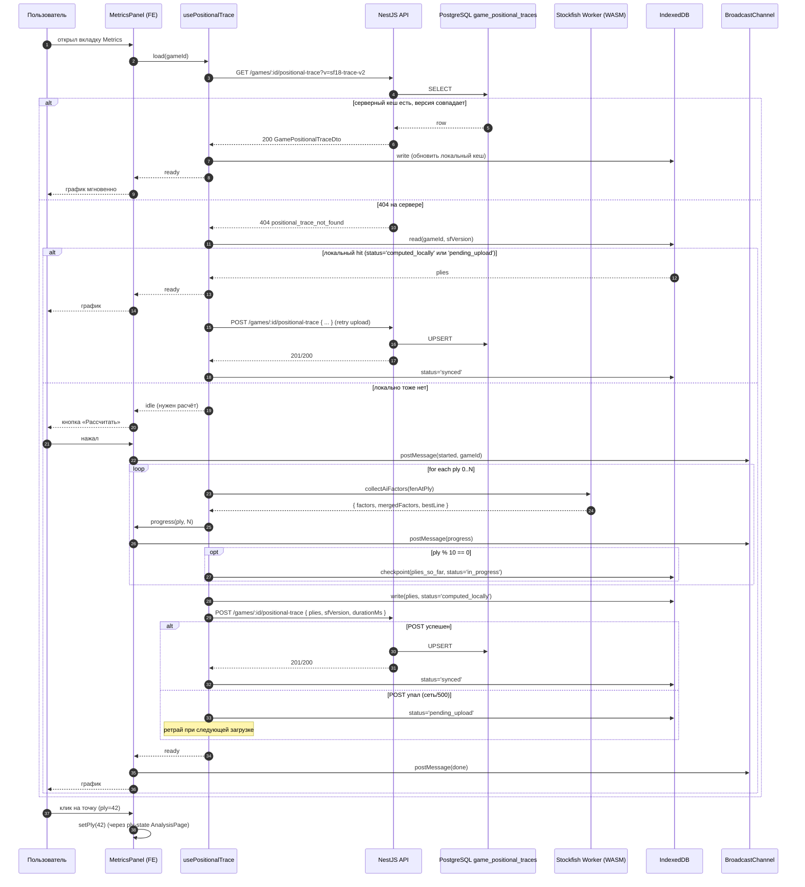
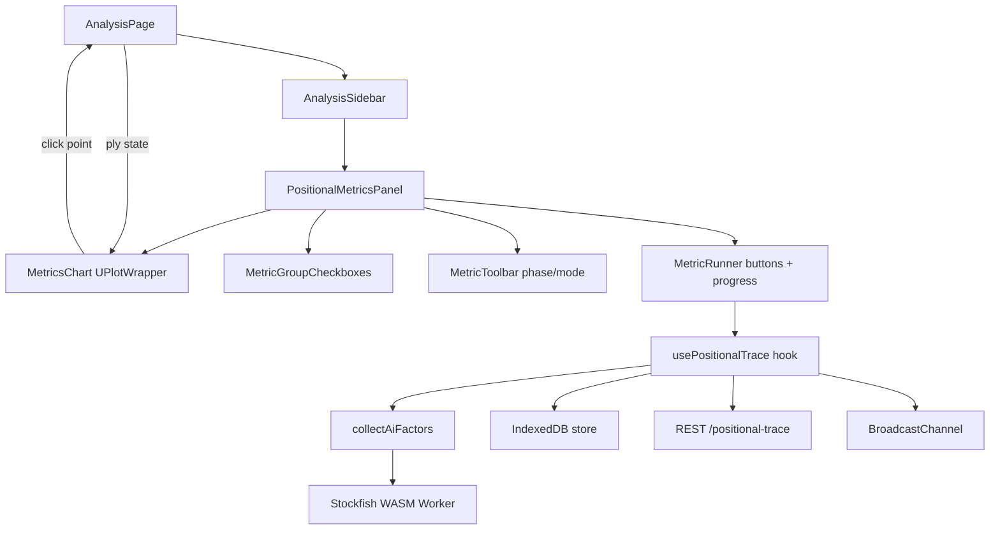
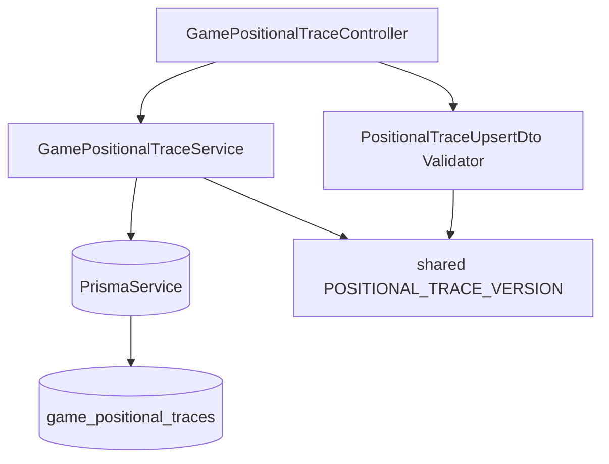

# ADR-122: Аналитика динамики позиционных метрик Stockfish по ходам партии

**Статус:** Принято к реализации (решение пользователя по KS-4022: расчёт на клиенте + хранение сразу на сервере)
**Дата:** 2026-06-09
**Задача:** KS-4022
**Связанные ADR:** [ADR-100](./100-nag-auto-annotation-stockfish-maia.md), [ADR-103](./103-llm-move-comments-mvp2.md), [ADR-107](./107-positional-features-without-stockfish-fork.md), [ADR-108](./108-ai-position-comment-ux.md), [ADR-108b](./108b-ai-position-comment-board-overlay.md), [ADR-109](./109-game-review-per-move-endpoint.md)

## 1. Контекст

### 1.1 Что есть сейчас

- **`collectAiFactors`** (`apps/web/src/lib/review/collectAiFactors.ts`) — чистая функция: на одну позицию делает `evalTrace(fenBefore)` + `engineProbe()` (Stockfish-18-lite, ≤ 8 сек) + `evalTrace(terminalFen)` (если probe дал PV), затем `mergeFactors` отдаёт `ReadonlyArray<PositionalSubterm | { id }>`. Это те же данные, что улетают на сервер для AI-комментариев (ADR-108/108b).
- **`PositionalSubterm`** (shared types, `api-contracts.ts:1802`) — `{ id, square?, color?, value_mg, value_eg }`. ~50 различных `id` (от `pawn_doubled` до `threat_by_minor`, `space`, `king_danger`, `material`, `imbalance`). На одной позиции один `id` может присутствовать многократно — по разным `square`/`color`.
- **`useGameReview`** (`apps/web/src/hooks/useGameReview.ts`) — ход за ходом по партии прогоняет Stockfish (multipv) и Maia, классифицирует ходы. Для AI-комментариев параллельно собирает парные `before`/`after` снимки `PositionalSubterm[]` и шлёт через `POST /analyses/review/move-comment` (ADR-109).
- **`AnalysisPage`** — общий каркас, шарит `ply`-state с доской, деревом ходов, движком. Отдельной страницы «анализ по партии» нет — всё на `/analysis/:id`.
- **Хранение:** `GameAnalysis(analysisPgn)`, `GameReport(moves)` — для PGN-аннотаций и accuracy. **Таблицы под `positional_subterms` по ply нет.**
- **Devtools:** `window.__ksPositionalDiff()` / `window.__sfTrace()` — в консоли тот же массив на текущей позиции.

### 1.2 Что хочет пользователь

Линейный график: ось X — полуходы партии, ось Y — значение позиционной метрики. На одном графике — несколько метрик (выбор чекбоксами). Клик по точке — доска перелистывается на этот ply. Возможность сравнивать динамику, видеть резкие пики и спады.

### 1.3 Стоимость расчёта

| Операция | Время (типичное) |
| --- | --- |
| Один `evalTrace(fen)` | 100–300 мс (Stockfish WASM, depth 18) |
| Один `engineProbe()` (multipv=1, depth 20+) | 1–5 сек |
| Один полный `collectAiFactors` | 2 × `evalTrace` + 1 × probe ≤ **8 сек** (потолок) |
| Партия 80 полуходов × 5 сек | **6–8 минут** в браузере |

Партия 30 полуходов — 2–3 минуты, терпимо. Партия 100+ — нет.

### 1.4 Решение по KS-4022 (зафиксировано пользователем)

**Гибрид:** расчёт на клиенте через `collectAiFactors`, сразу же отправка на сервер для постоянного хранения в БД. Повторное открытие партии — мгновенное чтение из БД, без пересчёта.

Это решение в ADR раскрывается ниже: единый поток данных, единый набор обработчиков, единая модель БД. Поэтапное «MVP → расширение» (в раннем черновике этого ADR были этапы 1/2/3) **снято** — реализуем гибрид сразу.

### 1.5 Что НЕ в скоупе

- Изменение алгоритма `evalTrace` / `engineProbe`.
- Перенос Stockfish на сервер (CLI-пул для production-расчёта) — отдельный вопрос на будущее (см. §11 как возможная эволюция).
- Аналитика-агрегаты пользователя (среднее `king_danger` по 100 партиям) — отдельный пласт.
- Маркировка позиций по паттернам.
- Сравнение партии с эталоном (база GM-партий).

## 2. Решение — единый поток

### 2.1 Цепочка

```
Открыли /analysis/:gameId → вкладка Metrics
  ↓
GET /games/:gameId/positional-trace?v=<sfVersion>
  ↓                          ↘  (404 / разная версия)
  200 → рисуем график          fallback в IndexedDB (см. §6.3)
                                ↓ нет          ↓ есть и version совпал
                              UI «Рассчитать»  рисуем + POST на сервер
                                ↓
                              запуск collectAiFactors по всем ply
                              (Web Worker, прогресс, отмена)
                                ↓
                              IndexedDB checkpoint каждые 10 ply
                                ↓
                              после завершения:
                              POST /games/:gameId/positional-trace
                                ↓
                              200 → рисуем, кеш на сервере
                                ↓
                              следующее открытие → GET → 200 мгновенно
```

### 2.2 Где живёт расчёт

**На клиенте через Stockfish WASM.** Использует тот же worker, что Engine-таб и AI-комментарии. Никакой серверный Stockfish не вводим — это сэкономит инфраструктурную работу и убирает риск расхождения версий движка между клиентом и сервером.

Цена — медленный первый раз у каждой партии (минуты). Это приемлемо: пользователь делает «Рассчитать» осознанно, видит прогресс-бар, может отменить.

### 2.3 Где живёт хранение

**На сервере в новой таблице `GamePositionalTrace`.** Одна запись на партию, версионирование через `sfVersion`. UPSERT при сохранении, простой SELECT при чтении.

Запись доступна всем, у кого есть доступ к партии (по существующим правилам публичности `Game`). Один раз кто-то посчитал — все следующие открывают мгновенно.

## 3. Контракт API

### 3.1 Эндпоинты (три обработчика)

#### `GET /games/:gameId/positional-trace?v=<sfVersion>`

**Доступ:** публично (как просмотр `Game`).
**Параметры:**
- `:gameId` — UUID партии.
- `v` (query, обязательный) — версия формата, которую ожидает клиент. Строка, см. §3.3.

**Поведение:**
- Запись существует, `sfVersion == v` → `200 OK` с телом:
  ```ts
  {
    gameId: string;
    sfVersion: string;
    plies: Array<{
      ply: number;
      subterms: PositionalSubterm[];
      phase?: number;  // степень эндшпильности 0..256 (опц., для tapered)
    }>;
    durationMs: number | null;
    createdAt: string;  // ISO
    updatedAt: string;
  }
  ```
- Запись отсутствует **или** `sfVersion != v` → `404 Not Found` с телом `{ error: 'positional_trace_not_found' }`. Клиент дальше идёт в IndexedDB / запускает расчёт.

**Кеш-контроль:** `Cache-Control: private, max-age=300` (5 минут на стороне клиента; обновится при инвалидации через DELETE или новой версии).

#### `POST /games/:gameId/positional-trace`

**Доступ:** `JwtAuthGuard` (требует авторизацию). Любой авторизованный пользователь с доступом к партии может писать.
**Тело:**
```ts
{
  sfVersion: string;        // строго совпадает с текущим POSITIONAL_TRACE_VERSION
  plies: Array<{
    ply: number;            // 0..N, монотонно возрастает, без дыр
    subterms: PositionalSubterm[];  // валидация по shared-типу
    phase?: number;         // 0..256, опц.
  }>;
  durationMs?: number;      // сколько занял расчёт у клиента (для аналитики)
}
```

**Поведение:**
- Валидация (DTO-валидатор): `sfVersion` совпадает с серверной константой, `plies` непустой и монотонный, размер payload ≤ 256 KB, `value_mg`/`value_eg` в диапазоне [-50, 50].
- UPSERT по UNIQUE `gameId`. Старая запись (любой версии) затирается.
- `201 Created` (при первом сохранении) или `200 OK` (при перезаписи) с тем же телом, что у `GET`.
- При расхождении версий — `400 Bad Request` с `{ error: 'sf_version_mismatch', expected: <server>, got: <client> }`.

**Идемпотентность:** UPSERT гарантирует, что повторный POST с тем же содержимым не создаст дубликат. Гонка двух пользователей — последний выигрывает, оба видят валидный результат (содержимое детерминировано — Stockfish при той же версии и FEN даёт совпадающие числа).

#### `DELETE /games/:gameId/positional-trace`

**Доступ:** `JwtAuthGuard` + проверка прав:
- владелец партии (`Game.whitePlayerId == userId` или `Game.blackPlayerId == userId`), либо
- админ (`User.isAdmin` или соответствующая роль, если введена).

**Поведение:**
- Удаляет запись `GamePositionalTrace WHERE gameId = ?`.
- `204 No Content` независимо от того, была ли запись (идемпотентно).
- Триггер для удаления — преимущественно админ-инструмент или повторный расчёт после смены версии Stockfish. Обычный пользователь редко вызывает.

### 3.2 Версия формата

Константа в `packages/shared/src/constants/positional.ts`:
```ts
export const POSITIONAL_TRACE_VERSION = 'sf18-trace-v2';
```

Меняется при:
- смене набора `PositionalSubtermId` (добавили/убрали ids),
- изменении парсера `evalTrace`,
- переходе на новую версию Stockfish с другими числами.

Клиент при запуске страницы читает константу из shared и шлёт её в `GET` и `POST`. Расхождение версий означает «кеш протух» — пересчитать.

### 3.3 Shared-типы

`packages/shared/src/types/api-contracts.ts`:

```ts
export interface PositionalTracePly {
  ply: number;
  subterms: PositionalSubterm[];
  phase?: number;
}

export interface GamePositionalTraceDto {
  gameId: string;
  sfVersion: string;
  plies: PositionalTracePly[];
  durationMs: number | null;
  createdAt: string;
  updatedAt: string;
}

export interface PositionalTraceUpsertDto {
  sfVersion: string;
  plies: PositionalTracePly[];
  durationMs?: number;
}

export type PositionalTraceErrorCode =
  | 'positional_trace_not_found'
  | 'sf_version_mismatch'
  | 'positional_trace_too_large'
  | 'positional_trace_invalid';
```

## 4. Схема БД

```prisma
model GamePositionalTrace {
  id          String   @id @default(uuid()) @db.Uuid

  /// UNIQUE — одна запись на партию. Эволюция через `sfVersion`:
  /// при несовпадении старая запись затирается UPSERT'ом.
  gameId      String   @unique @map("game_id") @db.Uuid
  game        Game     @relation(fields: [gameId], references: [id], onDelete: Cascade)

  /// Идентификатор версии Stockfish + формата трассы (ADR-107).
  /// При смене (`POSITIONAL_TRACE_VERSION` в shared) — кеш устарел,
  /// клиент получит 404 и пересчитает.
  sfVersion   String   @map("sf_version")

  /// Массив { ply, subterms: PositionalSubterm[], phase? } по всем полуходам.
  /// 80 полуходов × 50 subterms × ~6 полей ≈ 24 KB. JSONB + TOAST автоматически жмёт.
  plies       Json     @map("plies")

  /// Кто запустил расчёт (для аналитики, не для авторизации).
  createdById String?  @map("created_by_id") @db.Uuid
  createdBy   User?    @relation(fields: [createdById], references: [id], onDelete: SetNull)
  /// Сколько занял расчёт у клиента (мс).
  durationMs  Int?     @map("duration_ms")

  createdAt   DateTime @default(now()) @map("created_at")
  updatedAt   DateTime @updatedAt @map("updated_at")

  @@index([sfVersion, createdAt])
  @@map("game_positional_traces")
}
```

**Размер таблицы (оценка):** 1 запись × ~24 KB на партию × 10000 партий = ~240 MB. На горизонте 100K партий — ~2.4 GB. Терпимо.

**Cascade:** удаление `Game` сносит запись (логично — данные привязаны к партии).

## 5. Локальный кеш (IndexedDB) — оставляем

### 5.1 Зачем он нужен при наличии серверного хранения

Решение **оставить** IndexedDB как промежуточный слой между расчётом и серверным сохранением. Три явных причины:

1. **Чекпоинты при долгом расчёте.** Партия 80 полуходов считается ~5 минут. Если пользователь закрыл вкладку на 60-м полуходе, без локального чекпоинта мы потеряем 4 минуты работы. С чекпоинтом каждые 10 ply — продолжение с последней сохранённой точки.
2. **Защита от сбоя POST на сервер.** Клиент посчитал 5 минут, POST на сервер упал по сети. Без IndexedDB — данные потеряны, пересчёт. С IndexedDB — результат лежит локально, ретрай POST на следующем visit'е, либо пользователь видит «расчёт сохранён только локально, попробуем загрузить позже».
3. **Чтение при отсутствии сети.** Если пользователь оффлайн или сервер 500 — `GET` упал, идём в IndexedDB. Лучше показать свои данные, чем пустую страницу.

### 5.2 Что НЕ делаем

IndexedDB **не первичный источник**. Поток всегда начинается с `GET` на сервер. Локальный кеш — fallback и временное хранилище в процессе/после расчёта.

Не делаем «сравнение версий между local и server» — версии и так идентичны (общая константа `POSITIONAL_TRACE_VERSION`). Если local старее version — это значит, что данные считались на старом коде; не пытаемся их использовать, удаляем при чтении.

### 5.3 Стратегия записи

| Момент | Запись в IndexedDB |
| --- | --- |
| Получили `GET 200` с сервера | Да — обновляем локальный кеш свежими данными (на случай ухода в оффлайн) |
| Считаем партию, каждые 10 ply | Да — чекпоинт `{ ply, plies[]_so_far, status:'in_progress' }` |
| Завершили расчёт | Да — финальный `{ plies[], status:'computed_locally' }` |
| POST на сервер прошёл успешно | Обновляем `status:'synced'`, остаётся до 30 дней |
| POST упал | Оставляем `status:'pending_upload'`, ретрай при следующей загрузке страницы |
| `GET 404 + IndexedDB hit + status='computed_locally'` | Загружаем из локального, асинхронно POST на сервер |
| `GET 200` свежее, чем local | Перезаписываем local |

### 5.4 TTL и место

- TTL 30 дней (LRU при превышении квоты браузера).
- Ключ: `positional:<gameId>:<sfVersion>`.
- Размер записи такой же, как на сервере (~24 KB на партию). IndexedDB-квота браузера обычно ≥ 50 MB — поместятся тысячи партий.

## 6. Расчёт на клиенте — детали

### 6.1 Worker

Тот же Stockfish WASM worker, что используется для Engine-таба и AI-комментариев. Не создаём второй — конфликт за CPU.

Очередь:
```
for ply in 0..N:
  result[ply] = await collectAiFactors({
    fen: fenAtPly(ply),
    engineProbe,
    probeTimeoutMs: 8000,
  })
  // обновляем UI прогресса
  if ply % 10 == 0: checkpoint в IndexedDB
```

Если worker занят (Engine-таб или `useGameReview` идёт) — встаём в очередь, UI показывает «движок занят, ждём окончания…».

### 6.2 Прогресс и отмена

UI-состояния `usePositionalTrace(gameId)`:
- `idle` — ничего не делали, ждём кнопки «Рассчитать».
- `loading` — `GET` идёт.
- `running` — расчёт в процессе, прогресс `N / total`.
- `ready` — данные есть (из сервера или после расчёта).
- `cancelled` — пользователь нажал «Отмена».
- `error` — ошибка (показываем тост, кнопка «Повторить»).

Отмена: `worker.terminate()` + `AbortController` для последующих ply. Частично сохранённое — остаётся в IndexedDB с `status:'cancelled'`, при следующем заходе пользователь видит «у вас есть незавершённый расчёт на 42-м из 80, продолжить?».

### 6.3 Расширение `useGameReview`

`useGameReview` (ADR-100/109) уже идёт по партии для классификации ходов и AI-комментариев. На каждом ply он **уже** имеет `factors_before` через `buildSnapshotFactors` (для запроса `position-comment`).

Чтобы не считать дважды, **расширяем `useGameReview` опциональной галкой «также собрать позиционные метрики» (default ON)**: при включённой галке хук пишет `{ ply, subterms: factors_before }` в свой накопитель и в конце разбора отправляет `POST /games/:gameId/positional-trace`.

Стоимость дополнительная — ноль времени (данные и так считаются). Это **главная экономия**: пользователь, делающий «Полный разбор партии», бесплатно получает наполненный кеш.

### 6.4 BroadcastChannel между табами

Если пользователь открыл две вкладки `/analysis/:gameId` и в одной запустил расчёт — вторая не должна стартовать тот же расчёт.

`BroadcastChannel('positional-trace:<gameId>')` шлёт события `started` / `progress` / `done` / `cancelled`. Вторая вкладка слушает — если кто-то другой считает, своя кнопка «Рассчитать» дезактивирована, показывается прогресс из другой вкладки. По окончании — обе делают `GET` и видят свежие данные на сервере.

## 7. Метрики и агрегация

### 7.1 Структурная проблема

`PositionalSubterm[]` — плоский поток измерений. На одной позиции один `id` может встречаться многократно (например, `pawn_connected` на каждой связной пешке). Для графика нужен **скаляр** `(ply, метрика, сторона)`.

### 7.2 Режимы агрегации

| Режим | Описание | Когда полезен |
| --- | --- | --- |
| **A. По стороне** (две линии) | Для каждой метрики — линия «у белых» (сумма `value` где `color='w'`) и «у чёрных» (`color='b'`). | Базовое сравнение «у кого больше». |
| **B. Разница** (одна линия) | Одна линия `Б−Ч`. Положительные — за белых. | Компактнее, меньше шума. **Default.** |
| **C. Индивидуальные поля** | Точки по каждому `(square, color)`, без агрегации. | Глубокая диагностика «какая именно фигура». Доступен только при одной выбранной метрике. |

### 7.3 Фаза (mg / eg / mix)

`PositionalSubterm` имеет `value_mg` и `value_eg`. Переключатель `phase: 'mg' | 'eg' | 'mix'`. Default — `mix` (tapered: `(mg * phase + eg * (MAX - phase)) / MAX`, где `phase` — степень эндшпильности позиции, идёт из payload `plies[].phase`).

### 7.4 Группировка по разделам

50 чекбоксов разом нечитабельны. Группировка по разделам Stockfish (`POSITIONAL_SUBTERM_GROUPS` в shared):

| Группа | Подкомпоненты |
| --- | --- |
| Пешки | `pawn_doubled_early`, `pawn_connected`, `pawn_doubled`, `pawn_isolated`, `pawn_backward`, `pawn_lever_double`, `pawn_blocked` |
| Защита короля | `king_shelter_strength`, `king_blocked_storm`, `king_unblocked_storm`, `king_on_file`, `king_safety_pawn`, `king_danger`, `king_safe_check_*`, `king_pawnless_flank`, `king_flank_attacks`, `king_attackers_count`, `king_attackers_weight` |
| Лёгкие фигуры | `outpost_knight`, `outpost_bishop`, `knight_uncontested_outpost`, `knight_reachable_outpost`, `minor_behind_pawn`, `knight_king_protector_distance`, `bishop_king_protector_distance`, `bishop_pawns`, `bishop_xray_pawns`, `bishop_long_diagonal`, `bishop_cornered`, `mobility_knight`, `mobility_bishop` |
| Тяжёлые фигуры | `rook_on_king_ring`, `bishop_on_king_ring`, `rook_on_open_file`, `rook_on_closed_file`, `rook_trapped`, `queen_weak`, `mobility_rook`, `mobility_queen` |
| Угрозы | `threat_by_minor`, `threat_by_rook`, `threat_by_king`, `threat_hanging`, `threat_weak_queen_protection`, `threat_restricted_piece`, `threat_by_safe_pawn`, `threat_by_pawn_push`, `threat_knight_on_queen`, `threat_slider_on_queen` |
| Проходные | `passed_rank`, `passed_king_proximity`, `passed_path_advance`, `passed_file_edge` |
| Пространство | `space` |
| Материал | `material`, `imbalance` |

### 7.5 Default-набор при первом открытии

Чтобы пользователь сразу видел что-то осмысленное, без необходимости ковыряться в чекбоксах:
- `king_danger` (разница, mix)
- `material` (разница, mix)
- `space` (разница, mix)
- `passed_rank` (если в партии есть проходные)
- `threat_hanging` (если ненулевое)

## 8. UI

### 8.1 Где живёт

**Вкладка `Metrics` в правой колонке `AnalysisPage`** — рядом с `Engine`, `Tree`, `Chat` (ADR-121). Для desktop: чекбоксы группой-аккордеоном, график uPlot высотой ~400 px, кнопка «Развернуть» (полноэкранный overlay).

**Mobile:** 5-й таб в `analysis-mobile-panel` (`moves | engine | tree | ai | metrics`). График ~350 px, чекбоксы свёрнуты в дропдаун.

### 8.2 Sync с доской

Клик на точку графика → `setPly(targetPly)` через общий `ply`-state `AnalysisPage`. Доска и дерево обновляются. Никаких отдельных запросов.

Hover (desktop) → tooltip со значениями всех видимых метрик. Tap (mobile) → фиксированный tooltip снизу.

Двойной клик на точку → «детализация» (режим C для одной метрики, разбивка по `square`).

### 8.3 Библиотека графиков

**uPlot.** Bundle ~10 KB gzip, отлично рендерит до 50K точек на canvas, минимально влияет на TTI. Wrapper `<UPlotChart data={...} />`, lazy-import (бандл подгружается только при первом открытии вкладки Metrics).

Альтернативы:
- recharts (~70 KB, заметные лаги на 1000+ точках) — отвергнут.
- visx (~50 KB, низкоуровневый D3 + React) — fallback, если uPlot не хватит для кастомизации.
- Chart.js / ECharts — bundle слишком крупный для одной вкладки.

### 8.4 Тема и цвета

- Палитра линий — из общей темы (используем `AiOverlayColor` ADR-108b как референс).
- `prefers-color-scheme` — dark/light.
- Keyboard nav: стрелки ←/→ перелистывают active-ply (синхронно с доской).

## 9. Поток данных

### 9.1 Единый sequence



### 9.2 Компоненты frontend



### 9.3 Модули backend



## 10. Объём работ — нарезка для координатора

### 10.1 Backend (одна задача)

- Миграция Prisma `GamePositionalTrace` (см. §4).
- Модуль `apps/api/src/games/positional-trace/`:
  - `GamePositionalTraceController` — три обработчика (`GET`/`POST`/`DELETE`).
  - `GamePositionalTraceService` — UPSERT, SELECT, DELETE.
  - DTO с class-validator: `PositionalTraceUpsertDto`, проверка `sfVersion`, монотонности `ply`, диапазонов `value_mg`/`value_eg`, размера payload ≤ 256 KB.
- Регистрация модуля.
- Shared-типы: `GamePositionalTraceDto`, `PositionalTraceUpsertDto`, `PositionalTracePly`, `POSITIONAL_TRACE_VERSION` константа.
- Тесты: smoke на CRUD, проверка `sf_version_mismatch`, валидация DTO.

### 10.2 Frontend (одна задача)

- Хук `usePositionalTrace(gameId)` — оркестрация GET → IndexedDB → расчёт → POST, прогресс, отмена.
- API-клиент: `getPositionalTrace`, `postPositionalTrace`, `deletePositionalTrace` в `apps/web/src/api/`.
- IndexedDB-стор: `positional-trace-store.ts` с операциями read/write/checkpoint.
- BroadcastChannel-обёртка.
- Компоненты:
  - `<PositionalMetricsPanel>` — основной контейнер (desktop + mobile-таб).
  - `<MetricsChart>` — обёртка над uPlot.
  - `<MetricGroupCheckboxes>` — аккордеон по группам.
  - `<MetricToolbar>` — переключатели режима/фазы.
  - `<MetricRunner>` — кнопка «Рассчитать», прогресс-бар, отмена.
- Регистрация вкладки в `AnalysisSidebar` (desktop + mobile).
- Расширение `useGameReview` — опциональная галка «также собрать позиционные метрики» (default ON), накопитель `subterms` per ply, POST в конце.
- Lazy-import uPlot.
- Тесты: хук (моки worker'а и API), агрегация по стороне/разнице, контракт чекпоинтов.

### 10.3 Что НЕ в задачах

- Серверный расчёт Stockfish — не делаем, это эволюция на будущее (см. §11).
- Аналитика-агрегаты по партиям пользователя — отдельный пласт.
- Сравнение партий между собой — отдельная фича.

## 11. Эволюция (если потребуется)

Если массовое использование покажет, что клиентский расчёт — узкое место (например, бюджетные устройства не справляются за разумное время), возможна эволюция:

- **Серверный Stockfish.** Пул CLI-инстансов, очередь BullMQ, async-job с прогрессом через WS. Финализатор пишет в ту же `GamePositionalTrace`. Контракт REST не меняется — добавляется `POST /games/:id/positional-trace/job` рядом.

Это **отдельный ADR при появлении необходимости**, не делаем сейчас.

## 12. Альтернативы (краткий обзор)

- **Только клиент, без хранения.** Каждый раз пересчёт у каждого пользователя. Отвергнуто пользователем — слишком медленно при повторных открытиях.
- **Только сервер (Stockfish CLI с самого начала).** Большая инфраструктурная работа, риск расхождения версий с клиентским WASM. Отложено как эволюция (см. §11).
- **Хранить как JSONB в `GameReport`.** `GameReport` отвечает за PGN-аннотации и accuracy — разные обязанности. Отвергнуто.
- **Строка-на-ply (`GamePositionalSnapshot`).** Не даёт преимуществ для нашего UI (всегда читаем целиком); сложнее UPSERT. Отвергнуто.
- **Несколько версий хранить параллельно.** Лишнее место без ценности. Одна актуальная.
- **uPlot → recharts.** Бандл 70 KB против 10 KB, лаги на больших датасетах. Отвергнуто.
- **Не давать режим C (индивидуальные поля).** Лишает диагностической ценности для опытных пользователей. Оставлен как режим «одна метрика выбрана».

## 13. Риски и подводные камни

1. **Расхождение версий Stockfish между клиентами.** Один пользователь посчитал на Stockfish-X, другой видит у себя Y. Митигация: `POSITIONAL_TRACE_VERSION` строго привязан к версии WASM-бандла; при обновлении движка меняется константа, серверная запись инвалидируется по 404, пересчёт.

2. **Клиент шлёт битые данные.** Валидация DTO на сервере (диапазоны, монотонность, размер). 400 на нарушение. В худшем случае запись затирается следующим валидным.

3. **Браузер закрыт во время расчёта.** IndexedDB-чекпоинт каждые 10 ply. При reopen — продолжаем с последнего, не теряем работу.

4. **Бюджетные устройства.** На старых телефонах WASM работает медленно, расчёт партии 80 ходов может занять 15+ минут. UI показывает оценку времени, рекомендует считать на desktop. Эволюция через серверный Stockfish (§11).

5. **Stockfish WASM memory.** На длинных партиях держится своя TT. Между ply делаем `ucinewgame` (уже делает `evalTrace`).

6. **Worker занят другим (Engine-таб / `useGameReview`).** Очередь, индикатор «движок занят».

7. **Конфликт `mergedFactors` vs `factors`.** Для графика используем `factors` (реальная позиция, без projection через лучшую линию). `mergedFactors` — для LLM (план + терминал), не нужен для линейной аналитики.

8. **Дебют как «плоский» график.** `space`, `king_danger` в дебюте близки к нулю — линии плоские. Это правильное поведение.

9. **PGN с вариантами.** Считаем только main-line (как `useGameReview`). Анализ вариантов — отдельная фича на потом.

10. **Кросс-таб гонка.** BroadcastChannel сигнализирует «считаю» — вторая вкладка не запускает свой расчёт.

11. **POST упал по сети.** IndexedDB хранит результат с `status='pending_upload'`, ретрай при следующем открытии страницы.

12. **Мат-серии и резкие пики.** На `score.type='mate'` `king_danger` уходит в максимум. График правильно отражает реальность; интерпретация — UX-задача (можно подсветить ход с матом).

## 14. Acceptance — соответствие задаче KS-4022

| Требование | Где в ADR | Решение |
| --- | --- | --- |
| Источник данных и расчёт | §2.2, §6 | Клиент через Stockfish WASM, `collectAiFactors`. Web Worker, прогресс, отмена. |
| Хранение / кеш | §2.3, §4, §5 | На сервере — таблица `GamePositionalTrace`, одна запись на партию, версионирование `sfVersion`. На клиенте — IndexedDB как чекпоинт-буфер и fallback. |
| Контракт API | §3 | `GET /games/:gameId/positional-trace?v=` (публично), `POST` (JwtAuth), `DELETE` (owner/admin). Тело: `{ sfVersion, plies, durationMs? }`. |
| Метрики и агрегация | §7 | Три режима (стороны/разница/индивидуальные), default — разница. Фаза mg/eg/mix, default mix. 8 групп subterm. Default-набор из 5 метрик. |
| UI | §8 | Вкладка `Metrics` в `AnalysisPage` (desktop + mobile-таб). uPlot. Клик на точку → доска. |
| Производительность | §6 | Один Worker, очередь по ply, IndexedDB-чекпоинт каждые 10, BroadcastChannel между табами. |
| Связь с существующим | §6.3 | Расширение `useGameReview` (галка default ON) — попутный сбор без доп. времени. |
| Mermaid поток данных | §9 | Единый sequence + frontend-компоненты + backend-модули. |
| Объём работ | §10 | Одна backend-задача (миграция + три обработчика + DTO + shared), одна frontend-задача (хук, API-клиент, IDB, компоненты, расширение `useGameReview`, uPlot). |
| Задачи разработчикам не создавать | — | Соблюдено. |

## 15. Связь с соседними ADR

- **ADR-100** — оркестратор `useGameReview` по партии. Расширяется галкой «также собрать позиционные метрики».
- **ADR-103** — LLM-комментарии MVP-2 (`PositionalSubterm[]` через `position-comment`). Использует тот же `collectAiFactors`. Не пересекаемся по контракту.
- **ADR-107** — извлечение `positional_subterms` через расширенный `Trace` SF. Источник истины для подкомпонент. ADR-122 — потребитель.
- **ADR-108 / ADR-108b** — UX AI-комментариев на позиции. Те же subterms, другой триггер. Без пересечений.
- **ADR-109** — per-move-эндпоинт «Полного разбора». Расширение `useGameReview` затрагивает тот же хук, новый POST идёт параллельно.
