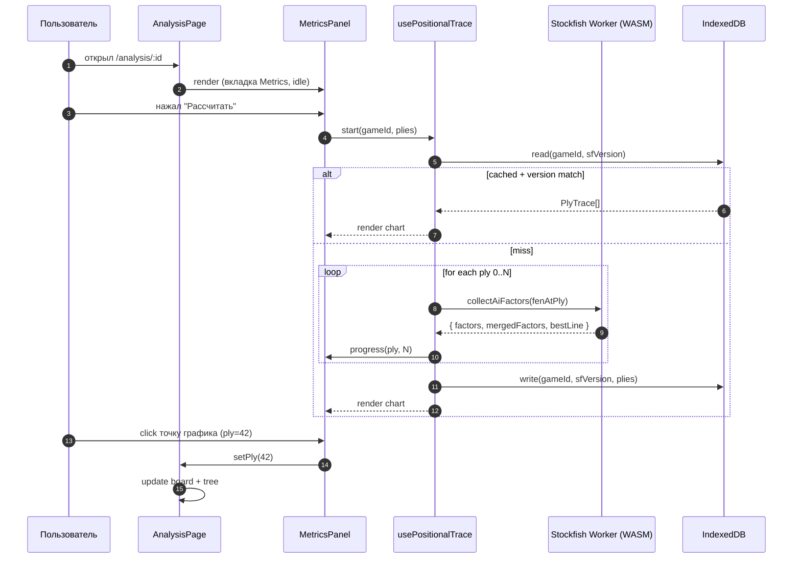
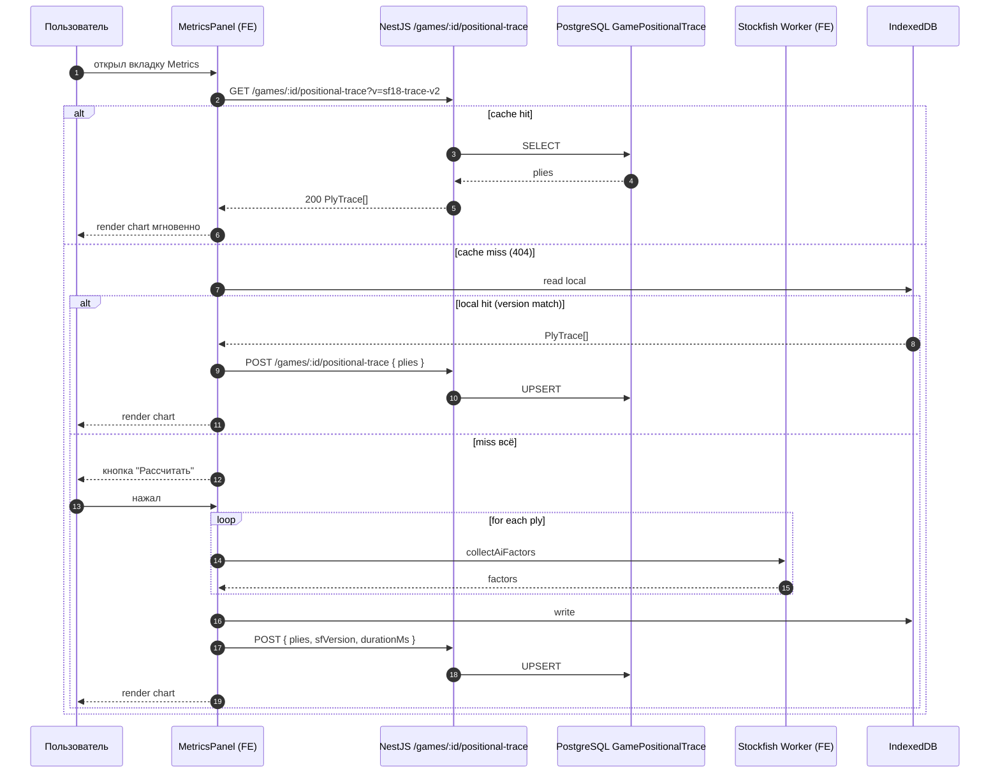
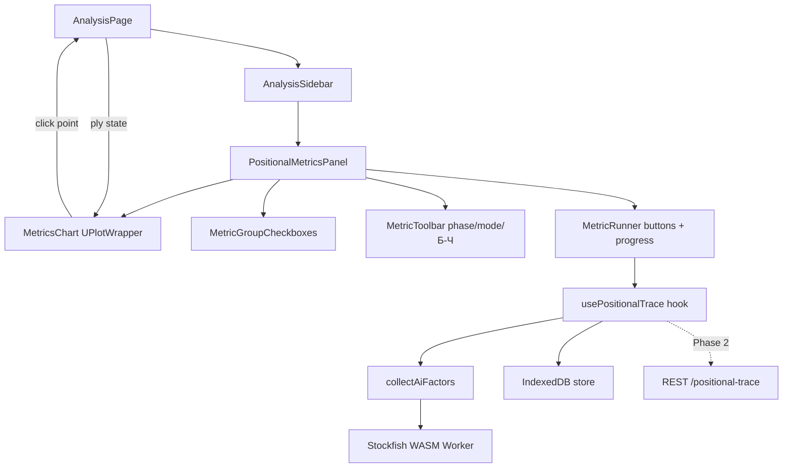

# ADR-122: Аналитика динамики позиционных метрик Stockfish по ходам партии

**Статус:** Предложено (черновик к обсуждению с пользователем; задачи разработчикам пока не создавать)
**Дата:** 2026-06-09
**Задача:** KS-4022
**Связанные ADR:** [ADR-100](./100-nag-auto-annotation-stockfish-maia.md), [ADR-103](./103-llm-move-comments-mvp2.md), [ADR-107](./107-positional-features-without-stockfish-fork.md), [ADR-108](./108-ai-position-comment-ux.md), [ADR-108b](./108b-ai-position-comment-board-overlay.md), [ADR-109](./109-game-review-per-move-endpoint.md)

## 1. Контекст

### 1.1 Что есть сейчас

- **`collectAiFactors`** (`apps/web/src/lib/review/collectAiFactors.ts`) — чистая функция: на одну позицию делает `evalTrace(fenBefore)` + `engineProbe()` (Stockfish-18-lite, ≤ 8 сек) + `evalTrace(terminalFen)` (если probe дал PV), затем `mergeFactors` отдаёт `ReadonlyArray<PositionalSubterm | { id }>`. Это те же данные, что улетают на сервер для AI-комментариев (ADR-108/108b).
- **`PositionalSubterm`** (shared types, `api-contracts.ts:1802`) — `{ id, square?, color?, value_mg, value_eg }`. ~50 различных `id` (от `pawn_doubled` до `threat_by_minor`, `space`, `king_danger`, `material`, `imbalance`). На одной позиции один `id` может присутствовать многократно — по разным `square`/`color` (например, `pawn_connected` отдельно на каждой пешке стороны).
- **`useGameReview`** (`apps/web/src/hooks/useGameReview.ts`) — ход за ходом по партии прогоняет Stockfish (multipv) и Maia, классифицирует ходы (`classifyMove`), собирает `Annotation[]`. На 80 полуходов ≤ 40 сек p95 (ADR-100 §7). Для AI-комментариев параллельно вызывает `POST /analyses/review/move-comment` с парными `before`/`after` снимками `PositionalSubterm[]` (ADR-109).
- **`AnalysisPage`** — общий каркас, шары `ply`-state с доской, деревом ходов, движком. Отдельной страницы «анализ по партии» нет — всё происходит на `/analysis/:id`.
- **Хранение:** `GameAnalysis(analysisPgn)` хранит PGN с аннотациями, `GameReport(moves)` — JSON с per-ply Stockfish-метриками для уже существующего «отчёта по партии». **Никакой таблицы под `positional_subterms` по ply нет.**
- **Devtools:** `window.__ksPositionalDiff()` / `window.__sfTrace()` — в консоли можно получить тот же массив на текущей позиции.

### 1.2 Что хочет пользователь

Видеть на отдельном экране (или вкладке) линейный график, где по оси X — полуходы партии, по оси Y — значение позиционной метрики. На одном графике — несколько метрик одновременно (выбор чекбоксами). Клик по точке — доска перелистывается на этот ply. Возможность сравнить «до и после» по любой метрике, увидеть резкий всплеск или спад.

### 1.3 Стоимость расчёта

| Операция | Время (типичное) |
| --- | --- |
| Один `evalTrace(fen)` | 100–300 мс (Stockfish WASM, depth 18) |
| Один `engineProbe()` (multipv=1, depth 20+) | 1–5 сек (зависит от позиции) |
| Один полный `collectAiFactors` | 2 × `evalTrace` + 1 × probe ≤ **8 сек** (потолок) |
| Партия 80 полуходов × 5 сек | **6–8 минут** в браузере |

Партия 30 полуходов укладывается в 2–3 минуты — терпимо. Партия 100+ — нет.

### 1.4 Что нужно решить

Шесть развилок задачи KS-4022:

1. **Источник данных** — клиент vs сервер.
2. **Хранение** — JSONB-поле в существующей таблице vs новая таблица vs ничего.
3. **Агрегация** — по стороне / по разнице / индивидуальные поля.
4. **UI** — где живёт экран, как выглядит.
5. **Производительность** — Web Worker, прогресс, отмена.
6. **Связь с `useGameReview`/`position-comment`** — переиспользование.

Плюс **сквозной вопрос координатора:** для каждой развилки явно указать роль backend — нужен ли, в каком объёме (эндпоинт, Redis, очередь, БД). Это нужно для нарезки задач после обсуждения.

### 1.5 Что НЕ в скоупе

- Изменение алгоритма `evalTrace` / `engineProbe`.
- Перенос Stockfish на сервер (CLI-инстансы) для production-расчёта — обсуждаем как опцию Phase 3, но без проектирования.
- Аналитика по агрегатам пользователя (среднее `king_danger` по 100 партиям) — отдельный пласт.
- Маркировка позиций по позиционным паттернам (вроде «здесь типичный bishop_pawns») — отдельный ADR.
- Сравнение партии с эталоном (база GM-партий).

## 2. Развилка 1 — источник данных и расчёт

### 2.1 Варианты

| Вариант | Описание | Pro | Contra |
| --- | --- | --- | --- |
| **C1. Только клиент (Stockfish WASM)** | На каждый ply гонимся через `collectAiFactors`. Web Worker. Прогресс. Отмена. | Нулевой backend. Уже работает. Простая разработка. | Долго на длинных партиях. Браузер должен оставаться открытым. Каждый пользователь, открывший аналитику, считает заново. |
| **C2. Только сервер (Stockfish CLI batch)** | Новый эндпоинт `POST /analyses/positional-trace`. Принимает `gameId` или PGN. Считает все ply через серверный Stockfish, отдаёт массив. Кеширует. | Быстро (CLI в 5–10× быстрее WASM). Один раз посчитали — все смотрят. | Большая инфраструктурная работа: пул Stockfish-инстансов на сервере, очередь, мониторинг. Полностью новый код-путь. |
| **C3. Гибрид: клиент считает, сервер кеширует** | Клиент считает (как сейчас в `useGameReview`/`collectAiFactors`), при успехе отправляет результат на сервер. Второй пользователь получает из кеша мгновенно. | Backend минимальный: только хранение и отдача. Не нужен серверный Stockfish. Уже посчитанные партии — мгновенно. | Первый пользователь всё равно ждёт. Подделать данные клиент может (но цена обмана низкая — у других при пересчёте всё равно совпадёт). |
| **C4. Расширить `useGameReview`** | Когда пользователь делает «Разобрать партию» (ADR-100/109) — попутно вызываем `collectAiFactors` на каждом ply, сохраняем в БД. Аналитика берётся из сохранённого. | Полностью переиспользует уже работающую пробежку по партии. Если разбор сделан — аналитика бесплатна. Если нет — пользователь сначала запускает «Разобрать», потом смотрит. | `useGameReview` сейчас ≤ 40 сек на 80 полуходов. Добавление `collectAiFactors` (≤ 8 сек × 80) увеличит до 10+ минут. Нужно делать опционально или оптимизировать (см. §6). |

### 2.2 Решение

**Phase 1: C1 (клиент только) — MVP без backend.**

Расчёт целиком на клиенте через тот же `collectAiFactors`, что уже работает для AI-комментариев. Web Worker (см. §6.1). Прогресс-бар, кнопка «Отмена». На партии 30 полуходов укладываемся в ~2 минуты — приемлемо как первая итерация.

**Phase 2: C3 (клиент + кеш) — добавляем backend для кеширования.**

После успешного расчёта клиент шлёт `POST /games/:id/positional-trace` с массивом `{ ply, subterms, sf_version }[]`. Сервер сохраняет (см. §3). Следующий открывающий аналитику — получает из БД за миллисекунды.

**Phase 3 (опционально, если станет узким местом): C4 + серверный расчёт.**

Если массовое использование покажет, что клиентский расчёт — основной блокер ретеншна, перейти к серверному Stockfish (`C2`). Это отдельный ADR — оценка пула, очереди, стоимости инфраструктуры.

### 2.3 Аргументы

- **Stockfish WASM уже на клиенте**, переиспользуется (ADR-100, ADR-107). Запускать второй инстанс CLI на сервере = вторая зависимость, второе место для багов и расхождений версий.
- **Кеширование решает проблему "медленно у каждого".** После первого расчёта (один раз пользователь подождал) дальше — мгновенно.
- **C4 (расширение `useGameReview`)** — заманчиво, но удваивает время разбора. Делаем это **опциональным** галкой «также собрать позиционные метрики». Когда галка снята — поведение без изменений; когда стоит — попутно собираем.

## 3. Развилка 2 — хранение / кеш

### 3.1 Варианты

| Вариант | Описание | Pro | Contra |
| --- | --- | --- | --- |
| **S1. Не хранить** | Каждый запрос — пересчёт. | Нулевые миграции. | Каждый пользователь снова ждёт минуты. Особенно болезненно при шеринге партии. |
| **S2. JSONB-поле в `GameReport`** | Существующая таблица отчёта по партии, добавить колонку `positional_subterms_json TEXT @db.JsonB`. | Один JOIN — уже работает. Минимальная миграция. | Не масштабируется: партия с 100 полуходов × 50 метрик × 6 полей = ~30 KB JSON. На партию приемлемо, но запросы «дай мне `king_danger` по всем ply» требуют парсинга всего блока. Версионирование — отдельное поле. |
| **S3. Отдельная таблица `GamePositionalSnapshot(gameId, ply, sf_version, subterms_jsonb)`** | По строке на каждый ply партии. | Чистая семантика. Возможны выборочные запросы по ply, агрегаты «среднее за партию». Easy invalidate (DELETE WHERE sf_version != current). | Размер строк × кол-во партий — внушительный. На 10000 партий × 60 ply = 600K строк. Терпимо. |
| **S4. Одна строка на партию + JSONB-массив** | `GamePositionalTrace(gameId, sf_version, ply_subterms: jsonb[])` — один JSON с массивом по ply внутри. | Минимизирует число строк. Минимизирует JOIN. | Запросы «среднее `king_danger` за партию» парсят весь массив. Но для нашего UI это не нужно — мы всегда показываем целиком. |

### 3.2 Решение

**Phase 1 (MVP): S1 — ничего не хранить.** Клиент посчитал → положил в local IndexedDB (опционально, чтобы не пересчитывать при перезагрузке вкладки) → нарисовал. Backend для аналитики не нужен.

**Phase 2: S4 — одна строка на партию + JSONB-массив.**

Новая таблица:

```prisma
model GamePositionalTrace {
  id          String   @id @default(uuid()) @db.Uuid
  gameId      String   @unique @map("game_id") @db.Uuid
  game        Game     @relation(fields: [gameId], references: [id], onDelete: Cascade)

  /// Идентификатор версии Stockfish + формата трассы (ADR-107).
  /// При смене — кеш считается устаревшим. Формат:
  ///   "sf18-trace-v2"  (Stockfish 18 + вторая редакция парсера)
  /// При несовпадении со значением, ожидаемым клиентом, читаем
  /// и **дополнительно** запускаем пересчёт. Старая запись либо
  /// затирается, либо хранится одна-на-версию (обсудим в §3.3).
  sfVersion   String   @map("sf_version")

  /// Массив { ply, subterms: PositionalSubterm[] } по всем полуходам.
  /// На 80 полуходов × 50 subterms × 6 полей ≈ 24 KB. JSONB.
  plies       Json     @map("plies")

  /// Информация о расчёте: кто запустил, сколько занял, был ли отменён.
  createdById String?  @map("created_by_id") @db.Uuid
  createdBy   User?    @relation(fields: [createdById], references: [id], onDelete: SetNull)
  durationMs  Int?     @map("duration_ms")

  createdAt   DateTime @default(now()) @map("created_at")
  updatedAt   DateTime @updatedAt @map("updated_at")

  @@index([sfVersion, createdAt])
  @@map("game_positional_traces")
}
```

**Аргументы:**

- Один UNIQUE по `gameId` — одна актуальная запись на партию. Эволюция через `sfVersion`: при несовпадении затираем (одна-на-версию, экономия места).
- JSONB-массив `plies` — формат компактен (PostgreSQL TOAST автоматически жмёт > 2 KB). 30 KB на партию × 10000 партий = 300 MB — терпимо.
- Не идём в `GamePositionalSnapshot` (S3) — там row-per-ply усложняет UPSERT и не даёт преимуществ для нашего сценария (всегда читаем целиком).
- Не идём в `GameReport` (S2) — это две **разные** ответственности: `GameReport` про аннотации/accuracy, `GamePositionalTrace` про позиционные метрики. Слияние осложняет миграции.

### 3.3 Версионирование

- Поле `sfVersion: 'sf18-trace-v2'` — хардкод в shared (`POSITIONAL_TRACE_VERSION`). Меняется при изменении набора `PositionalSubtermId`, формата parsing-а trace, перехода на новый Stockfish.
- Клиент при запросе шлёт ожидаемую версию: `GET /games/:id/positional-trace?v=sf18-trace-v2`. Сервер сравнивает — отдаёт hit или 404 (заставляет клиента пересчитать и сохранить).
- Один UNIQUE по `gameId` — после новой версии затираем старую (одна-на-версию). Альтернатива «несколько версий хранить» — лишнее место без ценности.

### 3.4 Кто может писать кеш

- Любой авторизованный пользователь, у которого есть доступ к `Game` (по логике сейчас это публично).
- Идемпотентность: UPSERT по `gameId`. Гонка «два пользователя считают одновременно» — последний выигрывает, оба видят корректный результат.

## 4. Развилка 3 — метрики и агрегация

### 4.1 Структурная проблема

`PositionalSubterm[]` — это «плоский поток измерений». На одной позиции один `id` может встречаться несколько раз (например, `pawn_connected` для каждой связной пешки белых). Для графика нужно **скаляр** на (ply, метрика, сторона).

### 4.2 Варианты агрегации

| Режим | Описание | Кому полезно |
| --- | --- | --- |
| **A. По стороне (две линии)** | Для каждой метрики — две линии: «у белых» (сумма `value_mg`/`value_eg` где `color='w'`), «у чёрных» (`color='b'`). | Базовое сравнение «у кого больше». |
| **B. Разница (одна линия)** | Одна линия `Б−Ч`. Положительные — за белых. | Компактнее на графике. |
| **C. Индивидуальные поля** | Без агрегации — точки по каждому `(square, color)`. | Глубокая диагностика «какая именно пешка». |

**Решение: пользователь переключает (A/B/C) тумблером в UI.** По умолчанию **B** (одна линия на метрику — минимум визуального шума). **C** доступен только в режиме «одна метрика выбрана» — иначе график превращается в кашу.

### 4.3 Фаза (mg / eg / mix)

Каждый `subterm` имеет `value_mg` и `value_eg`. Реальный вклад в позиционную оценку — tapered (зависит от текущей фазы партии). Варианты:

- **F1.** Показывать `mg`. Хорошо для дебюта/миттельшпиля.
- **F2.** Показывать `eg`. Хорошо для эндшпиля.
- **F3.** Показывать tapered: `(mg * phase + eg * (MAX - phase)) / MAX`, где `phase` ∈ [0..MAX] — степень эндшпильности позиции.
- **F4.** Показывать обе линии (mg + eg) пунктиром / сплошной.

**Решение: переключатель `phase: 'mg' | 'eg' | 'mix'`.** Default — `mix` (tapered, ближе к реальности). `mg`/`eg` — для аналитиков, которые хотят понять, какой компонент доминирует.

Phase-значение партии (`phase` per ply) идёт из того же trace (ADR-107). Если его нет в `PositionalSubterm[]` — добавим в payload `GamePositionalTrace.plies[i].phase: number`.

### 4.4 Группировка `id` по разделам

Для UI чекбоксов 50 элементов разом — невозможно. Группировка по разделам (исходники Stockfish):

| Раздел | Subterm IDs |
| --- | --- |
| **Пешки** | `pawn_doubled_early`, `pawn_connected`, `pawn_doubled`, `pawn_isolated`, `pawn_backward`, `pawn_lever_double`, `pawn_blocked` |
| **Защита короля** | `king_shelter_strength`, `king_blocked_storm`, `king_unblocked_storm`, `king_on_file`, `king_safety_pawn`, `king_danger`, `king_safe_check_*`, `king_pawnless_flank`, `king_flank_attacks`, `king_attackers_count`, `king_attackers_weight` |
| **Лёгкие фигуры** | `outpost_knight`, `outpost_bishop`, `knight_uncontested_outpost`, `knight_reachable_outpost`, `minor_behind_pawn`, `knight_king_protector_distance`, `bishop_king_protector_distance`, `bishop_pawns`, `bishop_xray_pawns`, `bishop_long_diagonal`, `bishop_cornered`, `mobility_knight`, `mobility_bishop` |
| **Тяжёлые фигуры** | `rook_on_king_ring`, `bishop_on_king_ring`, `rook_on_open_file`, `rook_on_closed_file`, `rook_trapped`, `queen_weak`, `mobility_rook`, `mobility_queen` |
| **Угрозы** | `threat_by_minor`, `threat_by_rook`, `threat_by_king`, `threat_hanging`, `threat_weak_queen_protection`, `threat_restricted_piece`, `threat_by_safe_pawn`, `threat_by_pawn_push`, `threat_knight_on_queen`, `threat_slider_on_queen` |
| **Проходные** | `passed_rank`, `passed_king_proximity`, `passed_path_advance`, `passed_file_edge` |
| **Пространство** | `space` |
| **Материал** | `material`, `imbalance` |

Группировка живёт в shared constants `POSITIONAL_SUBTERM_GROUPS: Record<GroupKey, PositionalSubtermId[]>` (Phase 1).

### 4.5 Какие метрики показывать по умолчанию

При первом открытии — компактный, но информативный набор:
- `king_danger` (Б−Ч, mix)
- `material` (Б−Ч, mix)
- `space` (Б−Ч, mix)
- `passed_rank` (если есть проходные)
- `threat_hanging` (если ненулевое)

Это «панель тенденций» — пользователь видит, чем партия в принципе живёт. Дальше — раскрывает группу и тыкает чекбоксы.

## 5. Развилка 4 — UI: экран и взаимодействие

### 5.1 Где живёт

| Вариант | Pro | Contra |
| --- | --- | --- |
| **U1. Новая страница `/games/:id/analytics`** | Чистый экран, много места, нет конкуренции с другими панелями. | Доска — отдельная (либо рендерим вторую, либо без доски). Sync с `AnalysisPage` усложнён. |
| **U2. Вкладка внутри `AnalysisPage`** (правая колонка, как Engine/Tree/Chat в ADR-121) | Sync с доской бесплатный (общий `ply`-state). Переключение туда-сюда быстрое. | Узкая колонка для графика. На mobile почти не помещается. |
| **U3. Полноэкранный режим в `AnalysisPage`** | Кнопка «развернуть аналитику» — график во весь экран, доска сворачивается в угол. | Сложнее в разработке. Требует overlay-механики. |

**Решение: U2 + U3 одновременно.**

- **Desktop:** вкладка `Metrics` в правой колонке `AnalysisPage` (рядом с `Engine`, `Tree`, `Chat`). Один график высотой ~400 px, заголовок, чекбоксы. Кнопка «Развернуть» — открывает overlay-модал с большим графиком (U3).
- **Mobile:** соответствующий таб в `analysis-mobile-panel` (как сейчас `engine`/`tree`/`ai`). Добавляется 5-я вкладка `metrics`. Внутри — компактный график (uPlot скейлится отлично), чекбоксы свёрнуты в дропдаун.

Это согласуется с архитектурой `AnalysisSidebar` и не вводит новой страницы.

### 5.2 Поведение клика

- Клик на точку графика → доска через общий `ply`-state перелистывается на этот полуход. Никаких отдельных запросов.
- Hover на точку → tooltip с числовыми значениями всех видимых метрик в этот момент.
- Двойной клик → раскрывает «детализацию точки» — список subterm с разбивкой по `square` (режим C из §4.2 для одной метрики).

### 5.3 Большое количество данных

- Партия 100 полуходов × 5 включённых метрик = 500 точек. Это полная норма для uPlot/Recharts.
- Если включить **C** (индивидуальные поля) и метрик 5 — может выйти 2000+ точек. UI ограничивает: режим C доступен только для одной выбранной метрики (как §4.2).

### 5.4 Mobile

Mobile-таб `metrics` высотой ~350 px (в bottom-sheet KS-3190 — расширяется до 60% при свайпе). Чекбоксы — компактный дропдаун с группами (аккордеон). Hover-tooltip заменяется на тап по точке (показывается фиксированный tooltip снизу).

### 5.5 Библиотека

Стек: react-chessboard v5, chess.js, recharts/visx/uplot/d3.

| Библиотека | Bundle (gzip) | Производительность 500 точек | Производительность 5000 точек | Кастомизация |
| --- | --- | --- | --- | --- |
| **uPlot** | ~10 KB | мгновенно | мгновенно | Высокая (canvas) |
| recharts | ~70 KB | OK | заметные лаги | Высокая (SVG-React) |
| visx | ~50 KB (с tree-shaking) | OK | средне | Очень высокая (low-level D3) |
| Chart.js | ~50 KB | OK | средне | Средняя |
| ECharts | ~150 KB | OK | OK | Очень высокая |

**Решение: uPlot.** Самый маленький bundle, отлично рендерит до 50K точек в реальном времени, минимально влияет на TTI. Минус — менее React-friendly: пишется тонкий wrapper-компонент `<UPlotChart data={...} />`.

Если в процессе разработки uPlot окажется слишком низкоуровневым (нужно много кастомизации tooltip / interactivity) — fallback на **visx** (D3 + React, низкоуровневый, но React-native).

**Не идём в recharts** (≥ 70 KB gzip, заметные лаги на 1000+ точках).

### 5.6 Темы и доступность

- Цвета линий — из общей палитры темы (используем `AiOverlayColor` ADR-108b как референс: `green`/`red`/`yellow`/`blue` + расширение для 8 одновременных линий).
- Палитра адаптируется к `prefers-color-scheme` (dark/light).
- Hover-tooltip — позиционируется относительно курсора, не съезжает за границу viewport.
- Keyboard nav: стрелки ←/→ перелистывают active-ply (синхронно с доской), кнопка `M` фокусирует чекбоксы (если в фокусе вкладка metrics).

## 6. Развилка 5 — производительность

### 6.1 Web Worker

Stockfish WASM уже запускается в worker'е. Дополнительный worker не нужен — переиспользуем существующий (для `evalTrace`, для `engineProbe`).

Расчёт партии — это последовательная очередь:
```
for ply in 0..N:
  result[ply] = await collectAiFactors({ fen: fenAtPly(ply), engineProbe })
```

Каждый `await` — это `postMessage` к worker'у и `onmessage` обратно. UI не блокируется (worker — отдельный thread).

**Параллелизация.** Можно запустить два worker'а параллельно (один тянет `evalTrace`, второй — `engineProbe`). Но сейчас Stockfish WASM single-threaded и ресурсы CPU — общие. Тестировать необходимо: возможно, два worker'а на типичной машине не дадут ускорения.

**Решение для Phase 1:** один worker, последовательно. Если выяснится, что два worker'а дают значимое ускорение (>30%) — добавляем во второй фазе.

### 6.2 Прогресс-бар и отмена

UI:
```
[Рассчитать позиционные метрики]   ← кнопка до старта
[========>     ] 23 / 80 ходов (45%) [Отмена]   ← в процессе
[Готово · 80 ходов за 4 мин 12 сек]   ← после
```

- Состояние хранится в zustand-store / `useState` хука `usePositionalTrace(gameId)`.
- Отмена — terminate worker'а текущего вычисления + `AbortController` для последующих.
- Прогресс — после каждого ply обновляем counter.
- Заглушка от двойного запуска: `status: 'idle' | 'running' | 'done' | 'cancelled' | 'error'`.

### 6.3 Кеш в IndexedDB (Phase 1)

Чтобы при перезагрузке вкладки не пересчитывать заново:
- Ключ: `gamepositional:<gameId>:<sfVersion>`.
- Значение: массив `plies[]`.
- TTL 30 дней (LRU при перезаполнении).

При открытии страницы аналитики:
1. Чтение IndexedDB.
2. Если есть и version совпадает — рендер сразу.
3. Если нет — кнопка «Рассчитать».

После расчёта — сохранение в IndexedDB и (Phase 2) на бэкенд.

### 6.4 Что делать с очень длинными партиями

- Партии > 150 полуходов — большая редкость, но возможны (классические марафоны).
- На 150 × 5 сек = 12.5 минут. Слишком долго.
- UX: показываем оценку «партия из X ходов, расчёт займёт около Y минут. [Запустить]». Пользователь сознательно нажимает.
- Опция «считать только дебют + ключевые ходы» — отдельный режим, фильтр по ply. Phase 3.

### 6.5 Что делать с уже идущим разбором (`useGameReview`)

Если пользователь нажал «Разобрать партию» (ADR-100) и параллельно открыл вкладку Metrics — Stockfish worker уже занят. Два пути:

- Очередь: positional расчёт ждёт окончания разбора. Прогресс-бар: «ждём окончания разбора».
- Отказ: «движок занят, дождитесь окончания разбора, потом запустите аналитику».

**Решение:** очередь. На UI — индикатор «ожидание окончания разбора партии».

### 6.6 Серверный расчёт (Phase 3, если понадобится)

Если клиентский расчёт окажется блокером:
- Backend подымает Stockfish-CLI пул (e.g. 4 инстанса в Docker).
- Очередь `BullMQ` (Redis-backed).
- Эндпоинт `POST /games/:id/positional-trace/job` → возвращает `jobId`.
- Клиент опрашивает `GET /jobs/:id` или подписывается через WS на статус.
- Результат → запись в `GamePositionalTrace`.
- Время на партию: ~30 сек (CLI в 5× быстрее WASM × 2 ядра параллельно).

Это отдельный ADR, оценка стоимости (CPU-минуты), приоритет очередей (один пользователь vs все).

## 7. Развилка 6 — связь с существующим

### 7.1 `useGameReview`

Сейчас `useGameReview`:
1. По каждому полуходу гонит Stockfish с multipv (для классификации).
2. Гонит Maia.
3. Параллельно (для AI-комментариев) собирает `before`/`after` `PositionalSubterm[]` через `buildSnapshotFactors` + отправляет на `POST /analyses/review/move-comment`.

**Уже есть данные.** Когда `useGameReview` идёт по партии, он **уже** имеет `factors_before` и `factors_after` на каждый ply (для AI-комментариев). Это **те же** `PositionalSubterm[]`, что нужны графику.

**Решение: на Phase 2 расширить `useGameReview`** — попутно собирать массив `{ ply, subterms: factors_before }[]` в state и в конце сохранять на бэкенд через `POST /games/:id/positional-trace`.

**Стоимость:** ноль времени — данные и так считаются.
**Условие:** разбор партии включён. Если пользователь не делал разбор — pure-positional путь Phase 1 остаётся.

Это **главная экономия**: если у партии есть `GameReport` (полный разбор уже сделан) — позиционная аналитика бесплатна (~30 сек дополнительного UPSERT).

### 7.2 `AnalysisPage`

Шары state-машину `ply`/`fen` через context. Вкладка Metrics — потребитель этого state. Клик на точку графика → `setPly(targetPly)` → доска и дерево обновляются.

Никаких новых hook'ов на стороне `AnalysisPage` не нужно — добавляем компонент `<PositionalMetricsPanel gameId={...} />` в правую колонку как ещё один таб.

### 7.3 `position-comment`

AI-комментарии на отдельной позиции (ADR-108) — сейчас при каждом запросе:
- `collectAiFactors(fenCurrent)` — синхронно перед запросом.
- Результат уходит в payload.

Можно ли «по дороге» сохранять `subterms` для аналитики? Технически да, но:
- Запрос AI-комментария делается на одной позиции, не на всех. Кеш будет дырявым.
- Нет смысла усложнять `useAiPositionComment` ради побочной задачи.

**Решение:** AI-комментарии и аналитику оставляем независимыми. У них одинаковая базовая функция `collectAiFactors`, но разные триггеры и потребители.

## 8. Роль backend (явная сводка по фазам)

Координатор просил явно отразить роль backend для каждого выбранного варианта.

### 8.1 Phase 1 — MVP (frontend only)

**Backend не нужен.** Весь расчёт и хранение — на клиенте:
- Stockfish WASM → `collectAiFactors` (уже есть).
- Результат в memory + IndexedDB (см. §6.3).
- Графика рисуется из этого in-memory массива.

Сущности БД, API эндпоинты, очереди, Redis — **ничего нового**.

Объём задачи: **одна frontend-задача** (новая вкладка `Metrics` с расчётом, прогрессом, графиком, IndexedDB-кешем). Эта формулировка соответствует первоначальному предположению в постановке KS-4022.

### 8.2 Phase 2 — Кеш на сервере (+ backend)

**Backend нужен, минимальный объём:**

- **Миграция Prisma:** новая таблица `GamePositionalTrace` (см. §3.2).
- **Сервис + контроллер:** `apps/api/src/games/positional-trace/` (или внутри `analyses/`).
  - `POST /games/:id/positional-trace` — UPSERT, body `{ sfVersion, plies, durationMs }`. JwtAuthGuard.
  - `GET /games/:id/positional-trace?v=<sfVersion>` — публично или JwtAuthGuard (как `GameReport`).
  - `DELETE /games/:id/positional-trace` — owner или admin (для инвалидации).
- **Расширение `useGameReview`** (frontend) — попутно собирать `subterms` per ply и POST'ить в конце.
- **Shared types:** `PositionalTrace`, `GamePositionalTraceDto`, константа `POSITIONAL_TRACE_VERSION`.

Никаких очередей, Redis, фоновых задач — это **синхронный CRUD кеша**.

### 8.3 Phase 3 — Серверный расчёт Stockfish (только если потребуется)

**Backend крупный:**
- Stockfish CLI pool (Docker images, ECS task definition / отдельный worker-сервис).
- Очередь BullMQ (Redis).
- Эндпоинт `POST .../positional-trace/job` → `jobId`.
- WS-канал прогресса или polling.
- Финализатор пишет в ту же `GamePositionalTrace`.

Это **отдельный ADR**, оценка стоимости. Считать только при практической необходимости.

### 8.4 Сводная таблица: что нужно backend, по фазам

| Артефакт | Phase 1 | Phase 2 | Phase 3 |
| --- | --- | --- | --- |
| Stockfish WASM | да (клиент) | да (клиент) | да + сервер CLI |
| `GamePositionalTrace` миграция | — | да | да (та же) |
| REST CRUD `/positional-trace` | — | синхронный | + async job |
| Очередь BullMQ | — | — | да |
| Redis | — | — | да (Job state) |
| Web Worker (CPU) | да (клиент) | да (клиент) | да (клиент, опц.) |
| IndexedDB | да (клиент) | опц. (backup) | опц. (backup) |
| Расширение `useGameReview` | — | да | да |
| Shared `POSITIONAL_TRACE_VERSION` | да | да | да |
| Frontend-задачи | 1 (главная) | 1 (расширение `useGameReview` + клиент кеша) | + UI прогресса задачи |
| Backend-задачи | **0** | **1** (модель + 3 эндпоинта) | **3+** (пул, очередь, finalize) |

**Вывод для координатора по приоритезации:**

- Если решение — **только Phase 1** (MVP без backend), достаточно одной frontend-задачи. Уточнение пользователя верно: без backend.
- Если сразу делать **Phase 1 + Phase 2** (с кешем), нужно две задачи: одна backend (модель + эндпоинты CRUD), одна frontend (вкладка + интеграция с этими эндпоинтами + расширение `useGameReview`).
- **Phase 3** оставляем как опцию на потом — отдельный ADR при практической необходимости.

Рекомендация ADR-122: начинать с Phase 1, через 2–4 недели по фидбеку решать про Phase 2.

## 9. Поток данных

### 9.1 Phase 1 (только клиент)



### 9.2 Phase 2 (кеш на сервере)



### 9.3 Компоненты frontend



## 10. План поэтапной реализации

### Phase 1 — MVP (frontend only)

Цель: пользователь может на любой партии запустить расчёт, увидеть график 5 метрик по умолчанию, переключать чекбоксы и кликать на точки.

Объём:
- Хук `usePositionalTrace(gameId)` — оркестрация очереди по ply, прогресс, отмена, IndexedDB-кеш.
- Компонент `<PositionalMetricsPanel />` (desktop + mobile-таб).
- Wrapper `<UPlotChart />` (тонкая обёртка, lazy import).
- Чекбоксы (группированный аккордеон), переключатели режима (стороны/разница/индивидуальные) и фазы (mg/eg/mix).
- Default-набор метрик.
- Sync клика с доской через `useAnalysisCtx`.
- Тесты: хук, агрегация, агрегатор по стороне, очередь.

Backend — **0**. Bundle — uPlot lazy, +~15 KB gzip только при открытии вкладки Metrics.

### Phase 2 — Backend-кеш и интеграция с разбором

Цель: после первого расчёта пользователя — все остальные видят аналитику мгновенно. Если разбор партии (`useGameReview`) уже идёт — попутно сохраняем без дополнительного времени.

Объём:
- Backend: миграция `GamePositionalTrace`, контроллер + сервис + 3 эндпоинта.
- Frontend: API-клиент, расширение `usePositionalTrace` (Server-first → IndexedDB → расчёт).
- Расширение `useGameReview` — опциональный сбор + POST в конце (галка «также собрать позиционные метрики», default ON).
- Shared: типы, `POSITIONAL_TRACE_VERSION` константа.
- Тесты бэкенда: CRUD, версионирование, права.

### Phase 3 — UX-расширения

Цель: глубокая диагностика, фильтры, сравнение.

Объём (отдельные задачи):
- Режим «индивидуальные поля» с детализацией клика на точку.
- Фильтр по диапазону ply (анализ конкретного отрезка).
- Сравнение партий: наложить графики двух партий одним переключателем.
- Маркировка ходов с NAG: на оси X — иконки `!?`/`?`/`??` под соответствующими ply.
- «Свежие» точки — мигание новых, если расчёт ещё идёт.
- Экспорт графика в PNG / CSV.
- Профили шаблонов: «дебютная аналитика», «эндшпильная» — преднастроенные наборы метрик.

### Phase 4 — Серверный расчёт (если станет блокером)

Отдельный ADR. Stockfish-CLI pool, очередь, async job, прогресс через WS.

## 11. Альтернативы (сводно)

### 11.1 Не делать вкладку, ограничиться существующим devtools `__ksPositionalDiff`

Pro: ноль работы.
Contra: только в консоли, только разработчики, не отвечает требованию задачи. **Отвергнуто.**

### 11.2 Сразу серверный расчёт (Phase 3 на старте)

Pro: быстро у всех.
Contra: огромная инфраструктурная работа без подтверждённой востребованности. **Отложено** до фидбека по Phase 1.

### 11.3 Хранить полный лог (S3, JSONB всё-в-БД, аналитика-OLAP)

Pro: продвинутая аналитика возможна (среднее по 1000 партий, корреляции).
Contra: для задачи KS-4022 не нужно. **Отложено** до отдельного запроса.

### 11.4 Не группировать по разделам, давать сырой список 50 чекбоксов

Pro: проще в разработке.
Contra: неприменимо для пользователя — слишком много единичных id'шников. **Отвергнуто.**

### 11.5 Не давать режим «индивидуальные поля» (C из §4.2)

Pro: проще.
Contra: теряем глубокую диагностику для аналитиков (которые на самом деле и есть аудитория). **Сохранён** как ограниченный режим (только при одной выбранной метрике).

### 11.6 Считать tapered eval на бэкенде, отдавать готовое число

Pro: фронт проще.
Contra: лишает гибкости переключения mg/eg/mix без пересчёта. **Отвергнуто.**

### 11.7 Использовать существующее поле `GameReport.moves` (JSON) для хранения

Pro: меньше миграций.
Contra: разные ответственности (см. §3.2 S2). Меняет существующий контракт. **Отвергнуто.**

## 12. Риски и подводные камни

1. **Расхождение версий Stockfish между клиентом и сервером (Phase 2/3).** Тот же `evalTrace` на разных билдах Stockfish даёт разные значения. Митигация: `POSITIONAL_TRACE_VERSION` строго привязан к версии Stockfish и формата парсера. Клиент Phase 2 шлёт ожидаемую версию — сервер сравнивает.

2. **Клиент шлёт битые данные на бэкенд (Phase 2).** Сервер валидирует DTO (zod / class-validator) — schema `PositionalSubterm`, диапазоны `value_mg`/`value_eg` (-50..50 пешечных). При нарушении — 400. Аудит не нужен; в худшем случае запись затирается следующим валидным.

3. **Браузер закрыт во время расчёта.** Прогресс теряется. Митигация: IndexedDB-чекпоинт каждые 10 ply — при reopen продолжаем с последнего. Phase 2 — это критично для UX.

4. **Тормоза на bottom-tier устройствах** (старые Android, бюджетные iPhone). Stockfish WASM плохо работает с ограниченной памятью. Митигация: предупреждение «На вашем устройстве расчёт может занять до 30 минут, рекомендуем сделать на desktop». Заглушка на Phase 1.

5. **Памяти Worker'у не хватит на 100+ ply подряд.** Stockfish WASM держит свою таблицу транспозиций. На длинных партиях с переинициализацией хорошо. Митигация: между ply делаем `ucinewgame` (сброс TT) — это уже делает `evalTrace`.

6. **Конфликт со встроенным анализом `AnalysisPage`.** Если пользователь параллельно гоняет движок на текущей позиции (Engine таб) — worker занят. Очередь, индикатор «движок занят, ждём».

7. **`mergedFactors` против `factors` — какой использовать.** В `collectAiFactors` есть оба: `factors` (исходная позиция) и `mergedFactors` (объединение с терминалом после probe-PV). Для аналитики по ходам **используем `factors`** (это снимок реальной позиции, без projection через лучшую линию). `mergedFactors` — концептуально про «оценку с учётом плана» и нужен LLM, для линейного графика по партии — наводит лишний шум.

8. **Что делать с дебютными ходами (где статика мала).** В дебюте `space`, `king_danger` близки к нулю — график плоский. Это правильное поведение, не баг. UI просто показывает плоскую линию.

9. **PGN с вариантами.** Партия в БД может иметь основную линию и побочные варианты. **Phase 1 считаем только main-line** (как `useGameReview` сейчас). Анализ вариантов — отдельная фича.

10. **Кросс-таб синхронизация.** Если пользователь открыл две вкладки `/analysis/:id` и в одной запустил расчёт — вторая не знает. Митигация: BroadcastChannel API на ключе `positional:<gameId>` — сигнализирует «считаю». Вторая вкладка ждёт.

11. **Объём `plies` JSONB.** На 80 полуходов × 50 subterm × 6 полей = 24 KB. PostgreSQL TOAST спокойно. На 200 полуходов × 100 subterm = 120 KB — терпимо, но близко к лимиту здравого. Если станет проблемой — sparse-формат (не хранить нулевые subterm).

12. **Аналитика по партии с форсированной мат-серией.** На ходах с `score.type='mate'` некоторые позиционные метрики ведут себя резко (`king_danger` → max). График покажет резкий пик — это правильное поведение, не баг.

## 13. Acceptance — соответствие задаче KS-4022

| Требование задачи | Где в ADR | Решение |
| --- | --- | --- |
| Источник данных | §2 | Phase 1: клиент только. Phase 2: клиент + серверный кеш. Phase 3 (опц.): серверный расчёт. |
| Хранение / кеш | §3 | Phase 1: IndexedDB. Phase 2: новая таблица `GamePositionalTrace` (одна строка на партию, JSONB plies, версионирование через `sfVersion`). |
| Агрегация | §4 | Режимы стороны / разница / индивидуальные (переключатель). Default — разница. Фаза mg/eg/mix. 8 групп subterm. |
| UI | §5 | Вкладка `Metrics` в правой колонке `AnalysisPage` + полноэкранный режим. Mobile — 5-й таб в bottom-sheet. uPlot. |
| Производительность | §6 | Web Worker (тот же, что у Stockfish). Прогресс-бар, отмена. IndexedDB-кеш. Серверный расчёт — Phase 3. |
| Связь с существующим | §7 | `useGameReview` расширяется на Phase 2 (попутно сохраняет subterms). `AnalysisPage` шарит `ply`-state. `position-comment` независим. |
| Mermaid поток данных | §9 | Sequence diagrams Phase 1 + Phase 2, компонентная диаграмма. |
| План MVP → расширение | §10 | 4 фазы. Phase 1 MVP — frontend only. |
| **Роль backend для каждого варианта** (уточнение координатора) | §8 | Sphere: Phase 1 — 0 задач backend. Phase 2 — 1 backend (модель + 3 эндпоинта). Phase 3 — 3+ backend (пул, очередь, async-job). Сводная таблица §8.4. |
| Задачи разработчикам не создавать | — | Соблюдено. |

## 14. Связь с соседними ADR

- **ADR-100** — оркестратор `useGameReview` по партии. ADR-122 Phase 2 расширяет его попутным сбором subterms.
- **ADR-103** — LLM-комментарии MVP-2. Использует `PositionalSubterm[]` через `position-comment`. ADR-122 переиспользует тот же `collectAiFactors` без изменений.
- **ADR-107** — извлечение `positional_subterms` через расширенный `Trace` SF-16. Источник истины для подкомпонент. ADR-122 — потребитель.
- **ADR-108 / ADR-108b** — UX AI-комментариев на позиции. Те же subterms, но другой триггер (точечная позиция vs вся партия). Никаких пересечений по контракту.
- **ADR-109** — per-move-эндпоинт. ADR-122 Phase 2 переиспользует `useGameReview` (который дёргает ADR-109), попутно собирая trace для графика. Backend-эндпоинты Phase 2 — соседи, не дубликаты.
