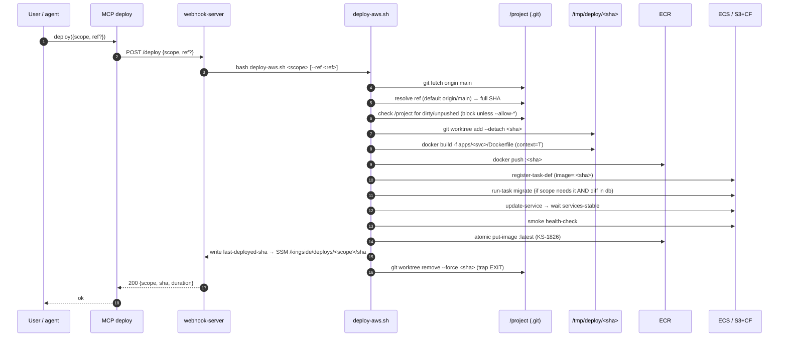

# ADR-127 — Git как единственный источник истины для деплоя

- Статус: **Proposed** (2026-06-14)
- Задача: KS-4113
- Связанные ADR / задачи:
  - ADR-045 (backend deploy-perf) — текущий пайплайн `scripts/deploy-aws.sh`,
    инструментирование, baseline-тайминги. Этот ADR не пересекается по мерам
    оптимизации, фокус — корректность и аудируемость.
  - ADR-018 / ADR-019 / ADR-021 / ADR-022 / ADR-042 — структура backend-сервисов
    в проде; фиксирует scope деплоя.
  - KS-1826 — атомарный `:latest` после gate'ов (миграции + services-stable +
    smoke). Свойство наследуется и в целевой схеме.
  - KS-1897 — три task-def family на один archive-образ.
  - KS-3467 / KS-3474 — известная дыра общего `.deploy-commit-aws` на все
    scopes (упомянуто здесь в §3.9 и §4.5).
- Авторы: architect (анализ и решение), devops (факты по текущему пайплайну).

---

## 1. Контекст и проблема

Жалоба пользователя: в продакшене регулярно оказывается код, которого нет в
git, и наоборот — git-история не описывает то, что реально работает на серверах.

Источник проблемы — пайплайн деплоя собирает docker-образы и frontend-бандл
из **живого worktree** на хосте webhook'а (`$REPO_DIR=/project`), а не из чистого
git-checkout'а заданного ref. При этом `ensure_main_synced` штатно разрешает
ситуации, при которых локальный HEAD расходится с `origin/main` (unpushed
коммиты) и при которых tracked-файлы изменены, но не закоммичены.

Это даёт три класса инцидентов:

1. **Призрачный код в проде**: разработчик/агент правит файл в `/project`, не
   коммитит, кто-то триггерит деплой — изменение уезжает в образ ECR с тегом
   текущего git SHA. SHA не соответствует содержимому образа. По git-логу
   воспроизвести нельзя.
2. **Призрачный код в репо**: коммит лежит локально в `/project/.git`, но не
   запушен в `origin/main`. Деплой штатно его выкатывает с тегом, которого нет
   у origin. При рестарте хоста webhook'а или переезде агентского контейнера
   локальный коммит теряется, образ в ECR остаётся, концов нет.
3. **Расхождение состояния «что задеплоено»**: `.deploy-commit-aws` — локальный
   файл в `/project` на хосте webhook'а, один на все 7 scopes деплоя. Не в git,
   не персистится в S3. При потере файла `detect_deploy_scope` возвращает `all`
   (см. §3.3); при общем файле frontend-деплой сдвигает указатель так, что
   следующий backend-деплой думает «миграции уже применены» (исходник KS-3467).

Цель ADR — зафиксировать дыры по коду, утвердить целевую схему «деплой строго
из git ref» и описать переходный план, не ломающий текущий рабочий процесс
скачком.

ADR **не** перепроектирует производительность пайплайна (ADR-045 закрыт), не
вводит CI-build на стороне GitHub (это §6.3 — открытый вопрос для пользователя)
и не пишет код — только архитектурное решение и декомпозиция.

---

## 2. Состав сервисов под деплой

| Scope (deploy arg) | Что собирается | Куда едет | Особенности |
|--------------------|----------------|-----------|-------------|
| `frontend` | `apps/web` через `npx turbo build --filter='@kingside/web^...'` + Vite | S3 `kingside-frontend-342946498289` + CloudFront `E1ECCUC177NSGI` | VITE_* hardcoded в скрипте (KS-1570); без версионирования S3 |
| `api` | `kingside-api:<sha>` (Dockerfile `apps/api/Dockerfile`) | ECR + ECS service | matchmaker-модуль внутри образа api |
| `game-service` | `kingside-game-service:<sha>` | ECR + ECS service | |
| `broadcast-service` | `kingside-broadcast-service:<sha>` | ECR + ECS service | |
| `archive-service` | `kingside-archive-service:<sha>` | ECR + 3 task-def family (KS-1897): ECS service + EventBridge `archive-importer-daily` + adhoc `archive-importer-adhoc` | broadcasts/archive RDS миграции отдельным run-task'ом |
| `tactic-worker` | `kingside-tactic-worker:<sha>` | ECR + run-task only (ADR-042) | без ECS service |
| `synthetic-bot` | `kingside-synthetic-bot:<sha>` | делегируется в `scripts/deploy-synthetic-bot.sh` | отдельный пайплайн, но та же модель сборки из локальной FS |

`workers` = алиас `broadcast-service + archive-service` на CLI; на MCP-уровне
запрещён (`tools/mcp-agent.mjs:66,235` режет `all`/`workers`/`""`).

`matchmaker` — модуль внутри `apps/api`, отдельного scope нет (ADR-045 §1).
`archive-importer` — не отдельный образ, см. строку archive-service.
`broadcast-worker` — не существует, удалён KS-1709 / ADR-022.

Целевая схема обязана покрывать все 7 scope'ов одинаково.

---

## 3. Текущий пайплайн (факты)

Источник — `scripts/deploy-aws.sh` (2167 строк), `tools/mcp-agent.mjs`,
ответ devops по KS-4113. Привязки к функциям/строкам даны точно по коду.

### 3.1. cwd деплоя

```bash
SCRIPT_DIR="$(cd "$(dirname "${BASH_SOURCE[0]}")" && pwd)"
REPO_DIR="$(cd "$SCRIPT_DIR/.." && pwd)"   # = /project
```

Никакого отдельного work-tree нет. `$REPO_DIR=/project` — это **тот же
checkout**, в котором живут и работают агенты (`backend`, `frontend`,
`architect`, …). Любой агент, изменивший файл в `/project` и не закоммитивший
его, оставляет это изменение видимым для следующего `docker build`.

### 3.2. `ensure_main_synced` (676–734)

- `git rev-parse --abbrev-ref HEAD` ≠ `main` → `exit 1`.
- `git diff-index --quiet HEAD --` — только `WARN`, **не блокирует**.
  Комментарий в скрипте: «test-results, локальные конфиги».
- `git status --porcelain` **не используется**.
- `git stash` **не используется**.
- `git fetch --quiet origin main` — при ошибке `WARN`, продолжает с локальным
  HEAD.
- Сравнение HEAD vs `origin/main`:
  - HEAD предок origin/main → `git merge --ff-only --quiet origin/main`;
  - origin/main предок HEAD → штатно деплоит **локальный HEAD** с сообщением
    «local main is ahead of origin/main by N commit(s)… push to origin when
    convenient»;
  - diverged → `exit 1`.
- Bypass всего шага: `KINGSIDE_DEPLOY_SKIP_GIT_PULL=1`.

### 3.3. `detect_deploy_scope` (1107–1209)

Читает `.deploy-commit-aws`:

```bash
get_deployed_commit() { cat "$REPO_DIR/.deploy-commit-aws" 2>/dev/null; }
```

- пуст / не существует / SHA не найден в репо → возвращает `all`;
- == HEAD → `none`;
- иначе `git diff --name-only $deployed_commit..HEAD` → классификация по
  путям:
  - `apps/web/*` → frontend;
  - `apps/{api,game-service,broadcast-service,archive-service,synthetic-bot-service,tactic-worker}/*` → соответствующий scope;
  - `packages/{broadcasts,archive}-db/*` → соответствующий backend;
  - `packages/shared/*` или `scripts/*|infra/*|justfile` → все флаги в true → `all`.
- При >1 scope → `all`, иначе один.

### 3.4. `docker build`

Пример api (`scripts/deploy-aws.sh:1420`):

```bash
docker build --progress=plain -t "kingside-api:${DEPLOY_SHA}" \
    -f "$REPO_DIR/apps/api/Dockerfile" "$REPO_DIR" \
    2>&1 | _with_ts | tee "$BUILD_LOG"
```

- context = `$REPO_DIR` = `/project` (живой worktree);
- флаги: только `-t`, `-f`, `--progress=plain`;
- BuildKit выключен (KS-3121 откат, classic builder);
- нет `--cache-from`, нет `--build-arg` с git-meta (нет коммита/тега в slug
  образа);
- `git archive` **не** используется;
- `.dockerignore` отсутствует — проверено: `/project/.dockerignore` нет.

Из этого: в build context уходит весь worktree, включая:
- uncommitted tracked-изменения,
- untracked-файлы (включая то, что положили агенты в /project),
- локальные конфиги, временные артефакты тестов,
- остатки от предыдущих сборок и пр.

Фактически в образ попадает то, что отфильтрует Dockerfile через явные
`COPY <path>` директивы. Это надёжно только потому, что Dockerfile'ы 5/7
сервисов явно перечисляют `COPY package.json`, `COPY apps/<svc>`,
`COPY packages/shared`, `COPY packages/db` и т.д. (см. `apps/api/Dockerfile`,
строки 37–58). Любая опечатка типа `COPY . /app` в новом Dockerfile открывает
дыру полностью.

### 3.5. `DEPLOY_SHA`

```bash
DEPLOY_SHA="$(git -C "$REPO_DIR" rev-parse --short HEAD)"
```

После `ensure_main_synced` это:

- либо локальный HEAD, синхронизированный с origin/main (штатный кейс),
- либо локальный HEAD, **опередивший origin/main** (штатно разрешено),
- либо локальный HEAD при ошибке `git fetch` (штатно WARN, не блок),
- либо локальный HEAD при `KINGSIDE_DEPLOY_SKIP_GIT_PULL=1`.

Тип SHA — **short** (7 символов). Теоретически коллизирует на больших
репозиториях; для нашего размера риск минимальный, но в целевой схеме
переходим на полный 40-символьный SHA.

### 3.6. ECR-теги

Семантика (шапка скрипта, 13–31, KS-1826):

- `<repo>:<sha>` — артефакт сборки, пушится сразу после `docker build`;
- `<repo>:latest` — атомарный `aws ecr put-image` **только** после успеха
  gate'ов (migrate + services-stable + smoke);
- task-def revisions регистрируются с явным `:<sha>`, **не `:latest`**, что
  даёт чистый rollback на предыдущую revision.

Это свойство — корректное, в целевой схеме сохраняется без изменений.

### 3.7. Frontend (1269–1325)

```
1. rm -rf apps/web/dist node_modules/.vite apps/web/node_modules/.vite
2. npx turbo run build --filter='@kingside/web^...'
3. VITE_API_URL=… VITE_*=…  npm run build --workspace=apps/web
4. aws s3 sync apps/web/dist/         s3://kingside-frontend-342946498289/ --delete --exclude "assets/*"
5. aws s3 sync apps/web/dist/assets/  s3://kingside-frontend-342946498289/assets/   (БЕЗ --delete, 30-дневный lifecycle, KS-2918)
6. aws cloudfront create-invalidation --distribution-id E1ECCUC177NSGI --paths "/*"
```

Git ref не читается — `npm run build` собирает из текущей `/project/apps/web/`.
VITE_* hardcoded в скрипте (защита от KS-1570: локальные VITE_* в .env
webhook'а попадали в prod-бандл).

`deploy-frontend.sh` — однострочный wrapper `exec deploy-aws.sh frontend`.

### 3.8. Workers

- `archive-service` scope обновляет 3 task-def family (`ARCHIVE_TD_FAMILIES`,
  47–77): `kingside-archive-service` (ECS service), `archive-importer-oneshot`
  (EventBridge schedule), `archive-importer-adhoc` (manual run-task). Один
  образ ECR, три target'а.
- `tactic-worker` — отдельный образ, нет ECS service, только register task-def
  + atomic `:latest`.
- `synthetic-bot` (2152–2158) — делегируется в `scripts/deploy-synthetic-bot.sh`.

Все три едут от того же `DEPLOY_SHA` и из того же `$REPO_DIR`.

### 3.9. `.deploy-commit-aws`

```bash
DEPLOY_COMMIT_FILE="$REPO_DIR/.deploy-commit-aws"
save_deployed_commit() { git -C "$REPO_DIR" rev-parse HEAD > "$DEPLOY_COMMIT_FILE"; }
```

Локальный файл в корне `/project`. **Не в git**, не в S3. Пишется в конце
успешного деплоя. **Один на все 7 scope'ов** — известная дыра (KS-3467
разобран в комментариях к `should_run_migrate`, 788–857): frontend-деплой
сдвигает указатель, api-деплой потом думает «миграции уже накатил».

### 3.10. Trigger пайплайна

MCP-уровень: `tools/mcp-agent.mjs:66,235`:

```js
case 'deploy':
  return webhookPost('/deploy', { scope: args.scope || '' });
```

Webhook-server вызывает `bash scripts/deploy-aws.sh <scope>` с `cwd=/project`.
SHA/ветка в env **не передаются** — скрипт сам резолвит `git rev-parse --short HEAD`.

CLI (минуя MCP) — `bash scripts/deploy-aws.sh all` остаётся доступным devops.

### 3.11. Bypass'ы

- `KINGSIDE_DEPLOY_SKIP_GIT_PULL=1` — снимает `ensure_main_synced` целиком
  (включая «должен быть main»).
- `KINGSIDE_DEPLOY_SKIP_LOCK=1` — снимает `flock`-мьютекс одновременных
  деплоев.

### 3.12. Hotfix

Отдельной команды нет. Существующие способы:

- Закоммитить локально → не пушить → задеплоить — **штатно разрешено**.
- `KINGSIDE_DEPLOY_SKIP_GIT_PULL=1` — деплой текущего HEAD без сверки с
  origin.
- Изменить файл и не коммитить вовсе — **тоже фактически работает** (modified
  tracked → WARN, untracked → молча, `.dockerignore` нет).

То есть «hotfix» в проекте не отделён от «обычного деплоя». Любой деплой
может оказаться hotfix'ом по факту, и наоборот.

### 3.13. Rollback

Отдельной команды/скрипта нет. В шапке `deploy-aws.sh` (32–44) есть только
runbook для ECS:

```bash
CUR=$(aws ecs describe-services --cluster kingside --services "$SVC" \
      --query 'services[0].taskDefinition' --output text)
REV=${CUR##*:}; PREV=$((REV-1))
aws ecs update-service --cluster kingside --service "$SVC" \
  --task-definition "${FAM}:${PREV}" --force-new-deployment
aws ecs wait services-stable --cluster kingside --services "$SVC"
```

`:latest` при откате не трогается (он уже на предыдущем gate-удачном digest,
KS-1826). Для **frontend rollback не описан** вообще: S3 sync c `--delete`,
S3-versioning в скрипте не упоминается, CF invalidation на `/*` всегда после
последнего sync'а.

---

## 4. Дыры (классификация)

### 4.1. `docker build` из живой FS без `.dockerignore`  
**Серьёзность: высокая**

Build context = `/project`. Любой агент, который изменил файл и не закоммитил,
влияет на следующий деплой. Защита держится только на дисциплине
`COPY <explicit-path>` во всех Dockerfile.

Срабатывает регулярно (агенты постоянно правят файлы в /project, между
правками и git commit есть конечное окно).

### 4.2. unpushed коммиты деплоятся штатно  
**Серьёзность: высокая**

`ensure_main_synced` сообщает «local main is ahead of origin/main… push
to origin when convenient» и продолжает. Коммит остаётся только в локальном
`.git`. Если контейнер webhook'а пересоздадут (рестарт, переезд) — коммит
теряется, образ в ECR с тегом этого SHA остаётся, история теряется.

### 4.3. Modified tracked → только WARN  
**Серьёзность: высокая**

Те же последствия, что в 4.1. В отличие от 4.1, технически детектируется
(`git diff-index --quiet HEAD --`) — просто результат не используется как
блокировка.

### 4.4. `DEPLOY_SHA` = локальный HEAD, не `origin/main`  
**Серьёзность: средняя** (производное от 4.1–4.2)

Тег `:<sha>` может не соответствовать ничему в `origin`. SHA сам по себе
истиной не является — нужен явный `origin/main` ref.

### 4.5. `.deploy-commit-aws` — локальный файл, один на все scope'ы  
**Серьёзность: средняя**

Известная дыра (KS-3467). Также пропадает при рестарте контейнера webhook'а
(если не на отдельном volume), что превращает следующий деплой в `all`.

### 4.6. `KINGSIDE_DEPLOY_SKIP_GIT_PULL=1` снимает все защиты git-уровня  
**Серьёзность: средняя**

Любая защита, добавленная в `ensure_main_synced`, сносится одной переменной
окружения. Это удобно как escape-hatch для devops, но даёт неявный путь
обхода.

### 4.7. Frontend rollback не предусмотрен  
**Серьёзность: средняя**

`aws s3 sync --delete` + CF invalidation — без S3 versioning или альтернативного
артефакта откатиться на предыдущий бандл нельзя.

### 4.8. Деплой и разработка делят один `/project`  
**Серьёзность: структурная (корень проблемы)**

Это не отдельная дыра, а **причина** дыр 4.1–4.3. Лечение через `.dockerignore`
и блокировки — паллиатив; целевая схема разводит деплой и разработку через
изолированный worktree (§5–§7).

---

## 5. Принципы целевой схемы

| # | Принцип |
|---|---------|
| P1 | Деплой строго из git ref. По умолчанию ref = `origin/main` после `git fetch`. Опционально tag или SHA через `--ref`. |
| P2 | Build context = чистый git worktree (`git worktree add` или `git archive`), физически изолирован от живой `/project`. |
| P3 | Тег ECR = **полный** git SHA из `origin/main` (или из указанного tag/ref). Локальный HEAD никогда не используется как источник тега в штатном пути. |
| P4 | Состояние «что задеплоено по каждому scope» хранится снаружи `/project`: AWS SSM Parameter Store или ECR image-tag-label, **per-scope**. Локальный `.deploy-commit-aws` удаляется. |
| P5 | Hotfix — явный CLI flow с явными флагами (`--ref <sha>`, `--allow-unpushed`) и аудит-логом. Не скрытый bypass через переменную окружения. |
| P6 | Rollback — first-class команда, покрывает ECS (`previous task-def revision`) и frontend (S3 versioning + явный previous version-id). |
| P7 | Любой dirty/unpushed state в `/project` в момент деплоя — STOP по умолчанию. Opt-in только через явный CLI флаг, который пишется в аудит-лог. |
| P8 | `:latest` атомарно перемещается после gate'ов (KS-1826). Свойство сохраняется. |
| P9 | Атомарность scope'ов сохраняется: каждый scope собирается из одного и того же ref за один прогон; `:latest` сдвигается только после gate'ов своего scope. |

---

## 6. Варианты целевой реализации

### 6.1. Вариант A — Минимально-инвазивный (паллиатив)

**Что**: остаёмся в `/project`, добавляем `.dockerignore`, превращаем WARN из
`ensure_main_synced` в блокировки по умолчанию, добавляем opt-in CLI флаги,
переносим `.deploy-commit-aws` в SSM per-scope.

**Плюсы**:
- 1–2 коммита, эффект почти сразу.
- Не трогает структуру webhook-server'а и MCP-тула.

**Минусы**:
- 4.8 (deploy и dev делят `/project`) не лечится — лечатся только симптомы.
- `.dockerignore` защищает только то, что Dockerfile **не должен был** копировать.
  Если Dockerfile уже копирует `apps/api/`, то любая правка внутри `apps/api/`,
  не закоммиченная, всё равно попадёт в образ — `.dockerignore` тут бессилен.
  Реально защищает только от широких `COPY .` (которых сейчас нет, но как
  страховка ценно).
- Окно гонки сохраняется: между `ensure_main_synced` и `docker build` агент
  может изменить файл в `/project` — `ensure_main_synced` зафиксирует чистоту,
  build уже соберёт грязное.

**Применение**: как **переходная** фаза 1, не как целевая.

### 6.2. Вариант B — Изолированный git worktree (целевой)

**Что**: перед сборкой каждого scope:

```bash
git -C "$REPO_DIR" fetch --quiet origin main
REF="${KINGSIDE_DEPLOY_REF:-origin/main}"            # full SHA, tag или ref
DEPLOY_SHA="$(git -C "$REPO_DIR" rev-parse "$REF")"  # ПОЛНЫЙ 40-симв. SHA
WORKTREE="/tmp/deploy/$DEPLOY_SHA-$$"
git -C "$REPO_DIR" worktree add --detach "$WORKTREE" "$DEPLOY_SHA"
trap 'git -C "$REPO_DIR" worktree remove --force "$WORKTREE" 2>/dev/null' EXIT

# build из изолированного worktree
docker build -f "$WORKTREE/apps/$SVC/Dockerfile" "$WORKTREE" \
  -t "kingside-$SVC:$DEPLOY_SHA"
```

Аналогично для frontend: `cd "$WORKTREE/apps/web" && npm run build` →
`aws s3 sync "$WORKTREE/apps/web/dist/" …`.

`$REPO_DIR` при этом всё ещё проверяется на dirty/unpushed по принципу P7, но
build от него физически отвязан — любое изменение в `/project` после
`git worktree add` не влияет.

**Плюсы**:
- Закрывает 4.1, 4.3, 4.4 структурно: build context физически чистый.
- Закрывает 4.2: ref резолвится из `origin/main`, не из локального HEAD.
- Совместим с существующей моделью «build на агентском хосте» (ADR-045 §10).
- Изменение локализовано в `scripts/deploy-aws.sh`, не требует CI и не
  перепроектирует MCP-тул.
- Layer cache локального docker'а переиспользуется (worktree использует один
  и тот же абсолютный путь по содержимому слоёв через BuildKit нельзя, но в
  classic builder cache считается по содержимому файлов — переезд пути влияет
  слабо, эмпирически проверить в Phase 3).

**Минусы**:
- Доп. место на диске: каждый деплой создаёт worktree, `docker build` копирует
  context в buildkit/classic. При параллельных деплоях (KS-3057) — несколько
  worktree'ев одновременно. Очистка обязательна (trap EXIT).
- Layer cache может частично инвалидироваться при смене путей (требует
  проверки).
- Не закрывает 4.7 (rollback frontend) — это отдельная мера §7.4.

### 6.3. Вариант C — Pre-build на CI (открытый вопрос)

**Что**: GitHub Actions при пуше в `main` собирает образы и пушит в ECR.
Агентский pipeline тогда делает только `register-task-definition` +
`update-service` + `wait`. Frontend бандл — артефакт GitHub Actions →
`aws s3 sync` оттуда.

**Плюсы**:
- Полная изоляция build от хоста webhook'а.
- Бесплатный аудит-лог на стороне GitHub.
- Refа на ECR гарантированно = ref'у в GitHub.

**Минусы**:
- Бóльшая работа: secrets, OIDC, runner-минуты, прогрев Docker cache.
- ADR-045 §9.6 уже зафиксировал: «Решение пользователя — build остаётся на
  агентском хосте». Без явного апрува менять не имеем права.
- Время от push до возможности задеплоить вырастает (build + push занимают
  минуты).

**Применение**: вне scope этого ADR, помечено как Phase 6 / открытый вопрос
(§11.1).

### 6.4. Выбор

**Вариант B как целевой** + минимум из варианта A (`.dockerignore` + блокировки
+ перенос state в SSM) как первая фаза. Вариант C — отдельная развилка,
требует апрува пользователя.

---

## 7. Целевая архитектура (детально)

### 7.1. Пайплайн одного scope



Фронтенд (`scope=frontend`) после §7.1.7 идёт по своему хвосту:
S3 sync (с `--delete` для html/static, без `--delete` для `assets/`),
CF invalidation, запись previous-version-id в SSM (для rollback).

### 7.2. Resolve ref (P1, P3)

```bash
git -C "$REPO_DIR" fetch --quiet --tags origin main
REF="${KINGSIDE_DEPLOY_REF:-origin/main}"
DEPLOY_SHA="$(git -C "$REPO_DIR" rev-parse --verify "$REF^{commit}")" || {
  echo "FATAL: cannot resolve ref $REF"; exit 1;
}
```

- `--verify "$REF^{commit}"` обязателен: tag → commit SHA, без неоднозначности.
- `DEPLOY_SHA` — **полный** 40-символьный SHA. Источник истины тега ECR.
- При `--ref <tag>` (hotfix) поведение идентично, ref резолвится из `origin`.

### 7.3. Защита `/project` (P7)

```bash
if [ -n "$(git -C "$REPO_DIR" status --porcelain)" ]; then
  if [ "$ALLOW_DIRTY" != "1" ]; then
    echo "FATAL: /project has uncommitted changes; commit or pass --allow-dirty";
    exit 1;
  fi
  echo "WARN: deploying with dirty /project (allowed by --allow-dirty)"
  AUDIT_TAGS="$AUDIT_TAGS,dirty"
fi

LOCAL_HEAD="$(git -C "$REPO_DIR" rev-parse HEAD)"
ORIGIN_HEAD="$(git -C "$REPO_DIR" rev-parse origin/main)"
if [ "$LOCAL_HEAD" != "$ORIGIN_HEAD" ] && \
   git -C "$REPO_DIR" merge-base --is-ancestor "$ORIGIN_HEAD" "$LOCAL_HEAD"; then
  if [ "$ALLOW_UNPUSHED" != "1" ]; then
    echo "FATAL: local main is ahead of origin/main; push or pass --allow-unpushed";
    exit 1;
  fi
  AUDIT_TAGS="$AUDIT_TAGS,unpushed"
fi
```

`status --porcelain` — пустая строка == «всё чисто, включая untracked».
Untracked в `/project` тоже блокирует — это намеренно: исключения через
`.gitignore` уровня репозитория.

### 7.4. Изолированный worktree (P2)

```bash
WORKTREE="/tmp/deploy/$DEPLOY_SHA-$$"
mkdir -p "$(dirname "$WORKTREE")"
git -C "$REPO_DIR" worktree add --detach --quiet "$WORKTREE" "$DEPLOY_SHA"

cleanup() {
  git -C "$REPO_DIR" worktree remove --force "$WORKTREE" 2>/dev/null || true
  rm -rf "$WORKTREE"
}
trap cleanup EXIT INT TERM

docker build --progress=plain \
  -t "kingside-$SVC:$DEPLOY_SHA" \
  -f "$WORKTREE/apps/$SVC/Dockerfile" \
  "$WORKTREE"
```

Особенности:
- `git worktree add --detach` не создаёт ветку, нет ресета HEAD основного
  worktree.
- `$WORKTREE` живёт ровно на время сборки этого scope.
- `trap cleanup EXIT INT TERM` гарантирует удаление при любом завершении,
  включая `kill -INT` от webhook'а.
- Параллельные деплои разных scope'ов получают разные `$WORKTREE` (за счёт
  `$$` и `DEPLOY_SHA` суффиксов) — KS-3057 не ломается.

Для **frontend**:

```bash
( cd "$WORKTREE" && \
  npx turbo run build --filter='@kingside/web^...' && \
  VITE_API_URL=… npm run build --workspace=apps/web )
aws s3 sync "$WORKTREE/apps/web/dist/" "s3://kingside-frontend-…/" \
  --delete --exclude "assets/*"
aws s3 sync "$WORKTREE/apps/web/dist/assets/" "s3://kingside-frontend-…/assets/"
aws cloudfront create-invalidation --distribution-id E1ECCUC177NSGI --paths "/*"
```

### 7.5. State «что задеплоено» (P4)

Перенос из локального `.deploy-commit-aws` в SSM Parameter Store, **per-scope**:

```
/kingside/deploys/frontend/sha
/kingside/deploys/api/sha
/kingside/deploys/game-service/sha
/kingside/deploys/broadcast-service/sha
/kingside/deploys/archive-service/sha
/kingside/deploys/tactic-worker/sha
/kingside/deploys/synthetic-bot/sha
```

Чтение:
```bash
get_deployed_commit() {
  local scope=$1
  aws ssm get-parameter --name "/kingside/deploys/$scope/sha" \
    --query 'Parameter.Value' --output text 2>/dev/null
}
```

Запись после успеха:
```bash
save_deployed_commit() {
  local scope=$1 sha=$2
  aws ssm put-parameter --name "/kingside/deploys/$scope/sha" \
    --type String --value "$sha" --overwrite
}
```

`detect_deploy_scope` использует **scope-специфичный** deployed SHA. Закрывает
KS-3467: frontend-деплой больше не двигает api-state.

Альтернатива — ECR image tag `deployed-current` рядом с `:latest`. Менее
универсально (frontend не в ECR), поэтому выбран SSM.

Миграция: при отсутствии параметра SSM — fallback на чтение
`.deploy-commit-aws` один раз, запись в SSM, удаление файла (см. §8 Phase 2).

### 7.6. `.dockerignore`

Создать `/project/.dockerignore` (закоммитить в git):

```
# host-only artifacts (логи агентов, скриншоты, временные тестовые артефакты)
logs/
tools/                       # инструменты разработки, в образы не нужны
.claude/
.git
.gitignore
.deploy-commit-aws
**/.env
**/.env.local
**/node_modules
**/dist
**/coverage
**/.vite
**/.turbo
**/test-results
**/playwright-report
**/tsconfig.tsbuildinfo
apps/web/.bake-cache         # KS-3709, заменяется свежим
```

Каждый Dockerfile продолжает использовать явные `COPY <path>`. `.dockerignore`
работает как страховка: даже если в новом сервисе кто-то напишет `COPY . /app`,
host-only мусор не уедет в образ. После Phase 3 (worktree) build context уже
чистый, но `.dockerignore` оставляем — он также ускоряет передачу context'а в
docker daemon.

### 7.7. Hotfix-команда (P5)

CLI:
```bash
bash scripts/deploy-aws.sh <scope> --ref <ref> [--allow-unpushed] [--allow-dirty]
```

MCP:
```
deploy({scope, ref?, allowUnpushed?, allowDirty?})
```

Семантика:
- `--ref` (`KINGSIDE_DEPLOY_REF`) — резолвится в `git rev-parse --verify
  "$ref^{commit}"`. Может быть SHA, tag, `origin/<branch>`. Если ref не из
  `origin` — требует `--allow-unpushed`.
- `--allow-dirty` — пишет в аудит-лог тэг `dirty`. По умолчанию выключено.
- `--allow-unpushed` — пишет в аудит-лог тэг `unpushed`. По умолчанию
  выключено.
- `KINGSIDE_DEPLOY_SKIP_GIT_PULL` — удаляется как идея. Замены этому
  bypass'у в целевой схеме нет: явный `--ref <sha>` покрывает все легитимные
  случаи. (Решение по полному удалению — §11.5.)

Аудит-лог — отдельный append-only файл `/project/logs/deploy-audit.log` + строка
в комментарии к ECS deployment (`deployment-description`):

```json
{
  "ts": "2026-06-14T13:37:00Z",
  "scope": "api",
  "ref": "origin/main",
  "sha": "a1b2c3d4…",
  "tags": ["unpushed"],
  "actor": "AGENT_NAME=devops",
  "result": "success",
  "duration_s": 104
}
```

### 7.8. Rollback (P6)

CLI:
```bash
bash scripts/deploy-aws.sh rollback <scope> [--to <sha|task-def-revision>]
```

MCP:
```
deploy({scope, action: 'rollback', to?: '<sha>|<revision>'})
```

Для **backend**:
- Если `--to` не задан → `aws ecs describe-services` → текущая revision N
  → откат на N-1.
- Если `--to <sha>` → ищет task-def revision с `image=…:<sha>`,
  `update-service` на неё.
- Если `--to <revision>` → прямо на revision.
- `:latest` **не двигается** при rollback (соответствует KS-1826: «`:latest`
  всегда = последний gate-удачный»). Это сознательно: rollback — операция на
  task-def, образ в ECR никуда не делся.
- После rollback — `aws ssm put-parameter` обновляет
  `/kingside/deploys/<scope>/sha`.

Для **frontend** (требует включить S3 versioning на бакете
`kingside-frontend-342946498289`):
- При каждом успешном деплое сохраняем `versionId` всех залитых ключей
  (как минимум `index.html` и `dist/*` верхнего уровня) в SSM
  `/kingside/deploys/frontend/previous`.
- Rollback: `aws s3api copy-object` с `versionId` → восстановление
  предыдущей версии каждого ключа → CF invalidation.
- Альтернатива (проще): хранить `tar.gz` бандлов в S3 `kingside-frontend-rollback`
  по ключу `<sha>.tgz`, при rollback'е распаковывать в основной бакет.

Выбор между versioning vs tarball — за devops (§11.3).

### 7.9. Что **не** меняем

- Модель «build на агентском хосте» (ADR-045 §10).
- Атомарность `:latest` после gate'ов (KS-1826).
- Stage'ы пайплайна по этапам (build → push → migrate → update-service → smoke).
- `flock`-мьютекс per-scope (KS-3057).
- 3 task-def family у archive-service (KS-1897).
- Все оптимизации ADR-045 (skip migrate, prune dev-deps, health-tuning).

---

## 8. Переходный план

Каждая фаза — отдельный тикет, исполнитель devops. Фаза выкатывается
независимо, проверяется dry-run на одном scope (например, `tactic-worker` —
он без ECS service и без миграций, самый простой). Простоя нет ни в одной
фазе: новые проверки/опции добавляются как блокировки **по умолчанию**, но
существующие команды продолжают работать через явные opt-in флаги до полного
обкатывания.

| Phase | Что | Цель | Простой | Откат |
|-------|-----|------|---------|-------|
| 0 | Этот ADR | Зафиксировать инварианты | нет | — |
| 1 | `.dockerignore` + опционально-блокирующий dirty/unpushed (через флаги, по умолчанию **WARN**) | Сузить дыру 4.1, подготовить CLI-контракт | нет | revert |
| 2 | Перенос state в SSM per-scope; dual-read (SSM или fallback на файл) | Закрыть 4.5, KS-3467 | нет | revert + rm SSM |
| 3 | Изолированный worktree-build (`git worktree add`) | Закрыть 4.1, 4.3, 4.4 структурно | нет | revert на текущий контекст |
| 4 | Полный SHA вместо short | Подготовка к hotfix-flow | нет | revert |
| 5 | Hotfix-команда (`--ref`, `--allow-*`); удаление `KINGSIDE_DEPLOY_SKIP_GIT_PULL` | Закрыть 4.2, 4.6, P5 | нет | оставить env-bypass до решения |
| 6 | Rollback-команда: ECS-часть | Закрыть половину 4.7 | нет | runbook остаётся как backup |
| 7 | Rollback-команда: frontend (S3 versioning + SSM previous) | Закрыть 4.7 целиком | нет | revert; ручной runbook |
| 8 | Перевод dirty/unpushed из WARN в **FATAL** по умолчанию | Полная защита P7 | момент обкатки | revert |
| 9 | (опционально) Pre-build на CI — Вариант C | Полная изоляция build | требует апрува | — |

### Phase 1 — `.dockerignore` + флаги

- Создать `/project/.dockerignore` по §7.6, закоммитить.
- В `scripts/deploy-aws.sh` добавить парсер CLI-флагов `--ref`, `--allow-dirty`,
  `--allow-unpushed`. В этой фазе они только **проставляют тэги в аудит-лог**,
  ничего не блокируют (по умолчанию — текущее поведение).
- Аудит-лог `/project/logs/deploy-audit.log` (формат §7.7).

### Phase 2 — State в SSM

- Создать IAM permission на `ssm:GetParameter`, `ssm:PutParameter` для
  webhook-роли (область `/kingside/deploys/*`).
- В `detect_deploy_scope` и `save_deployed_commit` сделать:
  - read: SSM первым, при miss → `.deploy-commit-aws`, при miss → `all`.
  - write: SSM + удаление файла (после нескольких успешных деплоев).
- После 2 недель прогона — удалить fallback на файл и сам файл.

### Phase 3 — Изолированный worktree

- В `scripts/deploy-aws.sh` ввести функцию `prepare_build_context(scope)` →
  `git worktree add --detach $WORKTREE $DEPLOY_SHA`.
- Все `docker build`, `npm run build` (frontend), `npx tsc --build`
  работают на `$WORKTREE`, не на `$REPO_DIR`.
- Trap EXIT/INT/TERM → `git worktree remove --force`.
- Тест на `tactic-worker` сначала, потом остальные.

Замер layer cache до и после: ADR-045 §9.2 указывает true-warm `docker build`
≈ 1 с — если после переезда worktree станет существенно хуже, переключиться
на `docker build --cache-from kingside-$svc:latest` (BuildKit) или вернуться к
текущему пути с явным fail-on-dirty.

### Phase 4 — Полный SHA

`DEPLOY_SHA=$(git rev-parse "$REF^{commit}")` — без `--short`. Регистрация
task-def, теги ECR, имена логов используют полный 40-символьный SHA. Старые
short-SHA образы в ECR не трогаем — они тэгированы и так, lifecycle policy
их подчистит.

### Phase 5 — Hotfix + удаление env-bypass

- `--ref <ref>` становится **функциональным**: ref резолвится из `origin`.
- `--allow-dirty`/`--allow-unpushed` остаются как opt-in, но в Phase 8
  становятся единственным способом отвязаться от чистого ref.
- `KINGSIDE_DEPLOY_SKIP_GIT_PULL` удаляется. Замены нет: для отвязки от
  origin есть `--ref <local-sha> --allow-unpushed`.
- `KINGSIDE_DEPLOY_SKIP_LOCK` оставляем — это про конкуренцию, не про git.

### Phase 6 — Rollback ECS

- `bash scripts/deploy-aws.sh rollback <scope>` → §7.8.
- MCP: `deploy({scope, action: 'rollback', to?})`.
- Аудит-лог пишет `action=rollback, from=<sha>, to=<sha>`.

### Phase 7 — Rollback frontend

- Включить S3 versioning на `kingside-frontend-342946498289` (нужно проверить
  lifecycle — может потребоваться доп. правил).
- При успешном деплое frontend записать в SSM
  `/kingside/deploys/frontend/previous_version_ids` map ключ→versionId.
- Команда rollback restoreит previous versions всех ключей.

### Phase 8 — Перевод в FATAL

После 2–4 недель прогона Phase 5 без инцидентов перевести `--allow-dirty` и
`--allow-unpushed` из «WARN по умолчанию» в «FATAL по умолчанию». Текущее
поведение становится недоступным без явного флага.

### Phase 9 — CI build (опционально)

Решение пользователя, §11.1.

---

## 9. Риски и митигации

### 9.1. Phase 1 ломает привычный dirty-workflow агентов

**Риск**: агент привык, что может «пощупать» правку на проде без коммита.

**Митигация**: Phase 1 не блокирует, только пишет в аудит. Жёсткая блокировка
— Phase 8, после обкатки. Координатор сам решает, кому давать
`--allow-dirty`/`--allow-unpushed` (например, только devops при инциденте).

### 9.2. Worktree удваивает место на диске

**Риск**: на хосте webhook'а место кончится при параллельных деплоях.

**Митигация**:
- `trap cleanup EXIT INT TERM` обязателен;
- `/tmp/deploy` мониторить (cron, alert на >X GB);
- `git worktree prune` периодически.

### 9.3. SSM — внешняя зависимость с лимитом 40 RPS на параметр

**Риск**: при частых деплоях rate-limit или регион-outage.

**Митигация**:
- Read хеширует в памяти процесса.
- Write — раз в деплой, не критично.
- На time-out SSM → fail-safe: не двигать `:latest`, не писать сдвиг (лучше
  «потерять» инфу что задеплоили, чем разъехаться с реальностью).

### 9.4. Layer cache при переезде на worktree

**Риск**: путь `/tmp/deploy/<sha>-<pid>` меняется каждый раз → cache classic
builder может частично инвалидироваться.

**Митигация**:
- В Phase 3 — замер до/после на 5 сервисах.
- При деградации — фиксированный путь `/tmp/deploy/<scope>/current`
  с symlink на текущий worktree (или с remove-and-rename). Layer cache считает
  по содержимому, не по mtime — проблема локализована и решается.

### 9.5. Hotfix без push — окно безопасности

**Риск**: задеплоили `--allow-unpushed <sha>`, образ в ECR, локальный коммит
потерялся при рестарте контейнера → концов нет.

**Митигация**:
- При `--allow-unpushed` скрипт **обязательно** делает `git push origin
  <sha>:refs/heads/hotfix/<sha>` (lightweight branch) перед сборкой; если
  пуш не удался — деплой отказывается. Лучше иметь даже «осиротевшую» ветку
  в origin, чем потерять локальный коммит.
- Альтернатива: при `--allow-unpushed` создать tag `hotfix-<ts>` локально и
  запушить только тег. Тэг легче чистить позже.
- Cron-проверка «есть `hotfix/*` ветки старше 24h — алерт пользователю».

### 9.6. SSM rollback frontend через `tar.gz` vs S3 versioning

**Риск**: S3 versioning раздувает стоимость хранения; `tar.gz` требует своего
бакета и lifecycle.

**Митигация**: §11.3 — решение за devops, оба варианта рабочие.

### 9.7. Worktree и git LFS / submodules

**Риск**: если когда-нибудь подключим git LFS / submodules — worktree
требует доп. шагов (`git lfs pull`, `git submodule update --init`).

**Митигация**: сейчас ни того, ни другого нет. Зафиксировать как условие
ADR: при добавлении LFS/submodules возвращаемся к этому ADR и расширяем
`prepare_build_context`.

---

## 10. Декомпозиция тикетов

| # | Тикет | Что | Исполнитель | Размер | Зависит от |
|---|-------|-----|-------------|--------|------------|
| 1 | KS-новый | Phase 1: `.dockerignore` + CLI-флаги `--ref/--allow-dirty/--allow-unpushed` (WARN-only) + аудит-лог `/project/logs/deploy-audit.log` | devops | S | этот ADR |
| 2 | KS-новый | Phase 2: state в SSM per-scope, dual-read, миграция с `.deploy-commit-aws` | devops | M | 1 |
| 3 | KS-новый | Phase 3: `prepare_build_context` через `git worktree add --detach`, trap-cleanup, замер cache на 5 сервисах | devops | M | 1 |
| 4 | KS-новый | Phase 4: полный SHA вместо short в тегах ECR и task-def | devops | XS | 3 |
| 5 | KS-новый | Phase 5: hotfix-flow — `--ref` функциональный, `git push refs/heads/hotfix/<sha>` при `--allow-unpushed`, удалить `KINGSIDE_DEPLOY_SKIP_GIT_PULL` | devops | M | 4 |
| 6 | KS-новый | Phase 6: rollback ECS (`deploy({scope, action: 'rollback'})`, поиск предыдущей revision); аудит-лог | devops | M | 4 |
| 7 | KS-новый | Phase 7: S3 versioning frontend bucket + rollback frontend через SSM previous-version-ids | devops | M | 6 |
| 8 | KS-новый | Phase 8: перевод `dirty/unpushed` из WARN в FATAL по умолчанию (после 2–4 недель прогона) | devops | XS | 5 |
| 9 | KS-новый | Обновить ADR-127 фактическими результатами after-замеров, поднять Proposed → Accepted | architect | S | все выше |

**Вне scope KS-4113** (отдельные обсуждения с пользователем):

- Pre-build на CI (Phase 9, §11.1).
- Cron-проверка стареющих `hotfix/*` веток (§9.5).

---

## 11. Открытые вопросы

### 11.1. CI build (Phase 9)

Переносить ли `docker build` + `aws s3 sync` на GitHub Actions? ADR-045 §9.6
зафиксировал решение пользователя «build остаётся на агентском хосте». Этот
ADR не оспаривает то решение, но фиксирует Phase 9 как открытый путь, если
после Phase 1–8 сохранится дискомфорт от «build на агентском хосте». Решение
— за пользователем.

### 11.2. SSM vs DynamoDB для state

SSM Parameter Store: 4 KB/параметр, бесплатно, простой CLI. DynamoDB:
больше swing-room, но дороже и сложнее. Для наших данных (1 SHA на scope)
SSM достаточно. Девопс может выбрать DynamoDB, если уже использует его для
другого state — оба варианта закрывают P4.

### 11.3. Frontend rollback: S3 versioning vs tarball

- **S3 versioning** на `kingside-frontend-342946498289`: проще, но раздувает
  стоимость (assets/* живут с lifecycle 30 дней, версии — нет).
- **Tarball** `<sha>.tgz` в отдельном `kingside-frontend-rollback`: чище,
  явный lifecycle (хранить последние N), не трогает основной бакет.

Решение за devops в Phase 7.

### 11.4. Время жизни hotfix-ветки в origin

Если в Phase 5 при `--allow-unpushed` мы создаём `refs/heads/hotfix/<sha>`,
сколько хранить? Предлагаемое: 7 дней после деплоя, после — cron-удаление
+ алерт пользователю если за это время не вмерджили в main. Продуктовое
решение.

### 11.5. Полное удаление `KINGSIDE_DEPLOY_SKIP_GIT_PULL`

Phase 5 удаляет переменную. Уверены ли мы, что нет легитимных случаев, когда
эту переменную приходится взводить руками (например, при недоступности
origin)? Альтернатива — оставить как «развязочный rope» с обязательным
аудит-логом и таймером (срабатывает только в течение 1 часа после взвода).

Рекомендация архитектора: удалить полностью. `--ref <local-sha>
--allow-unpushed` покрывает все легитимные сценарии, включая offline-origin.

### 11.6. archive-service: 3 task-def family и rollback

`kingside-archive-service` (ECS) откатывается через `update-service` на
N-1. А `archive-importer-oneshot` (EventBridge target) и
`archive-importer-adhoc` (manual run-task) — их task-def revisions откатывать
тоже? Скорее всего да, для консистентности кода в трёх target'ах. Уточнить с
backend и devops в Phase 6.

---

## 12. Что НЕ делает этот ADR

- Не пишет код. Реализация — KS-новые тикеты по §10, исполнитель devops.
- Не трогает ADR-045 (производительность). Меры этого ADR могут оказать
  локальный эффект на тайминги (worktree → +N секунд на `git worktree add`,
  возможно −M секунд за счёт более чистого build context'а). Если after-замер
  даст регресс >5% — открыть отдельный тикет к ADR-045, не к этому.
- Не вводит CI build (Phase 9 — отдельное решение пользователя).
- Не описывает observability/метрики деплоев — это отдельная тема (Grafana
  dashboard «частота hotfix», «доля dirty-деплоев» и т.п.). Может стать
  follow-up'ом после Phase 8.

---

## 13. Последствия

**Плюсы**:
- В прод попадает ровно тот код, который есть в `origin/main` (или явно
  указанном ref). Аудит-цепочка восстановима по `git log` + ECR-тегам +
  SSM-state + аудит-логу.
- KS-3467 закрывается per-scope state'ом в SSM.
- Hotfix и rollback становятся first-class операциями с явной семантикой,
  а не побочными эффектами bypass'ов.
- `/project` перестаёт быть «и dev, и build context» одновременно — снимает
  целый класс гонок между правкой агента и сборкой.

**Минусы / риски**:
- Доп. сложность скрипта (`prepare_build_context`, SSM read/write, парсер
  CLI). Митигируется поэтапной выкаткой и dry-run.
- Дисциплина для агентов: коммитить перед деплоем (или явно ставить
  `--allow-dirty` и оставлять след в аудите). Это и есть цель.
- Доп. внешняя зависимость SSM. Митигируется fail-safe (§9.3).

**Не делает этот ADR** (повтор §12):
- Не пишет код.
- Не вводит CI build.
- Не меняет ADR-045-меры по производительности.
