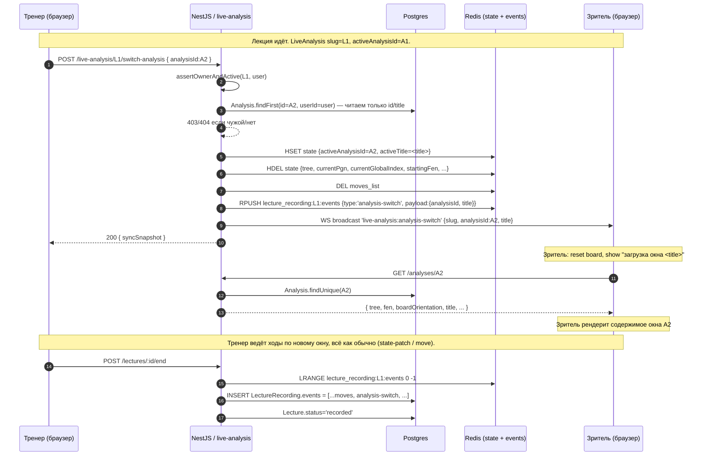

# ADR-142: Переключение между окнами анализа во время записи лекции

**Статус:** Согласовано пользователем (правка от 2026-06-25 по результатам ревью backend и пользователем)
**Дата:** 2026-06-25
**Задача:** KS-4626

**История правок:**
- 2026-06-25 v1 — первоначальная версия (черновик).
- 2026-06-25 v2 — по результатам ревью backend и решения пользователя:
  «Analysis в БД — единственный первоисточник дерева. При переключении окна
  фронт сам делает `GET /analyses/:id` и тянет дерево; backend в Redis state
  хранит только `activeAnalysisId`; WS-событие и REST-body несут только
  `{analysisId, title}`. Никакого `tree` в Redis, WS и REST.»
  Правка устраняет противоречие между §2.2/§2.3/§2.6 первой версии и
  выравнивает решение с правилом KS-3780 (backend не парсит/не реплицирует
  содержимое дерева).
**Связанные ADR:** [ADR-110](./110-live-analysis-broadcast.md), [ADR-111](./111-live-analysis-full-broadcast.md), [ADR-112](./112-live-analysis-per-analysis-binding.md), [ADR-113](./113-coach-page.md), [ADR-116](./116-lecture-audio-p2p.md), [ADR-117](./117-lecture-student-tools-policy.md), [ADR-119](./119-lecture-ui-coach-student.md)

## 1. Контекст

### 1.1 Что есть сейчас

Лекция в текущей реализации (ADR-113) — единая live-сессия `LiveAnalysis`:

- `Lecture.liveAnalysisId` — **единственная** ссылка на трансляцию. Partial UNIQUE «один live = одна live-лекция» (`schema.prisma:2215`).
- `LiveAnalysis.analysisId` — исходный `Analysis`, с которого тренер запустил трансляцию (ADR-112). FK неизменяем после `POST /live-analysis`.
- На одной live-сессии у тренера одна доска, одно дерево вариаций (`state.tree`), одна стартовая позиция (`state.startingFen`), одна ориентация.
- Событийный поток в Redis `lecture_recording:<liveAnalysisId>:events` — линейный массив событий типа `move | state-patch | reset | closed` с меткой `t` (мс от `lecture.startedAt`); финализатор склеивает в `LectureRecording.events` (см. `live-analysis.service.ts:585-624`).
- `applyReset(slug, fen)` сбрасывает state: меняет `startingFen`, чистит `tree`, эмитит `live-analysis:sync` (`live-analysis.service.ts:1126-1186`). Запись фиксируется как `{type:'reset', payload:{fen, orientation}}` — без `analysisId`, без дерева.

### 1.2 Что хочет тренер

> Тренер во время лекции должен мочь переключаться между несколькими окнами анализа (заранее подготовленные разные партии или разные дебюты в одной лекции).

Сценарий:

1. Тренер заранее у себя в «Моих анализах» подготовил три анализа: разбор партии Карлсен–Накамура, дебют Каро-Канн с деревом вариаций, эндшпиль ладья+слон против ладьи.
2. Начинает лекцию из первого окна анализа (как сейчас).
3. Через 10 минут хочет одним кликом переключиться на второе окно: у зрителей доска и всё дерево варьаций мгновенно меняются на заранее подготовленное содержимое второго анализа.
4. Запись лекции при просмотре в replay воспроизводит переключения в нужные моменты.

### 1.3 Что мешает текущей модели

- `applyReset` сбрасывает только FEN — теряются заранее подготовленные варианты, аннотации (NAG), комментарии, headline, PGN headers. Тренер вынужден переигрывать дерево вручную, чего и стремится избежать.
- Открыть второй `/analysis/:id2` в новой вкладке и переключиться на неё ведёт к **другой** live-сессии (`LiveAnalysis` со своим slug). Зрители первой сессии останутся слушать тишину на старой доске.
- Внутри одной live-сессии нет понятия «текущий активный analysisId» — поле `LiveAnalysis.analysisId` неизменяемо и отражает только исходник.

### 1.4 Что нужно от ADR

Спроектировать решение, при котором:

1. Тренер из live-режима лекции переключает «активное окно анализа» одним действием.
2. Все зрители live получают новое состояние доски и дерево — синхронно с тренером.
3. Запись лекции переживает переключения; replay-плеер воспроизводит их с правильной меткой времени.
4. Аудио тренера (ADR-116) **не прерывается** — это сквозной поток, не связанный с конкретным анализом.
5. Минимум миграций и операционных изменений; масштаб — один разработчик.

### 1.5 Что НЕ в скоупе

- Параллельное вещание нескольких досок одновременно (split-view). Тренер всегда показывает одно окно за раз.
- Параллельная работа двух тренеров над одной лекцией (co-coaching).
- Возможность ученику видеть «другую» доску, отличную от текущей у тренера (override). Зритель всегда видит то же окно, что и тренер.
- Управление списком заранее подготовленных «окон» через отдельную страницу/коллекцию. В MVP — переключение на любой свой `Analysis` из ad-hoc picker'а; постоянный «плейлист» лекции — Phase 2.
- Push-уведомления зрителю «тренер сменил тему».

## 2. Решение

### 2.1 Общая идея

Сохраняем модель «одна `LiveAnalysis` на лекцию». Расширяем семантику live-сессии: внутри одной сессии есть **текущий активный `analysisId`**, который может меняться в эфире. Каждое переключение пишется отдельным событием в поток записи.

**Принцип единого источника** (правка v2, KS-3780-совместимо): `Analysis` в БД — единственный источник истины для содержимого окна анализа (`tree`, `fen`, `boardOrientation`, headers, заголовок). Backend **не читает** и **не реплицирует** дерево анализа: ни в Redis state, ни в WS-payload, ни в REST-ответ. Backend оперирует только `analysisId` как указателем; фронт (тренер, зритель, replay) сам делает `GET /analyses/:id` и берёт содержимое из БД.

Концептуально переключение окна — это «смена указателя `activeAnalysisId`» с одновременным обнулением рабочего состояния позиции в Redis (так как ходы и patch'и старого окна перестают быть актуальными).

### 2.2 Новый тип события `analysis-switch`

В существующий набор событий записи (см. `recordLectureEvent` в `live-analysis.service.ts:600`) добавляется тип `analysis-switch` с **минимальным** payload — только указатель на `Analysis` и человекочитаемый заголовок:

```ts
type AnalysisSwitchEvent = {
  t: number;                    // мс от lecture.startedAt
  type: 'analysis-switch';
  payload: {
    /** Источник: id Analysis, на который тренер переключился.
     *  Содержимое окна (tree, fen, orientation, headers) фронт получает
     *  отдельным запросом GET /analyses/:id. */
    analysisId: string;
    /** Заголовок окна (`Analysis.title` на момент переключения) — нужен,
     *  чтобы зритель сразу видел "Сейчас разбираем: X" и чтобы заголовок
     *  отображался в replay, даже если Analysis к этому моменту удалён. */
    title: string;
  };
};
```

Новый тип расширяет union `'move' | 'state-patch' | 'reset' | 'closed' | 'analysis-switch'` в `recordLectureEvent`.

**Что НЕ хранится в payload (намеренно):** `tree`, `startingFen`, `orientation`, `currentGlobalIndex`, PGN headers. Всё это — содержимое `Analysis` в БД, фронт делает `GET /analyses/:id` и получает напрямую. `title` дублируется в payload как «надгробная» подпись на случай, если сам `Analysis` к моменту replay'я был удалён владельцем (см. §6.5).

**Почему отдельный тип, а не расширенный `reset`.** `reset` уже описан в трекере и фронте как «сменить позицию» (узкая операция). Семантика переключения окна шире: это смена контекста партии целиком (другой Analysis, другой FEN, другое дерево). Отдельный тип:
- не ломает существующий код, читающий `reset`;
- ясно отличается в analytics и в replay-логе;
- читается фронтом по-разному: `reset` применяется inline, `analysis-switch` требует асинхронного fetch'а из БД.

### 2.3 Изменение Redis-state у `LiveAnalysis`

В hash `live_analysis:<id>:state` добавляются **два** скалярных ключа:

- `activeAnalysisId: string | null` — id текущего активного Analysis. Инициализируется значением `LiveAnalysis.analysisId` при первом subscribe (если оба null — остаётся null).
- `activeTitle: string | null` — заголовок активного Analysis. Сохраняется на момент switch'а, чтобы `sync`-snapshot при reconnect нёс его сразу без дополнительного fetch'а к Analysis (фронт всё равно потом подтянет полное содержимое, но мгновенный заголовок улучшает UX переподключения).

`tree`, `startingFen`, `orientation`, `currentGlobalIndex` в state hash **не пишутся при switch'е** из содержимого Analysis. Они остаются обычными полями state, которыми управляют:
- существующий `state-patch` тренера (когда тренер ведёт ходы поверх загруженного окна и обновляет дерево);
- существующий `applyReset` (лёгкий сброс FEN без смены окна).

При `analysis-switch`:

1. **Валидация.** `Analysis.findFirst({id, userId: actingUserId})` — переключаться можно только на собственный анализ. Чужой / несуществующий → `404 analysis_not_found` (для несуществующего) или `403 forbidden_analysis` (для чужого).
2. **Чтение из БД — минимальное.** Backend читает только `Analysis.id`, `Analysis.userId`, `Analysis.title`. Поля `tree`, `pgn`, `fen` **не читаются** — это содержимое, которое раздают `GET /analyses/:id` стандартным путём.
3. **Запись в Redis state hash:**
   - `HSET state activeAnalysisId=<A2>, activeTitle=<title>`;
   - `HDEL state tree, currentPgn, currentGlobalIndex, lastPatchAt, currentFen, startingFen, orientation`. Эти поля стирают рабочее состояние старого окна — оно перестало быть актуальным.
   - `DEL moves_list` — ходы старого окна больше не применимы.
4. **WS-broadcast:** `live-analysis:analysis-switch { slug, analysisId, title }` — только указатель (см. §2.7).
5. **Запись в журнал:** RPUSH в `lecture_recording:<liveAnalysisId>:events` события `{t, type:'analysis-switch', payload:{analysisId, title}}`.

После switch'а сценарий полностью симметричен «свежей» live-сессии: state очищен, тренер первым state-patch'ем заливает актуальное дерево (которое он только что подтянул на свой клиент из `GET /analyses/:id`), оно ложится в Redis как обычно — этот путь уже отлажен и не задействует парсинг PGN на стороне backend (KS-3780).

**Поле `LiveAnalysis.analysisId` в БД не меняется.** Оно остаётся неизменной отметкой «исходник трансляции». Это:

- сохраняет partial UNIQUE индекс «один автор × один анализ = один active» (ADR-112) без необходимости обновлять при каждом switch;
- упрощает аудит «с чего тренер начал»;
- активное окно — короткоживущее runtime-состояние, корректное место для него Redis hash.

### 2.4 Snapshot текущего активного окна

`sync`-snapshot, который получает зритель при subscribe и при switch, расширяется двумя опциональными полями:

```ts
type LiveAnalysisSyncSnapshot = {
  // ... существующие поля (slug, startingFen, orientation, tree?, currentGlobalIndex?)
  /** KS-4626: текущий активный Analysis. null — лекция без привязки или
   *  тренер не начинал переключение (используется исходный LiveAnalysis.analysisId). */
  activeAnalysisId?: string | null;
  /** Заголовок активного окна — для UI зрителя ("Сейчас разбираем: X").
   *  Содержимое окна (tree, fen, orientation) фронт берёт отдельным
   *  GET /analyses/:activeAnalysisId. */
  activeTitle?: string | null;
};
```

`tree`/`currentGlobalIndex` в `sync` остаются опциональными как и сейчас (приходят из `state-patch`'ей тренера — это не содержимое из БД, а текущее рабочее состояние). Frontend зрителя:

1. На `sync` с известным `activeAnalysisId` — параллельно стартует `GET /analyses/:activeAnalysisId` (если ещё не закэшировано), параллельно применяет inline-поля snapshot'а;
2. На `analysis-switch` event — сбрасывает локальное состояние, ставит «грузится…» plus `activeTitle`, делает `GET /analyses/:analysisId`, после ответа рендерит дерево.

### 2.5 Влияние на схему БД

**Миграций нет.** Все изменения:

- В `live_analyses.state` (Redis hash) — runtime, не БД.
- В `lecture_recordings.events` (Json) — новый тип события. Поле `Json`, существующие записи валидны.
- Шапку Lecture/LiveAnalysis не трогаем.

**Опционально (Phase 2): «плейлист анализов лекции».** Если тренеру окажется удобнее иметь заранее зафиксированный список окон (а не выбирать ad-hoc каждый раз), добавляем таблицу:

```prisma
/// KS-4626 / ADR-142 Phase 2. Заранее подготовленный «плейлист» окон
/// анализа лекции. 1:N от Lecture. Порядок — `position` asc.
model LectureAnalysisSlot {
  id         String   @id @default(uuid()) @db.Uuid
  lectureId  String   @map("lecture_id") @db.Uuid
  lecture    Lecture  @relation(fields: [lectureId], references: [id], onDelete: Cascade)
  analysisId String   @map("analysis_id") @db.Uuid
  analysis   Analysis @relation(fields: [analysisId], references: [id], onDelete: Cascade)
  /// Опциональный человекочитаемый ярлык, если тренеру удобно
  /// называть слот иначе, чем сам анализ ("Дебют 1", "Финал").
  label      String?
  /// Порядок отображения в panel'е. asc.
  position   Int
  createdAt  DateTime @default(now()) @map("created_at")
  @@unique([lectureId, analysisId])
  @@index([lectureId, position])
  @@map("lecture_analysis_slots")
}
```

В Phase 2 это даёт UX «настроил список один раз → один клик во время эфира». В MVP не нужно: тренер выбирает любой свой Analysis из существующего picker'а.

### 2.6 REST-контракт

Новый endpoint:

```
POST /live-analysis/:slug/switch-analysis
Body: { analysisId: string }                          ← только указатель, без tree
Resp: LiveAnalysisSyncSnapshot                        ← без tree (см. §2.4)
```

Гарды и проверки:

- `JwtAuthGuard` — только аутентифицированные.
- `assertOwnerAndActive(slug, userId)` — переключать может только владелец трансляции.
- Валидация: `Analysis.findFirst({id, userId})` — нельзя переключиться на чужой / несуществующий анализ. Чужой → `403 forbidden_analysis`, отсутствует → `404 analysis_not_found`.
- Rate-limit: отдельный bucket `authorAnalysisSwitchLimiter` со скоростью **2 op/sec** (switch — редкая и относительно дорогая операция в UX-плане, чаще учебная пауза; жёсткий лимит защищает от случайного спама). Использовать тот же тип `TokenBucketLimiter`, что и для state-patch.
- **Никаких ограничений по размеру** — backend в `Analysis.tree` не заглядывает, payload запроса и ответа лёгкие (несколько байт).

`POST` (не `PATCH`), потому что операция меняет состояние трансляции и пишет событие в журнал — семантически action, не частичное обновление поля.

**Расширение существующих endpoint'ов.**

- `GET /live-analysis/:slug/snapshot` — в ответ добавляется `activeAnalysisId?`, `activeTitle?` (см. §2.4).
- `GET /lectures/:id` (ADR-119) — без изменений; информация о switch'ах живёт в `recording.events`.
- `GET /analyses/:id` — без изменений; этот существующий endpoint и есть путь, которым фронт зрителя/replay'я получает содержимое окна. Доступ к чужому Analysis — по существующим правилам (приватный/публичный), которые на стороне Analysis-модуля.

### 2.7 WebSocket-контракт

В существующий namespace `/live-analysis` (ADR-110) добавляется:

- **Server → клиент**: событие `live-analysis:analysis-switch` с payload:
  ```ts
  { slug: string; analysisId: string; title: string }
  ```
  Срабатывает у всех подключённых зрителей в room=`slug`. **Никакого `tree` / `fen` / `orientation` в payload нет** — это намеренно. Зритель на это событие:
  - сбрасывает локальное состояние доски (дерево, currentGlobalIndex, currentFen);
  - показывает «загрузка нового окна…» plus заголовок `title`;
  - делает `GET /analyses/:analysisId` (через тот же путь, что использует обычная страница `/analysis/:id`);
  - после ответа применяет `tree`/`fen`/`boardOrientation` из ответа Analysis;
  - показывает transient-уведомление «Тренер переключился на: <title>».

- **Server → клиент**: существующий `live-analysis:sync` теперь несёт `activeAnalysisId`, `activeTitle` в payload (см. §2.4).

- Клиентских команд не добавляется. Тренер инициирует switch через REST (см. §2.6); WS-broadcast — производное событие.

### 2.8 Replay-плеер

`LectureReplayPage` (ADR-119) на каждом такте таймера ищет события `event.t <= currentTimeMs` и применяет их. Логика поведения по типам:

- `move` / `state-patch` / `reset` — как сейчас.
- **Новое**: `analysis-switch` — плеер делает асинхронный «жирный сброс»:
  1. Берёт `payload.analysisId`;
  2. Делает `GET /analyses/:analysisId` (через тот же путь, что страница `/analysis/:id`). Содержимое — `tree`, `fen`, `boardOrientation`, headers — приходит из БД, единый источник истины.
  3. Применяет полученное содержимое к доске; обновляет «title-bar» заголовком `payload.title` (либо `Analysis.title` из ответа, если доступен).
  4. Дальше `move`/`state-patch` события применяются к новому дереву.

**Кэширование fetch'ей.** Плеер держит `Map<analysisId, AnalysisDetail>` на время сессии воспроизведения. Один и тот же `analysisId` за лекцию читается из БД один раз; при seek через ту же границу — повторного fetch'а нет.

**Деградация при удалённом Analysis.** Если `GET /analyses/:id` вернул 404 (тренер удалил окно после записи лекции) — плеер показывает на доске сообщение «Окно анализа «<title>» удалено владельцем» и таймер продолжает идти. `title` в `payload` (см. §2.2) — единственное, что точно переживёт удаление, поэтому держим его в событии. См. также риск §6.5.

При перемотке назад через границу switch:
- Плеер ищет последний `analysis-switch` event с `t <= currentTimeMs`; если нет — стартует с исходного `LiveAnalysis.analysisId` (известен из `LectureRecording.startingFen`/синтетического switch'а на t=0, см. §6.5). Затем применяет события от точки switch'а до `currentTimeMs`.
- Реализация: при seek пере-проигрывается всё с последнего «жирного» события (`reset` или `analysis-switch`) — O(secondsInSegment), не O(всейЛекции). Fetch к Analysis — из кэша.

В timeline-баре плеера (Phase 2) — отметки переключений: цветные риски с подписями «→ Каро-Канн», «→ Эндшпиль» (заголовки берутся из payload событий). Помогают ученику ориентироваться и быстро прыгать к нужной теме.

### 2.9 UI тренера

Расширяется `LecturePublisherControls` (модуль `apps/web/src/components/lecture/LecturePublisherControls.tsx`):

**MVP — переключение на любой свой Analysis:**

```
┌─ LecturePublisherControls ──────────────────────────────────┐
│  [● ЗАПИСЬ] [⏸ Пауза]  [🎤 Микрофон ON]    [⚙ Настройки]   │
│                                                              │
│  Сейчас в эфире: «Каро-Канн — основные планы белых»          │
│  [▾ Переключить окно анализа]                                │
│  └─ при клике: popover со списком «Мои анализы» (recent +    │
│     поиск). Клик по элементу → POST /switch-analysis →       │
│     toast «Переключено: <title>». Доска у тренера сразу       │
│     обновляется (sync snapshot).                              │
└──────────────────────────────────────────────────────────────┘
```

В popover:
- Сверху — текущий активный (отмечен ✓, кликабельность отключена).
- Список последних открытых `Analysis` (`/analyses?limit=20&sort=lastOpenedAt`).
- Поле поиска (debounce 200 мс) — на случай большого списка.
- Кнопка «Открыть мои анализы» — переход в `/analyses` с кнопкой «вернуться к лекции» (banner сверху).

**Phase 2 — настроенный «плейлист» (если введена `LectureAnalysisSlot`):**

```
┌──────────────────────────────────────────────────────────────┐
│  Окна анализа лекции:                                        │
│  [① Партия Карлсен ✓] [② Каро-Канн] [③ Эндшпиль] [+]         │
│                                                              │
│  ✓ — активное сейчас; клик по другой плашке = switch.        │
│  [+] — открыть picker и добавить новый слот.                 │
└──────────────────────────────────────────────────────────────┘
```

Слоты сохраняются между сессиями — тренер может ещё до старта лекции открыть `LectureSettingsModal` (ADR-119 §4.3), на новом табе «Окна анализа» собрать список, а в эфире уже не тратить время на picker.

### 2.10 UI зрителя (live)

`AnalysisPage` в режиме `liveSession.mode='viewer'` подписывается на `analysis-switch`. По событию:

- Сверху доски короткий toast: «Тренер переключился на: <title>» (5 сек, dismissable).
- Заголовок над доской меняется на `payload.title` сразу (без ожидания fetch'а).
- Состояние доски сбрасывается, показывается skeleton/«загрузка окна…».
- Параллельно стартует `GET /analyses/:analysisId`. После ответа применяются `tree` / `fen` / `boardOrientation`.
- Любые «локальные» вариации зрителя в Workshop-режиме (если ADR-117 разрешает) — сбрасываются вместе с деревом тренера. Без специального confirm'а: ученик понимает, что тема сменилась.
- Если `GET /analyses/:id` упал (404/403/сеть) — на доске остаётся последняя позиция плюс надпись «не удалось загрузить окно `<title>`», следующий `move`/`state-patch` от тренера лечит ситуацию (когда тренер сделает первый ход после switch'а, его state-patch принесёт актуальное дерево).

Если ученик в момент `analysis-switch` оказался offline и переподключился — `live-analysis:sync` отдаст ему сразу `activeAnalysisId`+`activeTitle` (см. §2.4); фронт по тому же пути делает `GET /analyses/:activeAnalysisId`. Никаких «потерянных» switch'ей нет.

### 2.11 UI зрителя (replay)

`LectureReplayPage` дополнительно:

- Над доской — заголовок текущего окна (берётся из последнего `analysis-switch` ≤ `currentTimeMs`).
- В timeline-баре (Phase 2) — chip'ы переключений; клик на chip = seek к моменту switch'а.
- При обычном play — switch'и применяются автоматически, как в live.

### 2.12 Аудио (ADR-116) — не задето

Аудио тренера пишется сквозным потоком в чанках MediaRecorder, привязка к ходам — через `recorderStartedAtClient` (offset). Переключение окна анализа не прерывает MediaRecorder; в записи аудио идёт без склейки. В replay плеер синхронизирует доску с `audio.currentTime` (ADR-115/116 §2.4); switch-события применяются по тому же таймеру, что и `move`. Никаких отдельных «треков аудио на окно» не вводим.

### 2.13 Чат лекции (ADR-121) — не задето

Чат сквозной для всей лекции. Сообщения зрителя не привязаны к конкретному окну. Если в будущем понадобится «пометить сообщение окном, на которое оно реагирует» — отдельный ADR.

## 3. Sequence-диаграмма



## 4. Альтернативы и почему отвергнуты

### 4.1 Несколько `LiveAnalysis` на одну лекцию (Lecture 1:N LiveAnalysis)

Каждое окно — отдельная live-сессия со своим slug. Lecture хранит `activeLiveAnalysisId` + массив всех своих.

Pro: каждое окно изолировано, переключение = смена WS-room.
Contra:
- Зритель при switch должен сделать handover (отписка от старого slug, подписка на новый). Это лишний round-trip, риск пропустить ход.
- Финализатор записи усложняется: события из N Redis-ключей нужно сливать в один отсортированный по `t` поток.
- Partial UNIQUE «один live = одна live-лекция» (ADR-113) ломается, нужна миграция и переосмысление инварианта.
- Audio-сессия (ADR-116) одна на лекцию; разные LiveAnalysis на одной лекции рассогласовывают модель.

Цена: дни разработки + миграция данных. Выгоды над §2 — нет.

### 4.2 Расширить `reset` (вместо нового типа события)

`applyReset(slug, fen)` → `applyReset(slug, { fen, analysisId, title })`.

Pro: одна точка изменения, меньше типов.
Contra:
- Семантическая перегрузка: `reset` сейчас — «локальный сброс FEN» в существующих клиентах, не «смена окна анализа с асинхронным fetch'ем содержимого».
- Текущий `useLiveAnalysisViewer` хук обрабатывает `reset` синхронно. Добавление сюда `analysisId` смешивает два разных поведенческих контракта на одном событии.
- В analytics и логах два сценария не отличаются.

Отдельный тип события ясно разделяет «сброс на чистую позицию» (`reset` — синхронный) и «смена окна анализа» (`analysis-switch` — асинхронный fetch).

### 4.3 Хранить активный analysisId в БД (`LiveAnalysis.activeAnalysisId`)

Pro: персистентность, переживает рестарт Redis.
Contra:
- Каждое переключение = UPDATE строки `LiveAnalysis`. На длинной лекции с частыми switch'ами — лишний write на каждый клик.
- Активное окно — короткоживущее runtime-состояние (как `currentFen`); место для такого — Redis state hash, как у других runtime-полей.
- Восстановление при сбое: для replay используется журнал событий (`recording.events`), не текущее БД-поле. Финализатор увидит последний `analysis-switch` в Redis-списке и сохранит цепочку.

### 4.4 Заранее переключаемый «плейлист» как обязательная модель (LectureAnalysisSlot уже в MVP)

Pro: вся ментальная модель «окон» зафиксирована тренером заранее.
Contra:
- Требует ещё один UX-флоу (создание слотов) до старта лекции. Усложняет MVP.
- В частых случаях тренер хочет переключиться на «вспомнил» партию по ходу — это импровизация, плейлист избыточен.

В §2.5 — Phase 2 как удобство, MVP — без таблицы.

### 4.5 Split-view (две доски на экране одновременно)

Pro: можно сравнивать позиции.
Contra:
- Радикальная перестройка `AnalysisPage`, breakpoint'ы, sidebar.
- Тренер с одной доской ведёт лекцию (нет двух мышей).
- Зритель смотрит в одну точку — split не делает урок понятнее.

Не нужно для KS-4626; вне скоупа.

## 5. План внедрения

### Эпик A — Backend (1-2 дня)

- **KS-A01 [backend]** — Расширить тип события: добавить `analysis-switch` в union `recordLectureEvent`. Обновить `RecordedEvent` type в `packages/shared/types/api-contracts.ts`. Payload минимальный — `{analysisId, title}`, без tree/fen/orientation.
- **KS-A02 [backend]** — `LiveAnalysisService.applySwitchAnalysis(slug, actingUserId, analysisId)`: валидация owner-trainer + owner-analysis (через `Analysis.findFirst` только по `id`, `userId`, `title` — без чтения `tree`/`pgn`/`fen`), HSET в Redis state `activeAnalysisId`/`activeTitle`, HDEL производных полей старого окна, DEL moves-list, publish `live-analysis:analysis-switch`, RPUSH события в `lecture_recording:<id>:events`.
- **KS-A03 [backend]** — `POST /live-analysis/:slug/switch-analysis` controller + DTO; guard `JwtAuthGuard`; новый rate-limit bucket `authorAnalysisSwitchLimiter` (2 op/sec). Никакого ограничения по размеру — payload запроса лёгкий, tree в нём нет.
- **KS-A04 [backend]** — Расширить `LiveAnalysisSyncSnapshot`: `activeAnalysisId?`, `activeTitle?`. Прокинуть в `sync`-broadcast и в `GET /live-analysis/:slug/snapshot`. Поля читаются из Redis state hash, БД не дёргается.
- **KS-A05 [backend]** — Финализатор записи (`finalizeLectureRecording`): events с типом `analysis-switch` сохраняются как есть в `LectureRecording.events`; считаются для `byteSize`/`eventCount` штатно. Синтетический `analysis-switch` на t=0 с данными исходного `LiveAnalysis.analysisId` (для replay-консистентности, см. §6.5) — добавлять при INSERT'е recording'а, если первое событие — не `analysis-switch`.
- **KS-A06 [backend]** — Unit-тесты: `applySwitchAnalysis` (валидация owner, чужой/несуществующий analysis → 403/404, корректный sync snapshot, корректные HSET/HDEL ключи в Redis, корректная запись в журнал, поведение rate-limit'а).

### Эпик B — Frontend тренера (2 дня)

- **KS-B01 [frontend]** — Хук `useLectureAnalysisSwitcher(slug)`: получение списка `Analysis` (`useMyAnalyses({limit:20})`), POST в switch-endpoint, оптимистическое обновление состояния доски (доверяем приходящему sync, не предугадываем).
- **KS-B02 [frontend]** — UI: popover «Переключить окно» в `LecturePublisherControls`. Список recent + search (debounce 200 мс). Дизлэйбл при сетевой ошибке, toast при успехе.
- **KS-B03 [frontend]** — Подсветка активного окна в шапке доски тренера: «В эфире: <title>».

### Эпик C — Frontend зрителя (live + replay)

- **KS-C01 [frontend]** — Подписка `AnalysisPage` (mode='viewer') на `live-analysis:analysis-switch`: сбрасывает локальное состояние, ставит skeleton + `title` сразу, делает `GET /analyses/:analysisId`, применяет ответ к доске; toast «Тренер переключился на: <title>». Деградация при 404/403/сеть — оставить пустую доску, ждать первого `move`/`state-patch` от тренера.
- **KS-C02 [frontend]** — Обработка `activeAnalysisId`/`activeTitle` в `sync` snapshot (на reconnect): тот же путь `GET /analyses/:activeAnalysisId`.
- **KS-C03 [frontend]** — `LectureReplayPage`: применение `analysis-switch` событий по таймеру. Реализовать локальный кэш `Map<analysisId, AnalysisDetail>` на время сессии воспроизведения, чтобы повторные seek'и через ту же границу не дёргали БД. При seek — пере-проигрывание от последнего «жирного» события.
- **KS-C04 [frontend]** — Заголовок над доской в replay — берётся из `payload.title` ближайшего предыдущего `analysis-switch` (этот заголовок переживает удаление Analysis); если switch'ей не было — `lecture.title`.
- **KS-C05 [frontend]** — Деградация в replay при удалённом Analysis (404 от `GET /analyses/:id`): показывать на доске сообщение «Окно анализа «<title>» удалено владельцем», таймер продолжает; следующий `state-patch` event'из журнала перерисует доску актуальным деревом тренера (его state-patch'и пишутся в журнал независимо от Analysis в БД).

### Эпик D — Shared types

- **KS-D01 [backend]** — Добавить в `packages/shared/types/api-contracts.ts`:
  - тип события `AnalysisSwitchEvent` в дискриминированный union `RecordedEvent` с payload `{analysisId: string; title: string}`;
  - `SwitchAnalysisRequest = {analysisId: string}` / `SwitchAnalysisResponse = LiveAnalysisSyncSnapshot`;
  - расширить `LiveAnalysisSyncSnapshot` опциональными `activeAnalysisId?: string | null`, `activeTitle?: string | null`.

### Эпик E — QA

- **KS-E01 [qa]** — Тренер начинает лекцию из A1, через минуту переключается на A2 → зритель видит новое дерево и `title` ≤2 сек после клика (включая время `GET /analyses/:id`).
- **KS-E02 [qa]** — Тренер делает 3 переключения, завершает лекцию → в `LectureRecording.events` ровно 3 события `analysis-switch` с корректными `t` и payload `{analysisId, title}` без лишних полей.
- **KS-E03 [qa]** — Replay: запускаем запись, наблюдаем переключения в нужные моменты; seek назад через границу switch'а корректно восстанавливает дерево (с использованием кэша, без повторного fetch'а к БД при том же analysisId).
- **KS-E04 [qa]** — Чужой Analysis в POST `/switch-analysis` → 403; несуществующий → 404.
- **KS-E05 [qa]** — Несуществующий Analysis в replay (тренер удалил окно после записи лекции): на доске сообщение «Окно «<title>» удалено владельцем», таймер идёт, следующий `state-patch` из журнала рендерит дерево.
- **KS-E06 [qa]** — Зритель reconnect в момент после switch'а → получает actualный `activeAnalysisId`/`activeTitle` через `sync` snapshot и делает `GET /analyses/:id`.
- **KS-E07 [qa]** — Аудио тренера непрерывно в момент switch'а: в записи нет дырки/щелчка.
- **KS-E08 [qa]** — Спам switch'ей подряд (10 кликов за 2 сек): rate-limit отбивает лишние с `429`, лекция не зависает.

### Phase 2 — отложенное (не в первой выкатке)

- **F01 [backend]** — Миграция `lecture_analysis_slots` (§2.5).
- **F02 [backend]** — CRUD endpoint'ы для слотов: `POST/PATCH/DELETE /lectures/:id/analysis-slots`.
- **F03 [frontend]** — Таб «Окна анализа» в `LectureSettingsModal` (ADR-119).
- **F04 [frontend]** — Tabs-bar в `LecturePublisherControls` вместо popover'а.
- **F05 [frontend]** — Chip'ы переключений в timeline replay-плеера.

### Карта зависимостей

```
D (Shared types) ─┬─→ A (Backend)
                  └─→ B, C (Frontend)
A ─→ B, C
E (QA) ─→ после A+B+C
```

Параллелизм: A и D можно делать одновременно (D — мелкие type-defs). E зависит от завершения A+B+C.

## 6. Риски и подводные камни

1. **Задержка fetch'а содержимого окна у зрителя.** При switch зритель тратит дополнительный RTT на `GET /analyses/:id`. На быстром канале — 50-150 мс, на мобильном — 200-500 мс. UX: показываем skeleton + `title` сразу из WS-payload, доска перерисовывается через долю секунды. Это плата за принцип «БД — единый источник», но взамен мы экономим до сотен КБ исходящего на каждого зрителя на каждом switch'е (см. также §6.10). Митигация: фронт может префетчить `GET /analyses/:id` для ожидаемого следующего окна (Phase 2 с плейлистом — известно заранее).

2. **Тренер переключился, не сохранив правки в текущем окне.** `state-patch` живёт только в Redis state lecture-сессии — в `Analysis.tree` БД не пишется (источник правды — события записи лекции). После switch'а runtime-state перезаписывается; правки тренера к старому окну остаются в `LectureRecording.events` (history), но не в `Analysis.tree`. Это уже текущее поведение `reset` — не регрессия. Если тренер хочет «сохранить вариации в Analysis перед switch'ом» — отдельный UX-флоу, вне скоупа KS-4626.

3. **Конкурентный switch при двух открытых вкладках тренера.** Маловероятный случай (тренер ведёт лекцию из одной вкладки), но возможный. `runExclusive(slug)` в `LiveAnalysisService` (`live-analysis.service.ts:1131`) уже сериализует операции, два switch'а отработают по очереди. Последний переписывает state — нормально.

4. **Зритель в момент `analysis-switch` пишет/анализирует локально.** В `studentToolsPolicy` (ADR-117) зрителю могут быть разрешены свои вариации (`disabledTools` не запрещает Workshop). После switch'а локальные вариации зрителя теряются. Это by design — тема урока сменилась. Можно показывать confirm «Вы потеряете свои заметки»; в MVP — без confirm'а (упрощение).

5. **Удалённый Analysis к моменту replay'я.** Тренер за месяцы после лекции может удалить `Analysis`, на который переключался во время лекции. `GET /analyses/:id` вернёт 404. Решение: `title` дублируется в `analysis-switch.payload` именно как «надгробная» подпись (см. §2.2). Replay показывает «Окно «<title>» удалено владельцем», таймер продолжает, последующие `state-patch` из журнала рендерят актуальное дерево тренера (state-patch'и тренера в lecture_recording независимы от Analysis в БД — они «жирные» и хранят полное дерево самостоятельно). Этот механизм restoration работает даже без живого Analysis.

   Доп. соображение для KS-A05: финализатор инжектит синтетический `analysis-switch` событие на t=0 с данными исходного `LiveAnalysis.analysisId` (если первое событие — не switch). Если исходный анализ потом удалён — те же правила: показываем `title` из payload, ждём первого state-patch.

6. **Audio offset (ADR-116) при долгих лекциях с многими switch'ами.** Аудио идёт сквозным потоком, switch'и в треке не отражаются. Синхронизация замыкается на `recorderStartedAtClient` (один offset на всю лекцию). Не задето.

7. **Дрожание UI зрителя при частых switch'ах.** Если тренер быстро перещёлкивает окна (debug-сценарий), у зрителя успеет смениться доска 3-4 раза за пару секунд + столько же fetch'ей. Frontend: throttle на toast'ы (не более 1 в 2 секунды), отмена in-flight `GET /analyses/:id` при новом switch'е (AbortController). Backend rate-limit `authorAnalysisSwitchLimiter` — 2 op/sec, отсекает корень проблемы.

8. **Analysis удалён в момент клика «Переключить» тренером.** Тренер выбрал A2, между показом popover'а и кликом успел удалить A2 в другой вкладке. POST вернёт `404 analysis_not_found`. UI: toast «Анализ не найден, обновите список». Не критично, лекция продолжается на текущем окне.

9. **Анализ публичный, но не принадлежит тренеру (`isPublic=true` чужого пользователя).** Тренер не может переключиться на чужой анализ даже публичный — это вопрос UX-доверия (тренер показывает чужие материалы как свои). Решение: в MVP — только свои. Если потребуется «вставить чужую известную партию» — отдельный UX-flow (например, «дублировать к себе → переключиться»).

10. **Финализатор и порядок событий при многих switch'ах.** События идут через RPUSH в один Redis-список с monotonic `t = Date.now() - startedAt`. Порядок гарантирован Redis. Финализатор парсит as-is. Никаких особых сортировок не нужно.

11. **Доступ к `Analysis` у зрителя.** Зритель делает `GET /analyses/:id` — этот endpoint имеет свои правила доступа (приватный/публичный, см. `Analysis.isPublic`). Если тренер переключился на свой **приватный** Analysis, зритель получит 403 при попытке fetch'а — окно не загрузится. Решение для MVP: backend при switch'е НЕ проверяет `Analysis.isPublic` — это ответственность Analysis-модуля. Если возникнет проблема (тренеры жалуются, что зрители не видят содержимое) — добавить логику автоматического «временного публичного доступа на время лекции» как Phase 2 (отдельный ADR). Альтернатива — endpoint `GET /lectures/:lectureId/analysis/:analysisId`, проверяющий, что Analysis активен в этой лекции и зритель имеет доступ к лекции (см. §6.11 Phase 2 идея).

## 7. Связь с соседними ADR

- **ADR-110/111/112** — транспорт остаётся; добавляется один WS-event и один REST-endpoint. Partial UNIQUE индексы (ADR-112) не задеты.
- **ADR-113** — модель Lecture не меняется. Поле `Lecture.liveAnalysisId` остаётся one-to-one.
- **ADR-115/116** — аудио независимо. Sync с ходами идёт по тому же `t`-таймеру; `analysis-switch`-события идут в общий поток `LectureRecording.events`.
- **ADR-117** — `disabledTools` действуют как и раньше после switch'а. Список инструментов — атрибут лекции, не отдельного окна.
- **ADR-118** — модель доступа (visibility/allowlist) не задета. Зритель имеет тот же доступ ко всем окнам внутри одной лекции.
- **ADR-119** — UI лекций. Добавляется секция «окна анализа» в `LecturePublisherControls` (MVP) и опционально таб «Окна анализа» в `LectureSettingsModal` (Phase 2).
- **ADR-121** — чат лекции сквозной; не меняется.

## 8. Резюме для координатора

- **Принцип:** `Analysis` в БД — единственный источник истины для содержимого окна анализа. Backend не парсит и не реплицирует дерево; фронт сам делает `GET /analyses/:id`. KS-3780-совместимо.
- **Что меняется:** один новый REST-endpoint (`POST /live-analysis/:slug/switch-analysis`, body `{analysisId}`), один новый WS-event (`live-analysis:analysis-switch`, payload `{slug, analysisId, title}`), один новый тип события записи (`analysis-switch`, payload `{analysisId, title}`). Без миграций БД.
- **Что не меняется:** структура Lecture/LiveAnalysis, аудио-конвейер, чат, ACL, существующий `Analysis` API, `GET /analyses/:id`.
- **Объём:** ≈ 1-2 backend-дня + 2 frontend-дня + QA. Покрывается одним эпиком KS-4626 с 5-6 задачами.
- **Phase 2 (опц.):** таблица `LectureAnalysisSlot` для заранее настроенного плейлиста; возможный `GET /lectures/:lectureId/analysis/:analysisId` для контроля доступа зрителя к приватным анализам тренера. Отдельный эпик, не блокирует MVP.
- **Главные риски:** (а) задержка fetch'а у зрителя при switch'е (50-500 мс); (б) приватный Analysis тренера → зритель получит 403 при fetch'е, окно не загрузится — UX-проблема, не безопасности, разбираем по факту жалоб; (в) удалённый Analysis в replay — мититировано хранением `title` в payload и независимостью state-patch'ей.
