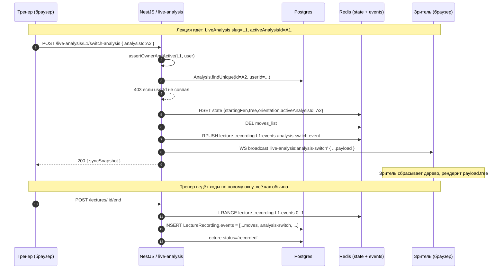

# ADR-142: Переключение между окнами анализа во время записи лекции

**Статус:** Черновик на ревью координатором
**Дата:** 2026-06-25
**Задача:** KS-4626
**Связанные ADR:** [ADR-110](./110-live-analysis-broadcast.md), [ADR-111](./111-live-analysis-full-broadcast.md), [ADR-112](./112-live-analysis-per-analysis-binding.md), [ADR-113](./113-coach-page.md), [ADR-116](./116-lecture-audio-p2p.md), [ADR-117](./117-lecture-student-tools-policy.md), [ADR-119](./119-lecture-ui-coach-student.md)

## 1. Контекст

### 1.1 Что есть сейчас

Лекция в текущей реализации (ADR-113) — единая live-сессия `LiveAnalysis`:

- `Lecture.liveAnalysisId` — **единственная** ссылка на трансляцию. Partial UNIQUE «один live = одна live-лекция» (`schema.prisma:2215`).
- `LiveAnalysis.analysisId` — исходный `Analysis`, с которого тренер запустил трансляцию (ADR-112). FK неизменяем после `POST /live-analysis`.
- На одной live-сессии у тренера одна доска, одно дерево вариаций (`state.tree`), одна стартовая позиция (`state.startingFen`), одна ориентация.
- Событийный поток в Redis `lecture_recording:<liveAnalysisId>:events` — линейный массив событий типа `move | state-patch | reset | closed` с меткой `t` (мс от `lecture.startedAt`); финализатор склеивает в `LectureRecording.events` (см. `live-analysis.service.ts:585-624`).
- `applyReset(slug, fen)` сбрасывает state: меняет `startingFen`, чистит `tree`, эмитит `live-analysis:sync` (`live-analysis.service.ts:1126-1186`). Запись фиксируется как `{type:'reset', payload:{fen, orientation}}` — без `analysisId`, без дерева.

### 1.2 Что хочет тренер

> Тренер во время лекции должен мочь переключаться между несколькими окнами анализа (заранее подготовленные разные партии или разные дебюты в одной лекции).

Сценарий:

1. Тренер заранее у себя в «Моих анализах» подготовил три анализа: разбор партии Карлсен–Накамура, дебют Каро-Канн с деревом вариаций, эндшпиль ладья+слон против ладьи.
2. Начинает лекцию из первого окна анализа (как сейчас).
3. Через 10 минут хочет одним кликом переключиться на второе окно: у зрителей доска и всё дерево варьаций мгновенно меняются на заранее подготовленное содержимое второго анализа.
4. Запись лекции при просмотре в replay воспроизводит переключения в нужные моменты.

### 1.3 Что мешает текущей модели

- `applyReset` сбрасывает только FEN — теряются заранее подготовленные варианты, аннотации (NAG), комментарии, headline, PGN headers. Тренер вынужден переигрывать дерево вручную, чего и стремится избежать.
- Открыть второй `/analysis/:id2` в новой вкладке и переключиться на неё ведёт к **другой** live-сессии (`LiveAnalysis` со своим slug). Зрители первой сессии останутся слушать тишину на старой доске.
- Внутри одной live-сессии нет понятия «текущий активный analysisId» — поле `LiveAnalysis.analysisId` неизменяемо и отражает только исходник.

### 1.4 Что нужно от ADR

Спроектировать решение, при котором:

1. Тренер из live-режима лекции переключает «активное окно анализа» одним действием.
2. Все зрители live получают новое состояние доски и дерево — синхронно с тренером.
3. Запись лекции переживает переключения; replay-плеер воспроизводит их с правильной меткой времени.
4. Аудио тренера (ADR-116) **не прерывается** — это сквозной поток, не связанный с конкретным анализом.
5. Минимум миграций и операционных изменений; масштаб — один разработчик.

### 1.5 Что НЕ в скоупе

- Параллельное вещание нескольких досок одновременно (split-view). Тренер всегда показывает одно окно за раз.
- Параллельная работа двух тренеров над одной лекцией (co-coaching).
- Возможность ученику видеть «другую» доску, отличную от текущей у тренера (override). Зритель всегда видит то же окно, что и тренер.
- Управление списком заранее подготовленных «окон» через отдельную страницу/коллекцию. В MVP — переключение на любой свой `Analysis` из ad-hoc picker'а; постоянный «плейлист» лекции — Phase 2.
- Push-уведомления зрителю «тренер сменил тему».

## 2. Решение

### 2.1 Общая идея

Сохраняем модель «одна `LiveAnalysis` на лекцию». Расширяем семантику live-сессии: внутри одной сессии есть **текущий активный `analysisId`**, который может меняться в эфире. Каждое переключение пишется отдельным событием в поток записи.

Концептуально это аналог `reset`, но «жирный»: вместо чистого FEN — полный snapshot нового окна анализа (стартовая позиция + дерево вариаций + ориентация + метаданные).

### 2.2 Новый тип события `analysis-switch`

В существующий набор событий записи (см. `recordLectureEvent` в `live-analysis.service.ts:600`) добавляется тип `analysis-switch` со следующим payload:

```ts
type AnalysisSwitchEvent = {
  t: number;                    // мс от lecture.startedAt
  type: 'analysis-switch';
  payload: {
    /** Источник: id Analysis, на который тренер переключился. */
    analysisId: string;
    /** Заголовок окна — для отображения у зрителя ("На разбор: Каро-Канн"). */
    title: string;
    /** Стартовый FEN; null — стандартная начальная позиция. */
    startingFen: string | null;
    /** Ориентация доски в момент переключения. */
    orientation: 'white' | 'black';
    /** Полное дерево вариаций (формат `Analysis.tree`/`state.tree`).
     *  null — окно ещё без дерева, доска стартует со startingFen. */
    tree: unknown | null;
    /** Текущая глобальная позиция в дереве (как в state.currentGlobalIndex);
     *  null — корень. */
    currentGlobalIndex: number | null;
    /** Опционально — PGN headers (white/black/event/date/result),
     *  чтобы зритель видел контекст партии. */
    headers?: {
      white?: string; black?: string; event?: string;
      date?: string; result?: string;
    };
  };
};
```

Новый тип расширяет union `'move' | 'state-patch' | 'reset' | 'closed' | 'analysis-switch'` в `recordLectureEvent`.

**Почему отдельный тип, а не расширенный `reset`.** `reset` уже описан в трекере и фронте как «сменить позицию» (узкая операция). Семантика переключения окна шире: это смена контекста партии целиком. Отдельный тип:
- не ломает существующий код, читающий `reset`;
- ясно отличается в analytics и в replay-логе;
- payload крупный (целое дерево), не путается с лёгким `reset.payload`.

### 2.3 Изменение Redis-state у `LiveAnalysis`

В hash `live_analysis:<id>:state` добавляется ключ:

- `activeAnalysisId: string | null` — id текущего активного Analysis. Инициализируется значением `LiveAnalysis.analysisId` при первом subscribe (если оба null — остаётся null).

При `analysis-switch`:

1. Валидация: switchTarget — это `Analysis`, принадлежащий тому же `User`, что владеет `LiveAnalysis`. Чужие анализы не переключаются.
2. Snapshot выбранного `Analysis` забирается из БД (`tree`, `fen` как startingFen, `boardOrientation`, заголовок, headers).
3. Записывается в state hash: `startingFen`, `orientation`, `tree`, `currentGlobalIndex`, `activeAnalysisId`. Очищаются производные (currentPgn, lastPatchAt). Чистится `moves`-список (нет ходов поверх нового дерева).
4. Эмитится `live-analysis:sync` snapshot с новым `startingFen`, `orientation`, `tree`, `activeAnalysisId`, `title`.
5. В `lecture_recording:<liveAnalysisId>:events` пишется событие `analysis-switch` с полной нагрузкой (см. §2.2).

**Поле `LiveAnalysis.analysisId` в БД не меняется.** Оно остаётся неизменной отметкой «исходник трансляции». Это:

- сохраняет partial UNIQUE индекс «один автор × один анализ = один active» (ADR-112) без необходимости обновлять при каждом switch;
- упрощает аудит «с чего тренер начал»;
- активное окно — короткоживущее runtime-состояние, корректное место для него Redis (как `currentFen`, `tree`).

### 2.4 Snapshot текущего активного окна

`sync`-snapshot, который получает зритель при subscribe и при switch, расширяется опциональным полем:

```ts
type LiveAnalysisSyncSnapshot = {
  // ... существующие поля (slug, startingFen, orientation, tree?, currentGlobalIndex?)
  /** KS-4626: текущий активный Analysis. null — лекция без привязки или
   *  тренер не начинал переключение (используется исходный LiveAnalysis.analysisId). */
  activeAnalysisId?: string | null;
  /** Заголовок активного окна — для UI зрителя ("Сейчас разбираем: X"). */
  activeTitle?: string;
};
```

Frontend зрителя при `analysis-switch`/`sync` обновляет надпись над доской и сбрасывает локальное состояние дерева.

### 2.5 Влияние на схему БД

**Миграций нет.** Все изменения:

- В `live_analyses.state` (Redis hash) — runtime, не БД.
- В `lecture_recordings.events` (Json) — новый тип события. Поле `Json`, существующие записи валидны.
- Шапку Lecture/LiveAnalysis не трогаем.

**Опционально (Phase 2): «плейлист анализов лекции».** Если тренеру окажется удобнее иметь заранее зафиксированный список окон (а не выбирать ad-hoc каждый раз), добавляем таблицу:

```prisma
/// KS-4626 / ADR-142 Phase 2. Заранее подготовленный «плейлист» окон
/// анализа лекции. 1:N от Lecture. Порядок — `position` asc.
model LectureAnalysisSlot {
  id         String   @id @default(uuid()) @db.Uuid
  lectureId  String   @map("lecture_id") @db.Uuid
  lecture    Lecture  @relation(fields: [lectureId], references: [id], onDelete: Cascade)
  analysisId String   @map("analysis_id") @db.Uuid
  analysis   Analysis @relation(fields: [analysisId], references: [id], onDelete: Cascade)
  /// Опциональный человекочитаемый ярлык, если тренеру удобно
  /// называть слот иначе, чем сам анализ ("Дебют 1", "Финал").
  label      String?
  /// Порядок отображения в panel'е. asc.
  position   Int
  createdAt  DateTime @default(now()) @map("created_at")
  @@unique([lectureId, analysisId])
  @@index([lectureId, position])
  @@map("lecture_analysis_slots")
}
```

В Phase 2 это даёт UX «настроил список один раз → один клик во время эфира». В MVP не нужно: тренер выбирает любой свой Analysis из существующего picker'а.

### 2.6 REST-контракт

Новый endpoint:

```
POST /live-analysis/:slug/switch-analysis
Body: { analysisId: string }
Resp: LiveAnalysisSyncSnapshot
```

Гарды и проверки:

- `JwtAuthGuard` — только аутентифицированные.
- `assertOwnerAndActive(slug, userId)` — переключать может только владелец трансляции.
- Валидация: `Analysis.userId === userId` (нельзя переключиться на чужой анализ). При нарушении — `403 forbidden_analysis`.
- Rate-limit: используется существующий `authorStatePatchLimiter` (логически switch ≈ жирный state-patch) либо отдельный bucket с 1 op/sec (Phase 1 — переиспользуем существующий).
- Размер payload (`tree`): тот же hard cap, что у `state-patch` — 256 KB на сериализованное дерево. При превышении — `400 tree_too_large`.

`POST` (не `PATCH`), потому что операция меняет состояние трансляции и пишет событие в журнал — семантически action, не частичное обновление поля.

**Расширение существующих endpoint'ов.**

- `GET /live-analysis/:slug/snapshot` — в ответ добавляется `activeAnalysisId?`, `activeTitle?` (см. §2.4).
- `GET /lectures/:id` (ADR-119) — без изменений; информация о switch'ах живёт в `recording.events`.

### 2.7 WebSocket-контракт

В существующий namespace `/live-analysis` (ADR-110) добавляется:

- **Server → клиент**: событие `live-analysis:analysis-switch` — payload идентичен `AnalysisSwitchEvent.payload` (см. §2.2). Срабатывает у всех подключённых зрителей в room=`slug`. Зрители на это событие:
  - сбрасывают локальное дерево;
  - применяют `startingFen` / `orientation` / `tree` / `currentGlobalIndex` к доске;
  - показывают transient-уведомление «Тренер переключился на: <title>».

- **Server → клиент**: существующий `live-analysis:sync` теперь несёт `activeAnalysisId`, `activeTitle` в payload.

- Клиентских команд не добавляется. Тренер инициирует switch через REST (см. §2.6); WS-broadcast — производное событие.

### 2.8 Replay-плеер

`LectureReplayPage` (ADR-119) на каждом такте таймера ищет события `event.t <= currentTimeMs` и применяет их. Логика поведения по типам:

- `move` / `state-patch` / `reset` — как сейчас.
- **Новое**: `analysis-switch` — плеер делает «жирный сброс» состояния: переинициализирует `chess.js`-движок с `payload.startingFen`, заливает дерево, ставит ориентацию, обновляет «title-bar» доски заголовком `payload.title`. Дальше move-события применяются к новому дереву.

При перемотке назад через границу switch:
- Плеер ищет последний `analysis-switch` event с `t <= currentTimeMs`; если нет — стартует с исходного `LiveAnalysis.analysisId` (см. `LectureRecording.startingFen`). Затем применяет события от точки switch'а до `currentTimeMs`.
- Реализация: при seek пере-проигрывается всё с последнего «жирного» события (`reset` или `analysis-switch`) — O(secondsInSegment), не O(всейЛекции).

В timeline-баре плеера (Phase 2) — отметки переключений: цветные риски с подписями «→ Каро-Канн», «→ Эндшпиль». Помогают ученику ориентироваться и быстро прыгать к нужной теме.

### 2.9 UI тренера

Расширяется `LecturePublisherControls` (модуль `apps/web/src/components/lecture/LecturePublisherControls.tsx`):

**MVP — переключение на любой свой Analysis:**

```
┌─ LecturePublisherControls ──────────────────────────────────┐
│  [● ЗАПИСЬ] [⏸ Пауза]  [🎤 Микрофон ON]    [⚙ Настройки]   │
│                                                              │
│  Сейчас в эфире: «Каро-Канн — основные планы белых»          │
│  [▾ Переключить окно анализа]                                │
│  └─ при клике: popover со списком «Мои анализы» (recent +    │
│     поиск). Клик по элементу → POST /switch-analysis →       │
│     toast «Переключено: <title>». Доска у тренера сразу       │
│     обновляется (sync snapshot).                              │
└──────────────────────────────────────────────────────────────┘
```

В popover:
- Сверху — текущий активный (отмечен ✓, кликабельность отключена).
- Список последних открытых `Analysis` (`/analyses?limit=20&sort=lastOpenedAt`).
- Поле поиска (debounce 200 мс) — на случай большого списка.
- Кнопка «Открыть мои анализы» — переход в `/analyses` с кнопкой «вернуться к лекции» (banner сверху).

**Phase 2 — настроенный «плейлист» (если введена `LectureAnalysisSlot`):**

```
┌──────────────────────────────────────────────────────────────┐
│  Окна анализа лекции:                                        │
│  [① Партия Карлсен ✓] [② Каро-Канн] [③ Эндшпиль] [+]         │
│                                                              │
│  ✓ — активное сейчас; клик по другой плашке = switch.        │
│  [+] — открыть picker и добавить новый слот.                 │
└──────────────────────────────────────────────────────────────┘
```

Слоты сохраняются между сессиями — тренер может ещё до старта лекции открыть `LectureSettingsModal` (ADR-119 §4.3), на новом табе «Окна анализа» собрать список, а в эфире уже не тратить время на picker.

### 2.10 UI зрителя (live)

`AnalysisPage` в режиме `liveSession.mode='viewer'` подписывается на `analysis-switch`. По событию:

- Сверху доски короткий toast: «Тренер переключился на: <title>» (5 сек, dismissable).
- Заголовок над доской меняется на `payload.title`.
- Доска и дерево перерисовываются полностью (новые `startingFen` / `tree` / `orientation`).
- Любые «локальные» вариации зрителя в Workshop-режиме (если ADR-117 разрешает) — сбрасываются вместе с деревом тренера. Без специального confirm'а: ученик понимает, что тема сменилась.

Если ученик в момент `analysis-switch` оказался offline и переподключился — `live-analysis:sync` отдаст ему сразу актуальный snapshot с активным окном (см. §2.4). Никаких «потерянных» switch'ей нет.

### 2.11 UI зрителя (replay)

`LectureReplayPage` дополнительно:

- Над доской — заголовок текущего окна (берётся из последнего `analysis-switch` ≤ `currentTimeMs`).
- В timeline-баре (Phase 2) — chip'ы переключений; клик на chip = seek к моменту switch'а.
- При обычном play — switch'и применяются автоматически, как в live.

### 2.12 Аудио (ADR-116) — не задето

Аудио тренера пишется сквозным потоком в чанках MediaRecorder, привязка к ходам — через `recorderStartedAtClient` (offset). Переключение окна анализа не прерывает MediaRecorder; в записи аудио идёт без склейки. В replay плеер синхронизирует доску с `audio.currentTime` (ADR-115/116 §2.4); switch-события применяются по тому же таймеру, что и `move`. Никаких отдельных «треков аудио на окно» не вводим.

### 2.13 Чат лекции (ADR-121) — не задето

Чат сквозной для всей лекции. Сообщения зрителя не привязаны к конкретному окну. Если в будущем понадобится «пометить сообщение окном, на которое оно реагирует» — отдельный ADR.

## 3. Sequence-диаграмма



## 4. Альтернативы и почему отвергнуты

### 4.1 Несколько `LiveAnalysis` на одну лекцию (Lecture 1:N LiveAnalysis)

Каждое окно — отдельная live-сессия со своим slug. Lecture хранит `activeLiveAnalysisId` + массив всех своих.

Pro: каждое окно изолировано, переключение = смена WS-room.
Contra:
- Зритель при switch должен сделать handover (отписка от старого slug, подписка на новый). Это лишний round-trip, риск пропустить ход.
- Финализатор записи усложняется: события из N Redis-ключей нужно сливать в один отсортированный по `t` поток.
- Partial UNIQUE «один live = одна live-лекция» (ADR-113) ломается, нужна миграция и переосмысление инварианта.
- Audio-сессия (ADR-116) одна на лекцию; разные LiveAnalysis на одной лекции рассогласовывают модель.

Цена: дни разработки + миграция данных. Выгоды над §2 — нет.

### 4.2 Расширить `reset` (вместо нового типа события)

`applyReset(slug, fen)` → `applyReset(slug, { fen, tree, orientation, analysisId, title })`.

Pro: одна точка изменения, меньше типов.
Contra:
- Семантическая перегрузка: `reset` сейчас лёгкий (только FEN), будет тяжёлый (целое дерево). В analytics и логах не отличается.
- Текущие клиенты (`useLiveAnalysisViewer` хук) обрабатывают `reset` как «локальный сброс FEN» и не ожидают payload с деревом.
- Backward compat: если когда-то останется старый клиент, он получит «жирный» reset и проигнорирует tree — ошибочный UX.

Отдельный тип события ясно разделяет «сброс на чистую позицию» (`reset`) и «смена окна анализа» (`analysis-switch`).

### 4.3 Хранить активный analysisId в БД (`LiveAnalysis.activeAnalysisId`)

Pro: персистентность, переживает рестарт Redis.
Contra:
- Каждое переключение = UPDATE строки `LiveAnalysis`. На длинной лекции с частыми switch'ами — лишний write на каждый клик.
- Активное окно — короткоживущее runtime-состояние (как `currentFen`); место для такого — Redis state hash, как у других runtime-полей.
- Восстановление при сбое: для replay используется журнал событий (`recording.events`), не текущее БД-поле. Финализатор увидит последний `analysis-switch` в Redis-списке и сохранит цепочку.

### 4.4 Заранее переключаемый «плейлист» как обязательная модель (LectureAnalysisSlot уже в MVP)

Pro: вся ментальная модель «окон» зафиксирована тренером заранее.
Contra:
- Требует ещё один UX-флоу (создание слотов) до старта лекции. Усложняет MVP.
- В частых случаях тренер хочет переключиться на «вспомнил» партию по ходу — это импровизация, плейлист избыточен.

В §2.5 — Phase 2 как удобство, MVP — без таблицы.

### 4.5 Split-view (две доски на экране одновременно)

Pro: можно сравнивать позиции.
Contra:
- Радикальная перестройка `AnalysisPage`, breakpoint'ы, sidebar.
- Тренер с одной доской ведёт лекцию (нет двух мышей).
- Зритель смотрит в одну точку — split не делает урок понятнее.

Не нужно для KS-4626; вне скоупа.

## 5. План внедрения

### Эпик A — Backend (1-2 дня)

- **KS-A01 [backend]** — Расширить тип события: добавить `analysis-switch` в union `recordLectureEvent`. Обновить `RecordedEvent` type в `packages/shared/types/api-contracts.ts`.
- **KS-A02 [backend]** — `LiveAnalysisService.applySwitchAnalysis(slug, actingUserId, analysisId)`: валидация owner-trainer + owner-analysis, чтение `Analysis.tree/fen/orientation/title`, запись в Redis state hash, очистка moves-list, publish `live-analysis:analysis-switch`, RPUSH события в `lecture_recording:<id>:events`.
- **KS-A03 [backend]** — `POST /live-analysis/:slug/switch-analysis` controller + DTO; guard `JwtAuthGuard`; rate-limit reuse `authorStatePatchLimiter`. Размер `tree` — cap 256 KB.
- **KS-A04 [backend]** — Расширить `LiveAnalysisSyncSnapshot`: `activeAnalysisId?`, `activeTitle?`. Прокинуть в `sync`-broadcast и в `GET /live-analysis/:slug/snapshot`.
- **KS-A05 [backend]** — Финализатор записи (`finalizeLectureRecording`): events с типом `analysis-switch` сохраняются как есть в `LectureRecording.events`; считаются для `byteSize`/`eventCount` штатно. Никаких особых ветвлений не нужно.
- **KS-A06 [backend]** — Unit-тесты: `applySwitchAnalysis` (валидация owner, рассинхрон tree → 400, чужой analysis → 403, корректный sync snapshot, корректная запись в Redis).

### Эпик B — Frontend тренера (2 дня)

- **KS-B01 [frontend]** — Хук `useLectureAnalysisSwitcher(slug)`: получение списка `Analysis` (`useMyAnalyses({limit:20})`), POST в switch-endpoint, оптимистическое обновление состояния доски (доверяем приходящему sync, не предугадываем).
- **KS-B02 [frontend]** — UI: popover «Переключить окно» в `LecturePublisherControls`. Список recent + search (debounce 200 мс). Дизлэйбл при сетевой ошибке, toast при успехе.
- **KS-B03 [frontend]** — Подсветка активного окна в шапке доски тренера: «В эфире: <title>».

### Эпик C — Frontend зрителя (live + replay)

- **KS-C01 [frontend]** — Подписка `AnalysisPage` (mode='viewer') на `live-analysis:analysis-switch`: сбрасывает локальное состояние, применяет payload, показывает toast.
- **KS-C02 [frontend]** — Обработка `activeAnalysisId`/`activeTitle` в `sync` snapshot (на reconnect).
- **KS-C03 [frontend]** — `LectureReplayPage`: применение `analysis-switch` событий по таймеру; при seek — пере-проигрывание от последнего «жирного» события.
- **KS-C04 [frontend]** — Заголовок над доской в replay — берётся из ближайшего предыдущего `analysis-switch.title` (или `lecture.title` если switch'ей не было).

### Эпик D — Shared types

- **KS-D01 [backend]** — Добавить в `packages/shared/types/api-contracts.ts`:
  - тип события `AnalysisSwitchEvent` в дискриминированный union `RecordedEvent`;
  - `SwitchAnalysisRequest`/`SwitchAnalysisResponse`;
  - расширить `LiveAnalysisSyncSnapshot` опциональными `activeAnalysisId`/`activeTitle`.

### Эпик E — QA

- **KS-E01 [qa]** — Тренер начинает лекцию из A1, через минуту переключается на A2 → зритель видит новое дерево и `title` ≤1 сек после клика.
- **KS-E02 [qa]** — Тренер делает 3 переключения, завершает лекцию → в `LectureRecording.events` ровно 3 события `analysis-switch` с корректными `t`.
- **KS-E03 [qa]** — Replay: запускаем запись, наблюдаем переключения в нужные моменты; seek назад через границу switch'а корректно восстанавливает дерево.
- **KS-E04 [qa]** — Чужой Analysis в POST `/switch-analysis` → 403.
- **KS-E05 [qa]** — Tree размером 300 KB → 400 tree_too_large.
- **KS-E06 [qa]** — Zритель reconnect в момент после switch'а → получает актуальное окно через `sync` snapshot.
- **KS-E07 [qa]** — Аудио тренера непрерывно в момент switch'а: в записи нет дырки/щелчка.

### Phase 2 — отложенное (не в первой выкатке)

- **F01 [backend]** — Миграция `lecture_analysis_slots` (§2.5).
- **F02 [backend]** — CRUD endpoint'ы для слотов: `POST/PATCH/DELETE /lectures/:id/analysis-slots`.
- **F03 [frontend]** — Таб «Окна анализа» в `LectureSettingsModal` (ADR-119).
- **F04 [frontend]** — Tabs-bar в `LecturePublisherControls` вместо popover'а.
- **F05 [frontend]** — Chip'ы переключений в timeline replay-плеера.

### Карта зависимостей

```
D (Shared types) ─┬─→ A (Backend)
                  └─→ B, C (Frontend)
A ─→ B, C
E (QA) ─→ после A+B+C
```

Параллелизм: A и D можно делать одновременно (D — мелкие type-defs). E зависит от завершения A+B+C.

## 6. Риски и подводные камни

1. **Большой `tree` в payload.** У некоторых анализов дерево вариаций — 100+ KB. WS-сообщение `analysis-switch` уйдёт всем зрителям одной комнаты — при 50 зрителях это 5 МБ исходящего на один клик тренера. Митигация: уже работающий cap 256 KB (тот же, что для `state-patch`); если в проде увидим всплески у тренеров с громоздкими анализами — рассмотреть отдельный `GET /analyses/:id/tree` и пересылку только указателя `analysisId` через WS (зритель сам подтягивает дерево). В MVP — inline-payload.

2. **Тренер переключился, не сохранив правки в текущем окне.** Текущий `state-patch` живёт только в Redis state lecture-сессии — у самого `Analysis` в БД он не сохраняется (источник правды — события). После switch'а runtime-state перезаписывается; правки тренера к старому окну остаются в `LectureRecording.events` (history), но не в `Analysis.tree`. Это уже текущее поведение `reset` — не регрессия. Если тренер хочет «сохранить вариации в Analysis перед switch'ом» — отдельный UX-флоу, вне скоупа KS-4626.

3. **Конкурентный switch при двух открытых вкладках тренера.** Маловероятный случай (тренер ведёт лекцию из одной вкладки), но возможный. `runExclusive(slug)` в `LiveAnalysisService` (`live-analysis.service.ts:1131`) уже сериализует операции, два switch'а отработают по очереди. Последний переписывает state — нормально.

4. **Зритель в момент `analysis-switch` пишет/анализирует локально.** В `studentToolsPolicy` (ADR-117) зрителю могут быть разрешены свои вариации (`disabledTools` не запрещает Workshop). После switch'а локальные вариации зрителя теряются. Это by design — тема урока сменилась. Можно показывать confirm «Вы потеряете свои заметки»; в MVP — без confirm'а (упрощение).

5. **Replay seek через границу switch'а.** Корректное поведение — найти последний `analysis-switch ≤ t` и применить его, потом forward до `t`. Если seek в самое начало лекции (до первого switch'а) — стартовое окно берётся из `LectureRecording.startingFen`/`orientation`, дерево — пустое (как сейчас при start без `state-patch`). Особый кейс: лекция стартовала с дерева исходного `Analysis`. Решение: финализатор инжектит синтетический `analysis-switch` событие на t=0 с данными исходного `LiveAnalysis.analysisId`, чтобы replay имел всегда явную «нулевую точку». Реализация в KS-A05.

6. **Audio offset (ADR-116) при долгих лекциях с многими switch'ами.** Аудио идёт сквозным потоком, switch'и в треке не отражаются. Синхронизация замыкается на `recorderStartedAtClient` (один offset на всю лекцию). Не задето.

7. **Дрожание UI зрителя при частых switch'ах.** Если тренер быстро перещёлкивает окна (debug-сценарий), у зрителя успеет смениться доска 3-4 раза за пару секунд. Frontend: throttle на toast'ы (не более 1 в 2 секунды), сама доска обновляется без анимации. Дополнительно — backend rate-limit на switch (если переиспользуем `authorStatePatchLimiter` с лимитом 5 op/sec, это уже спасает).

8. **Анализ удалён в момент switch'а.** Тренер выбрал A2, между показом popover'а и кликом успел удалить A2 в другой вкладке. POST вернёт `404 analysis_not_found`. UI: toast «Анализ не найден, обновите список». Не критично, лекция продолжается на текущем окне.

9. **Анализ публичный, но не принадлежит тренеру (`isPublic=true` чужого пользователя).** Тренер не может переключиться на чужой анализ даже публичный — это вопрос UX-доверия (тренер показывает чужие материалы как свои). Решение: в MVP — только свои. Если потребуется «вставить чужую известную партию» — отдельный UX-flow (например, «дублировать к себе → переключиться»).

10. **Финализатор и порядок событий при многих switch'ах.** События идут через RPUSH в один Redis-список с monotonic `t = Date.now() - startedAt`. Порядок гарантирован Redis. Финализатор парсит as-is. Никаких особых сортировок не нужно.

## 7. Связь с соседними ADR

- **ADR-110/111/112** — транспорт остаётся; добавляется один WS-event и один REST-endpoint. Partial UNIQUE индексы (ADR-112) не задеты.
- **ADR-113** — модель Lecture не меняется. Поле `Lecture.liveAnalysisId` остаётся one-to-one.
- **ADR-115/116** — аудио независимо. Sync с ходами идёт по тому же `t`-таймеру; `analysis-switch`-события идут в общий поток `LectureRecording.events`.
- **ADR-117** — `disabledTools` действуют как и раньше после switch'а. Список инструментов — атрибут лекции, не отдельного окна.
- **ADR-118** — модель доступа (visibility/allowlist) не задета. Зритель имеет тот же доступ ко всем окнам внутри одной лекции.
- **ADR-119** — UI лекций. Добавляется секция «окна анализа» в `LecturePublisherControls` (MVP) и опционально таб «Окна анализа» в `LectureSettingsModal` (Phase 2).
- **ADR-121** — чат лекции сквозной; не меняется.

## 8. Резюме для координатора

- **Что меняется:** один новый REST-endpoint (`POST /live-analysis/:slug/switch-analysis`), один новый WS-event (`live-analysis:analysis-switch`), один новый тип события записи (`analysis-switch`). Без миграций БД.
- **Что не меняется:** структура Lecture/LiveAnalysis, аудио-конвейер, чат, ACL.
- **Объём:** ≈ 1-2 backend-дня + 2 frontend-дня + QA. Покрывается одним эпиком KS-4626 с 5-6 задачами.
- **Phase 2 (опц.):** таблица `LectureAnalysisSlot` для заранее настроенного плейлиста. Отдельный эпик, не блокирует MVP.
- **Главный риск:** объём `tree`-payload в WS-broadcast при 50+ зрителях. Митигировано существующим cap'ом 256 KB; запас под отдельный fetch на стороне зрителя.
