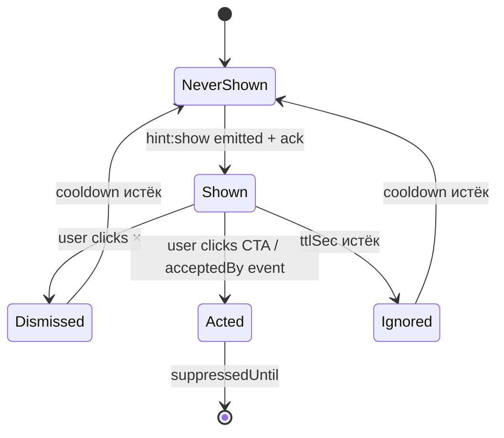
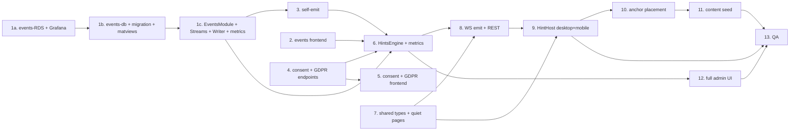

# ADR-147 — Контекстные подсказки пользователю на основе аналитики действий

- Статус: **Proposed** (2026-06-27)
- Дата: 2026-06-27
- Связанные задачи: KS-4678
- Связанные ADR: ADR-004 (API+WS), ADR-024 (lessons-module — пример декларативного контента), ADR-026 (user-courses — прогресс пользователя), ADR-128 (public routes / guest)
- Автор: architect

---

## 0. TL;DR

Заводим модуль `hints` в `apps/api` + новую инфру событий. **Обслуживаются и авторизованные, и гости** (см. §1.1) — единая модель actor (`actor_type` ∈ {user, guest}, `actor_id`), guest идентифицируется подписанным cookie `guest_id`, при регистрации происходит merge гостевых данных под новый `user_id`. Pipeline сразу под целевую нагрузку 600K событий/день: источники (frontend `POST /events`, backend self-emit) → **Redis Streams** (`actor_events:stream`, durable, AOF, consumer groups) → **Events Writer Worker** → **отдельная events-RDS** (PostgreSQL + `pg_partman` weekly partitions, retention 90 дней) + параллельно **Redis hot counters** для коротких окон. HintsEngine читает **materialized views** (длинные окна) + Redis counters (короткие окна), никогда не сканирует raw `actor_events`. Правила — декларативный JSON-DSL в таблице `hints` с полями `i18n`, `acceptedBy`, `targetActorTypes`; редактирование через **полный админ-UI с самого MVP** (seed — только bootstrap чистой БД). Доставка: **push через WebSocket для авторизованных** + **pull `GET /hints/pending` раз в 15 сек для гостей** (новый WS-namespace для гостей не оправдан). Placement — anchor по `data-hint-anchor="<id>"` в DOM, рендер **desktop popover + mobile bottom-sheet в одном тикете**. Lifecycle (`viewed | dismissed | acted | ignored`) трекается обратно. Глобальные лимиты **конфигурируемы через feature-flags** (default ≤1 показ/10 мин, ≤5/сессия), namespace ключей единый — `actor_id`. Согласие на трекинг — через cookie-banner (единый для user и guest), без согласия гость не получает `guest_id` и не трекается. **GDPR endpoint'ы delete/export для обоих actor-типов — часть этого ADR**. Observability встроена в Этап 1. Масштабирование при росте — только в рамках PG-стека (§7A).

---

## 1. Контекст и проблема

Сайт оброс функциональностью (puzzle-rush, blind board, tactic-drills, opening-trainer, lectures, user-courses, archive, live-analysis), и большинство пользователей пользуется ≤30% возможностей. Tour-онбординг на старте пробовать не хотим: он раздражает и быстро забывается. Цель — **живые контекстные подсказки**, которые реагируют на то, что пользователь делает прямо сейчас: «играешь третий рейтинговый блиц подряд — посмотри pre-move в настройках», «открыл свою партию без анализа — запусти анализ», «не решал пазлы 7 дней — забыли про rush-режим?».

Принципиальные ограничения:
- Архитектура выбирается **под верхнюю границу целевого сценария** §2.3 — 80K–600K событий/день («достижение цели десятки тысяч registered» из ADR-128 §7.4.2). Эволюция должна быть scale-out **в рамках одной технологии** (больше ресурсов, partition tuning, read replicas, агрегация — не смена СУБД). Smena PG → Clickhouse через 6–12 месяцев — это переписывание, оно недопустимо в roadmap; либо технология подходит на целевой объём, либо выбирается другая сразу.
- Существующий WS-канал и `Notification`-таблица **не подходят как есть**: notifications — это transactional inbox с историей; подсказки же эфемерные и не должны засорять колокольчик. Нужен отдельный канал, но через ту же gateway-сокетную инфраструктуру.
- Между источниками событий и storage должна быть durable очередь **с самого MVP** (см. §2.2). Перевод sync-write → async позже = переделка надёжности под нагрузкой, риск потерь — недопустимо.
- GDPR: пользователь должен иметь возможность отключить трекинг событий, и сами события должны храниться ограниченное время.
- **Гости и авторизованные пользователи обслуживаются в одном MVP** (см. §1.1). Сайт публичен (ADR-128, public routes), гости — значимая аудитория, и для них самые ценные подсказки — про регистрацию и базовые возможности. Заводить «функционал только для зарегистрированных» — означает лишать модуль самого ценного класса применения.

### 1.1. Аудитория и режимы

ADR покрывает **двух actor-типов** одинаково:

| Actor-тип | Идентификатор | Аутентификация | Жизнь идентификатора | Канал доставки подсказок | События |
|-----------|---------------|----------------|----------------------|--------------------------|---------|
| `user` | `user_id` (UUID) | JWT | до удаления аккаунта | WebSocket `MessageGateway` room `user:<user_id>` | пишутся при `analytics_consent = true` |
| `guest` | `guest_id` (UUID) | подписанный cookie | 365 дней (или до явного «забыть меня») | pull `GET /hints/pending` раз в 15 сек (см. §4.1) | пишутся при выборе галочки «Аналитика» в cookie-banner |

Где в ADR используется обобщённое понятие — пишется **actor** (`actor_id`, `actor_type`, `ActorHintState`). Где имеет значение специфика (например, доставка) — отдельно user / guest.

**Жизненный цикл guest → user (merge).** При успешной регистрации (`AuthService.register`) гостевые данные мигрируются под новый `user_id` в одной транзакции: `UPDATE actor_events SET actor_id=$newUserId, actor_type='user' WHERE actor_id=$guestId`, `UPDATE actor_hint_states SET actor_id=$newUserId, actor_type='user' WHERE actor_id=$guestId`, переключение Redis-ключей `agg:<guestId>:*` → `agg:<newUserId>:*` (SCAN+COPY+DEL). После merge cookie `guest_id` обнуляется. Если человек на другом устройстве — там guest_id остаётся отдельным, merge не происходит (это два независимых посетителя для системы).

---

## 2. Аналитика действий пользователя

### 2.1. Какие события собираем

Минимально достаточный список для первого набора правил (если правила потребуют — расширим декларативно, без изменения схемы):

| Категория | Тип события (`event_type`) | Откуда | Поля payload |
|-----------|---------------------------|--------|--------------|
| Сессия | `session_start` | frontend, при загрузке App после auth | `device`, `referrer` |
| Сессия | `session_idle` | frontend, при простое 60+ сек на странице | `page`, `idle_seconds` |
| Навигация | `page_view` | frontend, React Router listener | `path`, `prev_path` |
| Игра | `game_start` | backend, gateway после matchmaking | `time_control`, `rated`, `opponent_id` |
| Игра | `game_end` | backend, gateway | `result`, `termination`, `rating_delta` |
| Игра | `pre_move_used` | backend, gateway | `game_id` |
| Пазл | `puzzle_start` | backend, `puzzle.controller` | `puzzle_id`, `theme` |
| Пазл | `puzzle_solved` / `puzzle_failed` | backend | `puzzle_id`, `attempts` |
| Пазл-раш | `rush_start` / `rush_end` | backend, `puzzle-rush` | `score`, `mode` |
| Анализ | `analysis_open` | frontend | `game_id`, `source` |
| Анализ | `analysis_engine_started` | frontend | `game_id` |
| Курсы | `lesson_start` / `lesson_complete` | backend | `lesson_id`, `course_id` |
| Tactic-drill | `drill_start` / `drill_complete` | backend | `drill_id` |
| Действие | `feature_used` | frontend, generic | `feature_key` (например, `board_settings_opened`) |
| Подсказка | `hint_shown` / `hint_dismissed` / `hint_acted` / `hint_ignored` | backend сам пишет при доставке/реакции | `hint_id`, `rule_id` |
| Ошибка | `error_seen` | frontend, через ErrorBoundary | `kind` (network/render/api), `path` |
| **Гость** | `guest_signup_form_opened` | frontend, при открытии модала регистрации | — |
| **Гость** | `guest_play_attempted` | frontend, клик «Играть» без auth | `mode` (vs_bot/vs_human) |
| **Гость** | `guest_puzzle_attempted` | frontend, клик «Решить» без auth | — |
| **Гость** | `guest_landing_viewed` | frontend, время на лендинге | `seconds` |

Принцип: **не собираем мышь, клики и input-keystrokes**. Только высокоуровневые domain-события. Это держит и объём, и privacy-риски управляемыми.

Гостевые события (`guest_*`) и обычные (`page_view`, `session_idle`, `session_start`) пишутся одинаково от гостя и от пользователя — различает по `actor_type` (см. §2.3). Игровые/пазловые события (`game_*`, `puzzle_*`) пишутся только для авторизованных — у гостя нет состояния партии/пазла на бекенде до регистрации.

### 2.2. Где собираем

```mermaid
flowchart LR
  FE[Frontend\nReact 19] -- batch POST /events --> API[(apps/api\nEventsController)]
  GW[WebSocket gateways\n(game, message)] -- emit() --> EV[EventsService]
  API -- XADD --> RS[(Redis Streams\nactor_events:stream)]
  EV -- XADD --> RS
  RS -- consumer group\nevents-writer --> W[Events Writer Worker]
  W -- batch INSERT 1000/sec --> EDB[(events-RDS\nPostgres + pg_partman\nweekly partitions)]
  W -- INCR по counters --> RC[(Redis hot counters\nagg:user:type:window)]
  REFR[MatView Refresher\nevery 60s] -- REFRESH CONCURRENTLY --> MV[(materialized views\nactor_event_counts_*)]
  EDB --> MV
  RULES[HintsEngine] -- read --> MV
  RULES -- read --> RC
  RULES -- emit() --> WSOUT[MessageGateway\nroom user:id\nevent hint:show]
```

Компоненты с самого MVP — все, без поэтапного включения:

- **Frontend → API**: новый endpoint `POST /events` (rate-limited по IP, batch до 50 событий, schema-валидация class-validator). По образцу существующего `/logs`, но с персистенцией. Authn определяется на входе: JWT → `actor_type='user', actor_id=userId`; нет JWT, есть подписанный cookie `guest_id` → `actor_type='guest', actor_id=guestId`; нет ни того ни другого → 401. Guest-cookie ставится отдельным middleware (`GuestIdMiddleware`) при первом запросе любого endpoint'а, если пользователь не авторизован и согласие cookie-banner дано (см. §6.2).
- **Backend self-emit**: существующие сервисы (`game`, `puzzle`, `puzzle-rush`, `lesson`, `tactic-drill`) дёргают `EventsService.track(actor, type, payload)` в local-bus стиле, где `actor = { type: 'user', id: userId }`. Для гостей backend-self-emit не нужен (у гостя нет состояния партии/пазла на сервере).
- **Durable очередь — Redis Streams** (`XADD actor_events:stream`), а не Redis LIST. Streams нужен с самого начала по трём причинам:
  1. **Consumer groups + ACK**: можно запустить несколько writer-воркеров (sharding/HA) без дубликатов; необработанные сообщения PEL переживают рестарт воркера.
  2. **Persistence**: при включённом AOF (уже включён в нашей Redis-конфигурации) события переживают рестарт самой Redis-ноды.
  3. **MAXLEN ~ N**: автоограничение размера стрима, защита от bloat при downtime PG.

  Kafka/Redpanda/SQS отвергнуты для MVP: те же гарантии для нашего объёма даёт уже работающий Redis, новые операционные расходы не оправданы. Если в будущем понадобится cross-region durability или event sourcing с горизонтом >7 дней — заменим Streams на Kafka **без изменения контракта `EventsService.track()`** (см. §7A.3).
- **Events Writer Worker** — отдельный consumer group в `apps/api`. `XREADGROUP COUNT 1000 BLOCK 1000` → batch `INSERT ... SELECT FROM jsonb_to_recordset(...)` → `XACK`. Параллельно инкрементирует Redis hot counters для горячих агрегатов (см. §2.4).
- **events-RDS — отдельная PostgreSQL-инстанция**, не основной RDS приложения. Обоснование: write-нагрузка событий (даже на верхней границе 600K/день ≈ 7 INSERT/sec в среднем, пик 50/sec на турнире) не должна конкурировать с OLTP-нагрузкой игровых операций; разные характеристики vacuum, разные SLA. По образцу `archive-RDS` (ADR-018) и `broadcasts-RDS` (ADR-021). Конфигурация на старте — `db.t3.medium` Multi-AZ ($60/мес reserved 1y eu-central-1, по AWS pricelist 2026-06), на верхней границе целевого сценария — `db.r5.large` ($130/мес reserved). Это одна и та же RDS-семья, scale-out вертикальный, без миграции схемы.
- **`pg_partman` extension** — нативно доступен в AWS RDS Postgres (см. AWS docs, `Appendix.PostgreSQL.CommonDBATasks.html#…pg_partman`). Автоматическое создание/дроп еженедельных партиций таблицы `actor_events`. Партиционирование с самого MVP: на 600K событий/день за 90 дней retention это ~54M строк, что **уже бенефит** от партиционирования (быстрый drop старых партиций, узкие индексы на горячих).

Альтернативу «писать напрямую в PG из каждого сервиса без очереди» отвергаем: пик в момент окончания турнира = десятки `INSERT` на один игровой gateway-тик; sync-write по connection pool разваливается при первом всплеске.

### 2.3. Объём, индексы, retention

**Оценка объёма — это оценка, не измерение.** В проекте нет включённой DAU-метрики (нет Prometheus-counter активных сессий с дедупом по user_id, нет аналитического дашборда). Поэтому диапазон строится из двух косвенных опор:

1. **База пользователей.** Зафиксировано в ADR-128 §7.4.2 (KS-3401, страница `/player/:username`): «все зарегистрированные — на старте сотни/тысячи, цель — десятки тысяч». Это registered users, не DAU. Допускаем коэффициент активности 5–15% (отраслевая норма для freemium-сервисов; источник: усреднённые публичные данные SimilarWeb по chess.com / lichess.org за 2024, проверить точное значение нечем — мы не имеем доступа к их закрытой аналитике). При registered ∈ [1K, 50K] и активности 5–15% даёт DAU ∈ [50, 7500].
2. **События на одного активного пользователя в день.** Раскладка по §2.1, без эмпирических измерений:
   - `session_start` — 1
   - `page_view` — 10–30 (типичная сессия с навигацией по разделам)
   - `session_idle` — 1–3
   - `game_start` + `game_end` — 0–20 (от 0 у наблюдателя до 10 партий у активного блиц-игрока)
   - `pre_move_used` — 0–N (учитывается отдельно за партию)
   - `puzzle_start` + `puzzle_solved`/`puzzle_failed` — 0–60 (puzzle-rush сессия = десятки решений)
   - `rush_start` / `rush_end` — 0–4
   - `lesson_start`/`lesson_complete`, `drill_start`/`drill_complete` — 0–10
   - `hint_shown`/`hint_dismissed`/`hint_acted`/`hint_ignored` — 0–20 (учитывая глобальный лимит 5 показов/сессия и до 4 lifecycle-событий на каждый)
   - `error_seen` — редко, 0–2
   - `feature_used` — 0–10

   Суммарно: пассивный зритель ≈ 15 событий, средний играющий ≈ 50, heavy puzzle-rush сессия ≈ 150–200. Среднее по всем активным **оценочно 30–80**.

**Производное (грубая оценка ±2×):**

| Сценарий | DAU (оценка) | Событий на активного (оценка) | Событий/день |
|----------|--------------|------------------------------|--------------|
| Сегодня (низкая граница registered) | 50–500 | 30–50 | 1.5K–25K |
| Через 6–12 мес (рост базы) | 500–3K | 30–60 | 15K–180K |
| Достижение цели «десятки тысяч registered» | 2K–7.5K | 40–80 | 80K–600K |

**Целевая верхняя граница для архитектурного выбора — 600K событий/день** (правый край сценария «достижение цели»). Архитектура §2.2 (отдельная events-RDS + pg_partman + materialized views + Redis Streams) проектируется на эту границу с запасом ~3× и **не требует смены технологии** при достижении любого из заявленных сценариев — только масштабирования ресурсов (см. §7A).

**Что нужно сделать в момент запуска, чтобы заменить оценку измерением:** Prometheus-метрики `actor_events_ingested_total{type, actor_type}` (XADD-counter), `actor_events_inserted_total{type, actor_type}` (counter ACK-ов от writer'а), `actor_events_buffer_lag_seconds` (gauge `time.now - ts(oldest pending entry)`) встроены в T1c (см. §8) — после запуска MVP доверять им, а не оценкам.

Схема (Prisma DSL, для иллюстрации; реальную миграцию делает backend в новом пакете `packages/events-db` по образцу `packages/archive-db`):

```prisma
// Логическая модель. На уровне Postgres таблица создаётся как
// PARTITION BY RANGE (created_at) и управляется pg_partman:
// SELECT partman.create_parent('public.actor_events', 'created_at', 'native', 'weekly');
// pg_partman.run_maintenance() в cron'е добавляет/дропает партиции.
model ActorEvent {
  id        BigInt   @default(autoincrement())
  actorId   String   @map("actor_id") @db.Uuid       // user_id для type='user', guest_id для type='guest'
  actorType String   @map("actor_type") @db.VarChar(8)  // 'user' | 'guest'
  type      String   @db.VarChar(64)
  payload   Json     @db.JsonB
  createdAt DateTime @default(now()) @map("created_at")

  @@id([id, createdAt])  // pg_partman требует partition-key в PK
  @@index([actorId, type, createdAt(sort: Desc)])
  @@index([createdAt])
  @@map("actor_events")
}
```

- **Единая таблица `actor_events` для гостей и пользователей**, а не две раздельные. Обоснование: (1) DSL §3.2 одинаков для обоих типов и ходит по одному индексу, не двум; (2) materialized views агрегатов §2.4 — один набор, не задвоен; (3) при guest→user merge (см. §1.1) достаточно `UPDATE … SET actor_id=$new, actor_type='user'`, не cross-table миграция; (4) retention и партиционирование — одно правило. Cost: лишних 8 байт на строку (`actor_type varchar(8)`) — на 54M строк ≈ 400 МБ, пренебрежимо.
- `id BigInt`, а не UUID: 8 байт против 16, и для append-only логов UUID лишний.
- Композитный индекс `(actor_id, type, created_at desc)` — главный «рабочий» индекс правил. Он автоматически создаётся на каждой новой партиции через `pg_partman.template_table`. `actor_type` в индекс **не входит** намеренно: при guest→user merge `actor_id` меняется, тип меняется одновременно — фильтрация по `actor_type` всегда в комбинации с `actor_id`, селективность даёт сам `actor_id`.
- `payload` как `jsonb` — для редких ad-hoc запросов; GIN-индекс пока не вешаем (нет правил, которые фильтруют по полю payload).
- **Retention 90 дней** — управляется `pg_partman.retention_keep_table = false`, старые партиции **дропаются целиком** (мгновенная операция против многочасового `DELETE`-vacuum-цикла).

**Альтернатива «отдельная таблица `guest_events`» отвергнута:** дублирует схему, требует одинаковых матвью на двух таблицах, усложняет DSL (либо ходить в две таблицы и UNION, либо вводить flag в каждый запрос), при merge — сложная миграция строк между таблицами в транзакции. Единая таблица с `actor_type` решает всё нативно.

### 2.4. Агрегаты для триггеров

Правила DSL §3.2 оперируют **посчитанными агрегатами**, не сырыми событиями. Это требование выбрано к архитектуре с самого MVP, не follow-up — иначе при росте до верхней границы целевого сценария hot-path HintsEngine упрётся в полные сканы партиций.

Два слоя агрегации, оба заведены сразу:

**Слой 1 — materialized views на event-RDS** для «длинных» окон (24h, 7d, 30d):

```sql
CREATE MATERIALIZED VIEW actor_event_counts_7d AS
SELECT actor_id, actor_type, type, count(*) AS cnt, max(created_at) AS last_at
FROM actor_events
WHERE created_at > now() - interval '7 days'
GROUP BY actor_id, actor_type, type;

CREATE UNIQUE INDEX ON actor_event_counts_7d (actor_id, type);
```

Аналогично для окон 24h и 30d. Refresh — `REFRESH MATERIALIZED VIEW CONCURRENTLY actor_event_counts_7d` через worker раз в 60 секунд (для 7d/30d) и раз в 30 секунд (для 24h). `CONCURRENTLY` не блокирует чтение, требует unique-индекс (см. выше).

Стоимость refresh на верхней границе (54M строк за 90 дней): `count(*) … GROUP BY actor_id, actor_type, type` с index-only scan по партициям последних N дней — оценочно <2 секунды на db.r5.large (это **оценка**, измеряется через метрики T1c; bench по аналогичной операции на `archive-RDS` ADR-027 даёт <1 сек на 30M строк).

**Слой 2 — Redis hot counters** для «коротких» окон (1m, 10m, 1h) и для real-time правил вроде «3 рейтинговые партии подряд за 30 мин»:

```
ключ:     agg:<actor_id>:<type>:<window_id>
команда:  INCR <key>; EXPIRE <key> <window_seconds>
```

`actor_id` — это `user_id` либо `guest_id`, namespaces единый. При guest→user merge (см. §1.1) ключи `agg:<guest_id>:*` сканируются (`SCAN MATCH agg:<guest_id>:*`) и копируются под новый `actor_id` через `COPY`/`RENAME`, после чего старые удаляются. Инкрементируется **events-writer worker** одновременно с `INSERT` в PG (атомарность не нужна — eventual consistency для UI-подсказки приемлема; при ребуте writer'а краткое отставание восстановится со следующим refresh). HintsEngine читает Redis для коротких окон, materialized views — для длинных, **никогда** не запрашивает raw `actor_events` на hot-path. Прямой `SELECT FROM actor_events` оставлен только для ad-hoc отладки и для пересчёта при добавлении нового типа события.

**Что измеряет правильность выбора:** метрика `hints_aggregate_query_duration_seconds{layer}` (входит в Этап 1, не в отдельный T13 — см. §8). p95 для layer=`matview` цель <50 мс, для layer=`redis` цель <5 мс. Если matview просядет — это сигнал на ступень §7A.1 (vertical uplift / read-replica), не на переписывание pipeline.

---

## 3. Дерево подсказок

### 3.1. Формат правил

**Декларативный JSON в БД**, не код. Причины:
- Можно редактировать без деплоя (важно для контент-менеджмента подсказок — это маркетингово-продуктовая задача, не инженерная).
- Конфиг версионируется в `hint_rules` таблице (audit-trail кто и когда менял).
- DSL ограниченный: только примитивы count/exists/time-since/page-equals. Полный DSL не нужен — и так покроет 95% сценариев.

Схема (Prisma DSL — для иллюстрации):

```prisma
model Hint {
  id           String   @id @default(uuid()) @db.Uuid
  key          String   @unique @db.VarChar(64)  // стабильный id для аналитики, напр. "analyze-your-game"
  // i18n: JSON-объект { ru: {title, body, ctaLabel}, en: {...} }.
  // Решение принято с самого начала, не «определимся на T11»: проект уже двуязычный
  // (ru/en), отдельная таблица hint_translations усложняет CRUD и админ-UI без выгоды.
  // Валидатор требует наличия всех включённых в проект локалей.
  i18n         Json     @db.JsonB
  ctaHref      String?  @map("cta_href")          // относительный URL внутри SPA
  ctaEvent     String?  @map("cta_event")         // или клиентский event для in-page action
  anchor       String   @db.VarChar(64)           // значение data-hint-anchor на UI
  placement    String   @db.VarChar(16)           // 'top'|'bottom'|'left'|'right'|'overlay'|'bottom-sheet' (mobile)
  priority     Int      @default(0)               // выше = важнее при конфликте
  enabled      Boolean  @default(true)
  rule         Json     @db.JsonB                  // см. §3.2
  // acceptedBy — список event_type, наступление которых считается «smart-dismiss»
  // (см. §5.1). Если в течение 24 ч после показа произошло одно из них — acted_at = now()
  // без явного клика по CTA.
  acceptedBy   String[] @map("accepted_by") @db.VarChar(64)
  // targetActorTypes — для какого actor-типа подсказка валидна.
  // Значения: ['user'], ['guest'], ['user','guest']. Default — оба.
  // Для гостевой «сделай регистрацию» — ['guest']. Для «открой анализ» — ['user'].
  targetActorTypes String[] @map("target_actor_types") @default(["user","guest"]) @db.VarChar(8)
  cooldownSec  Int      @default(86400) @map("cooldown_sec") // после dismiss/show
  ttlSec       Int      @default(0) @map("ttl_sec")           // автозакрытие на UI, 0 = ручное
  maxShows     Int      @default(3) @map("max_shows")          // лимит за всё время
  createdAt    DateTime @default(now()) @map("created_at")
  updatedAt    DateTime @updatedAt @map("updated_at")

  @@map("hints")
}

// Ранее называлась UserHintState. Переименована в ActorHintState под единую модель
// гостей и пользователей (§1.1). actor_id содержит либо user_id, либо guest_id;
// actor_type различает. При guest→user merge actor_id+actor_type обновляются
// одним UPDATE без переноса строк между таблицами.
model ActorHintState {
  actorId         String   @map("actor_id") @db.Uuid
  actorType       String   @map("actor_type") @db.VarChar(8)
  hintId          String   @map("hint_id") @db.Uuid
  shownCount      Int      @default(0) @map("shown_count")
  lastShownAt     DateTime? @map("last_shown_at")
  dismissedAt     DateTime? @map("dismissed_at")
  actedAt         DateTime? @map("acted_at")
  suppressedUntil DateTime? @map("suppressed_until")

  @@id([actorId, hintId])
  @@index([actorId, suppressedUntil])
  @@map("actor_hint_states")
}
```

### 3.2. DSL правила (`rule` jsonb)

```json
{
  "all": [
    { "page": { "matches": "/play/*" } },
    { "count": { "event": "game_start", "where": { "rated": true }, "windowMin": 30, "gte": 3 } },
    { "not": { "event": "feature_used", "where": { "feature_key": "board_settings_opened" }, "sinceDays": 7 } }
  ]
}
```

Операторы первой версии:
- `page.matches` — текущая страница (frontend шлёт в hint-check вместе с запросом, см. §4).
- `count.event` + `windowMin|windowHours|windowDays|sinceDays` + `gte|lte|eq` — счётчик за окно.
- `exists.event` / `not.exists.event` — был ли в окне.
- `timeSince.event` + `gtMin|gtHours|gtDays` — давно ли последний раз.
- `actorType.equals` — `'user'` или `'guest'` (используется для targeting; дополнительно к полю `targetActorTypes` на самой Hint, фильтрация которого выполняется до DSL).
- `all` / `any` — логические комбинаторы.

Пример гостевого правила «гость 30 секунд на лендинге, не нажал «Зарегистрироваться»»:
```json
{
  "all": [
    { "actorType": { "equals": "guest" } },
    { "page": { "matches": "/" } },
    { "count": { "event": "guest_landing_viewed", "windowMin": 5, "gte": 1 } },
    { "not": { "exists": { "event": "guest_signup_form_opened", "windowDays": 1 } } }
  ]
}
```

Парсер DSL — небольшая чистая функция на 200–300 строк, без рантайм-зависимостей. Каждый оператор превращается в SQL-фрагмент (или Redis-чтение для горячих счётчиков). Незнакомый оператор → правило игнорируется + лог в `client-logs`-стиле.

### 3.3. Кто редактирует подсказки

**Полноценный админ-UI с самого MVP, не отложенный.** Маркетинг/контент редактирует подсказки самостоятельно через `/admin/hints` (список, форма создания/редактирования, превью текста с подстановкой `i18n`, превью DSL «как бы триггернулось», soft-delete с возможностью восстановления). Backend — стандартный CRUD на таблице `hints` с DSL-валидацией и admin-role guard.

Обоснование «полный UI сразу» vs «seed → UI потом» (расчёт в комментарии к KS-4678 от 2026-06-27):
- Дельта на MVP: ~5 дн backend+frontend vs ~0.5 дн на seed.
- Точка безразличия — 80–112 правок (≈5–7 мес при типичных 15 правок/мес).
- Качественные выгоды (скорость реакции маркетинга — секунды vs часы-дни, отсутствие bottleneck на разработчика, единый источник правды без рассинхронизации seed ↔ таблица) проявляются с первого дня.
- Принцип ADR: расширения архитектуры в будущем = техдолг, точку «пора» оценить нельзя, делаем полный вариант сразу.

Seed-файл `apps/api/prisma/seeds/hints.ts` остаётся **только как механизм первичной заливки** 10–15 базовых подсказок в чистую БД (см. §9). После запуска маркетинг работает через UI; seed не trying синхронизироваться с прод-данными и не выполняется на штатных миграциях прода (запускается одноразово при первичной инициализации events-RDS).

### 3.4. Разрешение конфликтов

Триггер: периодический check (см. §4.1) возвращает **массив** подходящих hint-ов. Выбираем один:

1. Сортируем по `priority desc, created_at asc`.
2. Фильтруем по `ActorHintState`: исключаем `suppressedUntil > now()`, `shownCount >= maxShows`, `dismissed_at within cooldown`.
3. Фильтруем по глобальным лимитам (§5.2): «≤1 показ за 10 минут», «≤5 за сессию».
4. Берём верхний. Остальные **не запоминаем как «скипнутые»** — просто появятся при следующем check, если их триггер всё ещё активен.

---

## 4. Доставка на UI

### 4.1. Push для пользователей, pull для гостей

Два канала доставки — гибрид по `actor_type`:

**Для авторизованных (`user`) — push через `MessageGateway`.** WebSocket уже есть (`message`-namespace, room `user:<userId>`). Добавляем событие `hint:show` с payload `{ hintId, key, title, body, ctaLabel, ctaHref?, ctaEvent?, anchor, placement, ttlSec }`. Реактивная задержка — миллисекунды.

**Для гостей (`guest`) — pull через `GET /hints/pending`.** У гостя нет JWT, заводить отдельный гостевой WS-namespace для функции, где задержка 15 сек приемлема, — overkill (это новая infra: guest-room, signed token для WS-handshake, отдельный rate-limit на гостевые сокеты, цена ~3 дня backend и постоянная operational нагрузка). Pull проще: `GuestIdMiddleware` валидирует cookie, controller вызывает `HintsEngine.checkFor({type:'guest', id:guestId}, context)`, возвращает массив `[]` или `[hintPayload]`. Frontend `<HintHost>` для гостя крутит pull раз в 15 сек поверх `setInterval`, или при ключевых событиях (page_view, idle 30s) делает один внеочередной запрос.

Обоснование 15 сек: гостевые правила оперируют окнами «30 сек на лендинге», «попытался кликнуть Play 2 раза» — задержка показа подсказки в пределах 15 сек незаметна. Cost trafiku: один пустой `GET /hints/pending` ~200 байт response, 4 запроса/мин/гость = 800 байт/мин/гость; на гипотетических 500 одновременных гостях = 400 КБ/мин egress, пренебрежимо.

Бэкенд считает подсказки в двух точках:
1. **Реактивно** — после ключевых событий (`game_end`, `puzzle_failed`, `session_idle`, `page_view`, `guest_landing_viewed`, `guest_play_attempted`). `HintsEngine.checkFor(actor, context)` запускается из соответствующих сервисов через event-bus (`@nestjs/event-emitter`). Для user-actor результат тут же эмитится в WS; для guest-actor — кладётся в очередь `pending:<guest_id>` (Redis LIST, TTL 60 сек), которую забирает следующий pull-запрос гостя.
2. **Тиковая проверка** — `@Cron('*/30 * * * * *')` для правил, привязанных к «время с момента X» (например, «не заходил неделю»). Для гостей это менее актуально (гость = короткая сессия), но работает одинаково.

### 4.2. Anchor на UI и адаптивность

`data-hint-anchor="<anchor-key>"` на DOM-узлах, к которым может «прилипнуть» подсказка. Список anchor-ов — закрытый enum в `packages/shared/types/hint-anchors.ts`, чтобы фронт и сервер не разъезжались.

Frontend-компонент `<HintHost>` монтируется в `App.tsx` один раз, слушает `hint:show` через socket. На получении:
1. Ищет `document.querySelector('[data-hint-anchor="' + anchor + '"]')`.
2. Если узла нет (страница без anchor) — отвечает на сервер `hint:no-anchor`, сервер пишет в `actor_events` как `hint_dismissed { reason: 'no_anchor' }` и больше эту подсказку в текущем page-view не предлагает.
3. Если узел есть — выбор паттерна рендера зависит от viewport:
   - **Desktop (≥768px)**: popover через portal, позиционирование `@floating-ui/react` (библиотека ~10 KB добавляется в `apps/web` зависимости в T9, проверено в `package.json` — отсутствует на 2026-06).
   - **Mobile (<768px)**: bottom-sheet вместо popover (anchor подсвечивается контрастной обводкой, сам текст — в выезжающей панели снизу с safe-area-inset-bottom). Делается **с самого MVP в составе T9**, не отдельным «отложенным» тикетом — без mobile-варианта подсказки невозможно показать мобильным пользователям, которых на платформе значительная доля.

Координаты НЕ передаём с сервера: только anchor-key и `placement`. Адаптация под mobile/desktop — на клиенте.

### 4.2.1. «Тихие» страницы (без подсказок)

Список зашит в `packages/shared/types/hint-anchors.ts` рядом с anchor-enum:
- `/live/*`, `/broadcast/*` — иммерсивный режим просмотра трансляций (отвлекать недопустимо).
- `/play/:gameId` во время `clock_low_time_focus` (ADR-144) — низкое время, любая подсказка убивает партию.
- `/lecture/:id` — режим лекции (ADR-118), внимание занято.
- `/admin/*` — административные страницы.

`HintsEngine.checkFor` проверяет `context.page` против этого списка **до** оценки правил — фиксированный фильтр, не настраиваемый в админ-UI. Расширение списка — миграция кода (изменение списка тихих страниц = архитектурное решение, не контентное).

### 4.3. Обратная связь

Те же события, что в §2.1 (`hint_shown`, `hint_dismissed`, `hint_acted`, `hint_ignored`):
- `hint_shown` — отправляется фронтом сразу после успешного рендера.
- `hint_dismissed` — клик по «×».
- `hint_acted` — клик по CTA (или произошёл `ctaEvent`).
- `hint_ignored` — закрылась по `ttlSec` без действия.

События пишутся в `actor_events` и параллельно обновляют `ActorHintState` (поля `shownCount`, `lastShownAt`, `dismissedAt`, `actedAt`).

---

## 5. Lifecycle подсказки

### 5.1. Когда «выполнена»

Подсказка считается выполненной, когда у `ActorHintState.actedAt` появилось значение. После этого:
- Если `actedAt` через CTA-клик — `suppressedUntil = now() + 365 days` (показывать не надо, человек узнал).
- Если правило снова сработает через год — покажем (например, новый интерфейс настроек, повторное напоминание уместно).

Альтернативный сценарий: подсказка «не закрывал пазлы неделю» считается выполненной, когда после показа произошло событие `puzzle_start`. Это правило прописывается отдельно в подсказке полем `acceptedBy: ['puzzle_start']` (`uniform с шагом «smart-dismiss»). Если в течение 24 часов после показа произошло одно из `acceptedBy` — `actedAt = now()`, даже если пользователь не кликал CTA.

### 5.2. Глобальные лимиты

**Конфигурируемы через существующий `feature-flags`-модуль** (не хардкод в `HintsEngine`). Принцип ADR: значения лимитов будут перетюнятся продакт-командой по факту работы — это типичный «потом сделаем конфигурируемым», и сразу строим правильно. `FeatureFlagsService` уже умеет хранить произвольные JSON-конфиги (см. `feature-flags.service.ts` в `apps/api`), правки идут без деплоя:

| Ключ конфига | Default | Назначение |
|--------------|---------|------------|
| `hints.enabled` | `false` | Kill-switch. При `false` → `HintsEngine.checkFor` возвращает пусто. Включается после прохода QA (T14). |
| `hints.global_throttle_seconds` | `600` (10 мин) | Минимальный интервал между двумя показами одному actor (user или guest). Redis-ключ `hints:throttle:<actor_id>` TTL = это значение. |
| `hints.session_max_shows` | `5` | Максимум показов в сутки на actor. Redis counter `hints:session:<actor_id>:<date>` TTL до конца суток. При guest→user merge ключи копируются под новый actor_id (см. §1.1, §2.4 namespace). |
| `hints.smart_dismiss_window_hours` | `24` | Окно, в течение которого `acceptedBy`-событие после показа считается «smart-dismiss» → `acted_at = now()`. |

Per-hint лимиты — `maxShows` (общий), `cooldownSec` (после dismiss), `ttlSec` (автозакрытие) — в самой таблице `hints`, правятся через тот же админ-UI.

`HintsService` читает конфиг через `featureFlagsService.getConfig('hints')` с локальным cache 60 сек (как уже сделано для других конфигов в проекте) — изменение применяется в течение минуты без рестарта.

### 5.3. Состояния



---

## 6. Privacy

### 6.1. Что хранится

- `actor_events` — actor_id + actor_type + type + payload + timestamp. Payload намеренно ограничен полями из таблицы §2.1, никаких персональных данных (имена, тексты сообщений, FEN-ы партий) туда **не пишем**.
- `actor_hint_states` — actor_id + actor_type + hintId + статусы.
- Для гостей хранится тот же набор полей. Личных данных у гостя нет (нет email/имени), `guest_id` — синтетический UUID без привязки к личности.

### 6.2. Согласие

Cookie-banner — единый механизм для гостей и пользователей. Чекбокс «Аналитика для персональных подсказок» (по умолчанию **выключен**, ужесточение относительно текущего Notification flow, необходимо для GDPR).

**Для авторизованных:** состояние сохраняется в БД на User (поле `analytics_consent boolean default false`). `EventsService.track({type:'user', id})` первым делом читает это поле; `false` → событие отбрасывается на входе.

**Для гостей:** согласие записывается в подписанный cookie `analytics_consent=1` (HMAC-подпись с серверным секретом, чтобы клиент не мог подделать; HttpOnly не нужен — клиенту тоже надо читать для UI-state). `GuestIdMiddleware` выставляет cookie `guest_id` **только** если есть `analytics_consent=1`. Без согласия — `guest_id` не создаётся, события не пишутся, подсказки не показываются. Backend для гостя проверяет наличие+подпись cookie на каждом `POST /events` и `GET /hints/pending`.

Отзыв согласия (банер → снять галочку): для user — `PATCH /me/consent {analytics:false}`; для гостя — фронт удаляет cookie `analytics_consent` и `guest_id`, опционально вызывает `DELETE /guest/analytics-data` (см. §6.3) для стирания уже накопленных данных.

### 6.3. GDPR — права субъекта данных (с самого MVP)

Endpoint'ы прав субъекта **входят в этот ADR** для обоих actor-типов:

**Для авторизованных (`JwtAuthGuard`):**
- **Art. 17 — `DELETE /me/analytics-data`**:
  - `DELETE FROM actor_events WHERE actor_id = $userId AND actor_type='user'` (быстро через композитный индекс).
  - `DELETE FROM actor_hint_states WHERE actor_id = $userId AND actor_type='user'`.
  - `SCAN agg:<userId>:* + DEL`.
  - `XPENDING` + `XACK` по pending entries — best-effort, по факту обработки writer'ом.
  - Идемпотентен.
- **Art. 20 — `GET /me/analytics-export`**: JSON с `actor_events` (90 дней) и `actor_hint_states` по `actor_id=userId`. Stream-response, rate-limit 1/24ч.
- **Art. 7(3) — `PATCH /me/consent {analytics:false}`** (см. §6.2). Для удаления накопленных — отдельный вызов delete.

**Для гостей (`GuestIdGuard` — валидация подписи cookie `guest_id`):**
- **Art. 17 — `DELETE /guest/analytics-data`**: те же операции, что для user, по `actor_id = guestId AND actor_type='guest'`. После успеха backend клирит cookie `guest_id` через `Set-Cookie: guest_id=; Max-Age=0`.
- **Art. 20 — `GET /guest/analytics-export`**: аналогично, по guest_id.
- **Art. 7(3) — отзыв согласия** — клиентский (см. §6.2).

Endpoint'ы для гостей **не аутентифицированы JWT**, а защищены подписанным cookie. Дополнительный rate-limit по IP (5 запросов/мин) защищает от перебора чужих guest_id (хотя при HMAC-подписи угадать невозможно — лишний слой). Audit-log в `client-logs`-канал. Сквозной GDPR-тикет проекта (если такой когда-то появится) сможет на эти endpoint'ы опереться, а не дублировать логику.

### 6.4. Retention

90 дней (см. §2.3). Этого достаточно для всех правил, заявленных в §2.1.

---

## 7. Альтернативы

| Подход | Плюсы | Минусы | Решение |
|--------|-------|--------|---------|
| **SaaS Appcues / Userpilot / Pendo** | Готовый редактор подсказок, A/B, аналитика «из коробки» | $200–500/мес от первого пользователя, чужой JS на странице (privacy/perf), нельзя триггерить от backend-событий (только DOM/URL), vendor lock-in | Отвергнуто. Цена не оправдана при текущем DAU, и главное — нам нужны server-side триггеры (`game_end`, `puzzle_failed`), которых SaaS-решения этого класса нативно не умеют. |
| **PostHog (self-hosted) для аналитики + наш HintsEngine** | Богатые аналитические возможности, готовые SDK, funnels/A-B/cohorts «из коробки» | См. блок «Цифры по PostHog» ниже — затраты на инфраструктуру и поддержку существенно выше, чем у Postgres-таблицы, при том что funnels/cohorts для задачи «триггер подсказки» не нужны. | Отвергнуто. Если в будущем появится отдельная задача продуктовой аналитики (а не триггеров подсказок) — пересмотреть. |
| **Только декларативный конфиг в коде (TS-файл)** | Нет миграции, нет admin-UI | Любое изменение текста — деплой | Отвергнуто. Контент подсказок будет правиться часто, гонять деплой на каждую правку строки — лишнее. |
| **Engine на правилах в коде (`if`-блоки в `HintsEngine`)** | Можно делать сложные условия | Не масштабируется на 50+ правил, нет audit-trail | Отвергнуто. DSL §3.2 простой и покрывает все заявленные сценарии. |
| **Pull-модель (frontend polls `/hints/active` каждые N сек)** | Проще, нет WS-зависимости | Задержка реакции на server-side события (game_end), лишний трафик | Отвергнуто. WS у нас уже есть, переиспользуем. |
| **Хранить события в Redis stream и не персистить в PG** | Самое дешёвое по записи | События пропадают, агрегаты «не запускал 7 дней» нереализуемы | Отвергнуто. Аналитика нужна durable. |
| **Свой DSL на основе CEL / JSONata** | Готовые библиотеки | Лишняя зависимость, мощность не нужна | Отвергнуто. 5 операторов своего DSL дешевле. |

### Цифры (обоснование) — TCO на верхней границе целевого сценария

**Сравнение делается на верхней границе целевого сценария §2.3 — 600K событий/день (18M/мес, при retention 90 дней — 54M live rows).** Не на стартовом объёме: ADR описывает решение для целевого, поэтому сравнивать справедливо именно там. Все значения — **оценки**; источники и уровень доверия указаны явно.

**Вариант A — наша архитектура (§2.2): отдельная events-RDS + pg_partman + materialized views + Redis Streams.**

| Компонент | Конфигурация на 600K событий/день | AWS SKU (eu-central-1 Frankfurt, Reserved 1-year, 2026-06) | $/мес |
|-----------|-----------------------------------|------------------------------------------------------------|-------|
| events-RDS (PostgreSQL) | `db.r5.large` Multi-AZ (2 vCPU, 16 GB) | RDS `db.r5.large` reserved | ~130 |
| Storage (54M строк × ~200 байт + индексы + matviews ≈ 30 GB, +50 GB запас) | 80 GB gp3 + автоснапшоты | EBS gp3 0.0928 $/GB/мес | ~7 |
| Redis Streams + hot counters | расширение существующего Redis (см. ADR-004), доп. ресурсов нет | — | 0 |
| Events Writer Worker | внутри `apps/api`, доп. контейнера нет | — | 0 |
| **Итого инкрементально** | | | **~137** |

Постоянные эксплуатационные часы: ~1 ч/мес (мониторинг partition rotation, refresh-latency matviews — pg_partman сам делет ротацию, нужно только следить за counter ошибок). Стек PostgreSQL — тот же, что уже эксплуатируется на основном RDS (ADR-027, ADR-045), новых технологий нет. p95 запросов к materialized view цель <50 мс — оценка по аналогии с `archive-RDS` ADR-033 при ≤50M строк (доверие: **среднее**; измеряется через метрики T1c).

**Вариант B — PostHog self-hosted на тот же объём.**

Конфигурация по docs PostHog для нагрузки до 1M событий/день (`posthog.com/docs/self-host/deploy/aws`, версия 1.49, состояние 2025-12; следующая ступень после «hobby» — `small-scale production`):

| Компонент | Конфигурация | AWS SKU (eu-central-1, Reserved 1-year, 2026-06) | $/мес |
|-----------|--------------|--------------------------------------------------|-------|
| PostHog app (web + worker + plugin-server) | 1× m5.large | EC2 `m5.large` reserved | ~55 |
| Clickhouse | 1× r5.xlarge (4 vCPU, 32 GB — recommended для 0.5–1M events/day) | EC2 `r5.xlarge` reserved | ~155 |
| Clickhouse storage | 200 GB gp3 (PostHog хранит больше per-event: ~400 байт + materialized columns) | EBS gp3 | ~19 |
| Kafka/Redpanda | 1× t3.medium | EC2 `t3.medium` reserved | ~25 |
| Postgres (служебный) | db.t3.small | RDS `db.t3.small` reserved | ~25 |
| **Итого инкрементально** | | | **~279** |

Эксплуатационные часы — **2–10 ч/мес** (см. ниже про доверие). Новый стек: Clickhouse, Kafka, PostHog plugin-server, HogQL — учить и поддерживать.

**Вариант C — PostHog Cloud (managed) на тот же объём.**

По публичному pricelist `posthog.com/pricing` (Cloud Scale tier, 2026-06): первые 1M событий/мес бесплатно, далее **$0.000248 за событие** (Product Analytics). При 18M событий/мес = 17M billable × $0.000248 = **~$4 200/мес**.

Эксплуатационные часы — 0 (managed). Но порядок цены делает Cloud неприменимым.

**Сводка по вариантам на верхней границе целевого сценария:**

| Вариант | $/мес инкр. | Часы/мес | Стек эксплуатации | p95 hot-path |
|---------|------------|----------|-------------------|--------------|
| A. events-RDS + pg_partman + matviews (наш) | ~137 | ~1 | существующий PG | <50 мс (оценка) |
| B. PostHog self-hosted | ~279 | 2–10 | новый: Clickhouse + Kafka + PostHog | <100 мс по docs |
| C. PostHog Cloud | ~4 200 | 0 | managed | <100 мс по SLA |

**Источники и доверие:**
- AWS SKU eu-central-1 Reserved 1-year — публичные тарифы AWS Pricing Calculator (доверие: **высокое**).
- Конфигурации PostHog self-hosted — их же docs (`posthog.com/docs/self-host`), доверие: **среднее** (рекомендации могут отличаться от реальных требований при росте).
- Cloud Scale tier pricing — публичный pricelist (доверие: **высокое**, но условия pricing у SaaS меняются — на момент использования перепроверить).
- Часы поддержки PostHog 2–10 ч/мес — **экспертная оценка** на базе релизного цикла PostHog (`github.com/PostHog/posthog/releases` — minor раз в 1–2 недели, major раз в 1–2 месяца с Clickhouse-миграциями), доверие: **низкое-среднее**.
- p95 50 мс на matview наш — оценка по `archive-RDS` ADR-033 при сопоставимом объёме (доверие: **среднее**, измеряется метриками T1c).

**Вывод.** Вариант A дешевле B в 2× по деньгам и значительно дешевле по эксплуатации (один стек vs три новых компонента). PostHog Cloud — на порядок дороже. Богатые возможности PostHog (funnels, cohorts, A/B) не нужны для задачи «триггер подсказки по простому условию» — DSL §3.2 покрывает кейсы. **Если в будущем появится отдельная задача продуктовой аналитики (funnels по сложным пользовательским путям, retention cohorts, server-side A/B), варианты B и C пересматриваются отдельным ADR — у них другие требования и другая ценность.**

---

## 7A. Масштабирование (в рамках выбранной технологии)

Архитектура §2.2 выбрана под верхнюю границу целевого сценария (600K событий/день, 54M live rows при retention 90 дней). Масштабирование при изменении нагрузки — **только в рамках PostgreSQL-стека** (вертикальный uplift инстанса, read replicas, retention, compression, шарды pg_partman). Смена технологии (Clickhouse, TimescaleDB на EC2, PostHog) — это уже другой ADR и переписывание, она здесь не рассматривается.

### 7A.1. Ступени масштабирования внутри PG-стека

| Ступень | Нагрузка | События за 90 дней | RDS-конфигурация | Дополнительно |
|---------|----------|-------------------|-------------------|---------------|
| **Стартовая (MVP)** | ≤150K событий/день | ≤14M строк | `db.t3.medium` Multi-AZ | Базовая: pg_partman weekly, matviews 24h/7d/30d, Redis Streams + hot counters — всё из §2.2 |
| **A. Вертикальный uplift** | 150K – 600K (верх целевого) | 14M – 54M строк | `db.r5.large` (2 vCPU / 16 GB) | Без изменения кода и схемы. Меняется только RDS instance class. Downtime — окно RDS maintenance (~5 мин). |
| **B. Read-replica для аналитики** | 600K – 1.5M событий/день | до 135M строк | `db.r5.large` + `db.r5.large` read-replica | Heavy ad-hoc запросы (debug, marketing-аналитика) уводятся на replica. HintsEngine продолжает читать matviews с primary (refresh идёт на primary). Cross-AZ replica latency обычно <1 сек, для refresh раз в минуту неважно. |
| **C. Compression на старых партициях** | 1.5M – 3M событий/день | до 270M строк | `db.r5.large` + replica | Партиции старше 14 дней — `ALTER TABLE … SET (toast_tuple_target = 128)` + `VACUUM FULL` или extension `pg_compress` (~3–5× экономии storage на сжатых партициях). Снижает storage cost и улучшает cache-hit. Pure-PG, без новой технологии. |
| **D. Шардинг по `actor_id`** | >3M событий/день | >270M строк | 2× `db.r5.xlarge` (or larger) | pg_partman поддерживает subpartitioning. Шардинг по hash(actor_id) — каждый writer-shard пишет в свой набор партиций. HintsEngine знает routing-функцию `shard_of(actor_id)`. Это всё ещё PostgreSQL, без смены технологии, только горизонтальный scale. |

**Стартовая → A** — это **тот же ADR**, та же архитектура, та же конфигурация. Меняется только RDS instance class. **A → B → C → D** — расширения внутри PG-стека, требующие правок миграций/конфига, но не переписывания продуктового кода. Контракты §7A.3 сохраняются на всех ступенях.

«D» рассчитан на 5–10× от верхней границы целевого сценария — заведомый запас, чтобы ADR оставался актуальным даже при многократном превышении прогноза. Если фактический объём пересечёт даже «D» — это означает кратное превышение цели ADR-128, что само по себе повод для отдельного архитектурного обзора всей платформы, не только аналитики.

### 7A.2. Триггеры перехода между ступенями (наблюдаемые KPI)

Не «когда DAU вырастет», а **конкретные сигналы из Prometheus / pg_stat**:

| Метрика | Порог sustained 1 неделя | Что запускает |
|---------|--------------------------|---------------|
| `histogram_quantile(0.95, hints_aggregate_query_duration_seconds{layer="matview"})` | > 50 мс | A — uplift RDS до r5.large |
| `pg_database_size('events')` | > 60 GB | A или C — uplift / compression |
| `pg_stat_replication.replay_lag` (если уже есть replica) | > 5 sec | A — uplift, replica не вытягивает |
| `rate(actor_events_ingested_total[5m])` | > 50 events/sec | B — заводим read-replica под ad-hoc нагрузку |
| `pg_partman.show_partitions` count активных партиций | > 26 (полгода weekly) | C — compression старых |
| `rate(actor_events_ingested_total[5m])` | > 200 events/sec | D — sharding по actor_id |
| `redis_stream_pending_entries{stream="actor_events:stream"}` | > 10K sustained 5 мин | Сразу: увеличить число writer-воркеров (consumer group горизонтально масштабируема) |

### 7A.3. Стабильные контракты (не меняются на всех ступенях)

- **`EventsService.track(userId, type, payload)`** — продуктовый код (`game`, `puzzle`, `lesson`, ...) индифферентен к ступени scale. Меняется реализация (`XADD` всё тот же), не сигнатура.
- **Redis Streams ключ `actor_events:stream`** — на ступени D возможен sharding (`actor_events:stream:<shard>`), routing-функция спрятана в `EventsService.track`.
- **DSL правил §3.2** — оперирует «count события за окно». На всех ступенях читает matviews + Redis hot counters, не raw `actor_events`.
- **WS-канал `hint:show`** и frontend — полностью индифферентны.
- **Схема таблицы `actor_events`** — стабильна. На ступени C добавляется compression на партициях, на ступени D — subpartitioning, но колонки и индексы те же.

### 7A.4. Когда пересматривать сам ADR

Полная ревизия ADR (новый ADR со ссылкой на этот) — при пересечении **любого** из:
- Фактический объём событий пересёк ступень D (>3M событий/день sustained) — горизонт за рамками целевого сценария ADR-128, может стоить смены технологии.
- Появилась отдельная задача продуктовой аналитики (funnels, retention cohorts, server-side A/B) — у неё другие требования, варианты PostHog self-hosted/Cloud (см. §7) пересчитываются.
- Меняется требование к retention (например, регуляторное «хранить 1 год» вместо 90 дней) — это сразу х4 по storage, может уехать в D раньше.
- Изменился набор правил DSL §3.2 на операторы, которые не выражаются через materialized views (например, sequence-detection — «3 ходов подряд, затем dismiss» — требует event-time-window-join, нативно не поддерживается в PG MV без stored procedures).

---

## 8. План внедрения (декомпозиция на тикеты)

Принцип декомпозиции — **никаких «отложенных доработок»**: каждый MVP-компонент идёт сразу в полном виде (см. аудит в комментарии к KS-4678 от 2026-06-27). Observability, mobile-вариант UI, GDPR-endpoint'ы, админ-UI — части соответствующих этапов, не «отдельные следующие тикеты».

### Этап 1. Инфраструктура событий + observability

1a. **devops: events-RDS + pg_partman + Grafana dashboard**
   - Поднять отдельный RDS instance `events-rds` (на старте `db.t3.medium` Multi-AZ, eu-central-1), extension `pg_partman` + `pg_cron`.
   - Параметры pg_partman: weekly partitions, retention 90 дней, автоматический `run_maintenance`.
   - Резервирование: те же policies, что для основной RDS (ADR-027/045).
   - Grafana dashboard «Hints & Events» с панелями под §7A.2 (все триггеры ступеней — графики и алерты).

1b. **backend: пакет `packages/events-db` + миграция + matviews**
   - Новый Prisma-пакет `packages/events-db` (по образцу `packages/archive-db`, `packages/broadcasts-db`).
   - Модель `ActorEvent` из §2.3 (partition-aware composite PK, поля `actor_id`+`actor_type`).
   - SQL post-migration: `SELECT partman.create_parent('public.actor_events', 'created_at', 'native', 'weekly')`.
   - Materialized views `actor_event_counts_24h | _7d | _30d` из §2.4 + unique-индексы.
   - Тесты: insert, partition rotation, matview refresh.

1c. **backend: EventsModule + Redis Streams + Writer + matview refresher + Prometheus + GuestIdMiddleware**
   - `EventsModule`, `EventsService.track(actor, type, payload)` где `actor = {type:'user'|'guest', id}` — `XADD actor_events:stream` с проверкой согласия (user.analytics_consent или подпись cookie `analytics_consent`).
   - `EventsWriterService` — consumer group, `XREADGROUP COUNT 1000 BLOCK 1000`, batch INSERT + INCR Redis hot counters + `XACK`.
   - `MatViewRefreshService` — cron `*/30s` для `_24h`, `*/60s` для `_7d`/`_30d`.
   - `POST /events` controller (DTO-валидация, IP-rate-limit). Authn определяет `actor` по JWT или cookie `guest_id`.
   - **`GuestIdMiddleware`** (в `apps/api/src/common/`): на любом запросе без JWT, при наличии подписанного `analytics_consent=1` cookie — генерирует UUID и ставит подписанный (HMAC) cookie `guest_id` с Max-Age=365d, SameSite=Lax, Secure. Без согласия — middleware no-op.
   - **Prometheus метрики**: `actor_events_ingested_total{type, actor_type}`, `actor_events_inserted_total{type, actor_type}`, `actor_events_buffer_lag_seconds`, `redis_stream_pending_entries{stream}`, `matview_refresh_duration_seconds{view}`, `guest_id_issued_total`.
   - Тесты: E2E (POST → Stream → worker → таблица + matview) для user и guest.

2. **frontend: events-клиент (user + guest)**
   - `apps/web/src/lib/events.ts` — `track(type, payload)`, batch до 50/раз в 5 сек, `navigator.sendBeacon` на unload. Работает одинаково для user и guest — backend различает по JWT/cookie.
   - Хуки `usePageViewTracking`, `useIdleTracking`, `useGuestLandingTracking` (для гостевого `guest_landing_viewed`).
   - Гейт: если ни `user.analytics_consent`, ни cookie `analytics_consent` не выставлены → no-op.

3. **backend: self-emit из существующих сервисов**
   - `game`, `puzzle`, `puzzle-rush`, `lesson`, `tactic-drill` — события из §2.1 через `eventsService.track({type:'user', id:userId}, ...)`. Для гостей backend-self-emit не нужен.

### Этап 2. Согласие, privacy и GDPR-endpoint'ы (user + guest)

4. **backend: consent + GDPR endpoint'ы (user + guest)**
   - Миграция `users.analytics_consent boolean default false`.
   - `PATCH /me/consent { analytics: boolean }`.
   - **`DELETE /me/analytics-data`** — actor_events + actor_hint_states + Redis counters + Streams pending по `actor_id=userId, actor_type='user'`.
   - **`GET /me/analytics-export`** — stream JSON по тому же фильтру, rate-limit 1/24ч.
   - **`DELETE /guest/analytics-data`** — то же по `actor_id=guestId, actor_type='guest'` + `Set-Cookie: guest_id=; Max-Age=0`. Защита: `GuestIdGuard` (валидация HMAC cookie), IP rate-limit 5/мин.
   - **`GET /guest/analytics-export`** — аналогично для гостя.
   - **`AuthService.register` hook — guest→user merge** (§1.1): в одной транзакции `UPDATE actor_events`, `UPDATE actor_hint_states`, SCAN+COPY+DEL Redis-ключей `agg:<guestId>:*` → `agg:<newUserId>:*`, очистка cookie `guest_id`.
   - Тесты: каждый endpoint + idempotency delete + merge consistency.

5. **frontend: cookie-banner + Settings → Privacy (user + guest)**
   - Чекбокс «Аналитика для персональных подсказок» в баннере (доступен и неавторизованному гостю).
   - Для гостя без согласия: события не шлются, подсказки не приходят.
   - В Settings → Privacy для авторизованных — кнопки «Удалить мои данные» (POST→`DELETE /me/analytics-data`) и «Скачать мои данные» (`GET /me/analytics-export`).
   - Для гостя в cookie-banner — ссылка «Удалить мои данные» (POST→`DELETE /guest/analytics-data`).
   - i18n (ru/en).

### Этап 3. Hints engine + конфигурируемые лимиты

6. **backend: миграция `hints`/`actor_hint_states` + HintsEngine + Prometheus + guest support**
   - Prisma модели из §3.1 (с полями `i18n`, `acceptedBy`, `targetActorTypes`). `ActorHintState` с композитным PK `(actor_id, hint_id)`.
   - `HintsService.checkFor(actor, context)` где `actor = {type, id}` — фильтр `targetActorTypes`, выполнение DSL §3.2 (включая оператор `actorType`), выбор одного hint, запись в `ActorHintState`.
   - Парсер DSL: `page`, `count`, `exists`, `timeSince`, `actorType`, `all`, `any`, `not`. Unit-тесты на каждый оператор + тесты гостевых правил.
   - **Лимиты через `feature-flags`-конфиг** (§5.2): `hints.enabled`, `hints.global_throttle_seconds`, `hints.session_max_shows`, `hints.smart_dismiss_window_hours`. Redis-ключи по `actor_id` (единый namespace для user/guest). Local-cache 60s.
   - Hook на event-bus: `game_end`, `puzzle_failed`, `session_idle`, `page_view`, `guest_landing_viewed`, `guest_play_attempted` → `HintsEngine.checkFor`. Для guest-actor результат кладётся в `pending:<guest_id>` (Redis LIST, TTL 60s).
   - Список «тихих» страниц (§4.2.1) — константа в `packages/shared`.
   - **Prometheus метрики**: `hints_aggregate_query_duration_seconds{layer}`, `hints_check_duration_seconds{actor_type}`, `hints_shown_total{key, actor_type}`, `hints_acted_total{key, actor_type}`, `hints_dismissed_total{key, actor_type}`, `hints_ignored_total{key, actor_type}`.
   - Smart-dismiss observer: подписка на `eventsService` для типов из `hint.acceptedBy` — при попадании обновляет `actedAt` на активных ActorHintState (для user и guest одинаково).

7. **shared: anchor-enum, hint-payload, quiet-pages**
   - `packages/shared/types/hint-anchors.ts` — enum значений `data-hint-anchor`.
   - `packages/shared/types/hint-payload.ts` — `HintShowPayload`, `HintLifecyclePayload`.
   - `packages/shared/constants/hint-quiet-pages.ts` — список тихих страниц (§4.2.1).

8. **backend: WS-emit hint:show (user) + pull endpoint (guest) + REST lifecycle**
   - Событие `hint:show` в `MessageGateway` (room `user:<id>`) — для авторизованных.
   - **`GET /hints/pending`** для гостей: `GuestIdGuard` валидирует cookie `guest_id`, возвращает массив (0 или 1 элемент) из Redis `pending:<guest_id>` (атомарный `LPOP`). При пустом — пустой массив. Rate-limit по cookie 6 запросов/мин.
   - `POST /hints/:id/{shown|dismissed|acted|ignored}` — обновление `ActorHintState` + запись в `actor_events`. Endpoint работает и под JWT (actor=user), и под подписанным cookie `guest_id` (actor=guest).

### Этап 4. Frontend подсказки (desktop + mobile в одном тикете)

9. **frontend: компонент `<HintHost>` + desktop popover + mobile bottom-sheet + guest pull**
   - Глобальный mount в `App.tsx`.
   - **Для авторизованных**: подписка на WS-событие `hint:show`.
   - **Для гостей**: pull-loop через `setInterval(15s)` на `GET /hints/pending`; внеочередной запрос при page_view и idle 30s. Только если есть согласие (cookie `analytics_consent`).
   - Поиск anchor в DOM, рендер через portal.
   - **Desktop ≥768px**: popover с `@floating-ui/react` (добавление либы в `apps/web/package.json`).
   - **Mobile <768px**: bottom-sheet с подсветкой anchor (часть этого же тикета, не отложенная задача).
   - Авто-закрытие по `ttlSec`, отправка lifecycle.
   - Тесты: render desktop+mobile, dismiss, cta-click, no-anchor fallback, guest pull-loop, переход guest→user (остановка pull, переключение на WS).

10. **frontend: расстановка `data-hint-anchor` (user + guest)**
    - 10–15 anchor-ов из enum T7 на ключевых элементах для авторизованных (см. примеры §9).
    - **Гостевые anchors** (часть этого же тикета): `landing-signup-button`, `landing-puzzles-tile`, `landing-play-button`, `landing-features-block` — на публичных страницах из ADR-128.
    - Без визуальных изменений, только атрибуты.

### Этап 5. Контент и админ-UI (полный, не урезанный)

11. **content: первые 10–15 подсказок** — задача для marketing/content (тексты i18n ru+en, правила, anchors). Включает **минимум 3 гостевых** (примеры в §9). Заливаются в БД через seed `apps/api/prisma/seeds/hints.ts` (одноразовый bootstrap чистой events-RDS, см. §3.3).

12. **backend + frontend: полный админ-UI `/admin/hints` (CRUD + DSL preview)**
    - Backend: REST `GET/POST/PATCH/DELETE /admin/hints[/:id]` с DSL-валидацией, admin-role guard, soft-delete (поле `deleted_at`).
    - Frontend: страница `/admin/hints` со списком (фильтр по enabled/anchor), формой создания/редактирования (вкладки i18n ru/en), inline-валидацией DSL, превью текста подсказки, превью триггера («сколько пользователей сейчас попали бы под это правило» — отдельный endpoint поверх matviews).
    - Тесты: CRUD, DSL-валидация, role-guard, soft-delete restore.

13. **QA: ручной test-plan** — на каждое правило (user + guest), desktop + mobile, consent on/off, GDPR delete+export для обоих actor-типов, guest→user merge (зарегистрироваться после показа гостевой подсказки, проверить что ActorHintState переехал на новый user_id и подсказка не показывается заново).

### Зависимости (граф)



---

## 9. Примеры стартовых подсказок (для seed-файла)

| key | Когда | Текст (ru) | Anchor | CTA |
|-----|-------|-----------|--------|-----|
| `analyze-your-game` | После `game_end` если за 5 мин не было `analysis_open` для этой партии | «Партия закончена. Посмотри, где ход решил исход — встроенный анализ под доской.» | `game-end-analysis-button` | «Открыть анализ» → `/game/<id>?tab=analysis` |
| `try-pre-move` | На странице `/play/*` если за 30 мин ≥3 `game_start { rated: true }` и ни одного `pre_move_used` | «Играешь много блица — pre-move сэкономит секунды на очевидных ходах.» | `board-settings-icon` | «Включить» → открыть `BoardSettingsModal` через `ctaEvent: open_board_settings` |
| `puzzles-comeback` | Если `timeSince puzzle_start > 7 days` и текущая страница — главная | «Не решал пазлы неделю — рейтинг тактики просел. 5 минут на разминку?» | `home-puzzles-tile` | «К пазлам» → `/puzzles` |
| `rush-mode-discovery` | После 10-го успешного `puzzle_solved` если ни разу не было `rush_start` | «Понравились пазлы? Попробуй Puzzle Rush — гонка на время.» | `puzzles-rush-tab` | «Запустить Rush» → `/puzzle-rush` |
| `mistakes-diary` | Если `count puzzle_failed за 7 days >= 5` и ни одного `feature_used { feature_key: 'mistakes_diary_opened' }` | «Накопились ошибки в пазлах — посмотри их в «Дневнике ошибок».» | `profile-mistakes-link` | «Открыть дневник» → `/profile/mistakes` |
| `guest-register-prompt` (targetActorTypes=['guest']) | Гость, на лендинге `/`, ≥30 сек просмотра, нет `guest_signup_form_opened` за день | «Зарегистрируйся — сохрани рейтинг, статистику и историю партий.» | `landing-signup-button` | «Создать аккаунт» → `/register` |
| `guest-try-puzzles` (targetActorTypes=['guest']) | Гость, был хотя бы один `page_view` на главной, ≥2 минуты на сайте, нет `guest_puzzle_attempted` | «Попробуй наши пазлы — без регистрации, прямо сейчас.» | `landing-puzzles-tile` | «Решить» → `/puzzles` |
| `guest-play-friction` (targetActorTypes=['guest']) | Гость, ≥2 `guest_play_attempted` за сессию (тыкал «Играть», но без регистрации не пускают) | «Чтобы играть с соперниками — нужна регистрация в 30 секунд.» | `landing-signup-button` | «Создать аккаунт» → `/register` |

---

## 10. Открытые вопросы (вне scope этого ADR — не «отложено», а другая задача)

Здесь только вопросы, **не относящиеся к зоне этого ADR**, а не «упрощения сейчас». Всё в зоне ADR переведено в основной текст:
- ~~Mobile bottom-sheet~~ → §4.2 (часть T9).
- ~~Quiet pages~~ → §4.2.1 (часть T7/T6).
- ~~i18n hints~~ → §3.1, поле `Hint.i18n` (часть T6).
- ~~GDPR delete/export~~ → §6.3 (часть T4/T5, для user и guest).
- ~~Admin UI~~ → §3.3, T12 (полный с MVP).
- ~~Гостевые подсказки~~ → §1.1, сквозь весь ADR (часть T1c/T4/T5/T6/T8/T9/T10/T11).

Реально оставшиеся вопросы:

1. **A/B-тесты текстов подсказок как продуктовый эксперимент.** Не «упрощение в этом ADR», а другая функциональность с другим scope: гипотеза эксперимента, методология (sample size, продолжительность, метрики значимости), статистический анализ результатов, отдельная таблица экспериментов с привязкой `hint_id ↔ variant_group`. Объём сопоставим с самим ADR-147, делать «заодно» — размытие фокуса. Когда такая задача появится, она встроится через существующий механизм: поле `targetActorTypes` уже разделяет правила по сегментам, добавление `variantGroup` в `Hint` + правила по `feature_flags`-модулю для распределения users по группам — это маленькое расширение. Базовая инфраструктура (events, lifecycle, metrics) уже всё поддерживает.
2. **Продуктовая аналитика как самостоятельная задача** (funnels по сложным пользовательским путям, retention cohorts, привязка к выручке/конверсии). У неё другие требования к storage и инструментам анализа, чем у движка подсказок (см. §7 «Цифры по PostHog» — оговорка о пересмотре). Это отдельный ADR со своим выбором стека.

---

## 11. Резюме

- **Своё решение, не SaaS.** Стоимость, server-side триггеры, privacy.
- **Отдельная events-RDS (PostgreSQL + pg_partman) + Redis Streams + materialized views**, без отдельного аналитического стека. Архитектура выбрана под верхнюю границу целевого сценария (600K событий/день, §2.3). Масштабирование при росте — только uplift инстанса / replicas / compression / шарды pg_partman в рамках PG-стека (§7A), без смены технологии.
- **Гости и авторизованные — в одном MVP** через единую модель `actor` (`actor_type`+`actor_id`), guest_id в подписанном cookie, merge при регистрации. Доставка: WS push для user, pull раз в 15 сек для guest.
- **Декларативный JSON-DSL** для правил (с `targetActorTypes` для разделения гостевых/пользовательских правил), редактируется через полный админ-UI с MVP (seed — только bootstrap).
- **Push (WS) + pull (REST для гостей).** Anchor по `data-hint-anchor`, desktop popover + mobile bottom-sheet в одном фронтовом тикете.
- **Lifecycle 4 состояния** + smart-dismiss по `acceptedBy`, suppression на год после действия. Лимиты конфигурируемы через feature-flags (default 1/10мин и 5/сессия), namespace по `actor_id`.
- **Privacy by default**: согласие выкл, без согласия гость не получает cookie `guest_id` и не трекается, retention 90 дней. **GDPR-права субъекта (delete + export + withdraw consent) для user и guest — endpoint'ы реализуются как часть этого ADR**, не отложены в отдельный сквозной тикет.
- **Observability** (Prometheus metrics events- и hints-pipeline + Grafana dashboard) — встроена в Этап 1, не «следующая итерация».

Декомпозиция §8 — 13 тикетов в 5 этапах, каждый этап даёт самостоятельно завершённый функционал. Принцип: ни одного «MVP-X → потом доработаем Y» — каждый компонент идёт в полном виде сразу (см. аудит в комментарии к KS-4678 от 2026-06-27).
