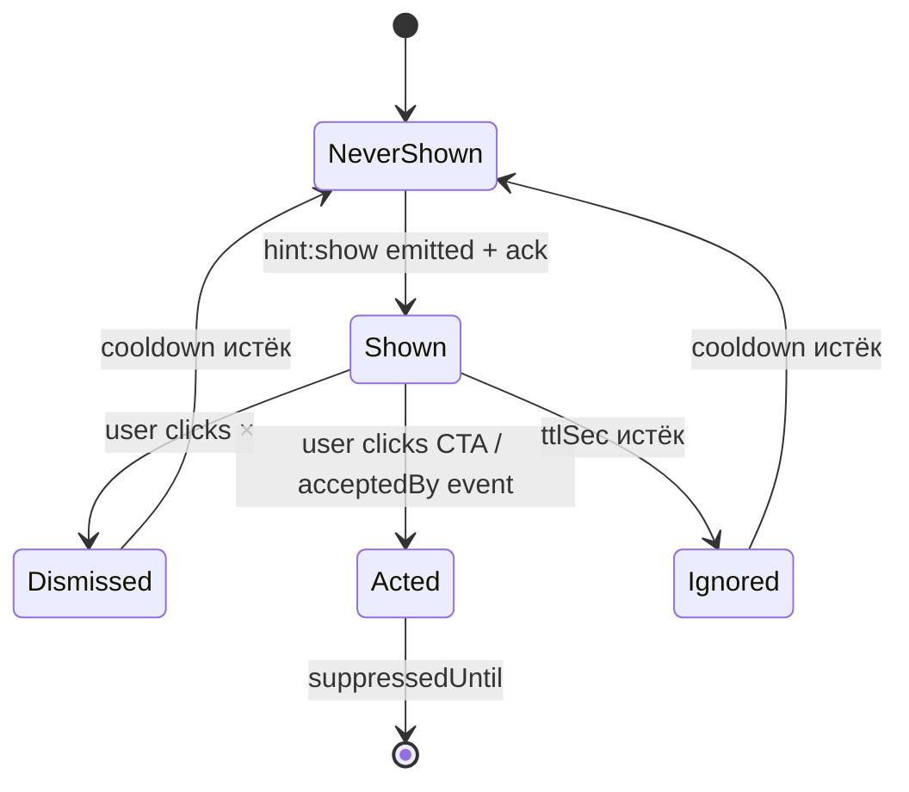
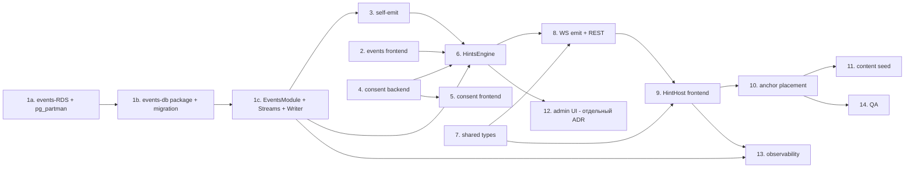

# ADR-147 — Контекстные подсказки пользователю на основе аналитики действий

- Статус: **Proposed** (2026-06-27)
- Дата: 2026-06-27
- Связанные задачи: KS-4678
- Связанные ADR: ADR-004 (API+WS), ADR-024 (lessons-module — пример декларативного контента), ADR-026 (user-courses — прогресс пользователя), ADR-128 (public routes / guest)
- Автор: architect

---

## 0. TL;DR

Заводим модуль `hints` в `apps/api` + новую инфру событий. Pipeline сразу под целевую нагрузку 600K событий/день: источники (frontend `POST /events`, backend self-emit) → **Redis Streams** (`user_events:stream`, durable, AOF, consumer groups) → **Events Writer Worker** → **отдельная events-RDS** (PostgreSQL + `pg_partman` weekly partitions, retention 90 дней) + параллельно **Redis hot counters** для коротких окон. HintsEngine читает **materialized views** (длинные окна) + Redis counters (короткие окна), никогда не сканирует raw `user_events`. Правила — декларативный JSON-DSL в таблице `hints` (редактируется через seed, потом через админ-UI). Доставка на UI — push через существующий `MessageGateway` (room `user:<id>`, событие `hint:show`), placement — anchor по `data-hint-anchor="<id>"` в DOM. Lifecycle (`viewed | dismissed | acted | ignored`) трекается обратно тем же gateway-ом. Глобальные лимиты — ≤1 подсказки в 10 минут на пользователя, ≤5 за сессию. Согласие на трекинг включено в существующий cookie-banner отдельной галочкой; пользователь без согласия — события не пишутся, подсказки не показываются. Масштабирование при росте — только в рамках PG-стека (uplift instance class, read replicas, compression, pg_partman subpartitioning), без смены технологии (§7A).

---

## 1. Контекст и проблема

Сайт оброс функциональностью (puzzle-rush, blind board, tactic-drills, opening-trainer, lectures, user-courses, archive, live-analysis), и большинство пользователей пользуется ≤30% возможностей. Tour-онбординг на старте пробовать не хотим: он раздражает и быстро забывается. Цель — **живые контекстные подсказки**, которые реагируют на то, что пользователь делает прямо сейчас: «играешь третий рейтинговый блиц подряд — посмотри pre-move в настройках», «открыл свою партию без анализа — запусти анализ», «не решал пазлы 7 дней — забыли про rush-режим?».

Принципиальные ограничения:
- Архитектура выбирается **под верхнюю границу целевого сценария** §2.3 — 80K–600K событий/день («достижение цели десятки тысяч registered» из ADR-128 §7.4.2). Эволюция должна быть scale-out **в рамках одной технологии** (больше ресурсов, partition tuning, read replicas, агрегация — не смена СУБД). Smena PG → Clickhouse через 6–12 месяцев — это переписывание, оно недопустимо в roadmap; либо технология подходит на целевой объём, либо выбирается другая сразу.
- Существующий WS-канал и `Notification`-таблица **не подходят как есть**: notifications — это transactional inbox с историей; подсказки же эфемерные и не должны засорять колокольчик. Нужен отдельный канал, но через ту же gateway-сокетную инфраструктуру.
- Между источниками событий и storage должна быть durable очередь **с самого MVP** (см. §2.2). Перевод sync-write → async позже = переделка надёжности под нагрузкой, риск потерь — недопустимо.
- GDPR: пользователь должен иметь возможность отключить трекинг событий, и сами события должны храниться ограниченное время.

---

## 2. Аналитика действий пользователя

### 2.1. Какие события собираем

Минимально достаточный список для первого набора правил (если правила потребуют — расширим декларативно, без изменения схемы):

| Категория | Тип события (`event_type`) | Откуда | Поля payload |
|-----------|---------------------------|--------|--------------|
| Сессия | `session_start` | frontend, при загрузке App после auth | `device`, `referrer` |
| Сессия | `session_idle` | frontend, при простое 60+ сек на странице | `page`, `idle_seconds` |
| Навигация | `page_view` | frontend, React Router listener | `path`, `prev_path` |
| Игра | `game_start` | backend, gateway после matchmaking | `time_control`, `rated`, `opponent_id` |
| Игра | `game_end` | backend, gateway | `result`, `termination`, `rating_delta` |
| Игра | `pre_move_used` | backend, gateway | `game_id` |
| Пазл | `puzzle_start` | backend, `puzzle.controller` | `puzzle_id`, `theme` |
| Пазл | `puzzle_solved` / `puzzle_failed` | backend | `puzzle_id`, `attempts` |
| Пазл-раш | `rush_start` / `rush_end` | backend, `puzzle-rush` | `score`, `mode` |
| Анализ | `analysis_open` | frontend | `game_id`, `source` |
| Анализ | `analysis_engine_started` | frontend | `game_id` |
| Курсы | `lesson_start` / `lesson_complete` | backend | `lesson_id`, `course_id` |
| Tactic-drill | `drill_start` / `drill_complete` | backend | `drill_id` |
| Действие | `feature_used` | frontend, generic | `feature_key` (например, `board_settings_opened`) |
| Подсказка | `hint_shown` / `hint_dismissed` / `hint_acted` / `hint_ignored` | backend сам пишет при доставке/реакции | `hint_id`, `rule_id` |
| Ошибка | `error_seen` | frontend, через ErrorBoundary | `kind` (network/render/api), `path` |

Принцип: **не собираем мышь, клики и input-keystrokes**. Только высокоуровневые domain-события. Это держит и объём, и privacy-риски управляемыми.

### 2.2. Где собираем

```mermaid
flowchart LR
  FE[Frontend\nReact 19] -- batch POST /events --> API[(apps/api\nEventsController)]
  GW[WebSocket gateways\n(game, message)] -- emit() --> EV[EventsService]
  API -- XADD --> RS[(Redis Streams\nuser_events:stream)]
  EV -- XADD --> RS
  RS -- consumer group\nevents-writer --> W[Events Writer Worker]
  W -- batch INSERT 1000/sec --> EDB[(events-RDS\nPostgres + pg_partman\nweekly partitions)]
  W -- INCR по counters --> RC[(Redis hot counters\nagg:user:type:window)]
  REFR[MatView Refresher\nevery 60s] -- REFRESH CONCURRENTLY --> MV[(materialized views\nuser_event_counts_*)]
  EDB --> MV
  RULES[HintsEngine] -- read --> MV
  RULES -- read --> RC
  RULES -- emit() --> WSOUT[MessageGateway\nroom user:id\nevent hint:show]
```

Компоненты с самого MVP — все, без поэтапного включения:

- **Frontend → API**: новый endpoint `POST /events` (rate-limited по IP, batch до 50 событий, schema-валидация class-validator). По образцу существующего `/logs`, но с персистенцией.
- **Backend self-emit**: существующие сервисы (`game`, `puzzle`, `puzzle-rush`, `lesson`, `tactic-drill`) дёргают `EventsService.track(userId, type, payload)` в local-bus стиле. Это надёжнее, чем доверять фронту в момент конца партии.
- **Durable очередь — Redis Streams** (`XADD user_events:stream`), а не Redis LIST. Streams нужен с самого начала по трём причинам:
  1. **Consumer groups + ACK**: можно запустить несколько writer-воркеров (sharding/HA) без дубликатов; необработанные сообщения PEL переживают рестарт воркера.
  2. **Persistence**: при включённом AOF (уже включён в нашей Redis-конфигурации) события переживают рестарт самой Redis-ноды.
  3. **MAXLEN ~ N**: автоограничение размера стрима, защита от bloat при downtime PG.

  Kafka/Redpanda/SQS отвергнуты для MVP: те же гарантии для нашего объёма даёт уже работающий Redis, новые операционные расходы не оправданы. Если в будущем понадобится cross-region durability или event sourcing с горизонтом >7 дней — заменим Streams на Kafka **без изменения контракта `EventsService.track()`** (см. §7A.3).
- **Events Writer Worker** — отдельный consumer group в `apps/api`. `XREADGROUP COUNT 1000 BLOCK 1000` → batch `INSERT ... SELECT FROM jsonb_to_recordset(...)` → `XACK`. Параллельно инкрементирует Redis hot counters для горячих агрегатов (см. §2.4).
- **events-RDS — отдельная PostgreSQL-инстанция**, не основной RDS приложения. Обоснование: write-нагрузка событий (даже на верхней границе 600K/день ≈ 7 INSERT/sec в среднем, пик 50/sec на турнире) не должна конкурировать с OLTP-нагрузкой игровых операций; разные характеристики vacuum, разные SLA. По образцу `archive-RDS` (ADR-018) и `broadcasts-RDS` (ADR-021). Конфигурация на старте — `db.t3.medium` Multi-AZ ($60/мес reserved 1y eu-central-1, по AWS pricelist 2026-06), на верхней границе целевого сценария — `db.r5.large` ($130/мес reserved). Это одна и та же RDS-семья, scale-out вертикальный, без миграции схемы.
- **`pg_partman` extension** — нативно доступен в AWS RDS Postgres (см. AWS docs, `Appendix.PostgreSQL.CommonDBATasks.html#…pg_partman`). Автоматическое создание/дроп еженедельных партиций таблицы `user_events`. Партиционирование с самого MVP: на 600K событий/день за 90 дней retention это ~54M строк, что **уже бенефит** от партиционирования (быстрый drop старых партиций, узкие индексы на горячих).

Альтернативу «писать напрямую в PG из каждого сервиса без очереди» отвергаем: пик в момент окончания турнира = десятки `INSERT` на один игровой gateway-тик; sync-write по connection pool разваливается при первом всплеске.

### 2.3. Объём, индексы, retention

**Оценка объёма — это оценка, не измерение.** В проекте нет включённой DAU-метрики (нет Prometheus-counter активных сессий с дедупом по user_id, нет аналитического дашборда). Поэтому диапазон строится из двух косвенных опор:

1. **База пользователей.** Зафиксировано в ADR-128 §7.4.2 (KS-3401, страница `/player/:username`): «все зарегистрированные — на старте сотни/тысячи, цель — десятки тысяч». Это registered users, не DAU. Допускаем коэффициент активности 5–15% (отраслевая норма для freemium-сервисов; источник: усреднённые публичные данные SimilarWeb по chess.com / lichess.org за 2024, проверить точное значение нечем — мы не имеем доступа к их закрытой аналитике). При registered ∈ [1K, 50K] и активности 5–15% даёт DAU ∈ [50, 7500].
2. **События на одного активного пользователя в день.** Раскладка по §2.1, без эмпирических измерений:
   - `session_start` — 1
   - `page_view` — 10–30 (типичная сессия с навигацией по разделам)
   - `session_idle` — 1–3
   - `game_start` + `game_end` — 0–20 (от 0 у наблюдателя до 10 партий у активного блиц-игрока)
   - `pre_move_used` — 0–N (учитывается отдельно за партию)
   - `puzzle_start` + `puzzle_solved`/`puzzle_failed` — 0–60 (puzzle-rush сессия = десятки решений)
   - `rush_start` / `rush_end` — 0–4
   - `lesson_start`/`lesson_complete`, `drill_start`/`drill_complete` — 0–10
   - `hint_shown`/`hint_dismissed`/`hint_acted`/`hint_ignored` — 0–20 (учитывая глобальный лимит 5 показов/сессия и до 4 lifecycle-событий на каждый)
   - `error_seen` — редко, 0–2
   - `feature_used` — 0–10

   Суммарно: пассивный зритель ≈ 15 событий, средний играющий ≈ 50, heavy puzzle-rush сессия ≈ 150–200. Среднее по всем активным **оценочно 30–80**.

**Производное (грубая оценка ±2×):**

| Сценарий | DAU (оценка) | Событий на активного (оценка) | Событий/день |
|----------|--------------|------------------------------|--------------|
| Сегодня (низкая граница registered) | 50–500 | 30–50 | 1.5K–25K |
| Через 6–12 мес (рост базы) | 500–3K | 30–60 | 15K–180K |
| Достижение цели «десятки тысяч registered» | 2K–7.5K | 40–80 | 80K–600K |

**Целевая верхняя граница для архитектурного выбора — 600K событий/день** (правый край сценария «достижение цели»). Архитектура §2.2 (отдельная events-RDS + pg_partman + materialized views + Redis Streams) проектируется на эту границу с запасом ~3× и **не требует смены технологии** при достижении любого из заявленных сценариев — только масштабирования ресурсов (см. §7A).

**Что нужно сделать в момент запуска, чтобы заменить оценку измерением:** на этапе T13 (observability, см. §8) добавить Prometheus-метрики `user_events_ingested_total{type}` (XADD-counter), `user_events_inserted_total{type}` (counter ACK-ов от writer'а), `user_events_buffer_lag_seconds` (gauge `time.now - ts(oldest pending entry)`) — далее доверять им, а не оценкам.

Схема (Prisma DSL, для иллюстрации; реальную миграцию делает backend в новом пакете `packages/events-db` по образцу `packages/archive-db`):

```prisma
// Логическая модель. На уровне Postgres таблица создаётся как
// PARTITION BY RANGE (created_at) и управляется pg_partman:
// SELECT partman.create_parent('public.user_events', 'created_at', 'native', 'weekly');
// pg_partman.run_maintenance() в cron'е добавляет/дропает партиции.
model UserEvent {
  id        BigInt   @default(autoincrement())
  userId    String   @map("user_id") @db.Uuid
  type      String   @db.VarChar(64)
  payload   Json     @db.JsonB
  createdAt DateTime @default(now()) @map("created_at")

  @@id([id, createdAt])  // pg_partman требует partition-key в PK
  @@index([userId, type, createdAt(sort: Desc)])
  @@index([createdAt])
  @@map("user_events")
}
```

- `id BigInt`, а не UUID: 8 байт против 16, и для append-only логов UUID лишний.
- Композитный индекс `(user_id, type, created_at desc)` — главный «рабочий» индекс правил («сколько раз пользователь сделал X за окно N»). Он автоматически создаётся на каждой новой партиции через `pg_partman.template_table`.
- `payload` как `jsonb` — для редких ad-hoc запросов; GIN-индекс пока не вешаем (нет правил, которые фильтруют по полю payload).
- **Retention 90 дней** — управляется `pg_partman.retention_keep_table = false`, старые партиции **дропаются целиком** (мгновенная операция против многочасового `DELETE`-vacuum-цикла).

### 2.4. Агрегаты для триггеров

Правила DSL §3.2 оперируют **посчитанными агрегатами**, не сырыми событиями. Это требование выбрано к архитектуре с самого MVP, не follow-up — иначе при росте до верхней границы целевого сценария hot-path HintsEngine упрётся в полные сканы партиций.

Два слоя агрегации, оба заведены сразу:

**Слой 1 — materialized views на event-RDS** для «длинных» окон (24h, 7d, 30d):

```sql
CREATE MATERIALIZED VIEW user_event_counts_7d AS
SELECT user_id, type, count(*) AS cnt, max(created_at) AS last_at
FROM user_events
WHERE created_at > now() - interval '7 days'
GROUP BY user_id, type;

CREATE UNIQUE INDEX ON user_event_counts_7d (user_id, type);
```

Аналогично для окон 24h и 30d. Refresh — `REFRESH MATERIALIZED VIEW CONCURRENTLY user_event_counts_7d` через worker раз в 60 секунд (для 7d/30d) и раз в 30 секунд (для 24h). `CONCURRENTLY` не блокирует чтение, требует unique-индекс (см. выше).

Стоимость refresh на верхней границе (54M строк за 90 дней): `count(*) … GROUP BY user_id, type` с index-only scan по партициям последних N дней — оценочно <2 секунды на db.r5.large (это **оценка**, измеряется на T13; bench по аналогичной операции на `archive-RDS` ADR-027 даёт <1 сек на 30M строк).

**Слой 2 — Redis hot counters** для «коротких» окон (1m, 10m, 1h) и для real-time правил вроде «3 рейтинговые партии подряд за 30 мин»:

```
ключ:     agg:<user_id>:<type>:<window_id>
команда:  INCR <key>; EXPIRE <key> <window_seconds>
```

Инкрементируется **events-writer worker** одновременно с `INSERT` в PG (атомарность не нужна — eventual consistency для UI-подсказки приемлема; при ребуте writer'а краткое отставание восстановится со следующим refresh). HintsEngine читает Redis для коротких окон, materialized views — для длинных, **никогда** не запрашивает raw `user_events` на hot-path. Прямой `SELECT FROM user_events` оставлен только для ad-hoc отладки и для пересчёта при добавлении нового типа события.

**Что измеряет правильность выбора:** метрика `hints_aggregate_query_duration_seconds{layer}` (T13). p95 для layer=`matview` цель <50 мс, для layer=`redis` цель <5 мс. Если matview просядет — переходим на pre-computed incremental aggregates (см. §7A.1, ступень B).

---

## 3. Дерево подсказок

### 3.1. Формат правил

**Декларативный JSON в БД**, не код. Причины:
- Можно редактировать без деплоя (важно для контент-менеджмента подсказок — это маркетингово-продуктовая задача, не инженерная).
- Конфиг версионируется в `hint_rules` таблице (audit-trail кто и когда менял).
- DSL ограниченный: только примитивы count/exists/time-since/page-equals. Полный DSL не нужен — и так покроет 95% сценариев.

Схема (Prisma DSL — для иллюстрации):

```prisma
model Hint {
  id           String   @id @default(uuid()) @db.Uuid
  key          String   @unique @db.VarChar(64)  // стабильный id для аналитики, напр. "analyze-your-game"
  title        String   @db.VarChar(200)         // i18n: ключ перевода или прямой текст
  body         String   @db.Text
  ctaLabel     String?  @map("cta_label")
  ctaHref      String?  @map("cta_href")          // относительный URL внутри SPA
  ctaEvent     String?  @map("cta_event")         // или клиентский event для in-page action
  anchor       String   @db.VarChar(64)           // значение data-hint-anchor на UI
  placement    String   @db.VarChar(16)           // 'top'|'bottom'|'left'|'right'|'overlay'
  priority     Int      @default(0)               // выше = важнее при конфликте
  enabled      Boolean  @default(true)
  rule         Json     @db.JsonB                  // см. ниже
  cooldownSec  Int      @default(86400) @map("cooldown_sec") // после dismiss/show
  ttlSec       Int      @default(0) @map("ttl_sec")           // автозакрытие на UI, 0 = ручное
  maxShows     Int      @default(3) @map("max_shows")          // лимит за всё время
  createdAt    DateTime @default(now()) @map("created_at")
  updatedAt    DateTime @updatedAt @map("updated_at")

  @@map("hints")
}

model UserHintState {
  userId       String   @map("user_id") @db.Uuid
  hintId       String   @map("hint_id") @db.Uuid
  shownCount   Int      @default(0) @map("shown_count")
  lastShownAt  DateTime? @map("last_shown_at")
  dismissedAt  DateTime? @map("dismissed_at")
  actedAt      DateTime? @map("acted_at")
  suppressedUntil DateTime? @map("suppressed_until")

  @@id([userId, hintId])
  @@index([userId, suppressedUntil])
  @@map("user_hint_states")
}
```

### 3.2. DSL правила (`rule` jsonb)

```json
{
  "all": [
    { "page": { "matches": "/play/*" } },
    { "count": { "event": "game_start", "where": { "rated": true }, "windowMin": 30, "gte": 3 } },
    { "not": { "event": "feature_used", "where": { "feature_key": "board_settings_opened" }, "sinceDays": 7 } }
  ]
}
```

Операторы первой версии:
- `page.matches` — текущая страница (frontend шлёт в hint-check вместе с запросом, см. §4).
- `count.event` + `windowMin|windowHours|windowDays|sinceDays` + `gte|lte|eq` — счётчик за окно.
- `exists.event` / `not.exists.event` — был ли в окне.
- `timeSince.event` + `gtMin|gtHours|gtDays` — давно ли последний раз.
- `all` / `any` — логические комбинаторы.

Парсер DSL — небольшая чистая функция на 200–300 строк, без рантайм-зависимостей. Каждый оператор превращается в SQL-фрагмент (или Redis-чтение для горячих счётчиков). Незнакомый оператор → правило игнорируется + лог в `client-logs`-стиле.

### 3.3. Кто редактирует подсказки

Первая версия — **коммит в репозиторий**: seed-файл `apps/api/prisma/seeds/hints.ts`, `prisma db seed` идемпотентен по `hint.key`. Это позволит:
- Завести 10–15 базовых подсказок без админ-UI.
- Версионировать тексты в git.
- Делать ревью через PR.

Админ-UI (CRUD по таблице `hints`) — **отдельный тикет** (`KS-XXXX: admin UI для редактирования контекстных подсказок`). До тех пор маркетинг/контент готовит тексты в Google Doc, разработчик переносит в seed.

### 3.4. Разрешение конфликтов

Триггер: периодический check (см. §4.1) возвращает **массив** подходящих hint-ов. Выбираем один:

1. Сортируем по `priority desc, created_at asc`.
2. Фильтруем по `UserHintState`: исключаем `suppressedUntil > now()`, `shownCount >= maxShows`, `dismissed_at within cooldown`.
3. Фильтруем по глобальным лимитам (§5.2): «≤1 показ за 10 минут», «≤5 за сессию».
4. Берём верхний. Остальные **не запоминаем как «скипнутые»** — просто появятся при следующем check, если их триггер всё ещё активен.

---

## 4. Доставка на UI

### 4.1. Push vs pull

**Push через существующий `MessageGateway`**. У нас уже есть WebSocket-соединение для уведомлений (`message`-namespace, room `user:<userId>`). Добавляем туда событие `hint:show` с payload `{ hintId, key, title, body, ctaLabel, ctaHref?, ctaEvent?, anchor, placement, ttlSec }`. Pull-вариант (poll каждые N сек) отвергаем: лишний трафик и задержка реакции на «закончил партию → покажи подсказку про анализ».

Бэкенд считает подсказки в двух точках:
1. **Реактивно** — после ключевых событий (`game_end`, `puzzle_failed`, `session_idle`, `page_view`). `HintsEngine.checkFor(userId, context)` запускается из соответствующих сервисов через event-bus (`@nestjs/event-emitter`).
2. **Тиковая проверка** — `@Cron('*/30 * * * * *')` для правил, привязанных к «время с момента X» (например, «не заходил неделю» — проверять незачем, пока пользователь не зашёл; «играет 10+ минут без перерыва» — раз в полминуты ок).

### 4.2. Anchor на UI

`data-hint-anchor="<anchor-key>"` на DOM-узлах, к которым может «прилипнуть» подсказка. Список anchor-ов — закрытый enum в `packages/shared/types/hint-anchors.ts`, чтобы фронт и сервер не разъезжались.

Frontend-компонент `<HintHost>` монтируется в `App.tsx` один раз, слушает `hint:show` через socket. На получении:
1. Ищет `document.querySelector('[data-hint-anchor="' + anchor + '"]')`.
2. Если узла нет (страница без anchor) — отвечает на сервер `hint:no-anchor`, сервер пишет в `user_events` как `hint_dismissed { reason: 'no_anchor' }` и больше эту подсказку в текущем page-view не предлагает.
3. Если узел есть — рендерит popover через portal, позиционирует по `placement` относительно anchor через `@floating-ui/react` (уже в зависимостях? проверить; если нет — добавить, это лёгкая либа, ~10 KB). Координаты НЕ передаём с сервера: только anchor-key, чтобы responsive-верстка не ломала позиционирование.

### 4.3. Обратная связь

Те же события, что в §2.1 (`hint_shown`, `hint_dismissed`, `hint_acted`, `hint_ignored`):
- `hint_shown` — отправляется фронтом сразу после успешного рендера.
- `hint_dismissed` — клик по «×».
- `hint_acted` — клик по CTA (или произошёл `ctaEvent`).
- `hint_ignored` — закрылась по `ttlSec` без действия.

События пишутся в `user_events` и параллельно обновляют `UserHintState` (поля `shownCount`, `lastShownAt`, `dismissedAt`, `actedAt`).

---

## 5. Lifecycle подсказки

### 5.1. Когда «выполнена»

Подсказка считается выполненной, когда у `UserHintState.actedAt` появилось значение. После этого:
- Если `actedAt` через CTA-клик — `suppressedUntil = now() + 365 days` (показывать не надо, человек узнал).
- Если правило снова сработает через год — покажем (например, новый интерфейс настроек, повторное напоминание уместно).

Альтернативный сценарий: подсказка «не закрывал пазлы неделю» считается выполненной, когда после показа произошло событие `puzzle_start`. Это правило прописывается отдельно в подсказке полем `acceptedBy: ['puzzle_start']` (`uniform с шагом «smart-dismiss»). Если в течение 24 часов после показа произошло одно из `acceptedBy` — `actedAt = now()`, даже если пользователь не кликал CTA.

### 5.2. Глобальные лимиты

Хардкод в `HintsEngine`:
- **≤1 показ за 10 минут на пользователя** — Redis-ключ `hints:throttle:<user_id>` с TTL 600.
- **≤5 показов за сессию** — счётчик в Redis с TTL до конца суток (сессия определяется грубо как «активность в пределах 30 минут», но для лимита достаточно дневного окна).
- **Глобальный «kill switch»** — feature-flag `hints_enabled` (уже есть `feature-flags`-модуль). При выключении `HintsEngine.checkFor` сразу возвращает пусто.

Per-hint лимиты — `maxShows` (общий), `cooldownSec` (после dismiss), `ttlSec` (автозакрытие).

### 5.3. Состояния



---

## 6. Privacy

### 6.1. Что хранится

- `user_events` — userId + type + payload + timestamp. Payload намеренно ограничен полями из таблицы §2.1, никаких персональных данных (имена, тексты сообщений, FEN-ы партий) туда **не пишем**.
- `user_hint_states` — userId + hintId + статусы.
- Гости (без аккаунта) — события **не пишем вообще**. Аналитика только для авторизованных. Подсказки гостям не показываем (одно правило исключения, обсуждается отдельно: «гость на странице регистрации застрял 60 секунд» — пока вне scope).

### 6.2. Согласие

Добавляем в существующий cookie-banner отдельный чекбокс «Аналитика для персональных подсказок» (по умолчанию **выключен** — это ужесточение от того, что есть сейчас в Notification flow, но необходимо для GDPR). Состояние сохраняется в БД на User (новое поле `analyticsConsent boolean`).

`EventsService.track()` первым делом читает `user.analyticsConsent`. Если `false` — событие отбрасывается на входе, не доходит до Redis Streams. `HintsEngine.checkFor` для такого пользователя возвращает пусто.

Кнопка «Удалить мои данные» (уже планируется в profile-настройках по GDPR — отдельный сквозной тикет) дополнительно стирает `user_events` и `user_hint_states` по userId.

### 6.3. Retention

90 дней (см. §2.3). Этого достаточно для всех правил, заявленных в §2.1.

---

## 7. Альтернативы

| Подход | Плюсы | Минусы | Решение |
|--------|-------|--------|---------|
| **SaaS Appcues / Userpilot / Pendo** | Готовый редактор подсказок, A/B, аналитика «из коробки» | $200–500/мес от первого пользователя, чужой JS на странице (privacy/perf), нельзя триггерить от backend-событий (только DOM/URL), vendor lock-in | Отвергнуто. Цена не оправдана при текущем DAU, и главное — нам нужны server-side триггеры (`game_end`, `puzzle_failed`), которых SaaS-решения этого класса нативно не умеют. |
| **PostHog (self-hosted) для аналитики + наш HintsEngine** | Богатые аналитические возможности, готовые SDK, funnels/A-B/cohorts «из коробки» | См. блок «Цифры по PostHog» ниже — затраты на инфраструктуру и поддержку существенно выше, чем у Postgres-таблицы, при том что funnels/cohorts для задачи «триггер подсказки» не нужны. | Отвергнуто. Если в будущем появится отдельная задача продуктовой аналитики (а не триггеров подсказок) — пересмотреть. |
| **Только декларативный конфиг в коде (TS-файл)** | Нет миграции, нет admin-UI | Любое изменение текста — деплой | Отвергнуто. Контент подсказок будет правиться часто, гонять деплой на каждую правку строки — лишнее. |
| **Engine на правилах в коде (`if`-блоки в `HintsEngine`)** | Можно делать сложные условия | Не масштабируется на 50+ правил, нет audit-trail | Отвергнуто. DSL §3.2 простой и покрывает все заявленные сценарии. |
| **Pull-модель (frontend polls `/hints/active` каждые N сек)** | Проще, нет WS-зависимости | Задержка реакции на server-side события (game_end), лишний трафик | Отвергнуто. WS у нас уже есть, переиспользуем. |
| **Хранить события в Redis stream и не персистить в PG** | Самое дешёвое по записи | События пропадают, агрегаты «не запускал 7 дней» нереализуемы | Отвергнуто. Аналитика нужна durable. |
| **Свой DSL на основе CEL / JSONata** | Готовые библиотеки | Лишняя зависимость, мощность не нужна | Отвергнуто. 5 операторов своего DSL дешевле. |

### Цифры (обоснование) — TCO на верхней границе целевого сценария

**Сравнение делается на верхней границе целевого сценария §2.3 — 600K событий/день (18M/мес, при retention 90 дней — 54M live rows).** Не на стартовом объёме: ADR описывает решение для целевого, поэтому сравнивать справедливо именно там. Все значения — **оценки**; источники и уровень доверия указаны явно.

**Вариант A — наша архитектура (§2.2): отдельная events-RDS + pg_partman + materialized views + Redis Streams.**

| Компонент | Конфигурация на 600K событий/день | AWS SKU (eu-central-1 Frankfurt, Reserved 1-year, 2026-06) | $/мес |
|-----------|-----------------------------------|------------------------------------------------------------|-------|
| events-RDS (PostgreSQL) | `db.r5.large` Multi-AZ (2 vCPU, 16 GB) | RDS `db.r5.large` reserved | ~130 |
| Storage (54M строк × ~200 байт + индексы + matviews ≈ 30 GB, +50 GB запас) | 80 GB gp3 + автоснапшоты | EBS gp3 0.0928 $/GB/мес | ~7 |
| Redis Streams + hot counters | расширение существующего Redis (см. ADR-004), доп. ресурсов нет | — | 0 |
| Events Writer Worker | внутри `apps/api`, доп. контейнера нет | — | 0 |
| **Итого инкрементально** | | | **~137** |

Постоянные эксплуатационные часы: ~1 ч/мес (мониторинг partition rotation, refresh-latency matviews — pg_partman сам делет ротацию, нужно только следить за counter ошибок). Стек PostgreSQL — тот же, что уже эксплуатируется на основном RDS (ADR-027, ADR-045), новых технологий нет. p95 запросов к materialized view цель <50 мс — оценка по аналогии с `archive-RDS` ADR-033 при ≤50M строк (доверие: **среднее**; измеряется на T13).

**Вариант B — PostHog self-hosted на тот же объём.**

Конфигурация по docs PostHog для нагрузки до 1M событий/день (`posthog.com/docs/self-host/deploy/aws`, версия 1.49, состояние 2025-12; следующая ступень после «hobby» — `small-scale production`):

| Компонент | Конфигурация | AWS SKU (eu-central-1, Reserved 1-year, 2026-06) | $/мес |
|-----------|--------------|--------------------------------------------------|-------|
| PostHog app (web + worker + plugin-server) | 1× m5.large | EC2 `m5.large` reserved | ~55 |
| Clickhouse | 1× r5.xlarge (4 vCPU, 32 GB — recommended для 0.5–1M events/day) | EC2 `r5.xlarge` reserved | ~155 |
| Clickhouse storage | 200 GB gp3 (PostHog хранит больше per-event: ~400 байт + materialized columns) | EBS gp3 | ~19 |
| Kafka/Redpanda | 1× t3.medium | EC2 `t3.medium` reserved | ~25 |
| Postgres (служебный) | db.t3.small | RDS `db.t3.small` reserved | ~25 |
| **Итого инкрементально** | | | **~279** |

Эксплуатационные часы — **2–10 ч/мес** (см. ниже про доверие). Новый стек: Clickhouse, Kafka, PostHog plugin-server, HogQL — учить и поддерживать.

**Вариант C — PostHog Cloud (managed) на тот же объём.**

По публичному pricelist `posthog.com/pricing` (Cloud Scale tier, 2026-06): первые 1M событий/мес бесплатно, далее **$0.000248 за событие** (Product Analytics). При 18M событий/мес = 17M billable × $0.000248 = **~$4 200/мес**.

Эксплуатационные часы — 0 (managed). Но порядок цены делает Cloud неприменимым.

**Сводка по вариантам на верхней границе целевого сценария:**

| Вариант | $/мес инкр. | Часы/мес | Стек эксплуатации | p95 hot-path |
|---------|------------|----------|-------------------|--------------|
| A. events-RDS + pg_partman + matviews (наш) | ~137 | ~1 | существующий PG | <50 мс (оценка) |
| B. PostHog self-hosted | ~279 | 2–10 | новый: Clickhouse + Kafka + PostHog | <100 мс по docs |
| C. PostHog Cloud | ~4 200 | 0 | managed | <100 мс по SLA |

**Источники и доверие:**
- AWS SKU eu-central-1 Reserved 1-year — публичные тарифы AWS Pricing Calculator (доверие: **высокое**).
- Конфигурации PostHog self-hosted — их же docs (`posthog.com/docs/self-host`), доверие: **среднее** (рекомендации могут отличаться от реальных требований при росте).
- Cloud Scale tier pricing — публичный pricelist (доверие: **высокое**, но условия pricing у SaaS меняются — на момент использования перепроверить).
- Часы поддержки PostHog 2–10 ч/мес — **экспертная оценка** на базе релизного цикла PostHog (`github.com/PostHog/posthog/releases` — minor раз в 1–2 недели, major раз в 1–2 месяца с Clickhouse-миграциями), доверие: **низкое-среднее**.
- p95 50 мс на matview наш — оценка по `archive-RDS` ADR-033 при сопоставимом объёме (доверие: **среднее**, измеряется на T13).

**Вывод.** Вариант A дешевле B в 2× по деньгам и значительно дешевле по эксплуатации (один стек vs три новых компонента). PostHog Cloud — на порядок дороже. Богатые возможности PostHog (funnels, cohorts, A/B) не нужны для задачи «триггер подсказки по простому условию» — DSL §3.2 покрывает кейсы. **Если в будущем появится отдельная задача продуктовой аналитики (funnels по сложным пользовательским путям, retention cohorts, server-side A/B), варианты B и C пересматриваются отдельным ADR — у них другие требования и другая ценность.**

---

## 7A. Масштабирование (в рамках выбранной технологии)

Архитектура §2.2 выбрана под верхнюю границу целевого сценария (600K событий/день, 54M live rows при retention 90 дней). Масштабирование при изменении нагрузки — **только в рамках PostgreSQL-стека** (вертикальный uplift инстанса, read replicas, retention, compression, шарды pg_partman). Смена технологии (Clickhouse, TimescaleDB на EC2, PostHog) — это уже другой ADR и переписывание, она здесь не рассматривается.

### 7A.1. Ступени масштабирования внутри PG-стека

| Ступень | Нагрузка | События за 90 дней | RDS-конфигурация | Дополнительно |
|---------|----------|-------------------|-------------------|---------------|
| **Стартовая (MVP)** | ≤150K событий/день | ≤14M строк | `db.t3.medium` Multi-AZ | Базовая: pg_partman weekly, matviews 24h/7d/30d, Redis Streams + hot counters — всё из §2.2 |
| **A. Вертикальный uplift** | 150K – 600K (верх целевого) | 14M – 54M строк | `db.r5.large` (2 vCPU / 16 GB) | Без изменения кода и схемы. Меняется только RDS instance class. Downtime — окно RDS maintenance (~5 мин). |
| **B. Read-replica для аналитики** | 600K – 1.5M событий/день | до 135M строк | `db.r5.large` + `db.r5.large` read-replica | Heavy ad-hoc запросы (debug, marketing-аналитика) уводятся на replica. HintsEngine продолжает читать matviews с primary (refresh идёт на primary). Cross-AZ replica latency обычно <1 сек, для refresh раз в минуту неважно. |
| **C. Compression на старых партициях** | 1.5M – 3M событий/день | до 270M строк | `db.r5.large` + replica | Партиции старше 14 дней — `ALTER TABLE … SET (toast_tuple_target = 128)` + `VACUUM FULL` или extension `pg_compress` (~3–5× экономии storage на сжатых партициях). Снижает storage cost и улучшает cache-hit. Pure-PG, без новой технологии. |
| **D. Шардинг по `user_id`** | >3M событий/день | >270M строк | 2× `db.r5.xlarge` (or larger) | pg_partman поддерживает subpartitioning. Шардинг по hash(user_id) — каждый writer-shard пишет в свой набор партиций. HintsEngine знает routing-функцию `shard_of(user_id)`. Это всё ещё PostgreSQL, без смены технологии, только горизонтальный scale. |

**Стартовая → A** — это **тот же ADR**, та же архитектура, та же конфигурация. Меняется только RDS instance class. **A → B → C → D** — расширения внутри PG-стека, требующие правок миграций/конфига, но не переписывания продуктового кода. Контракты §7A.3 сохраняются на всех ступенях.

«D» рассчитан на 5–10× от верхней границы целевого сценария — заведомый запас, чтобы ADR оставался актуальным даже при многократном превышении прогноза. Если фактический объём пересечёт даже «D» — это означает кратное превышение цели ADR-128, что само по себе повод для отдельного архитектурного обзора всей платформы, не только аналитики.

### 7A.2. Триггеры перехода между ступенями (наблюдаемые KPI на T13)

Не «когда DAU вырастет», а **конкретные сигналы из Prometheus / pg_stat**:

| Метрика | Порог sustained 1 неделя | Что запускает |
|---------|--------------------------|---------------|
| `histogram_quantile(0.95, hints_aggregate_query_duration_seconds{layer="matview"})` | > 50 мс | A — uplift RDS до r5.large |
| `pg_database_size('events')` | > 60 GB | A или C — uplift / compression |
| `pg_stat_replication.replay_lag` (если уже есть replica) | > 5 sec | A — uplift, replica не вытягивает |
| `rate(user_events_ingested_total[5m])` | > 50 events/sec | B — заводим read-replica под ad-hoc нагрузку |
| `pg_partman.show_partitions` count активных партиций | > 26 (полгода weekly) | C — compression старых |
| `rate(user_events_ingested_total[5m])` | > 200 events/sec | D — sharding по user_id |
| `redis_stream_pending_entries{stream="user_events:stream"}` | > 10K sustained 5 мин | Сразу: увеличить число writer-воркеров (consumer group горизонтально масштабируема) |

### 7A.3. Стабильные контракты (не меняются на всех ступенях)

- **`EventsService.track(userId, type, payload)`** — продуктовый код (`game`, `puzzle`, `lesson`, ...) индифферентен к ступени scale. Меняется реализация (`XADD` всё тот же), не сигнатура.
- **Redis Streams ключ `user_events:stream`** — на ступени D возможен sharding (`user_events:stream:<shard>`), routing-функция спрятана в `EventsService.track`.
- **DSL правил §3.2** — оперирует «count события за окно». На всех ступенях читает matviews + Redis hot counters, не raw `user_events`.
- **WS-канал `hint:show`** и frontend — полностью индифферентны.
- **Схема таблицы `user_events`** — стабильна. На ступени C добавляется compression на партициях, на ступени D — subpartitioning, но колонки и индексы те же.

### 7A.4. Когда пересматривать сам ADR

Полная ревизия ADR (новый ADR со ссылкой на этот) — при пересечении **любого** из:
- Фактический объём событий пересёк ступень D (>3M событий/день sustained) — горизонт за рамками целевого сценария ADR-128, может стоить смены технологии.
- Появилась отдельная задача продуктовой аналитики (funnels, retention cohorts, server-side A/B) — у неё другие требования, варианты PostHog self-hosted/Cloud (см. §7) пересчитываются.
- Меняется требование к retention (например, регуляторное «хранить 1 год» вместо 90 дней) — это сразу х4 по storage, может уехать в D раньше.
- Изменился набор правил DSL §3.2 на операторы, которые не выражаются через materialized views (например, sequence-detection — «3 ходов подряд, затем dismiss» — требует event-time-window-join, нативно не поддерживается в PG MV без stored procedures).

---

## 8. План внедрения (декомпозиция на тикеты)

Порядок — последовательный, каждый следующий зависит от предыдущего по схеме данных. Backend и frontend для каждого этапа разносим на отдельные тикеты — координатор заведёт по итогам ADR.

### Этап 1. Сбор событий (фундамент)

1a. **devops: events-RDS + pg_partman**
   - Поднять отдельный RDS instance `events-rds` (на старте `db.t3.medium` Multi-AZ, eu-central-1), включить extension `pg_partman` (доступен в RDS Postgres из коробки).
   - Параметры pg_partman: weekly partitions, retention 90 дней, автоматический `run_maintenance` через `pg_cron` (тоже native в RDS).
   - Резервирование: те же policies, что для основной RDS (ADR-027/045).

1b. **backend: пакет `packages/events-db` + миграция `user_events`**
   - Новый Prisma-пакет `packages/events-db` (по образцу `packages/archive-db`, `packages/broadcasts-db`).
   - Модель `UserEvent` из §2.3 (partition-aware composite PK).
   - SQL post-migration: `SELECT partman.create_parent('public.user_events', 'created_at', 'native', 'weekly')`.
   - Materialized views `user_event_counts_24h | _7d | _30d` из §2.4.
   - Тесты: insert, partition rotation, matview refresh.

1c. **backend: EventsModule + Redis Streams + Writer Worker**
   - `EventsModule` с `EventsService.track(userId, type, payload)` — внутри `XADD user_events:stream * field=value …` с проверкой `analyticsConsent`.
   - `EventsWriterService` — consumer group `events-writer`, `XREADGROUP COUNT 1000 BLOCK 1000`, batch INSERT в events-RDS через `events-db`-клиент, параллельно инкремент Redis hot counters (§2.4), `XACK` после успеха.
   - `MatViewRefreshService` — cron `*/30s` для `user_event_counts_24h`, `*/60s` для `_7d` и `_30d` (`REFRESH MATERIALIZED VIEW CONCURRENTLY`).
   - `POST /events` controller с DTO-валидацией, IP-rate-limit (по образцу `client-logs`).
   - Тесты: путь end-to-end (POST → Stream → worker → таблица + matview).

2. **frontend: events-клиент**
   - `apps/web/src/lib/events.ts` — функция `track(type, payload)`, batch до 50 событий или раз в 5 сек, `navigator.sendBeacon` на unload.
   - Хук `usePageViewTracking` в App.tsx (на изменение route).
   - Хук `useIdleTracking` (60s простоя → `session_idle`).
   - Заглушка: если `analyticsConsent === false` — функция no-op.

3. **backend: self-emit из существующих сервисов**
   - `game.service.ts` / `game.gateway.ts`: `game_start`, `game_end`, `pre_move_used`.
   - `puzzle.service.ts`: `puzzle_start`, `puzzle_solved`, `puzzle_failed`.
   - `puzzle-rush.service.ts`: `rush_start`, `rush_end`.
   - `lesson.service.ts`: `lesson_start`, `lesson_complete`.
   - `tactic-drill.service.ts`: `drill_start`, `drill_complete`.
   - Все через `eventsService.track()` (fire-and-forget, не блокирует основной flow — `XADD` <1 мс).

### Этап 2. Согласие и privacy

4. **backend: поле `analyticsConsent` на User + endpoint**
   - Миграция: `users.analytics_consent boolean default false`.
   - `PATCH /me/consent { analytics: boolean }`.
   - Проверка `analyticsConsent` в `EventsService.track`.

5. **frontend: обновление cookie-banner + чекбокс в настройках**
   - Чекбокс «Аналитика для персональных подсказок» в баннере и в `Settings → Privacy`.
   - i18n (ru/en) для текстов.

### Этап 3. Hints engine

6. **backend: миграция `hints`, `user_hint_states` + HintsEngine (без UI)**
   - Prisma модели из §3.1.
   - `HintsService`: `checkFor(userId, context)` — выполнение DSL §3.2, выбор одного hint, запись в `UserHintState`.
   - Парсер DSL: операторы `page`, `count`, `exists`, `timeSince`, `all`, `any`, `not`. Unit-тесты на каждый оператор.
   - Глобальные лимиты Redis (§5.2).
   - Feature-flag `hints_enabled` (default `false` — включим после прохода QA).
   - Hook на event-bus: после `game_end`, `puzzle_failed`, `session_idle`, `page_view` — вызывать `HintsEngine.checkFor`.
   - Seed `apps/api/prisma/seeds/hints.ts` с 5 базовыми подсказками (см. §9).

7. **shared: типы anchor-enum и hint-payload**
   - `packages/shared/types/hint-anchors.ts` — enum значений `data-hint-anchor`.
   - `packages/shared/types/api-contracts.ts` — `HintShowPayload`, `HintLifecyclePayload`.

8. **backend: WS-emit hint:show + REST для lifecycle**
   - Добавить событие `hint:show` в `MessageGateway` (room `user:<id>`).
   - `POST /hints/:id/dismissed` / `/acted` / `/ignored` / `/shown` — обновление `UserHintState` + запись в `user_events`.

### Этап 4. Frontend подсказки

9. **frontend: компонент `<HintHost>` + позиционирование**
   - Глобальный mount в `App.tsx`.
   - Подписка на `hint:show` через существующий socket.
   - Поиск anchor в DOM, рендер через portal, позиционирование `@floating-ui/react`.
   - Кнопки «×» / CTA.
   - Авто-закрытие по `ttlSec`.
   - Отправка lifecycle-событий назад на API.
   - Тесты: render, dismiss, cta-click, no-anchor fallback.

10. **frontend: расстановка `data-hint-anchor` на ключевых элементах**
    - Список из 10–15 anchor-ов: кнопка «Анализ» на странице игры, плитка «Пазлы» на главной, переключатель темы доски в настройках, кнопка «Pre-move» в настройках доски, и т. д.
    - Без визуальных изменений, только атрибуты.

### Этап 5. Контент и админ-UI (следующая итерация)

11. **content: первые 10–15 подсказок** (текст + правила) — задача для marketing/content.
12. **admin: CRUD UI для `hints` таблицы** — отдельный ADR/тикет, не блокирующий MVP.
13. **observability: метрики Prometheus** — `user_events_ingested_total{type}`, `user_events_inserted_total{type}`, `user_events_buffer_lag_seconds`, `redis_stream_pending_entries{stream}`, `hints_aggregate_query_duration_seconds{layer}`, `hints_check_duration_seconds`, `hints_shown_total{key}`, `hints_acted_total{key}`. Дашборд в Grafana с панелями под §7A.2 (триггеры ступеней).
14. **QA: ручной test-plan на каждое из 10 правил**.

### Зависимости (граф)



---

## 9. Примеры стартовых подсказок (для seed-файла)

| key | Когда | Текст (ru) | Anchor | CTA |
|-----|-------|-----------|--------|-----|
| `analyze-your-game` | После `game_end` если за 5 мин не было `analysis_open` для этой партии | «Партия закончена. Посмотри, где ход решил исход — встроенный анализ под доской.» | `game-end-analysis-button` | «Открыть анализ» → `/game/<id>?tab=analysis` |
| `try-pre-move` | На странице `/play/*` если за 30 мин ≥3 `game_start { rated: true }` и ни одного `pre_move_used` | «Играешь много блица — pre-move сэкономит секунды на очевидных ходах.» | `board-settings-icon` | «Включить» → открыть `BoardSettingsModal` через `ctaEvent: open_board_settings` |
| `puzzles-comeback` | Если `timeSince puzzle_start > 7 days` и текущая страница — главная | «Не решал пазлы неделю — рейтинг тактики просел. 5 минут на разминку?» | `home-puzzles-tile` | «К пазлам» → `/puzzles` |
| `rush-mode-discovery` | После 10-го успешного `puzzle_solved` если ни разу не было `rush_start` | «Понравились пазлы? Попробуй Puzzle Rush — гонка на время.» | `puzzles-rush-tab` | «Запустить Rush» → `/puzzle-rush` |
| `mistakes-diary` | Если `count puzzle_failed за 7 days >= 5` и ни одного `feature_used { feature_key: 'mistakes_diary_opened' }` | «Накопились ошибки в пазлах — посмотри их в «Дневнике ошибок».» | `profile-mistakes-link` | «Открыть дневник» → `/profile/mistakes` |

---

## 10. Открытые вопросы (вне scope ADR)

1. **Гостевые подсказки.** Пока запрещены (нет userId для state). Если маркетинг попросит — отдельный ADR с client-only state в localStorage.
2. **A/B-тесты текстов подсказок.** Не входит в первую версию. Можно прикрутить позже через существующий `feature-flags` (флаг определяет вариант текста).
3. **Подсказки на мобильной верстке.** В §4.2 предполагается desktop-popover. Для мобайла нужен отдельный паттерн — bottom-sheet вместо popover. Решается на этапе T9, не блокирует архитектуру.
4. **Подсказки в иммерсивных режимах (live-партия, lecture).** По умолчанию `HintsEngine` блокируется на этих страницах через правило `page.matches`. Конкретный список «тихих» страниц фиксируется на этапе T11.
5. **Internationalization текстов.** Тексты в `hints.title/body` — на русском, для en вариант кладём отдельной таблицей `hint_translations(hint_id, lang, title, body, cta_label)` или в JSON-поле `i18n` на самой `Hint`. Решение принимается на T11 (зависит от того, как контент-команда хочет редактировать).

---

## 11. Резюме

- **Своё решение, не SaaS.** Стоимость, server-side триггеры, privacy.
- **Отдельная events-RDS (PostgreSQL + pg_partman) + Redis Streams + materialized views**, без отдельного аналитического стека. Архитектура выбрана под верхнюю границу целевого сценария (600K событий/день, §2.3). Масштабирование при росте — только uplift инстанса / replicas / compression / шарды pg_partman в рамках PG-стека (§7A), без смены технологии.
- **Декларативный JSON-DSL** для правил, редактируется через seed (MVP) и админ-UI (позже).
- **Push через существующий MessageGateway.** Anchor по `data-hint-anchor`, позиционирование на клиенте.
- **Lifecycle 4 состояния**, suppression на год после действия, hard-лимиты 1/10мин и 5/сессия.
- **Privacy by default**: согласие выкл, гости не трекаются, retention 90 дней.

Декомпозиция в §8 — 14 тикетов, минимально жизнеспособный продукт после прохода T1–T10. Контент (T11) и админка (T12) не блокируют запуск с seed-набором подсказок.
