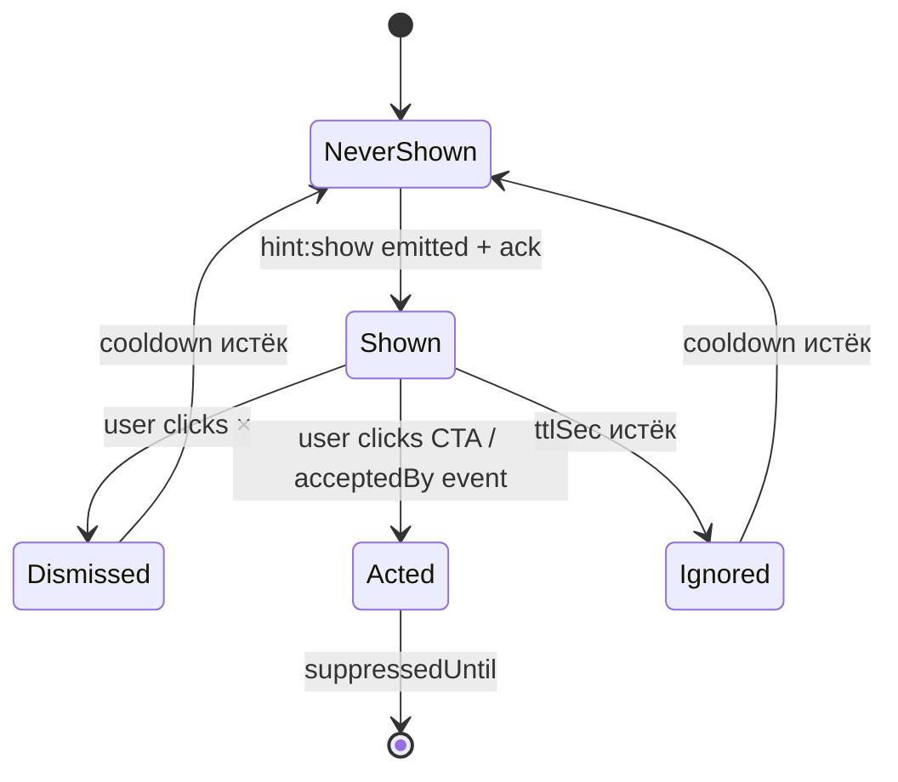
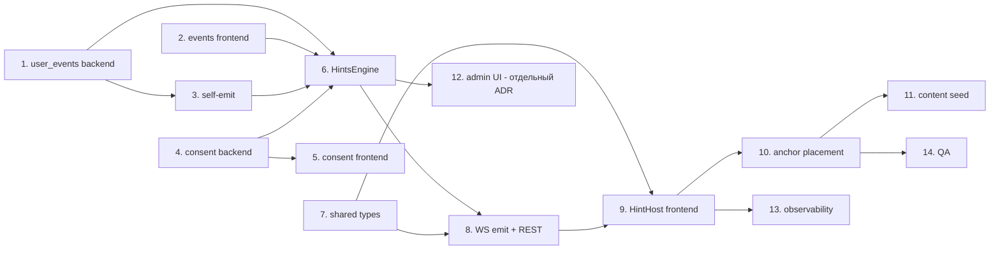

# ADR-147 — Контекстные подсказки пользователю на основе аналитики действий

- Статус: **Proposed** (2026-06-27)
- Дата: 2026-06-27
- Связанные задачи: KS-4678
- Связанные ADR: ADR-004 (API+WS), ADR-024 (lessons-module — пример декларативного контента), ADR-026 (user-courses — прогресс пользователя), ADR-128 (public routes / guest)
- Автор: architect

---

## 0. TL;DR

Заводим модуль `hints` в `apps/api`: declarative-конфиг правил (JSON в БД, редактируется через админ-UI отдельным тикетом), событийная аналитика в новой таблице `user_events` (через `/logs`-подобный endpoint + Redis-буфер), агрегаты считаются Postgres-запросами поверх `user_events` (без отдельного OLAP-стека), доставка на UI — push через существующий `MessageGateway` (room `user:<id>`, событие `hint:show`), placement — anchor по `data-hint-anchor="<id>"` в DOM. Lifecycle (`viewed | dismissed | acted | ignored`) трекается обратно тем же gateway-ом. Глобальные лимиты — ≤1 подсказки в 10 минут на пользователя, ≤5 за сессию. Согласие на трекинг включено в существующий cookie-banner отдельной галочкой; пользователь без согласия — события не пишутся, подсказки не показываются.

---

## 1. Контекст и проблема

Сайт оброс функциональностью (puzzle-rush, blind board, tactic-drills, opening-trainer, lectures, user-courses, archive, live-analysis), и большинство пользователей пользуется ≤30% возможностей. Tour-онбординг на старте пробовать не хотим: он раздражает и быстро забывается. Цель — **живые контекстные подсказки**, которые реагируют на то, что пользователь делает прямо сейчас: «играешь третий рейтинговый блиц подряд — посмотри pre-move в настройках», «открыл свою партию без анализа — запусти анализ», «не решал пазлы 7 дней — забыли про rush-режим?».

Принципиальные ограничения:
- Один backend-разработчик. Решение должно быть простым, без отдельных сервисов и без новых внешних зависимостей сверх того, что уже в проде (PostgreSQL, Redis, NestJS).
- Существующий WS-канал и `Notification`-таблица **не подходят как есть**: notifications — это transactional inbox с историей; подсказки же эфемерные и не должны засорять колокольчик. Нужен отдельный канал, но через ту же gateway-сокетную инфраструктуру.
- Объём событий аналитики потенциально большой (см. §2.3). База одна, отдельный warehouse не заводим — нужно сразу думать о retention и индексах.
- GDPR: пользователь должен иметь возможность отключить трекинг событий, и сами события должны храниться ограниченное время.

---

## 2. Аналитика действий пользователя

### 2.1. Какие события собираем

Минимально достаточный список для первого набора правил (если правила потребуют — расширим декларативно, без изменения схемы):

| Категория | Тип события (`event_type`) | Откуда | Поля payload |
|-----------|---------------------------|--------|--------------|
| Сессия | `session_start` | frontend, при загрузке App после auth | `device`, `referrer` |
| Сессия | `session_idle` | frontend, при простое 60+ сек на странице | `page`, `idle_seconds` |
| Навигация | `page_view` | frontend, React Router listener | `path`, `prev_path` |
| Игра | `game_start` | backend, gateway после matchmaking | `time_control`, `rated`, `opponent_id` |
| Игра | `game_end` | backend, gateway | `result`, `termination`, `rating_delta` |
| Игра | `pre_move_used` | backend, gateway | `game_id` |
| Пазл | `puzzle_start` | backend, `puzzle.controller` | `puzzle_id`, `theme` |
| Пазл | `puzzle_solved` / `puzzle_failed` | backend | `puzzle_id`, `attempts` |
| Пазл-раш | `rush_start` / `rush_end` | backend, `puzzle-rush` | `score`, `mode` |
| Анализ | `analysis_open` | frontend | `game_id`, `source` |
| Анализ | `analysis_engine_started` | frontend | `game_id` |
| Курсы | `lesson_start` / `lesson_complete` | backend | `lesson_id`, `course_id` |
| Tactic-drill | `drill_start` / `drill_complete` | backend | `drill_id` |
| Действие | `feature_used` | frontend, generic | `feature_key` (например, `board_settings_opened`) |
| Подсказка | `hint_shown` / `hint_dismissed` / `hint_acted` / `hint_ignored` | backend сам пишет при доставке/реакции | `hint_id`, `rule_id` |
| Ошибка | `error_seen` | frontend, через ErrorBoundary | `kind` (network/render/api), `path` |

Принцип: **не собираем мышь, клики и input-keystrokes**. Только высокоуровневые domain-события. Это держит и объём, и privacy-риски управляемыми.

### 2.2. Где собираем

```mermaid
flowchart LR
  FE[Frontend\nReact 19] -- batch /events --> API[(apps/api\nEventsController)]
  GW[WebSocket gateways\n(game, message)] -- emit() --> EV[EventsService]
  API -- enqueue --> R[(Redis LIST\nuser_events:buffer)]
  EV -- enqueue --> R
  R -- worker tick (1s) --> PG[(PostgreSQL\nuser_events)]
  RULES[HintsEngine] -- query aggregates --> PG
  RULES -- emit() --> WSOUT[MessageGateway\nroom user:id\nevent hint:show]
```

- **Frontend → API**: новый endpoint `POST /events` (rate-limited по IP, batch до 50 событий, schema валидация class-validator). По образцу `/logs`, но с персистенцией.
- **Backend self-emit**: существующие сервисы (`game`, `puzzle`, `puzzle-rush`, `lesson`, `tactic-drill`) дёргают `EventsService.track(userId, type, payload)` в local-bus стиле. Это надёжнее, чем доверять фронту в момент конца партии.
- **Redis-буфер**: `LPUSH user_events:buffer <json>`. Воркер внутри API (`@Cron('*/1 * * * * *')` или `setInterval`) каждую секунду делает `LRANGE 0 999` + `LTRIM 1000 -1` + `INSERT ... SELECT FROM jsonb_to_recordset(...)` батчем. Это решает три задачи: (1) бэкпрешер при всплесках, (2) backend self-emit не блокируется на write, (3) при downtime PG события не теряются (на ttl Redis).

Альтернативу «писать напрямую в PG из каждого сервиса» отвергаем: пик в момент окончания турнира = десятки `INSERT` на один игровой gateway-тик. Буфер дешевле, чем сразу гонять connection pool.

### 2.3. Объём, индексы, retention

Оценка (DAU ≈ 1–3K, 50 событий на пользователя в день в среднем): **50–150K строк/день**, 1.5–5M/месяц. Это посильно для одной таблицы на основной RDS без партиционирования первые 6–12 месяцев. Партицирование по месяцу — follow-up, когда подойдём к 50M строк.

Схема (Prisma DSL, для иллюстрации; реальную миграцию делает backend):

```prisma
model UserEvent {
  id        BigInt   @id @default(autoincrement())
  userId    String   @map("user_id") @db.Uuid
  type      String   @db.VarChar(64)
  payload   Json     @db.JsonB
  createdAt DateTime @default(now()) @map("created_at")

  @@index([userId, createdAt(sort: Desc)])
  @@index([userId, type, createdAt(sort: Desc)])
  @@index([createdAt])
  @@map("user_events")
}
```

- `id BigInt`, а не UUID: 8 байт против 16, и для append-only логов UUID лишний.
- Композитный индекс `(user_id, type, created_at desc)` покрывает 90% правил («сколько раз пользователь сделал X за N минут/дней»).
- `payload` как `jsonb` — для редких ad-hoc запросов; GIN-индекс пока не вешаем (нет правил, которые фильтруют по полю payload).
- **Retention 90 дней**: `DELETE FROM user_events WHERE created_at < now() - interval '90 days'` ежедневным cron. Долгая ретенция не нужна — все правила оперируют интервалами «за час / за сутки / за неделю».

### 2.4. Агрегаты для триггеров

Правила оперируют **уже посчитанными агрегатами**, не сырыми событиями. Это снимает нагрузку на индексы при росте таблицы и упрощает декларативный конфиг.

Два пути расчёта:
1. **On-demand SQL** — для редко срабатывающих правил (раз в N минут на пользователя). Запросы вида `SELECT count(*) FROM user_events WHERE user_id=$1 AND type='puzzle_start' AND created_at > now() - interval '7 days'`. Покрыто индексом `(user_id, type, created_at)`.
2. **Counter cache в Redis** — для горячих агрегатов, которые читаются на каждом page_view. Ключи вида `ue:cnt:<user_id>:<type>:<window>` с TTL = размер окна. Инкрементятся одновременно с записью в PG.

Стартуем с пути №1. На №2 переходим только если SQL-нагрузка станет видна в Grafana (KPI: p95 `hints_check_duration` > 50 ms).

---

## 3. Дерево подсказок

### 3.1. Формат правил

**Декларативный JSON в БД**, не код. Причины:
- Можно редактировать без деплоя (важно для контент-менеджмента подсказок — это маркетингово-продуктовая задача, не инженерная).
- Конфиг версионируется в `hint_rules` таблице (audit-trail кто и когда менял).
- DSL ограниченный: только примитивы count/exists/time-since/page-equals. Полный DSL не нужен — и так покроет 95% сценариев.

Схема (Prisma DSL — для иллюстрации):

```prisma
model Hint {
  id           String   @id @default(uuid()) @db.Uuid
  key          String   @unique @db.VarChar(64)  // стабильный id для аналитики, напр. "analyze-your-game"
  title        String   @db.VarChar(200)         // i18n: ключ перевода или прямой текст
  body         String   @db.Text
  ctaLabel     String?  @map("cta_label")
  ctaHref      String?  @map("cta_href")          // относительный URL внутри SPA
  ctaEvent     String?  @map("cta_event")         // или клиентский event для in-page action
  anchor       String   @db.VarChar(64)           // значение data-hint-anchor на UI
  placement    String   @db.VarChar(16)           // 'top'|'bottom'|'left'|'right'|'overlay'
  priority     Int      @default(0)               // выше = важнее при конфликте
  enabled      Boolean  @default(true)
  rule         Json     @db.JsonB                  // см. ниже
  cooldownSec  Int      @default(86400) @map("cooldown_sec") // после dismiss/show
  ttlSec       Int      @default(0) @map("ttl_sec")           // автозакрытие на UI, 0 = ручное
  maxShows     Int      @default(3) @map("max_shows")          // лимит за всё время
  createdAt    DateTime @default(now()) @map("created_at")
  updatedAt    DateTime @updatedAt @map("updated_at")

  @@map("hints")
}

model UserHintState {
  userId       String   @map("user_id") @db.Uuid
  hintId       String   @map("hint_id") @db.Uuid
  shownCount   Int      @default(0) @map("shown_count")
  lastShownAt  DateTime? @map("last_shown_at")
  dismissedAt  DateTime? @map("dismissed_at")
  actedAt      DateTime? @map("acted_at")
  suppressedUntil DateTime? @map("suppressed_until")

  @@id([userId, hintId])
  @@index([userId, suppressedUntil])
  @@map("user_hint_states")
}
```

### 3.2. DSL правила (`rule` jsonb)

```json
{
  "all": [
    { "page": { "matches": "/play/*" } },
    { "count": { "event": "game_start", "where": { "rated": true }, "windowMin": 30, "gte": 3 } },
    { "not": { "event": "feature_used", "where": { "feature_key": "board_settings_opened" }, "sinceDays": 7 } }
  ]
}
```

Операторы первой версии:
- `page.matches` — текущая страница (frontend шлёт в hint-check вместе с запросом, см. §4).
- `count.event` + `windowMin|windowHours|windowDays|sinceDays` + `gte|lte|eq` — счётчик за окно.
- `exists.event` / `not.exists.event` — был ли в окне.
- `timeSince.event` + `gtMin|gtHours|gtDays` — давно ли последний раз.
- `all` / `any` — логические комбинаторы.

Парсер DSL — небольшая чистая функция на 200–300 строк, без рантайм-зависимостей. Каждый оператор превращается в SQL-фрагмент (или Redis-чтение для горячих счётчиков). Незнакомый оператор → правило игнорируется + лог в `client-logs`-стиле.

### 3.3. Кто редактирует подсказки

Первая версия — **коммит в репозиторий**: seed-файл `apps/api/prisma/seeds/hints.ts`, `prisma db seed` идемпотентен по `hint.key`. Это позволит:
- Завести 10–15 базовых подсказок без админ-UI.
- Версионировать тексты в git.
- Делать ревью через PR.

Админ-UI (CRUD по таблице `hints`) — **отдельный тикет** (`KS-XXXX: admin UI для редактирования контекстных подсказок`). До тех пор маркетинг/контент готовит тексты в Google Doc, разработчик переносит в seed.

### 3.4. Разрешение конфликтов

Триггер: периодический check (см. §4.1) возвращает **массив** подходящих hint-ов. Выбираем один:

1. Сортируем по `priority desc, created_at asc`.
2. Фильтруем по `UserHintState`: исключаем `suppressedUntil > now()`, `shownCount >= maxShows`, `dismissed_at within cooldown`.
3. Фильтруем по глобальным лимитам (§5.2): «≤1 показ за 10 минут», «≤5 за сессию».
4. Берём верхний. Остальные **не запоминаем как «скипнутые»** — просто появятся при следующем check, если их триггер всё ещё активен.

---

## 4. Доставка на UI

### 4.1. Push vs pull

**Push через существующий `MessageGateway`**. У нас уже есть WebSocket-соединение для уведомлений (`message`-namespace, room `user:<userId>`). Добавляем туда событие `hint:show` с payload `{ hintId, key, title, body, ctaLabel, ctaHref?, ctaEvent?, anchor, placement, ttlSec }`. Pull-вариант (poll каждые N сек) отвергаем: лишний трафик и задержка реакции на «закончил партию → покажи подсказку про анализ».

Бэкенд считает подсказки в двух точках:
1. **Реактивно** — после ключевых событий (`game_end`, `puzzle_failed`, `session_idle`, `page_view`). `HintsEngine.checkFor(userId, context)` запускается из соответствующих сервисов через event-bus (`@nestjs/event-emitter`).
2. **Тиковая проверка** — `@Cron('*/30 * * * * *')` для правил, привязанных к «время с момента X» (например, «не заходил неделю» — проверять незачем, пока пользователь не зашёл; «играет 10+ минут без перерыва» — раз в полминуты ок).

### 4.2. Anchor на UI

`data-hint-anchor="<anchor-key>"` на DOM-узлах, к которым может «прилипнуть» подсказка. Список anchor-ов — закрытый enum в `packages/shared/types/hint-anchors.ts`, чтобы фронт и сервер не разъезжались.

Frontend-компонент `<HintHost>` монтируется в `App.tsx` один раз, слушает `hint:show` через socket. На получении:
1. Ищет `document.querySelector('[data-hint-anchor="' + anchor + '"]')`.
2. Если узла нет (страница без anchor) — отвечает на сервер `hint:no-anchor`, сервер пишет в `user_events` как `hint_dismissed { reason: 'no_anchor' }` и больше эту подсказку в текущем page-view не предлагает.
3. Если узел есть — рендерит popover через portal, позиционирует по `placement` относительно anchor через `@floating-ui/react` (уже в зависимостях? проверить; если нет — добавить, это лёгкая либа, ~10 KB). Координаты НЕ передаём с сервера: только anchor-key, чтобы responsive-верстка не ломала позиционирование.

### 4.3. Обратная связь

Те же события, что в §2.1 (`hint_shown`, `hint_dismissed`, `hint_acted`, `hint_ignored`):
- `hint_shown` — отправляется фронтом сразу после успешного рендера.
- `hint_dismissed` — клик по «×».
- `hint_acted` — клик по CTA (или произошёл `ctaEvent`).
- `hint_ignored` — закрылась по `ttlSec` без действия.

События пишутся в `user_events` и параллельно обновляют `UserHintState` (поля `shownCount`, `lastShownAt`, `dismissedAt`, `actedAt`).

---

## 5. Lifecycle подсказки

### 5.1. Когда «выполнена»

Подсказка считается выполненной, когда у `UserHintState.actedAt` появилось значение. После этого:
- Если `actedAt` через CTA-клик — `suppressedUntil = now() + 365 days` (показывать не надо, человек узнал).
- Если правило снова сработает через год — покажем (например, новый интерфейс настроек, повторное напоминание уместно).

Альтернативный сценарий: подсказка «не закрывал пазлы неделю» считается выполненной, когда после показа произошло событие `puzzle_start`. Это правило прописывается отдельно в подсказке полем `acceptedBy: ['puzzle_start']` (`uniform с шагом «smart-dismiss»). Если в течение 24 часов после показа произошло одно из `acceptedBy` — `actedAt = now()`, даже если пользователь не кликал CTA.

### 5.2. Глобальные лимиты

Хардкод в `HintsEngine`:
- **≤1 показ за 10 минут на пользователя** — Redis-ключ `hints:throttle:<user_id>` с TTL 600.
- **≤5 показов за сессию** — счётчик в Redis с TTL до конца суток (сессия определяется грубо как «активность в пределах 30 минут», но для лимита достаточно дневного окна).
- **Глобальный «kill switch»** — feature-flag `hints_enabled` (уже есть `feature-flags`-модуль). При выключении `HintsEngine.checkFor` сразу возвращает пусто.

Per-hint лимиты — `maxShows` (общий), `cooldownSec` (после dismiss), `ttlSec` (автозакрытие).

### 5.3. Состояния



---

## 6. Privacy

### 6.1. Что хранится

- `user_events` — userId + type + payload + timestamp. Payload намеренно ограничен полями из таблицы §2.1, никаких персональных данных (имена, тексты сообщений, FEN-ы партий) туда **не пишем**.
- `user_hint_states` — userId + hintId + статусы.
- Гости (без аккаунта) — события **не пишем вообще**. Аналитика только для авторизованных. Подсказки гостям не показываем (одно правило исключения, обсуждается отдельно: «гость на странице регистрации застрял 60 секунд» — пока вне scope).

### 6.2. Согласие

Добавляем в существующий cookie-banner отдельный чекбокс «Аналитика для персональных подсказок» (по умолчанию **выключен** — это ужесточение от того, что есть сейчас в Notification flow, но необходимо для GDPR). Состояние сохраняется в БД на User (новое поле `analyticsConsent boolean`).

`EventsService.track()` первым делом читает `user.analyticsConsent`. Если `false` — событие отбрасывается на входе, не доходит до Redis-буфера. `HintsEngine.checkFor` для такого пользователя возвращает пусто.

Кнопка «Удалить мои данные» (уже планируется в profile-настройках по GDPR — отдельный сквозной тикет) дополнительно стирает `user_events` и `user_hint_states` по userId.

### 6.3. Retention

90 дней (см. §2.3). Этого достаточно для всех правил, заявленных в §2.1.

---

## 7. Альтернативы

| Подход | Плюсы | Минусы | Решение |
|--------|-------|--------|---------|
| **SaaS Appcues / Userpilot / Pendo** | Готовый редактор подсказок, A/B, аналитика «из коробки» | $200–500/мес от первого пользователя, чужой JS на странице (privacy/perf), нельзя триггерить от backend-событий (только DOM/URL), vendor lock-in | Отвергнуто. Цена не оправдана при текущем DAU, и главное — нам нужны server-side триггеры (`game_end`, `puzzle_failed`), которых SaaS-решения этого класса нативно не умеют. |
| **PostHog (self-hosted) для аналитики + наш HintsEngine** | Богатые аналитические возможности, готовые SDK | Отдельный сервис (Clickhouse, kafka), эксплуатационная нагрузка на одного разработчика | Отвергнуто. Для 50–150K событий/день оверкилл. Postgres справится с запасом. |
| **Только декларативный конфиг в коде (TS-файл)** | Нет миграции, нет admin-UI | Любое изменение текста — деплой | Отвергнуто. Контент подсказок будет правиться часто, гонять деплой на каждую правку строки — лишнее. |
| **Engine на правилах в коде (`if`-блоки в `HintsEngine`)** | Можно делать сложные условия | Не масштабируется на 50+ правил, нет audit-trail | Отвергнуто. DSL §3.2 простой и покрывает все заявленные сценарии. |
| **Pull-модель (frontend polls `/hints/active` каждые N сек)** | Проще, нет WS-зависимости | Задержка реакции на server-side события (game_end), лишний трафик | Отвергнуто. WS у нас уже есть, переиспользуем. |
| **Хранить события в Redis stream и не персистить в PG** | Самое дешёвое по записи | События пропадают, агрегаты «не запускал 7 дней» нереализуемы | Отвергнуто. Аналитика нужна durable. |
| **Свой DSL на основе CEL / JSONata** | Готовые библиотеки | Лишняя зависимость, мощность не нужна | Отвергнуто. 5 операторов своего DSL дешевле. |

---

## 8. План внедрения (декомпозиция на тикеты)

Порядок — последовательный, каждый следующий зависит от предыдущего по схеме данных. Backend и frontend для каждого этапа разносим на отдельные тикеты — координатор заведёт по итогам ADR.

### Этап 1. Сбор событий (фундамент)

1. **backend: миграция `user_events` + EventsService + Redis-буфер**
   - Prisma model `UserEvent`, миграция, индексы из §2.3.
   - `EventsModule`: `EventsService.track(userId, type, payload)`, `EventsService.batchInsertFromBuffer()` (worker).
   - `POST /events` controller с DTO-валидацией, IP-rate-limit (по образцу `client-logs`).
   - Cron на retention 90 дней.
   - Тесты: запись в буфер, dump в PG, drop по retention.

2. **frontend: events-клиент**
   - `apps/web/src/lib/events.ts` — функция `track(type, payload)`, batch до 50 событий или раз в 5 сек, `navigator.sendBeacon` на unload.
   - Хук `usePageViewTracking` в App.tsx (на изменение route).
   - Хук `useIdleTracking` (60s простоя → `session_idle`).
   - Заглушка: если `analyticsConsent === false` — функция no-op.

3. **backend: self-emit из существующих сервисов**
   - `game.service.ts` / `game.gateway.ts`: `game_start`, `game_end`, `pre_move_used`.
   - `puzzle.service.ts`: `puzzle_start`, `puzzle_solved`, `puzzle_failed`.
   - `puzzle-rush.service.ts`: `rush_start`, `rush_end`.
   - `lesson.service.ts`: `lesson_start`, `lesson_complete`.
   - `tactic-drill.service.ts`: `drill_start`, `drill_complete`.
   - Все через `eventsService.track()` (fire-and-forget, не блокирует основной flow).

### Этап 2. Согласие и privacy

4. **backend: поле `analyticsConsent` на User + endpoint**
   - Миграция: `users.analytics_consent boolean default false`.
   - `PATCH /me/consent { analytics: boolean }`.
   - Проверка `analyticsConsent` в `EventsService.track`.

5. **frontend: обновление cookie-banner + чекбокс в настройках**
   - Чекбокс «Аналитика для персональных подсказок» в баннере и в `Settings → Privacy`.
   - i18n (ru/en) для текстов.

### Этап 3. Hints engine

6. **backend: миграция `hints`, `user_hint_states` + HintsEngine (без UI)**
   - Prisma модели из §3.1.
   - `HintsService`: `checkFor(userId, context)` — выполнение DSL §3.2, выбор одного hint, запись в `UserHintState`.
   - Парсер DSL: операторы `page`, `count`, `exists`, `timeSince`, `all`, `any`, `not`. Unit-тесты на каждый оператор.
   - Глобальные лимиты Redis (§5.2).
   - Feature-flag `hints_enabled` (default `false` — включим после прохода QA).
   - Hook на event-bus: после `game_end`, `puzzle_failed`, `session_idle`, `page_view` — вызывать `HintsEngine.checkFor`.
   - Seed `apps/api/prisma/seeds/hints.ts` с 5 базовыми подсказками (см. §9).

7. **shared: типы anchor-enum и hint-payload**
   - `packages/shared/types/hint-anchors.ts` — enum значений `data-hint-anchor`.
   - `packages/shared/types/api-contracts.ts` — `HintShowPayload`, `HintLifecyclePayload`.

8. **backend: WS-emit hint:show + REST для lifecycle**
   - Добавить событие `hint:show` в `MessageGateway` (room `user:<id>`).
   - `POST /hints/:id/dismissed` / `/acted` / `/ignored` / `/shown` — обновление `UserHintState` + запись в `user_events`.

### Этап 4. Frontend подсказки

9. **frontend: компонент `<HintHost>` + позиционирование**
   - Глобальный mount в `App.tsx`.
   - Подписка на `hint:show` через существующий socket.
   - Поиск anchor в DOM, рендер через portal, позиционирование `@floating-ui/react`.
   - Кнопки «×» / CTA.
   - Авто-закрытие по `ttlSec`.
   - Отправка lifecycle-событий назад на API.
   - Тесты: render, dismiss, cta-click, no-anchor fallback.

10. **frontend: расстановка `data-hint-anchor` на ключевых элементах**
    - Список из 10–15 anchor-ов: кнопка «Анализ» на странице игры, плитка «Пазлы» на главной, переключатель темы доски в настройках, кнопка «Pre-move» в настройках доски, и т. д.
    - Без визуальных изменений, только атрибуты.

### Этап 5. Контент и админ-UI (следующая итерация)

11. **content: первые 10–15 подсказок** (текст + правила) — задача для marketing/content.
12. **admin: CRUD UI для `hints` таблицы** — отдельный ADR/тикет, не блокирующий MVP.
13. **observability: метрики Prometheus** — `hints_check_duration`, `hints_shown_total{key}`, `hints_acted_total{key}`, `events_buffer_size`. Дашборд в Grafana.
14. **QA: ручной test-plan на каждое из 10 правил**.

### Зависимости (граф)



---

## 9. Примеры стартовых подсказок (для seed-файла)

| key | Когда | Текст (ru) | Anchor | CTA |
|-----|-------|-----------|--------|-----|
| `analyze-your-game` | После `game_end` если за 5 мин не было `analysis_open` для этой партии | «Партия закончена. Посмотри, где ход решил исход — встроенный анализ под доской.» | `game-end-analysis-button` | «Открыть анализ» → `/game/<id>?tab=analysis` |
| `try-pre-move` | На странице `/play/*` если за 30 мин ≥3 `game_start { rated: true }` и ни одного `pre_move_used` | «Играешь много блица — pre-move сэкономит секунды на очевидных ходах.» | `board-settings-icon` | «Включить» → открыть `BoardSettingsModal` через `ctaEvent: open_board_settings` |
| `puzzles-comeback` | Если `timeSince puzzle_start > 7 days` и текущая страница — главная | «Не решал пазлы неделю — рейтинг тактики просел. 5 минут на разминку?» | `home-puzzles-tile` | «К пазлам» → `/puzzles` |
| `rush-mode-discovery` | После 10-го успешного `puzzle_solved` если ни разу не было `rush_start` | «Понравились пазлы? Попробуй Puzzle Rush — гонка на время.» | `puzzles-rush-tab` | «Запустить Rush» → `/puzzle-rush` |
| `mistakes-diary` | Если `count puzzle_failed за 7 days >= 5` и ни одного `feature_used { feature_key: 'mistakes_diary_opened' }` | «Накопились ошибки в пазлах — посмотри их в «Дневнике ошибок».» | `profile-mistakes-link` | «Открыть дневник» → `/profile/mistakes` |

---

## 10. Открытые вопросы (вне scope ADR)

1. **Гостевые подсказки.** Пока запрещены (нет userId для state). Если маркетинг попросит — отдельный ADR с client-only state в localStorage.
2. **A/B-тесты текстов подсказок.** Не входит в первую версию. Можно прикрутить позже через существующий `feature-flags` (флаг определяет вариант текста).
3. **Подсказки на мобильной верстке.** В §4.2 предполагается desktop-popover. Для мобайла нужен отдельный паттерн — bottom-sheet вместо popover. Решается на этапе T9, не блокирует архитектуру.
4. **Подсказки в иммерсивных режимах (live-партия, lecture).** По умолчанию `HintsEngine` блокируется на этих страницах через правило `page.matches`. Конкретный список «тихих» страниц фиксируется на этапе T11.
5. **Internationalization текстов.** Тексты в `hints.title/body` — на русском, для en вариант кладём отдельной таблицей `hint_translations(hint_id, lang, title, body, cta_label)` или в JSON-поле `i18n` на самой `Hint`. Решение принимается на T11 (зависит от того, как контент-команда хочет редактировать).

---

## 11. Резюме

- **Своё решение, не SaaS.** Стоимость, server-side триггеры, privacy.
- **Postgres + Redis-буфер**, без отдельного аналитического стека. На текущий DAU хватит на годы.
- **Декларативный JSON-DSL** для правил, редактируется через seed (MVP) и админ-UI (позже).
- **Push через существующий MessageGateway.** Anchor по `data-hint-anchor`, позиционирование на клиенте.
- **Lifecycle 4 состояния**, suppression на год после действия, hard-лимиты 1/10мин и 5/сессия.
- **Privacy by default**: согласие выкл, гости не трекаются, retention 90 дней.

Декомпозиция в §8 — 14 тикетов, минимально жизнеспособный продукт после прохода T1–T10. Контент (T11) и админка (T12) не блокируют запуск с seed-набором подсказок.
