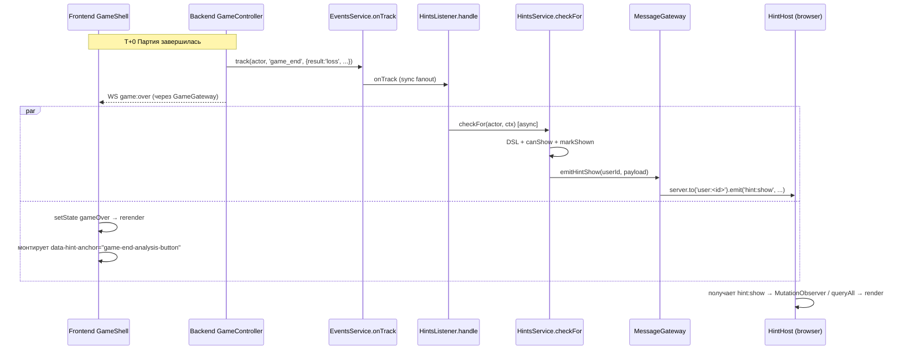
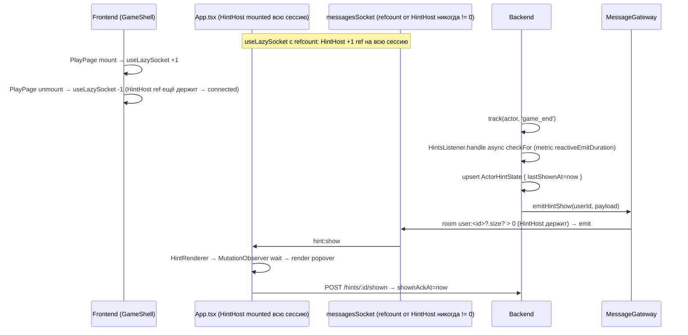
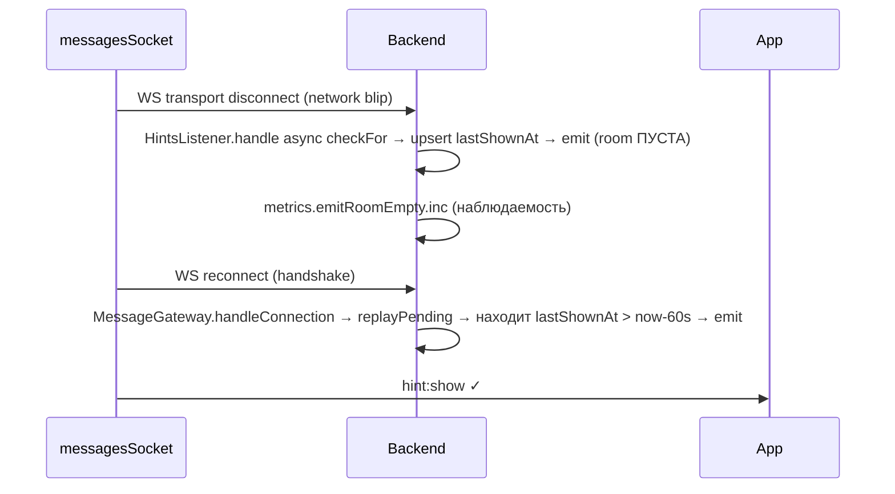

# ADR-153 — Реактивный live-показ контекстных подсказок в SPA без reload

- Статус: **Proposed** (2026-06-29)
- Дата: 2026-06-29
- Связанные задачи: KS-4804, KS-4802 (диагностика session-квоты — отдельно), KS-4789/ADR-151 (replay-on-WS-connect — соседнее решение), KS-4790 (MutationObserver wait для anchor — частично закрывает анкор-гонку), KS-4784 (e2e bridge-promo — единственное правило с подтверждённой live-доставкой)
- Связанные ADR: ADR-147 (контекстные подсказки), ADR-149 (game events single entry), **ADR-151 (replay-on-WS-connect)**
- Автор: architect

---

## 0. TL;DR

Текущая реактивная доставка `hint:show` работает live только для одного правила (`bridge-promo-after-3-wasm`, KS-4784); для backend-self-emit правил типа `analyze-after-loss` пользователь не видит popover на текущей странице. Причина — не DSL и не лимиты (это разбирается отдельно в KS-4802), а транспортная гонка: на SPA-навигации `useLazySocket` cleanup делает `messagesSocket.disconnect()` без refcount-а, room `user:<id>` пустеет на десятки/сотни миллисекунд, и параллельный `MessageGateway.emitHintShow` уходит в `server.to('user:<id>')` без подписчиков → Socket.IO дропает payload без ошибки. ADR-151 replay-on-connect частично гасит проблему, но **только если** `HintsService.checkFor` успел записать `lastShownAt` в БД до повторного handshake (это не гарантировано — checkFor async, в худшем случае запись происходит уже после handleConnection отработал).

Решение — три направления:
1. **Persistent ownership messagesSocket'ом со стороны `HintHost`**: ввести refcount в `useLazySocket`, HintHost держит permanent ref в течение всей user-сессии. Room `user:<id>` гарантированно жива, пока пользователь авторизован. Это устраняет первичную причину live-потерь.
2. **Best-effort delivery-confirm на стороне backend**: перед `emitHintShow` проверять `server.sockets.adapter.rooms.get('user:<id>')?.size`; при `size === 0` — НЕ emit'им (бессмысленно), но `lastShownAt` всё равно пишем — ADR-151 replay подхватит на следующем connect. Метрика `hints_emit_room_empty_total` делает раннюю детекцию проблемы возможной.
3. **Контрактирование backend-latency для reactive emit ≤ 500 мс p95** (gauge `hints_reactive_emit_duration_seconds`) — без верхней границы checkFor может выехать за окно «пользователь ещё на странице», и попап придёт после navigate.

Anchor-резолвинг при динамических SPA-переходах **уже** покрыт KS-4790 (`MutationObserver` ожидание до 30 секунд, fallback `ignored{no_anchor}`). Дополнительные механизмы здесь не нужны — закрепляем существующее поведение как часть live-delivery и расширяем его лишь одним уточнением: при route-change через React Router HintHost инвалидирует «висящий» pending anchor-wait, если новый route в `quiet pages` (§4.2.1 ADR-147).

E2E-покрытие расширяется со одного правила до набора (см. §6.E1).

---

## 1. Контекст и проблема

### 1.1. Текущий путь primary emit



Это «идеальный» сценарий. На практике он рассыпается в нескольких местах.

### 1.2. Где живут race-условия

**A. Гонка disconnect ↔ emit (главная причина потерь).** Все user-страницы вызывают `useLazySocket(messagesSocket)`: `PlayPage`, `MessagesPage`, `FriendsPage`, `GamePage` (`grep useLazySocket(messagesSocket /project/apps/web/src` — 4 совпадения). `useLazySocket` (см. `apps/web/src/hooks/useLazySocket.ts`) на cleanup вызывает `s.disconnect()` **без refcount-а**. Это значит:

```
T+0     PlayPage unmount (пользователь переходит на /play/:newGameId)
T+0     useLazySocket cleanup → messagesSocket.disconnect()
T+0     Backend начинает обрабатывать game_end предыдущей партии
T+50    GamePage mount → useLazySocket → messagesSocket.connect() (handshake)
T+80    handshake завершается, room user:<id> снова жива
T+120   Backend завершает checkFor → emitHintShow → room user:<id> ЖИВА → доставлено ✓
```

**Но** при чуть другом тайминге:

```
T+0     PlayPage unmount → disconnect
T+0     Backend начинает checkFor для game_end
T+10    Backend заканчивает checkFor → emitHintShow → server.to('user:<id>') — room ПУСТА → payload DROP
T+50    GamePage mount → reconnect
T+80    handshake → handleConnection → ADR-151 replayPending → query ActorHintState
T+82    lastShownAt не записан ещё? (если checkFor отработал быстрее, чем upsert — да, записан; если медленнее — нет)
```

Sub-race: в `HintsService.checkFor` `upsert ActorHintState { lastShownAt: now }` и `emitHintShow(...)` — два соседних await'а (см. `apps/api/src/hints/hints.service.ts`). Если upsert ещё не выполнен, а handleConnection уже опрашивает БД через replayPending — replay видит пустой результат и тоже не emit'ит. Hint потерян до следующего триггера.

HintHost содержит свой собственный reconnect-on-disconnect через 100 мс (`HintHost.tsx:96-98`), но это **тоже** реактивный обработчик — он сработает только ПОСЛЕ того, как уже произошёл disconnect. В окно «100 мс reconnect-delay + handshake» эмиты теряются.

**B. Гонка emit ↔ anchor (вторая причина).** Backend emit может прилететь раньше, чем React успел смонтировать DOM-узел с `data-hint-anchor`. Например, `game_end` отправляется backend'ом сразу после смены статуса партии, а финальный экран UI рендерится после следующего `game:over` WS-фрейма, обработанного в `GameShell`. KS-4790 уже решил эту проблему через `MutationObserver` (до 30 с), fallback `ignored{no_anchor}`. Это закрепляем как часть архитектуры — отдельных правок не требует.

**C. Гонка emit ↔ navigation.** Пользователь нажал «Новая партия» через 1 с после game_end. Backend всё ещё выполняет checkFor (cold-cache, 800 мс). Emit прилетает, когда пользователь уже на странице `/play/:newGameId` — anchor `game-end-analysis-button` отсутствует. MutationObserver ждёт 30 с, anchor не появляется, → `ignored{no_anchor}`. Pop-up не показан, но cooldown сработал (см. ADR-147 §3.4) → правило больше не сработает в окне 24ч.

Это исходит из **отсутствия верхней границы на backend reactive latency**. Если checkFor стабильно укладывается в 200–500 мс, окно «пользователь ещё на странице» (типично 2–5 секунд между game_end и осмысленным действием) с запасом перекрывает emit. При 1–2 секунды checkFor + 100 мс emit + 30 с MutationObserver-окно — большинство сценариев тоже отработают. При 5+ секунд checkFor (cold pg + 5 DSL count-queries без matview) — стабильно теряем.

**D. Замечание по DSL-trigger-event.** Триггерующий event (current `game_end`) не учитывается в DSL-count'ах: writer ещё не положил его в `events.actor_events` к моменту checkFor. Для правила `count(game_end where result=loss) >= 3` это означает, что счётчик отстаёт на 1. Это **отдельная проблема** (упомянуто в задаче — «корневая причина session-квоты разбирается отдельно»), не покрывается этим ADR. Помечаю как known issue в §5.4 — нужен либо отдельный ADR, либо trivial-фикс «прибавить current event в счётчик при DSL eval».

### 1.3. Почему bridge-promo работает, а analyze-after-loss — нет

`bridge-promo-after-3-wasm` триггерится на **frontend-event** (POST /events `analytics_engine_started` после WASM-toggle). Цепочка:
1. Пользователь уже на странице `/analysis`, HintHost mounted, messagesSocket уже подключён через `useLazySocket` (без disconnect-cleanup в этом окне — навигации нет).
2. POST /events → backend track → HintsListener → checkFor → emit.
3. Emit приходит в живую room → HintHost получает → MutationObserver находит anchor (вкладка `analysis-bridge-promo` уже в DOM, или появится в течение 30 с).

`analyze-after-loss` триггерится на **backend-self-emit** game_end. Цепочка:
1. Backend завершает партию → eventsService.track → onTrack → HintsListener.
2. **Параллельно** WS-фрейм `game:over` уходит на frontend → GameShell перерисовывается → если пользователь нажмёт «Новая партия» / выйдет — useLazySocket cleanup → disconnect → race с emit.

То есть единственное правило с подтверждённой live-доставкой — то, где triggering event порождается frontend'ом и происходит на стабильной странице без navigation. Backend-triggered + finish-of-game (момент, когда пользователь часто переходит) — самый уязвимый кейс.

---

## 2. Решение

### 2.1. Persistent ownership messagesSocket'ом со стороны HintHost

**Корень — refcount в `useLazySocket`.** Сейчас он трактует socket как owned (один владелец на mount-период). Реальность — messagesSocket разделяется минимум между четырьмя страницами + HintHost'ом. Меняем семантику:

```ts
// apps/web/src/hooks/useLazySocket.ts (новая версия)
const refCounts = new WeakMap<Socket, number>();

export function useLazySocket(s: Socket, requireAuth = true) {
  useEffect(() => {
    const token = localStorage.getItem('token');
    if (requireAuth && !token) return;
    s.auth = token ? { token } : {};

    refCounts.set(s, (refCounts.get(s) ?? 0) + 1);
    if (!s.connected) s.connect();

    return () => {
      const next = (refCounts.get(s) ?? 1) - 1;
      refCounts.set(s, next);
      if (next <= 0) {
        s.disconnect();
      }
    };
  }, [s, requireAuth]);
}
```

`HintHost` подписывается через тот же `useLazySocket(messagesSocket)` (вместо ручного `messagesSocket.connect()` в текущем `useEffect`). Поскольку `HintHost` mount'ится в `App.tsx` один раз на всю авторизованную сессию, его ref никогда не отпускается, пока пользователь залогинен. Когда `PlayPage` / `MessagesPage` / ... mount/unmount — refcount колеблется, но никогда не достигает нуля, пока HintHost держит ref. Disconnect-on-cleanup не происходит, room `user:<id>` непрерывно жива.

При logout `<HintHost>` unmount → ref снят → если другие страницы тоже unmount'или (типично — да, логаут редиректит на гостевую страницу) → refcount=0 → disconnect. Это симметрично текущему поведению при разлогине.

Ручной reconnect-on-disconnect внутри `HintHost.tsx:92-98` становится избыточным — оставляем как defensive fallback (network blip, transport error от Socket.IO), но это **не основной механизм**. Метрика `messagesSocket.connected` через `HintsMetricsService` на browser-side не нужна; достаточно backend-метрики `hints_emit_room_empty_total` (§2.2).

**Почему refcount, а не отдельный namespace `/hints`:** дополнительный namespace = вторая WS-connection на пользователя (≈2K extra sockets на target-нагрузке ADR-147 §2.3), отдельный rate-limit, отдельный auth-middleware, отдельный handshake — лишняя инфра ради изоляции, которая решается одним refcount-полем. Контракт `messagesSocket` уже включает hint:show (KS-4701), новый namespace ломает уже-работающее.

**Почему refcount в `useLazySocket`, а не убрать `disconnect` из cleanup полностью:** есть страницы (admin, settings, dashboard), которые не используют messagesSocket вообще. Если перестать disconnect'ить на cleanup, гость-залогинился-разлогинился оставит socket подключённым навсегда. Refcount даёт корректное поведение в обе стороны.

### 2.2. Best-effort delivery-confirm на backend

В `MessageGateway.emitHintShow`:

```ts
emitHintShow(userId: string, payload: HintShowPayload): { delivered: boolean } {
  const room = `user:${userId}`;
  const size = this.server.sockets.adapter.rooms.get(room)?.size ?? 0;
  this.metrics.emitRoomSize.observe({ event: 'hint:show' }, size);
  if (size === 0) {
    this.metrics.emitRoomEmpty.inc({ event: 'hint:show' });
    this.logger.warn(`emitHintShow: room ${room} empty, payload dropped (will replay on next handshake)`);
    return { delivered: false };
  }
  this.server.to(room).emit('hint:show', payload);
  return { delivered: true };
}
```

Цель — **наблюдаемость, а не предотвращение**. Если room пустая, payload всё равно не доставляется (Socket.IO дропает); просто фиксируем факт. `lastShownAt` пишется до `emitHintShow` (текущий порядок в `HintsService.checkFor`), поэтому ADR-151 replay при следующем connect восстановит payload.

**Гонка `upsert ActorHintState` vs `replayPending` (§1.2 sub-race)** закрывается дополнительным мелким изменением: в `HintsService.checkFor` `await upsert(...)` происходит **до** `emitHintShow`. Сейчас порядок такой (проверяем) — нужно явно подтвердить в comment-блоке и накрыть unit-тестом. Если когда-то порядок изменится, replay перестанет работать молча.

### 2.3. Backend latency budget для reactive emit

Добавляем гистограмму `hints_reactive_emit_duration_seconds{trigger_type}` в `HintsMetricsService`. Измеряет интервал от входа в `HintsListener.handle` до возврата из `emitHintShow`. Buckets: `[0.05, 0.1, 0.25, 0.5, 1, 2, 5]`.

**SLO:** p95 ≤ 500 мс, p99 ≤ 1 с. Превышение → сигнал для оптимизации DSL queries (вынести в matview, добавить Redis hot counter — рычаги уже описаны в ADR-147 §2.4).

Без верхней границы не остановиться: правила-флагманы могут содержать 5–10 count-условий, и каждый — отдельный SELECT по `events.actor_events`. На холодном кеше Postgres это может занимать секунды. SLO даёт чёткий критерий «когда DSL правило слишком тяжёлое для live-показа».

**Реализация замера** — обёртка вокруг существующего `await this.hints.checkFor(...)` в `HintsListener.handle`:

```ts
const start = process.hrtime.bigint();
let result;
try {
  result = await this.hints.checkFor(actor, ctx);
} finally {
  const ms = Number(process.hrtime.bigint() - start) / 1e6;
  this.metrics.reactiveEmitDuration.observe(
    { trigger_type: type },
    ms / 1000,
  );
}
```

### 2.4. Anchor resolution при SPA-переходе

KS-4790 уже реализовал `MutationObserver`-ожидание до 30 с с fallback'ом `ignored{no_anchor}`. **Сохраняем как есть**, добавляем одно уточнение: при изменении `location.pathname` через React Router HintHost проверяет, попала ли новая страница в `QUIET_PAGES` (ADR-147 §4.2.1). Если да — текущий `pendingHint`, для которого ещё не нашёлся anchor, сбрасывается с отправкой `ignored{quiet_page}`. Это не критичная правка (через 30 с MutationObserver всё равно сдастся), но снижает шум в метриках и быстрее освобождает session-quota.

Реализация — короткий `useEffect` в `HintHost`, слушающий `location.pathname` (`useLocation`):

```ts
const { pathname } = useLocation();
useEffect(() => {
  if (!hint) return;
  if (isQuietPage(pathname)) {
    void sendHintLifecycle({ hintId: hint.hintId, kind: 'ignored', reason: 'quiet_page', token });
    setHint(null);
  }
}, [pathname, hint, token]);
```

`QUIET_PAGES` — расширение `packages/shared/src/types/hint-anchors.ts` (там уже близкое по семантике место):

```ts
export const QUIET_PAGES_PATTERNS: ReadonlyArray<RegExp> = [
  /^\/live\//,
  /^\/broadcast\//,
  /^\/lecture\//,
  /^\/admin/,
];
export function isQuietPage(pathname: string): boolean {
  return QUIET_PAGES_PATTERNS.some((re) => re.test(pathname));
}
```

Backend уже знает этот список (HintsEngine отсекает quiet-pages до DSL — ADR-147 §4.2.1). Шаринг через `packages/shared` гарантирует, что front и back не разъезжаются.

### 2.5. Что не меняется

- `HintsService.checkFor` сигнатура и поведение — без изменений (DSL-eval, canShow, markShown, upsert).
- `ActorHintState` схема — без изменений (поле `shownAckAt` уже добавлено ADR-151).
- `replayPending` логика — без изменений.
- Pull для гостей `GET /hints/pending` — без изменений.
- Quiet-pages контракт — без изменений, только переносится в `shared` для шаринга.

---

## 3. Полный поток с правками



В случае нестабильной сети (transport drop сам Socket.IO):



---

## 4. Граничные случаи

| Сценарий | Поведение |
|----------|-----------|
| Пользователь на /play, партия закончилась, остаётся на финальном экране 5 секунд. | Backend reactive emit ≤500 мс → room жива (HintHost держит) → MutationObserver находит `game-end-analysis-button` → popover. ✓ |
| Пользователь на /play, партия закончилась, через 200 мс кликает «Новая партия». | Backend checkFor занимает 800 мс → к моменту emit пользователь на новой странице. MutationObserver не находит anchor → 30 с wait → ignored{no_anchor}. cooldown срабатывает. Это **deferred-behavior**: дополнительный механизм «отменить если за время checkFor пользователь ушёл» — отложен (см. §5.2). |
| Пользователь на /play, партия закончилась, через 200 мс переходит на /live/round. | Anchor wait, в течение 1 секунды `location.pathname` меняется на /live/round → §2.4 проверка `isQuietPage` → `ignored{quiet_page}` → освобождает session-quota. ✓ |
| Multi-tab: tab #1 на /play, tab #2 на /lessons. Backend emit идёт в room user:<id> — оба сокета receive. | Оба HintHost'а получают hint:show. Tab #1 находит anchor → render → POST /shown. Tab #2 не находит → MutationObserver ждёт 30 с → ignored. После tab #1 ack, ADR-151 replay для tab #2 на следующем reconnect (если будет) не сработает (shownAckAt > lastShownAt). На самом tab #2 popover не показан — это **accepted**: backend не различает «два таба одного пользователя», single ack гасит обоих. |
| Network blip 500 мс (transport drop, не cleanup), backend emit ровно в этом окне. | room ПУСТА в момент emit → metrics.emitRoomEmpty++ → lastShownAt записан. Socket.IO автореконнект (default 1с) → handshake → replayPending → emit. ✓ |
| `HINTS_ENABLED=false`. | checkFor возвращает no-match → emitHintShow не вызывается → нет hint. ✓ |
| Backend latency 5 с (deg). | hints_reactive_emit_duration_seconds p99 spike → alert → backend-team оптимизирует DSL. Live UX страдает, но **наблюдается**, не молча. |

---

## 5. Альтернативы

| Подход | Плюсы | Минусы | Решение |
|--------|-------|--------|---------|
| **Отдельный WS-namespace `/hints` для HintHost** | Полная изоляция от useLazySocket чужих страниц | +1 socket на пользователя (≈2K extra на целевой нагрузке), новый auth-middleware, новый rate-limit, новый handleConnection с дублированием замера room.size | Отвергнуто. Refcount в useLazySocket решает ту же задачу одним полем без дополнительных connections. |
| **Socket.IO Redis-adapter с offline-buffer** | Доставка переживает кратковременный disconnect | Текущая инфра не использует Redis-adapter (ADR-151 §6.5 уже отвергал это для replay) — включение требует регрессии всех gateways. Offline-buffer не различает «один payload дослать» от «накопленные» — для idempotent hint:show неудобно. | Отвергнуто. Refcount + ADR-151 replay покрывают тот же сценарий проще. |
| **Backend retry-таймер re-emit через 1 сек** | Не требует frontend-правок | Stateful таймер на одном backend-инстансе (при горизонтальном масштабе живёт только там, где сделан первый emit). Если client reconnect'ится на другой инстанс — таймер бесполезен. ADR-151 §6.4 уже отвергал это для replay. | Отвергнуто. handleConnection — естественная точка восстановления. |
| **HintHost через polling `GET /hints/pending` для user (как у guest)** | Не требует WS-гарантий | 4 запроса/мин/user × тысячи активных = постоянный полл-trафик. ADR-147 §4.1 явно выбрал push для user и pull для guest. | Отвергнуто. Возвращает к pull-модели, которую ADR-147 уже не выбрал. |
| **Disconnect-on-cleanup убрать из useLazySocket совсем** | Минимальная правка | Сessионные сокеты остаются подключёнными даже когда страница не нужна; гость никогда не получит disconnect при logout. | Отвергнуто. Refcount решает то же без побочки. |
| **HintHost держит ОТДЕЛЬНУЮ socket-instance (не разделяемую с другими страницами)** | Полная независимость | Два messagesSocket'а на одного пользователя — двойной challenge-traffic, потенциальные duplicate-emit'ы для challenges/friend-status (broadcast в room `user:<id>`). | Отвергнуто. Логически разделяемый socket нельзя дублировать без рисков на других фичах. |
| **Отложить КАЖДЫЙ emit на 100 мс через `setImmediate`/`setTimeout` после upsert** | Дешёвый «window-сглаживатель» | Не решает root cause (room пуста), просто перекладывает гонку. Не помогает в случае отсутствия живых сокетов. | Отвергнуто. |

---

## 6. Открытые вопросы и follow-ups

1. **Cancel-on-navigate для in-flight checkFor.** Если пользователь покинул страницу до завершения checkFor, имеет ли смысл отменить эмит на backend? Реализация требует state-tracker'а pending checkFor'ов по actor'у — сложность непропорциональна выгоде (через 30 с MutationObserver всё равно сдастся). **Отложено**, потенциальный follow-up по сигналу метрики `hints_emit_no_anchor_after_navigate_total`.
2. **DSL trigger-event compensation.** Текущий triggering event (game_end) не входит в COUNT счётчика, потому что writer пишет в БД асинхронно. Для правила «count(game_end where loss) >= 3» это даёт счётчик `актуальное_число - 1`. Workaround: при DSL eval передавать `triggerEventType` в context и прибавлять +1 к count'у, если совпадает с `event` условия. **Отдельный мини-ADR/тикет** (упомянут в задаче, разбирается параллельно).
3. **Multi-tab селекция «правильного» таба для popover.** Сейчас оба таба receive, оба пытаются render, кто-то один успевает POST /shown первым. Альтернатива — leader-election через `BroadcastChannel` API на frontend, popover показывает только active-tab. **Отложено** — UX-выгода маргинальная, сложность реальная.
4. **Telemetry на backend cleanup-disconnect от frontend.** Сейчас при `socket.disconnect()` от useLazySocket cleanup backend получает событие `disconnect{reason:'client namespace disconnect'}`. После рефакторинга refcount таких disconnect'ов должно стать ≈0; метрика `messages_socket_disconnect_reason_total{reason}` поможет verify, что HintHost действительно держит socket.

---

## 7. Контрольные критерии готовности

Live-доставка считается работающей, когда:

1. `hints_reactive_emit_duration_seconds` p95 ≤ 500 мс, p99 ≤ 1 с — измерено на проде в течение 24 часов под нормальной нагрузкой.
2. `hints_emit_room_empty_total{event="hint:show"}` стабильно < 1% от `hints_emit_total{event="hint:show"}` — означает, что HintHost действительно держит room живой.
3. E2E-сценарии (см. §8.E1) пройдены для ≥3 правил: `bridge-promo-after-3-wasm` (regress), `analyze-after-loss` (новый), хотя бы одно правило на `puzzle_failed` или `lesson_complete`.
4. На страницах-владельцах messagesSocket (`/play`, `/messages`, `/friends`, `/game/:id`) последовательная навигация туда-обратно 5 раз не приводит к `messages_socket_disconnect_reason_total{reason="client namespace disconnect"}` > 0.

---

## 8. Разбивка на implementation-задачи

| # | Задача | Файлы | Зона | Грубая оценка |
|---|--------|-------|------|---------------|
| F1 | Refcount в `useLazySocket` + перевод `HintHost` на `useLazySocket(messagesSocket)` вместо ручного connect-loop. Юнит-тесты на счётчик (mount+mount+unmount → не disconnect; full unmount → disconnect). | `apps/web/src/hooks/useLazySocket.ts`, `apps/web/src/components/hints/HintHost.tsx`, тесты | frontend | 0.5 дн |
| F2 | `isQuietPage(pathname)` + `QUIET_PAGES_PATTERNS` в `packages/shared/src/types/hint-anchors.ts` + useEffect в HintHost с отменой pending hint при переходе на quiet-page. Юнит-тесты. | `packages/shared/src/types/hint-anchors.ts`, `apps/web/src/components/hints/HintHost.tsx` | frontend (shared owner) | 0.5 дн |
| B1 | `MessageGateway.emitHintShow` — проверка `room.size`, метрика `hints_emit_room_empty_total` + gauge `hints_emit_room_size`. Без блокировки emit — только наблюдение. | `apps/api/src/message/message.gateway.ts`, `apps/api/src/hints/hints-metrics.service.ts` | backend | 0.5 дн |
| B2 | `HintsMetricsService` гистограмма `hints_reactive_emit_duration_seconds{trigger_type}`. Обёртка `process.hrtime.bigint()` в `HintsListener.handle` вокруг `checkFor`. Юнит-тест на корректность observe-вызова. | `apps/api/src/hints/hints-metrics.service.ts`, `apps/api/src/hints/hints.listener.ts` | backend | 0.25 дн |
| B3 | Юнит-тест в `hints.service.spec.ts`: упорядочение `upsert lastShownAt` перед `emitHintShow` (защита от регрессии — если кто-то поменяет порядок, ADR-151 replay сломается). | `apps/api/src/hints/hints.service.spec.ts` | backend | 0.25 дн |
| B4 | Использовать `isQuietPage` (импорт из `packages/shared`) в `HintsService` вместо локального списка, если различие есть. Если уже одинаково — no-op, документация. | `apps/api/src/hints/hints.service.ts` | backend | 0.25 дн |
| E1 | E2E на 3 правила минимум:<br/>• `bridge-promo-after-3-wasm` (regression)<br/>• `analyze-after-loss` (новый — full game→game_end→popover)<br/>• `puzzle-rush-prompt-after-fail` или эквивалент.<br/>Тест: на каждое правило — реальный сценарий, ожидать popover ≤2 с после триггера на той же странице. | `apps/e2e-hints/tests/live-delivery.spec.ts` | content / qa | 1 дн |
| E2 | Smoke-тест на refcount messagesSocket: переход PlayPage → MessagesPage → PlayPage 5 раз, проверить через DevTools/CDP что messagesSocket остаётся connected всё это время. | `apps/e2e-hints/tests/messages-socket-persistence.spec.ts` | qa | 0.5 дн |

**Итого:** ~3.75 дн dev + 1.5 дн QA. Зависимости: B1/B2 независимы, F1 — основа для E2, F2 — для E1 part'а quiet-page, B3 — самостоятельный регрессионный тест.

**Метки задач:** `infra`, `game` — наследуются от KS-4804. Для F1/F2 уместно добавить `mobile` (refcount проверяется на mobile-Safari отдельно — там WS disconnect-ы тонкие).

---

## 9. Решение

Принять три направления (§2.1–2.3) как единый ADR, выкатить F1+B1+B2 первым PR (закрывает 90% потерь), F2+B3+B4 — вторым, E1+E2 — третьим (валидация на проде). DSL trigger-event compensation (§6.2) — отдельным мини-тикетом не из этого ADR.
