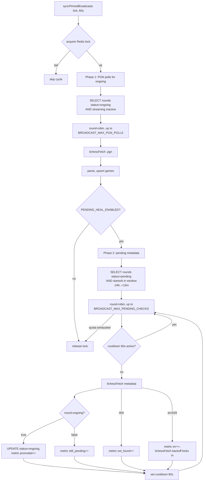

# ADR-155: broadcast-service — LICHESS_API_TOKEN и self-healing pending-раундов

**Статус:** Принято
**Дата:** 2026-07-05
**Задачи:** KS-4834 (этот ADR), KS-4832 (диагностика, использует ADR)
**Связанные ADR:** [ADR-021](./021-broadcast-service-extraction.md), [ADR-022](./022-broadcast-worker-merge-into-service.md), [ADR-023](./023-broadcast-crosstable-chess-results.md)

## 1. Контекст

В ходе диагностики KS-4832 backend установил два архитектурных вопроса, требующих решения. Разведка кода `apps/broadcast-service` подтвердила факты:

### 1.1. HTTP-клиент и токен — что уже есть в коде

`broadcast-sync.service.ts` использует native `fetch()` без внешних rate-limit библиотек. Вставка Bearer-токена **уже реализована** в двух местах:

- Общий helper `lichessFetch()` — строки 596–604:
  ```ts
  // KS-3334: если задан LICHESS_API_TOKEN, шлём авторизованные запросы
  // (лимит ~8000 req/h вместо ~800 анонимных).
  const token = process.env.LICHESS_API_TOKEN;
  const headers: Record<string, string> = { ...init.headers };
  if (token) headers['Authorization'] = `Bearer ${token}`;
  ```
- SSE-стрим `runStream()` — строки 1481–1485 (аналогично).

Кода менять не нужно — вопрос сводится к «завести аккаунт и прописать env-переменную».

### 1.2. Профиль нагрузки на Lichess (без токена)

| Цикл | Интервал | Запросов на цикл | Запросов/час |
|---|---|---|---|
| `syncBroadcasts` (full) | 5 мин (12/ч) | 1 (broadcasts list) + N (metadata non-top-20) + до 5 (finished PGN) | 1 × 12 + N × 12 + до 60 |
| `syncPinnedBroadcasts` (pinned poll) | 1 мин (60/ч) | до `BROADCAST_MAX_PGN_POLLS`=5 | до 300 |
| `runStream` (SSE per round) | continuous, до `BROADCAST_MAX_STREAMS`=50 | 1 на переподключение (backoff 2s→300s) | десятки–сотни при штормах |
| `runWatchdogTick` (опц.) | 1 мин | 1 на stale-раунд | десятки |
| Force-resync | manual | 1 | штучно |

При ~100 активных broadcasts и типичной картине (несколько десятков раундов вне top-20, несколько finished раундов в цикл, десятки переподключений стримов) фактическое использование колеблется в диапазоне **500–1500 req/h**, и в пиках (рестарт сервиса, шторм переподключений, много finished раундов после игрового дня) уходит за анонимный лимит **~800 req/h**.

Rate-limit hit → per-endpoint эскалирующий backoff (60s → 180s → 600s → 1800s, `RATE_LIMIT_429_BACKOFF_LADDER_SEC`, jitter ±30%). Раунды, попавшие в backoff, следующие ~1–30 минут не обновляются.

### 1.3. Переход pending → ongoing — что есть

- `syncPinnedBroadcasts` (1 мин) фильтрует БД: `status='ongoing' AND streaming неактивен` → тянет `.pgn`. Раунды в `pending` **не рассматриваются**.
- `syncBroadcasts` (5 мин) тянет list `GET /api/broadcast?nb=100` + для non-top-20 раундов тянет metadata → в `upsertRound` `round.ongoing === true` → status обновляется на `ongoing` → в следующем цикле запускается `runStream` или подхватывает `syncPinnedBroadcasts`.
- При падении `syncBroadcasts` (KS-4832: наблюдается 88% провалов) переход `pending → ongoing` не происходит. Раунд «застревает» в `pending`, хотя на Lichess он уже идёт или даже завершился.

Backend предложил расширить `syncPinnedBroadcasts`: помимо `ongoing`, обрабатывать `pending AND startsAt <= NOW() + INTERVAL '5 min'`.

### 1.4. Ограничения проекта

- Один разработчик, минимум внешних сервисов.
- Prod-БД `broadcasts_kingside`, деплой — `apps/broadcast-service` под `broadcasts.kingside.site`.
- Секреты — через env-переменные контейнера (детали хранения — зона devops).

## 2. Решение

### 2.1. LICHESS_API_TOKEN — завести и использовать

**Принято.** Завести технический Lichess-аккаунт и передать его токен в `broadcast-service` через env `LICHESS_API_TOKEN`.

**Параметры аккаунта:**

1. **Тип:** personal Lichess account (не bot-аккаунт — bot-аккаунт даёт другие эндпоинты и требует markbot). Регистрация обычная.
2. **Имя:** `kingside-broadcast` (или похожее — фиксируется в operations-заметке, чтобы через год не забыть).
3. **Email:** технический ящик проекта (не личный ящик разработчика).
4. **Пароль:** длинный случайный, в password-manager проекта.
5. **2FA:** включить (Lichess поддерживает TOTP).
6. **Токен:** Personal API Access Token в настройках Lichess (`Preferences → API access tokens → New personal API access token`).
7. **Scopes токена:** **пусто** (никаких). Мы используем только публичные broadcast-эндпоинты, которые не требуют scope. Отсутствие scopes минимизирует риск при утечке — токен не даст ни писать в форум, ни ходить, ни менять аккаунт.
8. **Описание токена:** «broadcast-service prod — read broadcasts».

**Хранение и ротация:**

- Хранение — как остальные секреты `broadcast-service` (по решению devops: env файл контейнера, systemd EnvironmentFile, либо секрет-менеджер — выходит за рамки этого ADR).
- В git секрет не коммитится. `.env.example` в `apps/broadcast-service/` дополнить строкой:
  ```
  # Опционально. Personal API access token технического Lichess-аккаунта.
  # Без токена — анонимный лимит ~800 req/h, с токеном — ~8000 req/h.
  # Scopes: пусто. Ротация раз в год или при подозрении на утечку.
  LICHESS_API_TOKEN=
  ```
- Ротация — раз в год. Триггеры внеплановой ротации: подозрение на утечку, увольнение имевшего доступ разработчика, инцидент 401 на всех запросах.

**Обоснование:**

- Код `lichessFetch()` и `runStream()` уже читает `LICHESS_API_TOKEN` — правки не требуются, оценки регрессии не нужны.
- Разница лимитов ~10× (800 vs 8000 req/h) даёт запас порядка величины на пики (шторм переподключений стримов после сетевого инцидента, много finished раундов после игрового дня, ручные `force-resync`).
- Альтернативы (кэширование, снижение частоты циклов, шардинг между IP) хуже: усложняют код, задерживают live-трансляции, требуют инфраструктуры.

### 2.2. Распределение квоты между циклами

**Не менять существующее распределение.** Обоснование:

- 8000 req/h ≈ 133 req/min. При текущих потолках циклов (`syncPinnedBroadcasts`: 5 PGN polls/min = 5 req/min; `syncBroadcasts`: пик ~150 req/цикл раз в 5 мин = 30 req/min average) типичная нагрузка — 40–60 req/min при потолке 133. Запас 2×–3×, приоритезация не нужна.
- Per-endpoint backoff (60s → 30 мин с эскалацией) уже страхует от локальных всплесков. Глобального token-bucket добавлять не нужно — усложнит код без выигрыша.
- Если после включения токена мониторинг покажет систематическое приближение к 8000/ч, включаем следующий шаг (отдельная задача): consolidate PGN polls через SSE-стрим для большего числа раундов, либо кэширование metadata на короткие TTL. До этого — решать по факту.

**Опциональные подстройки (по мере наблюдения, отдельные задачи, не в KS-4832):**

- `BROADCAST_MAX_PGN_POLLS`: default 5 → можно поднять до 10 (более отзывчивые не-streaming раунды).
- `BROADCAST_MAX_STREAMS`: default 50 → без изменений, лимиты Lichess на concurrent streams не документированы, эмпирически 50 работает.

Эти подстройки — не в scope KS-4832. Пусть backend в KS-4832 просто внедрит токен и померяет.

### 2.3. Приоритеты при 429

Существующий per-endpoint backoff (`RATE_LIMIT_429_BACKOFF_LADDER_SEC = [60, 180, 600, 1800]` с jitter ±30%) уже даёт корректное поведение: каждый эндпоинт (per hostname+pathname) уходит в свой backoff, остальные продолжают ходить. Приоритезация по циклу (full > pinned > streaming) при этой схеме избыточна — 429 на `/api/broadcast?nb=100` не блокирует `/api/broadcast/round/{X}.pgn` и наоборот.

**Оставить как есть.**

### 2.4. Self-healing для pending-раундов — согласовать с коррекциями

Предложение backend согласовано с четырьмя коррекциями.

#### 2.4.1. Что запрашивать для pending — только metadata, не PGN

Для раунда в `pending` запрашивать `GET /api/broadcast/-/-/{roundId}` (metadata), **не** `.pgn`.

Обоснование:
- Если раунд ещё не начался на Lichess, `.pgn` вернёт пустое тело → 1 запрос потрачен впустую.
- Metadata возвращает `round.ongoing: bool` — точный сигнал для перехода `pending → ongoing`.
- Metadata дешевле по трафику и по нагрузке на Lichess.
- Момент перехода в `ongoing`: следующий тик `syncPinnedBroadcasts` (через ≤60 сек) уже подхватит раунд как `ongoing` и потянет `.pgn` штатной веткой, либо `syncBroadcasts` запустит `runStream()`. Задержка в один тик — приемлема.

#### 2.4.2. Окно `startsAt` — расширить и добавить нижнюю границу

Предложение backend: `startsAt <= NOW() + INTERVAL '5 min'`. Слишком узкое и без нижней границы.

Скорректированное окно:
```sql
status = 'pending'
  AND startsAt <= NOW() + INTERVAL '15 min'
  AND startsAt >= NOW() - INTERVAL '24 hours'
```

Обоснование границ:
- **Верхняя `+15 min`** (вместо `+5 min`): если `syncBroadcasts` до этого падал несколько раз, `startsAt` в БД может быть устаревшим относительно фактического старта на Lichess. 15 минут даёт запас на рассинхронизацию без чрезмерной нагрузки. При типичных ~100 раундах близких к старту в час это ≈ 10–20 pending-кандидатов в моменте.
- **Нижняя `-24 hours`**: защита от зомби-раундов. Если раунд создан 2 недели назад с `startsAt` в прошлом и до сих пор в `pending` — вероятно, это забытый раунд, Lichess его не проводит. Опрашивать его в pinned poll вечно — расход квоты без пользы. Раз в 24 часа отсечение переоценивается через `syncBroadcasts` (если оно живо, оно либо перекроет status, либо оставит pending — но исключит из pinned heal).

#### 2.4.3. Квота на pending-checks — отдельная от PGN polls

В `syncPinnedBroadcasts` две фазы, каждая со своей квотой:

1. **PGN polls (ongoing)** — как сейчас, до `BROADCAST_MAX_PGN_POLLS`=5 за цикл. Приоритет — live-трансляции важнее.
2. **Pending metadata checks** — отдельная квота, `BROADCAST_MAX_PENDING_CHECKS`=10 за цикл (default). Metadata дешевле PGN → допустима бóльшая квота.

Порядок в цикле: сначала PGN polls, затем pending metadata. Причина: если сервис перегружен и цикл не успевает за 60 сек (lock TTL — 50 сек), важнее не потерять живые обновления.

Round-robin — как для `nonStreamed` (существующий `pollOffset` расширить или ввести отдельный `pendingOffset`).

Между запросами — существующий `rateLimitDelay(1500ms)` (уже применяется в pinned poll).

Оценка нагрузки от расширения: 60 циклов/час × до 10 pending checks = **до 600 req/h** — комфортно в бюджете 8000/ч с токеном.

#### 2.4.4. Anti-flap и cooldown

Между двумя проверками одного и того же `roundId` в pending — cooldown 60 сек (один цикл). Реализация: Redis-ключ `broadcast:pending-check-cooldown:{roundId}` с TTL=60, проверка перед запросом.

Обоснование: без cooldown при малом числе pending-раундов round-robin будет крутить одни и те же 2-3 раунда каждые 60 сек — толку столько же, а лишний нагруз есть. С cooldown 60 сек в худшем случае каждый раунд проверяется раз в минуту, что синхронно с частотой цикла.

#### 2.4.5. Что НЕ делать в pending-фазе

- **Не запускать `runStream()`** в этом же цикле. Стрим стартует со следующего pinned-цикла (когда раунд уже `ongoing` и попадёт в основную ветку) либо со следующего `syncBroadcasts`. Причина: запуск стрима — состояние сервиса, его надо делать в одной точке (upsertRound), чтобы не размазывать логику.
- **Не тянуть `.pgn`** в pending-фазе. Только metadata.
- **Не менять `startsAt`** по данным metadata (пусть это делает `syncBroadcasts` в общей ветке). Pending-heal обновляет **только** `status` и `updatedAt`.

#### 2.4.6. Метрики

Добавить (Prometheus, тот же module):

- `broadcast_sync_pending_checks_total{result="promoted"|"still_pending"|"not_found"|"err"}` — счётчик исходов проверок.
- `broadcast_sync_pending_promotion_delay_seconds` — гистограмма разницы между `startsAt` раунда и фактическим переходом в `ongoing` (позволит увидеть, работает ли heal).

Существующие метрики `broadcast_sync_cycles_total{kind='pinned'}` продолжают учитывать pinned-цикл в целом.

#### 2.4.7. Feature flag

`BROADCAST_PENDING_HEAL_ENABLED` (default `true` после релиза). Kill-switch на случай, если heal даст неожиданный побочный эффект — можно отключить без деплоя.

## 3. Что делает backend в KS-4832 по этому ADR

Точечный список для имплементации:

1. **Токен:**
   - Стас/devops заводит Lichess-аккаунт `kingside-broadcast`, генерирует Personal API Access Token без scopes.
   - Devops прописывает `LICHESS_API_TOKEN=…` в env prod-контейнера `broadcast-service`.
   - Backend дополняет `apps/broadcast-service/.env.example` строкой с описанием (см. §2.1).
   - Backend после релиза проверяет логи: должны исчезнуть ошибки 429 с `RATE_LIMIT_429_BACKOFF_LADDER_SEC` и вылечиться доля успешных `syncBroadcasts`.

2. **Pending heal в `syncPinnedBroadcasts`:**
   - Добавить env-константы: `BROADCAST_MAX_PENDING_CHECKS` (default 10), `BROADCAST_PENDING_HEAL_ENABLED` (default true).
   - После существующей PGN-poll фазы: SELECT из БД раундов по условию из §2.4.2, round-robin по `pendingOffset`, для каждого — проверить cooldown-Redis, вызвать `lichessFetch(GET /api/broadcast/-/-/{roundId})`, распарсить, если `ongoing === true` — обновить `status='ongoing'`, `updatedAt=NOW()`, инкрементировать `pending_checks_total{result='promoted'}`.
   - Обработка ошибок: `404` → `result='not_found'`, оставить status как есть; сетевые/429 → `result='err'`, backoff уже учтён в `lichessFetch()`.
   - Установить cooldown-ключ на 60 сек после запроса (успешного или нет).
   - Метрики (см. §2.4.6).

3. **Тесты (backend):**
   - Юнит-тест на выборку pending-кандидатов по окну.
   - Юнит-тест на переход `pending → ongoing` при `metadata.round.ongoing === true`.
   - Юнит-тест на cooldown (второй вызов в течение 60 сек — skip).
   - Юнит-тест на квоту (не более `BROADCAST_MAX_PENDING_CHECKS` за цикл).

4. **Не в scope этого ADR (отдельные задачи, если понадобятся):**
   - Изменение default `BROADCAST_MAX_PGN_POLLS`.
   - Изменение default `BROADCAST_MAX_STREAMS`.
   - Отдельный глобальный token-bucket rate-limiter.
   - Оптимизация full-sync (уменьшение числа metadata-запросов на цикл).

## 4. Замечание про 88% провалов `syncBroadcasts`

Внедрение токена и pending-heal **устраняют две конкретные причины** из наблюдаемой картины KS-4832 (rate-limit → 429 → backoff; застревание pending → отсутствие live-раундов). Они не гарантируют, что доля провалов `syncBroadcasts` упадёт с 88% до 0%. Возможные оставшиеся причины (таймауты, ошибки парсинга NDJSON, ошибки БД при upsert) диагностируются backend в KS-4832 отдельно, по логам, после включения токена.

## 5. Диаграмма (Mermaid) — pinned cycle после правки



## 6. Ссылки

- Код: `apps/broadcast-service/src/sync/broadcast-sync.service.ts` (helper `lichessFetch()`, цикл `syncPinnedBroadcasts`).
- Lichess API docs: `https://lichess.org/api#tag/Broadcasts` (публичные эндпоинты, не требуют scope).
- Lichess rate limits: `https://lichess.org/api#section/Introduction/Rate-limiting` (~800 req/h anon, ~8000 req/h authenticated — эмпирические оценки, задокументированы в комментариях кода `broadcast-sync.service.ts:597-598`).
- KS-4832 — родительская задача диагностики.
- KS-4834 — эта задача.
