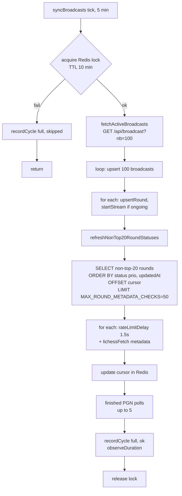

# ADR-156: broadcast-service — квота `refreshNonTop20`, `SYNC_LOCK_TTL`, метрика `streams_active`, pending-heal → startStream

**Статус:** Принято
**Дата:** 2026-07-05
**Задачи:** KS-4838 (этот ADR), KS-4832 (диагностика), KS-4837 (сетевая проверка)
**Связанные ADR:** [ADR-021](./021-broadcast-service-extraction.md), [ADR-155](./155-broadcast-lichess-token-and-pending-heal.md)
**Пересматривает:** ADR-155 §2.4.5 (запрет `startStream()` в pending-heal)

## 1. Контекст

Реализация ADR-155 (LICHESS_API_TOKEN + pending-heal) закрыла две причины провалов `syncBroadcasts`, но остаточная задержка ~5 мин на Round 15 Croatia Blitz показала третью, более грубую проблему — сам цикл `syncBroadcasts` не завершается.

### 1.1. Факты (KS-4832 comment 12680, KS-4837 comment 12679)

1. **`refreshNonTop20RoundStatuses` физически не влезает в цикл.**
   - На проде: 1234 раунда в статусе `ongoing`/`pending`/`finished-7d` → цикл по 1234 итерации.
   - На iteration: `rateLimitDelay(1500 мс)` + `lichessFetch` с `AbortSignal.timeout(30 000 мс)`.
   - Ожидаемая длительность одного прогона без ошибок: 1234 × 1500 мс ≈ **31 мин**.
   - `SYNC_LOCK_TTL = 4 мин` истекает задолго до конца.

2. **Наложенные циклы.**
   - `setInterval(SYNC_INTERVAL_MS = 5 мин)` каждые 5 мин повторно `acquireLock` → после истечения TTL берёт лок и стартует **параллельный** `syncBroadcasts`.
   - За uptime 54 мин зафиксировано **10 параллельных стартов** `Syncing broadcasts from Lichess...` без единого `Sync completed`.

3. **Undici pool забит.**
   - Node `fetch` держит 6 keep-alive соединений на origin, dispatcher — глобальный singleton на процесс.
   - Десятки параллельных запросов из накопившихся циклов → очередь undici растёт, каждый запрос ждёт connection и упирается в `AbortSignal.timeout(30 000)` → `connect ETIMEDOUT` в `.cause`.
   - Devops в KS-4837: одновременно с 514 `lichessFetch FAILED` / 592 `ETIMEDOUT` в основном процессе, свежий `execute-command` в том же контейнере даёт 10/10 успешных `fetch` через тот же undici (свой event loop, чистый dispatcher). Сеть/инфра — не виноваты, состояние undici в Node-процессе — виновато.

4. **`startStream()` не вызывается для новых `ongoing` раундов.**
   - `startStream(round.id)` вызывается только внутри `upsertRound()` в цикле `syncBroadcasts` (строка ~812).
   - Цикл виснет на `refreshNonTop20RoundStatuses` до этой ветки не доходит либо доходит с 5+ мин задержкой.
   - Pending-heal (ADR-155 §2.4.5) намеренно НЕ запускает стрим — оставляет `syncBroadcasts`.
   - Результат для промоушенного раунда: `status='ongoing'` в БД, но нет стрима → pinned poll подхватывает round-robin с шагом `BROADCAST_MAX_PGN_POLLS=5` из ~30 non-streamed → интервал опроса одного раунда ≈ 5–6 мин.

### 1.2. Что уже сделано (ADR-155)

- `LICHESS_API_TOKEN` внедрён (~8000 req/h вместо ~800).
- Pending-heal промотит `pending → ongoing` за 60 сек внутри `syncPinnedBroadcasts` (не зависит от `syncBroadcasts`).
- Метрики `broadcast_sync_pending_checks_total` / `broadcast_sync_pending_promotion_delay_seconds`.

Токен снял rate-limit, но не помог с undici pool — `AbortSignal.timeout` на `connect` срабатывает независимо от 429/лимитов.

### 1.3. Ограничения проекта

- Один разработчик, минимум внешней инфраструктуры.
- prod-БД `broadcasts_kingside`, деплой — `apps/broadcast-service` под `broadcasts.kingside.site`.
- Правки — строго в `broadcast-service`, без замены глобального undici dispatcher (риск регрессии в других местах кода).

## 2. Решение

### 2.1. Квота на `refreshNonTop20RoundStatuses` + round-robin

**Принято.** Ввести `BROADCAST_MAX_ROUND_METADATA_CHECKS` (default **50**) — верхний предел metadata-запросов за один цикл `syncBroadcasts`. Обход всех non-top-20 раундов растягивается на несколько циклов через round-robin cursor.

**Расчёты:**

| Параметр | Значение | Обоснование |
|---|---|---|
| Квота за цикл | **50** | 50 × 1.5 сек `rateLimitDelay` = **75 сек** на фазу |
| Полный обход БД (1234 раунда) | 25 циклов × 5 мин = **~2 часа** | Non-top-20 — по определению менее приоритетные |
| Верхняя граница длительности цикла | ~4.5 мин при рабочей сети | fetch list (~10 с) + upsert 100 broadcasts (~2.5 мин, эмпирически из логов KS-4837) + refresh (75 с) + finished PGN до 5 × 1.5 с = **~4:15** |

**Приоритезация внутри квоты — единая очередь с приоритетом статуса:**

```sql
SELECT lichessRoundId
  FROM broadcast_rounds
 WHERE status IN ('ongoing', 'pending', 'finished')
   AND (status != 'finished' OR updatedAt >= NOW() - INTERVAL '7 days')
   AND lichessRoundId NOT IN (:top20LichessRoundIds)
 ORDER BY
   CASE status WHEN 'ongoing' THEN 0 WHEN 'pending' THEN 1 ELSE 2 END,
   updatedAt ASC
 OFFSET :cursor
 LIMIT :quota;
```

**Обоснование сортировки:**
- `ongoing` первым — быстрее ловим завершения (переход `ongoing → finished`).
- `pending` вторым — pending-heal (ADR-155) покрывает окно `[NOW()-24h, NOW()+15 min]`, но раунды с `startsAt` дальше в будущем ловятся только здесь.
- `finished` последним — только для догрузки поздних апдейтов таблиц/партий.
- Внутри группы — `updatedAt ASC` — самые старые (давно не проверявшиеся) идут первыми, естественный round-robin по возрасту.

**Cursor:**
- Redis-ключ `broadcast:refresh:cursor` (integer offset), TTL 1 час.
- После каждого цикла: `cursor = cursor + processed` (processed ≤ quota).
- Если запрос вернул < quota (дошли до конца выборки) — reset cursor к 0.
- При смене общего количества раундов (вставки/удаления) допустима сдвижка выборки — не критично, следующий проход покроет.

**Что НЕ делаем:**
- Не убираем `rateLimitDelay(1500 ms)` — эта задержка сама по себе защищает от bursty нагрузки на Lichess, отдельно от rate-limit по токену.
- Не разделяем очередь на три отдельные подквоты (ongoing/pending/finished) — усложнение без выигрыша, при квоте 50 и небольшой доле `ongoing`/`pending` в 1234 раундах, приоритетная сортировка гарантирует что живые раунды всегда попадают в выборку.

**Опциональные подстройки (не в scope, отдельные задачи):**
- Разделить квоту при росте `ongoing` > 25 в non-top-20 — тогда стандартный обход `finished` начнёт голодать.

### 2.2. SYNC_LOCK_TTL = 600 сек (10 мин)

**Принято.** Поднять `SYNC_LOCK_TTL` с 240 сек (4 мин) до **600 сек (10 мин)**. `SYNC_INTERVAL_MS` оставить 5 мин.

**Обоснование:**

- Типовая длительность цикла после §2.1: ~4.5 мин. Лок 10 мин даёт запас ~2.2× на медленную сеть / временный throttle.
- При SYNC_INTERVAL_MS = 5 мин следующий тик через 5 мин наткнётся на активный лок → `recordCycle('full', 'skipped')` штатно. Через 10 мин лок отпустится (либо цикл закончится сам) — следующий тик подхватит.
- Гарантирует **отсутствие наложенных циклов** при штатной работе. При крахе процесса ждать 10 мин до восстановления — приемлемо (pinned poll и pending-heal продолжают работать своими локами).
- Backend предлагал 60 мин — слишком много: при краше процесса ждать час до перезахвата лока — плохой UX.
- Backend предлагал «выше типовой длительности» — 10 мин удовлетворяет условию: 10 > 4.5.

**Kill-switch:** оставить существующий флаг `BROADCAST_SYNC_ENABLED` (default false) без изменений.

### 2.3. Метрика `broadcast_streams_active_total`

**Принято.** Добавить набор Prometheus-метрик про стримы.

**Основная метрика:**

```
# HELP broadcast_streams_active Number of active PGN streams
# TYPE broadcast_streams_active gauge
broadcast_streams_active <N>
```

**Реализация:** `setInterval(5000, () => gauge.set(activeStreams.size))`. Проще, чем обвешивать все точки мутации `activeStreams` (Map<roundId, AbortController>), и достаточно точно для наблюдения тренда.

**Дополнительные метрики (для диагностики жизни стримов):**

```
# HELP broadcast_streams_started_total PGN streams started
# TYPE broadcast_streams_started_total counter
broadcast_streams_started_total{result="ok"|"capacity_full"|"error"} <N>

# HELP broadcast_streams_ended_total PGN streams ended
# TYPE broadcast_streams_ended_total counter
broadcast_streams_ended_total{reason="round_finished"|"aborted"|"error"|"rate_limit_429"} <N>

# HELP broadcast_stream_duration_seconds Duration of PGN stream sessions
# TYPE broadcast_stream_duration_seconds histogram
broadcast_stream_duration_seconds_bucket{le="..."} <N>
```

**Точки инкремента:**
- `started_total` — при каждом вызове `startStream()`. `result="ok"` — стрим запущен; `result="capacity_full"` — упёрлись в `MAX_CONCURRENT_STREAMS`; `result="error"` — исключение в `runStream()`.
- `ended_total` — в `runStream()` при выходе из основного цикла: по `catch` (`aborted`/`error`/`rate_limit_429`) или по успешному завершению стрима на стороне Lichess (`round_finished`).
- `stream_duration_seconds.observe(dur)` — рядом с `ended_total`.

**Обоснование:** сейчас `activeStreams.size` виден только через `execute-command` (недоступен на проде без re-deploy). После правки — сразу в `/_/metrics`, интегрируется в Grafana без ручных проб.

### 2.4. Pending-heal → startStream — разрешить

**Принято.** Пересматриваем ADR-155 §2.4.5: **pending-heal вызывает `startStream(round.id)` в том же тике после promotion**.

**Мотивация пересмотра:**

- Изначальный аргумент ADR-155 §2.4.5 («стрим — состояние сервиса, его надо делать в одной точке — upsertRound») строился на предположении, что `syncBroadcasts` работает. Факты KS-4832 показали: `syncBroadcasts` не завершается по внутренним причинам → раунды промоушены через pending-heal, но без стрима, задержка 5–6 мин на pinned round-robin.
- `startStream()` **уже идемпотентен** — проверяет `activeStreams.has(round.id)` перед запуском (иначе одна и та же логика в `upsertRound` создавала бы дубли при повторных вызовах). Дополнительных гарантий не требуется.
- Разница в семантике: pending-heal — быстрый (60 сек) цикл, дающий низкую задержку промоушена. Логично, чтобы он давал такую же низкую задержку и запуску стрима.

**Что меняется в коде pending-heal (по сравнению с ADR-155 §2.4.5):**

```
БЫЛО (ADR-155 §2.4.5): при metadata.round.ongoing === true
  → UPDATE broadcast_rounds SET status='ongoing', updatedAt=NOW()
  → metric promoted++
  → cooldown set
  → НЕ вызывать startStream

СТАЛО (ADR-156 §2.4):
  → UPDATE broadcast_rounds SET status='ongoing', updatedAt=NOW()
  → startStream(round.id)   // идемпотентно, ловит capacity_full
  → metric promoted++
  → cooldown set
```

### 2.5. Дополнительно: fallback запуск стрима в pinned phase 1

**Принято.** В `syncPinnedBroadcasts` phase 1 (PGN polls для `ongoing` без активного стрима) — **перед PGN poll** пробовать `startStream(round.id)`. Если стрим запустился (или уже был активен, но не отражён в Map — маловероятно) — PGN poll для этого раунда пропускается.

**Обоснование:**

- Это второй fail-safe: если `syncBroadcasts` не отработал (падение, лок), и pending-heal не помог (раунд был промоушен `syncBroadcasts` до крэша, а не pending-heal), — стрим всё равно стартует в течение ≤ 60 сек через pinned poll.
- PGN poll остаётся как fallback для случая, когда `startStream` вернул `capacity_full` (упёрлись в `MAX_CONCURRENT_STREAMS = 50`). Для них round-robin PGN poll сохраняет прежнюю логику.
- `startStream()` идемпотентен → повторные вызовы для одного раунда безопасны.

**Порядок в phase 1:**

```
for each round in SELECT ongoing NOT in activeStreams ORDER BY updatedAt ASC LIMIT MAX_PGN_POLLS:
  1. res = startStream(round.id)     // синхронная точка входа, стартует async
  2. if res === 'ok':
       continue                       // стрим стартовал — PGN poll не нужен
  3. if res === 'capacity_full':
       await pgnPoll(round.id)         // fallback как раньше
       rateLimitDelay(1500ms)
  4. if res === 'error':
       // счётчик метрики, продолжаем цикл — следующий тик попробует снова
```

**Замечание:** `startStream()` должен вернуть синхронный маркер результата (`'ok'` / `'capacity_full'` / `'error'`), а не только запустить fire-and-forget. Сейчас он `void` — backend адаптирует сигнатуру (мелкое изменение, идёт в KS-4832).

## 3. Диаграмма — обновлённый `syncBroadcasts` цикл (Mermaid)



## 4. Оценка эффекта

| Метрика | До ADR-156 | После ADR-156 |
|---|---|---|
| Длительность цикла `syncBroadcasts` | ~31 мин (не завершается) | ~4.5 мин |
| Наложенные циклы | до 10 | 0 (лок 10 мин > цикл 4.5 мин) |
| `broadcast_sync_cycles_total{kind=full,result=ok}` | 0 | ~12/ч |
| Задержка `startStream` для нового `ongoing` раунда (промоушен через pending-heal) | ~5–6 мин (round-robin PGN poll) | ≤ 60 сек (pending-heal сам вызывает startStream) |
| Задержка `startStream` для нового `ongoing` раунда (промоушен через `syncBroadcasts`) | ~5–6 мин (если цикл висит) | ≤ 60 сек (pinned phase 1 fallback) |
| Полный обход non-top-20 (1234 раунда) | 31 мин (одним прогоном) | ~2 часа (растянуто на 25 циклов) |
| Наблюдаемость стримов | только через execute-command | `/_/metrics` gauge + counters |
| `ETIMEDOUT` из undici pool | 514 за 4 мин | ожидается ≈ 0 при штатной сети (нет параллельных циклов → нет забивания pool) |

## 5. Что делает backend в KS-4832 по этому ADR

Точечный список для имплементации:

1. **Квота `refreshNonTop20RoundStatuses`:**
   - Env-константа `BROADCAST_MAX_ROUND_METADATA_CHECKS` (default 50).
   - Redis-ключ `broadcast:refresh:cursor` (integer, TTL 1 ч).
   - SELECT из §2.1 с приоритетной сортировкой + OFFSET/LIMIT.
   - Обновление cursor после цикла (см. §2.1).
   - Юнит-тесты: cursor движется, приоритет `ongoing > pending > finished` соблюдается, при выборке < quota cursor сбрасывается.

2. **SYNC_LOCK_TTL:**
   - Изменить константу `SYNC_LOCK_TTL` в `broadcast-sync.service.ts` с `4 * 60` на `10 * 60`.
   - Оставить `SYNC_INTERVAL_MS = 5 * 60 * 1000` без изменений.

3. **Метрики стримов:**
   - Добавить в `sync-metrics.ts`: gauge `broadcast_streams_active`, counters `broadcast_streams_started_total{result}`, `broadcast_streams_ended_total{reason}`, histogram `broadcast_stream_duration_seconds`.
   - В `onModuleInit`: `setInterval(5000, () => gauge.set(activeStreams.size))`.
   - В `startStream()`: инкремент `started_total` по трём исходам.
   - В `runStream()`: инкремент `ended_total` и `observe(duration)` перед `return` из основного цикла.
   - Юнит-тест: инкремент counter при вызове `startStream()`; observe при выходе `runStream()`.

4. **Pending-heal → startStream:**
   - В `syncPinnedBroadcasts` phase 2 (pending-heal): после успешного `UPDATE status='ongoing'` — вызвать `startStream(round.id)`.
   - Юнит-тест: promoted round → `startStream` вызван; уже streaming round → повторный `startStream` идемпотентен.

5. **Pinned phase 1 fallback startStream:**
   - Изменить сигнатуру `startStream()` — возвращать `'ok' | 'capacity_full' | 'error'` вместо `void`.
   - В phase 1 pinned cycle перед PGN poll — вызвать `startStream(round.id)`, если `'ok'` — пропустить PGN poll для этого раунда.
   - Юнит-тест: при `capacity_full` → PGN poll вызван; при `ok` → PGN poll не вызван.

6. **`.env.example`:**
   - Добавить `BROADCAST_MAX_ROUND_METADATA_CHECKS=` с описанием.

7. **Мониторинг после релиза:**
   - `broadcast_sync_cycles_total{kind=full,result=ok}` должно расти ~12/ч.
   - `broadcast_streams_active` — гейдж стабилен (не равен 0 при активных ongoing раундах).
   - `lichessFetch FAILED` / `ETIMEDOUT` — доля должна упасть на порядок.
   - Если `refreshNonTop20RoundStatuses` при `broadcast_sync_pending_checks_total{result=err}` > 20% — отдельно диагностировать; в scope другой задачи.

## 6. Что НЕ делаем в этом ADR (риски и отложенные вопросы)

1. **Не заменяем глобальный undici dispatcher** (например, отдельный `Agent` с большим `connections` на origin). Причина: побочный риск для остальных исходящих запросов процесса; текущая правка (устранение наложенных циклов) должна разгрузить pool без замены dispatcher. Если после релиза остаточные `ETIMEDOUT` сохранятся — отдельный ADR.

2. **Не убираем `rateLimitDelay(1500 ms)`** между metadata-запросами. Причина: защита от bursty pattern на стороне Lichess, работает и с токеном.

3. **Не поднимаем `MAX_CONCURRENT_STREAMS=50`.** Причина: 50 — эмпирически устойчивое значение; после метрики `streams_started{result=capacity_full}` можно оценить, надо ли поднимать.

4. **Не меняем `BROADCAST_MAX_PGN_POLLS=5`.** Причина: после §2.5 (fallback startStream в phase 1) большинство non-streamed ongoing будут получать стрим, а PGN poll станет вспомогательным путём. Тюнинг — по метрикам.

5. **Логика `runStream()` retry на 429** остаётся из ADR-155 (backoff 60s → 30 мин).

## 7. Ссылки

- Код: `apps/broadcast-service/src/sync/broadcast-sync.service.ts`, `apps/broadcast-service/src/sync/sync-metrics.ts`.
- KS-4832 — родительская диагностика.
- KS-4837 — сетевая проверка (сеть невиновна).
- KS-4838 — эта задача.
- ADR-155 — LICHESS_API_TOKEN + pending-heal. §2.4.5 пересматривается в §2.4 текущего ADR.
