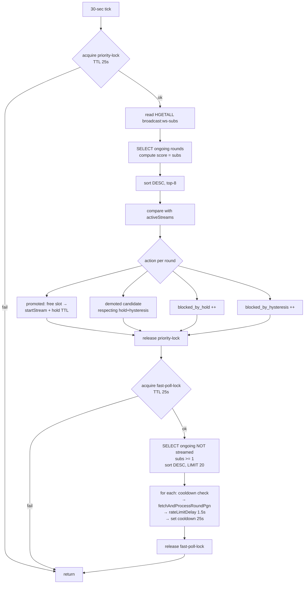

# ADR-157: broadcast-service — приоритизация 8 постоянных стримов по числу зрителей

**Статус:** Принято
**Дата:** 2026-07-06
**Задачи:** KS-4843 (этот ADR), KS-4832 → KS-4842 (диагностика и предыдущие правки)
**Связанные ADR:** [ADR-021](./021-broadcast-service-extraction.md), [ADR-155](./155-broadcast-lichess-token-and-pending-heal.md), [ADR-156](./156-broadcast-syncbroadcasts-quota-and-lock.md)
**Уточняет:** `MAX_CONCURRENT_STREAMS` (в ADR-156 упоминалось значение 50 — фактический документированный потолок Lichess = 8 для user-аккаунта)

## 1. Контекст

### 1.1. Установленный факт

Lichess документировал лимит одновременных broadcast-подписок на токен (changelog апрель 2026, коммит fbb6b38):

- **anon** = 4
- **user** = 8
- **verified** = 16

Наш аккаунт (`kingside-broadcast` из ADR-155 §2.1) — обычный `user` → потолок **8**. Верификация закрыта (только по инициативе Lichess). Обход через несколько аккаунтов — нарушение ToS, не рассматривается.

**Импликация.** В prod-БД типично 20–25 одновременно идущих раундов (`status='ongoing'`). Стрим-подписок может быть максимум 8. Оставшимся 12–17 ongoing раундам постоянный SSE-стрим недоступен — они опрашиваются PGN poll (round-robin).

### 1.2. Как есть сейчас (после ADR-155/ADR-156)

- `MAX_CONCURRENT_STREAMS` = 50 (переменная кода). Реально Lichess принимает только 8; попытки > 8 → 429 или преждевременный abort.
- Приоритет попадания в 8 стримов — «кто первый успел» (`syncBroadcasts` upsert порядок + phase 1 pinned fallback).
- Никакой связи с реальным пользовательским интересом (WS-подписки в `broadcast.gateway.ts`).
- Метрик активных WS-подписок per round — нет. Есть `metrics.incSubscribe(roundId)` — только counter subscribe-событий, не gauge актуальных подписчиков.
- Метрики исходящих запросов к Lichess (с разбивкой по endpoint/status) — нет.

### 1.3. Наблюдаемая проблема

- Раунд, на который смотрит 200 наших зрителей, может не иметь стрима (если 8 слотов заняты другими случайными раундами). Пользователь видит обновления через PGN poll с интервалом ~5 мин (round-robin из `MAX_PGN_POLLS=5` при 12–17 ongoing без стрима).
- Раунд без ни одного зрителя может занимать слот в 8 — впустую жжёт лимит Lichess и наши ресурсы.

### 1.4. Ограничения проекта

- Один разработчик, минимум внешних зависимостей.
- Multi-instance broadcast-service (Redis IO adapter в `broadcast.gateway.ts:52-54`) → приоритизация должна работать с распределённым состоянием.
- Prod-нагрузка ~500-1000 req/h к Lichess (после ADR-155), бюджет 8000 req/h (`LICHESS_API_TOKEN`).

## 2. Решение

### 2.1. `MAX_CONCURRENT_STREAMS = 8` (снижение с 50)

**Принято.** Явно ограничить количество одновременно активных `runStream()` до **8** (env `BROADCAST_MAX_STREAMS`, default 8).

Обоснование: физический потолок Lichess. Держать > 8 — бесполезная нагрузка на undici и лишние 429.

### 2.2. Критерий приоритета — активные WS-подписки на раунд

**Принято.** Приоритет раунда в очереди на стрим = **число активных WS-подписчиков** на комнату `broadcast:<roundId>` (агрегировано по всем репликам `broadcast-service`).

### 2.3. Как считать активные WS-подписки (multi-instance)

**Принято.** Общий Redis-hash `broadcast:ws-subs` — ключ `<roundId>` → значение integer (счётчик активных подписок).

**Механика:**

- В `broadcast.gateway.ts` `handleSubscribe(roundId)`: `await redis.hincrby('broadcast:ws-subs', roundId, +1)`.
- В `handleUnsubscribe(roundId)`: `await redis.hincrby('broadcast:ws-subs', roundId, -1)`.
- В `handleDisconnect(client)`: перед `disconnect` — итерировать `client.rooms` (socket.io), для каждой комнаты `broadcast:<X>` → `hincrby('broadcast:ws-subs', X, -1)`.
- Периодическая уборка (раз в 5 мин): `HSCAN`, удалить ключи с value ≤ 0 (защита от расхождений при крашах реплики).
- **Полный пересбор раз в 1 мин** (мягкая коррекция): каждый инстанс складывает `.rooms.get('broadcast:<roundId>').size` в свои локальные gauge (по всем ongoing раундам), Redis-хеш пересобирается через периодический SUM локальных gauge всех реплик. Реализация — тривиальная: раз в 60 сек каждая реплика делает `HINCRBY broadcast:ws-subs-shard:<instanceId> <roundId> <delta>` с TTL 90 сек, sync-service SUM-ит все шарды. Дрейф счётчиков между events выравнивается за минуту.

  **Упрощение:** если реализация полного пересбора выходит слишком сложной, backend может ограничиться событийным подсчётом (subscribe/unsubscribe/disconnect) с ежедневным reset хеша (в момент минимальной нагрузки, например в 04:00 UTC). Незначительный дрейф не критичен, потому что приоритизация оперирует относительными числами.

**Обоснование:** прямое чтение `.rooms` работает только per-instance; distributed адаптер socket.io не даёт cross-instance подсчёта в одном вызове. Собственный счётчик в Redis — минимальный и корректный.

### 2.4. Метрики (наблюдаемость)

**Принято.** Ввести четыре набора метрик.

**1. `broadcast_lichess_requests_total{endpoint,status}` — counter.**

- `endpoint` ∈ `{"broadcasts_list","round_metadata","round_pgn","round_stream_open","pending_metadata"}` (5 значений).
- `status` ∈ `{"200","400","401","404","429","5xx","timeout","abort","err"}` (низкая кардинальность).
- Инкремент в `lichessFetch()` (единая точка) на успех/ошибку/HTTP-код. Для `runStream()` — инкремент на open, дальше не пишем (стрим — не единичный запрос).
- Позволяет строить графики: сколько к Lichess ходим, куда, что отвечают.
- Общая кардинальность: 5 × 9 = 45 меток. Комфортно.

**2. `broadcast_ws_active_subscriptions{round}` — gauge.**

- Значение — из `HGETALL broadcast:ws-subs`, обновляется раз в 30 сек.
- Label `round` = `lichessRoundId` (человекочитаемый).
- Кардинальность управляемая: типично 20–30 одновременно ongoing; за сутки ~500–1000 разных значений. Prometheus справляется, ежесуточный `HDEL` неактивных ключей держит хеш и метрику компактными.
- Метка `round` удаляется при переходе раунда в `finished` (или через TTL 24 ч).

**3. `broadcast_stream_priority_changes_total{action}` — counter.**

- `action` ∈ `{"promoted","demoted","blocked_by_hold","blocked_by_hysteresis","no_slot"}`.
- Инкремент внутри цикла `evaluateStreamPriorities` (§2.6). Диагностика — сколько раз приоритизация реально что-то поменяла, сколько раз хотела, но защита не пустила.

**4. `broadcast_stream_evaluations_total` — counter, `broadcast_stream_evaluation_duration_seconds` — histogram.**

- Инкремент/observe на каждый вызов `evaluateStreamPriorities`. Диагностика длительности цикла.

**Плюс к уже принятому в ADR-156 §2.3:** `broadcast_streams_active` (gauge), `broadcast_streams_started_total{result}`, `broadcast_streams_ended_total{reason}`.

### 2.5. Гистерезис при выбивании существующего стрима

**Принято.** Претендент выбивает существующий стрим только при **соотношении зрителей ≥ 1.5×**.

Формально: раунд `A` (в топ-8) с `subs(A)` зрителей выбивается кандидатом `B` (не в топ-8) только если `subs(B) >= 1.5 × subs(A)` и `subs(B) >= 3` (минимум 3 зрителя — защита от «выбить пустой ради почти-пустого»).

**Обоснование значений:**

- **1.5×** — компромисс между отзывчивостью (важные новые раунды получают стрим быстро) и антитреп-защитой (колебания ±20% не переключают).
  - K = 1.1 — слишком чувствительно, шум переключает.
  - K = 1.3 — оставляет заметные скачки.
  - K = 1.5 — уверенная разница (20 vs 30 зрителей = реальный интерес).
  - K = 2.0 и выше — популярные новые раунды долго ждут, пока старые не разъедутся.
- **min subs(B) ≥ 3** — не переключаемся ради 2 зрителей на новый раунд, если 8-й слот держит раунд с 1 зрителем. Пока разница не значительная в абсолюте — не трогаем.

### 2.6. Минимальное время удержания стрима

**Принято.** Каждый запущенный стрим держится **не менее 10 минут** после `startStream()`, даже при просадке зрителей до 0.

**Обоснование:**

- Стартовый шум по зрителям (много кто подключается в первые минуты нового раунда, часть отваливается).
- 10 мин ≈ длительность 2–3 партий blitz — достаточно для показа осмысленного контента даже если раунд стал непопулярным.
- < 5 мин — переключения не даёт увидеть даже начало партии.
- > 20 мин — держим впустую при явной непопулярности.
- 10 мин — золотая середина.

**Реализация:** Redis-ключ `broadcast:stream-hold:<roundId>` с TTL 600 сек, устанавливается при `startStream(round)`. При проверке кандидата на demotion: если ключ есть → инкремент `blocked_by_hold`, пропуск. Ключ живёт независимо от активности стрима — если стрим по внутренним причинам оборвался и стартанул снова, hold refresh-ится.

**После истечения окна:** раунд участвует в приоритизации на общих основаниях. Если по-прежнему в топ-8 по зрителям — остаётся стримом (стрим не сбрасывается — hold только защищает от demotion, не форсит его). Если выпал из топ-8 и претендент проходит гистерезис — demotion разрешается.

### 2.7. Учащённый опрос для «выпавших с активными зрителями» (fast poll)

**Принято.** Раунды `ongoing`, не имеющие стрима, но имеющие активных зрителей (subs ≥ 1) — опрашиваются PGN poll с интервалом **30 сек** (fast poll) вместо стандартных 5 мин (round-robin из `MAX_PGN_POLLS=5` на 12–17 раундов).

**Механика:**

- Новый setInterval **30 сек** в `broadcast-sync.service.ts` — `runFastPollTick()`.
- Redis lock `broadcast:fast-poll:lock`, TTL 25 сек.
- SELECT ongoing раундов, для каждого: subs из Redis-хеша `broadcast:ws-subs`. Отобрать: `status='ongoing' AND NOT in activeStreams AND subs >= 1`.
- Сортировка: `subs DESC, updatedAt ASC`.
- Верхний потолок: `BROADCAST_MAX_FAST_POLLS=20` за тик (env, default 20). Больше — маловероятно (обычно ≤17 non-streamed).
- Cooldown между двумя fast polls одного `roundId` — **25 сек** (Redis-ключ `broadcast:fast-poll-cooldown:<roundId>`, TTL 25). Anti-flap, если tick короче 30 сек.
- Между запросами внутри тика — существующий `rateLimitDelay(1500 ms)`.

**Обоснование значений:**

- **30 сек** — компромисс между отзывчивостью (~10× быстрее round-robin) и нагрузкой.
  - 15 сек — избыточно (партия ходит не быстрее раза в 10–30 сек в blitz).
  - 60 сек — почти как обычный pinned poll, слабый выигрыш.
- **20 fast polls cap** — покрывает типичные 12–17 non-streamed раундов. Если превышено — сортировка по subs DESC выбирает 20 самых зрелищных.

**Оценка нагрузки в пике:**

- Fast poll: 20 × 2 (два тика в мин) = 40 req/min = **2400 req/h**.
- Существующая нагрузка (после ADR-155/156): pinned poll (300 req/h) + refresh non-top-20 (~600 req/h с квотой 50) + pending-heal (~600 req/h) + broadcasts list (12/h) + finished PGN (60/h) + stream reconnects (десятки) ≈ **~1600 req/h**.
- Итого: **~4000 req/h**, потолок токена 8000 req/h — запас 2×.

### 2.8. Обычный (slow) pinned poll для раундов без зрителей

**Принято.** Существующая логика pinned phase 1 сохраняется, но фильтруется: SELECT `status='ongoing' AND NOT in activeStreams AND subs = 0`. Это раунды без интереса — round-robin как сейчас (`BROADCAST_MAX_PGN_POLLS=5` за минутный тик).

**Обоснование:** если на раунд никто не смотрит, обновлять его каждые 30 сек — расход квоты Lichess без пользы для пользователя. Раз в 5 мин — достаточно, чтобы поймать финальные состояния партий для отображения на списке.

### 2.9. Цикл приоритизации `evaluateStreamPriorities`

**Принято.** Новая точка входа в `broadcast-sync.service.ts`, тик **30 сек** (совпадает с fast poll, чтобы решения о перестановках синхронизировались).

**Порядок:**

1. Redis lock `broadcast:stream-priority:lock`, TTL 25 сек.
2. Read `HGETALL broadcast:ws-subs` → Map<roundId, subs>.
3. SELECT `broadcast_rounds` `status='ongoing'` → rounds.
4. Для каждого round вычислить `score = subs[round.lichessRoundId] || 0`. Сортировка DESC.
5. Определить `targetTop8` = первые 8 по score (только с score > 0; если < 8 раундов с subs — оставшиеся слоты остаются свободными, `startStream` для них не форсим).
6. Read `activeStreams` (Map roundId → AbortController). Определить `currentSet`.
7. Действия:

   ```
   for round in targetTop8:
     if round NOT in currentSet AND activeStreams.size < 8:
       // свободный слот — просто стартовать
       startStream(round.id)
       set stream-hold TTL 600
       metric: priority_changes{action=promoted}++
     if round NOT in currentSet AND activeStreams.size >= 8:
       // нужно кого-то выбить
       find weakest = argmin(subs[c]) for c in currentSet
       if hold TTL active on weakest:
         metric: blocked_by_hold++, continue
       if subs[round] < 1.5 × subs[weakest] OR subs[round] < 3:
         metric: blocked_by_hysteresis++, continue
       abortStream(weakest)
       startStream(round.id)
       set stream-hold TTL 600 for round
       metric: demoted++ (for weakest), promoted++ (for round)

   for round in currentSet NOT in targetTop8:
     // не выбиваем, если сам просто выпал ниже топ-8, но новых претендентов нет
     // — hold защищает от гарантированного немедленного kill
     // Если появится претендент — обработается в первом цикле (см. выше)
     no action
   ```

8. Release lock.

**Обоснование, почему тик именно 30 сек:** совпадает с fast poll, чтобы состояние «кого стримим / кого fast-poll'им» согласованно обновлялось раз в 30 сек. Слишком часто (10 сек) — редкие изменения топ-8 не оправдывают частоту. Слишком редко (2 мин) — новый популярный раунд ждёт 2 мин до стрима.

### 2.10. Взаимодействие с уже принятыми механизмами

- **ADR-155 pending-heal → startStream (§2.4 ADR-156).** Pending-heal промотит round `pending → ongoing` и вызывает `startStream()`. При лимите 8 слотов эта попытка может вернуть `capacity_full` — метрика `blocked_by_no_slot++`, дальше решение о стриме принимает `evaluateStreamPriorities` в следующем тике. Если у промоушенного раунда есть подписчики — попадёт в fast poll, стрим появится когда/если в топ-8.

- **ADR-156 §2.5 fallback startStream в pinned phase 1.** Теперь избыточен для раундов, участвующих в приоритизации — `evaluateStreamPriorities` покрывает решение о стриме. Оставить для сценария «стартап процесса, `evaluateStreamPriorities` ещё не отработал». Дополнительный вред отсутствует — `startStream` идемпотентен и вернёт `capacity_full`, если слоты заняты; PGN poll — тоже полезный fallback.

- **ADR-156 §2.1 квота `refreshNonTop20`.** Не пересекается — работает в цикле `syncBroadcasts` (5 мин).

## 3. Что делает backend в KS-4832 (или отдельной задаче по этому ADR)

Точечный список для имплементации:

1. **`MAX_CONCURRENT_STREAMS`:**
   - Изменить default env `BROADCAST_MAX_STREAMS` с 50 на 8.
   - Обновить комментарий в `broadcast-sync.service.ts` со ссылкой на ADR-157 и Lichess changelog.

2. **Трэкинг WS-подписок в Redis (§2.3):**
   - В `broadcast.gateway.ts` handleSubscribe/handleUnsubscribe — `HINCRBY broadcast:ws-subs <roundId> ±1`.
   - В `handleDisconnect(client)` — итерировать `client.rooms` (все начинающиеся с `broadcast:`), DECR каждой.
   - Периодическая уборка: раз в 5 мин `HSCAN` → `HDEL` для ключей с value ≤ 0.
   - Ежесуточный reset хеша в 04:00 UTC (защита от кумулятивного дрейфа) — простой `DEL broadcast:ws-subs`, пересобирается на лету по событиям.

3. **Метрики (§2.4):**
   - `sync-metrics.ts` дополнить: counter `broadcast_lichess_requests_total`, gauge `broadcast_ws_active_subscriptions`, counter `broadcast_stream_priority_changes_total`, counter+histogram `broadcast_stream_evaluations_*`.
   - Инкремент counter `broadcast_lichess_requests_total` — единая точка в `lichessFetch()` и точка open в `runStream()`.
   - Gauge `broadcast_ws_active_subscriptions` обновляется в отдельном setInterval 30 сек: `HGETALL broadcast:ws-subs` → set label per round; при переходе раунда в `finished` — `gauge.remove({round})`.

4. **`runFastPollTick` (§2.7):**
   - Новый setInterval 30 сек в `broadcast-sync.service.ts`.
   - Redis lock `broadcast:fast-poll:lock` TTL 25 сек.
   - SELECT ongoing NOT in activeStreams с `subs >= 1`, сортировка `subs DESC, updatedAt ASC`, LIMIT `BROADCAST_MAX_FAST_POLLS`.
   - Для каждого: cooldown check `broadcast:fast-poll-cooldown:<roundId>` TTL 25 сек → `fetchAndProcessRoundPgn` → set cooldown.
   - Env: `BROADCAST_MAX_FAST_POLLS=20`, `BROADCAST_FAST_POLL_INTERVAL_MS=30000` (для тестов).

5. **`evaluateStreamPriorities` (§2.9):**
   - Новый setInterval 30 сек (или запуск из того же тика, что fast poll — фаза 0 перед fast poll).
   - Redis lock `broadcast:stream-priority:lock` TTL 25 сек.
   - Логика из §2.9 псевдокода.
   - `startStream()` должен возвращать `'ok' | 'capacity_full' | 'error'` (уже обсуждалось в ADR-156 §2.5).
   - `abortStream(roundId)`: вызвать `activeStreams.get(roundId)?.abort()`, удалить из Map. Metric `streams_ended_total{reason="demoted"}++` (новое значение label).

6. **Обновление hold TTL (§2.6):**
   - При `startStream()` вернувшем `'ok'` — `SET broadcast:stream-hold:<roundId> 1 EX 600`.
   - Проверка перед demotion — существование этого ключа.

7. **Slow pinned poll фильтр (§2.8):**
   - В существующем `syncPinnedBroadcasts` phase 1 SELECT добавить `AND (subs = 0 OR subs IS NULL)`. Раунды с зрителями обслуживает fast poll.

8. **`.env.example`:**
   - `BROADCAST_MAX_STREAMS=8`
   - `BROADCAST_MAX_FAST_POLLS=20`
   - `BROADCAST_FAST_POLL_INTERVAL_MS=30000`
   - `BROADCAST_STREAM_HYSTERESIS_RATIO=1.5`
   - `BROADCAST_STREAM_HOLD_SECONDS=600`

9. **Юнит-тесты:**
   - trackSubs: subscribe/unsubscribe/disconnect инкрементируют/декрементируют Redis-хеш.
   - evaluateStreamPriorities: (a) свободный слот → promoted; (b) 8 занято, претендент с 1.5× → demoted+promoted; (c) 8 занято, претендент с 1.4× → blocked_by_hysteresis; (d) hold TTL → blocked_by_hold; (e) без зрителей → no_slot.
   - fast poll: subs=0 не попадает; subs≥1 попадает; cap 20 соблюдается; cooldown работает.
   - slow pinned: subs=0 попадает, subs≥1 не попадает.

10. **Мониторинг после релиза (что смотреть):**
    - `broadcast_streams_active` gauge = 8 в пике (при ≥8 раундах с subs > 0), 0 при отсутствии интереса.
    - `broadcast_stream_priority_changes_total{action=promoted|demoted}` — 5–20 в час (не сотни, иначе трепание, тюнить K или hold).
    - `broadcast_lichess_requests_total{status="429"}` — не должно расти (наблюдаемо).
    - `broadcast_ws_active_subscriptions{round}` — top-8 должно соответствовать текущим стримам.

## 4. Оценка эффекта

| Метрика | До ADR-157 | После ADR-157 |
|---|---|---|
| Стрим-слоты, используемые впустую | до 8 (случайные раунды без зрителей) | ~0 (по интересу) |
| Задержка обновления самого популярного non-streamed раунда | ~5 мин (round-robin) | ≤ 30 сек (fast poll) |
| Задержка обновления новой партии на популярном раунде без стрима | ~5 мин | ≤ 30 сек |
| Задержка обновления раунда без зрителей | ~5 мин | ~5 мин (без изменений — незачем) |
| Трепание стримов между раундами | случайное | ограничено 10-мин hold + 1.5× hysteresis |
| Запросы к Lichess в пике | ~1600 req/h | ~4000 req/h (запас 2× до потолка) |
| Наблюдаемость: сколько идёт запросов к Lichess | 0 | counter по endpoint × status |
| Наблюдаемость: кто сколько зрителей | 0 | gauge per round |

## 5. Что НЕ делаем в этом ADR (риски, отложено)

1. **Верификация аккаунта у Lichess.** Закрыто (только по инициативе Lichess).
2. **Несколько технических аккаунтов Lichess.** Риск блокировки ToS — отдельная задача с уточнением у Lichess.
3. **Ротация состава 8 стримов по таймеру** (без учёта зрителей). Отклонено — даёт провалы даже на важных раундах.
4. **Полный отказ от стримов, только PGN poll.** Отклонено как регрессия — SSE даёт задержку < 1 сек vs 30 сек fast poll и 5 мин slow poll.
5. **Учёт «важности» раунда по признакам вне зрителей** (elo, top-турнир, тег `isPinned`). Отклонено — вводит субъективность и требует ручной настройки; зрители сами голосуют интересом. Может пересматриваться, если наблюдение покажет систематическое неоптимальное распределение.
6. **Приоритет по клиентскому «сейчас смотрю партию X, а не список»** (WS-подписка на страницу партии как более сильный сигнал). Отложено — сейчас все подписки `broadcast:subscribe` рассматриваются равнозначно. Возможно уточнение отдельно.

## 6. Диаграмма — единый 30-сек tick (Mermaid)



## 7. Ссылки

- Код: `apps/broadcast-service/src/sync/broadcast-sync.service.ts`, `apps/broadcast-service/src/http/broadcast.gateway.ts`, `apps/broadcast-service/src/metrics/metrics.service.ts`, `apps/broadcast-service/src/sync/sync-metrics.ts`.
- Lichess changelog (документированный лимит): `https://lichess.org/changelog` (апрель 2026, коммит fbb6b38).
- KS-4832 → KS-4842 — история диагностики.
- ADR-155 §2.1 — LICHESS_API_TOKEN, аккаунт `kingside-broadcast`.
- ADR-156 §2.3 — метрики стримов (базовые), §2.4–2.5 — pending-heal → startStream, phase 1 fallback.
