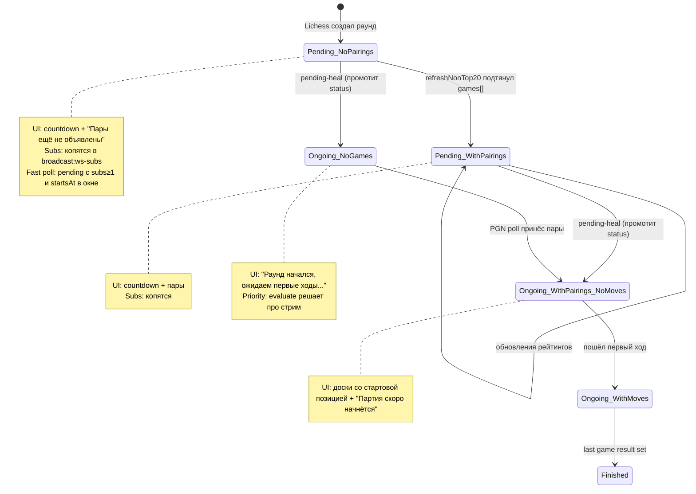

# ADR-158: broadcast-service — UX для не начавшихся раундов (пары, обратный отсчёт, ожидание первых ходов)

**Статус:** Принято
**Дата:** 2026-07-06
**Задачи:** KS-4844 (этот ADR)
**Связанные ADR:** [ADR-021](./021-broadcast-service-extraction.md), [ADR-155](./155-broadcast-lichess-token-and-pending-heal.md), [ADR-156](./156-broadcast-syncbroadcasts-quota-and-lock.md), [ADR-157](./157-broadcast-stream-priority-viewers.md)

## 1. Контекст

### 1.1. Наблюдение пользователя

При заходе на страницу раунда в статусе `pending` (`/broadcasts/:tourId/:roundId`) в UI пустое место: нет названий пар, нет обратного отсчёта до старта, нет никакой индикации что тут вообще ожидается. Единственный текст — `"No games in this round"` (i18n `broadcastRound.noGames`), который вводит в заблуждение.

### 1.2. Как следствие — не работает механика ADR-157

ADR-157 §2.2 предполагает, что зрители зайдут на раунд заранее и их WS-подписки накопятся в `broadcast:ws-subs`, дав раунду приоритет по стриму в момент старта. Сейчас на пустой странице зритель не задерживается → не подписывается → не даёт приоритет → раунд стартует без стрима и попадает в slow pinned poll (5 мин). ADR-157 без ADR-158 работает только на ретроспективных заходах, а не на предвкушающих.

### 1.3. Что уже есть в системе

**База данных (`packages/broadcasts-db/prisma/schema.prisma`):**
- `BroadcastRound.startsAt: DateTime?` — время старта. Пишется в `upsertRound` (строка 1674 broadcast-sync.service.ts) из поля `round.startsAt` ответа Lichess `/api/broadcast?nb=100`. Может быть `null`, если Lichess не отдал.
- `BroadcastRound.status`: `pending | ongoing | finished`.
- `BroadcastGame` — партии/пары. Поля `whitePlayer`, `blackPlayer`, `pgn`, `currentFen`, `whiteClockMs`, `blackClockMs`.

**Backend sync:**
- `upsertRound` пишет только `name`, `startsAt`, `status`, `tournamentType` — **пары не пишет**.
- `refreshNonTop20RoundStatuses` парсит `body.round.finished/ongoing` — **всё остальное игнорирует**.
- `fetchAndProcessRoundPgn` — для pending PGN обычно пуст (KS-2356 комментарий строка 1270). Партии/пары в `BroadcastGame` появляются только после `processPgnUpdate` (парсинг PGN headers `[White]`/`[Black]`).

**REST API:**
- `GET /broadcasts/:id/rounds` уже возвращает `startsAt` и `status`.
- `GET /broadcasts/:id/rounds/:roundId/games` для pending возвращает `{ data: [] }`.

**WebSocket gateway (`broadcast.gateway.ts`):**
- `handleSubscribe(roundId)` **не фильтрует по статусу** — подписаться можно на любой раунд, включая pending.
- Возвращает `broadcast:sync` с `games: []` для pending — payload есть, но пустой.

**Frontend (`BroadcastRoundPage.tsx`):**
- При `games.length === 0` рендерит `"No games in this round"`. Никаких других веток.
- REST-poll fallback 30 сек, если WS не подключён.

### 1.4. Что нужно решить

1. **Источник пар для pending раунда** — есть ли данные до старта на стороне Lichess, если да — как затянуть.
2. **Хранение пар** — использовать существующую `BroadcastGame` или новую таблицу.
3. **Frontend отображение** — countdown, пары, состояние ожидания первых ходов.
4. **Учёт WS-подписок pending раундов в `broadcast:ws-subs`** — проверить что механизм ADR-157 §2.3 покрывает pending.
5. **SEO/prerender** — pre-rendered HTML должен содержать пары и startsAt (label задачи включает `seo`).

## 2. Решение

### 2.1. Источник пар: расширить парсинг `/api/broadcast/-/-/{roundId}`

**Принято.** Для получения пар до старта раунда — расширить парсинг эндпоинта `/api/broadcast/-/-/{roundId}`, который сейчас читает только `round.finished/ongoing`.

**Что Lichess отдаёт в этом ответе (документация Lichess Broadcast API):**

```json
{
  "tour": { ... },
  "round": {
    "id": "...",
    "name": "...",
    "startsAt": 1728480000000,
    "finished": false,
    "ongoing": false,
    "url": "https://lichess.org/broadcast/..."
  },
  "study": {
    "writeable": false
  },
  "games": [
    {
      "id": "...",
      "name": "Player A - Player B",
      "fen": "rnbqkbnr/...",
      "players": [
        { "name": "Player A", "title": "GM", "rating": 2750 },
        { "name": "Player B", "title": "GM", "rating": 2720 }
      ],
      "check": null,
      "lastMove": null,
      "status": "created"
    }
  ]
}
```

Для pending раунда с созданной сеткой Lichess отдаёт массив `games` с полями `players[]` (пары), без PGN и без ходов. Ключ `status: "created"` (или отсутствует) — партия ещё не началась.

**Механика (backend):**

1. Расширить парсинг ответа в `refreshNonTop20RoundStatuses` (строки 1838-1843) — читать также `body.games?: LichessRoundGame[]`.
2. Для каждой game из ответа делать `upsert BroadcastGame`:
   - `roundId` — id нашего раунда
   - `whitePlayer` — `game.players[0].name`
   - `blackPlayer` — `game.players[1].name`
   - `whiteElo` — `game.players[0].rating || null`
   - `blackElo` — `game.players[1].rating || null`
   - `currentFen` — `game.fen || STARTING_FEN`
   - `pgn` — `null` (партия не началась)
   - `result` — `null`
   - `whiteClockMs` / `blackClockMs` — `null` (клоки появятся когда пойдут часы)
   - `lichessGameId` — `game.id` (для связи с Lichess)
3. **Uniqueness key** для upsert: `(roundId, lichessGameId)`. Если такой пары уже нет в БД — INSERT; если есть с pgn=null — UPDATE полей players (Lichess может поправить состав до старта); если есть с pgn≠null — не трогаем (партия уже начата, PGN — источник истины).

**Обоснование:**
- Данные о парах уже приходят от Lichess в metadata-ответе — расширение парсинга дешевле, чем отдельный endpoint или отдельный тянущий цикл.
- Пары не меняются часто → достаточно частоты `refreshNonTop20RoundStatuses` (в рамках ADR-156 §2.1 — квота 50/цикл, полный обход БД ~2 часа). Дополнительно — `syncBroadcasts` для top-20 (upsertRound строка 1670-1686 — там тоже нужно расширить, чтобы top-20 broadcasts получали пары сразу).
- `upsertRound` для top-20 (строка 1670) сейчас парсит только базовые поля round; расширяется симметрично: если в исходном `LichessBroadcast.rounds[i]` есть `games[]` — upsert их. Если нет (Lichess не отдал в общем listing) — только полагаемся на `refreshNonTop20RoundStatuses`.

**Дополнение (для полноты):** метадата `/api/broadcast/-/-/{roundId}` может не содержать `games` вовсе, если TDs не создали сетку заранее. Тогда пары появятся только после старта (через PGN). Это допустимая деградация: countdown работает, пары появляются позже.

### 2.2. Хранение пар: расширить `BroadcastGame` (без новой таблицы)

**Принято.** Использовать существующую модель `BroadcastGame` для хранения пар до старта. Добавить (если нет) поле `lichessGameId String?` — идентификатор партии на Lichess (для стабильного uniqueness key). Добавить `whiteElo Int?`, `blackElo Int?` — рейтинги игроков.

**Обоснование:**

- **Простота:** один источник данных для UI (пары / партии до старта / партии в процессе / завершённые). Frontend уже читает `/rounds/:roundId/games` — расширение поля `pgn=null` покроет случай «пары без ходов».
- Не плодит миграцию отдельной таблицы `BroadcastPairing` и логику её мержа с `BroadcastGame` при старте партии.
- `BroadcastGame` уже допускает `pgn` nullable, `currentFen` дефолтится в STARTING_FEN — семантика «партия существует, ходов нет» вписывается естественно.
- **Инвариант для frontend:** «партия с `pgn=null` и `result=null` — не началась (или начата, но ходы не пришли)». Не путать с завершённой ничьёй (там `result="1/2-1/2"`).

**Миграция схемы (Prisma):**

```prisma
model BroadcastGame {
  ...
  lichessGameId String? @map("lichess_game_id")   // NEW
  whiteElo      Int?    @map("white_elo")          // NEW
  blackElo      Int?    @map("black_elo")          // NEW
  ...
  @@unique([roundId, lichessGameId], map: "broadcast_games_round_lichess_game_id_key")   // NEW
}
```

Существующие партии — `lichessGameId=null` (backfill по PGN опционально в отдельной задаче).

### 2.3. REST API — расширение ответа `/rounds/:roundId/games`

**Принято.** Ответ `GET /broadcasts/:id/rounds/:roundId/games` для pending раунда возвращает пары как обычные game-entities с признаками:

```json
{
  "data": [
    {
      "id": "uuid-in-our-db",
      "gameIndex": 0,
      "fen": "rnbqkbnr/...",
      "whitePlayer": "Player A",
      "blackPlayer": "Player B",
      "whiteElo": 2750,
      "blackElo": 2720,
      "result": null,
      "pgn": null,
      "whiteClockMs": null,
      "blackClockMs": null,
      "clockUpdatedAt": null,
      "lastMoveAt": null
    }
  ]
}
```

**Изменения в контроллере (`broadcast.controller.ts`):**
- Добавить `whiteElo`, `blackElo` в `BroadcastGameSummary` (тип из `packages/shared/types/api-contracts.ts` — синхронизировать).
- Убрать (если есть) фильтр `WHERE pgn IS NOT NULL` — сейчас его нет, разведка это подтверждает.

**Дедупликация `deduplicateGamesByPair` (KS-2213):** сохраняется, так как pairings приходят с уникальным `lichessGameId` — не должны создавать дубли.

**Обоснование:** frontend уже умеет рендерить массив games; расширение — только два новых поля рейтингов. Никаких новых endpoint'ов.

### 2.4. Frontend — компоненты и состояния

Frontend (frontend-агент реализует, не в scope архитектора-код) должен покрыть три состояния страницы раунда `BroadcastRoundPage.tsx`:

#### 2.4.1. Состояние A: `status='pending'` — раунд не начался

**Условие:** `round.status === 'pending'`.

**UI компоненты:**

1. **Countdown до старта** — по `round.startsAt`. Прогрессивная детализация:
   - `startsAt = null` → «Время старта не объявлено».
   - `startsAt` > NOW + 24 ч → «Начало: 8 июля 2026, 14:00» (локальное время браузера, i18n).
   - `startsAt` в интервале [NOW + 1 ч, NOW + 24 ч] → «Через 15 ч 20 мин», обновляется раз в 5 мин.
   - `startsAt` в интервале [NOW + 5 мин, NOW + 1 ч] → «Через 45 мин», обновляется раз в 30 сек.
   - `startsAt` в интервале [NOW, NOW + 5 мин] → «Через 04:32», обновляется раз в 1 сек.
   - `startsAt` в прошлом (задержка старта) → «Раунд должен был начаться в 14:00. Ожидаем начало…».
   - Формат обоснован: не тратим CPU на ежесекундный ре-рендер за 3 часа до старта.

2. **Список пар** — рендерятся `games[]` из `/rounds/:roundId/games`:
   - Если массив пуст (Lichess не отдал пары) → «Пары ещё не объявлены».
   - Если массив непуст → карточки пар: `Player A (2750) vs Player B (2720)`. Клик по карточке — как обычно (переход к партии, если она start-ит).

3. **Индикатор состояния:** бейдж «Скоро в эфире» / «Upcoming».

#### 2.4.2. Состояние B: `status='ongoing'` + `games.length === 0`

**Условие:** `round.status === 'ongoing' AND games.length === 0`. Возникает в узком окне: pending-heal (ADR-155) промотит status → `ongoing`, но `refreshNonTop20RoundStatuses` ещё не проставил пары, а PGN стрим/poll ещё не принёс ходы.

**UI:** «Раунд начался, ожидаем первые ходы…» + spinner (небольшой, не блокирующий).

**Автоматическое обновление:** через WS-подписку (получаем `broadcast:sync` когда backend получит первые данные) или через существующий REST-poll 30 сек.

#### 2.4.3. Состояние C: `status='ongoing'` + `games.length > 0`

**Условие:** обычное состояние. Рендерится как сейчас.

Изменение: если `pgn === null` и `result === null` (партия ещё не пошла, но пары есть) — рендерить доску в стартовой позиции с плашкой «Партия скоро начнётся» вместо hookup к движку. Клоки не показывать, если `whiteClockMs === null`.

### 2.5. Взаимодействие с ADR-157 — учёт подписок pending раундов

**Принято.** Механизм ADR-157 §2.3 (`HINCRBY broadcast:ws-subs <roundId> ±1` в `handleSubscribe`/`handleUnsubscribe`/`handleDisconnect`) **работает для всех статусов**, включая pending. Это подтверждено разведкой: `broadcast.gateway.ts:141` вызывает `client.join('broadcast:<roundId>')` без проверки статуса.

**Что нужно проверить в реализации ADR-157:**

- `handleSubscribe` — HINCRBY выполняется до/после `client.join`, независимо от того, вернёт ли БД запись раунда или нет. Разведка ADR-157 §3 п.2 корректно описывает: инкремент по факту события subscribe.
- `evaluateStreamPriorities` (ADR-157 §2.9) — SELECT `status='ongoing'` — pending раунды не участвуют в топ-8 стримов. Это корректно: стрим на pending раунд нельзя открыть (PGN пуст, SSE закроется). Но подписки накапливаются в `broadcast:ws-subs`, и как только раунд переходит в `ongoing` (через pending-heal ADR-155), следующий тик `evaluateStreamPriorities` увидит его с высоким score → startStream.

**Оценка задержки промоушен → стрим:**

- Pending-heal (ADR-155, 1 мин): promotion `pending → ongoing` в течение ≤ 60 сек после `round.ongoing=true` на стороне Lichess.
- Pending-heal вызывает `startStream()` (ADR-156 §2.4) — если есть слот из 8, стрим стартует сразу.
- Если слоты заняты — `evaluateStreamPriorities` (ADR-157, 30 сек) увидит претендента с накопленными подписками. При `subs(new) ≥ 1.5 × subs(weakest)` и hold истёк — abort weakest + start new.
- **Итого:** ≤ 60 сек до promotion + ≤ 30 сек до priority-evaluate = **≤ 90 сек** от начала раунда на Lichess до появления SSE-стрима у нас, если у раунда достаточно накопленных подписок.

### 2.6. Fast poll для pending раундов с зрителями

**Принято.** ADR-157 §2.7 fast poll (30 сек) сейчас фильтрует `status='ongoing' AND NOT in activeStreams AND subs >= 1`. Расширить: **добавить в fast poll pending раунды с зрителями, у которых `startsAt <= NOW() + 15 min`** — по симметрии с pending-heal (ADR-155 §2.4.2 окно).

Что fast poll делает для pending раунда:
- Вместо PGN poll (который пуст для pending) — вызвать `refreshOneRoundMetadata(lichessRoundId)` — тот же вызов `/api/broadcast/-/-/{roundId}`, что делает `refreshNonTop20RoundStatuses`, но для одного раунда. Обновит `status` (если Lichess уже говорит `ongoing`) + подтянет `games[]` (пары).
- Если `metadata.round.ongoing === true` — promotion + `startStream()` (как в pending-heal).

**Обоснование:** зрители, ждущие старта, получают низкую задержку обнаружения старта (30 сек fast poll вместо 60 сек pending-heal). Это ценно для «мы за 30 сек до старта, ждём».

**Приоритет в fast poll:** сначала ongoing без стрима, потом pending близкие к старту (в пределах общей квоты `BROADCAST_MAX_FAST_POLLS=20`).

### 2.7. SEO / prerender

**Принято.** Prerender-модуль (`apps/broadcast-service/src/prerender/`) должен генерировать HTML для страницы раунда, содержащий:

1. **Название раунда** (уже есть — SSR берёт из `/rounds`).
2. **Список пар** (новое) — если `games[]` непуст, вставить в HTML `<div class="broadcast-pairings">`. Читать из БД напрямую (у prerender есть доступ к Prisma).
3. **startsAt в человеко-читаемом виде** (`<time datetime="ISO8601">8 июля 2026, 14:00 UTC</time>`) — новое.
4. **Метадата OpenGraph/Twitter:** `og:title`, `og:description` расширить — упомянуть имена игроков (первые 2 пары) и время старта. Для SEO — заголовок вида «Round 15: Carlsen–Nakamura, Nepomniachtchi–Firouzja | GCT Croatia 2026».

**Обоснование:**

- Задача помечена `seo` — Google должен уметь индексировать анонс раунда.
- Пары в pre-rendered HTML → ссылки на раунд появляются в результатах поиска с составами игроков.
- Изменения в prerender-логике — тривиальные (доп. поля в шаблоне).

Prerender-инвалидация (когда HTML пересобрать):
- При изменении `BroadcastRound.status` (pending → ongoing → finished) — уже есть.
- При изменении `games[]` в раунде (новая пара, обновились рейтинги) — вероятно нужно добавить триггер (сейчас prerender инвалидируется по updatedAt раунда). Проверить и, при отсутствии, добавить.

## 3. Что делают backend и frontend по этому ADR

### 3.1. Backend (KS-4832 или новая задача)

1. **Prisma миграция:**
   - `BroadcastGame` + поля `lichessGameId String?`, `whiteElo Int?`, `blackElo Int?`.
   - Unique index `(roundId, lichessGameId)`.

2. **Расширить парсинг Lichess metadata:**
   - `refreshNonTop20RoundStatuses` (строки 1838-1843) — читать `body.games?[]`, для каждой — upsert `BroadcastGame` с `pgn=null`, `players[0/1]` в `whitePlayer/blackPlayer`, рейтинги в `whiteElo/blackElo`, `game.fen` в `currentFen`.
   - `upsertRound` (строка 1670) для top-20 — тот же парсинг из `LichessRound.games?[]` (расширить интерфейс `LichessRound` — добавить `games?: LichessRoundGame[]`).
   - При upsert: если существует BroadcastGame с этим `lichessGameId` и `pgn IS NOT NULL` — не трогать (PGN уже источник истины).

3. **Fast poll для pending (§2.6):**
   - В `runFastPollTick` (ADR-157 §2.7) расширить SELECT: добавить `OR (status='pending' AND subs >= 1 AND startsAt <= NOW() + INTERVAL '15 min')`.
   - Для pending раундов вызывать `refreshOneRoundMetadata(lichessRoundId)` вместо `fetchAndProcessRoundPgn`. Это тот же fetch к `/api/broadcast/-/-/{roundId}`, тот же парсинг status+games (§2.1).

4. **REST API:**
   - `BroadcastGameSummary` в `packages/shared/types/api-contracts.ts` — добавить `whiteElo?: number | null`, `blackElo?: number | null`.
   - `broadcast.controller.ts` `GET /:id/rounds/:roundId/games` — пробросить новые поля.

5. **Тесты:**
   - Юнит: парсинг metadata с `games[]` → upsert BroadcastGame; повторный парсинг не создаёт дубли (uniqueness).
   - Юнит: `pgn NOT NULL` защищает от перезаписи players из metadata (PGN — источник истины после старта).
   - Юнит: fast poll подхватывает pending раунд с subs≥1 и startsAt в окне.

6. **`.env.example`** — без новых переменных (значения зашиты в §2.4/2.6, при желании конфигурируется в отдельной задаче).

### 3.2. Frontend (frontend/layout — по scope)

1. **Компонент `<RoundCountdown startsAt={ISO} />`** (§2.4.1):
   - Прогрессивная детализация как в §2.4.1.
   - `useEffect` с интервалом, зависящим от текущего расстояния до startsAt.
   - i18n ключи `broadcastRound.countdown.*`.

2. **Расширить `BroadcastRoundPage.tsx`:**
   - Ветка `status='pending'` → рендер `<RoundCountdown>` + список пар (если games.length > 0) + «Пары ещё не объявлены» (если games.length === 0).
   - Ветка `status='ongoing' AND games.length===0` → «Раунд начался, ожидаем первые ходы…» + spinner.
   - Ветка `status='ongoing' AND games[i].pgn === null AND games[i].result === null` → доска в стартовой позиции с «Партия скоро начнётся», клоки не показывать.
   - Существующая ветка `games.length > 0 AND есть ходы` — как есть.

3. **Отрисовка пары в списке:**
   - `<PairingCard whitePlayer whiteElo blackPlayer blackElo />` — карточка. Клик → переход к партии (даже если pgn=null) — страница партии сама покажет доску с стартовой позицией + «ожидаем начало».

4. **WS подписка:**
   - Существующая логика `broadcastApi WS subscribe` уже подписывается на любой roundId. Не менять.
   - Убедиться что `handleSync` корректно обрабатывает `games: []` и `games` c `pgn=null` без ошибок парсинга.

5. **i18n ключи:**
   - `broadcastRound.pending.pairingsNotAnnounced` — «Пары ещё не объявлены».
   - `broadcastRound.pending.awaitingStart` — «Ожидаем начало…».
   - `broadcastRound.ongoing.awaitingFirstMoves` — «Раунд начался, ожидаем первые ходы…».
   - `broadcastRound.game.awaitingStart` — «Партия скоро начнётся».
   - `broadcastRound.countdown.days` / `hours` / `minutes` / `seconds` — формы.
   - `broadcastRound.countdown.notScheduled` — «Время старта не объявлено».
   - `broadcastRound.countdown.overdue` — «Раунд должен был начаться в {time}. Ожидаем начало…».
   - Все ключи — `en` + `ru` (проект уже настроен i18next).

### 3.3. Prerender / SEO (backend или SEO-агент)

1. Шаблон prerender для страницы раунда — вставить `<div class="broadcast-pairings">` из `BroadcastGame` для этого раунда, `<time datetime="...">` для startsAt.
2. Расширить `og:title`/`og:description` — упомянуть первые 2 пары + startsAt.
3. Триггер инвалидации prerender при изменении `BroadcastGame` в этом раунде (проверить и добавить, если нет).

## 4. Диаграмма — жизненный цикл раунда с UX (Mermaid)



## 5. Оценка эффекта

| Метрика | До ADR-158 | После ADR-158 |
|---|---|---|
| UX на pending раунде | пусто, "No games in this round" | countdown + пары + бейдж |
| Мотивация зрителя ждать | нет | есть (видит с кем играет, сколько ждать) |
| Накопление подписок на pending | 0 (не задерживается) | ~ проектная (задача ADR-157 закрывается) |
| Задержка «начался раунд → SSE-стрим» для популярных pending | 5 мин + случайность | ≤ 90 сек (60 сек pending-heal + 30 сек priority-evaluate) |
| SEO-контент на странице раунда до старта | пусто | пары + время старта (индексируется) |
| Запросы к Lichess (fast poll pending) | 0 | до 5 pending × 2 в мин = 10 req/min = 600 req/h (в пике) |

**Итог по req/h:** после ADR-155/156/157 было ~4000/h. Расширение на pending fast poll добавляет ~600/h → ~4600/h. Потолок 8000 → запас ~2× сохраняется.

## 6. Что НЕ делаем в этом ADR (риски и отложенное)

1. **Отдельная таблица `BroadcastPairing`.** Отклонено — `BroadcastGame` с `pgn=null` покрывает.
2. **Live обновление рейтингов игроков** (через отдельный источник). Отклонено — рейтинги на момент раунда, из Lichess metadata, достаточно.
3. **Live обновление составов** (замены игроков после начала раунда). Отклонено — PGN становится источником истины при `pgn≠null`, замены отражаются в PGN headers `[White]/[Black]`.
4. **Push-уведомления «раунд начинается»** (браузерные / email). Отложено, отдельная задача — требует UX-решения и подтверждений.
5. **Кнопка «Напомнить о старте»**. Отложено, отдельная задача.
6. **Backfill `lichessGameId` для существующих партий.** Не в scope — партии со старой схемой продолжают работать (uniqueness key not applicable для null lichessGameId, existing PGN-парсинг находит их по (roundId, gameIndex)).
7. **Индикатор «этот раунд стримится» vs «этот раунд опрашивается»** в UI. Отклонено — семантически лишнее для пользователя (главное чтобы ходы обновлялись).

## 7. Ссылки

- Код: `apps/broadcast-service/src/sync/broadcast-sync.service.ts`, `apps/broadcast-service/src/http/broadcast.gateway.ts`, `apps/broadcast-service/src/http/broadcast.controller.ts`, `apps/web/src/pages/BroadcastRoundPage.tsx`, `packages/broadcasts-db/prisma/schema.prisma`, `packages/shared/types/api-contracts.ts`, `apps/broadcast-service/src/prerender/*`.
- Lichess Broadcast API (документация): `https://lichess.org/api#tag/Broadcasts`.
- ADR-021 — базовое разбиение broadcast-service.
- ADR-155 §2.4 — pending-heal (промоушен pending → ongoing).
- ADR-156 §2.1 — квота `refreshNonTop20RoundStatuses`, куда встраивается парсинг games.
- ADR-157 §2.3 (трэкинг подписок), §2.7 (fast poll), §2.9 (priority-evaluate).
