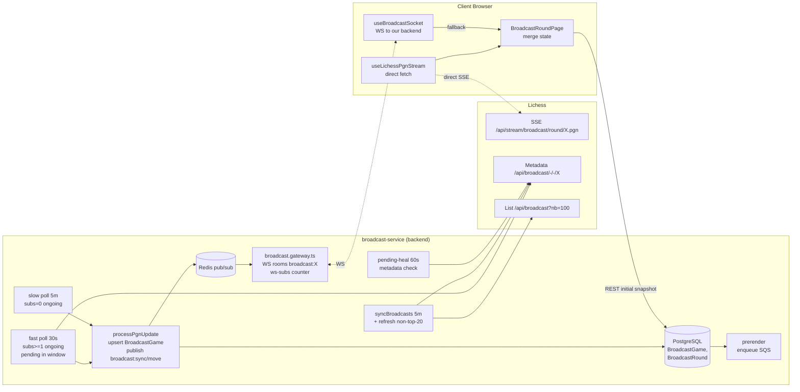

# ADR-159: broadcast-service — перенос SSE-стрима трансляций Lichess на клиента

**Статус:** Предложено
**Дата:** 2026-07-06
**Задачи:** KS-4854 (этот ADR)
**Связанные ADR:** [ADR-021](./021-broadcast-service-extraction.md), [ADR-155](./155-broadcast-lichess-token-and-pending-heal.md), [ADR-156](./156-broadcast-syncbroadcasts-quota-and-lock.md), [ADR-157](./157-broadcast-stream-priority-viewers.md), [ADR-158](./158-broadcast-pending-round-ux.md)
**Пересматривает:** ADR-157 (упраздняет §2.1 `MAX_CONCURRENT_STREAMS=8`, §2.5 гистерезис, §2.6 hold, §2.9 evaluateStreamPriorities). ADR-156 §2.4/§2.5 (startStream в pending-heal / phase 1). ADR-155/156 части, касающиеся `runStream()`.

## 1. Контекст

### 1.1. Установленный факт (сверка 2026-07-06 ~19:35 UTC)

```
GET https://lichess.org/api/stream/broadcast/round/{lichessRoundId}.pgn
→ HTTP/2 200
→ access-control-allow-origin: *
→ content-type: application/x-chess-pgn
```

Endpoint отдаёт нарастающий PGN бесконечным потоком. CORS открыт для любого origin, аутентификация не требуется. **Браузер любого посетителя может открыть это соединение напрямую из JS через `fetch()` c `ReadableStream`.**

Лимит Lichess **8 одновременных broadcast-стримов** (ADR-157 §1.1) применяется **по IP токена/сессии**, не по аккаунту. Наш broadcast-service открывает стримы с единственного public IP → упирается в 8 → 12–17 остальных ongoing раундов остаются без live-обновлений и обслуживаются fast/slow PGN-poll'ом (5 мин или 30 сек, ADR-157 §2.7).

У каждого посетителя свой IP. Если поток читается в его браузере — потолок 8 практически неисчерпаем: 200 посетителей на 200 разных IP × 3–4 вкладки = 600–800 параллельных SSE, распределённых по 200 адресам, каждый в своих 8.

### 1.2. Что сейчас делает `runStream()` (broadcast-sync.service.ts:2704-2790)

1. Открывает fetch к `/api/stream/broadcast/round/{lichessRoundId}.pgn` через undici.
2. Читает нарастающий PGN, делит по `\n\n\n` разделителям, для каждого куска вызывает `processPgnUpdate(roundId, pgn)`.
3. `processPgnUpdate` (строки 2792-3142):
   - парсит PGN через `parsePgnGames()`;
   - upsert'ит `BroadcastGame` по `(roundId, lichessGameId)` — `currentFen`, `whiteClockMs`, `blackClockMs`, `clockUpdatedAt`, `lastMoveAt`, `result`, `pgn`;
   - при обнаружении нового final result — помечает флаг `standingsCacheNeedsInvalidate`, в конце DELETE'ит `broadcast_standings`;
   - публикует в Redis `broadcast:move` (строка 3039) — `{roundId, gameIndex, uci, fen, whitePlayer, blackPlayer, lastMoveAt, id}`;
   - публикует `broadcast:sync` (строка 3101) — полный снимок раунда с `games[]`.
4. `broadcast.gateway.ts` (`subRedis`) слушает оба канала и раздаёт клиентам в комнате `broadcast:{ourRoundUuid}` через WS-события `broadcast:move` / `broadcast:sync`.

Клиент (`useBroadcastSocket`) читает эти WS-события и обновляет UI.

### 1.3. Стоимость текущей архитектуры

Из ADR-155/156/157 наблюдаемо:
- шторм переподключений при рестарте (десятки–сотни попыток при потолке 8 → 429);
- утечки сокетов в undici pool (`ETIMEDOUT` из-за наложенных циклов, ADR-156 §1.1);
- задержка 5–30 мин на промоушен `pending → ongoing` для не приоритетных раундов (ADR-155 §1.3);
- сложность из ADR-157 §2.9 — evaluateStreamPriorities с гистерезисом, hold TTL, шардированным подсчётом WS-подписок — существует только чтобы правильно распределить 8 слотов между реальным интересом;
- невозможность подхватить свежие ходы на непопулярных раундах быстрее 5 мин.

Все эти сложности — следствие борьбы за узкое горло 8. Устранение горла упрощает архитектуру.

### 1.4. Что нельзя терять при переходе

1. **БД как источник правды для страниц без активных посетителей.** Первый заход на раунд, prerender для SEO, история завершённых партий, crosstable/standings — читаются из `BroadcastGame` / `BroadcastRound`. Если БД не обновляется, prerender отдаёт устаревший HTML, страница «раунд» на первом фрейме показывает старое состояние до подключения клиента к Lichess.
2. **Инвалидация `broadcast_standings`** при новом final result (KS-2723) — сейчас триггерится в `processPgnUpdate`.
3. **Извлечение `Variant` из PGN header** (KS-2780) — сейчас в `processPgnUpdate`, влияет на фильтрацию broadcast'ов из списка.
4. **Извлечение `lichessGameId`** из PGN — стабильный ключ для `(roundId, lichessGameId)`.
5. **Персистентность полного PGN** для истории и «поделиться партией».
6. **Клоки** (`whiteClockMs`, `blackClockMs`, `clockUpdatedAt`) — источник для frontend отсчёта (KS-2699, KS-2720).
7. **Крестовая таблица** (`broadcast:crosstable`, ADR-023) — считается на бэкенде из `BroadcastGame.result`.

### 1.5. Ограничения проекта

- Один разработчик, минимум внешних сервисов.
- Prod-БД `broadcasts_kingside`, деплой — `apps/broadcast-service` под `broadcasts.kingside.site`.
- Multi-instance ready (RedisIoAdapter в socket.io).

## 2. Решение

### 2.1. Разделение ролей

Живой SSE-стрим PGN — **читает браузер посетителя**, напрямую с Lichess. Наш backend больше не открывает `runStream()`.

БД остаётся источником правды. Её обновление — **периодический PGN-poll на бэкенде** (single-round polling), с частотой, зависящей от интереса (число активных WS-подписок). Никаких постоянных SSE от нашего IP.

| Роль | Кто делает | Как часто |
|---|---|---|
| Метаданные broadcasts (список, статусы, `startsAt`) | backend (`syncBroadcasts`, 5 мин) | без изменений |
| Пары до старта (`BroadcastGame` с `pgn=null`) | backend (metadata parse, ADR-158 §2.1) | без изменений |
| Промоушен `pending → ongoing` | backend (pending-heal, ADR-155) | без изменений (60 сек) |
| Свежий PGN для БД (ongoing раунды с зрителями) | backend (fast poll, ADR-157 §2.7 адаптирован) | 30 сек |
| Свежий PGN для БД (ongoing раунды без зрителей) | backend (slow poll, ADR-157 §2.8) | 5 мин |
| Живой SSE поток для UI посетителя | **клиент, `fetch` к Lichess** | continuous, per-tab |
| Уведомление посетителей об изменении состояния (fallback, если direct-stream не работает) | backend через WS `broadcast:sync` | по факту записи в БД |
| Crosstable, standings, история | backend | без изменений |
| Prerender / SEO | backend, читает из БД | без изменений |

### 2.2. Клиент: прямой PGN-стрим к Lichess

**Принято.** В `apps/web/src/pages/BroadcastRoundPage.tsx` (или в хук `useLichessPgnStream`) — открытие соединения:

```ts
const res = await fetch(
  `https://lichess.org/api/stream/broadcast/round/${lichessRoundId}.pgn`,
  { signal: abortController.signal }
);
const reader = res.body.getReader();
const decoder = new TextDecoder();
let buffer = '';
while (true) {
  const { value, done } = await reader.read();
  if (done) break;
  buffer += decoder.decode(value, { stream: true });
  // разделитель между кумулятивными PGN snapshot'ами — `\n\n\n`
  const chunks = buffer.split('\n\n\n');
  buffer = chunks.pop() ?? '';
  for (const chunk of chunks) {
    handlePgnChunk(chunk);
  }
}
```

`handlePgnChunk`: парсит PGN на клиенте (переиспользовать логику из `pgn-parser.ts`; вынести в `packages/shared/pgn-stream/` или в отдельный npm-модуль внутри монорепо), извлекает `games[]` со всеми полями (fen, uci, clocks, result), обновляет локальный state.

**Обоснование:**
- `EventSource` не подходит: Lichess отдаёт `application/x-chess-pgn`, не `text/event-stream`.
- `fetch` с `ReadableStream` поддерживается всеми браузерами, которые проект уже требует (React 19 предполагает современные браузеры).
- `AbortController` даёт корректное закрытие при уходе со страницы / смене раунда.

**Retry-политика (клиент):**

- При обрыве (`fetch` reject / stream closed до `round finished`) — экспоненциальный backoff: 2s → 5s → 15s → 30s → 60s (потолок).
- После 5 неуспешных попыток — переход в **fallback-режим** (см. §2.4).
- При переходе страницы в фон (`document.visibilityState === 'hidden'`) — закрыть стрим (экономия ресурсов клиента и слотов на IP посетителя). При возврате — переоткрыть.

**Первичная отрисовка (до открытия стрима):**

- Изначальный снимок партий — из REST `/broadcasts/:id/rounds/:roundId/games` (уже есть, отдаёт `BroadcastGameSummary[]` из БД).
- Как только направший стрим начинает отдавать данные — снимок из БД заменяется на клиентский, но не «перезатирается» до первого валидного chunk'а.

### 2.3. Backend: PGN-poll вместо `runStream()`

**Принято.**

1. **Удалить** `runStream()`, `activeStreams` Map, watchdog переоткрытия стримов, stream rotation каждые 10 мин.
2. **Удалить** `evaluateStreamPriorities` (ADR-157 §2.9), `startStream()` return-signature, hold-TTL, гистерезис (ADR-157 §2.5/§2.6).
3. **Оставить** и переосмыслить `runFastPollTick` (ADR-157 §2.7): теперь это **основной канал обновления БД** для активно смотримых раундов.
   - Фильтр: `status='ongoing' AND subs >= 1`. Все ongoing раунды с активными зрителями поллятся.
   - Частота: **30 сек** (без изменений).
   - Верхний потолок: `BROADCAST_MAX_FAST_POLLS=25` (поднять с 20 — в БД теперь может быть до 25 popular раундов одновременно, все обслуживаются backend'ом).
4. **Оставить** slow pinned poll (ADR-157 §2.8): `status='ongoing' AND subs=0` → 5 мин. Для непопулярных — не жжём квоту.
5. **Механизм записи**: `processPgnUpdate` **сохраняется полностью**. Только источник вызова меняется: не из `runStream()`, а из fast/slow poll (там уже вызывается `fetchAndProcessRoundPgn` → `processPgnUpdate`).

**Оценка нагрузки на Lichess после перехода:**

- Fast poll: 25 × 2/мин = 50 req/min = **3000 req/h**.
- Slow poll: до 5 non-popular × 60/ч = **300 req/h** (ADR-157 §2.8).
- `syncBroadcasts` (5 мин цикл + refresh non-top-20 с квотой 50): ~800 req/h (без изменений).
- Pending-heal: до 600 req/h (без изменений).
- **Итого backend → Lichess: ~4700 req/h** при 25 popular ongoing раундах. Потолок токена 8000 req/h (ADR-155) → запас ~1.7×.

Плюс — прямые SSE от клиентов на Lichess. Их лимит per-IP (8), нашего IP не касаются.

**Обоснование, почему 30 сек fast poll хватает для БД:**

- SEO/prerender не требуют секундной свежести (Google refresh раз в часы).
- Первичная отрисовка при заходе клиента — краткое окно ≤ 30 сек до подключения к его direct-stream, а после — клиент опережает БД.
- Для клиента в fallback-режиме 30 сек — приемлемая деградация (сравнимо со стандартным polling в других платформах).

### 2.4. Аварийная деградация клиента

**Принято.** Три уровня деградации.

**Уровень 0 (норма):** direct SSE к Lichess работает. UI обновляется мгновенно.

**Уровень 1 (обрыв direct-stream, сеть/CORS/блокировка):**
- Клиент **всегда** держит открытым WS к нашему `broadcast.gateway.ts` (`broadcast:subscribe`) — это делается уже сейчас для получения обновлений и учёта подписки в `broadcast:ws-subs` (ADR-157 §2.3).
- Как только клиент теряет direct-stream и переходит в fallback: продолжает получать `broadcast:sync` от нашего WS. Backend публикует эти события в результате fast poll (`processPgnUpdate` → publish `broadcast:sync` — механизм сохраняется).
- Задержка обновления в fallback: ≤ 30 сек (fast poll).
- UI-индикатор: небольшая плашка «Замедленное обновление» (i18n `broadcastRound.slowMode`). Не блокирующая.

**Уровень 2 (нет ни direct-stream, ни WS):**
- Клиент падает на REST-poll `/rounds/:roundId/games` каждые 30 сек (существующий fallback в `useBroadcastSocket`).
- Индикатор «Оффлайн-режим». Клоки останавливаются.

**Переход между уровнями:**
- Автоматический. При восстановлении direct-stream — сразу возвращаемся к уровню 0, WS остаётся открытым как страховка.
- WS никогда не закрывается по инициативе клиента (кроме unmount) — он также источник событий за пределами PGN-потока (например `broadcast:round_status_changed`, если такое понадобится в будущем).

### 2.5. Модель данных

**Принято. `BroadcastGame` остаётся в БД. Клиент только «опережает» БД во времени.**

Не переносим состояние на клиента. Причины:

1. **SEO/prerender.** ADR-158 §2.7 требует, чтобы pre-rendered HTML содержал состав пар, время старта, а для завершённых партий — их результаты. Prerender модуль (`prerender-enqueue.service.ts`) читает из БД напрямую; переход на клиентское хранение потребовал бы либо кэша на бэкенде (эквивалентно БД), либо ежесуточной пересборки prerender на новых данных (не решает real-time SEO). Дешевле — 30-сек poll в БД.

2. **Первичная отрисовка / первый посетитель.** При заходе на страницу раунда клиент рендерит стартовый снимок из REST `/rounds/:roundId/games` (сейчас так и работает). Без БД — либо ждать 3–15 сек, пока `fetch` к Lichess отдаст первый PGN chunk (плохой TTFB), либо вставлять пустую доску (регрессия UX).

3. **Crosstable/standings.** Считаются агрегированно из `BroadcastGame.result` по всем раундам broadcast'а. Клиент видит только один раунд — не может дать данные для агрегации.

4. **История завершённых раундов.** Раунд `finished` — уже давно нет активных клиентов, потока с Lichess тоже нет. Только БД.

5. **Триггеры инвалидации** (`broadcast_standings`, `broadcast_crosstable`) — работают на бэкенде в `processPgnUpdate`. Перенос на клиента = веб-запросы клиента к бэкенду для триггеров → сложность и доверие.

Итого: клиент — **потребитель** свежих данных для UX, **не источник** для БД. Backend продолжает быть источником, только с более экономным способом чтения (30-сек poll вместо постоянного SSE).

### 2.6. Идентификация `lichessRoundId`

**Принято.** Расширить REST-контракт.

Сейчас `BroadcastGameSummary` содержит `lichessGameId` (per-game). Клиенту для открытия SSE-потока раунда нужен **`lichessRoundId`** (per-round). Он есть в БД (`BroadcastRound.lichessRoundId`), но не выведен в API-контракт `BroadcastRoundSummary`.

Изменения:
- `packages/shared/types/api-contracts.ts`: в `BroadcastRoundSummary` (тип возвращаемого элемента `GET /:id/rounds`) добавить `lichessRoundId: string`.
- `apps/broadcast-service/src/http/broadcast.controller.ts`: пробросить поле из `BroadcastRound.lichessRoundId`.
- Frontend `useBroadcastRound` / `BroadcastRoundPage.tsx` — читать `round.lichessRoundId` и передавать в `useLichessPgnStream(lichessRoundId)`.

### 2.7. Счётчики зрителей (пересмотр ADR-157 §2.3)

**Принято.** Механика WS-счётчика `broadcast:ws-subs` **сохраняется полностью**. Меняется её роль:

- **Раньше (ADR-157):** приоритет для распределения 8 SSE-слотов backend'а.
- **Теперь:** приоритет для **fast poll vs slow poll** (§2.3). Раунд с ≥1 подписчиком → fast poll (30 сек). Без подписчиков → slow poll (5 мин).
- Аналитика популярности (сколько зрителей на раунде) сохраняется как есть.
- Ежесуточный reset (04:00 UTC) и уборка (5 мин) — как в ADR-157 §2.3.

Логика `evaluateStreamPriorities`, hold-TTL, гистерезис 1.5× — **упраздняются**. Причина: они существовали для решения задачи «кого стримить в 8 слотах», а теперь стримов нет.

### 2.8. Что происходит с текущими механизмами

| Механизм | Судьба | Где определён |
|---|---|---|
| `LICHESS_API_TOKEN` | Остаётся, роль без изменений (лимит req/h для poll'ов) | ADR-155 §2.1 |
| `syncBroadcasts` (5 мин) | Без изменений | ADR-155/156 |
| `refreshNonTop20RoundStatuses` квота 50 | Без изменений | ADR-156 §2.1 |
| `SYNC_LOCK_TTL=600s` | Без изменений | ADR-156 §2.2 |
| Метрика `broadcast_streams_active` gauge | Останется как gauge=0 или **удалить** (стримов нет) | ADR-156 §2.3 |
| Метрика `broadcast_streams_started_total` | **Удалить** | ADR-156 §2.3 |
| Метрика `broadcast_streams_ended_total` | **Удалить** | ADR-156 §2.3 |
| Метрика `broadcast_stream_duration_seconds` | **Удалить** | ADR-156 §2.3 |
| Метрика `broadcast_lichess_requests_total{endpoint,status}` | Остаётся | ADR-157 §2.4 |
| Метрика `broadcast_ws_active_subscriptions{round}` | Остаётся | ADR-157 §2.4 |
| Метрика `broadcast_stream_priority_changes_total` | **Удалить** | ADR-157 §2.4 |
| Метрика `broadcast_stream_evaluations_*` | **Удалить** | ADR-157 §2.4 |
| Pending-heal metadata poll (`pending → ongoing`) | Без изменений (метadata остаётся точным сигналом) | ADR-155 §2.4 |
| Pending-heal → startStream | **Удалить вызов `startStream`** (промоушен status остаётся) | ADR-156 §2.4 |
| Phase 1 fallback `startStream` в pinned poll | **Удалить** | ADR-156 §2.5 |
| Fast poll 30 сек (`runFastPollTick`) | **Остаётся, становится основным** каналом обновления БД для активных раундов | ADR-157 §2.7 |
| Fast poll для pending раундов | Остаётся (metadata refresh, ADR-158 §2.6) | ADR-158 §2.6 |
| Slow pinned poll 5 мин для subs=0 | Без изменений | ADR-157 §2.8 |
| `MAX_CONCURRENT_STREAMS`, `BROADCAST_STREAM_HYSTERESIS_RATIO`, `BROADCAST_STREAM_HOLD_SECONDS` | **Удалить env-переменные** | ADR-157 §2.1/§2.5/§2.6 |
| `startStream()`, `abortStream()`, `runStream()`, `activeStreams` Map, `stream-hold` Redis key | **Удалить код** | ADR-155/156/157 |
| `evaluateStreamPriorities` тик | **Удалить** | ADR-157 §2.9 |
| `broadcast:ws-subs` Redis-хеш | Без изменений (роль см. §2.7) | ADR-157 §2.3 |
| `processPgnUpdate` (upsert games, publish `broadcast:move`/`sync`, invalidate standings) | Без изменений | broadcast-sync.service.ts:2792-3142 |
| `broadcast.gateway.ts` (subscribe/unsubscribe/room events) | Без изменений (WS остаётся, играет роль fallback-канала) | broadcast.gateway.ts |
| Prerender-модуль | Без изменений (читает из БД) | prerender-enqueue.service.ts |

### 2.9. SEO / prerender

**Принято.** Prerender **не меняется**. Он и раньше читал из БД, БД и раньше обновлялась `processPgnUpdate`. Механизм записи в БД теперь другой (fast poll вместо runStream), но точка вызова `processPgnUpdate` та же — все существующие invariants сохраняются.

Свежесть данных для prerender:
- Popular ongoing раунды: до 30 сек (fast poll).
- Не popular ongoing: до 5 мин (slow poll).
- Finished: как только Lichess отдал последний PGN chunk в очередном poll'е — обновляется, дальше меняться не может.
- Pending: пары / рейтинги / startsAt — refresh через `refreshNonTop20RoundStatuses` (ADR-156 §2.1), полный обход ~2 часа. Раунды с subs≥1 — fast poll metadata (ADR-158 §2.6, 30 сек).

Для целей SEO (Google refresh раз в часы/дни) — свежесть до 5 мин на не popular раундах избыточна.

### 2.10. Наблюдаемость (что смотреть после релиза)

Новые метрики:

1. **`broadcast_lichess_requests_total{endpoint,status}`** — уже есть (ADR-157 §2.4). После перехода: `endpoint="round_stream_open"` должен упасть в 0 (стримов больше не открываем). `endpoint="round_pgn"` вырастет.
2. **`broadcast_direct_stream_clients_total{result}`** (новая, `result ∈ {opened, closed_ok, closed_error, fallback_used}`) — считать на бэкенде через новый REST endpoint `POST /broadcasts/telemetry/direct-stream` (клиент шлёт beacon при open/close). Опциональная метрика, поднимает наблюдение за успешностью direct-stream в клиентской среде. Реализация — отдельной задачей после внедрения, чтобы не блокировать основной переход.
3. **Frontend метрика `broadcast_client_stream_lag_ms`** (клиентская, если у проекта есть web-vitals endpoint) — разница между `lastMoveAt` из stream и `now()` на клиенте. Показывает end-to-end latency direct-stream.

Что смотреть в первую неделю:
- `broadcast_lichess_requests_total{endpoint="round_stream_open"}` → 0.
- `broadcast_lichess_requests_total{endpoint="round_pgn"}` → рост ~5× (был fallback poll, стал основной).
- `broadcast_lichess_requests_total{status="429"}` → не должен расти. При росте: снизить `BROADCAST_MAX_FAST_POLLS` с 25.
- `broadcast_sync_cycles_total{kind=full,result=ok}` → без просадки (~12/ч).
- Опросить нескольких пользователей: работает ли direct-stream (F12 → Network → фильтр `lichess.org`).

## 3. Что делают backend и frontend по этому ADR

### 3.1. Backend

1. **Удалить runStream-инфраструктуру:**
   - `runStream()`, `startStream()`, `abortStream()` в `broadcast-sync.service.ts`.
   - `activeStreams` Map, `stream-hold` Redis ключи, `broadcast:stream-priority:lock`.
   - `evaluateStreamPriorities` тик.
   - Env-переменные `BROADCAST_MAX_STREAMS`, `BROADCAST_STREAM_HYSTERESIS_RATIO`, `BROADCAST_STREAM_HOLD_SECONDS`.
   - Метрики `broadcast_streams_*`, `broadcast_stream_priority_changes_total`, `broadcast_stream_evaluations_*`.

2. **Адаптировать pending-heal (ADR-155/156):**
   - Убрать вызов `startStream()` после `UPDATE status='ongoing'`. Промоушен status и метрика `promoted++` — сохраняются.
   - Отменить пересмотр ADR-156 §2.4 (возвращаемся к ADR-155 §2.4.5 в части «не запускать стрим» — но по другой причине: стримов больше нет вообще).

3. **Fast poll (ADR-157 §2.7):**
   - Оставить, поднять `BROADCAST_MAX_FAST_POLLS` с 20 до 25.
   - Убрать зависимость от `activeStreams` в SELECT-фильтре: теперь **все** ongoing с `subs≥1` идут в fast poll (раньше — только `NOT in activeStreams`).
   - Fast poll для pending с subs≥1 (ADR-158 §2.6) — без изменений.

4. **Slow pinned poll (ADR-157 §2.8):**
   - Оставить. SELECT-фильтр упрощается: `status='ongoing' AND subs=0`.

5. **REST API `BroadcastRoundSummary`:**
   - `packages/shared/types/api-contracts.ts`: добавить `lichessRoundId: string`.
   - `broadcast.controller.ts` `GET /:id/rounds` — пробросить поле.

6. **Опциональный telemetry endpoint (§2.10, отдельная задача, не блокирует основной переход):**
   - `POST /broadcasts/telemetry/direct-stream` — принимает `{event: 'opened'|'closed_ok'|'closed_error'|'fallback_used', lichessRoundId, error?}`.
   - Инкрементирует `broadcast_direct_stream_clients_total{result}`.
   - Rate-limit 1 req/sec per client IP (защита от спама).

7. **Тесты:**
   - Юнит: fast poll работает без activeStreams state.
   - Юнит: pending-heal не вызывает startStream.
   - Юнит: `BroadcastRoundSummary` содержит `lichessRoundId`.

### 3.2. Frontend

1. **Новый хук `useLichessPgnStream(lichessRoundId)` в `apps/web/src/hooks/`:**
   - Открывает `fetch` c `ReadableStream` (см. §2.2).
   - Парсит PGN на клиенте (использовать общую логику из `packages/shared/pgn-stream/` — вынести из `apps/broadcast-service/src/sync/pgn-parser.ts` в общий пакет, чтобы backend и frontend делили).
   - Retry policy (§2.2).
   - Автоматическое закрытие при `document.visibilityState='hidden'`.
   - Возвращает `{games: BroadcastGameSummary[], status: 'connecting'|'streaming'|'fallback'|'offline', error?}`.

2. **Расширить `BroadcastRoundPage.tsx`:**
   - При `round.status === 'ongoing'` — запускать `useLichessPgnStream(round.lichessRoundId)`.
   - Merge стратегия: изначальный `games` из REST → как только `useLichessPgnStream` отдал первый chunk, переключаемся на его данные. Merge per-game по `lichessGameId`: клиентские данные приоритетнее для полей `currentFen`/`clocks`/`lastMoveAt`, серверные — для полей `bracketStage`/`matchScore` (не приходят с Lichess).
   - При `status='fallback'` — плашка `broadcastRound.slowMode` (i18n).
   - При `status='offline'` — плашка `broadcastRound.offline`.
   - При `status='streaming'` — без плашки.
   - WS `broadcast:sync`/`broadcast:move` продолжают приниматься **всегда** — если direct stream не отдаёт данные, WS-события применяются к state. Если direct stream активен, WS-события можно игнорировать (или использовать как sanity check).

3. **Общий PGN-парсер:**
   - Вынести `pgn-parser.ts` (backend) → в `packages/shared/pgn-stream/` или новый `packages/pgn-parser/`.
   - Backend импортирует оттуда (без изменения поведения).
   - Frontend импортирует оттуда (новый потребитель).

4. **i18n:**
   - `broadcastRound.slowMode` — «Обновления замедлены, живой поток недоступен».
   - `broadcastRound.offline` — «Нет связи с сервером трансляций».

5. **Тесты:**
   - Юнит для `useLichessPgnStream`: mock fetch stream, проверка парсинга chunks, retry, abort.
   - Юнит на merge стратегию: клиентские данные приоритетнее для fen/clocks, серверные — для bracket-полей.

### 3.3. Prerender / SEO

Изменений нет. Prerender-модуль читает из БД, БД обновляется fast/slow poll'ом с частотой ≤ 5 мин.

## 4. Диаграмма — итоговая архитектура (Mermaid)



## 5. Оценка эффекта

| Показатель | До ADR-159 (ADR-155/156/157) | После ADR-159 |
|---|---|---|
| SSE-стримов от нашего IP к Lichess | 8 (потолок) | 0 |
| Задержка обновления для клиента на popular раунде | 0–30 сек (SSE, если попал в 8) / 30 сек (fast poll, если не попал) | 0–2 сек (direct SSE клиент → Lichess) |
| Задержка обновления для клиента на непопулярном раунде | 5 мин | 0–2 сек (direct SSE клиент → Lichess) |
| Задержка БД для popular раундов | 0 (SSE в 8) / 30 сек (fast poll) | 30 сек (fast poll) |
| Задержка БД для непопулярных ongoing | 5 мин | 5 мин (без изменений) |
| Сложность backend (LOC вокруг stream) | ~1500 строк (runStream, priorityEval, hold, hysteresis) | ~200 строк (fast/slow poll остаётся) |
| Наблюдаемость направо (сколько ходов у клиента) | нет | опциональный beacon |
| Возможность масштабировать на 100+ ongoing раундов | нет (потолок 8) | да (лимит только у backend по req/h; direct stream не наш IP) |
| Уязвимость к отзыву CORS `*` на Lichess | нет | есть (см. §6) |
| Уязвимость к отзыву API-токена (429) | средняя (8 SSE + poll) | ниже (только poll, 4700/h из 8000/h) |

## 6. Что НЕ делаем, риски, отложенное

1. **Не переносим состояние партий на клиента.** БД остаётся источником правды. Причины в §2.5.

2. **Не доверяем клиенту как publisher'у для БД.** Не рассматривали схему «первый клиент шлёт нашему серверу апдейты из своего direct-stream» — доверие/подделка/зависимость от одного клиента.

3. **Не убираем WS gateway.** WS остаётся как fallback + канал будущих событий (round_status_changed и т.д.).

4. **Не добавляем разделение WS-канала на «критичные» и «PGN».** Клиенты в норме игнорируют `broadcast:move`/`broadcast:sync` (получают direct), но подписка нужна для попадания в `broadcast:ws-subs`. Можно оптимизировать позже (клиент говорит серверу «я в direct-mode, PGN события не шли», сервер экономит трафик) — отдельная задача, малый выигрыш при 200 клиентах.

5. **Не гарантируем работу direct-stream во всех клиентах.** Возможные помехи: корп-firewall блокирует lichess.org; Content-Security-Policy на нашем домене должен разрешать `connect-src https://lichess.org` — **проверить и добавить в CSP header/tag**; браузерные расширения (privacy) блокируют сторонние fetch. Все эти сценарии обслуживаются fallback-режимом (§2.4 уровень 1/2).

6. **Риск: Lichess убирает CORS `*` или закрывает /stream/broadcast для не-owner origin.** Мониторинг: `broadcast_direct_stream_clients_total{result="closed_error"}` — при массовом росте фиксируем регрессию у Lichess. Реакция — откатить деплой обратно на серверные стримы (rollback plan §7).

7. **Риск: Lichess вводит per-Origin лимит вместо per-IP.** Если все наши клиенты будут ходить с одного `Origin: kingside.site` и Lichess начнёт по нему лимитировать — мы снова упираемся в 8, но уже без backend'а как альтернативы. Смягчение: убедиться (мониторингом), что Lichess лимитирует по IP, а не по Origin. Если по Origin — добавить назад серверный fallback (`runStream()`) для 8 popular раундов; в этом случае ADR-157 частично возвращается.

8. **Не занимаемся протоколом sync между вкладками одного клиента.** Если пользователь открыл 3 вкладки на 3 раунда — 3 direct fetch'а, свой лимит клиента (8) не превышается. Если 10 вкладок на 10 раундов — упрётся в 8 у клиента; вкладки 9-10 упадут в fallback. Приемлемо.

9. **Не меняем формат `broadcast:sync` payload** — совместимость с fallback-путём.

10. **Автотесты Playwright с direct-stream:** e2e-сценарии, где qa открывает страницу и ждёт хода — сейчас через WS `broadcast:sync`. После перехода они увидят ход из direct-stream быстрее. Тесты не сломаются, но их таймауты можно ужесточить. Отдельная задача qa, не блокирует переход.

11. **Rollback plan:** Возврат на `runStream()` — вернуть код (git revert соответствующих коммитов) + перевесить env-флаг feature-toggle. Ввести `BROADCAST_DIRECT_STREAM_ENABLED` (default `true` после релиза, `false` — старая логика с серверными стримами). Клиент: если сервер вернул флаг `false` в `/rounds` ответе или в WS handshake — не открывает direct fetch, полагается на WS `broadcast:sync` как раньше. Держим этот флаг в коде минимум 4 недели после стабилизации.

## 7. План поэтапного внедрения

Внедрение по частям, каждая фаза — отдельная задача с проверкой:

1. **KS-X (backend):** вынос `pgn-parser` в общий пакет, добавление `lichessRoundId` в `BroadcastRoundSummary`. Без функциональных изменений.
2. **KS-Y (frontend):** реализация `useLichessPgnStream` за feature-флагом `BROADCAST_DIRECT_STREAM_ENABLED` (default `false`). Проверка на dev-стенде с включённым флагом: dev-агент проходит по нескольким ongoing раундам, убеждается что direct-stream открывается, парсит PGN, доставляет ходы; проверяются все три уровня деградации (§2.4) — принудительным блоком fetch на `lichess.org` в devtools.
3. **KS-Z (backend + frontend):** релиз direct-stream за флагом `true` для всех пользователей. Мониторинг метрик из §2.10 в первую неделю. Feature-флаг остаётся в коде как страховка отката (см. §6 п.11).
4. **KS-W (backend):** через 2–4 недели стабильной работы после KS-Z — удаление `runStream()` и связанных механизмов, перевод fast poll на роль единственного канала записи БД. Публикация deprecation-note в комментариях кода. Feature-флаг из §6 п.11 удаляется вместе со старой веткой.
5. **KS-V (backend, отложено):** telemetry endpoint для beacon от клиента (§2.10 п.2). Не обязателен для первого релиза.

## 8. Ссылки

- Код: `apps/broadcast-service/src/sync/broadcast-sync.service.ts` (runStream 2704-2790, processPgnUpdate 2792-3142), `apps/broadcast-service/src/http/broadcast.gateway.ts`, `apps/broadcast-service/src/http/broadcast.controller.ts`, `apps/broadcast-service/src/sync/pgn-parser.ts`, `apps/web/src/pages/BroadcastRoundPage.tsx`, `apps/web/src/hooks/useBroadcastSocket.ts`, `packages/shared/types/api-contracts.ts`.
- Lichess Broadcast API: `https://lichess.org/api#tag/Broadcasts`.
- Lichess changelog про лимит 8 (ADR-157 §1.1).
- ADR-021 — базовое разбиение broadcast-service.
- ADR-155 — LICHESS_API_TOKEN, pending-heal.
- ADR-156 — квота refreshNonTop20, SYNC_LOCK_TTL, метрики стримов (частично упраздняются).
- ADR-157 — приоритизация 8 стримов (упраздняется в стрим-части, счётчики зрителей сохраняются с другой ролью).
- ADR-158 — UX pending раундов, парсинг пар из metadata.
- KS-4854 — эта задача.
