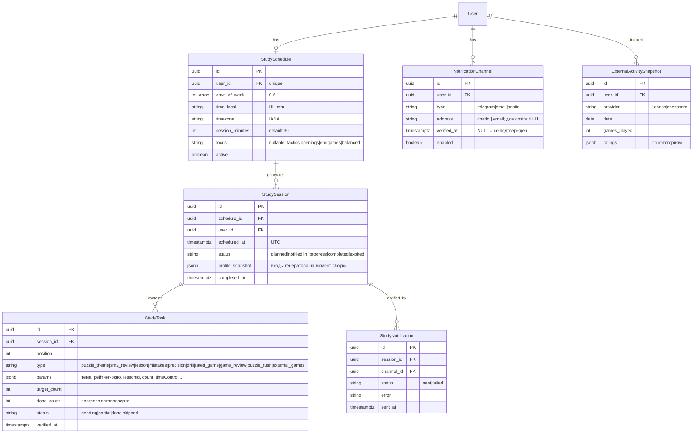
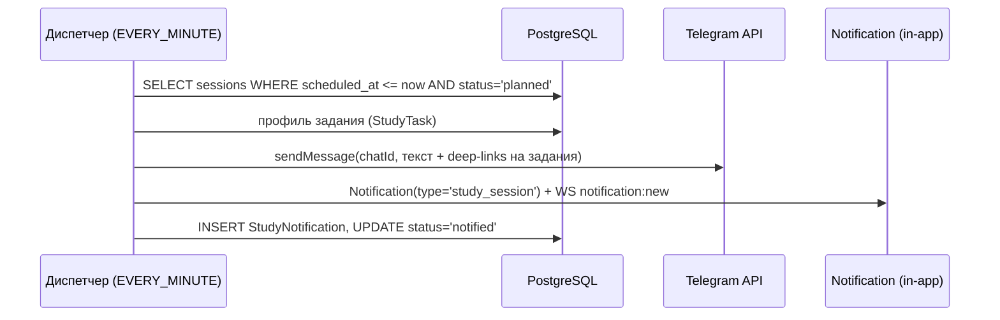

# ADR-160: Планирование шахматных занятий (план от платформы + расписание + уведомления + контроль прогресса)

**Дата:** 2026-07-11
**Статус:** Предложено
**Задача:** KS-4879
**Связанные ADR:** 024 (lessons-module), 025 (lessons-sm2), 026 (user-courses), 064 (lichess-board-api)
**Связанные документы:** docs/architecture/lessons-module.md, docs/architecture/lessons-roadmap.md

---

## 1. Контекст

Ученику нужна регулярность. Идея функции: ученик указывает только удобное время и частоту (каждый день / N раз в неделю), а **содержание занятий формирует платформа** — с учётом уровня и прогресса. В назначенное время ученик получает уведомление с конкретными заданиями в выбранный канал (Telegram, почта, on-site). Платформа проверяет выполнение по внутренней статистике и по привязанным аккаунтам lichess/chess.com и корректирует дальнейший план.

Ограничения проекта: один разработчик, ограниченный сервер. Решения ниже переиспользуют существующие механизмы (`@nestjs/schedule` + Redis-lock, прямые HTTP-вызовы Telegram API, модель `Notification`) и не вводят новую инфраструктуру в фазе 1 (без BullMQ, без отдельного worker-контейнера, без SMTP на старте).

### 1.1 Инвентаризация: что уже есть и пригодно как «задание»

| Активность | Модуль / модели | Параметризуемость | Автопроверка выполнения |
|---|---|---|---|
| Пазлы | `puzzle/`; `Puzzle`, `PuzzleAttempt`, `PuzzleRatingSnapshot` | темы (`themes`), рейтинг ± окно, количество | `PuzzleAttempt` за период (solved/total) |
| Пазл дня | `puzzle/daily-puzzle.controller.ts`; `DailyPuzzle` | нет (один на день) | `PuzzleAttempt` по `puzzleId` дня |
| Puzzle Rush | `puzzle-rush/`; `PuzzleRushScore` | timeMode, целевой score | `PuzzleRushScore` за период |
| Работа над ошибками | `puzzle/mistakes.module.ts`; `UserMistake` | темы из дневника ошибок | уменьшение открытых `UserMistake` / attempts |
| «Точность» (critical-moment) | `tactic-puzzle/`; `TacticPuzzleAttempt`, `UserTacticRating` | сложность Maia, количество | `TacticPuzzleAttempt` за период |
| Precision (vs движок) | `precision/`; `PrecisionAttempt`, `UserPrecisionRating` | количество, целевые звёзды | `PrecisionAttempt` за период |
| Дриллы (+спринт) | `tactic-drill/`; `TacticDrillAttempt`, `TacticDrillSprintScore` | тип дрилла, количество | attempts/score за период |
| Уроки / курсы | `lessons/`; `Course`, `Lesson`, `UserCourseProgress`, `UserLessonProgress` | конкретный урок активного курса | `UserLessonProgress.completedAt` |
| SM-2 повторения | `lessons/sm2.scheduler.ts`; `LessonReview` (`dueAt`) | просроченные повторения | сдвиг `dueAt`/`repetitions` |
| Дебютный тренажёр | `opening-trainer/`; `OpeningRepertoire`, `OpeningLineProgress` | репертуар, число линий | `OpeningTrainerAttempt`, `OpeningLineProgress` |
| Guess-the-move | `guess/`; `GuessSession` | количество партий | `GuessSession` за период |
| Слепая доска | `blind-board/`; `BlindBoardSession` | уровень | `BlindBoardSession` за период |
| Рейтинговые партии | `game/`; `Game`, `RatingHistory` | контроль времени, количество | `Game` за период; счётчики `User.gamesPlayed*` |
| Разбор своей партии | `analysis/`, `GameReport` | партия из последних сыгранных | `GameReport`/`GameAnalysis` за период |
| Партии на lichess/chess.com | `workshop/external-chess.service.ts`; `User.lichessUsername`, `User.chesscomUsername` | количество партий | публичные API (см. §5) |

Итого: 14+ типов активностей, у каждой уже есть модель попыток/прогресса — задания проверяемы без ручного подтверждения.

Существующие заделы для доставки и планирования:
- `@nestjs/schedule` подключён глобально; образцы cron: `sm2.scheduler.ts` (ежедневный, Redis-lock `SET NX EX`; в нём прямо помечено «уведомления вынесены в отдельную задачу»), `tactic-drill-sprint.scheduler.ts` (`EVERY_MINUTE`).
- Telegram: `User.telegramId` (login-widget), исходящая отправка через `fetch api.telegram.org` уже есть в `feedback.service.ts`. Библиотека бота не нужна.
- In-app уведомления: `Notification` + WS `notification:new` + `NotificationDropdown`.
- Email: инфраструктуры НЕТ (ни SMTP, ни nodemailer) — только фаза 2.

## 2. Алгоритм построения плана платформой

### 2.1 Профиль ученика (входы)

Собирается на лету из существующих данных, отдельного «уровня» не вводим:
- **Сила:** `User.ratingPuzzle`, `ratingBullet/Blitz/Rapid/Classical`, `UserTacticRating`, `UserPrecisionRating`.
- **Слабые темы:** `GET /puzzles/stats/themes` (успешность по темам) + открытые `UserMistake` (`themes[]`).
- **Теория:** активный курс (`UserCourseProgress.currentLessonId`), просроченные `LessonReview.dueAt` (SM-2).
- **Активность:** attempts/games за последние 7/30 дней (внутренние + внешние снапшоты, §5).
- **Дисциплина:** доля выполненных занятий за последние N сессий (из собственных данных функции).

### 2.2 Состав занятия

Занятие = 2–4 блока, собираемые по бюджету времени (`sessionMinutes` из настроек ученика, по умолчанию 30):

| Блок | Приоритет | Правило выбора |
|---|---|---|
| Повторение теории (SM-2) | 1 (если есть due) | до 2 просроченных `LessonReview` |
| Тактика по слабой теме | 2 | 8–12 пазлов, тема = худшая из stats/themes с ≥10 попытками, рейтинг = `ratingPuzzle` − 100 … + 50 |
| Теория: следующий урок | 3 | следующий урок активного курса (`estMinutes` ≤ остаток бюджета); нет активного курса → системный курс по рейтинговой полке |
| Практика | 4 | ротация: работа над ошибками → precision → дриллы → рейтинговая партия + разбор → puzzle rush |

Правила v1 — **детерминированная таблица правил, без ML**. Разнообразие — ротацией типов практики (тип, не использованный дольше всех). Контент-требование: маппинг «рейтинговая полка → системный курс + доля теории/практики» (задача content, §6).

### 2.3 Адаптация по прогрессу

Пересчёт при генерации каждого занятия:
- **Сложность:** решаемость тематических пазлов < 40 % за последние 3 занятия → окно рейтинга −100; > 80 % → +50 (рейтинг пазлов и так Glicko-адаптивен, окно лишь смещает подборку).
- **Объём:** выполнено < 50 % заданий двух занятий подряд → сокращаем занятие до 2 блоков (SM-2 + тактика); полное выполнение 3 подряд → добавляем 4-й блок.
- **Слабые темы:** тема считается «закрытой», когда успешность за 30 дней ≥ 65 % — берём следующую.
- **Пропуски:» занятие не начато до конца дня → `expired`; невыполненные SM-2 и тема переносятся в следующее занятие (без накопления «долга» больше одного занятия).

### 2.4 Когда строится план

План не материализуется на недели вперёд: генератор собирает **только ближайшее занятие** для каждого активного расписания (см. §4), потому что входы меняются ежедневно. «План» как сущность — это расписание + история занятий + правила; долгосрочная цель (например, «подтянуть эндшпили») — поле `focus` в расписании, влияющее на выбор тем/курса.

## 3. Модель данных

Все PK — UUID, snake_case в БД, схема — `packages/db/prisma/schema.prisma` (менять может только backend).

Замечания:
- `StudySchedule` — 1:1 с пользователем (одно расписание), `days_of_week + time_local + timezone` покрывают «ежедневно» и «N раз в неделю» без rrule-библиотек. Таймзона обязательна — время ученика локальное.
- `profile_snapshot` в занятии — для отладки генератора и честного «почему мне это назначили».
- `StudyTask.params` — JSONB: состав параметров различается по типам, отдельные таблицы на тип избыточны.
- Канал `onsite` (existing `Notification` + WS) включён всем по умолчанию; Telegram/email — opt-in с подтверждением.

## 4. Доставка уведомлений и планировщик

Планировщик живёт в `apps/api` на `@nestjs/schedule` — по образцу существующих шедулеров, с Redis-lock (`SET NX EX`, как в `sm2.scheduler.ts`) из-за blue/green (`api` + `api-green`). Новых контейнеров и очередей не вводим: объёмы (сотни пользователей, единицы уведомлений в минуту) не требуют BullMQ.

Два cron-задания:
1. **Генератор** (`@Cron(EVERY_HOUR)`): для активных расписаний, у которых ближайший слот в пределах +25 ч и занятие ещё не создано, — собрать `StudySession` + `StudyTask` (алгоритм §2). Генерация заранее отделяет тяжёлую сборку от отправки.
2. **Диспетчер** (`@Cron(EVERY_MINUTE)`): `StudySession` со `scheduled_at <= now()` и `status = planned` → отправить по включённым каналам, записать `StudyNotification`, статус → `notified`. Ошибка канала логируется в `StudyNotification.error`; ретрай — следующим тиком (максимум 3, затем `failed` + onsite-fallback).

Каналы фазы 1:
- **On-site:** новая запись `Notification` (расширить enum `NotificationType` значением `study_session`) + существующий WS. Ноль новой инфраструктуры.
- **Telegram:** прямой HTTP `sendMessage` (образец — `feedback.service.ts`). Подключение: deep-link `https://t.me/<bot>?start=<one-time-token>` со страницы настроек; обработчик webhook бота фиксирует `chat_id` → `NotificationChannel.verified_at`. `User.telegramId` из login-widget использовать как chat_id можно только если пользователь сам начал диалог с ботом — поэтому /start-подтверждение обязательно для всех. Токен бота уже есть (`TELEGRAM_BOT_TOKEN`).
- **Email — фаза 2:** SMTP-инфраструктуры и mail-зависимостей в проекте нет вовсе. Требует выбора провайдера, env, DKIM/SPF — отдельная devops+backend задача, в фазу 1 не входит.

Текст уведомления: заголовок занятия + список заданий с deep-link'ами (`/puzzles?themes=...`, `/lessons/:course/:lesson`, ...) + ссылка на страницу занятия. Тексты — i18n (en/ru).

## 5. Проверка прогресса

### 5.1 Внутренняя статистика

Автопроверка — **reconciliation-подход**, без обвешивания игровых модулей хуками (не трогаем чужой код, меньше связность):
- Cron (`EVERY_15_MINUTES`) + пересчёт по требованию при открытии страницы занятия: для `StudySession` в статусе `notified|in_progress` за последние 48 ч посчитать по каждой задаче факты, созданные после `scheduled_at`: `PuzzleAttempt` (по теме), `UserLessonProgress.completedAt`, `LessonReview` (сдвиг `dueAt`), `TacticDrillAttempt`, `PrecisionAttempt`, `Game`, `GameReport`, `PuzzleRushScore`.
- `done_count >= target_count` → задача `done`; все задачи done → занятие `completed`; конец локального дня → `expired` (частичное выполнение сохраняется в `done_count`).

### 5.2 Внешние аккаунты

- Привязка уже есть: `User.lichessUsername` / `User.chesscomUsername` (`PATCH /users/me/external-accounts`), клиент — `workshop/external-chess.service.ts` (fetch партий обоих серверов, публичные API без OAuth).
- Ежедневный cron пишет `ExternalActivitySnapshot` (партии за день, рейтинги) только для пользователей с активным расписанием и заполненным username — щадящий режим по rate-limit внешних API.
- Задание `external_games` («сыграть N партий на lichess») проверяется по снапшоту. Ограничение фиксируем в ADR честно: username не верифицирован (строка в настройках), возможна привязка чужого аккаунта — для тренировочного прогресса это приемлемо, для рейтинговых механик — нет.
- Снапшоты участвуют в профиле ученика (§2.1): активность вне платформы снижает назначаемый объём игровой практики.

## 6. Декомпозиция (epic, 6 задач)

Порядок = зависимости. Каждая задача выполнима одним агентом в его зоне.

| # | Задача | Владелец | Содержание | Зависит от |
|---|---|---|---|---|
| 1 | Схема БД + CRUD API расписания и каналов | backend | Миграции моделей §3; endpoints: `GET/PUT /study/schedule`, `GET/POST/DELETE /study/channels`, Telegram deep-link `/start`-webhook + верификация канала; `study_session` в `NotificationType` | — |
| 2 | Генератор занятий | backend | Правила §2 как сервис + cron-генератор (EVERY_HOUR, Redis-lock); `profile_snapshot`; unit-тесты на таблицу правил | 1 |
| 3 | Диспетчер уведомлений | backend | Cron EVERY_MINUTE; каналы onsite + Telegram; `StudyNotification`, ретраи, fallback; шаблоны сообщений i18n (en/ru) | 1, 2 |
| 4 | UI: настройка расписания + страница занятия | frontend | Мастер в настройках (дни/время/длительность/каналы/focus), подключение Telegram по deep-link; страница `/study` — текущее занятие, задачи с прогрессом и ссылками; типы в `packages/shared` читает из контрактов backend | 1 (контракты), 2 |
| 5 | Трекинг прогресса: внутренний + внешний | backend | Reconciliation-cron §5.1; ежедневные `ExternalActivitySnapshot` через `external-chess.service.ts`; пересчёт по требованию | 1, 2 |
| 6 | Контент: полки уровней и наполнение занятий | content | Маппинг «рейтинговая полка → системный курс, доля теории/практики, темы»; тексты уведомлений и страницы занятия (en/ru) — как данные/конфиг для генератора | параллельно 2 |

Фаза 2 (вне epic, отдельные задачи после запуска): email-канал (devops: SMTP-провайдер, env, мониторинг + backend: отправка), недельный дайджест прогресса, streak-механика.

## 7. Отклонённые альтернативы

- **BullMQ / отдельный worker-контейнер** — избыточно при текущих объёмах и ограничениях сервера; `@nestjs/schedule` + Redis-lock уже используется в 8 шедулерах проекта.
- **Отдельный node-контейнер по образцу `marketing-reminders`** — годится для статичного календаря, но занятия требуют доступа к Prisma-моделям и логике генератора; дублировать доступ к БД вне API — лишняя связность.
- **ML/LLM-подбор заданий в v1** — недетерминированно, дорого, не отлаживается; таблица правил покрывает потребность, LLM можно добавить позже как «комментарий тренера» к занятию.
- **Материализация плана на месяц вперёд** — план устаревает после первого же занятия; генерация «на ближайшее занятие» всегда опирается на свежий прогресс.
- **Email в фазе 1** — нулевая инфраструктура под почту в проекте; Telegram + onsite покрывают старт, email добавляется изолированной задачей.
