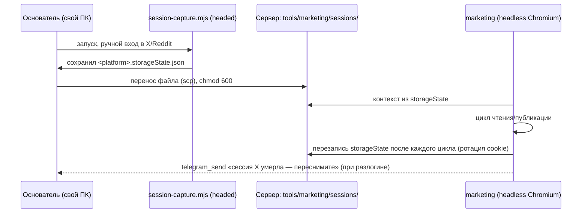
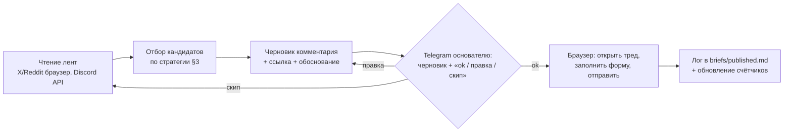

# ADR-161: Работа marketing в реальном браузере от лица основателя (ленты + формы комментариев)

**Дата:** 2026-07-12
**Статус:** Предложено
**Задача:** KS-4903 (связана: KS-4902 — пересмотр мониторинга и лимитов)
**Связанные документы:** tools/marketing/social-organic-strategy.md (§3.3 п.5, §3.4)

---

## 1. Контекст

Текущие читалки соцсетей — анонимные HTTP-запросы: X через `tools/x-read.mjs` (curl к syndication-endpoint, лимит ~30 запросов/15 мин, постоянные 429), Reddit через `tools/reddit-read.mjs` (HTML old.reddit без логина), Discord через `tools/discord-read.mjs` (user-токен из `tools/marketing/.discord-token`). Публикация комментариев — полностью вручную основателем по Telegram-брифам. Боль зафиксирована в стратегии (§3.3 п.5) и в KS-4902: X фактически не читается, лимит 3 комментария/день мал.

Запрос основателя: marketing работает в реальном браузере под его залогиненными сессиями — читает ленты и заполняет формы комментариев. Схема обкатана основателем на LinkedIn в другом проекте.

Что уже есть в инфраструктуре (факты):
- Playwright-браузеры смонтированы в контейнер marketing (`~/.cache/ms-playwright:ro`), бинарь `/project/node_modules/.bin/playwright`, `--network host`. Контейнер headless: DISPLAY/Xvfb нет.
- `tools/` смонтирован RW; там же паттерн хранения секрета — дот-файл `.discord-token` (0600, вне git, но НЕ в `.gitignore`).
- `storageState` Playwright в проекте нигде не используется (e2e логинится через API + localStorage).
- Telegram-канал связи с основателем работает в обе стороны (`telegram_send` + маршрутизация `[Telegram]`-ответов агенту).

## 2. Архитектура

### 2.1 Где живёт браузер

Headless Chromium (Playwright) **внутри контейнера marketing-агента** — браузеры и сеть уже доступны, новых контейнеров и дисплея не требуется. Headed-режим в контейнере невозможен (нет X-сервера) и не нужен: залогиненная сессия переносится файлом, а не живым входом. Изменения `Dockerfile.agent`/`webhook-server.py` не требуются — решение укладывается в существующие volume и роли.

### 2.2 Сессии: перенос, хранение, обновление

Механизм — Playwright `storageState` (JSON: cookies + localStorage), по файлу на платформу:

```
tools/marketing/sessions/
  x.storageState.json        # 0600, вне git
  reddit.storageState.json   # 0600, вне git
  README.md                  # порядок захвата/переноса (в git)
```

Жизненный цикл:



Ключевые правила:
- **Обратная запись после каждого цикла**: платформы ротируют cookie; сохранение свежего состояния продлевает жизнь сессии без участия основателя.
- **Детект разлогина**: маркер «нет элемента залогиненного UI» (аватар/composer) → цикл останавливается, `telegram_send` основателю. Никаких попыток логина по паролю — паролей в системе нет вообще.
- **Один браузер на платформу одновременно**: file-lock `sessions/<platform>.lock`; параллельные сессии из одного state ускоряют инвалидацию и триггерят антифрод.
- Discord остаётся на текущем механизме (API + user-токен) — он уже работает и браузера не требует; браузерный контур для него не строим.

## 3. Безопасность

### 3.1 Защита сессий

| Мера | Как |
|---|---|
| Файлы 0600, вне git | как `.discord-token`; плюс **явные записи в `.gitignore`**: `tools/marketing/sessions/` и `tools/marketing/.discord-token` (сейчас токен git не отслеживается, но правилом не защищён — закрываем риск `git add -f`) |
| Не класть в общий /tmp | `/tmp` шарится между всеми агент-контейнерами; кэш логин-контента и storageState живут только в `tools/marketing/sessions/` |
| Известное ограничение | `tools/` смонтирован RW всем агентам — файлы сессий технически читаемы другими агентами. Сужение volume — правка `webhook-server.py`, это зона основателя; решение об изоляции за ним (уведомить, не тикет) |

### 3.2 Риски блокировок и ограничители

Автоматизация личного аккаунта нарушает ToS всех трёх платформ; реалистичный риск — от теневого ограничения до перманентного бана личных аккаунтов основателя. Уровень риска: X — высокий (агрессивный антифрод, headless-детект), Reddit — средний (смотрит на паттерны, а не на браузер), Discord — уже принятый (self-token используется сегодня).

Обязательные ограничители (жёстче, чем «здравый смысл», потому что аккаунты личные):

| Ограничитель | Значение (потолок; рабочие лимиты внутри — KS-4902) |
|---|---|
| Публикации | X ≤ 5/день, Reddit ≤ 10/день; ≥ 10 мин между действиями на платформе |
| Чтение | ≤ 1 цикл ленты / 30 мин на платформу; без пагинации вглубь |
| Часы активности | только 08:00–23:00 Europe/Prague (паттерн живого человека) |
| Поведение | jitter задержек 2–8 с между шагами, реальный UA, фиксированный viewport, без параллельных вкладок |
| Стоп-кран | капча/челлендж/подозрение на разлогин → немедленная остановка контура платформы + telegram_send основателю; никаких ретраев |
| Счётчики | состояние действий за день — `tools/marketing/sessions/actions-state.json`; лимит исчерпан → только чтение |

### 3.3 Публикация — только через подтверждение

В фазе 1 **ни один комментарий не публикуется без явного «да» основателя** (§4.1). Это одновременно и качество, и главный анти-бан ограничитель: темп задаёт человек.

## 4. Рабочий процесс marketing



Автоматически: чтение лент, отбор, черновики, ранжирование, логирование, мониторинг реплаев на опубликованное. Через подтверждение: **каждая публикация** (ответ основателя в Telegram: `ok` — публикуем как есть; текст — публикуем с его правкой; `skip`). Таймаут ответа 4 часа → кандидат сгорает, не публикуется. Пересмотр «что можно без подтверждения» — отдельным решением после ≥ 2 недель работы без инцидентов.

## 5. Что нужно от основателя

1. **Первичный вход** (однократно на платформу): запустить `tools/marketing/session-capture.mjs` на своей машине (headed-браузер), вручную залогиниться в X и Reddit, скрипт сохранит `<platform>.storageState.json`.
2. **Перенос файлов** на сервер в `tools/marketing/sessions/` (scp), `chmod 600`. Порядок будет в `sessions/README.md`.
3. **Повторный захват при смерти сессии** — по Telegram-сигналу от marketing (ожидаемо: недели–месяцы при регулярной обратной записи state).
4. **Отвечать на черновики в Telegram** (`ok`/правка/`skip`) — это единственный канал публикации.
5. **Принять риск ToS**: автоматизация личных аккаунтов может привести к их блокировке; ограничители §3.2 снижают, но не убирают риск. Отдельно решить: сужать ли доступ других агентов к `tools/` (правка webhook-server.py — только основатель).

## 6. Декомпозиция (4 задачи)

| # | Задача | Владелец | Содержание | Зависит от |
|---|---|---|---|---|
| 1 | Захват и перенос сессий | marketing | `session-capture.mjs` (headed, для машины основателя), `sessions/README.md`, детект разлогина + обратная запись storageState как общий модуль | — |
| 2 | Браузерное чтение X и Reddit | marketing | `x-browse.mjs`/`reddit-browse.mjs` на storageState (замена анонимного x-read в циклах), лимиты чтения §3.2, file-lock; связка с KS-4902 | 1 |
| 3 | Публикация с Telegram-подтверждением | marketing | контур черновик → telegram_send → разбор ответа → заполнение формы браузером → лог в published.md; счётчики `actions-state.json`, стоп-кран | 1, 2 |
| 4 | Защита секретов в git | devops | записи в `.gitignore`: `tools/marketing/sessions/`, `tools/marketing/.discord-token`; проверка что файлы не в индексе | — |

Все три браузерные задачи — в `tools/` (RW-зона marketing, роль commit есть). Правки инфраструктуры агентов не требуются; единственный вопрос к основателю — изоляция `tools/` (§5 п.5), уведомлением, без тикета.

## 7. Отклонённые альтернативы

- **Официальные API (X API, Reddit OAuth)** — X API платный ($200+/мес за нужный объём), Reddit API требует app-регистрации и не решает публикацию «как человек»; запрос основателя — именно браузер, схема обкатана.
- **Отдельный браузер-контейнер (persistent context, CDP-подключение)** — лишний сервис на ограниченном сервере; storageState в контейнере агента даёт то же с нулевой инфраструктурой.
- **Headed-браузер через Xvfb в контейнере** — требует правок Dockerfile.agent (зона основателя) и не нужен: headless + storageState достаточно для лент и форм; если платформа начнёт резать headless — вернуться к вопросу с фактами детекта.
- **Пароли основателя у агента для автологина** — не рассматривается: расширяет ущерб от утечки с «сессия до ревокации» до «полный захват аккаунта».
- **Полностью автономная публикация** — отклонено для фазы 1: темп публикаций человеком — главный ограничитель бан-риска и качества.
