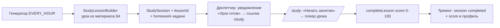

# ADR-162: Занятия v2 — персональный интерактивный урок вместо списка заданий

**Дата:** 2026-07-12
**Статус:** Предложено
**Задача:** KS-4909
**Связанные ADR:** 160 (training-plan-scheduler), 026/054 (user-courses), 072 (game-шаг урока), 035 §11 (drill-шаг)

---

## 1. Контекст

Обратная связь основателя по v1 (ADR-160, реализовано в `apps/api/src/study/`): занятие — это список ссылок на разрозненные задания без понятного принципа, урок один и универсальный, нет домашних заданий и подстройки. Направление v2: ядро занятия — **полноценный интерактивный урок, собранный под пользователя из его партий**; по расписанию пользователь проходит урок, а не разглядывает список.

Ключевые факты кодовой базы, на которых стоит решение:
- **API интерактивных уроков есть и богатый**: программное создание курсов/уроков/шагов (`UserCoursesService`/`UserLessonsService`/`UserLessonStepsService`, unified-роуты `adr054-unified.controller.ts`; отдельно admin-API и AI-tools). Типы шагов: `text` (markdown + FEN-диаграммы), `puzzle` (selection: ids/filter/custom), `quiz`, `game` (доска с перемоткой, `sourceType: pgn|workshop_analysis`), `drill`, `endgame_drill`, `opening_drill`.
- **Серверного движка НЕТ вообще** (вырезан, KS-2433): весь анализ — Stockfish WASM на клиенте, сервер только хранит результаты (`GameAnalysis.analysisPgn`, `Analysis`, `UserMistake`). Ограничение «не тратить движок на сервере» уже является инвариантом системы.
- **Конвейер партий есть**: `POST /workshop/pgn-files` (загрузка PGN), `POST /workshop/import-external` (chess.com/lichess через `ExternalChessService.fetchChesscomGames/fetchLichessGames`), хранение в `PgnImport`/`PgnImportGame`.
- Study v1: модели `StudySchedule/StudySession/StudyTask/...`, 3 крона (генератор, диспетчер, трекинг), страница `/study`, вкладка настроек. Всё переиспользуется.
- Зафиксированный долг v1: `tools/study-plan/rating-shelves.json` и `texts.*.json` **не читаются кодом** — генератор работает на захардкоженных константах, полки в коде (`<1300/<1700/else`) расходятся с JSON. v2 обязана этот разрыв закрыть (§3.2).

## 2. Встраивание интерактивного урока в занятие

### 2.1 Урок как сущность

Персональный урок — обычный урок механизма user-courses в **скрытом персональном курсе** «Мои занятия» (один на пользователя, `ownerId = userId`, `isPublic = false`, создаётся лениво при первом занятии). Генератор вызывает сервисы уроков напрямую (in-process, не HTTP): `StudyLessonBuilder` → `UserLessonsService.addLesson` + `UserLessonStepsService.addStep`. Плеер, прогресс, SM-2 — всё существующее работает без изменений.

Схема данных — минимальная дельта:
- `StudySession.lessonId uuid?` — ссылка на собранный урок;
- `StudyTask.role String @default("main")` — `main` (урок) | `homework` (§5).

### 2.2 Поток



- **Генератор** (существующий `study-generator.scheduler.ts`): вместо 2–4 разнотипных задач собирает урок (§4) + 1–2 homework-задачи. Задача v1 типа `lesson` заменяется задачей `role='main', type='lesson'` с `params.lessonId`.
- **/study**: страница становится урок-центричной — карточка занятия с одной главной кнопкой «Начать занятие» (роут плеера персонального курса), ниже блок «Домашнее задание» (прежний вид задач) и история прошлых занятий со score.
- **Уведомления** (диспетчер без изменений логики): текст меняется на «Ваш урок готов: <темы>» + одна ссылка на `/study`. Deep-link'и на отдельные задания уходят.
- **Завершение**: существующий `POST /lessons/progress/lessons/:id/complete` (порог 70) — reconciliation v1 уже умеет тип `lesson` по `UserLessonProgress.completedAt`; добавляется только запись `score` в результат сессии.

Ротация контента курса: уроки старше 30 дней чистятся генератором (курс не должен разбухать); пройденные остаются в истории занятий через `StudySession.lessonId` + снапшот тем в `profileSnapshot`.

## 3. Конвейер партий пользователя

### 3.1 Источники (без серверного движка)

1. **Загрузка PGN** — существующий `POST /workshop/pgn-files`. Ничего не строим.
2. **Импорт с chess.com/lichess** — существующий `POST /workshop/import-external`. Новое: **авто-импорт** для пользователей с активным расписанием и привязанным username — расширение ночного крона трекинга (`study-tracking.scheduler.ts`, там уже есть throttle и `ExternalChessService`): раз в сутки дотягивать новые партии за вчера в workshop-импорт `study-auto`. Дедуп уже есть в `WorkshopService.importPgn` (по Link/Site).
3. **Партии на Kingside** (будущее) — `Game.pgn` уже в БД; источник добавится реализацией того же интерфейса §4, схемных изменений не требует.

Хранение — существующие `PgnImport`/`PgnImportGame`, новых таблиц под партии нет. Движковый анализ на сервере не выполняется нигде (инвариант KS-2433 сохраняется); если продуктовая задача поиска ошибок потребует анализ — прецедент в проекте клиентский (WASM в браузере пользователя, результат сохраняется как `GameAnalysis`/`UserMistake`).

### 3.2 Онбординг

Занятие без партий не собрать персональным. `/study` и вкладка настроек получают состояние «нет материала»: баннер с двумя действиями — привязать chess.com/lichess (существующий `PATCH /users/me/external-accounts`) или загрузить PGN (`/workshop`). Пока партий нет — генератор собирает урок в fallback-режиме (шаблон полки + слабые темы из пазлов, без game-шагов).

Одновременно закрывается долг v1: файлы `tools/study-plan/` (`rating-shelves.json`, `texts.*.json`) **удаляются** — по решению основателя (2026-07-12) ни файлов, ни новых таблиц под шаблоны не заводится. Шаблоны живут в существующем lessons-стеке (§4.1), границы полок остаются константами кода (`study-profile.service`) — это логика выбора, а не контент.

## 4. Костяк персонализации: «партии → материал урока»

### 4.1 Шаблоны урока — в существующем lessons-стеке (ревизия 2026-07-12)

Шаблон полки = **скрытый системный курс** в существующих таблицах Course/Lesson/LessonStep: `ownerId = null`, `isPublic = false`, slug-конвенция `study-template-<shelf>`. Шаги шаблонного урока и есть заготовки занятия: `text`-шаги с плейсхолдерами (`{{focusTheme}}`, `{{notes}}`, `{{homeworkCarryOver}}`) в `bodyMarkdown`; `puzzle`-шаг (filter) со значениями-заглушками; `game`-шаг-плейсхолдер под партию пользователя; `quiz`/`drill` копируются как есть. `StudyLessonBuilder` = клонирование шагов шаблона в персональный урок с подстановкой (синтаксис плейсхолдеров фиксирует backend). en/ru — существующий механизм переводов уроков (`parentLessonId`/`lang`). Content правит шаблоны через lessons/admin API или seed (`lessons/seed/`) — без файлов данных. Шаблонные курсы не должны попадать в каталог: `isPublic=false` + фильтр по slug-префиксу в листингах.

Интерфейс в `apps/api/src/study/material/` — контракт, который будущая продуктовая логика реализует без перестройки занятий:

```ts
interface LessonMaterialSource {
  // без движка; games — выборка PgnImportGame/Game пользователя
  extract(userId: string, profile: StudyProfile): Promise<LessonMaterial>;
}
interface LessonMaterial {
  focusThemes: PuzzleTheme[];          // на чём строить урок
  gameFragments: GameFragment[];        // pgn + meta -> GameStepPayload
  positions: CustomPuzzle[];            // fen + solutionMoves -> puzzle custom (v1: пусто)
  notes: MaterialNote[];                // факты для text-шага («3 из 5 партий — эндшпили»)
}
```

**Заглушка v2 (`BaselineMaterialSource`)** — только дешёвые сигналы, БЕЗ поиска ошибок:
- `focusThemes` — из существующей статистики (`stats/themes`, `UserMistake`) — как в v1;
- `gameFragments` — 1–2 последние партии пользователя (метаданные PGN: результат, дебют по ECO-тегу, соперник) → `game`-шаг «пройди свою партию»;
- `positions` — пусто; `notes` — простые агрегаты по PGN-заголовкам (результаты, цвета, дебюты — парсинг тегов, не ходов).

Собираемый урок (StudyLessonBuilder, из LessonMaterial + шаблон полки):
1. `text` — вводный: тема занятия, наблюдения из `notes` (тексты из шаблонов content);
2. `puzzle` (filter) — слабая тема, окно рейтинга (адаптация v1 сохраняется);
3. `game` — партия пользователя с заданием на самопроверку в тексте шага;
4. `quiz` или `drill`/`endgame_drill` — по фокусу полки.

Будущая продуктовая задача «поиск типичных ошибок» = вторая реализация `LessonMaterialSource` (наполнит `positions` реальными позициями ошибок и `gameFragments` — фрагментами с моментами ошибок). Здесь она сознательно НЕ прорабатывается.

## 5. Контроль прогресса и домашние задания

- **Занятие**: `completed` = персональный урок завершён (порог 70 существующего `completeLesson`); `score` 0–100 пишется в результат сессии и в профиль генератора — влияет на сложность/объём следующего урока (правила адаптации v1 переиспользуются, вход меняется с «доля выполненных задач» на score урока).
- **Домашнее задание**: 1–2 задачи `role='homework'` существующих типов (`puzzle_theme`, `mistakes`, `rated_game`) с дедлайном до следующего занятия. Проверка — существующий reconciliation-крон v1 без изменений (типы те же). Невыполненная домашка → carry-over в следующий урок (механика carry-over v1 есть) + упоминание в вводном text-шаге.
- **История**: `/study` показывает последние занятия со score и статусом домашки — это и есть видимый «контроль прогресса», которого не хватало в v1.

## 6. Декомпозиция (5 задач)

| # | Задача | Владелец | Содержание | Зависит от |
|---|---|---|---|---|
| 1 | Ядро v2: урок в занятии | backend | Миграция (`StudySession.lessonId`, `StudyTask.role`), скрытый персональный курс, `StudyLessonBuilder` (клонирование шаблона §4.1 с подстановкой), интерфейс `LessonMaterialSource` + `BaselineMaterialSource`, генератор v2, контракт плейсхолдеров, ротация уроков, score в сессию | — |
| 2 | Авто-импорт внешних партий | backend | Расширение ночного крона: суточный дотяг chess.com/lichess в workshop-импорт `study-auto` для активных расписаний; лимиты/throttle | — |
| 3 | /study v2 + онбординг | frontend | Урок-центричная страница (главная кнопка → плеер, блок домашки, история со score), баннер «нет материала» (привязка аккаунтов / загрузка PGN), контракты в `packages/shared` по типам backend | 1 |
| 4 | Тексты и шаблоны уроков | content | Шаблонные курсы/уроки по полкам через lessons/admin API или seed (§4.1): вводные text-шаги и задания самопроверки game-шага (en/ru переводами уроков) по плейсхолдер-контракту задачи 1; тексты уведомлений «урок готов»; удаление устаревших `tools/study-plan/*` | контракт из 1 |
| 5 | Проверка потока целиком | qa | e2e: расписание → генерация урока → уведомление → прохождение → completed+score → домашка reconciliation | 1–4 |

## 7. Отклонённые альтернативы

- **Системные уроки (`ownerId=null`) под персональные занятия** — admin-guard, общий пул, чистка чужого контента; user-course на пользователя изолирует владение и переиспользует весь стек без правок прав.
- **Генерация урока через AI-tools (`lessons/ai-tools`)** — ассистентский контур ограничен (только text/quiz-шаги, rate-limit, LLM-стоимость); генератору нужны game/puzzle-шаги детерминированно и бесплатно — прямые сервисы уроков.
- **Серверный движковый анализ партий для персонализации** — прямо запрещён постановкой и противоречит инварианту KS-2433; будущий поиск ошибок — клиентский WASM или внешние готовые аннотации.
- **Новая сущность «урок занятия» вне lessons-стека** — дублирует плеер, прогресс, SM-2, шаги; выигрыша нет.
- **Шаблоны/тексты в файлах (`tools/study-plan/`) или новой таблице** — отклонено основателем (2026-07-12): файлы v1 так и не были подключены к коду, требуют своего формата и процесса правки; шаблон-как-урок (§4.1) редактируется существующими инструментами уроков.
- **Ежедневный полный реимпорт внешних партий всех пользователей** — лишняя нагрузка и rate-limit'ы; только вчерашний диапазон и только активные расписания.
