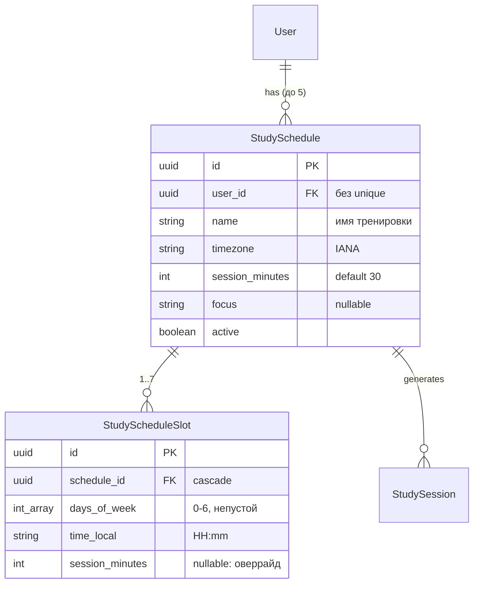

# ADR-163: Гибкие расписания занятий — несколько тренировок и временных диапазонов

**Дата:** 2026-07-13
**Статус:** Предложено
**Задача:** KS-4926
**Связанные ADR:** 160 (training-plan-scheduler), 162 (study-v2-personal-lesson)

---

## 1. Контекст

Запрос пользователя (Telegram, 13.07): настройки обучения по расписанию слишком жёсткие. Сейчас `StudySchedule` — строго 1:1 с пользователем (`userId @unique`): один набор дней недели + одно время + один focus + одна длительность. Нельзя ни «тактика по будням вечером + эндшпили по выходным утром», ни «в субботу время другое».

Что уже построено и переиспользуется без переделки (ADR-160/162, `apps/api/src/study/`):
- Генератор (`study-generator.scheduler.ts`) уже итерирует `findMany({active: true})` — множественность расписаний ему структурно не мешает; per-расписание вход (`generateForSchedule`) принимает `{daysOfWeek, timeLocal, timezone, focus, sessionMinutes}`.
- `StudySession` привязана к `scheduleId` (unique `scheduleId_scheduledAt`), профиль/адаптация собираются per `(userId, scheduleId)` (`study-profile.service.ts`) — история и carry-over уже изолированы по расписанию.
- Диспетчер и трекинг работают от сессий, о расписании не знают — изменений не требуют.
- Слот-математика (`study-slot.util.ts`, `nextSlotWithin`) чистая функция от `{daysOfWeek, timeLocal, timezone}` — переиспользуется для каждого диапазона.

## 2. Решение: степени свободы

Термины: **тренировка** = `StudySchedule` (именованный план с фокусом), **временной диапазон** = новая сущность `StudyScheduleSlot` (дни недели + время).

| Степень свободы | Решение | Обоснование |
|---|---|---|
| Несколько тренировок у пользователя | Да: снять `@unique` c `userId`, лимит **5 активных** | Ключевой запрос; генератор уже per-schedule |
| Имя тренировки | Да: `name` (до 60 символов) | Уведомления и страница /study должны различать «что за занятие»; focus для этого недостаточен |
| Focus per тренировка | Уже есть (`focus`) — становится «видом тренировки» | Ноль изменений |
| Несколько диапазонов на тренировку | Да: `StudyScheduleSlot[]`, лимит **7 на тренировку** | Ключевой запрос |
| Дни недели per диапазон | Да: `daysOfWeek` в слоте | «Будни 19:00, выходные 10:00» — основной сценарий гибкости |
| Длительность per диапазон | Да: `sessionMinutes?` в слоте, null → наследует тренировку | Выходной слот длиннее будничного — дёшево (одно nullable-поле), генератор уже параметризован длительностью |
| Таймзона | Одна на тренировку (как сейчас), слоты наследуют | Пер-слотная таймзона — экзотика; смена зоны решается редактированием тренировки |
| `active` | На тренировке (пауза всей тренировки); слоты вкл/выкл не имеют — ненужный удаляется | Меньше состояний UI и генератора |

Отклонённые степени свободы (v1 этой ревизии):
- **rrule / «каждые 2 недели» / конкретные даты** — принцип ADR-160 §3 (без rrule-библиотек) сохраняется; `daysOfWeek + timeLocal` покрывает заявленные сценарии.
- **Отпуск/период паузы (dateFrom/dateTo)** — покрывается `active=false`; отдельная механика — по будущему запросу.
- **Слот с интервалом «с… по…» (окно, а не точка)** — генератор назначает конкретный момент уведомления; «окно» превращается в вопрос «когда слать» без ответа. Точка времени остаётся.

Валидация: у одного пользователя два слота (любых тренировок) не могут совпадать по паре (день, время) — 400 при сохранении, иначе два занятия в один момент.

## 3. Модель данных

Миграция (backend, одна):
1. `StudySchedule`: снять `@unique(userId)` → `@@index([userId])`; добавить `name` (default `'Занятие'`/`'Study'` — бэкфилл константой, локализация не нужна: имя редактируемое); удалить `daysOfWeek`, `timeLocal`.
2. Создать `study_schedule_slots`; data-миграция: по каждой существующей строке расписания — один слот из её `daysOfWeek + timeLocal`.
3. `StudySession` не меняется (`scheduleId_scheduledAt` остаётся ключом идемпотентности; слоты разных времён дают разные `scheduledAt`).

## 4. Изменения генератора

`generateForSchedule` вместо одного `nextSlotWithin(schedule, …)` — цикл по слотам тренировки: для каждого слота ближайшее срабатывание в горизонте +25 ч → создать сессию (идемпотентность по `scheduleId_scheduledAt` уже есть). Итог: в горизонте может жить несколько planned-сессий одной тренировки (утро+вечер) и разных тренировок — диспетчер и трекинг к этому готовы (работают списком по `scheduled_at <= now`).

`sessionMinutes` слота (если задан) прокидывается в `createSession` вместо значения тренировки. Немедленная генерация из PUT (KS-4894) сохраняется: уборка future-planned по `scheduleId` + прогон всех слотов.

Нагрузка: максимум 5×7 слотов на пользователя, генерация — часовой тик по активным расписаниям; объёмы прежнего порядка, Redis-lock без изменений.

## 5. Контракты (packages/shared, меняет backend)

Монорепо, SPA деплоится вместе с API — совместимость со старым синглтон-контрактом не нужна, эндпоинты заменяются:

- `GET /study/schedules` → `{ schedules: StudyScheduleDto[] }`
- `POST /study/schedules` / `PUT /study/schedules/:id` — тело: `{ name, timezone, sessionMinutes?, focus?, active?, slots: StudySlotInput[] }`; слоты сохраняются replace-on-write (полный список в каждом PUT) — слот-level CRUD избыточен для ≤7 строк.
- `DELETE /study/schedules/:id` — каскад слотов и planned-сессий (notified/in_progress/история не трогаются, FK сессий переживает удаление? — нет: `onDelete: Cascade` у сессий уже стоит; удаление тренировки = удаление её истории. В DTO ответа фронт предупреждает об этом в confirm-диалоге).
- `StudyScheduleDto` += `name`, `slots: StudySlotDto[]`; − `daysOfWeek`, `timeLocal`.
- `GET /study/session` → `GET /study/sessions/current`: `{ sessions: StudySessionDto[] }` (ближайшее занятие каждой активной тренировки; `StudySessionDto` += `scheduleId`, `scheduleName`). История (`/study/history`) += `scheduleName`.
- Текст уведомления (диспетчер): добавить имя тренировки в заголовок (i18n-шаблоны уже есть).

## 6. Декомпозиция

| # | Задача | Владелец | Содержание | Зависит от |
|---|---|---|---|---|
| 1 | Схема + API + генератор | backend | Миграция §3, CRUD §5, лимиты и валидация пересечений §2, генератор по слотам §4, контракты в shared, правка `study-schedule.service`/`study-slot.util` вызовов, unit-тесты (слоты, лимиты, миграционный слот) | — |
| 2 | UI настроек: список тренировок | frontend | `StudyTab` v2: список карточек тренировок (имя, focus, длительность, active), в карточке — слоты (дни-чекбоксы + время + длительность-оверрайд, «добавить время»), лимиты и ошибки пересечений из API | 1 (контракты) |
| 3 | /study: несколько занятий | frontend | Страница /study: карточка ближайшего занятия per тренировка (имя тренировки), история со `scheduleName`; переход на `GET /study/sessions/current` | 1 |
| 4 | Проверка потока | qa | e2e: две тренировки × два слота → генерация обоих занятий, уведомления с именами, прохождение, история; пересечение слотов → 400 | 1–3 |

Задачи 2 и 3 независимы друг от друга, обе после 1.

## 7. Отклонённые альтернативы

- **Слоты как JSONB-поле в StudySchedule** — теряется валидация на уровне схемы и простые запросы генератора; таблица на ≤35 строк на пользователя дешевле сопровождения JSONB-контракта.
- **«Тренировка» как новая сущность поверх StudySchedule** — двухуровневая иерархия (план → расписания → слоты) не нужна: focus+name на StudySchedule уже выражают «вид тренировки», а сессии/профиль/адаптация к ней уже привязаны.
- **Сохранение синглтон-эндпоинтов рядом с новыми** — двойной контракт без потребителя: SPA и API деплоятся из одного монорепо одновременно.
- **rrule-библиотека** — по-прежнему избыточна (см. §2); слот-математика ADR-160 переиспользуется как есть.
