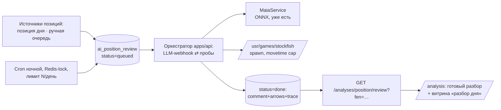
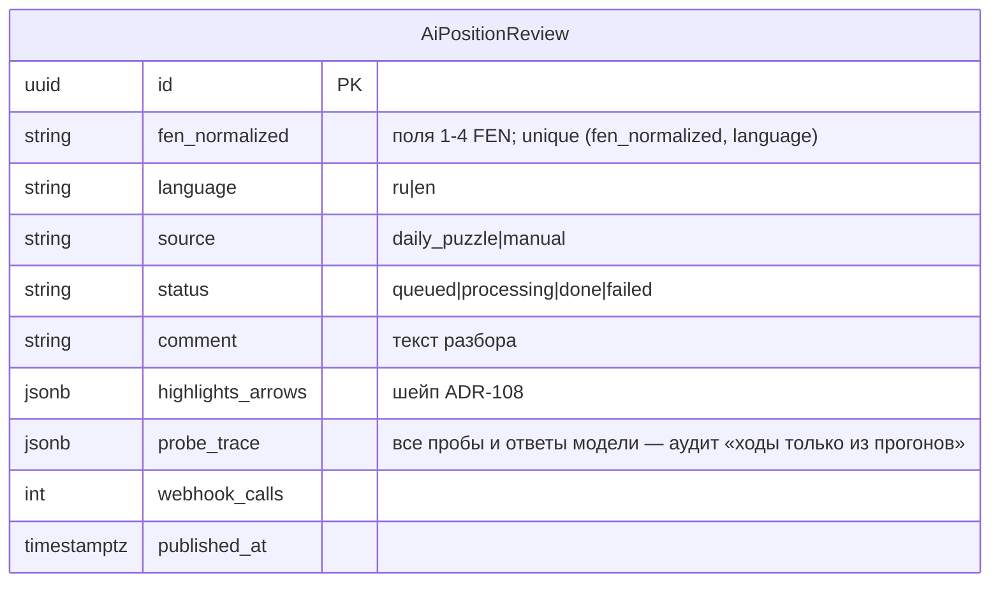

# ADR-164: Анализ позиции словами с вариантами — серверный преразбор (Maia + Stockfish + LLM)

**Дата:** 2026-07-13 (rev3 — KS-4940; rev2 — KS-4939; rev1 — KS-4937)
**Статус:** Предложено
**Задачи:** KS-4937, KS-4939, KS-4940
**Связанные ADR:** 108/108b (AI-комментарий позиции), 102/103/107 (LLM-конвейер factors), 124 (maia-core)

---

## 1. Контекст и эволюция решения

Цель: комментарий позиции «вариантами» — «человек сыграет X, но это проваливается из-за Y; ключ — Z». Рабочий прототип (marketing, /tmp/maia-sf-comment-flow.md): Maia даёт человеческие кандидаты, Stockfish проверяет каждый, текст собирается по схеме «ловушка → почему нет → ключ»; правило — **ни одного хода в тексте без прогона движком**, включая дозапросы по ходу разбора.

Эволюция (все решения — пользователя, 13.07):
- rev1: однопакетный сбор вариантов на клиенте — отклонено (модель не может дозапросить линию).
- rev2: LLM-оркестратор, пробы на клиентских движках, HTTP-цикл — транспорт отклонён.
- rev3 (это решение): запросный пользовательский разбор **не делается вообще** — при массовом использовании цикл из ~7 обращений к модели на комментарий не масштабируется по токенам, а платежей на сайте нет и не планируется (сайт бесплатный). **Разбор идёт целиком на сервере, фоном, по отобранным позициям, один раз на позицию** — готовые тексты раздаются всем. Канал сервер→браузер (WebSocket/HTTP-цикл) не нужен: движки живут рядом с моделью, как в прототипе.

Существующая лёгкая кнопка «Получить оценку от AI» (ADR-108, один вызов, factors без вариантов) остаётся как есть — это отдельная фича, её судьба здесь не решается.

## 2. Решение: серверный конвейер преразбора

Экономика: стоимость привязана к числу позиций (десятки в день), не к числу пользователей. Оркестратор из rev2 сохраняется целиком, но обе стороны — на сервере.

### 2.1 Оркестратор (серверный)

Цикл тот же, что в rev2, без транспорта до клиента:
- модель (webhook, `history[]` уже поддержан) отвечает JSON: `{"probes":[...]}` или финальный `{"comment","highlights","arrows"}`;
- пробы исполняет сам сервер: `kind:'maia'` → существующий `MaiaService.predict` (ELO пробы задаёт модель в диапазоне 1100–1900, дефолт 1500 — «человеческие» кандидаты); `kind:'sf'` → spawn системного `/usr/games/stockfish` (`position fen … moves …; go movetime M`), паттерн spawn уже есть в `factors-rebuilder.service.ts`;
- легальность линий — chess.js до исполнения; нелегальная → модели возвращается `ok:false, error:"illegal line"`;
- prompt «аналитика» (ru+en, обе локали генерируются на одну позицию): Maia = «что сыграет человек», SF = «сила хода и опровержение из pv», правило «ни одного хода в тексте без sf-пробы», бюджет раундов.

Лимиты (ENV): ≤8 раундов × ≤4 пробы, sf `movetime` cap 5000 мс, wall-clock позиции 10 мин, форс-финал при исчерпании. Обработка строго последовательная — одна позиция единовременно, один SF-процесс.

### 2.2 Отступление от инварианта KS-2433 — фиксируем явно

«Поисковый движок не живёт на сервере» вводился против realtime-анализа в пользовательских запросах. Здесь поиск выполняется **только в фоновом батче**: ночной cron, одна позиция за раз, дневной лимит `AI_REVIEW_DAILY_LIMIT` (default 20 позиций), nice-приоритет процесса. Пользовательские HTTP-запросы движок не запускают никогда. Инвариант для realtime-путей сохраняется.

### 2.3 Модель данных

`probe_trace` обязателен: это доказательство правила прототипа и материал для отладки качества.

### 2.4 Источники позиций (этап 1)

1. **Позиция дня** — автоматически: cron ставит в очередь FEN текущего `DailyPuzzle` (обе локали).
2. **Ручная очередь** — админ-endpoint `POST /admin/ai-reviews {fen}` (existing admin-guard): контент отбирает учебные позиции.

Расширение источников (критические моменты партий, позиции уроков) — после оценки качества, вне этапа 1.

### 2.5 Выдача пользователю

- `GET /analyses/position/review?fen=…&language=…` — публичный (без JWT: контент уже оплачен, раздача бесплатна), отдаёт `done`-запись по нормализованному FEN или 404. Кэш HTTP разрешён (immutable после публикации).
- Страница анализа: при совпадении текущего FEN с готовым разбором панель ADR-108 показывает его с пометкой «Готовый разбор» (без расхода лимитов).
- Витрина: блок «Разбор дня» на странице задач/пазла дня — готовый текст к сегодняшней позиции.

## 3. Декомпозиция (заменяет план rev2; KS-4938 закрыть без замены — клиентский контур не строится)

| # | Задача | Владелец | Содержание | Зависит от |
|---|---|---|---|---|
| 1 | Конвейер преразбора | backend | Миграция `ai_position_review`, оркестратор (webhook-цикл + серверные maia/sf-пробы + legality), parse-ветка `probes`, prompt аналитика ru/en, cron с Redis-lock и дневным лимитом, источник «позиция дня», админ-очередь, `GET …/review`, spec-тесты (лимиты, illegal line, форс-финал) | — |
| 2 | Показ готовых разборов | frontend | Панель ADR-108: показ «Готового разбора» по совпадению FEN; блок «Разбор дня» на странице пазла дня; типы в shared | 1 |
| 3 | Отбор и оценка качества | content | Ручная очередь: 10–20 учебных позиций, вычитка текстов ru/en, обратная связь по prompt'у | 1 |
| 4 | Приёмка | qa | Позиция дня разобрана к утру; текст ссылается только на линии из `probe_trace`; 404 по чужому FEN; лимит N/день соблюдён; страница анализа показывает готовый разбор без расхода квоты | 1–3 |

## 4. Риски

| Риск | Митигирование |
|---|---|
| Ночной батч грузит общий сервер (SF-поиск) | Одна позиция за раз, movetime cap, nice, дневной лимит, часы низкой нагрузки |
| Качество текстов нестабильно | `probe_trace` для разбора причин; этап content-вычитки до расширения источников |
| Расход токенов вебхука | ≤8 вызовов × N позиций/день — верхняя граница известна заранее; счётчик `webhook_calls` в записи |
| Пользователь ждёт разбор «своей» позиции | Честная граница фичи: разбор только отобранных позиций; запросного анализа нет (решение §1) |

## 5. Отклонённые альтернативы

- **Запросный разбор по клику пользователя** (rev1/rev2) — отклонено пользователем: до ~7 обращений к модели на комментарий не масштабируется по токенам на бесплатном сайте.
- **Платный разбор по запросу** — платёжной подсистемы нет и сайт остаётся бесплатным (решение пользователя).
- **WebSocket/HTTP-цикл до клиентских движков** — не нужен: движки на сервере рядом с моделью; вся сложность канала, reconnect и деградаций исчезает.
- **Клиентский счёт Maia/SF** — имел смысл только для запросного разбора; в преразборе сервер считает сам (фоном, с лимитами), качество не зависит от устройства пользователя.
- **BullMQ/отдельный worker** — очередь на десятки позиций в день; таблица + cron с Redis-lock (8 существующих прецедентов) достаточны.
