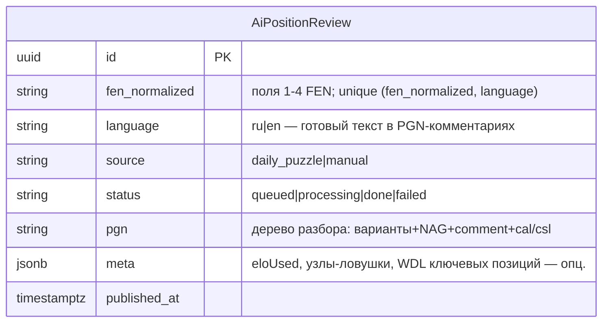

# ADR-164: Серверный преразбор «позиции дня» — алгоритмически (дерево Maia×SF), общий движок с ADR-165

**Дата:** 2026-07-14 (rev5 — KS-4948: алгоритмический серверный разбор, стыковка с ADR-165; rev4 — агентский webhook, **отклонён**; rev1–3 — см. §7)
**Статус:** Предложено
**Задачи:** KS-4937, KS-4939, KS-4940, KS-4941, KS-4948
**Связанные ADR:** **165 (алгоритмический разбор на фронте — принят, источник алгоритма)**, 108/108b (AI-комментарий/overlay), 124 (maia-core), 041/042/106 (tactic-worker: server-side Maia+SF), 066/125 (WDL/ΔW), 037/038 (аннотации/PGN-сериализация), 008 (persistence дерева), 133 (OG-prerender)

---

## 1. Контекст и эволюция

rev4 (агент за webhook'ом с инструментами Stockfish+Maia, один вызов, готовый JSON) **отклонён пользователем**: модель тянет к выводам, обнажает инструменты, галлюцинирует ходы/планы; при 3-мин бюджете вызов ~315с и частые пустые ответы webhook.

Решение пользователя: серверный разбор — **алгоритмический**, детерминированное дерево Maia-кандидатов + Stockfish-оценок/опровержений, текст из дерева шаблоном; модель — максимум озвучка, не источник ходов.

Параллельно **принят ADR-165** — тот же алгоритмический разбор, но на фронте: рекурсивное дерево кандидатов `Maia ∪ Stockfish`, соперник отвечает так же вглубь, стоп когда позиция «понята» (SF-топ == Maia-топ И один исход W/D/L > 95%); результат пишется в дерево партии как варианты. Порог «человеческого» хода Maia — ADR-165 §3.1.

**Вывод rev5:** серверный разбор — это тот же алгоритм ADR-165, запущенный **headless** на сервере для отобранных позиций. Отдельного алгоритма нет. Серверная часть не выкидывается целиком, но **сжимается** до: headless-прогон общего движка + хранение результата + выдача. Ни webhook, ни prompt, ни модель для анализа.

---

## 2. Зачем вообще сервер, если фронт уже считает (ADR-165)

ADR-165 считает разбор в браузере для **любой** позиции бесплатно. Серверный преразбор оправдан **только** для:

1. **«Позиция дня» как витрина** — один и тот же вычитанный разбор всем пользователям, кэш, без вычисления у каждого посетителя;
2. **клиенты без COI/SharedArrayBuffer** — там Stockfish WASM недоступен (ADR-165 деградирует до Maia-only); готовый серверный разбор доступен всем;
3. **гости / SEO / OG-prerender** (ADR-133) — контент нужен без запуска браузерного движка.

Для **произвольной** пользовательской позиции сервер не нужен — работает фронтовый ADR-165. Это и есть граница сервер/фронт (§6).

---

## 3. Стыковка с ADR-165: общий движок, без дублирования

Алгоритм **один** и живёт в **общем pure-модуле** `@kingside/maia-core` (engine-adapter-injected), а не в двух реализациях:

| Слой | Где | Фронт (ADR-165) | Сервер (rev5) |
|---|---|---|---|
| Алгоритм: дерево `Maia∪SF`, стоп-условие, пороги, шаблон текста, PGN-сериализация | `@kingside/maia-core` (pure) | тот же | тот же |
| Maia-провайдер | адаптер | `/browser` (onnxruntime-web) | `createNodeProvider()` (уже есть, tactic-worker) |
| Stockfish-адаптер | адаптер | `useStockfish` (WASM) | `StockfishService` (spawn `/usr/games/stockfish`, уже есть в tactic-worker) |
| WDL / expected-score | `@kingside/maia-core/weak-choice` (уже есть) | тот же | тот же |

Что общего (единый код, не копия): построение дерева, критерий «резкого скачка» (падение WDL), стоп-условие (SF-топ==Maia-топ И `max(W,D,L)>0.95`), порог человеческого хода Maia (§3.1 ADR-165), шаблон текста ru/en, сериализация в PGN (варианты + NAG + comment + `[%cal]`/`[%csl]`).

Инвариант **KS-2433 сохраняется**: движки — в tactic-worker (Maia node-provider + `StockfishService` уже там для генератора пазлов), **не в apps/api**. Серверный разбор — новый job в существующем движковом воркере, а не движки в API.

**Дублирования нет:** фронт и сервер — два тонких вызова одного алгоритма с разными адаптерами движков. Расхождение реализаций исключено по построению.

---

## 4. Формат хранимого результата — PGN

Результат разбора — дерево вариантов с оценками/NAG/комментариями/стрелками. Храним как **PGN с вариациями + NAG + comment + `[%cal]`/`[%csl]`** (ровно та сериализация, что ADR-165 пишет в дерево партии, и что уже умеет persistence ADR-008/037/038). Комментарии узлов — **готовый локализованный текст** шаблона (генерит общий модуль §3).

Выигрыш: фронт грузит хранимый PGN прямо в `useReviewState` (`LOAD_FROM_PGN`) — тот же путь, что загрузка анализа партии; отдельного рендер-пути нет, стрелки/NAG/комментарии рисуются штатно.

Хранение — переиспользуем таблицу `ai_position_review` (rev4), но **обрезаем под алгоритм**:

Удаляются из rev4: `comment`(строка), `highlights_arrows`, `probe_trace`, prompt-поля, `AI_REVIEW_FETCH_TIMEOUT_MS`, токен-лимиты. `probe_trace` не нужен — ходы детерминированы, галлюцинаций нет; chess.js-валидация линий не нужна по той же причине.

---

## 5. Роль модели

Для анализа — **никакой**. Текст полностью детерминирован шаблоном из дерева. Забракованный агент-с-инструментами удалён из конвейера целиком.

Опционально (вне MVP, отдельной задачей): «озвучка» — TTS-аудио готового текста либо лёгкий LLM-проход, **переписывающий уже готовый детерминированный текст** в более гладкую прозу, без права порождать ходы/линии/оценки. Не блокер, решается позже.

---

## 6. Выдача и «позиция дня» (граница сервер/фронт)

- `GET /analyses/position/review?fen=…&language=…` — публичный, кэшируемый; отдаёт `done`-запись (PGN+meta) по нормализованному FEN или 404.
- **Источники (как rev4, без изменений):** позиция дня (cron ставит FEN текущего `DailyPuzzle` в очередь) + ручная очередь `POST /admin/ai-reviews {fen}` для учебных позиций. Cron ночной, Redis-lock, лимит `AI_REVIEW_DAILY_LIMIT`.
- **Фронт `/analysis`:** при совпадении текущего FEN с хранимым разбором — грузит PGN в дерево (готовый разбор, без вычисления, работает без COI). Нет совпадения — считает сам по ADR-165. Это и есть граница: сервер покрывает **отобранные** позиции (витрина/SEO/COI-less), фронт — **произвольные**.

---

## 7. Отклонённые альтернативы

- **rev4 — агент за webhook с инструментами** (один вызов, готовый JSON): отклонён пользователем — выводы/обнажение инструментов/галлюцинации, ~315с, пустые ответы.
- **rev1/rev2 — запросный разбор на клиенте / LLM-оркестратор с HTTP-циклом**: не масштабируется по токенам, модель не дозапрашивает линию.
- **rev3 — серверный цикл проб в apps/api (webhook-пинг-понг + spawn SF в API)**: нарушал KS-2433.
- **Две отдельные реализации алгоритма (фронт + сервер)**: отклонено — общий pure-модуль `maia-core` исключает расхождение.
- **Структурный PGN + генерация текста на рендере** (вместо готового текста в комментариях): отклонено ради простоты — храним готовый локализованный текст, фронт только грузит; текст-шаблон всё равно общий (тот же модуль), но per-language строка в БД проще стабильного sidecar по узлам.
- **Полный отказ от серверной части** (только фронтовый ADR-165): отклонено — теряются витрина «позиция дня» с единым вычитанным текстом, COI-less клиенты, SEO/prerender (§2).

---

## 8. Декомпозиция (backend)

| # | Задача | Владелец | Содержание | Зависит |
|---|---|---|---|---|
| 1 | Общий алгоритм в maia-core | backend + frontend (координация) | Вынести в `@kingside/maia-core`: построение дерева `Maia∪SF`, стоп-условие, пороги (§3.1 ADR-165), шаблон текста ru/en, PGN-сериализатор. Engine-adapter интерфейс (Maia-провайдер + SF-адаптер инъектятся). Unit-тесты на pure-логику. **Это же потребляет ADR-165 на фронте** | — |
| 2 | Серверный runner | backend | Job/CLI в tactic-worker: FEN → прогон общего алгоритма с node-адаптерами (`createNodeProvider` + `StockfishService`) → PGN+meta. Фикс. movetime/лимиты дерева | 1 |
| 3 | Хранение | backend/prisma | Миграция `ai_position_review`: убрать LLM-поля, добавить `pgn`+`meta` | — |
| 4 | Конвейер выдачи | backend | Обрезать модуль `ai-review`: убрать webhook/prompt/probe_trace/валидацию линий; cron «позиция дня» + admin-очередь + `GET …/review` отдаёт PGN; spec-тесты (done/failed/лимит) | 1,2,3 |
| 5 | Показ на фронте | frontend | При совпадении FEN грузить хранимый PGN в дерево (`LOAD_FROM_PGN`), иначе — ADR-165; блок «Разбор дня» | 4, ADR-165 |
| 6 | Приёмка | qa | Позиция дня разобрана к утру; PGN грузится в дерево; ходы/оценки детерминированы (повтор даёт тот же PGN); 404 по чужому FEN; работает без COI | 1–5 |

Задача 1 — общий движок — **снимает дублирование** и является совместной точкой с ADR-165 (реализуется один раз, потребляется обоими).

---

## 9. Резюме

Серверный разбор «позиции дня» — **алгоритмический, тот же движок, что фронтовый ADR-165**, запущенный headless в tactic-worker (Maia node-provider + системный Stockfish — уже там). Алгоритм (дерево `Maia∪SF`, стоп-условие `SF-топ==Maia-топ И один W/D/L>0.95`, пороги, шаблон текста, PGN-сериализация) живёт в **общем pure-модуле `@kingside/maia-core`**; фронт и сервер — тонкие вызовы с разными адаптерами движков, **без дублирования**. Результат хранится как **PGN** (варианты+NAG+comment+стрелки) и грузится фронтом в дерево через `LOAD_FROM_PGN`. `GET …/review` отдаёт готовый разбор для отобранных позиций (витрина/SEO/COI-less); произвольные позиции считает фронт. **Модель для анализа не нужна** (детерминированный шаблон); опциональная озвучка — вне MVP. Граница сервер/фронт: сервер = отобранные позиции, фронт = произвольные. KS-2433 сохранён (движки в воркере, не в API). Backend-объём — §8, ядро = задача 1 (общий алгоритм, общая с ADR-165).
