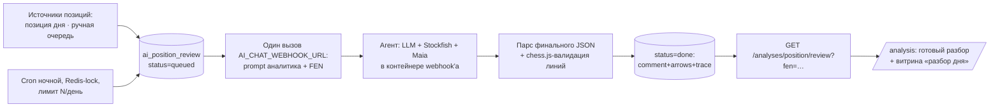
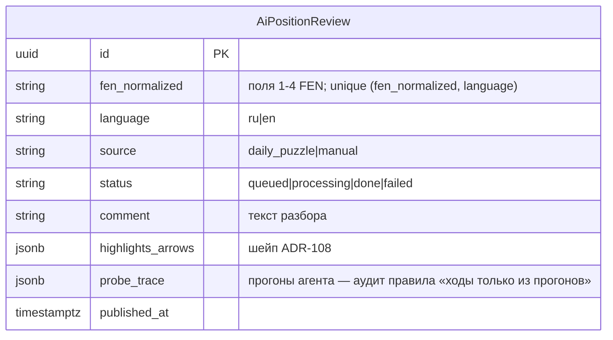

# ADR-164: Анализ позиции словами с вариантами — серверный преразбор через агентский webhook

**Дата:** 2026-07-13 (rev4 — KS-4941; rev3 — KS-4940; rev2 — KS-4939; rev1 — KS-4937)
**Статус:** Предложено
**Задачи:** KS-4937, KS-4939, KS-4940, KS-4941
**Связанные ADR:** 108/108b (AI-комментарий позиции), 102/103/107 (LLM-конвейер factors), 124 (maia-core)

---

## 1. Контекст и эволюция решения

Цель: комментарий позиции «вариантами» — «человек сыграет X, но это проваливается из-за Y; ключ — Z». Рабочий прототип (marketing, /tmp/maia-sf-comment-flow.md): Maia даёт человеческие кандидаты, Stockfish проверяет каждый, текст — «ловушка → почему нет → ключ»; правило — **ни одного хода в тексте без прогона движком**.

Эволюция (все решения — пользователя, 13.07):
- rev1: однопакетный сбор вариантов на клиенте — отклонено (модель не может дозапросить линию).
- rev2: LLM-оркестратор, пробы на клиентских движках, HTTP-цикл — отклонено.
- rev3: запросный пользовательский разбор не делается вообще (токены не масштабируются, сайт бесплатный); разбор — на сервере, фоном, по отобранным позициям, один раз на позицию.
- rev4 (это решение, зафиксировано в KS-4941): **серверный цикл проб не строится**. Модель за webhook'ом — **агент с собственными инструментами** (Stockfish и Maia в её контейнере): наш сервер делает **один вызов** с prompt'ом, все прогоны агент выполняет сам и возвращает готовый финальный JSON. На нашей стороне остаются только: очередь позиций, prompt, парс финального ответа, хранение, выдача.

Существующая лёгкая кнопка «Получить оценку от AI» (ADR-108) остаётся как есть — её судьба здесь не решается.

## 2. Решение: конвейер преразбора

Экономика: стоимость привязана к числу позиций (десятки в день), не к числу пользователей.

### 2.1 Вызов агента

- Один POST на `AI_CHAT_WEBHOOK_URL` (существующий `callWebhook`) на позицию×локаль; таймаут — отдельный `AI_REVIEW_FETCH_TIMEOUT_MS` (default 10 мин: агент гоняет движки сам, это дольше 180 с лёгкой кнопки). Фоновому cron'у длинный таймаут безразличен — HTTP-шлюз не участвует.
- Prompt «аналитика»: Maia = «что сыграет человек уровня ~N», SF = «сила хода и опровержение»; правило «ни одного хода в тексте без прогона»; требование вернуть в финальном JSON поле `probe_trace` — список выполненных прогонов (линия, движок, оценка/вероятности).
- Ответ — расширенный шейп ADR-108: `{comment, highlights, arrows, probe_trace}`. Парс — существующий `parse-model-output` + ветка `probe_trace`.
- Валидация на нашей стороне (chess.js, без движка): каждая линия из `probe_trace` и каждый ход, упомянутый в `arrows`, легальны от корневой FEN; нарушение → `status=failed` с логом (текст с нелегальными ходами не публикуется).

Инвариант KS-2433 («поисковый движок не живёт на сервере») **сохраняется без отступлений**: движки — в контейнере webhook'а, не в apps/api.

### 2.2 Модель данных

### 2.3 Источники позиций (этап 1)

1. **Позиция дня** — автоматически: cron ставит в очередь FEN текущего `DailyPuzzle` (обе локали).
2. **Ручная очередь** — админ-endpoint `POST /admin/ai-reviews {fen}` (existing admin-guard): контент отбирает учебные позиции.

Cron: ночной, Redis-lock (паттерн 8 существующих шедулеров), последовательная обработка, лимит `AI_REVIEW_DAILY_LIMIT` (default 20 позиций/день), retry `failed` — один, вручную через админ-endpoint.

### 2.4 Выдача пользователю

- `GET /analyses/position/review?fen=…&language=…` — публичный (контент уже оплачен), `done`-запись по нормализованному FEN или 404; HTTP-кэш разрешён.
- Страница анализа: при совпадении текущего FEN панель ADR-108 показывает готовый разбор с пометкой «Готовый разбор» (без расхода лимитов).
- Витрина: блок «Разбор дня» на странице пазла дня.

## 3. Декомпозиция (заменяет план rev3; KS-4938 закрыта без замены)

| # | Задача | Владелец | Содержание | Зависит от |
|---|---|---|---|---|
| 1 | Конвейер преразбора | backend | Миграция `ai_position_review`, prompt аналитика ru/en, вызов webhook + парс `probe_trace` + chess.js-валидация, cron с лимитом, источник «позиция дня», админ-очередь, `GET …/review`, spec-тесты (валидация линий, failed-путь, лимит N/день) | — |
| 2 | Инструменты агента | пользователь/инфра webhook | Stockfish+Maia в контейнере webhook'а, доступные модели как инструменты (вне зоны агентов проекта — контур webhook'а принадлежит пользователю) | — |
| 3 | Показ готовых разборов | frontend | Панель ADR-108: «Готовый разбор» по совпадению FEN; блок «Разбор дня»; типы в shared | 1 |
| 4 | Отбор и оценка качества | content | 10–20 учебных позиций в очередь, вычитка ru/en, обратная связь по prompt'у | 1, 2 |
| 5 | Приёмка | qa | Позиция дня разобрана к утру; ходы текста подтверждены `probe_trace`; нелегальная линия (mock) → failed, не публикуется; 404 по чужому FEN; показ на /analysis без расхода квоты | 1–4 |

## 4. Риски

| Риск | Митигирование |
|---|---|
| Агент не выполнил прогоны, но написал текст («по памяти») | Обязательный `probe_trace` + серверная проверка: ходы `arrows`/линии легальны и присутствуют в trace; иначе failed |
| Долгий вызов (агент с движками) | Фоновый cron, таймаут 10 мин, статус `processing` виден в админ-очереди |
| Качество текстов нестабильно | Этап content-вычитки до расширения источников; trace — материал для правки prompt'а |
| Расход токенов | Верхняя граница = N позиций/день × 1 вызов; лимит в ENV |
| Пользователь ждёт разбор «своей» позиции | Честная граница фичи: только отобранные позиции; запросного анализа нет (решение §1) |

## 5. Отклонённые альтернативы

- **Запросный разбор по клику** (rev1/rev2) — не масштабируется по токенам на бесплатном сайте (решение пользователя).
- **Платный разбор по запросу** — сайт бесплатный, платёжной подсистемы нет (решение пользователя).
- **Серверный цикл проб в apps/api** (rev3 §2.1: webhook-пинг-понг + MaiaService + spawn системного SF) — отклонено пользователем: агент с инструментами делает то же одним вызовом; из apps/api уходят протокол раундов, исполнение проб и отступление от KS-2433.
- **WebSocket/HTTP-цикл до клиентских движков** — движки рядом с моделью в её контейнере.
- **BullMQ/отдельный worker** — таблица + cron с Redis-lock достаточны для десятков позиций в день.
