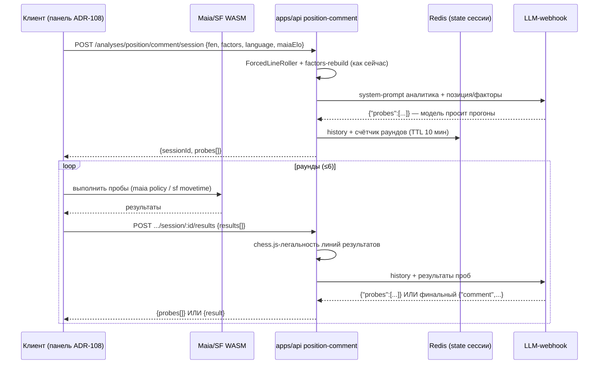

# ADR-164: Анализ позиции словами — LLM-оркестратор с прогонами клиентских Maia и Stockfish

**Дата:** 2026-07-13 (ревизия 2 — 13.07, KS-4939; ревизия 1 — KS-4937)
**Статус:** Предложено
**Задачи:** KS-4937, KS-4939
**Связанные ADR:** 108/108b (AI-комментарий позиции, UX), 096–099 (Maia в панели анализа), 124 (maia-core), 102/103/107 (LLM-конвейер factors)

---

## 1. Контекст

Запрос пользователя: комментарий позиции должен говорить **вариантами** — «человек здесь сыграет X, но это проваливается из-за Y; ключ — Z». Прототип контура проверен вручную (marketing, /tmp/maia-sf-comment-flow.md): правило — ни одного хода в тексте без прогона движком; побочные защиты требуют **дополнительных** прогонов по ходу разбора («1...Bxg7 → отдельный прогон»).

Видение пользователя (web, 13.07, уточнено в ходе KS-4939): **модель выступает аналитиком**. В шахматы она играет слабо, поэтому ей даются две справки: Maia — «какой ход здесь сыграет человек», Stockfish — «какой ход сильнейший и почему альтернатива опровергается». Модель сама решает, какие линии посмотреть, запрашивает прогоны столько раундов, сколько нужно (в лимитах), и лишь затем пишет текст. Однопроходная схема `variants[]` из ревизии 1 отклонена: она не позволяет модели заглянуть в побочную защиту, обнаруженную по ходу разбора.

Второе решение пользователя: **Maia и Stockfish считаются на клиенте** (браузер, WASM/ONNX).

Что уже есть и переиспользуется:

| Компонент | Где | Роль |
|---|---|---|
| Maia-3 ONNX в браузере | `useMaiaAnalysis` + `packages/maia-core` (browser), модель `apps/web/public/maia3/` | Исполнитель maia-проб; ELO — настройка пользователя (`analysis.maia.elo`) |
| Stockfish 18 WASM | `useStockfish` (`go movetime`, searchmoves, multipv) | Исполнитель sf-проб |
| LLM-webhook | `PositionCommentService.callWebhook` — уже принимает `history[]` (многоходовый диалог поддержан) | Мозг оркестратора |
| Парсер ответа модели | `parse-model-output.ts` (JSON-шейп comment/highlights/arrows, фолбэк на пустой) | Расширяется веткой `probes` |
| Лимиты/Redis | rate-limit ключи position-comment, `RedisService` | Хранилище состояния сессии + квоты |
| ForcedLineRoller + factors-rebuilder | серверные Maia-прокатка и пересборка factors | Без изменений, оркестратор стартует от `finalFen` |
| UI-панель | `AiPositionCommentPanel` + `useAiPositionComment` (ADR-108: состояния, кэш, 429) | Точка входа, расширяется стадией раундов |

## 2. Архитектура: цикл оркестратора

Роли: **модель** решает «что посмотреть»; **сервер** держит диалог и валидирует; **клиент** исполняет пробы движками.

Транспорт «сервер→клиент» — **HTTP-цикл, инициатор всегда клиент**: запросы прогонов сервер передаёт в теле ответа, результаты клиент приносит следующим POST. WebSocket не вводится (обоснование в §7).



### 2.1 Протокол проб (контракты в packages/shared, меняет backend)

```ts
interface EngineProbeRequest {
  id: string;                    // назначает модель, для соотнесения
  kind: 'maia' | 'sf';
  line: string[];                // uci-ходы от корневой FEN сессии ([] = сама позиция)
  movetimeMs?: number;           // только sf; сервер ограничивает cap'ом 3000
}
interface EngineProbeResult {
  id: string;
  ok: boolean;                   // false — движок недоступен/линия не выполнена
  // kind=maia:
  policy?: Array<{ uci: string; san: string; prob: number }>; // топ-5
  // kind=sf:
  evalCp?: number | null; mateIn?: number | null;
  pv?: string[];                 // ≤8 полуходов
}
// POST /analyses/position/comment/session  → { sessionId, probes[] } | { sessionId, result }
// POST /analyses/position/comment/session/:id/results { results[] }
//   → { probes[] } | { result } | 410 (сессия истекла)
```

Ответ модели серверу — тот же текстовый JSON-канал, что сейчас: либо `{"probes":[...]}`, либо финальный шейп `{"comment","highlights","arrows"}`. `parse-model-output.ts` получает ветку `probes`; невалидный JSON в середине сессии → сервер один раз переспрашивает («ответ не распознан, повтори в формате…»), повторный сбой → форс-финал (§2.3).

### 2.2 Лимиты (ENV, значения по умолчанию)

| Параметр | Значение | Мотив |
|---|---|---|
| Раундов на сессию | 6 | Прототип укладывался в 3–5 прогонов + запас на побочные защиты |
| Проб в раунде | 4 | Батч дешевле пинг-понга по одной |
| `movetimeMs` cap | 3000 | Клиентское устройство, раунд проб ≤ ~12 с |
| Wall-clock сессии | 150 с | Меньше таймаута webhook (180 с, ADR-108) |
| TTL state в Redis | 10 мин | Переживает паузу клиента, не копит мусор |
| Сессий параллельно на пользователя | 1 | Новая сессия закрывает старую |
| Квота rate-limit | 1 сессия = 1 запрос (20/мин, 200/день без изменений) | Раунды — не действия пользователя |

Каждый HTTP-запрос цикла держится один LLM-ход (5–20 с) — в пределах шлюза 180 с (KS-4924), паттерн синхронного ожидания не меняется.

### 2.3 Деградация

- **Лимит раундов/времени исчерпан** → сервер шлёт модели форс-промпт «заверши комментарий на собранных данных» → финальный текст. Пустой ответ — существующий state `empty`.
- **Клиент оборвался** (вкладка закрыта) → TTL уберёт state; продолжение после истечения → 410 → UI state `error` с retry (новая сессия).
- **Движок на клиенте недоступен для конкретной пробы** → `ok:false` в результате; модель предупреждена промптом: строить текст только на удавшихся пробах.
- **Webhook 5xx/timeout в середине** → существующий паттерн: пустой шейп, state `error`.
- **Модель прислала нелегальную линию в probe** → сервер (chess.js) не отправляет её клиенту, возвращает модели `ok:false, error:"illegal line"` — модель корректируется; это важно, потому что модель в шахматах слаба.

### 2.4 Prompt аналитика (ru/en, две локали как в ADR-108 §8)

Роль: «шахматный аналитик со справочными инструментами». Ключевые правила:
1. Maia-проба = «что сыграет человек уровня ~{elo}», sf-проба = «объективная сила хода и опровержение из pv».
2. **Ни один ход не попадает в текст без sf-пробы этой линии** (правило прототипа).
3. Начни с maia-пробы корня; проверь каждый человеческий кандидат sf-пробой; побочные защиты из pv — отдельными пробами при необходимости.
4. Бюджет: ≤6 раундов по ≤4 пробы — расходуй осмысленно.
5. Финал — структура «вероятный человеческий ход → почему проваливается → сильнейший план», без слов «engine/Maia», существующий JSON-шейп.

## 3. Клиент: исполнение проб

Новый хук `useEngineProbeSession` (frontend):
- ведёт цикл: старт сессии → получил `probes` → исполнение → POST results → повтор до `result`;
- maia-проба: `predictMoves` по FEN линии (chess.js доиграть `line`), elo из настройки;
- sf-проба: `useStockfish` c `go movetime` на позиции линии; последовательное исполнение (один инстанс WASM);
- AbortController: отмена пользователем прекращает цикл (сессия умрёт по TTL);
- прогресс наружу: `{round, totalRounds, probesDone, probesTotal}`.

UX — расширение `AiPositionCommentPanel` (новая панель не заводится): состояние `loading` детализируется — «Раунд 2/6: проверяю 3 линии…», отмена доступна всегда; честный текст ожидания (сессия до ~2 мин против 5–20 с у простого режима). Переключатель «глубокий разбор с вариантами» (localStorage): выключен или движки не загрузились → старый однопроходный запрос без проб (полная обратная совместимость эндпоинта `POST /analyses/position/comment`). Кэш ADR-108 — ключ дополняется признаком режима.

## 4. Backend: изменения position-comment

1. Контроллер: `POST …/session`, `POST …/session/:id/results` (JwtAuthGuard, существующие rate-ключи; списание квоты — при старте сессии).
2. `OrchestratorSessionService`: state в Redis (`position-comment:session:<id>` — history, roundCount, startedAt, rootFen), лимиты §2.2, форс-финал.
3. `parse-model-output.ts`: ветка `probes` + один re-ask на невалидный JSON.
4. Валидация: легальность каждой `line` (chess.js) в обе стороны — до клиента и в результатах.
5. Prompt-варианты analyst-ru/analyst-en рядом с существующими `short|long`.
6. Старый однопроходный путь не трогается — это фолбэк.

## 5. Декомпозиция (заменяет план ревизии 1; KS-4938 закрыть заменой на задачу 1)

| # | Задача | Владелец | Содержание | Зависит от |
|---|---|---|---|---|
| 1 | Оркестратор-протокол на сервере | backend | Контракты shared (§2.1), session-эндпоинты, Redis-state, лимиты, parse-ветка `probes`, legality-валидация, prompt аналитика ru/en, форс-финал, spec-тесты (лимит раундов, illegal line, невалидный JSON, 410) | — |
| 2 | Цикл проб на клиенте | frontend | `useEngineProbeSession`: цикл, исполнение maia/sf-проб по `line`, отмена, прогресс; интеграция в `useAiPositionComment` (режим, кэш-ключ) | 1 (контракты) |
| 3 | UI режима | frontend | Переключатель «глубокий разбор», прогресс раундов, честный индикатор длительности, disabled без WASM, i18n `analysis.aiComment.deep.*` | 2 |
| 4 | Приёмка | qa | Сквозной сценарий: сессия из ≥2 раундов, текст ссылается только на прогнанные линии; отмена в середине; обрыв (закрыть вкладку → новая сессия); WASM недоступен → фолбэк в однопроходный; 410 после TTL; лимиты 429 | 1–3 |

Критический путь 1 → 2 → 3 → 4.

## 6. Риски

| Риск | Митигирование |
|---|---|
| Модель зацикливается на пробах / жжёт раунды впустую | Жёсткий бюджет §2.2 + форс-финал; счётчик раундов в логе сервиса |
| Сессия до ~2 мин — пользователь уходит | Честный прогресс по раундам, отмена всегда доступна, дефолт режима обсуждаемый (вкл, метрика отказов покажет) |
| Слабое устройство: пробы медленные | movetime cap + пробы последовательны; таймаут исполнения раунда на клиенте → `ok:false` |
| Стоимость: 1 сессия = до 7 вызовов webhook | Квоты не меняются по счётчику пользователя, но global-лимит 2000/день считает вызовы webhook — вынести множитель в метрику и пересмотреть global-лимит после запуска |
| Невалидный/нешахматный вывод модели | JSON-протокол + re-ask + legality-фильтр сервера; в текст попадают только прогнанные линии |

## 7. Отклонённые альтернативы

- **Однопроходный `variants[]`** (ревизия 1 этого ADR) — отклонено пользователем: модель не может дозапросить побочную защиту, найденную по ходу разбора; текст получается по заранее собранному набору, а не по логике анализа.
- **WebSocket для канала сервер→клиент** — новый gateway, auth, reconnect ради пинг-понга раз в 5–20 с; HTTP-ответ с `probes` даёт тот же канал без новой инфраструктуры и дружит с existing rate-limit/шлюзом. Если появится стриминг текста — пересмотреть вместе с SSE.
- **Счёт Maia+SF на сервере** — решение пользователя «клиентские движки»; сервер один и слабый, поиск не масштабируется (инвариант KS-2433), latency поверх LLM-цикла.
- **Tool-calling API вместо текстового JSON-протокола** — webhook-контракт принимает `message+history` и возвращает текст; текстовый JSON-протокол работает поверх него без изменения webhook-инфраструктуры.
- **Персистентность сессий в PostgreSQL** — сессия эфемерна (минуты), Redis с TTL достаточен; отладка — логами сервиса.
