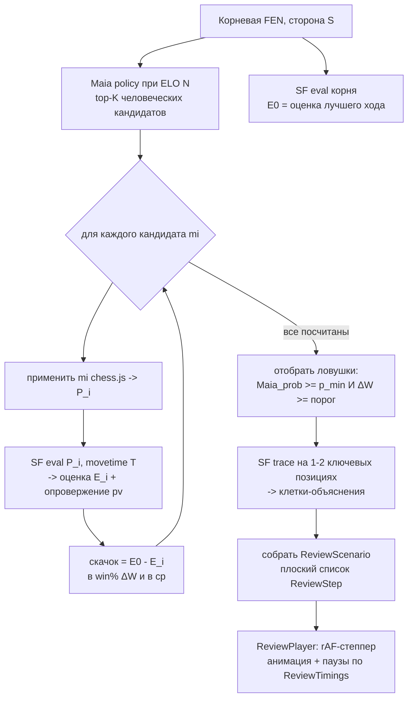
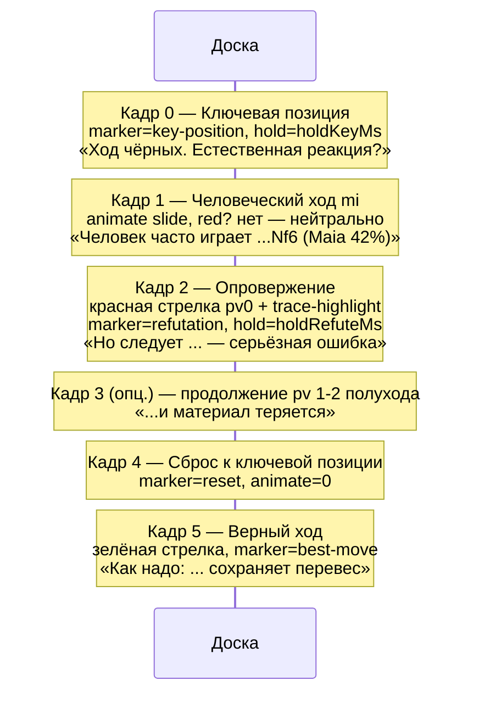
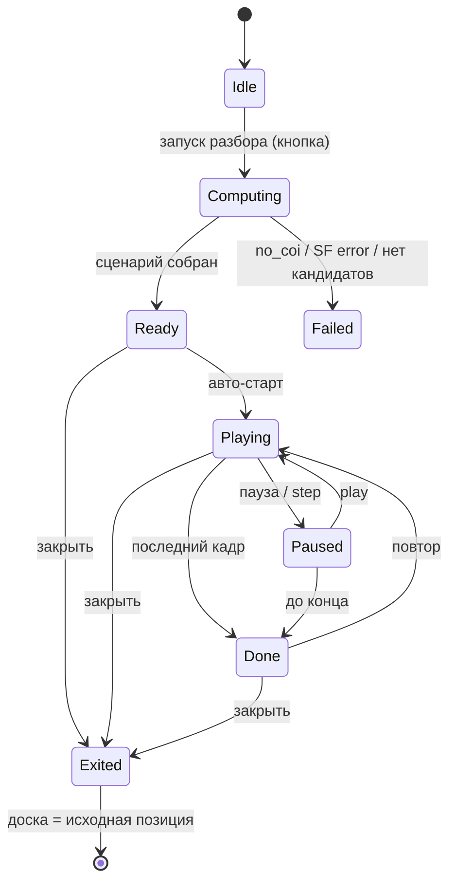

# ADR-165: Алгоритмический визуальный разбор позиции на фронте (Maia + Stockfish + trace), без LLM

**Дата:** 2026-07-14
**Статус:** Предложено
**Задача:** KS-4942
**Связанные ADR:** 164 (LLM-разбор словами — контраст), 108/108b (AI-overlay стрелок/подсветки), 100/101 (NAG-аннотация SF+Maia), 066/068/125 (WDL / ΔW-классификация ходов), 096/097/104/106 (Maia в анализе), 107/122 (positional trace без форка SF), 124 (maia-core), 143 (rAF-реплей уроков)

---

## 1. Контекст

LLM-разбор позиции (ADR-164) даёт нестабильное качество: модель галлюцинирует линии, требует правила «ни одного хода без прогона движком» и серверного конвейера. Отдельное решение (KS-4942): **разбор без модели**, полностью на фронте, детерминированно, инструментами, уже живущими в браузере проекта:

- **Maia** (`apps/web/src/lib/maia`, `useMaiaAnalysis`) — «что сыграет человек уровня N»: policy `{uci → prob}` при выбранном ELO.
- **Stockfish WASM** (`useStockfish`, `stockfish-18-lite`) — сила хода и опровержение: MultiPV, `score cp/mate`, `pv`, `bestmove`.
- **Stockfish trace** (`lib/review/stockfishTrace.ts`, `eval json`) — семантические термы с привязкой к клетке/цвету (висящая фигура, форпост, слабость короля).

Идея разбора: Maia даёт естественные человеческие ходы-кандидаты; на каждый Stockfish показывает опровержение; **резкий скачок оценки** = маркер «ловушка / ключевая позиция / опровержение». Итог — **визуальный проигрыш**: фигура двигается, нотация меняется, между ходами пауза (тайминги параметризуемы).

**Образец ручного аналога** (`AnalysisPage` + `useReviewState.makeVariantMove`): человек вводит ход-кандидат → chess.js применяет → доска показывает позицию ноды. Здесь то же самое, но кандидаты берёт Maia, а проигрывание автоматическое и не мутирует дерево партии.

**Текст комментариев не генерируется свободно** — он собирается из данных по шаблону (SAN хода + Maia% + тир скачка). Нелегальных/выдуманных ходов быть не может: каждый ход исходит из движка и валиден по построению. Это ключевое отличие от ADR-164.

---

## 2. Решение (обзор)

Разбор — двухфазный: тяжёлый **расчёт сценария** (Maia + SF, асинхронно, с прогрессом) и лёгкое **проигрывание кадров** (rAF-степпер с паузами). Фазы разделены, чтобы воспроизведение было плавным и не зависело от занятости движков.



Инвариант: разбор идёт на **отдельном chess.js-инстансе** (scratch), дерево партии `useReviewState` не трогается; на выходе доска возвращается к исходной позиции.

---

## 3. Источники данных на фронте (конкретно)

| Данные | Откуда | Как |
|---|---|---|
| Человеческие кандидаты | `useMaiaAnalysis` / `predictMovesBatch(fen, [eloSelf], [eloOppo])` | top-K по policy при ELO N; берём K=3–4 с `prob ≥ p_min` |
| Оценка корня E0 | `useStockfish` (или выделенный review-инстанс) | `position fen P0` → `go movetime T_root`; E0 = score лучшей линии MultiPV=1 |
| Оценка кандидата E_i + опровержение | тот же движок, серийно | `position fen P_i` → `go movetime T`; E_i = score, опровержение = `pv` (реплика соперника `pv[0]` и далее) |
| Объяснение (клетки) | `stockfishTrace.evalJson(fen)` | `PositionalSubterm[]` с `square`/`color`; в highlight идут термы угроз/слабостей ключевой позиции |
| UCI → SAN для подписей | `lib/maia/uciToSan.ts` | подпись хода в нотации |

**Движки — единственные экземпляры.** Maia (ONNX-worker) и Stockfish (WASM-worker) тяжёлые по памяти; трейс — третий SF-worker. Гоняем **фазами, не одновременно**: Фаза A — один прогон Maia (батч по ELO уже есть); Фаза B — **сериализованный** цикл SF по кандидатам (movetime фиксирован для воспроизводимости и предсказуемого времени); Фаза C — трейс только на 1–2 отобранных ключевых позициях. Смена позиции внутри цикла — существующий в `useStockfish` паттерн `stop → bestmove → isready → readyok → reposition` (`pendingFenRef`).

**Бюджет расчёта** (параметры): K=4, `T=400мс`, `T_root=500мс`, углублённая оценка ключевой позиции `T_deep=800мс`, трейс ~1–1.5с. Итого ~4–6с — под прогресс-индикатор «Разбираю позицию…». Отсутствие `crossOriginIsolated`/COI → SF недоступен (`no_coi`): разбор деградирует до «только Maia-кандидаты без оценки» либо блокируется с явным сообщением (см. §8).

---

## 4. Критерий «резкого скачка» оценки

Оценки нормализуем **от лица стороны, которая ходит в корне** (S). Mate → cp-клэмп (`±10000`). Основная метрика — **падение вероятности победы** (win%), она устойчивее сырых сантипешек и согласована с ADR-066/068/125 (ΔW/ΔD-классификация уже в проекте); cp — вторичная/для бейджа.

Пусть `W(cp)` — конверсия оценки в win% (та же кривая, что в существующей WDL-классификации). Для кандидата mi:

```
loss_cp_i = E0 - E_i                      # насколько хуже лучшего
ΔW_i      = W(E0) - W(E_i)                # падение win% (проценты)
```

`mi` помечается как **ловушка / ключевая позиция**, если одновременно:

1. **человек реально так сыграет:** `Maia_prob(mi) ≥ p_min` (default `0.10`);
2. **скачок значим:** `ΔW_i ≥ ΔW_swing` (default `25` п.п.) **или** появление мата за соперника, которого не было в E0.

Тиры подписи (вербально, без обязательного показа сырых cp — маппинг как в NAG ADR-100/101):

| Тир | Условие (any) | Ярлык |
|---|---|---|
| Зевок | `ΔW ≥ 40` п.п. или переход в проигрыш/мат | «теряет решающее преимущество» / «проигрывает» |
| Ошибка | `25 ≤ ΔW < 40` | «серьёзная ошибка» |
| Неточность | `12 ≤ ΔW < 25` | «неточность» (показываем опционально) |
| Норма | `ΔW < 12` | не ловушка |

**Отбор для сценария:** headline-ловушка = кандидат с максимальным `Maia_prob` среди прошедших порог (самый «человеческий» промах); дополнительно до 2 других ловушек. Всегда добавляем в конец **верный ход** (SF best из E0) как контраст. Если ни один кандидат не проходит порог → сценарий «ловушек нет»: показать лучший ход и короткое «естественные ходы не проигрывают».

Все пороги — в конфиге (`ReviewThresholds`), не хардкод.

---

## 5. Структура сценария и модель кадра

Сценарий — **плоский предвычисленный список кадров**. Степпер не считает ничего, только идёт по списку с паузами (как rAF-реплей в `LectureReplayPage`). Это разводит тяжёлый расчёт и плавное воспроизведение.

```ts
type ReviewMarker = 'key-position' | 'human-move' | 'refutation' | 'best-move' | 'reset';

type ReviewStep = {
  fen: string;                       // позиция ПОСЛЕ применения хода этого кадра
  move?: { from: string; to: string; promotion?: string; san: string };
  arrows?: Array<{ from: string; to: string; color: AiOverlayColor }>;   // напр. красная стрелка опровержения
  highlights?: Array<{ square: string; color: AiOverlayColor }>;         // ключевая клетка / trace-термы
  marker?: ReviewMarker;
  caption?: { ru: string; en: string };   // из шаблона: SAN + Maia% + тир
  badge?: { deltaW: number; cp: number };  // опциональный числовой бейдж
  animateMs: number;                 // длительность слайда фигуры этого кадра
  holdMs: number;                    // пауза после кадра
};

type ReviewScenario = {
  rootFen: string;
  orientation: 'white' | 'black';
  steps: ReviewStep[];
  meta: { eloUsed: number; candidatesEvaluated: number; trapsFound: number };
};
```

`fen` в каждом кадре самодостаточен — степпер выставляет `position` доски напрямую, откат/перемотка тривиальны, мутации дерева нет. Стрелки/подсветка переиспользуют слой AI-overlay (ADR-108b): типы `AiOverlayColor`, `HIGHLIGHT_COLORS`, палитра red/green/yellow.

---

## 6. Раскадровка (storyboard)

Для одной ловушки:



Несколько ловушек → блоки «Кадр 1–3» повторяются по каждому кандидату, затем один общий блок «Как надо» (Кадры 4–5). Ярлыки — из §4-тиров, значения (SAN, Maia%, ΔW) подставляются из данных; свободного текста нет.

---

## 7. Тайминги (параметризуемо)

```ts
type ReviewTimings = {
  animateMoveMs: number;   // слайд фигуры; совпадает с analysis (default 220)
  holdMoveMs: number;      // пауза после обычного хода (default 900)
  holdKeyMs: number;       // пауза на ключевой позиции (default 1600)
  holdRefuteMs: number;    // пауза на опровержении, чтобы прочитать (default 2200)
  resetMs: number;         // снап к ключевой позиции (default 0 — без анимации)
  betweenTrapsMs: number;  // пауза между блоками разных кандидатов (default 1000)
};
```

- Значения по умолчанию согласованы с `animationDurationInMs=200` анимации доски в проекте.
- `prefers-reduced-motion` → `animate*Ms=0`, `hold*` сокращаются, доступен пошаговый режим (Play/Pause/Step) вместо автопрогона.
- Скорость проигрывания — множитель 0.5×/1×/1.5×/2× применяется ко всем `hold*` и `animate*`.
- Тик — **requestAnimationFrame** (как `LectureReplayPage`, строка 354), не `setInterval`: пауза сравнивает накопленное время с `holdMs`; учитывает политику автоплея вкладки.

---

## 8. Состояние UI и режим разбора

Разбор — отдельный **режим доски**, не мутирующий `useReviewState`.



- **Computing:** прогресс «Разбираю: кандидат i из K» (движки заняты; кнопка «Отмена»).
- **Failed:** `no_coi` → «Движок недоступен в этом браузере»; кандидаты без оценки → деградация до показа Maia-ходов без разбора либо явный отказ (решение при реализации, MVP — отказ с сообщением).
- **UI поверх доски:** панель-контролы (Play/Pause, шаг вперёд/назад, повтор, скорость), строка-подпись текущего кадра (ярлык + SAN + Maia% + опц. бейдж ΔW), индикатор «сцена i из N».
- **Оверлеи** переиспользуют слой ADR-108b (`aiArrows`/`aiSquareStyles`), но живут в review-стейте, а не в `useAiPositionComment`; ремоунт `MemoChessboard` через расширение `annotationsKey` review-стрелками/FEN (иначе react-chessboard кэширует internal-arrows). Best-move зелёная и refutation красная стрелки существуют **только в review-режиме** — конфликта с текущими overlay нет (обычная доска в это время не активна).
- **Выход:** доска и ориентация возвращаются к исходной; scratch-инстанс отбрасывается.

---

## 9. Что переиспользуем, что новое

**Переиспользуем (без изменений):** `MemoChessboard` + `animationDurationInMs`, слоистые `arrows`/`squareStyles` и `HIGHLIGHT_COLORS`, `AiOverlayColor`/`toAnnotationColor` (ADR-108b), chess.js apply-UCI (`uci.slice`), `useMaiaAnalysis`/`predictMovesBatch`, `useStockfish` MultiPV/movetime/`parseInfoLine`/reposition-паттерн, `stockfishTrace.evalJson`, `uciToSan`, rAF-степпер из `LectureReplayPage`, паттерн задержки ответного хода из `TacticPuzzleRunner`.

**Новое:**
- `usePositionReview(fen, options)` — оркестратор фаз A→B→C, собирает `ReviewScenario`; владеет прогрессом/отменой.
- Типы `ReviewStep`/`ReviewScenario`/`ReviewTimings`/`ReviewThresholds` (в `apps/web`, при необходимости шеринга — `@kingside/shared`).
- `ReviewPlayer` — rAF-степпер по `steps` с `ReviewTimings`, состояния §8.
- UI: панель-контролы + строка-подпись + прогресс (frontend); стили/адаптив/`prefers-reduced-motion` (layout).
- Шаблоны подписей ru/en (детерминированные, из данных; i18n-ключи).

---

## 10. Риски

| Риск | Митигирование |
|---|---|
| Одновременная нагрузка Maia+SF+trace на слабом устройстве | Фазы последовательные; trace только на 1–2 позициях; фиксированный movetime; полный предрасчёт до проигрывания |
| Долгий расчёт (4–6с) | Прогресс-индикатор + «Отмена»; movetime/K параметризуемы; кэш результата по нормализованному FEN (как `useAiPositionComment`) |
| Нет COI → SF недоступен | Явное сообщение / деградация до Maia-only; не молчаливый сбой |
| Порог скачка «мажет» (ложные/пропущенные ловушки) | ΔW-метрика + тиры из ADR-066/100; пороги в конфиге, калибровка на 10–15 позициях (qa/content) |
| Maia-кандидаты дублируют SF-best (ловушек нет) | Явный сценарий «естественные ходы не проигрывают» + показ лучшего хода |
| react-chessboard кэширует стрелки при смене кадра | Review-стрелки/FEN в `annotationsKey` (паттерн ADR-108b §7.4) |

---

## 11. Резюме

Разбор позиции — **детерминированный, на фронте, без LLM**. Maia даёт человеческие кандидаты, Stockfish (сериализованно, фикс. movetime) — оценку и опровержение каждого, trace — клетки-объяснения ключевой позиции. **Скачок оценки** меряем падением win% `ΔW` (порог 25 п.п.) при `Maia_prob ≥ 0.10`; тиры-ярлыки из существующей NAG/WDL-шкалы. Результат — **плоский список кадров** `ReviewStep` (FEN + ход + стрелки/подсветка + подпись + тайминги), который rAF-степпер проигрывает как визуальную партию: фигура двигается, нотация меняется, паузы параметризуемы (`ReviewTimings`, учёт `prefers-reduced-motion`). Разбор идёт в отдельном режиме доски на scratch-инстансе, дерево партии не мутируется, на выходе доска возвращается к исходной. Переиспользуются доска, оверлей-слой ADR-108b, движки и rAF-реплей; новое — оркестратор `usePositionReview`, степпер `ReviewPlayer`, типы сценария и UI-контролы. Декомпозиция на задачи — за координатором.
