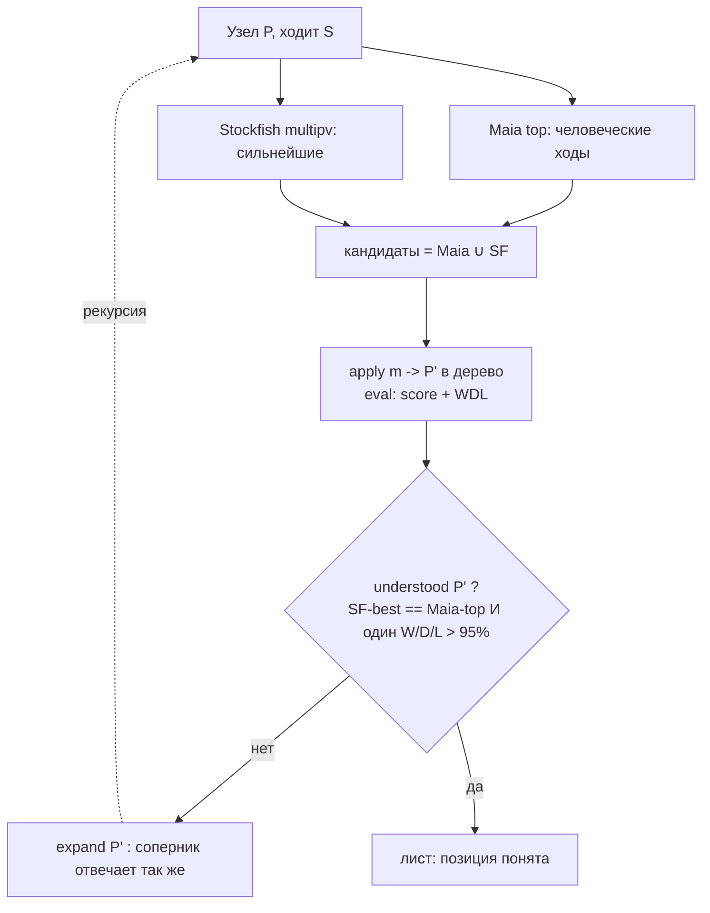

# ADR-165: Разбор позиции как симуляция человеческого анализа (Maia × Stockfish), без LLM

**Дата:** 2026-07-14 (rev3 — рекурсивный микс Maia/SF до «понятной» позиции; rev2 — запись в дерево; rev1 — scratch, отклонён)
**Статус:** Предложено
**Задача:** KS-4942
**Связанные ADR:** 164 (LLM-разбор — контраст), 066/068/125 (WDL / ΔW), 096/097/104/106 (Maia), 100/101 (NAG SF+Maia), 107/122 (trace), 124 (maia-core), 037/038 (аннотации/цвет вариаций), 008 (persistence дерева), 143 (rAF-реплей)

---

## 1. Суть

Разбор — **симуляция того, как позицию анализирует человек**, без LLM. Человек смотрит логичные ходы, вводит их, смотрит ответ соперника, так строит дерево вариантов. Эмулируем это:

- **Ход человека** = кандидат **Maia** (что реально сыграет игрок уровня N).
- **«Подсматривание» в движок** = сильнейший ход **Stockfish**; его тоже прогоняем по тому же алгоритму.
- Микс: «человек (Maia) сыграет X — движок отвечает Y — человек отвечает Z — оценка резко упала». Рекурсивно вглубь, соперник отвечает так же (его Maia-ход и его сильнейший SF-ход).

**Позиция «понята» (стоп рекурсии) — когда одновременно:**
1. сильнейший ход Stockfish **совпал** с топ-ходом Maia (движок и человек согласны, что играть);
2. оценка **стабилизировалась** — вероятность одного исхода **W, D или L > 95%**.

Резкие скачки оценки (человеческий ход расходится с движком и WDL проваливается) — **побочный продукт** рекурсии: там вешаем NAG/комментарий. Отдельного механизма «порогов ловушек» и фиксированной раскадровки нет — это было лишним (rev1/rev2), убрано.

Ходы разбора пишутся **в дерево партии как варианты** (требование rev2) — тем же путём, что ручной ввод.

**Образец ручного аналога:** `AnalysisPage` + `useReviewState.makeVariantMove` — человек вводит кандидат, узел ложится в дерево. Здесь то же, но кандидатов дают Maia и Stockfish, а обход автоматический.

---

## 2. Алгоритм (рекурсивное построение дерева)

Обход дерева в ширину/глубину от корня. Для узла-позиции `P` (сторона `S` ходит):

```
expand(P, depth):
  если depth >= MAX_DEPTH или understood(P): stop, пометить лист
  maiaMoves = Maia.top(P, eloN)          # 1-2 человеческих кандидата, prob >= p_min
  sfMoves   = Stockfish.multipv(P)       # 1-2 сильнейших хода
  candidates = dedup(maiaMoves ∪ sfMoves)   # микс ручного и машинного
  для каждого m in candidates:
    P' = apply(P, m)                     # ход в дерево (makeVariantMove)
    eval(P') -> score, wdl               # оценка + вероятности W/D/L
    аннотировать m: NAG/комментарий если ΔWDL относительно лучшего резко упал
    expand(P', depth+1)                  # соперник отвечает так же, вглубь
```

`understood(P)` = стоп-условие §4. Кандидаты — **объединение** Maia- и SF-ходов: если человек и движок предлагают разное, разбираются обе ветки (в этом смысл — «докопаться до сути»); если совпали — ветка одна и, вероятно, стоп.



Ограничители против взрыва дерева (безопасность, не суть): `MAX_DEPTH` (напр. 6 полуходов), `MAX_NODES` (напр. 40), ветвление ≤2 на источник. Всё — конфиг `ReviewLimits`.

---

## 3. Источники данных на фронте

| Данные | Откуда | Как |
|---|---|---|
| Человеческие кандидаты | `useMaiaAnalysis` / `predictMovesBatch(fen,[eloSelf],[eloOppo])` | top-1..2 по policy, `prob ≥ p_min` |
| Сильнейшие ходы | `useStockfish` MultiPV | top-1..2 из `pv`/`bestmove` |
| Оценка + WDL | `useStockfish` | `UCI_ShowWDL true` → `info … wdl w d l`; либо конверсия `score cp` в W/D/L по существующей WDL-кривой (ADR-066) |
| Объяснение (клетки) | `stockfishTrace.evalJson(fen)` | опц. — `highlights` на узле-ловушке |
| UCI → SAN | `lib/maia/uciToSan.ts` | подписи |

### 3.1 Порог «человеческого» хода Maia

Maia даёт распределение policy по легальным ходам `{uci → prob}`. Ход `m` считаем **человеческим кандидатом**, если выполнены **все** условия:

1. **абсолютный пол:** `prob(m) ≥ p_floor` (default `0.10`) — реже игрок этого уровня так почти не ходит;
2. **ядро (top-p):** `m` входит в отсортированный по убыванию набор, покрывающий кумулятивно `≥ p_nucleus` человеческой массы (default `0.85`);
3. **относительный пол:** `prob(m) ≥ rel · prob_top` (default `rel = 0.4`) — отсекает длинный хвост около главного хода;
4. **лимит:** не более `N_max` ходов на узел (default `2`).

Адаптивность: в форсированных позициях policy сконцентрирована (один ход ~90%) → берём один кандидат; в спокойных вероятность размазана → 1–2. Все пороги (`p_floor`, `p_nucleus`, `rel`, `N_max`) — конфиг `ReviewThresholds`, калибруются на 10–15 позициях. ELO Maia `N` = уровень игрока (по умолчанию рейтинг пользователя или 1500).

Движки — единственные экземпляры; работают **фазами**, не одновременно. Обход строит план заранее: цикл `expand` — это последовательные прогоны SF (фикс. movetime) и Maia; узлы копятся в `ReviewPlan`, потом проигрываются. Нет COI → SF недоступен (`no_coi`): деградация до Maia-only или отказ с сообщением.

---

## 4. Стоп-условие «позиция понятна»

На узле `P'` рекурсия ветки **останавливается**, когда **оба**:

1. **Совпадение человек↔движок:** `argmax Maia.policy(P') == Stockfish.bestmove(P')`.
2. **Стабильность исхода:** `max(P_W, P_D, P_L) > 0.95` (WDL из Stockfish).

Смысл: пока человек и движок расходятся или исход не определён — есть что разбирать, углубляемся. Как только оба играют одно и результат ясен (уверенный выигрыш/ничья/проигрыш) — позиция «понята», лист.

Аварийные стопы: `depth ≥ MAX_DEPTH`, `nodes ≥ MAX_NODES`, повтор позиции. Пороги (`p_min`, WDL 0.95, лимиты) — конфиг.

---

## 5. Запись в дерево (переиспользуем ручной путь)

Каждый `apply(P, m)` = `makeVariantMove(from, to, promo)` (`useReviewState.ts:380`):

- при совпадении с существующим продолжением — навигация (`GOTO_MOVE`), без дубля; иначе ветка кладётся `ADD_VARIATION` (или `ADD_MOVE` при пустом `next`). `currentMove` встаёт на новый узел → следующий ход продолжает эту ветку.
- возврат к точке ветвления — `gotoMove` по `globalIndex` (узел ищется заново: дерево иммутабельно).
- аннотации узла-ловушки: `setNag` (`?`/`??` при резком падении WDL) + `setComment` (шаблон: SAN + Maia% + исход) + `SET_ANNOTATIONS` (стрелка опровержения / trace-highlight). Всё сериализуется в PGN (ADR-037/038) и persist'ится с партией (ADR-008) — **разбор записан, не эфемерен**.

Диспатчи асинхронны → дерево строится **по одному полуходу за тик** проигрывателя, `globalIndex` нового узла берётся из снапшота `nextGlobalIndex`.

---

## 6. Проигрывание и тайминги

`ReviewPlayer` — rAF-степпер (как `LectureReplayPage`): применяет операции плана (`goto`/`move`/`annotate`) к `useReviewState` по одной за тик, с паузами. Доска анимирует смену `currentFen` штатно (`animationDurationInMs`).

```ts
type ReviewTimings = {
  animateMoveMs: number;  // слайд фигуры (default 220)
  holdMoveMs: number;     // пауза после хода (default 900)
  holdKeyMs: number;      // пауза на узле-развилке/ловушке (default 1800)
  resetMs: number;        // снап-возврат к развилке (default 0)
};
```

`prefers-reduced-motion` → `animate=0`, пошаговый режим. Скорость 0.5×–2× — множитель. Управление: Play/Pause/Step/повтор/скорость; строка-подпись = текущий комментарий; прогресс «узел i из N». На время автопроигрывания ручной ввод/навигация блокируются (кроме Pause/Step), чтобы не увести `currentMove` из-под степпера.

---

## 7. Ограничения и риски

| Риск | Митигирование |
|---|---|
| Взрыв дерева (рекурсия) | Стоп-условие §4 + жёсткие `MAX_DEPTH`/`MAX_NODES`/ветвление ≤2; повтор позиции → стоп |
| Долгий расчёт (много узлов × movetime) | Фикс. movetime; лимиты; прогресс + «Отмена» до записи; кэш плана по FEN |
| Maia+SF+trace по памяти | Фазы последовательные; trace опционален, на узлах-ловушках |
| Асинхронный dispatch → гонка | Один полуход за тик; `globalIndex` из снапшота; навигация по `globalIndex` |
| WDL недоступен в сборке SF | Фолбэк: конверсия `score cp` → W/D/L по существующей кривой (ADR-066) |
| Нет COI → SF | Явное сообщение / Maia-only |
| Дерево засоряется вариантами | Пользователь этого хочет (rev2); вставки помечены (цвет ADR-038) → удаление одним `deleteVariation` |

---

## 8. Резюме

Разбор — **симуляция человеческого анализа**: рекурсивно строим дерево, где кандидаты на каждом узле = **объединение** человеческих ходов **Maia** и сильнейших ходов **Stockfish**; соперник отвечает так же, вглубь. **Стоп, когда позиция «понята»:** сильнейший ход движка совпал с топом Maia **и** один исход W/D/L > 95%. Резкие падения WDL (человек разошёлся с движком) — побочно помечаются NAG/комментарием.

Ходы пишутся **в дерево партии как варианты** через ровно ручной путь `useReviewState` (`makeVariantMove` + `setNag`/`setComment`/`SET_ANNOTATIONS`), сохраняются с партией и сериализуются в PGN. Проигрыватель `ReviewPlayer` (rAF) применяет план по одному полуходу за тик с паузами (`ReviewTimings`, `prefers-reduced-motion`).

Источники — `useMaiaAnalysis`, `useStockfish` (MultiPV + WDL), `stockfishTrace` (опц.). Новое: оркестратор рекурсии `usePositionReview` (строит `ReviewPlan`), степпер `ReviewPlayer`, типы плана/лимитов, UI-контролы. Убрано из прежних ревизий: scratch-инстанс, фиксированные тир-пороги «ловушек» и жёсткая раскадровка сцен. Декомпозиция — за координатором.
