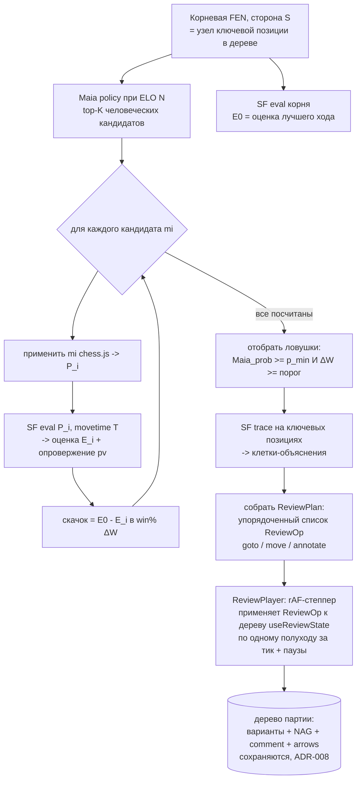
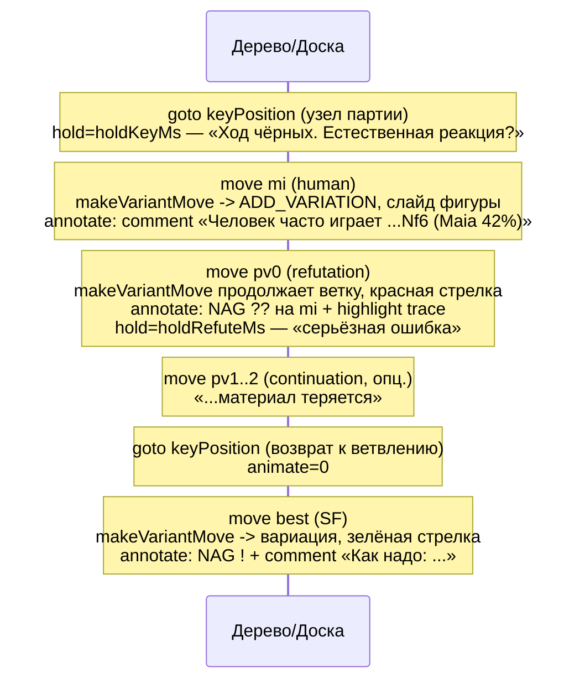
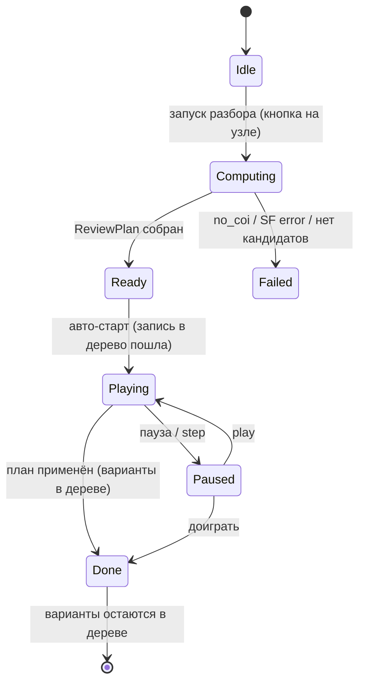

# ADR-165: Алгоритмический визуальный разбор позиции на фронте (Maia + Stockfish + trace), без LLM

**Дата:** 2026-07-14 (rev2 — запись в дерево партии; rev1 — scratch-инстанс, отклонён)
**Статус:** Предложено
**Задача:** KS-4942
**Связанные ADR:** 164 (LLM-разбор словами — контраст), 108/108b (AI-overlay стрелок/подсветки), 100/101 (NAG-аннотация SF+Maia), 066/068/125 (WDL / ΔW-классификация ходов), 096/097/104/106 (Maia в анализе), 107/122 (positional trace без форка SF), 124 (maia-core), 037/038 (аннотации/цвет вариаций), 008 (persistence дерева), 143 (rAF-реплей уроков)

---

## 1. Контекст

LLM-разбор позиции (ADR-164) даёт нестабильное качество: галлюцинации линий, требует правила «ни одного хода без прогона движком» и серверного конвейера. Отдельное решение (KS-4942): **разбор без модели**, полностью на фронте, детерминированно, инструментами, уже живущими в браузере:

- **Maia** (`apps/web/src/lib/maia`, `useMaiaAnalysis`) — «что сыграет человек уровня N»: policy `{uci → prob}` при выбранном ELO.
- **Stockfish WASM** (`useStockfish`, `stockfish-18-lite`) — сила хода и опровержение: MultiPV, `score cp/mate`, `pv`, `bestmove`.
- **Stockfish trace** (`lib/review/stockfishTrace.ts`, `eval json`) — семантические термы с привязкой к клетке/цвету (висящая фигура, форпост, слабость короля).

Идея: Maia даёт естественные человеческие ходы-кандидаты; на каждый Stockfish показывает опровержение; **резкий скачок оценки** = маркер «ловушка / ключевая позиция / опровержение». Итог — **визуальный проигрыш**: фигура двигается, нотация меняется, между ходами пауза (тайминги параметризуемы).

**Требование пользователя (rev2, ключевое):** основная цель фичи — **записывать анализ, идущий на доске, прямо в дерево партии**. Ходы разбора (кандидаты Maia + опровержения SF) должны попадать в дерево как **варианты**, а не проигрываться на отдельном scratch-инстансе. Разбор не эфемерный: после проигрывания варианты остаются в дереве, сохраняются с партией (ADR-008) и доступны для навигации, как если бы их ввёл человек.

**Образец ручного аналога** (`AnalysisPage` + `useReviewState.makeVariantMove`): человек вводит ход-кандидат → chess.js применяет → узел добавляется в дерево (`ADD_MOVE`/`ADD_VARIATION`), доска показывает позицию узла. Разбор делает **то же самое автоматически**: те же диспатчи, тот же путь записи в дерево, но ходы поставляют Maia и Stockfish, а проигрывание идёт само с паузами.

**Текст комментариев не генерируется свободно** — собирается из данных по шаблону (SAN хода + Maia% + тир скачка) и пишется в узел через `setComment`; NAG (`?`/`??`) — через `setNag`. Нелегальных/выдуманных ходов быть не может: каждый ход исходит из движка и валиден по построению.

---

## 2. Решение (обзор)

Разбор — двухфазный: **расчёт сценария** (Maia + SF, асинхронно, с прогрессом) даёт упорядоченный список операций над деревом; **проигрыватель** (rAF-степпер) применяет эти операции к **реальному дереву** `useReviewState` с анимацией и паузами. Каждая операция — существующий диспатч (`makeVariantMove`, `gotoMove`, `setNag`, `setComment`, `SET_ANNOTATIONS`), поэтому ходы разбора неотличимы от введённых человеком и наследуют persistence/навигацию/сериализацию в PGN.



Инвариант: разбор идёт по **реальному дереву**, ветвясь от узла ключевой позиции. Scratch-инстанса нет.

---

## 3. Источники данных на фронте (конкретно)

| Данные | Откуда | Как |
|---|---|---|
| Человеческие кандидаты | `useMaiaAnalysis` / `predictMovesBatch(fen, [eloSelf], [eloOppo])` | top-K по policy при ELO N; берём K=3–4 с `prob ≥ p_min` |
| Оценка корня E0 | `useStockfish` (или выделенный review-инстанс) | `position fen P0` → `go movetime T_root`; E0 = score лучшей линии MultiPV=1 |
| Оценка кандидата E_i + опровержение | тот же движок, серийно | `position fen P_i` → `go movetime T`; E_i = score, опровержение = `pv` |
| Объяснение (клетки) | `stockfishTrace.evalJson(fen)` | `PositionalSubterm[]` с `square`/`color` → в `highlights` узла |
| UCI → SAN для подписей | `lib/maia/uciToSan.ts` | подпись хода в нотации |

Расчёт (фазы, не одновременно, чтобы не грузить память): Фаза A — один прогон Maia; Фаза B — **сериализованный** цикл SF по кандидатам (фиксированный movetime, воспроизводимо); Фаза C — трейс на 1–2 отобранных позициях. Смена позиции внутри цикла — существующий паттерн `useStockfish` `stop → bestmove → isready → readyok → reposition`. Бюджет: K=4, `T=400мс`, `T_root=500мс`, `T_deep=800мс`, трейс ~1–1.5с → ~4–6с под прогресс. Нет COI → SF недоступен (`no_coi`): деградация до «только Maia-кандидаты без оценки» либо отказ с сообщением (§8).

**Расчёт отделён от записи:** Фаза B/C ничего в дерево не пишет — она формирует `ReviewPlan`. В дерево пишет только проигрыватель (§5). Это разводит тяжёлый движок и плавную запись, и позволяет посчитать весь план до первого хода на доске.

---

## 4. Критерий «резкого скачка» оценки

Оценки нормализуем **от лица стороны, ходящей в корне** (S). Mate → cp-клэмп (`±10000`). Основная метрика — **падение вероятности победы** (win%), устойчивее сырых сантипешек и согласована с ADR-066/068/125. `W(cp)` — существующая WDL-кривая.

```
loss_cp_i = E0 - E_i
ΔW_i      = W(E0) - W(E_i)     # падение win%, проценты
```

`mi` — **ловушка / ключевая позиция**, если одновременно:

1. **человек так сыграет:** `Maia_prob(mi) ≥ p_min` (default `0.10`);
2. **скачок значим:** `ΔW_i ≥ ΔW_swing` (default `25` п.п.) **или** появление мата за соперника, которого не было в E0.

Тиры → NAG + вербальный ярлык (маппинг как ADR-100/101):

| Тир | Условие (any) | NAG | Ярлык |
|---|---|---|---|
| Зевок | `ΔW ≥ 40` или переход в проигрыш/мат | `??` (4) | «теряет решающее преимущество» |
| Ошибка | `25 ≤ ΔW < 40` | `?` (2) | «серьёзная ошибка» |
| Неточность | `12 ≤ ΔW < 25` | `?!` (6) | «неточность» (опц.) |
| Норма | `ΔW < 12` | — | не ловушка |

Отбор: headline-ловушка = кандидат с максимальным `Maia_prob` среди прошедших порог; плюс до 2 других. В конец — **верный ход** (SF best, NAG `!`) как контраст. Ни один не прошёл → сценарий «естественные ходы не проигрывают» + показ лучшего хода. Пороги — в конфиге `ReviewThresholds`.

---

## 5. Модель плана и запись в дерево

План — упорядоченный список **операций над деревом**, каждая с таймингом. Проигрыватель применяет их по одной за тик к `useReviewState`.

```ts
type ReviewOp =
  | { kind: 'goto'; targetGlobalIndex: number | 'root';   // навигация к узлу (gotoMove/gotoFirst)
      animateMs: number; holdMs: number }
  | { kind: 'move'; uci: string;                          // makeVariantMove(from,to,promo)
      marker: 'human-move' | 'refutation' | 'best-move' | 'continuation';
      animateMs: number; holdMs: number }
  | { kind: 'annotate'; targetGlobalIndex: number;        // на только что добавленный узел
      nags?: number[]; comment?: string;                  // setNag / setComment
      annotations?: NodeAnnotations };                    // SET_ANNOTATIONS: arrows + highlights

type ReviewPlan = {
  keyPositionGlobalIndex: number | 'root';   // узел-точка ветвления
  orientation: 'white' | 'black';
  ops: ReviewOp[];
  meta: { eloUsed: number; candidatesEvaluated: number; trapsFound: number };
};
```

**Как ходы попадают в дерево (переиспользуем ровно ручной путь):**

- `makeVariantMove(from, to, promo)` (`useReviewState.ts:380`): применяет ход от `currentMove`. Если ход совпадает с существующим продолжением/вариацией — `GOTO_MOVE` (навигация без дубля); иначе первый ход от узла с уже существующим `next` идёт в `ADD_VARIATION` (новая ветка), при пустом `next` — `ADD_MOVE`. Кандидаты Maia от узла партии, у которого есть основное продолжение, естественно ложатся **вариациями**.
- После `ADD_VARIATION`/`ADD_MOVE` reducer ставит `currentMove` на новый узел → следующий `makeVariantMove` продолжает эту же ветку (опровержение соперника, далее pv). Так строится вся линия кандидата.
- Возврат к ключевой позиции перед следующим кандидатом — `goto` по `keyPositionGlobalIndex` (узел ищется по `globalIndex` заново: дерево иммутабельно пересобирается, ссылки на объекты узлов устаревают — навигация всегда по `globalIndex`, не по сохранённой ссылке).
- Аннотации: `setNag(globalIndex, [nag])` вешает `?`/`??` на ход-ловушку; `setComment(globalIndex, text)` — шаблонную подпись (SAN + Maia% + тир); `SET_ANNOTATIONS` кладёт `arrows` (красная стрелка опровержения / зелёная лучшего хода) и `highlights` (trace-клетки) на узел. Всё это уже сериализуется в PGN (ADR-037/038) и persist'ится с партией (ADR-008) — **разбор записан, а не эфемерен**.

**Асинхронность диспатчей — важно.** `makeVariantMove` читает `state.currentMove`/`state.nextGlobalIndex`, обновляемые через React-стейт асинхронно. Поэтому линия строится **по одному полуходу за тик** степпера (одна операция → один диспатч → ре-рендер → пауза → следующая операция), а не синхронным циклом. Пауза между ходами (§7) и есть окно, в котором стейт успевает осесть; `globalIndex` только что добавленного узла берётся из `nextGlobalIndex` снапшота перед `move` (детерминирован) для последующей `annotate`.

---

## 6. Раскадровка (storyboard)

Для одной ловушки, ветвясь от узла ключевой позиции:



Несколько ловушек → блок «human → refutation → continuation» повторяется по каждому кандидату (каждый — отдельная вариация от того же узла), затем общий блок «Как надо». Значения (SAN, Maia%, ΔW, тир) подставляются из данных; свободного текста нет. По завершении дерево содержит: под узлом ключевой позиции — по вариации на каждого кандидата с NAG/комментарием/стрелками, и вариацию лучшего хода.

---

## 7. Тайминги (параметризуемо)

```ts
type ReviewTimings = {
  animateMoveMs: number;   // слайд фигуры при добавлении узла (default 220, как analysis)
  holdMoveMs: number;      // пауза после обычного хода (default 900)
  holdKeyMs: number;       // пауза на ключевой позиции (default 1600)
  holdRefuteMs: number;    // пауза на опровержении (default 2200)
  resetMs: number;         // снап-возврат к ключевой позиции (default 0)
  betweenTrapsMs: number;  // пауза между кандидатами (default 1000)
};
```

- Анимация идёт **бесплатно**: доска (`AnalysisPage` boardOptions) уже анимирует смену `currentFen` через `animationDurationInMs`; добавление узла/навигация меняют `currentFen` → слайд. Мгновенный возврат к ключевой позиции — `suppressAnimationRef` (`resetMs=0`).
- `prefers-reduced-motion` → `animate*=0`, `hold*` сокращены, доступен пошаговый режим (Play/Pause/Step).
- Скорость 0.5×/1×/1.5×/2× — множитель ко всем `hold*`/`animate*`.
- Тик — **requestAnimationFrame** (как `LectureReplayPage:354`): накопленное время сравнивается с `holdMs`; учитывает паузу и autoplay-политику вкладки.

---

## 8. Состояние UI и режим разбора

Разбор — авто-режим над обычным деревом; отдельного полотна нет, работает та же доска и `useReviewState`.



- **Computing:** прогресс «Разбираю: кандидат i из K», кнопка «Отмена» (до записи в дерево ничего не меняется).
- **Failed:** `no_coi` → «Движок недоступен»; нет кандидатов сверх порога → сценарий «естественные ходы не проигрывают».
- **Playing:** ходы появляются в дереве в реальном времени, доска идёт по ним с паузами; курсор навигации в конце каждого блока прыгает на узел ветвления (`goto`). Пользователь видит, как строятся варианты — именно этого требует rev2.
- **Управление:** Play/Pause, шаг вперёд/назад (по операциям плана), повтор, скорость. Строка-подпись = текущий `comment`/ярлык; индикатор «операция i из N».
- **Идемпотентность повторного запуска:** `makeVariantMove` при совпадении хода навигирует, а не дублирует → повторный разбор той же позиции достраивает недостающее, не плодит копии линий.
- **Очистка (опционально):** вставленные разбором вариации помечаются (цвет вариации ADR-038 или маркер в комментарии), чтобы пользователь мог удалить их одним действием через существующий `deleteVariation`. Пользователь хочет запись — удаление добровольное.
- **Оверлеи** (стрелка опровержения/лучшего хода, trace-highlight) хранятся как `NodeAnnotations` узлов и рисуются штатным слоем `AnalysisPage` (last-move → аннотации узла); во время проигрывания активна аннотация текущего узла. Отдельный transient AI-overlay не нужен — всё идёт через персистентные аннотации дерева.

---

## 9. Что переиспользуем, что новое

**Переиспользуем (без изменений):** весь путь записи в дерево `useReviewState` (`makeVariantMove`, `gotoMove`/`gotoFirst`, `ADD_VARIATION`/`ADD_MOVE`/`GOTO_MOVE`, `setNag`, `setComment`, `SET_ANNOTATIONS`), поиск узла по `globalIndex`, сериализацию вариаций/комментариев/NAG в PGN и persistence (ADR-008/037/038), доску `MemoChessboard` + `animationDurationInMs` + слой аннотаций/стрелок, `useMaiaAnalysis`/`predictMovesBatch`, `useStockfish` (MultiPV/movetime/`parseInfoLine`/reposition), `stockfishTrace.evalJson`, `uciToSan`, rAF-степпер из `LectureReplayPage`.

**Новое:**
- `usePositionReview(keyNode, options)` — оркестратор фаз A→B→C, собирает `ReviewPlan` (движки, прогресс, отмена). Ничего в дерево не пишет.
- `ReviewPlayer` — rAF-степпер: применяет `ReviewOp` к `useReviewState` по одной операции за тик с `ReviewTimings`; состояния §8.
- Типы `ReviewOp`/`ReviewPlan`/`ReviewTimings`/`ReviewThresholds`.
- UI: кнопка запуска разбора на узле, панель-контролы (Play/Pause/Step/скорость/повтор), строка-подпись, прогресс (frontend); стили/адаптив/`prefers-reduced-motion` (layout).
- Шаблоны подписей ru/en (детерминированные, из данных; i18n-ключи).

---

## 10. Риски

| Риск | Митигирование |
|---|---|
| Разбор засоряет дерево вариациями | Пользователь этого хочет (rev2); вставки помечены (цвет/маркер) → удаление одним `deleteVariation`; идемпотентность повторного запуска |
| Асинхронный `dispatch` → гонка при построении линии | Одна операция за тик степпера; `globalIndex` нового узла из снапшота `nextGlobalIndex`; навигация по `globalIndex`, не по ссылке на узел |
| Одновременная нагрузка Maia+SF+trace | Фазы последовательные; trace на 1–2 позициях; фикс. movetime; полный расчёт плана до первого хода |
| Долгий расчёт (4–6с) | Прогресс + «Отмена» (до записи в дерево); movetime/K в конфиге; кэш плана по нормализованному FEN |
| Нет COI → SF недоступен | Явное сообщение / деградация до Maia-only |
| Порог скачка «мажет» | ΔW-метрика + тиры ADR-066/100; пороги в конфиге; калибровка на 10–15 позициях (qa/content) |
| Конфликт разбора с ручным вводом во время проигрывания | На время Playing ввод ходов/навигация блокируются (кроме Pause/Step), чтобы `currentMove` не увели из-под степпера |

---

## 11. Резюме

Разбор — **детерминированный, на фронте, без LLM**, и его результат **записывается в дерево партии как варианты** (требование rev2), а не в scratch. Maia даёт человеческие кандидаты, Stockfish (сериализованно, фикс. movetime) — оценку и опровержение каждого, trace — клетки-объяснения. **Скачок** меряем падением win% `ΔW` (порог 25 п.п.) при `Maia_prob ≥ 0.10`; тиры → NAG (`?`/`??`/`!`) + ярлык.

Расчёт (Maia+SF) отделён от записи: даёт `ReviewPlan` — список операций `goto`/`move`/`annotate`. Проигрыватель (`ReviewPlayer`, rAF-степпер) применяет их к реальному `useReviewState` по одному полуходу за тик с паузами: `makeVariantMove` кладёт кандидатов вариациями от узла ключевой позиции, `setNag`/`setComment`/`SET_ANNOTATIONS` вешают оценку/подпись/стрелки. Ходы разбора неотличимы от введённых человеком, сохраняются с партией и сериализуются в PGN (ADR-008/037/038). Визуально: фигура двигается, нотация меняется, паузы параметризуемы (`ReviewTimings`, `prefers-reduced-motion`).

Переиспользуется весь путь записи в дерево, доска, движки, rAF-реплей; новое — оркестратор `usePositionReview`, степпер `ReviewPlayer`, типы плана и UI-контролы. Декомпозиция на задачи — за координатором.
