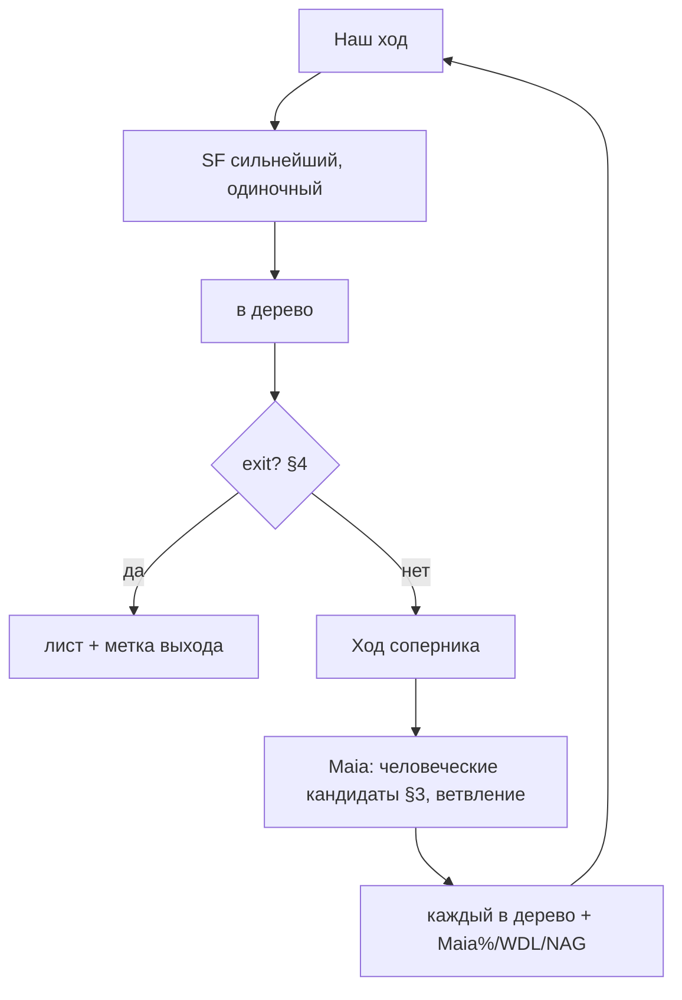

# ADR-165: Алгоритмическое дерево для тренировки дебютного репертуара (наш SF × соперник Maia), без LLM

**Дата:** 2026-07-14 (rev4 — KS-4951: тренировка репертуара, полное дерево, явные точки выхода; rev3 — рекурсивный микс Maia∪SF; rev2 — запись в дерево; rev1 — scratch, отклонён)
**Статус:** Принято (rev1–3), rev4 — Предложено
**Задачи:** KS-4942, KS-4951
**Связанные ADR:** 164 (серверный преразбор — общий движок), 077/078/084 (opening-trainer), 090/146 (репертуар), 066/068/125 (WDL / ΔW), 096/097/104/106 (Maia), 100/101 (NAG SF+Maia), 124 (maia-core), 037/038 (аннотации/PGN), 008 (persistence дерева), 143 (rAF-реплей)

---

## 1. Суть и смена цели (rev4)

Цель фичи уточнена пользователем: строим PGN-дерево для **тренировки дебютного репертуара**. Не «разбор одной позиции вообще», а дерево «как отвечать на попытки соперника из дебюта, до момента когда позиция понятна».

**Роли асимметричны (уже реализовано, сохраняем):**
- **За разбираемую сторону (наша) — сильнейший ход Stockfish, одиночная линия, без альтернатив.** Мы учим один правильный ответ.
- **За соперника — вероятные человеческие ходы Maia, ветвление.** Перебираем реалистичные попытки соперника.

Без LLM: ходы детерминированы движками, текст меток — шаблоном.

**Проблемы текущего дерева (пример /tmp/KS-4951-example.pgn), которые rev4 чинит:**
1. **Ветки обрываются на ходе соперника** — напр. `(12. h3)`, `(12. Nd2 $2 {…})` заканчиваются ходом соперника без нашего ответа. Тренировать нечего: непонятно, что делать.
2. **Непонятно, почему ветка кончилась** — точки выхода не обозначены.
3. **Дерево режется лимитом** — множество веток обрывается на 12-м ходу (упор в `maxDepth`/`maxNodes`), а не в логическом конце дебюта.

---

## 2. Алгоритм (пересмотр)

Обход дерева от корневой позиции. Инвариант очередности: **ветка никогда не заканчивается ходом соперника** — после хода соперника всегда идёт наш SF-ответ, и только на нашем ходе проверяется завершение.

```
build(P):                                   # P — позиция, чей-то ход
  если ходит НАША сторона:
    m = Stockfish.bestmove(P)               # одиночный сильнейший
    P' = apply(P, m)                        # наш ход в дерево (main-линия ветки)
    если exit(P') != none:                  # проверка выхода ТОЛЬКО после нашего хода
        пометить лист меткой exit(P'); stop
    build(P')                               # иначе продолжаем — ход соперника
  если ходит СОПЕРНИК:
    moves = Maia.human(P)                    # ветвление: человеческие кандидаты (§3)
    для каждого o in moves:
      P' = apply(P, o)                       # ход соперника (вариация)
      eval(P') -> score, wdl                 # для метки/NAG
      аннотировать o: Maia% + WDL, NAG если ошибка
      build(P')                              # ОБЯЗАТЕЛЬНО наш ответ дальше — не обрываем
```

Ключевое отличие от rev3: роли асимметричны (наш = 1 SF, соперник = K Maia), и `exit()` вычисляется **только на нашем ходе**, поэтому листья всегда — наши ходы (или помеченные предохранителем, §5). Ход соперника без нашего ответа в дереве невозможен.



---

## 3. Ветвление соперника (порог Maia) — пересмотр

Ветвим по человеческим ходам соперника через **покрытие (nucleus)**, а не фиксированный маленький K:

- сортируем policy по убыванию, берём ходы, пока кумулятивно не покрыто `p_cover` человеческой массы (default `0.90`);
- абсолютный пол `prob ≥ p_floor` (default `0.08`) — отсечь длинный хвост;
- жёсткий потолок ширины `K_max` на узел (default `3`) — против взрыва;
- если policy сконцентрирована (один ход ~90%) — одна ветка (форсировано).

Цель: покрыть **реалистичные** попытки соперника (то, на что игрок и правда наткнётся), не размазываясь на экзотику. Пороги — конфиг.

---

## 4. Точки выхода: «логический конец дебютной ветки»

Ветка (лист) завершается **только после нашего хода**, когда выполнено одно из условий. Каждый лист **обязательно помечается** причиной — машинный тег в PGN-комментарии `[%exit <kind>]` + локализованный текст (+ NAG где уместно). Фронт парсит тег и показывает причину/стиль.

| Код | Условие (после нашего SF-хода) | Метка PGN | Смысл для тренировки |
|---|---|---|---|
| **theory** | Позиция стабильна: WDL в некритичной зоне (near-equal, ADR-066) **и** у соперника не осталось расходящихся человеческих альтернатив выше порога (Maia сошлась к одному естеств. ходу) **или** достигнут горизонт дебюта (обе стороны развились/рокировали) | `{[%exit theory] дебют пройден}` | Теория кончилась, дальше игра по плану |
| **refuted** | Ход соперника был ошибкой, наш ответ даёт решающий перевес (WDL за нас ≥ `decisive`, default 0.90); доигрываем 1–2 конвертирующих хода | `{[%exit refuted] +-}` + NAG `$2`/`$4` на ход соперника | Наказание за ошибку показано до ясного перевеса |
| **transposition** | Нормализованный FEN уже есть в дереве | `{[%exit transposition] → <ветка>}` | Перестановка, учить отдельно не нужно |
| **forced** | Единственный человеческий ход соперника и оценка стабильна (частный случай theory) | `{[%exit theory] вынужденно}` | Однозначное продолжение |
| **limit** (предохранитель) | Достигнут `maxPly`/`maxNodes` (§5) | `{[%exit limit] обрыв по лимиту}` | Ветка НЕ достроена — сигнал расширить, не тихий конец |

`exit()` возвращает первый сработавший код в порядке: transposition → refuted → theory → (limit проверяется отдельно как предохранитель). Определения `decisive`/near-equal берём из существующей WDL-классификации (ADR-066/125). Все пороги — конфиг.

---

## 5. Лимиты — пересмотр под полноту

Прежние `maxDepth=6`/`maxNodes`, режущие реальную теорию, **заменяются**: глубину ветки определяют условия выхода §4, а не фиксированный потолок. Ширину держит nucleus-порог §3.

Предохранители остаются, но **щедрые и явные**:
- `maxPly` (default 30 полуходов), `maxNodes` (default 200) — при достижении лист помечается `[%exit limit]` (виден пользователю как незавершённый), а не молча обрывается;
- повтор позиции → `transposition` (не бесконечная рекурсия).

**Полнота тренировочного дерева** = каждый человеческий ход соперника (проходящий §3) получил наш ответ, и каждая ветка завершилась `theory`/`refuted`/`transposition`. Число листьев `limit` — метрика неполноты: показываем пользователю «N веток не достроено (лимит)», чтобы он мог расширить бюджет. Не тихая обрезка.

---

## 6. Запись в дерево и проигрывание (без изменений от rev2/rev3)

Ходы пишутся в дерево партии как варианты через ручной путь `useReviewState` (`makeVariantMove` + `setNag`/`setComment` для меток выхода и Maia%/WDL + `SET_ANNOTATIONS` для стрелок). Сериализуется в PGN (ADR-037/038), грузится назад через `LOAD_FROM_PGN`, persist ADR-008. Метки выхода `[%exit …]` живут в комментариях узлов-листьев.

Проигрывание — rAF-степпер `ReviewPlayer` по одному полуходу за тик с паузами (`ReviewTimings`: `animateMoveMs≈220`, `holdMoveMs≈900`, `resetMs=0`), `prefers-reduced-motion`. Источники: `useMaiaAnalysis` (человеческие ходы соперника), `useStockfish` (наш сильнейший + WDL). Расчёт отделён от записи: строим план дерева → проигрыватель применяет.

---

## 7. Декомпозиция (frontend)

| # | Задача | Содержание | Метки |
|---|---|---|---|
| 1 | Асимметричная генерация + инвариант очередности | Наш ход = 1 SF-best (без альтернатив); ход соперника = Maia-ветвление §3; после хода соперника ВСЕГДА наш ответ; `exit()` проверяется только на нашем ходе → листьев-ходов соперника нет | `analysis`, `stockfish` |
| 2 | Точки выхода §4 | Реализовать `exit()` (theory/refuted/transposition/forced) + пометку листа `[%exit …]` тегом в комментарии + NAG; near-equal/decisive из WDL-классификации | `analysis` |
| 3 | Пересмотр лимитов §5 | Убрать `maxDepth`; глубина от `exit()`; nucleus-ветвление §3; щедрые `maxPly`/`maxNodes` с явной меткой `limit`; детект перестановок по норм. FEN | `analysis` |
| 4 | Отображение выхода | Парс `[%exit …]` из комментария узла; показ причины завершения ветки в дереве/подписи; индикатор «N веток не достроено (лимит)» | `analysis` |
| 5 | Конфиг + калибровка + тесты | Пороги (`p_cover`,`p_floor`,`K_max`,`decisive`, near-equal band, `maxPly`,`maxNodes`) в конфиг; тест на примере /tmp/KS-4951-example.pgn: нет листьев-ходов соперника, каждый лист помечен, глубина не режется на 12-м ходу | `analysis`, `tests` |

Зависимости: 1 → 2 → 3 → 4; 5 сквозная. Backend не затронут (серверный аналог — ADR-164 rev5, общий движок).

---

## 8. Резюме

Дерево — для **тренировки дебютного репертуара**. Роли асимметричны: **наша сторона — одиночный сильнейший ход Stockfish, соперник — человеческие ходы Maia с ветвлением** (по nucleus-покрытию, §3). **Ветка никогда не кончается ходом соперника**: после его хода всегда идёт наш ответ, завершение проверяется только на нашем ходе. Каждый лист **обязательно помечен причиной выхода** `[%exit theory|refuted|transposition|limit]` (§4) — «логический конец дебюта»: позиция стабильна и альтернатив нет, либо ошибка наказана до перевеса, либо перестановка. Прежние режущие `maxDepth`/`maxNodes` заменены: глубину задают условия выхода, предохранители щедрые и **явно помечают** недостроенные ветки (`limit`), число которых показывается как неполнота. Запись/проигрывание/источники — без изменений (дерево партии, `LOAD_FROM_PGN`, rAF-степпер, Maia+SF). Правки — только frontend (§7).
