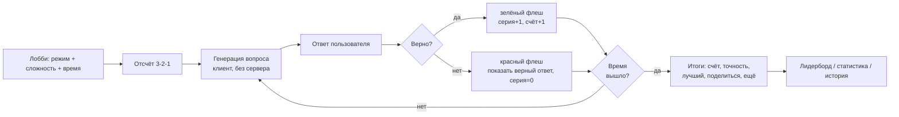

# ADR-167: Игровой тренажёр «зрения доски» (board vision, по мотивам DarkSquares)

**Дата:** 2026-07-18
**Статус:** Предложено
**Задача:** KS-4980
**Связанные ADR:** 088 (blind-board / слепая доска), 035 §11 (drill-шаг), puzzle-rush

---

## 1. Контекст и запрос

Запрос пользователя (Telegram): сделать аналог сайта **DarkSquares** — игровой
тренажёр, где пользователь вслепую угадывает клетки и геометрию фигур (цвет
клетки, координаты, линии/диагонали между полями, маршруты фигур).

Референс DarkSquares — прогрессия уровней board vision: цвет клетки → координаты →
маршруты фигур (конь/слон/ладья/ферзь) → квадранты/диагонали → knight maze →
слепая игра. Правило цвета: `a=1..h=8`; сумма номера файла и ранга: нечётная →
светлая, чётная → тёмная (h1 светлая, a1 тёмная).

### 1.1 Граница с существующим blind-board (ADR-088) — ключевое

В Kingside **уже есть** фича `blind-board` (ADR-088): запомнить расстановку →
скрыть фигуры → отвечать «какая фигура ходит на клетку X» с level-up и
лидербордом. Это **верхний** уровень слепой игры (память позиции + счёт ходов).

Новый тренажёр покрывает **фундамент**, которого в blind-board нет: атомарное,
скоростное распознавание клеток без запоминания позиции — цвет, координата,
геометрия. Это не дубликат, а **нижние ступени той же лестницы**. Оба образуют
прогрессию: **Vision (атомы) → Blind-board (позиция вслепую)**. Их надо
кросс-линковать в общий раздел «Тренировка зрения».

Отдельная фича (а не режим внутри blind-board): другой игровой цикл (rapid-fire
без позиции), другая генерация (комбинаторика клеток, не расстановка фигур),
другой прогресс — смешивать в один runner дороже, чем разнести.

## 2. Механика и режимы

Каждый режим — тип «челленджа»: система показывает вопрос, пользователь отвечает,
мгновенная обратная связь, следующий вопрос. Доска — **пустая**
(`8/8/8/8/8/8/8/8`), нотация скрыта на средних/высоких уровнях.

| # | Режим | Вопрос | Ответ |
|---|-------|--------|-------|
| 1 | Цвет клетки | координата «f6» (текст) или подсвеченная клетка | 2 кнопки: светлая / тёмная |
| 2 | Найди клетку | координата «c4» | клик по правильной клетке пустой доски |
| 3 | Назови клетку | подсвеченная клетка | ввод координаты (пикер файл+ранг или клавиатура) |
| 4 | Отношение | две подсвеченные клетки | Да/Нет: одна диагональ / вертикаль / горизонталь / один цвет |
| 5 | Геометрия фигуры | «Бьёт ли конь с b1 клетку c3?» / «есть ли диагональ слона c1→h6?» | Да/Нет (или клик целевых клеток) |
| 6 | Knight maze (стретч) | кратчайший путь конём A→B | последовательность кликов |

Генерация и проверка режимов 4–6 — на существующих утилитах геометрии (§4), без
движка. Цвет клетки — чистая чётность `(fileIdx+rankIdx)`, без движка и без БД.

### 2.1 Сложность (прогрессия уровней)

Оси сложности, комбинируются в уровни 1..N (аналог DarkSquares):
- **Нотация**: показана → скрыта.
- **Ориентация доски**: всегда белые → случайный переворот (белые/чёрные).
- **Тайм-прессинг**: цель — ответ быстрее N секунд; лимит времени на вопрос.
- **Микс режимов**: один режим → случайная смесь.

## 3. Игровой цикл

Два формата счёта, оба переиспользуют существующие паттерны (§4):

- **Sprint** (основной, как chess.com Vision / TacticDrillSprint / PuzzleRush):
  фиксированное время (30/60/120 с), максимизировать число верных; метрики —
  счёт, точность, макс. серия, среднее время ответа.
- **Streak/level** (как blind-board): бесконечно до первой ошибки, сложность
  растёт; метрика — длина серии / достигнутый уровень.

Рекомендация: **начать со Sprint** (одна ось счёта, проще лидерборд), streak —
вторым этапом.



## 4. Переиспользование существующего кода

| Что | Откуда | Как |
|-----|--------|-----|
| Доска | `apps/web/src/components/MemoChessboard.tsx` | пустой FEN, `showNotation=false`, `squareStyles` для подсветки, `onSquareClick` для режимов 2/6 |
| Подсветка клеток (роли/цвета) | `components/drills/DrillBoard.tsx` (`ROLE_STYLE`, `HIGHLIGHT_STYLE`) | взять стили подсветки target/correct/wrong |
| Геометрия и координаты | `packages/shared/src/utils/blind-board/move-gen.ts` (`parseSquare`, `makeSquare`, `attacks`, `geometricMoves`, `dirsFor`, `ROOK/BISHOP/QUEEN_DIRS`) | генерация и валидация режимов 4/5/6 — **verbatim**, новый движок не нужен |
| Цвет клетки | нет утилиты | добавить крошечный `isDarkSquare(sq)` в shared (`(file+rank)%2`) |
| Таймер / серия / авто-переход / стейт-машина ответа | `pages/PuzzleRushPage.tsx`, `components/drills/DrillRunner.tsx`, `DrillSprintPlayPage.tsx` | паттерн `setInterval`-тик, feedback-стейт, `autoNextDelay*` |
| Звуки | `hooks/useDrillSounds.ts` | correct/wrong |
| Модель результата + лидерборд + stats | `TacticDrillSprintScore` (schema.prisma) + `blind-board.controller` (`leaderboard`, `stats/me`, `history`) | форма API и модели |
| Sub-nav / stats / trends / history страницы | `components/blindBoard/*`, `apps/web/src/api/blindBoardApi.ts` | зеркалить структуру |
| Гостевой режим | `PuzzleRushPage` guest-ветки | играть без входа, без сохранения |

Новое: генераторы челленджей по режимам, компоненты ответа (кнопки цвета,
пикер координаты), runner тренажёра, страницы лобби/итогов/лидерборда/статистики,
модель `VisionScore`, стили.

## 5. Граница backend / frontend

**Принцип:** генерация и оценка — на клиенте; сервер только хранит итог и отдаёт
лидерборд/статистику. Обоснование — в отличие от puzzle-rush/tactic-drill,
контент здесь не требует БД задач и движка: это чистая комбинаторика клеток,
детерминированно генерируемая в браузере. Это минимизирует нагрузку на сервер
(один разработчик, ограниченные ресурсы) — нет пер-вопросных round-trip'ов.

- **Frontend**: генерирует вопросы, даёт мгновенную обратную связь, считает
  счёт/точность/серию за сессию.
- **Backend** (тонкий модуль `vision`): один `POST /vision/results` с итогом
  сессии; `GET /vision/leaderboard`, `GET /vision/stats/me`, `GET /vision/history`.
  Redis-кэш лидерборда (как puzzle-rush/tactic-drill). Пер-вопросного эндпоинта
  нет.
- **Гость**: играет полностью на клиенте, результат не сохраняется (как
  puzzle-rush guest).

### 5.1 Формат хранимых данных

Новая модель Prisma (owner — backend):

```
model VisionScore {
  id             uuid  @id
  userId         uuid? // null = гость не сохраняется; поле для авторизованных
  mode           String   // 'color' | 'find' | 'name' | 'relation' | 'geometry' | 'mixed'
  timeMode       String   // '30s' | '60s' | '120s'
  difficulty     Int      // уровень 1..N
  score          Int      // верных ответов
  total          Int      // всего вопросов
  accuracy       Float    // 0..1
  maxStreak      Int
  avgResponseMs  Int
  createdAt      DateTime @default(now())
  @@index([mode, timeMode, score])
  @@index([userId, createdAt])
}
```

### 5.2 Доверие к лидерборду

Клиентская генерация и подсчёт → результат в принципе подделываем. Лидерборд —
«тренировочного» класса (как typing-тесты), не рейтинговый. Анти-чит
(серверный RNG-seed + реплей ответов для верификации) — **отложено**, вводить
только при реальном злоупотреблении. Это зафиксировано осознанно ради простоты.

## 6. UX / раскадровка

1. **Лобби** `/vision`: выбор режима (карточки), сложности, времени; кнопка
   «Начать»; вкладки Лидерборд / Статистика / Как это работает. Sub-nav как в
   blind-board.
2. **Отсчёт**: 3-2-1.
3. **Игра**: сверху — время/счёт/серия; центр — карточка вопроса + пустая доска;
   низ — контролы ответа (кнопки цвета / пикер координаты / Да-Нет / клик по
   доске). Флеш зелёный/красный, при ошибке — показ верного ответа на доске.
4. **Итоги**: счёт, точность, средняя скорость, лучший результат, «Поделиться»,
   «Ещё раз», «Сменить режим».
5. **Лидерборд / Статистика / История**: как blind-board (тренды, разбивки по
   режимам).
6. **Кросс-линк**: из итогов и лобби — ссылка на blind-board как «следующая
   ступень».

## 7. Декомпозиция и грубые оценки

| # | Задача | Владелец | Содержание | Оценка |
|---|--------|----------|------------|--------|
| 1 | Shared: типы + генераторы | backend (shared) | типы режимов/результата в `packages/shared`; `isDarkSquare`; генераторы и валидаторы челленджей на `move-gen.ts` | 0.5–1 д |
| 2 | Backend: модуль `vision` | backend | миграция `VisionScore`; `POST /vision/results`, `GET leaderboard/stats/me/history`; Redis-кэш лидерборда | 1–1.5 д |
| 3 | Frontend: runner + режимы 1–5 | frontend | лобби, стейт-машина цикла, таймер/серия, контролы ответа, feedback, итоги; гостевой режим; звуки | 2.5–3 д |
| 4 | Frontend: лидерборд/статистика/история | frontend | страницы + sub-nav + API-слой (зеркало blindBoardApi) | 1 д |
| 5 | Layout: стили | layout | `board-vision.css`, адаптив, мобильные контролы ответа, анимации флеша/отсчёта | 0.5–1 д |
| 6 | QA: e2e | qa | лобби → игра → итог → сохранение результата → лидерборд; гость | 0.5 д |
| 7 | Knight maze (стретч) | frontend | режим 6 отдельной задачей после базового цикла | ~1 д |

Порядок: 1 → 2 (парал. с 1 после типов) → 3 → 4 → 5 → 6; 7 отдельно.

## 8. Отклонённые альтернативы

- **Режим внутри blind-board** — другой цикл/генерация/прогресс; смешивание
  runner'ов дороже отдельной фичи; провенанс прогрессии теряется.
- **Серверная генерация вопросов (как puzzle-rush)** — не нужна БД задач и
  движок; чистая комбинаторика дешевле на клиенте; экономит серверные ресурсы.
- **Рейтинговый лидерборд с анти-читом сразу** — сложная верификация ради
  тренировочного режима; вводить реактивно при злоупотреблении.
- **Свой геометрический движок** — `move-gen.ts` уже покрывает атаки/линии/
  маршруты; дублировать не нужно.
