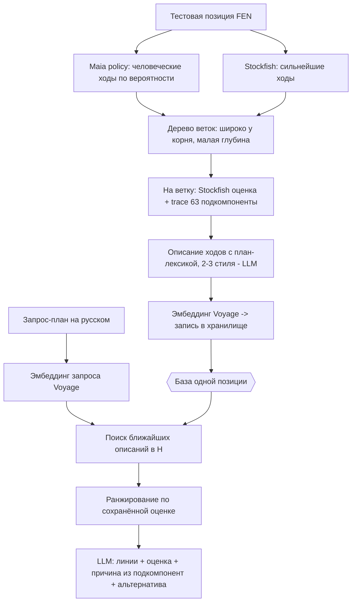

# ADR-170: Поиск планов по дереву вариантов (PoC) — оценка планов на естественном языке через RAG над разбором позиции

**Дата:** 2026-07-25
**Статус:** Предложено
**Задачи:** этот ADR — architect; вытекают backend (конвейер наполнения + фаза C), devops (Voyage API key, хранилище), qa (проверка результата)
**Связанные ADR:** 107 (форк Stockfish-trace, `eval json`, 63 подкомпоненты — источник разбивки оценки), 165 / KS-4942 (разбор позиции: дерево Maia + Stockfish), 168 / 169 (вектора ПОЗИЦИЙ из Lc0 — **другое пространство**, не переиспользуется здесь)

---

## 1. Контекст и цель

Идея пользователя: дать возможность спрашивать движок словами — «что если я надвину пешки королевского фланга» — и получать оценку вариантов под этот план.

Механика: от исходной позиции строим широкое и глубокое дерево вариантов (как в разборе позиции, ADR-165). Каждую ветку сохраняем как запись: словесное описание последовательности ходов + итоговая оценка Stockfish + разбивка оценки на 63 подкомпоненты (форк trace, ADR-107) + вероятность исхода. Над описанием строим текстовый эмбеддинг. Запрос на естественном языке ищется по описаниям, отобранные ветки ранжируются по сохранённой оценке, LLM формулирует ответ.

**Ключевые разграничения (итог обсуждения):**
- Вектор ветки — это **текстовое описание последовательности ходов**, не вектор позиции. Поиск плана — по тексту, не по позиционному вектору Lc0 (ADR-168/169 здесь не используются).
- Разбивка оценки уже реализована: форк SF16 (`Use NNUE value false`) даёт 63 названные подкомпоненты через `eval json`. Их имена (`king_unblocked_storm`, `king_flank_attacks`, `threat_by_pawn_push`, …) — структурный якорь плана и материал для описания.
- Оценка и подкомпоненты **хранятся в той же записи**, что и описание. Поэтому «хорош ли план» закрывается сразу сохранённой оценкой, отдельный слой не нужен.
- Варианты строятся **на лету от самой исходной позиции**, поэтому оценка родная для позиции — слой похожести позиций (ml_norm) к этой функции отношения не имеет.
- Покрытие планов обеспечивает **Maia** (человеческие альтернативы), а не только сильнейшие ходы Stockfish. Если план не рассматривают ни Maia, ни движок — ветки нет, и это осмысленный ответ («ни сильная, ни типичная игра этот план не выбирают»), а не «плана нет в шахматах».

## 2. Границы PoC

PoC — замкнутый эксперимент на **одной позиции**. Проверяем только одно: находит ли запрос-план нужные ветки и верна ли оценка/причина в ответе.

**В объёме:**
- Одна тестовая позиция.
- Разовое наполнение её базы (Maia + Stockfish + trace + описания + эмбеддинги).
- Описания в 2–3 вариантах абстракции — чтобы PoC сам показал, какой стиль лучше ищется.
- Фаза C: запрос → эмбеддинг → поиск → ранжирование по оценке → ответ LLM.

**Вне объёма:**
- Автоматический рекурсивный построитель дерева как сервис на потоке позиций, настройка порогов на объёме, скорость, кэш.
- Выбор уровня Maia (ELO) под аудиторию — берём один разумный.
- Продуктовая подача, реакция «плана нет в дереве», привязка к рейтингу пользователя.
- Промышленный масштаб (миллионы веток) — отдельное, более позднее решение.

## 3. Входные данные (заданы пользователем)

- **Тестовая позиция (FEN):** `rn1qkbnr/pp3ppp/2p1p3/3pPb2/3P4/5N2/PPP1BPPP/RNBQK2R b KQkq - 1 5` (Каро-Канн, продвижение; ход чёрных; насыщена планами, включая пешечный штурм фланга).
- **Модель эмбеддинга:** Voyage AI (у Anthropic своего метода эмбеддинга нет). Многоязычная — запросы на русском.
- **Окружение:** Maia и форк trace локально запускаются (подтверждено пользователем).

## 4. Схема записи ветки (контракт)

На каждую ветку дерева:

| Поле | Содержание |
|---|---|
| `root_fen` | Исходная позиция (одна на весь PoC) |
| `moves_uci` | Последовательность ходов ветки (UCI) |
| `description` | Словесное описание ходов с план-лексикой (2–3 варианта абстракции) |
| `embedding` | Вектор описания (Voyage) |
| `eval` | Итоговая оценка линии (Stockfish, число) |
| `outcome_prob` | Вероятность исхода (W/D/L) |
| `subterms` | 63 подкомпоненты (форк trace) или их дельта к корню |
| `depth`, `stop_reason` | Глубина и причина остановки ветки |

Объём: ~20–40 веток, покрывающих 4–6 разных планов (штурм королевского, размен, игра по линии, подрыв центра и т.д.).

## 5. Шаги

**Наполнение (разово, скриптом — не сервис):**
1. Фиксируем FEN.
2. Maia policy в корне и на нескольких полуходах: берём ходы выше порога вероятностной массы (широко). Stockfish добавляет сильнейшие ходы, если Maia их не дала. Глубину держим малой.
3. Для каждой ветки: Stockfish — оценка; форк trace (`eval json`, NNUE выключен) — 63 подкомпоненты.
4. Для каждой ветки — описание в 2–3 стилях абстракции (сырой пересказ / план-обобщение / обобщение + подкомпоненты).
5. Эмбеддим описания (Voyage), складываем записи в минимальное хранилище.

**Фаза C (то, ради чего PoC):**
6. 3–5 запросов-планов на русском.
7. Запрос → эмбеддинг → поиск ближайших описаний → отбор → ранжирование по оценке.
8. LLM формулирует ответ: линии под план, оценка, причина из подкомпонент, лучшая альтернатива.

## 6. Хранилище

Минимальное. Допустима маленькая таблица pgvector (метрика — косинус) либо плоский файл — инфраструктура на PoC не предмет проверки. Размерность вектора — по выбранной модели Voyage.

## 7. Развилки, встроенные в PoC (не решаются заранее)

- **Стиль описаний** — не пред-решение, а измерение: делаем 2–3 варианта, смотрим, какой даёт лучший поиск.
- **Форма ответа** — по умолчанию: линии + оценка + причина из подкомпонент + лучшая альтернатива; правится по первому живому ответу.
- **Метрика оценки** — по умолчанию пешки; рядом можно показать вероятность исхода.

## 8. Открытые технические вопросы (для задач)

- **Как конвейер вызывает LLM для генерации описаний.** Claude у команды по подписке, программного ключа API может не быть. Для PoC описания допустимо генерировать агентом в сессии, а не автоматическим вызовом API. Уточнить при нарезке backend-задачи.
- **Ключ Voyage AI** — нужен для эмбеддинга описаний и запросов. Провижн — devops/пользователь.
- **Пороги ширины/глубины и вероятностной массы Maia** — подбираются эмпирически на PoC.

## 9. Критерий успеха

На 3–5 запросах-планах на русском по тестовой позиции: поиск возвращает правильные ветки, ответ LLM называет верную оценку и верную причину. Оцениваем глазами. Выход — короткая записка: работает ли поиск, какой стиль описаний победил, вердикт да/нет.

## 10. Что вытекает (для координатора)

- **backend:** конвейер наполнения (обход дерева Maia+Stockfish, trace-разбивка, схема записи, интеграция Voyage, хранилище) + фаза C (эмбеддинг запроса, косинус-поиск, ранжирование по оценке, ответ LLM). Инструмент trace — `tools/stockfish-trace/`; Maia — `apps/api/src/position-comment/maia.service.ts`.
- **devops:** ключ Voyage AI; таблица pgvector, если выбран этот путь хранения.
- **qa:** проверка результата на 3–5 запросах, фиксация вердикта.
