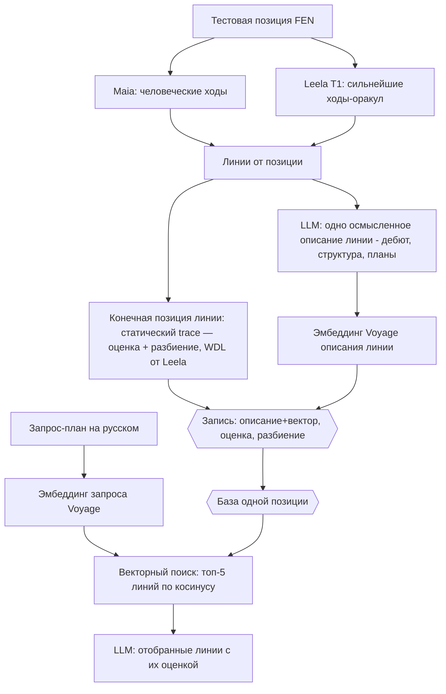

# ADR-170: Поиск планов по дереву вариантов (PoC) — векторный поиск по описаниям линий

**Дата:** 2026-07-26 (рев. 8 — §5.1: убран поиск в глубину полностью; сети Leela — один прогон (без MCTS), Stockfish `go depth` на листе убран, остаётся статический форк trace; приоритет ширины дерева над глубиной анализа. См. рев. 7 — ограничение роста оракула и наблюдаемость, рев. 6 — оракул Leela)
**Статус:** Предложено
**Задачи:** этот ADR — architect; вытекают backend (конвейер наполнения + фаза C), devops (Voyage API key, хранилище), qa (проверка результата)
**Связанные ADR:** 107 (форк Stockfish-trace, `eval json`, 63 подкомпоненты — разбиение оценки), 165 / KS-4942 (разбор позиции: дерево Maia + Stockfish), 168 / 169 (вектора ПОЗИЦИЙ из Lc0 — другое пространство, здесь не используется)

---

## 1. Контекст и цель

Спросить движок словами — «что если я надвину пешки королевского фланга» — и получить оценку подходящих вариантов.

**Алгоритм (постановка пользователя, дословно исполняем):**
1. Строим варианты (линии) Maia/Stockfish от исходной позиции.
2. Каждой линии даём **одно осмысленное описание линии** — разбор её смысла (дебют, пешечная структура, планы сторон, ключевые поля, следствие ходов), сгенерированный LLM. Рядом храним **конечную оценку** линии и её **разбиение на составляющие** (Stockfish + trace).
3. **Описание линии кодируем вектором** (эмбеддинг Voyage).
4. По запросу на естественном языке делаем **векторный поиск по базе** — топ-5 линий с наиболее близкими описаниями.
5. LLM по отобранным линиям формулирует ответ с их оценкой.

**Что кодируется вектором:** одно **осмысленное описание линии** от LLM — как разбор её смысла (пример уровня — в обсуждении по линии Каро-Канна с продвижением). НЕ пересказ ходов, НЕ ярлык по первому ходу, НЕ несколько стилей, НЕ факторный пересказ подкомпонент. Оценка и её разбиение — отдельные хранимые поля записи, НЕ часть эмбеддинга.

## 2. Границы PoC

Замкнутый эксперимент на **одной позиции**. Проверяем одно: находит ли запрос-план нужные линии и верна ли их оценка в ответе.

**В объёме:**
- Одна тестовая позиция.
- Разовое наполнение базы: линии → описание (одно на линию) → конечная оценка + разбиение → эмбеддинг описания.
- Фаза C: запрос → эмбеддинг → векторный поиск топ-5 → ответ LLM с оценками.

**Вне объёма:**
- Автоматический построитель дерева как сервис на потоке позиций, пороги на объёме, скорость, кэш.
- Выбор уровня Maia (ELO) под аудиторию — берём один разумный.
- Продуктовая подача, реакция «плана нет в дереве», привязка к рейтингу.
- Промышленный масштаб (миллионы линий) — отдельное, более позднее решение.

## 3. Входные данные (заданы пользователем)

- **Тестовая позиция (FEN):** `rn1qkbnr/pp3ppp/2p1p3/3pPb2/3P4/5N2/PPP1BPPP/RNBQK2R b KQkq - 1 5` (Каро-Канн, продвижение; ход чёрных).
- **Модель эмбеддинга:** Voyage AI (у Anthropic своего метода эмбеддинга нет). Многоязычная — запросы на русском.
- **Окружение:** Maia и форк trace локально запускаются (подтверждено пользователем).

## 4. Схема записи линии (контракт)

Одна запись на линию:

| Поле | Содержание |
|---|---|
| `root_fen` | Исходная позиция (одна на весь PoC) |
| `moves_uci` | Ходы линии (UCI) |
| `description` | **Одно** осмысленное описание линии, сгенерированное LLM: дебют, пешечная структура, планы сторон, ключевые поля, следствие ходов. Разбор смысла линии, не пересказ ходов и не ярлык |
| `embedding` | Вектор описания (Voyage) — один на линию |
| `eval` | Оценка **конечной позиции** линии — суммарная **статическая** оценка форк-trace (число, без поиска в глубину) |
| `outcome_prob` | Вероятность исхода конечной позиции (W/D/L) |
| `subterms` | Разбиение оценки конечной позиции на составляющие (форк trace, 63 подкомпоненты) — хранимое поле, НЕ в описании и НЕ в эмбеддинге |
| `engine_only_plies` | Полуходы линии, вошедшие только как ход-оракул сильной сети Leela (вероятность Maia ниже `P_fork`) — «объективно сильно, человечески маловероятно» (§5.1 п.3). Пусто, если линия целиком человеческая |

Объём: ~20–40 линий от исходной позиции.

## 5. Шаги

### 5.1. Алгоритм построения дерева (явный)

Ранее ADR задавал дерево словами («широко у корня, малая глубина») — это оставляло построение на усмотрение исполнителя. Ниже — точный, реализуемый рецепт. Числа — стартовые, тюнятся на PoC.

Параметры: Maia ELO = 1500 (разумный человеческий уровень для разброса планов); цель — ~20–40 линий (листьев); максимальная глубина линии `D_max = 12` полуходов (6 ходов каждой стороны).

**Движки (рев.6).** Ходы внутри дерева выбираются ТОЛЬКО через Lc0 — два тёплых (постоянно запущенных) процесса без перезапуска на узел:
- **Maia-1500** (`maia-1500.pb.gz`) — человеческая policy: вероятные ходы и их вероятности.
- **Сильная сеть Leela T1 256×10** (`.agent-tmp/t1-256x10.pb.gz`, бинарь `.agent-tmp/lc0/build/lc0`) — «оракул»: объективно сильнейший ход на узле, даже если Maia считает его маловероятным.

Stockfish внутри дерева НЕ используется вовсе. Он нужен только на листе (шаг 5) — ради разбиения оценки на составляющие через форк trace (ADR-107), которого сеть Leela не даёт (у неё только скалярный value/WDL). Так снимается прежнее узкое место — перезапуск Stockfish на каждый узел; активация сети Leela на тёплом lc0 дешевле запуска Stockfish.

**Без поиска в глубину (рев.8) — приоритет ширины над глубиной.** Ни Leela, ни Stockfish поиск в глубину НЕ ведут. Все обращения к сетям — один прямой прогон (голова политики + оценочная голова), без обхода вариантов (`go nodes 1`, не MCTS-поиск):
- Maia — вероятности ходов одним прогоном;
- сильная сеть Leela — «лучший ход» = верх политики одного прогона (непосредственное предпочтение сети, без просчёта вперёд); WDL/оценка — с оценочной головы того же прогона;
- на листе Stockfish `go depth N` УБРАН; остаётся только статический форк trace (`eval json`) — он и так без поиска и даёт как разбиение на 63 составляющие, так и суммарную статическую оценку.

Причина: для PoC важнее **ширина дерева** (охват разных планов), а не глубина движкового анализа каждой линии. Убирая поиск, высвобождаем ресурс на большее число первых ходов и развилок. Прежние `LEELA_NODES = 1600` и `SF_DEPTH_LEAF = 16` отменяются.

1. **Корень** — тестовая позиция (ход чёрных).
2. **Кандидатные первые ходы (= плоскость планов).** Объединяем:
   - ходы Maia policy в корне с вероятностью ≥ 0.05, набирая массу до 0.85, не более 6 ходов;
   - top-3 хода сильной сети Leela по политике одного прогона в корне (без поиска).
   Дедуп → ~6–10 первых ходов. Каждый — отдельный план/начало линии.
3. **Продолжение линии (ветвление по энтропии policy + оракул Leela, рев.6).** На КАЖДОМ полуходе множество продолжений узла формируется тремя источниками (дедуп по ходу):
   - **Maia top-1** — всегда (главная человеческая линия);
   - **ходы Maia с вероятностью ≥ 0.30** (порог `P_fork = 0.30`) — развилка там, где позиция реально неоднозначна для человека, а не на фиксированных ply;
   - **лучший ход сильной сети Leela на этом узле** — всегда добавляется, даже если Maia считает его маловероятным. Это включает в дерево объективно сильные ходы, которые человеческая policy недооценивает.

   Ширина узла ≤ 4 (Maia top-1 + до двух Maia ≥0.30 + ход Leela; при совпадении меньше). Ход, вошедший ТОЛЬКО как ход Leela (вероятность Maia ниже порога), **помечается флагом** «объективно сильный, человечески маловероятный» (см. §4) — для честного описания и оценки линии.

   **Ограничение роста оракула (рев.7).** Оракул на каждом узле без границ даёт взрыв ветвления (подтверждено: обход не сходится за 10+ минут). Поэтому:
   - оракул добавляет ход только до глубины `D_oracle = 6` полуходов; глубже линия идёт по Maia top-1 (в начале формируется план и критические развилки, глубже — реализация);
   - не более `K_oracle = 2` оракульных отклонений на одну линию;
   - обход — «лучшими путями вперёд» (best-first по вероятности пути Maia), а не полный перебор; ветки набираются до предела листьев (см. п.6), затем обход прекращается.

   Прежние хардкоды отменены: фиксированные развилки `FORK_AT_MOVE = {2, 4}` (рев.4) и ветвление только по Maia (рев.5). Оба теряли ходы: рев.5 не доходил до dxc4 40.8%, т.к. путь к нему идёт через Qxc4 25.9% (ниже порога) — ход материально сильный, его подхватывает оракул Leela, и линия достигает dxc4.
4. **Остановка линии** — по первому из: достигнута `D_max`; мат/пат; исход стабилизировался (одна из W/D/L > 90% по WDL сильной сети Leela) — «позиция понятна», линия закрывается раньше. WDL на узле берётся у Lc0 одним прогоном (без поиска), Stockfish для этого не запускается.
5. **Замер — только на КОНЕЧНОЙ позиции линии (лист), без поиска в глубину (рев.8):** статический форк trace (`eval json`, NNUE выключен) даёт разбиение на 63 составляющие И суммарную статическую оценку (поле `eval`); WDL конечной позиции — одним прогоном сильной сети Leela. Stockfish `go depth N` УБРАН — поисковый анализ листа не проводится. Внутри линии движковый поиск также не ведётся: ходы выбирают два тёплых процесса Lc0 одним прогоном каждый.
6. **Ограничение объёма (соблюдается В ХОДЕ обхода, не постфактум):** предел `L_max = 40` листьев; лишние отсекаются по вероятности пути Maia (произведение вероятностей ходов линии), **НО** линии с ходом-оракулом Leela (флаг из п.3) от этой отсечки защищены — иначе объективно сильные ходы, ради которых оракул и добавлен, выпадут первыми (у них низкая вероятность Maia). Порог P_fork = 0.30 — стартовый; если человеческих развилок окажется устойчиво <20 или >40, настраивается на PoC.

7. **Наблюдаемость и защита построителя (рев.7).** Дерево пишется в файл только по завершении обхода — поэтому построитель обязан:
   - **периодически (раз в ~1 c или раз в N узлов) писать прогресс в лог:** раскрыто узлов, накоплено листьев, текущая максимальная глубина, число оракульных отклонений. Тогда прогресс отслеживается, а взрыв ветвления виден в реальном времени, а не постфактум;
   - **иметь жёсткие пределы с аварийной остановкой и отчётом:** узлов всего `N_max = 1500`, время `T_max = 120 c`, листьев `L_max = 40`. При достижении любого — обход прекращается и печатает, где встал. Зациклившийся процесс не молотит вхолостую;
   - **опционально — писать листья инкрементально** по мере готовности, чтобы частичное дерево можно было смотреть на ходу.

   Числа `D_oracle`, `K_oracle`, `N_max`, `T_max`, `L_max` — стартовые, настраиваются на PoC.

Хранимая единица — **линия** (путь корень→лист).

### 5.2. Наполнение записи (на каждую линию)

1. По алгоритму 5.1 получаем набор линий.
2. Конечная позиция линии: Stockfish — оценка + WDL; форк trace — разбиение (см. 5.1 шаг 5).
3. **Одно** осмысленное описание линии от LLM: разбор смысла (дебют, структура, планы сторон, ключевые поля), с упором на «своё» для этой линии. Не пересказ ходов, не ярлык.
4. Эмбеддинг описания (Voyage) → запись в хранилище.

**Фаза C:**
6. 3–5 запросов-планов на русском.
7. Запрос → эмбеддинг → векторный поиск: топ-5 линий по косинусу к описаниям.
8. LLM по топ-5 формулирует ответ с их оценкой (и, при необходимости, разбиением конечной позиции).

## 6. Хранилище

Минимальное. Допустима маленькая таблица pgvector (метрика — косинус) либо плоский файл. Размерность вектора — по выбранной модели Voyage.

## 7. Что оставляем на решение по факту

- **Форма ответа** — по умолчанию: отобранные линии + их оценка; правится по первому живому ответу.
- **Метрика оценки** — по умолчанию пешки; рядом можно показать вероятность исхода.

## 8. Открытые технические вопросы

- **Как конвейер вызывает LLM для описаний.** Описание каждой линии — осмысленный разбор от LLM. Claude у команды по подписке, программного ключа API может не быть. Для PoC описания допустимо генерировать агентом в сессии; на масштабе нужен программный путь. Уточнить при нарезке backend-задачи.
- **Ключ Voyage AI** — нужен для эмбеддинга описаний и запросов. Провижн — devops/пользователь.
- **Пороги ширины/глубины дерева** — подбираются эмпирически на PoC.

**Что учесть по качеству поиска.** Линии от ОДНОЙ позиции делят дебют и структуру, поэтому осмысленные описания рискуют быть похожими друг на друга («Каро-Канн, продвижение, закрытый центр…» у многих). Чтобы поиск различал линии, описание должно выделять именно то, что в этой линии СВОЁ (её конкретный план/следствие), а не только общий контекст позиции. Проверяется на PoC.

## 9. Критерий успеха

На 3–5 запросах-планах на русском по тестовой позиции: векторный поиск возвращает подходящие линии, ответ называет верную оценку. Оцениваем глазами. Выход — короткая записка: работает ли поиск, вердикт да/нет.

## 10. Что вытекает (для координатора)

- **backend:** конвейер наполнения (линии Maia+Stockfish, конечная оценка + trace-разбиение, ОДНО осмысленное описание линии от LLM, эмбеддинг Voyage, хранилище) + фаза C (эмбеддинг запроса, векторный поиск топ-5, ответ LLM). Trace — `tools/stockfish-trace/`; Maia — `apps/api/src/position-comment/maia.service.ts`. **Правка к текущей реализации:** убрать три стиля, ярлыки по первому ходу и факторный пересказ; описание — одно на линию, осмысленный разбор смысла линии от LLM (дебют/структура/планы/ключевые поля, с упором на своё для этой линии); вектор — по этому единственному описанию.
- **devops:** ключ Voyage AI; таблица pgvector, если выбран этот путь хранения.
- **qa:** проверка результата на 3–5 запросах, фиксация вердикта.
