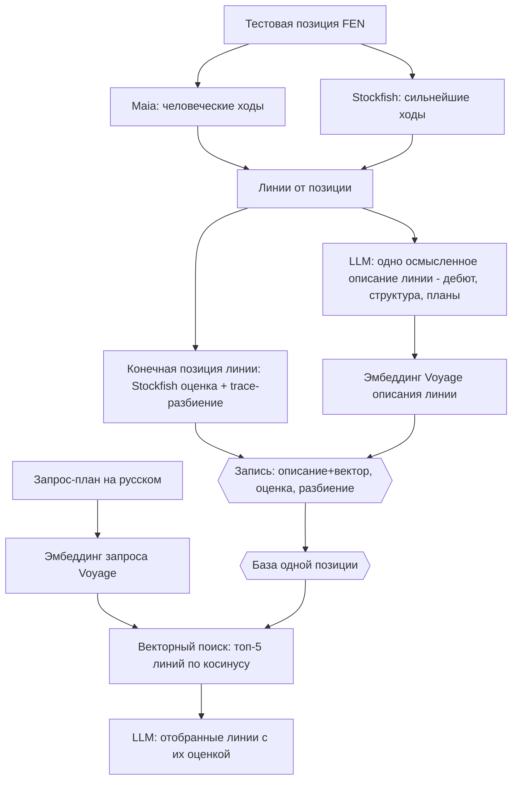

# ADR-170: Поиск планов по дереву вариантов (PoC) — векторный поиск по описаниям линий

**Дата:** 2026-07-25 (рев. 2 — приведён строго к алгоритму пользователя; убраны добавленные архитектором усложнения)
**Статус:** Предложено
**Задачи:** этот ADR — architect; вытекают backend (конвейер наполнения + фаза C), devops (Voyage API key, хранилище), qa (проверка результата)
**Связанные ADR:** 107 (форк Stockfish-trace, `eval json`, 63 подкомпоненты — разбиение оценки), 165 / KS-4942 (разбор позиции: дерево Maia + Stockfish), 168 / 169 (вектора ПОЗИЦИЙ из Lc0 — другое пространство, здесь не используется)

---

## 1. Контекст и цель

Спросить движок словами — «что если я надвину пешки королевского фланга» — и получить оценку подходящих вариантов.

**Алгоритм (постановка пользователя, дословно исполняем):**
1. Строим варианты (линии) Maia/Stockfish от исходной позиции.
2. Каждой линии даём **одно осмысленное описание линии** — разбор её смысла (дебют, пешечная структура, планы сторон, ключевые поля, следствие ходов), сгенерированный LLM. Рядом храним **конечную оценку** линии и её **разбиение на составляющие** (Stockfish + trace).
3. **Описание линии кодируем вектором** (эмбеддинг Voyage).
4. По запросу на естественном языке делаем **векторный поиск по базе** — топ-5 линий с наиболее близкими описаниями.
5. LLM по отобранным линиям формулирует ответ с их оценкой.

**Что кодируется вектором:** одно **осмысленное описание линии** от LLM — как разбор её смысла (пример уровня — в обсуждении по линии Каро-Канна с продвижением). НЕ пересказ ходов, НЕ ярлык по первому ходу, НЕ несколько стилей, НЕ факторный пересказ подкомпонент. Оценка и её разбиение — отдельные хранимые поля записи, НЕ часть эмбеддинга.

## 2. Границы PoC

Замкнутый эксперимент на **одной позиции**. Проверяем одно: находит ли запрос-план нужные линии и верна ли их оценка в ответе.

**В объёме:**
- Одна тестовая позиция.
- Разовое наполнение базы: линии → описание (одно на линию) → конечная оценка + разбиение → эмбеддинг описания.
- Фаза C: запрос → эмбеддинг → векторный поиск топ-5 → ответ LLM с оценками.

**Вне объёма:**
- Автоматический построитель дерева как сервис на потоке позиций, пороги на объёме, скорость, кэш.
- Выбор уровня Maia (ELO) под аудиторию — берём один разумный.
- Продуктовая подача, реакция «плана нет в дереве», привязка к рейтингу.
- Промышленный масштаб (миллионы линий) — отдельное, более позднее решение.

## 3. Входные данные (заданы пользователем)

- **Тестовая позиция (FEN):** `rn1qkbnr/pp3ppp/2p1p3/3pPb2/3P4/5N2/PPP1BPPP/RNBQK2R b KQkq - 1 5` (Каро-Канн, продвижение; ход чёрных).
- **Модель эмбеддинга:** Voyage AI (у Anthropic своего метода эмбеддинга нет). Многоязычная — запросы на русском.
- **Окружение:** Maia и форк trace локально запускаются (подтверждено пользователем).

## 4. Схема записи линии (контракт)

Одна запись на линию:

| Поле | Содержание |
|---|---|
| `root_fen` | Исходная позиция (одна на весь PoC) |
| `moves_uci` | Ходы линии (UCI) |
| `description` | **Одно** осмысленное описание линии, сгенерированное LLM: дебют, пешечная структура, планы сторон, ключевые поля, следствие ходов. Разбор смысла линии, не пересказ ходов и не ярлык |
| `embedding` | Вектор описания (Voyage) — один на линию |
| `eval` | Оценка **конечной позиции** линии (Stockfish, число) |
| `outcome_prob` | Вероятность исхода конечной позиции (W/D/L) |
| `subterms` | Разбиение оценки конечной позиции на составляющие (форк trace, 63 подкомпоненты) — хранимое поле, НЕ в описании и НЕ в эмбеддинге |

Объём: ~20–40 линий от исходной позиции.

## 5. Шаги

**Наполнение (разово, скриптом):**
1. Фиксируем FEN.
2. Строим линии: Maia даёт человеческие ходы, Stockfish — сильнейшие; малая глубина.
3. Конечная позиция каждой линии: Stockfish — оценка; форк trace (`eval json`, NNUE выключен) — разбиение на составляющие.
4. Каждой линии — **одно** осмысленное описание, сгенерированное LLM: разбор смысла линии (дебют, структура, планы сторон, ключевые поля). Не пересказ ходов, не ярлык по первому ходу.
5. Эмбеддим описание (Voyage), складываем запись в хранилище.

**Фаза C:**
6. 3–5 запросов-планов на русском.
7. Запрос → эмбеддинг → векторный поиск: топ-5 линий по косинусу к описаниям.
8. LLM по топ-5 формулирует ответ с их оценкой (и, при необходимости, разбиением конечной позиции).

## 6. Хранилище

Минимальное. Допустима маленькая таблица pgvector (метрика — косинус) либо плоский файл. Размерность вектора — по выбранной модели Voyage.

## 7. Что оставляем на решение по факту

- **Форма ответа** — по умолчанию: отобранные линии + их оценка; правится по первому живому ответу.
- **Метрика оценки** — по умолчанию пешки; рядом можно показать вероятность исхода.

## 8. Открытые технические вопросы

- **Как конвейер вызывает LLM для описаний.** Описание каждой линии — осмысленный разбор от LLM. Claude у команды по подписке, программного ключа API может не быть. Для PoC описания допустимо генерировать агентом в сессии; на масштабе нужен программный путь. Уточнить при нарезке backend-задачи.
- **Ключ Voyage AI** — нужен для эмбеддинга описаний и запросов. Провижн — devops/пользователь.
- **Пороги ширины/глубины дерева** — подбираются эмпирически на PoC.

**Что учесть по качеству поиска.** Линии от ОДНОЙ позиции делят дебют и структуру, поэтому осмысленные описания рискуют быть похожими друг на друга («Каро-Канн, продвижение, закрытый центр…» у многих). Чтобы поиск различал линии, описание должно выделять именно то, что в этой линии СВОЁ (её конкретный план/следствие), а не только общий контекст позиции. Проверяется на PoC.

## 9. Критерий успеха

На 3–5 запросах-планах на русском по тестовой позиции: векторный поиск возвращает подходящие линии, ответ называет верную оценку. Оцениваем глазами. Выход — короткая записка: работает ли поиск, вердикт да/нет.

## 10. Что вытекает (для координатора)

- **backend:** конвейер наполнения (линии Maia+Stockfish, конечная оценка + trace-разбиение, ОДНО осмысленное описание линии от LLM, эмбеддинг Voyage, хранилище) + фаза C (эмбеддинг запроса, векторный поиск топ-5, ответ LLM). Trace — `tools/stockfish-trace/`; Maia — `apps/api/src/position-comment/maia.service.ts`. **Правка к текущей реализации:** убрать три стиля, ярлыки по первому ходу и факторный пересказ; описание — одно на линию, осмысленный разбор смысла линии от LLM (дебют/структура/планы/ключевые поля, с упором на своё для этой линии); вектор — по этому единственному описанию.
- **devops:** ключ Voyage AI; таблица pgvector, если выбран этот путь хранения.
- **qa:** проверка результата на 3–5 запросах, фиксация вердикта.
