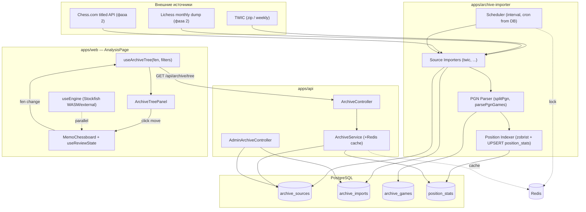
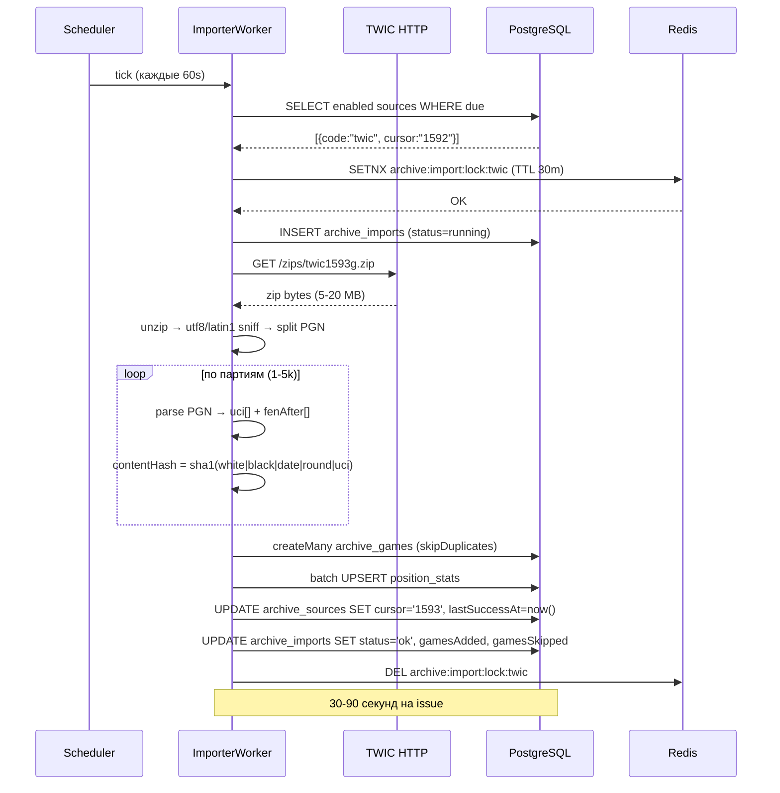
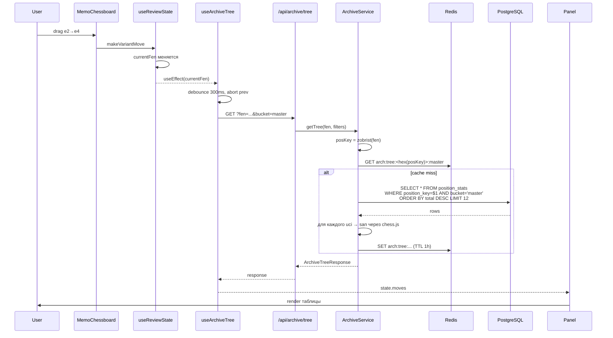

# KS-1577 — Базы партий, дерево вариантов: дизайн интеграции

Сопроводительный документ к [ADR-013](../adr/013-game-archive-and-tree.md). Здесь — диаграммы, UI/UX схема, потоки данных.

---

## 1. Диаграмма компонентов



---

## 2. Поток импорта TWIC



---

## 3. Поток запроса дерева в окне анализа



---

## 4. UI/UX окна анализа после интеграции

### 4.1 Desktop layout (>1024px)

```
┌─────────────────────────────────────────────────────────────────────────┐
│ [Workshop / Analysis / Magnus vs Hikaru ✎]                       [?]    │
│                                                                         │
│ ┌──────────────────────────────┐   ┌────────────────────────────────┐  │
│ │ GameMetaBar (white/black)    │   │ GameMetaBar (desktop dup)      │  │
│ ├─┬──────────────────────────┐ │   ├────────────────────────────────┤  │
│ │ │                          │ │   │ ⚙ Stockfish 17 · d24 · 12.5Mn │  │
│ │ │                          │ │   │ ─────────────────────────────  │  │
│ │ │      ●  ChessBoard       │ │   │ +0.42  e4 e5 Nf3 Nc6 ...       │  │
│ │ │                          │ │   │ +0.31  d4 Nf6 c4 e6 ...        │  │
│ │ │ ←──── EvalBar            │ │   ├────────────────────────────────┤  │
│ │ │                          │ │   │ 📚 Database · Masters ▾ · 2200+│  │
│ │ │                          │ │   │ ─────────────────────────────  │  │
│ │ │                          │ │   │ Italian Game (C50)             │  │
│ │ │                          │ │   │ based on 18,432 games          │  │
│ │ │                          │ │   │                                │  │
│ │ │                          │ │   │  Move │ Games │ W % D L │ Avg  │  │
│ │ │                          │ │   │ ──────┼───────┼─────────┼────  │  │
│ │ │                          │ │   │  Bb5  │ 9 821 │ ▓▓░░▓▓  │ 2486 │  │
│ │ │                          │ │   │  Bc4  │ 4 311 │ ▓▓▓░░▓  │ 2392 │  │
│ │ │                          │ │   │  d4   │ 2 144 │ ▓▓▓░░░  │ 2314 │  │
│ │ │                          │ │   │  Nc3  │ 1 902 │ ▓▓░░▓▓  │ 2250 │  │
│ │ │                          │ │   │  ...  │       │         │      │  │
│ │ │                          │ │   ├────────────────────────────────┤  │
│ │ │                          │ │   │ ☰ Moves                        │  │
│ │ │                          │ │   │ 1.e4 e5  2.Nf3 Nc6  3.Bb5 a6  │  │
│ │ │                          │ │   │ ...                            │  │
│ │ │                          │ │   └────────────────────────────────┘  │
│ │ └──────────────────────────┘ │                                        │
│ │ ⇤ ← → ⇥  ⇅  FEN Info ⬇PGN ⋯ │                                        │
│ └──────────────────────────────┘                                        │
└─────────────────────────────────────────────────────────────────────────┘
```

### 4.2 Mobile layout (≤768px) — таб-вариант

```
┌──────────────────────────┐
│ MagnusVsHikaru ✎    [?] │
├──────────────────────────┤
│  ●  ChessBoard           │
│                          │
│ ⇤ ← → ⇥  ⇅  d24 +0.42 ⋯ │
├──────────────────────────┤
│ [Moves][Engine][Tree]·R │
├──────────────────────────┤
│ active: Tree            │
│ Italian Game (C50)      │
│ 18 432 games            │
│ Bb5  9821  ▓▓░░▓▓  2486 │
│ Bc4  4311  ▓▓▓░░▓  2392 │
│ ...                     │
└──────────────────────────┘
```

`Tree` — четвёртая mobile-вкладка (`mobileTab: 'moves' | 'engine' | 'tree' | 'report'`). По типу `report` оставляем условный рендер (только если есть `gameId`), `tree` доступен всегда.

### 4.3 Что рисуется в `ArchiveTreePanel`

Иерархия компонентов (новые помечены ★):

- ★ `ArchiveTreePanel` (analysis-panel collapsible)
  - header: `📚 Database` + `BucketSelect (Masters | Lichess 2000+ | All)` + collapse-chevron
  - body:
    - `OpeningHeading` — `Italian Game (C50)` (из ECO-классификатора, уже есть `classifyOpening`)
    - `TreeStats` — `based on N games`
    - ★ `TreeMovesTable`
      - строки: SAN, total, ★ `WinDrawLossBar` (горизонтальный 100% бар, цвета `#fff #888 #000` поверх green/grey/red), avgElo, опц. lastSeenYear
      - hover → callback `onHoverMove(uci)` → пробрасывается в `AnalysisPage` → стрелка через `useBoardHighlights` (новый метод `setSuggestedArrow`)
      - click → callback `onSelectMove(uci)` → `makeVariantMove(uci.from, uci.to, uci.promotion)`
    - footer: ссылка `View N games →` (фаза 2, открывает модалку/страницу со списком партий)

### 4.4 Состояния панели

| Состояние                | Что показывается |
| ------------------------ | ---------------- |
| `loading` (debounced)    | skeleton 6 строк |
| `success, total > 0`     | таблица как выше |
| `success, total === 0`   | "No games found in this position. Try Lichess bucket or earlier in the game." |
| `error`                  | "Database unavailable" + retry button |
| `disabled` (нет интернета | source error?) | "Database is offline" + последнее обновление |

### 4.5 Взаимодействие с Stockfish

Никакого. `useEngine` и `useArchiveTree` — два независимых хука, оба слушают `currentFen`. Stockfish даёт **оценку**, дерево даёт **практику**. Пользователь видит обе колонки и сам делает выводы. Этот паттерн — как у Lichess Analysis Board.

Опционально (фаза 2): подсветить ход в `TreeMovesTable`, который совпадает с лучшим ходом Stockfish (✓), и расхождение (✗). Но MVP без этого.

### 4.6 Изменения в существующем коде (только для понимания, не имплементация)

- `AnalysisPage.tsx`:
  - добавить `mobileTab` тип с `'tree'`;
  - добавить `<ArchiveTreePanel currentFen={currentFen} onSelectMove={handleTreeMove} />` в desktop sidebar (между Engine и Moves) и в mobile tabs;
  - `handleTreeMove(uci)` использует существующий `makeVariantMove`.
- `useReviewState` — без изменений.
- `useBoardHighlights` — добавить `setSuggestedArrow(from, to)` (отдельная стрелка от lastMove, рисуется полупрозрачно).
- `packages/shared/src/types/api-contracts.ts` — re-export из `archive.ts`.

---

## 5. Маппинг "что новое появляется на странице"

| Блок | Расположение | Условия отображения |
| ---- | ------------ | ------------------- |
| ArchiveTreePanel (desktop) | `.analysis-sidebar`, между Engine и Moves | всегда |
| Tree mobile-tab            | `.analysis-mobile-panel__tabs`, после Engine | всегда |
| Tree-стрелка на доске      | overlay внутри `.board-container` | hover по строке таблицы |
| Opening heading            | внутри Tree-панели              | если ECO определён |

---

## 6. Контракты в shared

Файл `packages/shared/src/types/archive.ts`:

```ts
export type ArchiveBucket = 'master' | 'user';

export type ArchiveTreeRequest = {
  fen: string;
  bucket?: ArchiveBucket;
  minElo?: number;
  since?: string;
  limit?: number;
};

export type ArchiveTreeMove = {
  uci: string;
  san: string;
  total: number;
  whiteWins: number;
  draws: number;
  blackWins: number;
  whitePct: number;
  drawPct: number;
  blackPct: number;
  avgElo: number | null;
  lastSeenAt: string | null;
};

export type ArchiveTreeResponse = {
  fen: string;
  positionKey: string;     // hex
  totalGames: number;
  moves: ArchiveTreeMove[];
  opening: { eco: string; name: string } | null;
};

export type ArchiveGamesRequest = {
  fen?: string;
  move?: string;
  white?: string;
  black?: string;
  player?: string;
  eco?: string;
  minElo?: number;
  result?: '1-0' | '0-1' | '1/2-1/2';
  since?: string;
  limit?: number;
  offset?: number;
};

export type ArchiveGameSummary = {
  id: string;
  white: { name: string; elo: number | null; title: string | null };
  black: { name: string; elo: number | null; title: string | null };
  result: string;
  eco: string | null;
  opening: string | null;
  event: string | null;
  date: string | null;
  plyCount: number;
};

export type ArchiveGameDetail = ArchiveGameSummary & {
  pgn: string;
  site: string | null;
  round: string | null;
};

export type ArchiveGamesResponse = {
  total: number;
  items: ArchiveGameSummary[];
};

export type ArchiveSourceDto = {
  id: string;
  code: string;
  name: string;
  enabled: boolean;
  schedule: string | null;
  lastRunAt: string | null;
  lastSuccessAt: string | null;
  lastError: string | null;
  totalGames: number;
};
```

Реэкспортируется через `packages/shared/src/types/api-contracts.ts` (приписка к существующим экспортам).

---

## 7. Что НЕ входит в фазу 1 (MVP)

- список партий через позицию (`/api/archive/games`) — таблица показывает только статистику, без перехода в партию;
- партиционирование `archive_games`;
- Lichess monthly dump, Chess.com titled, импорт из `broadcast_games`;
- админка управления источниками;
- ECO-классификация на бэке (используем фронтовую через `classifyOpening`).

---

## 8. Подводные камни (явно зафиксировать)

- **Encoding TWIC**: исторически часть PGN-ов была в Latin-1. Нужен sniff (`Buffer.toString('utf-8')` → проверить replacement chars → fallback `latin1`). Иначе имена игроков с диакритикой ломаются.
- **Ранг через `populate avgElo`**: формула `(prev_avg * (total-1) + new_elo) / total` подвержена дрейфу при NULL ELO (TWIC иногда пишет 0 / "?"). Решение: NULL Elo не учитывается в среднем, считается отдельно `total_with_elo`.
- **`finalFen` опционально**: chess.js может бросить на нестандартных PGN (Chess960, неполные). Парсинг обернуть в try/catch, при ошибке — пропустить partию (`gamesSkipped++`), не падать импорт.
- **Zobrist реализация**: либо своя на ~60 строк (стандартные таблицы фиксированы, см. polyglot spec), либо взять из `chessops` (npm). Взять `chessops` — он уже валидирован и используется Lichess.
- **Cache invalidation**: после успешного импорта надо инвалидировать **только** ключи затронутых позиций. Их ~200k. Реалистичнее — `FLUSHDB` на префиксе `arch:tree:*` (Redis SCAN + DEL). Плюс TTL 1h всё равно подстрахует.
- **Дедуп `contentHash`**: SHA-1 от UCI-строки. Если в одном источнике партия записана с разными round'ами или date'ами (опечатки в TWIC случаются) — будут двойники. Не лечим в MVP, видны в `gamesSkipped` как 0 (т.е. не пойманы).
- **Объём миграции**: первый запуск = весь TWIC архив (~1500 issues × 3k партий = ~4.5M партий, ~13GB). НЕ запускать сразу всю историю — только последние 50-100 issues для MVP. Пополнение истории — отдельной фоновой джобой "backfill".
