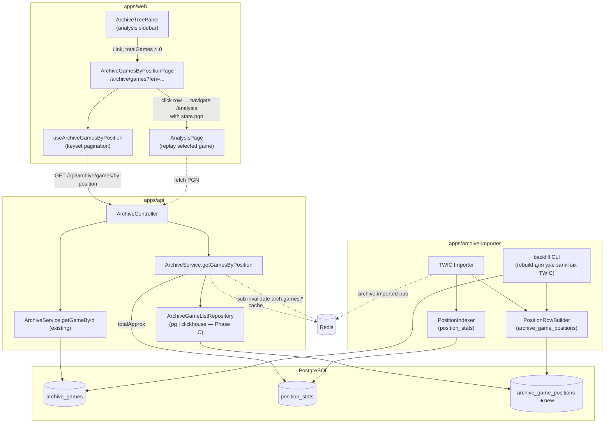
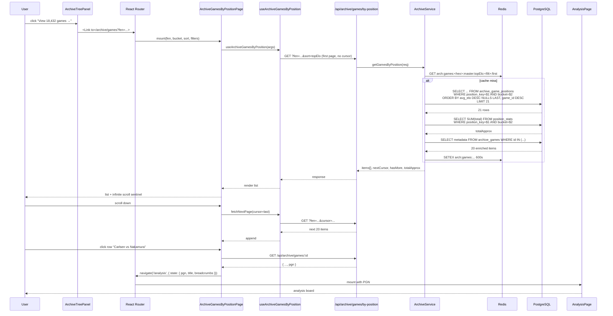
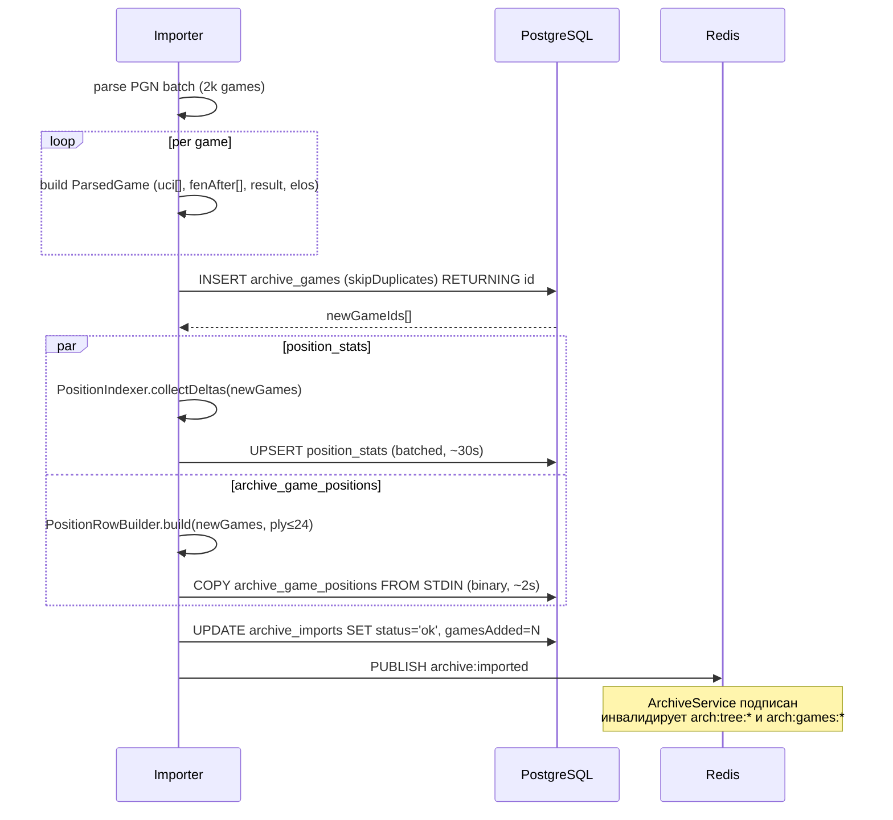

# KS-1607 — Archive: список партий по позиции: диаграммы, SQL, UI

Сопроводительный документ к [ADR-014](../adr/014-archive-games-by-position.md). Здесь — диаграммы потоков, SQL, примеры запросов, UI wireframes.

---

## 1. Диаграмма компонентов



★ — новое, добавляется этой задачей.

---

## 2. Поток запроса «показать партии по позиции»



---

## 3. Поток импорта партии (обновлённый)



---

## 4. SQL — ключевые запросы

### 4.1 DDL

```sql
CREATE TABLE archive_game_positions (
  position_key   BYTEA       NOT NULL,
  bucket         TEXT        NOT NULL,
  game_id        UUID        NOT NULL,
  ply            SMALLINT    NOT NULL,
  move_uci       TEXT        NULL,
  side_to_move   CHAR(1)     NOT NULL,
  played_at      TIMESTAMPTZ NULL,
  avg_elo        SMALLINT    NULL,
  result         CHAR(1)     NULL,   -- '1' | '0' | '='

  PRIMARY KEY (position_key, bucket, game_id)
);

CREATE INDEX archive_game_positions_recent
  ON archive_game_positions (position_key, bucket, played_at DESC NULLS LAST, game_id DESC);

CREATE INDEX archive_game_positions_top_elo
  ON archive_game_positions (position_key, bucket, avg_elo DESC NULLS LAST, game_id DESC);

-- fillfactor 80 — умеренное (таблица INSERT-heavy, UPDATE почти не бывает)
ALTER TABLE archive_game_positions SET (fillfactor = 80);
```

### 4.2 Запрос списка (sort=recent, первая страница, без фильтров)

```sql
SELECT
  agp.game_id, agp.ply, agp.move_uci, agp.side_to_move,
  agp.played_at, agp.avg_elo, agp.result
FROM archive_game_positions agp
WHERE agp.position_key = $1::bytea
  AND agp.bucket = $2
ORDER BY agp.played_at DESC NULLS LAST, agp.game_id DESC
LIMIT 21;
```

### 4.3 То же с cursor `{t, g}` и полным набором фильтров

```sql
SELECT
  agp.game_id, agp.ply, agp.move_uci, agp.side_to_move,
  agp.played_at, agp.avg_elo, agp.result
FROM archive_game_positions agp
WHERE agp.position_key = $1::bytea
  AND agp.bucket = $2
  AND (agp.played_at, agp.game_id) < ($3::timestamptz, $4::uuid)
  AND ($5::int IS NULL        OR agp.avg_elo >= $5)
  AND ($6::timestamptz IS NULL OR agp.played_at >= $6)
  AND ($7::char(1) IS NULL    OR agp.result = $7)
  AND ($8::char(1) IS NULL    OR agp.side_to_move = $8)
  AND ($9::text IS NULL       OR agp.move_uci = $9)
ORDER BY agp.played_at DESC NULLS LAST, agp.game_id DESC
LIMIT $10 + 1;
```

`EXPLAIN` ожидается: `Index Scan Backward using archive_game_positions_recent` → ≤ 21 rows.

### 4.4 Обогащение метаданных после keyset

```sql
SELECT
  g.id, g.white_name, g.black_name, g.white_elo, g.black_elo,
  g.white_title, g.black_title, g.result, g.eco, g.opening,
  g.event, g.date, g.played_at, g.ply_count
FROM archive_games g
WHERE g.id = ANY($1::uuid[]);
```

Потом JOIN-ить на стороне приложения (сохраняем порядок keyset). PG index on `archive_games.id` PK — point-lookup ≤ 1ms × 20 = 20ms в худшем случае, в реальности <5ms параллельно.

### 4.5 totalApprox

```sql
SELECT COALESCE(SUM(total), 0)::bigint AS total_approx
FROM position_stats
WHERE position_key = $1::bytea AND bucket = $2;
```

Использует индекс `(position_key, bucket, total DESC)` — index-only scan, ~1 ms.

### 4.6 Pre-warm популярных позиций (cron)

```sql
WITH popular AS (
  SELECT position_key, bucket, SUM(total) AS total_approx
  FROM position_stats
  GROUP BY position_key, bucket
  ORDER BY total_approx DESC
  LIMIT 30
)
SELECT position_key, bucket, total_approx FROM popular;
```

Для каждой позиции джоба делает 2 API-запроса (`sort=recent`, `sort=topElo`), результат уйдёт в Redis через обычный кэширующий путь.

### 4.7 JOIN-путь с фильтром `player` (medium latency)

```sql
SELECT
  agp.game_id, agp.ply, agp.move_uci, agp.side_to_move,
  agp.played_at, agp.avg_elo, agp.result
FROM archive_game_positions agp
JOIN archive_games g ON g.id = agp.game_id
WHERE agp.position_key = $1::bytea
  AND agp.bucket = $2
  AND (
    lower(g.white_name) LIKE lower($3) OR
    lower(g.black_name) LIKE lower($3)
  )
ORDER BY agp.played_at DESC NULLS LAST, agp.game_id DESC
LIMIT $4 + 1;
```

Нужен `CREATE INDEX archive_games_names_trgm ON archive_games USING GIN (lower(white_name) gin_trgm_ops, lower(black_name) gin_trgm_ops)` (есть пересечение с существующим `(white_name, black_name)` индексом — он работает только для префиксных равенств, trgm — для substring).

**Не добавляем в MVP**, если нет запроса на фильтр по игроку. Отдельная задача, если понадобится.

---

## 5. TypeScript-контракты (финальная версия для shared)

```ts
// packages/shared/src/types/archive.ts — добавление к существующему файлу

export type ArchiveGamesSort = 'recent' | 'topElo';
export type ArchiveGameColor = 'white' | 'black' | 'any';

export type ArchiveGamesByPositionRequest = {
  fen: string;
  bucket?: ArchiveBucket;
  sort?: ArchiveGamesSort;
  cursor?: string;
  limit?: number;
  minElo?: number;
  since?: string;
  result?: ArchiveGameResult;
  color?: ArchiveGameColor;
  move?: string;
  player?: string;
  eco?: string;
};

export type ArchiveGamesByPositionItem = {
  id: string;
  white: ArchivePlayerInfo;
  black: ArchivePlayerInfo;
  result: ArchiveGameResult | null;
  eco: string | null;
  opening: string | null;
  event: string | null;
  date: string | null;
  plyCount: number | null;
  reachedAtPly: number;
  nextMoveUci: string | null;
  sideToMove: 'w' | 'b';
};

export type ArchiveGamesByPositionResponse = {
  fen: string;
  positionKey: string;
  bucket: ArchiveBucket;
  sort: ArchiveGamesSort;
  items: ArchiveGamesByPositionItem[];
  nextCursor: string | null;
  hasMore: boolean;
  totalApprox: number;
};
```

`ArchiveGamesRequest`/`ArchiveGamesResponse` (существующие) — **остаются как есть**, их использует текущий endpoint `/api/archive/games`. Удалять/модифицировать не нужно.

---

## 6. UI wireframes

### 6.1 Desktop (`>1024px`)

```
┌─────────────────────────────────────────────────────────────────────────┐
│ Archive / Database / Italian Game (C50) — 18 432 games             [?]  │
│                                                                         │
│ ┌──────────────────┐  ┌─────────────────────────────────────────────┐  │
│ │ ▢ ▢ ▢ ▢ ▢ ▢ ▢ ▢ │  │ Filters                                     │  │
│ │ ▢ . . . . . . ▢ │  │ ─────────────────────────────               │  │
│ │   mini-board    │  │ Sort:    ( ) Recent  (•) Top by Elo         │  │
│ │                 │  │ Bucket:  [ Masters ▾ ]                      │  │
│ │ FEN: rnbq...    │  │ Min Elo: [ 2400 ▾ ]                         │  │
│ │  [Copy FEN]     │  │ Since:   [ All time ▾ ]                     │  │
│ │  [Back to tree] │  │ Color:   (•) Any ( ) White ( ) Black        │  │
│ │                 │  │ Result:  (•) Any ( ) White ( ) Black ( ) =  │  │
│ │ ~18 432 games   │  │ Player:  [ ___________ ]                    │  │
│ └──────────────────┘  └─────────────────────────────────────────────┘  │
│                                                                         │
│ ┌─────────────────────────────────────────────────────────────────┐    │
│ │ White            Black           Res   Event         Date   [→] │    │
│ │ ─────────────────────────────────────────────────────────────── │    │
│ │ GM Carlsen 2830  GM Naka 2785    1-0   Norway Chess  2026-03   │    │
│ │ GM Ding 2799     IM Pav 2450     ½-½   Open Blitz    2025-12   │    │
│ │ ...                                                             │    │
│ │ ─── loading next 20... ───                                      │    │
│ └─────────────────────────────────────────────────────────────────┘    │
└─────────────────────────────────────────────────────────────────────────┘
```

### 6.2 Mobile (`≤768px`)

```
┌─────────────────────────┐
│ ← Archive games         │
├─────────────────────────┤
│ Italian Game (C50)      │
│ ▢▢▢▢▢▢▢▢  ~18 432 g.   │
├─────────────────────────┤
│ [ Filters ▾ ]  [Copy FEN]│
├─────────────────────────┤
│ ┌─────────────────────┐ │
│ │ Carlsen 2830 (W)    │ │
│ │ vs Nakamura 2785 (B)│ │
│ │ 1-0 · C50 · 2026-03 │ │
│ │ Norway Chess        │ │
│ └─────────────────────┘ │
│ ┌─────────────────────┐ │
│ │ Ding 2799 (W)       │ │
│ │ vs Pav 2450 (B)     │ │
│ │ ½-½ · C50 · 2025-12 │ │
│ └─────────────────────┘ │
│ ─── loading... ───      │
└─────────────────────────┘
```

Карточка — один tap → `navigate('/analysis', { state: { pgn, ... } })`.

### 6.3 Превращение placeholder'а в ArchiveTreePanel

**Было** (`apps/web/src/components/analysis/ArchiveTreePanel.tsx:140-150`):
```tsx
<button type="button" className="archive-tree-panel__view-games" disabled
  title={t('archive.viewGamesSoon', 'Games list is coming soon')}>
  {t('archive.viewGames', { defaultValue: 'View {{count}} games →', count: totalGames })}
</button>
```

**Станет:**
```tsx
<Link
  to={{
    pathname: '/archive/games',
    search: new URLSearchParams({
      fen: currentFen,
      bucket,
      sort: 'topElo',
    }).toString(),
  }}
  className="archive-tree-panel__view-games"
  aria-disabled={totalGames === 0}
>
  {t('archive.viewGames', { defaultValue: 'View {{count}} games →', count: totalGames })}
</Link>
```

При `totalGames === 0` — класс-модификатор `--disabled` и `pointer-events: none`.

---

## 7. Состояния и edge cases

| Ситуация | Поведение |
| -------- | --------- |
| `totalApprox = 0` (пустая позиция) | Страница рендерится, показывает «No games found» + кнопка «Back to analysis». Ссылка из `ArchiveTreePanel` скрыта. |
| Позиция с `ply > 24` (нет в индексе) | API возвращает `items=[], totalApprox=0`, но добавляет поле `reason: 'deep_position'`. UI показывает «This position is too deep in the game to be indexed. Open one of the games reaching it earlier and replay.» |
| Пользователь меняет фильтр во время загрузки | Хук `useArchiveGamesByPosition` отменяет предыдущий `AbortController`, сбрасывает cursor, грузит заново. |
| Partial cache (first page hit, second miss) | Обычный путь — кэшируем каждую страницу по её ключу, промахи идут в БД. |
| Backend offline | UI: «Archive unavailable», Retry. |
| Партия из архива без PGN (не должно быть, но) | `/archive/games/:id` возвращает `404`, UI показывает snackbar «PGN unavailable for this game» и не делает navigate. |
| Архив обновлён во время прокрутки | Pub/sub `archive:imported` → Redis cache очищен. Следующий запрос пагинации увидит новые данные. Дубликатов не будет благодаря keyset (ключ-сортировка уникальна). |

---

## 8. Метрики, которые снимаем с MVP

Расширение блока метрик из ADR-013 §10.F:
- `archive_games_list_query_duration_seconds{cache_hit, sort, has_joins}` (histogram)
- `archive_games_list_cache_hit_ratio` (gauge)
- `archive_games_list_cursor_depth` (histogram — на какой странице отваливаются пользователи, для оценки infinite scroll UX)
- `archive_games_list_join_filter_used_total{filter}` — counter по `player`/`eco`/`event` — решаем, стоит ли оптимизировать
- `archive_game_positions_table_size_bytes` (gauge, раз в час через `pg_total_relation_size`)
- `archive_games_list_deep_position_total` — триггер поднятия лимита `ply`

Алёрты:
- p95(`archive_games_list_query_duration_seconds{cache_hit=false}`) > 200ms в течение 10 мин.
- `archive_game_positions_table_size_bytes` прирост > 500MB/сутки — триггер перехода на Phase B.

---

## 9. Что НЕ входит в MVP фазы 2

Чтобы не раздувать scope:
- Фильтр по `event`/турниру с автокомплитом (нужен отдельный индекс и data migration).
- Сохранённые фильтры (пользовательский профиль запоминает последние настройки).
- Экспорт списка в PGN (скачать первые 100 партий одним файлом).
- Графики: гистограмма дат, распределение по ECO внутри позиции.
- Pre-warm на основе реальной популярности (динамический) — MVP статический (top-30).
- Интеграция с Lichess Explorer как fallback при `totalApprox=0`.

Каждое — отдельный ADR/задача, когда накопится спрос.

---

## 10. Ссылки

- ADR-013 — базовый архив и дерево: `../adr/013-game-archive-and-tree.md`
- ADR-014 — текущий: `../adr/014-archive-games-by-position.md`
- Существующий placeholder: `apps/web/src/components/analysis/ArchiveTreePanel.tsx:140-150`
- Существующий endpoint (игнорирует fen): `apps/api/src/archive/archive.service.ts:126-165`
- Текущий индексатор (нужно расширить): `apps/archive-importer/src/position-indexer.ts`
- Паттерн навигации клик→`/analysis`: `apps/web/src/components/workshop/WorkshopPgnList.tsx:242-254`
- Паттерн таблицы партий: `apps/web/src/pages/PlayerProfilePage.tsx:317-358`
