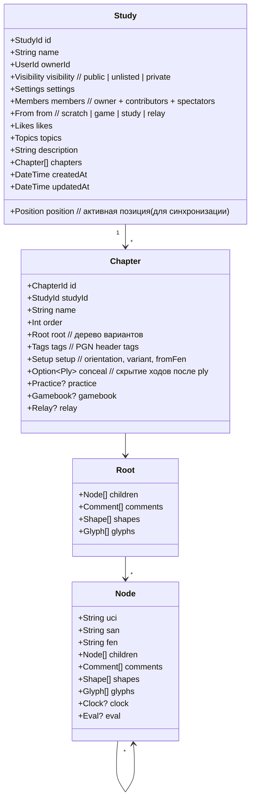
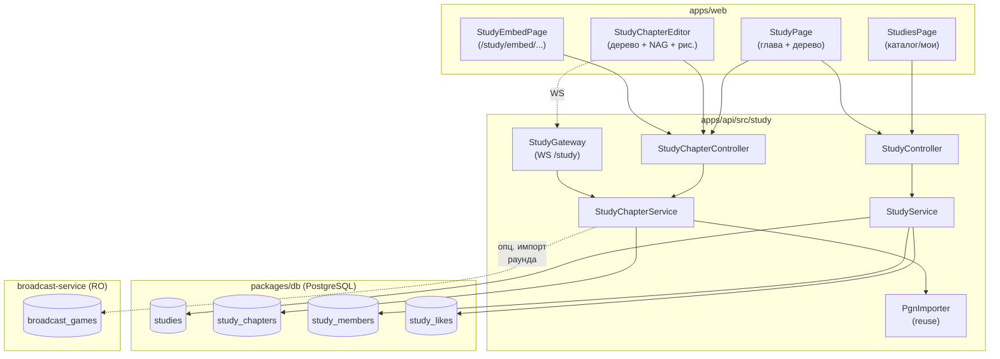

# KS-2792: Lichess Studies — исследование и план заимствования

**Дата:** 2026-05-12
**Автор:** architect
**Статус:** §§1–§2 актуальны (исследование функционала и mapping).
§§3–§7 (план MVP с интеграцией в `/lessons` / AnalysisPage) —
**superseded** задачей KS-2815. Актуальный план MVP —
`docs/architecture/KS-2815-studies-standalone.md`.

> **Важно:** §§3–§7 ниже сохранены как история проектирования. На их
> предложениях основан был вариант D из §7 (Studies как таб в
> `/lessons` + редактор в AnalysisPage). Пользователь отменил такой
> подход в KS-2815 — Studies строятся как самостоятельный раздел без
> интеграции с другими модулями в MVP. Перед декомпозицией читай
> KS-2815, а не §3–§7 здесь.

---

## 0. TL;DR

- Lichess Studies — это «папка из глав» (chapters), каждая глава — дерево
  вариантов с аннотациями, рисунками, NAG, комментариями и одним из режимов
  (analysis / practice / gamebook / conceal). Студия имеет владельца,
  список contributors / viewers и видимость public / unlisted / private.
  Сильные стороны: коллаборативное редактирование в реальном времени,
  PGN-импорт/экспорт, embed, режим gamebook (учебник с вопросами),
  интеграция с broadcast (раунд = студия с автообновлением).
- В Kingside уже есть бо́льшая часть «движка»: дерево ходов с
  NAG/комментариями/стрелками/цветами клеток (`apps/web/src/review`,
  ADR-037), serializer/deserializer PGN с макросами `[%csl][%cal][%cvc]`
  (KS-2152, KS-2285), `Analysis` с PGN-полем и публичной ссылкой
  (`Analysis.isPublic`, ADR-051), broadcast-service (`packages/broadcasts-db`
  + SSE-стрим), Lessons-модуль с шагами (`Lesson`/`LessonStep`).
  Чего нет: понятия «студия из глав», коллаборативного редактирования,
  ролевой модели contributors, режима gamebook, embed-iframe.
- Предлагается ввести новый модуль `study` поверх существующего движка
  анализа, со своей сущностью `Study` и `StudyChapter`. Главу хранить
  как обычный PGN (как в `Analysis`) — это даёт нам бесплатный импорт/
  экспорт, и совместимость с уже написанным review-движком. Коллаборация
  — отложить до этапа 3 (после MVP), на старте делать однопользовательские
  студии с возможностью «принять в соавторы» через приглашение.
- MVP (этап 1, ~2 недели): студия + главы + однопользовательское
  редактирование + PGN-импорт/экспорт + публичная ссылка по chapter.
  Этап 2: gamebook + practice + embed. Этап 3: realtime-коллаборация
  и интеграция с broadcast (раунд → автогенерируемая студия).

---

## 1. Lichess Studies — что и как устроено

### 1.1 Доменная модель (по исходникам `lichess-org/lila`, модуль `study`)



Ключевые свойства:

- **Главы (`Chapter`)**: до 64 на студию. Каждая глава — независимое
  дерево позиций. Можно дублировать, переупорядочивать drag-and-drop'ом,
  переименовывать.
- **Дерево вариантов (`Root` → `Node[]`)**: каждый узел = ход + позиция,
  у узла произвольное число «детей» (вариантов). На узле висят
  комментарии, фигуры (shapes — стрелки и кружки), NAG (`Glyph`).
- **Tags** (PGN header): White/Black/Result/Event/Site и т. п. Записываются
  в PGN при экспорте.
- **Setup**: цвет внизу доски, вариант (standard / Chess960 / King of the
  hill / antichess / atomic / horde / racing kings / three-check / crazyhouse),
  стартовый FEN.
- **Position**: глобальная активная позиция для синхронизации зрителей
  в режиме «follow» (когда автор показывает позицию аудитории).

### 1.2 Режимы главы

| Режим | Что делает | UX |
|------|-----------|----|
| **analysis** (по умолчанию) | Просто дерево вариантов, ходы видны | Свободное редактирование/просмотр |
| **practice** | Бьём «правильную» ветку: предложенный ход в дереве считается правильным, остальные = ошибка. После ошибки даётся подсказка, ход откатывается | Иконка/индикатор «практика» |
| **gamebook** | Интерактивный учебник: автор пишет к каждому ходу инструкцию («сделайте ход» / «правильно» / «неправильно»). Читатель идёт по сценарию, как по интерактивной книжке | Отдельная страница чтения с текстом и доской |
| **conceal** | Скрывает ходы после указанного ply — пока читатель не сделает правильный ход, продолжение не видно | Хорош для тренировочных подборок |
| **hidden moves** (chapter-flag) | Можно спрятать всю ветку до интерактивного взаимодействия | Подвид conceal |

Связь между режимами: они хранятся как опциональные поля у Chapter,
по умолчанию глава в режиме analysis.

### 1.3 Совместная работа и права

- **Роли**: `owner` (создатель, неудаляемый) | `contributor` (полные права на
  редактирование глав) | `viewer` (просмотр, без редактирования).
- **Видимость** (`visibility`):
  - `public` — попадает в каталог, индексируется поиском, доступен всем;
  - `unlisted` — доступен по прямой ссылке, но не в каталоге;
  - `private` — только members.
- **Realtime**: студия — Lichess'овая «room» поверх WebSocket. Любое
  редактирование (добавление хода, комментария, рисунка, переименование
  главы) транслируется всем подключённым участникам мгновенно. Конфликтов
  нет: глава имеет «текущую позицию» (path в дереве), и редактирование
  допускается мерж-фрэндли (добавление детей в узел — коммутативно).
- **Sync mode**: участник может включить «follow leader» — тогда его доска
  следует за позицией владельца. Удобно для трансляции урока.
- **Like / Featured**: соц. метрики, влияют на сортировку в каталоге.

### 1.4 Шаринг

- **PGN-импорт**: вставка PGN целиком → новая глава. Поддержка multi-PGN
  (несколько партий = несколько глав за раз). Парсинг тегов, NAG,
  комментариев, `{[%csl][%cal]}` для рисунков.
- **PGN-экспорт**: одной главы или всей студии. Сохраняет аннотации,
  рисунки, варианты, теги.
- **Прямые ссылки на позицию**: `/study/<studyId>/<chapterId>#<ply>` —
  открывает доску на нужном ходе.
- **Embed**: `<iframe src="https://lichess.org/study/embed/<studyId>/<chapterId>?theme=brown">` —
  встраиваемый просмотрщик, без авторизации, с возможностью идти по
  вариантам.
- **API** (https://lichess.org/api#tag/Studies):
  - `GET /api/study/{studyId}/{chapterId}.pgn` — экспорт главы;
  - `GET /api/study/{studyId}.pgn` — экспорт всей студии;
  - `POST /api/study/{studyId}/import-pgn` — импорт PGN в студию;
  - `GET /api/study/by/{username}` — список студий пользователя.

### 1.5 Интеграция с движком

В studies встроен Stockfish (`fishnet` на сервере + локальный wasm в
браузере), как и в обычном анализе. Оценка позиции отображается рядом
с деревом, по запросу можно запросить «облачный анализ» партии. У узлов
хранятся `eval` и `clock` — это совместимо с PGN-комментариями `%eval`,
`%clk` от broadcast'ов.

### 1.6 Связь с broadcasts и анализом

Lichess'овые **broadcast'ы** реализованы поверх studies: каждый раунд
трансляции — это студия с автоматически генерируемыми главами (одна
глава = одна партия раунда). PGN-обновления приходят по SSE и
автоматически дописываются в дерево соответствующей главы. Это даёт:

- Зрителям возможность писать собственные комментарии/варианты к
  партии (если им дать contributor-доступ).
- Аналитикам — после окончания раунда вся студия остаётся как архив с
  деревом анализа.

В обычном анализе (`/analysis`) тоже работает «save to study» — кнопка
сохраняет текущее дерево как новую главу в выбранную студию.

### 1.7 Комментарии, фигуры рисования, кастомные позиции

- **Текстовые комментарии** к узлу — markdown-подмножество (жирный/
  курсив/ссылки/упоминания).
- **Shapes**: стрелки (`[%cal Re2e4]`) и кружки/подсветка клеток
  (`[%csl Gd4]`), 4 цвета (red/green/blue/yellow). Рисуются ПКМ или
  shift-drag на доске.
- **NAG / glyphs**: 16 стандартных PGN-NAG ($1..$19) + lichess'овая
  расширенная палитра.
- **Кастомные позиции**: каждая глава может стартовать с произвольной
  FEN-позиции (полезно для эндшпиля, задач, дебютных позиций).

### 1.8 Поиск и каталог

- `/study` — главная: «hot», «date added», «recently updated», «most
  popular». Карточка студии показывает обложку, автора, кол-во глав,
  лайки, contributors.
- Поиск по названию, тегам (`#opening`, `#endgame`, ...), владельцу.
- У пользователя — публичный список его студий на странице профиля.

---

## 2. Что уже есть в Kingside (mapping)

### 2.1 Движок анализа

| Lichess Studies | Kingside (где) | Состояние |
|----------------|----------------|-----------|
| Дерево вариантов (`Root`/`Node`) | `ChessMove` linked-list с `variations` (`apps/web/src/review/types.ts`) | ✅ Есть |
| NAG / glyphs | `ChessMove.nags: number[]` (KS-1127) | ✅ Есть |
| Комментарии | `ChessMove.comment` | ✅ Есть |
| Стрелки и кружки | `ChessMove.annotations: NodeAnnotations` (KS-2152), макросы `[%cal][%csl]` | ✅ Есть |
| Цвет варианта | `ChessMove.variationColor` (KS-2285, ADR-038), макрос `[%cvc]` | ✅ Есть, бонус относительно Lichess |
| PGN serializer/deserializer | `apps/web/src/review/utils/PgnSerializer.ts`, `PgnDeserializer.ts` | ✅ Есть |
| Eval / clocks на узле | `ChessMove.eval`, `clock` | ✅ Есть |
| Кастомный FEN-старт | `Analysis.fen` | ✅ Есть |
| Stockfish | Браузерный wasm (ADR-010), плюс серверный (`game-service/engine`) | ✅ Есть |

Вывод: **движка анализа достаточно для studies «как Lichess»**. Глава
по сути — это `Analysis` с дополнительными полями (name, order,
mode, conceal-ply, gamebook-payload).

### 2.2 Хранение анализа

- `Analysis` (`packages/db/prisma/schema.prisma:493`) — single PGN-блоб
  на запись, поле `currentPosition` (path в дереве для UX), `isPublic`,
  публичный эндпоинт `GET /analyses/public/:id` (ADR-051 §3 share-1).
- `GameAnalysis` — отдельная сущность для разбора сыгранных партий.
- `PgnImport` + `PgnImportGame` — уже сейчас можно загрузить multi-PGN
  и получить N partitions; для импорта в студию переиспользуется.

### 2.3 Broadcast-service

- Отдельная БД `packages/broadcasts-db` с моделями `Broadcast` /
  `BroadcastRound` / `BroadcastGame` (см. ADR-021/022).
- PGN партий апдейтится SSE-стримом от Lichess (`apps/broadcast-service/
  src/sync`). У каждой `BroadcastGame.pgn` хранится полный PGN с тегами,
  `%clk`-комментариями, `%eval`.
- Просмотрщик — `apps/web/src/pages/BroadcastGamePage.tsx`.

Связь с studies: на broadcast'е НЕТ дерева аналитических вариантов —
у нас просто live-PGN партии. Лёгкое расширение: рядом с каждой
партией дать кнопку «открыть в новой студии» (импорт PGN), а позже —
автоматически создавать студию-зеркало раунда (как в Lichess).

### 2.4 Lessons / курсы

- `Course` → `Lesson` → `LessonStep`-шаги (text/diagram/drill/video) —
  `packages/db/prisma/schema.prisma:960..` и `apps/api/src/lessons`.
- Это **более «продакшен-готовый» учебный формат**, чем lichess'овый
  gamebook: у нас есть SM-2 повторение (ADR-025), drill'ы (ADR-035),
  редактор курсов в админке (ADR-052).
- Studies в нашем понимании — **более лёгкая, пользовательская
  альтернатива** Lessons (без SM-2, без drill'ов, без шаблонов
  шагов; просто «дерево позиций + комментарии + опционально gamebook»).
- Gamebook из studies = ~70% уже покрыто Lessons (TextStep + DrillStep).
  В MVP **не делаем gamebook**, чтобы не дублировать Lessons. На
  этапе 2 можно добавить «studies-gamebook» как лёгкую альтернативу
  для пользовательского контента (когда полноценный редактор Lessons
  слишком тяжёлый).

### 2.5 Что отсутствует

| Что | Где взять / как делать |
|-----|------------------------|
| Сущность `Study` + `StudyChapter` | Новый модуль `apps/api/src/study`, новые таблицы в `packages/db` |
| Список глав и переупорядочивание | UI компонент, drag-n-drop |
| Импорт multi-PGN → главы | Расширить `PgnImport` или использовать его как есть |
| Публичная ссылка на главу | По аналогии с `Analysis.isPublic` (ADR-051) |
| Embed iframe | Новая страница `/study/embed/:id/:chapterId`, минимальный UI |
| Роли (owner/contributor/viewer) | Новая таблица `StudyMember` |
| Realtime-коллаборация | WebSocket-namespace `/study`, операционные команды (operational transforms / просто «append-only») |
| Practice / conceal / gamebook | Дополнительные поля на `StudyChapter` + UI |
| Каталог + поиск | REST `/study` + индексы Postgres / простой full-text search |

---

## 3. Архитектурное предложение

### 3.1 Высокоуровневая диаграмма



### 3.2 Схема БД (новая, в `packages/db`)

```prisma
/// Учебная студия. Контейнер глав + права/видимость.
model Study {
  id          String   @id @default(uuid()) @db.Uuid
  ownerId     String   @map("owner_id") @db.Uuid
  name        String
  description String?  @db.Text
  /// "public" | "unlisted" | "private"
  visibility  String   @default("private")
  /// Темы/теги для каталога (как `Course.tags`).
  topics      String[] @default([])
  /// Источник студии: "scratch" | "game:<analysisId>" | "broadcast:<roundId>".
  fromKind    String   @default("scratch") @map("from_kind")
  fromRefId   String?  @map("from_ref_id") @db.Uuid
  /// Денормализация: кол-во лайков и кол-во contributors — для каталога без JOIN.
  likes       Int      @default(0)
  membersCount Int     @default(1) @map("members_count")
  chaptersCount Int    @default(0) @map("chapters_count")
  /// Активная глава (для UX «вернуться где был»).
  activeChapterId String? @map("active_chapter_id") @db.Uuid
  createdAt   DateTime @default(now()) @map("created_at")
  updatedAt   DateTime @updatedAt @map("updated_at")

  owner    User @relation(fields: [ownerId], references: [id], onDelete: Cascade)
  chapters StudyChapter[]
  members  StudyMember[]
  likers   StudyLike[]

  @@index([ownerId, updatedAt])
  @@index([visibility, updatedAt])
  @@index([visibility, likes])
  @@map("studies")
}

/// Глава студии. Хранится как PGN-блоб (как и `Analysis`).
model StudyChapter {
  id          String   @id @default(uuid()) @db.Uuid
  studyId     String   @map("study_id") @db.Uuid
  name        String
  /// Целочисленный порядок (gaps по 1000 — для drag-n-drop без переписи всех).
  orderIdx    Int      @map("order_idx")
  /// PGN дерева — формат идентичен `Analysis.pgn` (с макросами %csl/%cal/%cvc).
  pgn         String   @db.Text
  /// Стартовая позиция (FEN). NULL = стандартная начальная.
  startFen    String?  @map("start_fen")
  /// "white" | "black" — ориентация доски снизу.
  orientation String   @default("white")
  /// Режим главы: "analysis" | "practice" | "gamebook" | "conceal".
  mode        String   @default("analysis")
  /// Для mode="conceal" — ply, после которого ходы скрыты (пока не сыграны).
  concealPly  Int?     @map("conceal_ply")
  /// Для mode="gamebook" — JSON-payload с инструкциями: { byUci: { "e2e4": { hint, success, failure } } }.
  gamebook    Json?
  /// Опциональные PGN-tags (event/site/...).
  tags        Json?
  createdAt   DateTime @default(now()) @map("created_at")
  updatedAt   DateTime @updatedAt @map("updated_at")

  study Study @relation(fields: [studyId], references: [id], onDelete: Cascade)

  @@unique([studyId, orderIdx])
  @@index([studyId])
  @@map("study_chapters")
}

/// Membership: автор + соавторы + наблюдатели (для private).
model StudyMember {
  studyId  String @map("study_id") @db.Uuid
  userId   String @map("user_id") @db.Uuid
  /// "owner" | "contributor" | "viewer".
  role     String
  addedAt  DateTime @default(now()) @map("added_at")

  study Study @relation(fields: [studyId], references: [id], onDelete: Cascade)
  user  User  @relation(fields: [userId], references: [id], onDelete: Cascade)

  @@id([studyId, userId])
  @@index([userId])
  @@map("study_members")
}

/// Лайки (для сортировки в каталоге).
model StudyLike {
  studyId String   @map("study_id") @db.Uuid
  userId  String   @map("user_id") @db.Uuid
  likedAt DateTime @default(now()) @map("liked_at")

  study Study @relation(fields: [studyId], references: [id], onDelete: Cascade)
  user  User  @relation(fields: [userId], references: [id], onDelete: Cascade)

  @@id([studyId, userId])
  @@index([userId])
  @@map("study_likes")
}
```

Обоснование решений:

- **PGN-блоб вместо нормализованного дерева в БД**. Минимальное
  изменение кода: serializer/deserializer уже работает, импорт/экспорт
  тривиален. Минус — невозможен «частичный апдейт» дерева на стороне БД
  (надо переписывать весь pgn при любом изменении). Для MVP — приемлемо
  (главы редкие, до 100 КБ pgn). На этапе 3 (realtime) — рассмотреть
  переход на нормализованное хранение (отдельная таблица `nodes`).
- **`orderIdx` с шагом 1000**: классический трюк drag-n-drop —
  чтобы не переписывать все строки при вставке. При исчерпании gap'а
  фоновый job перенумеровывает.
- **`fromKind`/`fromRefId`**: единое поле «откуда родилась студия» для
  UI «open analysis», «open broadcast round» и т. п. Без FK (на разные
  таблицы), валидация в коде.
- **`StudyLike` отдельной таблицей, `studies.likes` денормализован**:
  каталог часто сортируется по `likes` — без денормализации нужен
  COUNT(*) или materialized view.
- **`visibility` строкой, не enum'ом Prisma**: по ADR-023 политике
  «строки вместо enum» (избегаем тяжёлых миграций enum'а).
- **64 главы лимит как у Lichess** — enforce в сервисе, без CHECK
  constraint (валидация и сообщение об ошибке проще).

### 3.3 API (REST)

Базовый префикс `/study` (NestJS-модуль `apps/api/src/study`).

| Метод | Путь | Описание | Auth |
|-------|------|----------|------|
| `GET` | `/study` | Каталог: `?sort=hot|new|popular&q=&topic=&page=` | optional (для лайков «мои») |
| `GET` | `/study/mine` | Студии текущего пользователя (owner + member) | required |
| `GET` | `/study/by/:userId` | Публичные студии пользователя | optional |
| `POST` | `/study` | Создать пустую студию `{name, visibility, fromKind?}` | required |
| `GET` | `/study/:id` | Метаданные студии + список глав (без pgn) | optional (зависит от visibility) |
| `PATCH` | `/study/:id` | Изменить name/description/visibility/topics | owner/contributor |
| `DELETE` | `/study/:id` | Удалить | owner |
| `POST` | `/study/:id/members` | Пригласить (`{userId, role}`) | owner |
| `DELETE` | `/study/:id/members/:userId` | Снять права | owner / self |
| `POST` | `/study/:id/like` | Лайк/анлайк (toggle) | required |
| `POST` | `/study/:id/import-pgn` | Импорт N-PGN → N новых глав | owner/contributor |
| `GET` | `/study/:id/export.pgn` | Экспорт всей студии (text/x-chess-pgn) | optional |
| | | | |
| `GET` | `/study/:id/chapter/:chapterId` | Глава: pgn + meta | optional (visibility) |
| `POST` | `/study/:id/chapter` | Создать главу `{name, startFen?, orientation?, mode?, pgn?}` | owner/contributor |
| `PATCH` | `/study/:id/chapter/:chapterId` | Обновить name/mode/concealPly/gamebook/pgn (полный pgn-rewrite) | owner/contributor |
| `PATCH` | `/study/:id/chapter/:chapterId/order` | Переупорядочить (`{after: chapterId|null}`) | owner/contributor |
| `DELETE` | `/study/:id/chapter/:chapterId` | Удалить главу | owner/contributor |
| `GET` | `/study/:id/chapter/:chapterId/export.pgn` | Экспорт одной главы | optional |
| `GET` | `/study/:id/embed/:chapterId` | Embed-страница (HTML) | public, X-Frame-Options: ALLOWALL |

Публичный доступ (`optional` auth) — по аналогии с `GET
/analyses/public/:id` (ADR-051 share-1/share-2): если
`visibility != "private"` — отдаём без auth, иначе 404 (не 403, чтобы
не светить наличие).

### 3.4 WebSocket (этап 3, после MVP)

WS-namespace `/study`. Подключение по `studyId`, аутентификация через
handshake JWT (как в `/game`).

События (минимум):

```
client → server:
  study:join { studyId }
  study:leave { studyId }
  chapter:select { chapterId }
  // Op = операционная команда над деревом главы:
  chapter:op { chapterId, op: { kind: "addMove", parentPath, uci }
                                 | { kind: "setComment", path, text }
                                 | { kind: "setShapes", path, shapes }
                                 | { kind: "setNags", path, nags }
                                 | { kind: "deleteVariation", path }
                                 | { kind: "promote", path } }

server → client:
  chapter:op    { chapterId, op, byUserId, version }   // broадкаст op'а
  chapter:full  { chapterId, pgn, version }            // снэпшот при rejoin / desync
  study:meta    { ... }                                // изменения metadata
  presence      { studyId, users: [{ userId, name, atPath }] }
```

Версионирование: `version` — простой monotonic counter на главу
(Postgres `UPDATE ... SET version = version + 1 RETURNING version`).
Конфликт-резолюция — last-write-wins по полям-листам (comment, shapes,
nags); addMove идемпотентен по (parentPath, uci); deleteVariation =
soft на клиенте, hard на сервере.

Compute heavy — серверный PGN-rewrite после каждой op. Чтобы не
переписывать всю главу каждый op, держим **in-memory модель главы**
в Redis при наличии активных подключений (TTL = 1 час после
последнего disconnect, далее sync в БД). Похоже на game-state в
Redis (`apps/game-service/src/game`).

### 3.5 Frontend — компоненты

```
apps/web/src/
├── pages/
│   ├── StudiesPage.tsx              // каталог + «мои студии»
│   ├── StudyPage.tsx                // студия + активная глава
│   ├── StudyEmbedPage.tsx           // embed iframe (без сайдбара)
│   └── StudyImportPgnPage.tsx       // импорт multi-PGN
├── components/study/
│   ├── ChapterList.tsx              // список глав, drag-n-drop, +/−
│   ├── ChapterEditor.tsx            // wrapper над <ReviewBoard> + сайдбар
│   ├── ChapterMeta.tsx              // name/mode/orientation/conceal-ply
│   ├── GamebookEditor.tsx           // редактор инструкций (этап 2)
│   ├── GamebookReader.tsx           // режим чтения gamebook (этап 2)
│   ├── PracticeOverlay.tsx          // режим practice (этап 2)
│   ├── StudyMembersDialog.tsx       // пригласить contributor
│   ├── StudyShareDialog.tsx         // visibility, ссылка, embed-код
│   └── StudyCatalogCard.tsx         // карточка в каталоге
└── hooks/
    ├── useStudy.ts                  // загрузка студии + глав
    ├── useChapterTree.ts            // tree-модель главы (поверх review)
    └── useStudySocket.ts            // WS-клиент (этап 3)
```

Переиспользование (важно — KS conventions «найди существующий аналог»):

- `apps/web/src/review/*` — модель дерева, рендер вариантов, NAG,
  стрелки, цветовые маркеры. **Используется как есть** в
  `ChapterEditor`.
- `apps/web/src/pages/AnalysisPage.tsx` — образец композиции
  «доска + сайдбар вариантов»; `StudyPage` строится на тех же
  стилях.
- `apps/web/src/components/MemoChessboard.tsx` — общий компонент
  доски.
- `apps/web/src/components/PgnHeadersModal.tsx` — редактор тегов
  (переиспользуется для главы).

### 3.6 Связь с broadcast и анализом

- **Кнопка «Open in Study» в AnalysisPage**: создаёт новую студию
  `fromKind="game"`, `fromRefId=<analysisId>`, одна глава с pgn'ом
  анализа. UX: «Save → Study» дропдаун.
- **Кнопка «Open in Study» в BroadcastGamePage**: создаёт студию
  `fromKind="broadcast"`, `fromRefId=<broadcastGameId>`, одна глава
  с текущим PGN партии.
- **Этап 3 расширение**: автоматическое зеркало раунда. Когда
  broadcast-worker детектирует новый раунд, broadcast-service ставит
  задачу в очередь → api-сервис создаёт студию `fromKind="broadcast"`,
  `fromRefId=<roundId>`, N глав = N партий. Дальше PGN-обновления раунда
  пишут в pgn соответствующей главы (один writer — broadcast-worker
  через шину; api студию не редактирует). Это требует переписать
  схему на нормализованное дерево либо ввести «append-pgn» операцию
  в `StudyChapterService` — обсуждается в этапе 3.

---

## 4. Поэтапный план внедрения

### Этап 1 — MVP однопользовательской студии (≈2 недели, 1 разработчик)

**Цель**: пользователь может создать студию, добавить главы, импортнуть
PGN, расшарить публичной ссылкой / экспортнуть PGN.

| Задача | Зона | Сложность |
|--------|------|-----------|
| Миграция: `studies`, `study_chapters`, `study_members`, `study_likes` | backend | S |
| NestJS-модуль `apps/api/src/study`: контроллеры + сервисы + guard | backend | M |
| REST-эндпоинты §3.3 кроме `/embed` и членства | backend | M |
| Юнит-тесты сервиса (включая 64-главы лимит, права owner/contributor) | backend | M |
| Импорт multi-PGN: переиспользовать `pgn.parser.ts` из `workshop` | backend | S |
| Экспорт `.pgn` (одна глава / вся студия) — text/x-chess-pgn | backend | S |
| Страница `StudiesPage` (каталог + «мои») | frontend | M |
| Страница `StudyPage` с `ChapterList` и `ChapterEditor` (analysis-режим) | frontend | L |
| Drag-n-drop глав | frontend | S |
| Диалог импорта PGN | frontend | S |
| Диалог расшаринга (visibility + ссылка) | frontend | S |
| i18n (ru/en) | frontend | S |
| Тесты (vitest, ≥1 «happy path» интеграционный) | frontend | M |

**Зависимости**: только существующие модули `review`, `auth`,
`prisma`. `broadcast-service` и `lessons` не трогаем.

**Риски**:
- PGN-импорт может валить парсер на нестандартных партиях (Chess960
  без `[Variant]`, не-ASCII в комментариях). Митигация: переиспользуем
  уже отлаженный `apps/api/src/workshop/pgn.parser.ts`.
- Видимость / приватные студии — частая ошибка авторизации.
  Митигация: один guard `StudyAccessGuard`, покрытый юнит-тестами на
  каждый комбинации (anon / member / owner) × (private / unlisted / public).

**Метки задач**: `analysis`.

### Этап 2 — режимы и embed (≈1.5 недели)

**Цель**: gamebook + practice + conceal + публичный embed. Это
«учебный» слой для авторов курсов / тренеров.

| Задача | Зона | Сложность |
|--------|------|-----------|
| Поле `mode` + UI выбора режима в `ChapterMeta` | frontend | S |
| `PracticeOverlay`: проверка хода против дерева, hint после ошибки | frontend | M |
| `concealPly`: скрытие ветки после ply, drum-roll показ при достижении | frontend | M |
| `GamebookEditor`: форма «hint / success / failure» к каждому ходу | frontend | L |
| `GamebookReader`: режим чтения, fullscreen-страница | frontend | M |
| Эндпоинт `/study/:id/embed/:chapterId` + страница `StudyEmbedPage` | full-stack | M |
| Удалить `X-Frame-Options: DENY` для `/study/embed/*` (nginx config) | devops | S |
| Embed-код в `StudyShareDialog` (copy-iframe-snippet) | frontend | S |
| Поиск по каталогу (`?q=`, full-text по name+description+topics через `to_tsvector`) | backend | M |

**Зависимости**:
- На gamebook — посмотреть на `LessonStep.kind="text"` как образец
  data-структуры; не дублировать TextStep, а сделать «лёгкий»
  gamebook-payload как JSON.
- На embed — согласовать с devops/marketing CSP/CORS политики.

**Риски**:
- Дублирование с Lessons — высокий. Митигация: чёткое позиционирование:
  Lessons = курс с SM-2/drill'ами и редакторской поддержкой; Studies =
  свободный «черновик» / пользовательский контент / коллаб.

**Метки**: `analysis`.

### Этап 3 — коллаборация + broadcast-зеркало (≈3 недели)

**Цель**: реалтайм-редактирование несколькими пользователями + раунды
broadcast'а автоматически становятся студиями.

| Задача | Зона | Сложность |
|--------|------|-----------|
| WS-namespace `/study`, gateway, guards | backend | M |
| In-memory модель главы в Redis (по аналогии с game-state) | backend | L |
| Операции дерева (addMove/setComment/setShapes/...) | backend | L |
| Sync ↔ БД (batch flush в pgn раз в N секунд + on-disconnect) | backend | M |
| Presence (кто в студии, на какой ноде) | backend | M |
| Frontend WS-клиент `useStudySocket` + optimistic UI | frontend | L |
| Conflict-resolution тесты (mock-сценарии «два юзера правят одно»)  | full-stack | M |
| `StudyMembersDialog`: пригласить, изменить роль, убрать | frontend | M |
| Уведомления о приглашении (через `NotificationModule`) | backend | S |
| Broadcast → Study автоматическое зеркало раунда (опц. flag в `BroadcastRound`) | backend / broadcast-service | L |
| Append-PGN операция в `StudyChapterService` (только для broadcast-зеркал) | backend | M |

**Зависимости**:
- broadcast-зеркало требует доработки `broadcast-service`: при
  upsert'е раунда (`apps/broadcast-service/src/sync`) посылать
  HTTP-уведомление api / событие шине → api создаёт/апдейтит студию.
  ADR на пересечение двух БД (broadcasts-db и main db) — нужен отдельный.
- WS-инфраструктура — Redis adapter для Socket.IO; пока используется
  single-node, sticky sessions достаточны.

**Риски**:
- Сложность OT/CRDT на дереве вариантов. Митигация: НЕ делаем
  полноценный OT — используем последовательность операций с
  serializability на стороне сервера («один writer на главу» в
  момент времени, очередь op'ов в Redis-list).
- Производительность PGN-rewrite в БД — если у главы 50 КБ pgn'а и
  обновление каждый ход, БД задыхается. Митигация: batch-flush
  («лениво»), in-memory state в Redis как авторитет в момент сессии.

**Метки**: `analysis`, `broadcast`, `performance`.

### Этап 4 (опц.) — каталог-социалка

Лайки, тренды, рекомендации, теги, страница популярных авторов.
Можно делать инкрементально вне основного roadmap'а — это product, не
infra.

---

## 5. Сводная оценка

| Этап | Объём (раб. дни 1 разработчика) | Зависимости | Риск |
|------|----------------------------------|-------------|------|
| 1. MVP | 10–12 | none | низкий |
| 2. Режимы + embed | 7–8 | nginx-config | средний (дублирование с Lessons) |
| 3. Realtime + broadcast | 13–15 | broadcast-service, Redis adapter | высокий (WS-конкурентность) |
| 4. Социалка | 5–7 | этап 1 | низкий |

**Рекомендация координатору**: делать строго по этапам, между ними —
смотреть, нужны ли все остальные. После MVP станет видно, насколько
пользователи будут использовать studies vs Lessons — решит, стоит ли
вкладываться в gamebook / реалтайм.

---

## 6. Открытые вопросы (на согласование)

1. **MVP-режим главы — только analysis?** Или сразу `practice` тоже
   (он самый простой, ~1 день работы)? Рекомендация: добавить
   `practice` в MVP, отказаться от gamebook до этапа 2.
2. **Лимит 64 главы — фиксированный или настраиваемый?** В Lichess
   жёстко 64. Рекомендация: 64 на уровне сервиса как константа.
3. **Broadcast-зеркало (этап 3) — обязательное или opt-in?** Если
   обязательное для всех раундов — создаём ≈1000+ студий в день
   автоматически, забивая каталог. Рекомендация: opt-in через флаг
   `BroadcastRound.mirrorToStudy` или ручная кнопка «open as study»
   у пользователя.
4. **Хранение дерева: PGN-блоб vs нормализованная схема.** В MVP —
   pgn. Перейти на нормализованную (`study_chapter_nodes`) есть смысл
   только при этапе 3, и только если WS-операции тормозят.
5. **Связь с `Analysis`**: «Save to study» из AnalysisPage — это
   копия или связь? Рекомендация: копия (создаётся новая
   `StudyChapter` с тем же pgn, `fromRefId=<analysisId>` метка для
   обратной ссылки). Так Analysis остаётся как «черновик», Study —
   как «опубликованное».

---

## 7. KS-2793 — единая точка входа в обучающий контент

Эта глава — дополнение по задаче KS-2793. Пользователь, посмотрев план
§§1–6, попросил **не добавлять отдельный пункт меню `Studies`** рядом с
`Lessons` — на сайте уже много разделов.

### 7.1 Аудит «обучающих» разделов в навигации (sidebar, сейчас)

Из `apps/web/src/components/Sidebar.tsx` (`NAV_ITEMS`):

| Пункт | Иконка | Маршрут | Концептуально «обучение»? | Комментарий |
|-------|--------|---------|----------------------------|-------------|
| Главная | 🏠 | `/lobby` | — | Лобби сайта |
| Играть | ♟ | `/play` | — | Подбор партии |
| Турниры | 🏆 | `/tournaments` | — | Соревновательная игра |
| Задачи | 🧩 | `/puzzles` | **да** | Тактические задачи (lichess-puzzles) |
| Puzzle Rush | ⚡ | `/puzzle-rush` | **да** | Скоростной набор задач на время |
| Тренажёры | 🧠 | `/drills` | **да** | Шаблонные drill'ы (ADR-035): найти все шахи, висящую фигуру и т. п. |
| Точность | 🎯 | `/precision` | **да** | Play-vs-engine (ADR-048): доводить позицию против Stockfish |
| Уроки | 🎓 | `/lessons` | **да** | Курсы + уроки + шаги (ADR-024/025/052/054), SM-2 повторение |
| Лаборатория | 🔬 | `/workshop`, `/analysis` | **частично** | Анализ партий, PGN-импорт; обучение через «свой» разбор |
| Архив | 📚 | `/archive` | **частично** | Изучение партий игроков; обучение через прецеденты |
| Трансляции | 📺 | `/broadcasts` | **частично** | Просмотр live-турниров, обучающего контента в чистом виде там нет |

Итого: **5 «обучающих» пунктов** в чистом виде (Задачи, Rush, Тренажёры,
Точность, Уроки) и **3 пограничных** (Workshop, Архив, Трансляции).
Добавление `Studies` шестым пунктом — действительно перегруз. Сейчас
все пять «чистых» расположены подряд в sidebar — это уже сигнал, что
просится сворачивание под одну точку.

В KS-2791 (висит в TODO) пользователь уже отметил «много разделов» —
данное дополнение пересекается с этой работой; рекомендую запланировать
исполнение совместно.

### 7.2 Варианты объединения

#### Вариант A. «Обучение» как один раздел с табами

Один пункт sidebar `🎓 Обучение` → страница `/learn` с табами:

```
┌─ /learn ────────────────────────────────────────────────┐
│ [Курсы] [Студии] [Задачи] [Тренажёры] [Точность] [Rush] │
│                                                          │
│ <содержимое выбранного таба>                             │
└──────────────────────────────────────────────────────────┘
```

- В URL — query (`/learn?tab=studies`) или подмаршрут (`/learn/studies`),
  для глубоких ссылок и SEO.
- Studies и Lessons в БД остаются разными таблицами — на UI они
  делят только лэндинг и общий sidebar-пункт.
- Sidebar схлопывается на 4 пункта (–4): пропадают Уроки, Задачи,
  Тренажёры, Точность, Rush; добавляется один Обучение.

**Плюсы:**
- Минимум изменений в БД и backend: всё уже работает, переписываем
  только sidebar + roof-страницу.
- Studies остаётся как «свободная» сущность с тем же планом
  §§3–4 — план MVP в днях не растёт.
- Чистый sidebar: 1 пункт «Обучение» вместо 5–6.
- Будущая разработка не упирается ни во что: новый формат обучающего
  контента → ещё один таб без правки навигации.

**Минусы:**
- 6 табов на mobile становятся горизонтальной полосой со скроллом —
  UX не идеален. Митигация: на mobile рендерить вертикальный список
  карточек вместо tab-bar'а.
- Прыжки между типами контента остаются: пользователь, начавший
  изучение в Studies, не «провалится» в Lessons и обратно. Это
  скорее объединение визуальное, чем смысловое.
- Lessons-главная сейчас — содержательная (DiscoverCoursesPage с
  блоками: «продолжить», «рекомендации», «авторы»). Прятать её в таб
  — потеря маркетинга курсов.

#### Вариант B. Studies сливается со «свободным» Lesson

Studies становится `kind='study'` (новый литерал) у существующего
`Lesson`. Глава = LessonStep с типом `tree` (новый тип шага рядом с
`text|position|puzzle|quiz|video|game_review`). Отдельных таблиц
`studies/study_chapters/study_members/study_likes` нет.

Mapping:

| Studies-понятие | В модели Lessons |
|----------------|-------------------|
| Study | `Course` с `ownerId != NULL`, флаг или новый kind «свободный» |
| Chapter | `Lesson` с `kind='study'` |
| Узел дерева | `LessonStep.type='tree'`, payload = PGN-блоб (или сериализованное поддерево) |
| Contributors (этап 3) | новое поле `Course.contributors[]` |
| Visibility public/unlisted/private | `Course.isPublic` (есть) + новое `Course.unlisted` |
| Лайки | новая таблица `course_likes` (заодно покроет пользовательские курсы) |

**Плюсы:**
- Один тип сущности «обучающий контент» — концептуально чисто.
- Готовая инфраструктура: editor-pipeline (`LessonEditorPage`,
  ADR-052 admin API), CourseCard, прогресс (`UserCourseProgress`,
  `UserLessonProgress`), SM-2 — потенциально доступны.
- Sidebar: 1 пункт «Уроки», как сейчас.

**Минусы:**
- **SM-2 ломается**: `LessonReview` создаётся при `score ≥ 80`. У
  «студийных» уроков нет понятия score (это свободное дерево, а не
  оценочный quiz). Нужен либо новый guard «не создавать review
  для study-уроков», либо `LessonReview.lessonId NULL для studies`.
  Любое решение — рисковая инвазия в работающий SM-2 (ADR-025).
- **stepsState ломается**: `UserLessonProgress.stepsState` — это
  `{stepId: 'done'|'failed'|'skipped'}`. У дерева вариантов
  понятие «step done» отсутствует. Нужен новый `tree-step` со своим
  типом прогресса (либо «всегда done»).
- **Admin-pipeline создан под систему «шаги»** (ADR-052,
  `apps/api/src/lessons/admin/*`, `lessons/editor/*`,
  `packages/lesson-schema`, `pdf-to-lesson-yaml`). У нас YAML-импорт
  уроков, импорт-валидатор, lesson-schema. «Дерево вариантов» в
  YAML-формате не предусмотрено — потребует расширения схемы и
  импортёра.
- **Каталог**: `DiscoverCoursesPage` сделан под «курс из уроков»
  (CourseCard с обложкой, audience/hook/outcome). Студии (свободное
  дерево) не имеют этих полей — каталог станет смешанным
  концептуально.
- **Тип шага `tree` нарушает гранулярность LessonStep**: сейчас
  step — атомарный шаг с одной задачей/позицией/текстом. Дерево
  вариантов — это не шаг, это вся «глава». Семантически натягивание.
- Объём миграции и регрессий — большой. Рискуем в Lessons (живая
  фича) ради того, чтобы не добавить sidebar-пункт.

#### Вариант C. Studies как расширение AnalysisPage

Не делать раздел вообще. Расширяем `WorkshopPage`/`AnalysisPage`:

- На странице анализа добавляется панель «Главы» — несколько pgn-деревьев
  внутри одного «документа»-анализа.
- `Analysis` остаётся, но получает родительскую сущность
  `AnalysisDocument` (UUID + name + visibility), а `Analysis` →
  `AnalysisDocument.chapters[]` (FK + order).
- Sidebar: ничего не меняется (`Лаборатория` уже есть).
- Каталог публичных «студий» = отдельная вкладка на
  `MyAnalysesPage`/`WorkshopPage` («Публичные», «Мои»,
  «Друзей» — будущее).

**Плюсы:**
- Sidebar не растёт ни на пункт.
- Минимально инвазивно: `Analysis` уже умеет pgn-дерево,
  публичную ссылку (`isPublic`, ADR-051), share-кнопку.
- Концептуально логично: «студия» — это и есть продвинутый анализ
  с многими главами.

**Минусы:**
- AnalysisPage и так нагружен: дерево вариантов, NAG-палитра, eval,
  стрелки, archive-tree-panel (ADR-013/014). Ещё одна панель «главы»
  + переключатель главы + UI multi-PGN импорта в одну страницу — может
  стать перегруженной.
- Lessons остаётся отдельной сущностью — единой точки входа в
  обучение всё равно нет (Уроки в одном пункте sidebar, «студии» —
  в Лаборатории; пользователь, ищущий «дебюты», не догадается, что
  это в `/workshop`).
- Архивы партий и пользовательский контент мешаются концептуально:
  Workshop задумывался как «лабораторный» инструмент анализа, а не
  как библиотека учебных материалов.
- Коллаборативная сессия (этап 3 §3.4) на странице анализа выглядит
  странно — анализ исторически приватный workflow.
- Embed (`/study/embed/...`) — отдельная страница, не вяжется с
  workshop.

#### Вариант D (рекомендуемый). Studies — режим внутри AnalysisPage; каталог — таб в /lessons

Гибрид B+C, разводящий рантайм и навигацию:

1. **Создание/редактирование** студии — внутри `AnalysisPage` (как
   в C): на странице анализа можно превратить документ в «студию из N
   глав» (`Analysis` → `Study` + `StudyChapter[]`, с миграцией одного
   pgn-блоба в первую главу). Кнопка «Добавить главу» — есть на
   странице. Этим экономим UI-страницу: редактор studies = редактор
   анализа.
2. **Каталог и обнаружение** студий и курсов — в `/lessons` как
   подразделы (таб или ленточный фильтр):
   - `Курсы` (system + user) — то, что в `DiscoverCoursesPage` сейчас.
   - `Студии` — каталог публичных Study + «мои студии».
   - (опц.) `Сборники задач` / `Trainers` — для будущего объединения
     Drills/Precision/Rush.
   Sidebar остаётся: `🎓 Уроки` → ребрендинг в `🎓 Обучение`.
3. **Sidebar схлопывание**: тренажёры (`/drills`), точность
   (`/precision`), rush (`/puzzle-rush`), задачи (`/puzzles`) — на
   первом шаге **не трогаем** (это отдельная задача KS-2791). На
   втором — можно убрать в таб «Тренажёры» внутри `/learn`.

То есть Studies существует как **отдельная backend-сущность** (как в
плане §§3–4 — отдельные таблицы), но в навигации **не получает своего
пункта**:
- редактор — внутри AnalysisPage (workflow «анализ → опубликовать как
  главу студии»),
- каталог — внутри `/lessons` (обучающая витрина с табом «Студии»).

**Плюсы:**
- Backend-план §§3–4 **сохраняется** без изменений: те же таблицы,
  тот же API. Меняется только frontend-роутинг и пара точек интеграции.
- SM-2 / lesson editor / lesson-schema / admin pipeline — **не
  трогаются**. Studies не лезет в Lesson-схему.
- Каталог Studies живёт в правильном месте (`/lessons` — раздел
  «Обучение»), редактор — там, где работает движок дерева
  (`/analysis`). Каждый компонент — на своём месте.
- Sidebar не растёт; концептуально оформляется как «учебный
  раздел».
- Embed-страница (`/study/embed/...`) — изолированна, не лезет ни в
  Lessons, ни в Workshop.
- Подходит как промежуточный шаг к более крупной перестройке
  навигации (KS-2791) без блокировки.

**Минусы:**
- Лёгкая шизофрения: «студия редактируется в одном разделе, каталог
  в другом». Митигация: ссылка «открыть в редакторе» из карточки
  студии в каталоге = переход на `/analysis/<chapterId>`; ссылка
  «вернуться в каталог» — из AnalysisPage. Пользователь не должен
  набирать URL руками.
- `/lessons` теперь — «контейнер витрин», а не только курсы. Нужно
  ребрендить i18n-ключ `nav.lessons` → `nav.learn`. Существующие
  ссылки (хедер /lessons/my, прогресс «мои курсы») — продолжают
  работать на под-маршрутах.

### 7.3 Сравнение вариантов

| Критерий | A. Tabs «Обучение» | B. Слияние Study↔Lesson | C. Studies в Workshop | **D. Editor+Catalog раздельно** |
|----------|--------------------|--------------------------|------------------------|-----------------------------------|
| Sidebar (количество пунктов «обучения») | 1 | 1 (как сейчас) | 5 (не меняется) | 1 |
| Перегрузка AnalysisPage | нет | нет | **высокая** | средняя (новые «главы», но без каталога) |
| Влияние на SM-2 / Lessons-editor | нет | **высокое** (риск регрессий) | нет | нет |
| Дублирование UI с DiscoverCoursesPage | среднее | нет | низкое | **низкое** (используем как контейнер) |
| Сложность backend-плана (§§3–4) | без изменений | **переделка**, +30–40% | без изменений | без изменений |
| Совместимость с этапами 2/3 (gamebook, realtime, broadcast-зеркало) | ок | gamebook конфликтует с LessonStep | broadcast-зеркало в Workshop концептуально странно | **ок** (Studies остаётся самостоятельной сущностью) |
| Концептуальная чистота | средняя (визуальное склеивание) | формально лучшая, на практике натянутая | средняя | **хорошая** (каждый компонент на своём месте) |
| Объём изменений frontend поверх §§3–4 | средний (новая roof-страница) | **большой** (переписать editor под tree-step) | средний (расширение AnalysisPage) | малый (новый таб в `/lessons` + minor в AnalysisPage) |

### 7.4 Рекомендация: вариант D

Основания:

- **Минимум риска**. Backend §§3–4 сохраняется как есть (новый
  модуль `study`, новые таблицы), что снимает риски слияния с
  Lessons (SM-2, lesson-schema, editor — все хрупкие точки).
- **Sidebar не растёт**: пункт `Уроки` ребрендится в `Обучение`,
  пользователь видит один вход в обучающий контент.
- **Редактор там, где движок**. AnalysisPage уже умеет дерево,
  NAG, стрелки, цвета — превратить её в «редактор главы»
  естественно. UI-инвестиции — минимальные (панель «Главы» +
  переключатель + multi-PGN импорт).
- **Этапы 2/3 из §§4.* совместимы**. Gamebook, practice, conceal,
  realtime, broadcast-зеркало — всё это живёт на `Study/StudyChapter`,
  никак не задевая Lessons.
- **Подгоняется под KS-2791**: будущая ревизия навигации может
  втянуть в «Обучение» ещё и Drills/Precision/Rush — без
  ломки текущей реализации.

Вариант B (слияние сущностей) — отказывается из-за высоких рисков
ломки SM-2 и admin/editor pipeline'а ради сомнительной концептуальной
чистоты. Вариант A (просто табы) — слабее D: появляется новая
roof-страница `/learn`, в которую надо что-то полезное положить
кроме редиректов на старые маршруты. Вариант C (всё в AnalysisPage)
— оставляет sidebar перегруженным и плохо работает с этапом 3
(broadcast-зеркало, realtime).

### 7.5 Пересмотренный план MVP (под вариант D)

Делитas на 2 трека: backend (как в §4.1, без изменений) и frontend
(адаптация интеграции).

**Backend** — без изменений к §4.1:

| Задача | Сложность |
|--------|-----------|
| Миграция: `studies`, `study_chapters`, `study_members`, `study_likes` | S |
| Модуль `apps/api/src/study`: контроллеры + сервисы + guard | M |
| REST §3.3 (без `/embed` и членства, как в этапе 1) | M |
| Импорт multi-PGN (переиспользовать `workshop/pgn.parser.ts`) | S |
| Экспорт `.pgn` (глава / студия) | S |
| Юнит-тесты сервиса (включая 64-главы лимит, права) | M |

**Frontend** (отличия от §4.1):

| Задача | Сложность | Δ к §4.1 |
|--------|-----------|---------|
| ~~StudiesPage (каталог + «мои»)~~ → **встроить каталог в `LessonsPage` новым табом «Студии»** | M | без изменений по объёму |
| ~~StudyPage с ChapterList и ChapterEditor~~ → **расширить AnalysisPage**: панель «Главы», переключатель, multi-PGN импорт | M | **меньше** (–1 страница, +1 панель) |
| StudyShareDialog (visibility + ссылка) — открывается из AnalysisPage | S | без изменений |
| Импорт-диалог (multi-PGN → главы) — из AnalysisPage | S | без изменений |
| Drag-n-drop глав в панели | S | без изменений |
| i18n: ребрендинг `nav.lessons` → `nav.learn`, новые ключи табов | S | **+0.5 дня** |
| Тесты (vitest, ≥1 интеграционный для catalog tab и editor flow) | M | без изменений |
| Sidebar-патч: иконка/название «Обучение», ничего не дропаем | S | новая микро-задача |

Итог по объёму:

| | Backend | Frontend | Итого |
|--|---------|-----------|--------|
| §4.1 исходный MVP | 5–6 дн | 5–6 дн | **10–12 дн** |
| Вариант D | 5–6 дн | 4–5 дн | **9–11 дн** |

Объём чуть **меньше**, не больше: отказались от отдельной
`StudyPage` (–1.5–2 дня), добавили ребрендинг `nav` и таб в
`LessonsPage` (+0.5–1 дня), панель «Главы» в AnalysisPage примерно
эквивалентна выпавшей `ChapterList` отдельной страницы.

### 7.6 Предлагаемая декомпозиция тикетов

(Под backend без изменений к §4.1; ниже — frontend-тикеты варианта D.)

1. **Schema + migration + Prisma-клиент** для `studies/study_chapters/
   study_members/study_likes` (backend).
2. **`StudyService` + `StudyChapterService` + `StudyAccessGuard`**
   (backend, юнит-тесты).
3. **REST: studies CRUD + chapters CRUD + likes** (backend).
4. **REST: import-pgn + export.pgn** (backend, переиспользовать
   `workshop/pgn.parser.ts`).
5. **Frontend: `LessonsPage` — таб «Студии»** (каталог + «мои»,
   карточки `StudyCatalogCard`).
6. **Frontend: `AnalysisPage` — панель «Главы» + переключатель + WS-
   независимый локальный state** (без realtime пока что).
7. **Frontend: диалоги `StudyShareDialog`, импорт PGN, drag-n-drop**.
8. **Frontend: ребрендинг `nav.lessons` → `nav.learn`** (sidebar
   + mobile + i18n).
9. **Frontend + Backend: эндпоинт `GET /study/:id/chapter/:cid` для
   публичных глав; страница `/study/c/:cid` (минимальный
   просмотрщик главы) — для расшаренной ссылки**.

Этапы 2/3 из §§4.2–4.3 (режимы, embed, realtime, broadcast-зеркало) —
остаются как в §4, без изменений в декомпозиции.

### 7.7 Открытые вопросы по KS-2793

1. Ребрендинг `nav.lessons` → `nav.learn` (`«Уроки»` → `«Обучение»`).
   Изменится ли i18n-ключ или только подпись? Рекомендация: ключ
   меняем (`nav.learn`), редирект `/lessons` → `/learn` на стороне
   web (или маршрут остаётся `/lessons`, меняется только подпись —
   что проще, согласовать с координатором).
2. Где живёт «опубликовать как студию» CTA — в AnalysisPage или в
   `Analysis`-карточке `/lessons → Студии`? Рекомендация: в обоих:
   из AnalysisPage — `Share → as Study`, из `/lessons` каталога —
   `Создать студию` (создаёт пустой Analysis + переход в AnalysisPage).
3. KS-2791 (общая ревизия sidebar) — делать ли её перед этой задачей
   или параллельно? Рекомендация: KS-2793 не зависит от KS-2791,
   делаем независимо; после внедрения KS-2791 может укрупнить
   `Обучение` ещё пунктами (Drills/Precision/Rush).

---

## 8. Ссылки

- Lichess Studies UI: https://lichess.org/study
- Lichess Studies API: https://lichess.org/api#tag/Studies
- Исходники `lila/modules/study`:
  https://github.com/lichess-org/lila/tree/master/modules/study
- Внутренние:
  - ADR-008 game-analysis-persistence
  - ADR-021/022 broadcast-service
  - ADR-024 lessons-module
  - ADR-025 lessons-sm2
  - ADR-037 move-annotations-and-variant-styling
  - ADR-038 user-variation-color-tagging
  - ADR-051 chess-content-delivery-cache (share-1/2 паттерн)
  - ADR-052 user-courses-author-admin
  - ADR-054 user-courses-merge-into-system-models
  - KS-1127 NAG and comments
  - KS-484 broadcast sources research
  - KS-2791 sidebar revision (TODO)
